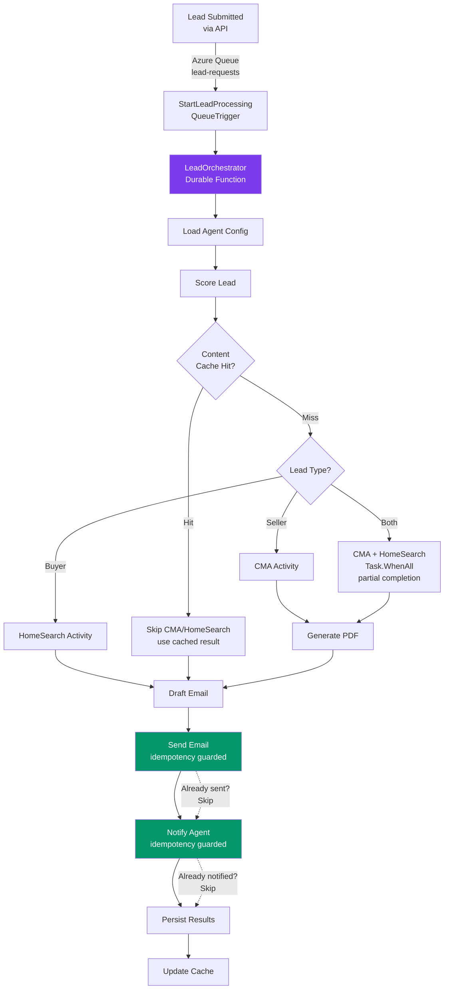

# Lead Pipeline — Durable Functions Flow

How a lead submission flows through the new Durable Functions orchestrator with parallel fan-out and idempotency guards.

```mermaid
flowchart TD
    Submit["Lead Submitted<br/>via API"] -->|"Azure Queue<br/>lead-requests"| Start["StartLeadProcessing<br/>QueueTrigger"]
    Start --> Orch["LeadOrchestrator<br/>Durable Function"]

    Orch --> Config["Load Agent Config"]
    Config --> Score["Score Lead"]
    Score --> Cache{"Content<br/>Cache Hit?"}

    Cache -->|"Hit"| Skip["Skip CMA/HomeSearch<br/>use cached result"]
    Cache -->|"Miss"| Type{"Lead Type?"}

    Type -->|"Seller"| CMA["CMA Activity"]
    Type -->|"Buyer"| HS["HomeSearch Activity"]
    Type -->|"Both"| Parallel["CMA + HomeSearch<br/>Task.WhenAll<br/>partial completion"]

    CMA --> PDF["Generate PDF"]
    Parallel --> PDF
    HS --> Draft
    Skip --> Draft["Draft Email"]
    PDF --> Draft

    Draft --> Send["Send Email<br/>idempotency guarded"]
    Send --> Notify["Notify Agent<br/>idempotency guarded"]
    Notify --> Persist["Persist Results"]
    Persist --> UpdateCache["Update Cache"]

    Send -.->|"Already sent?<br/>Skip"| Notify
    Notify -.->|"Already notified?<br/>Skip"| Persist

    style Orch fill:#7c3aed,color:#fff
    style Send fill:#059669,color:#fff
    style Notify fill:#059669,color:#fff
```
