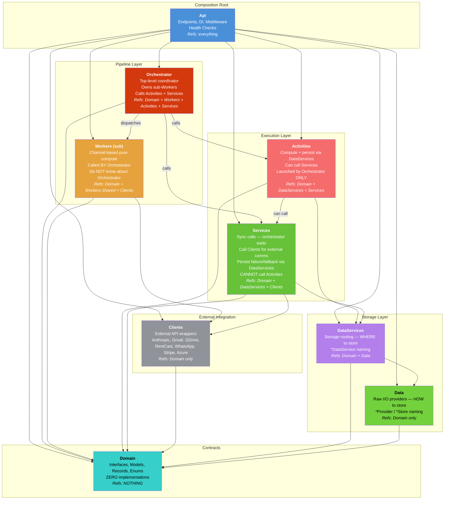
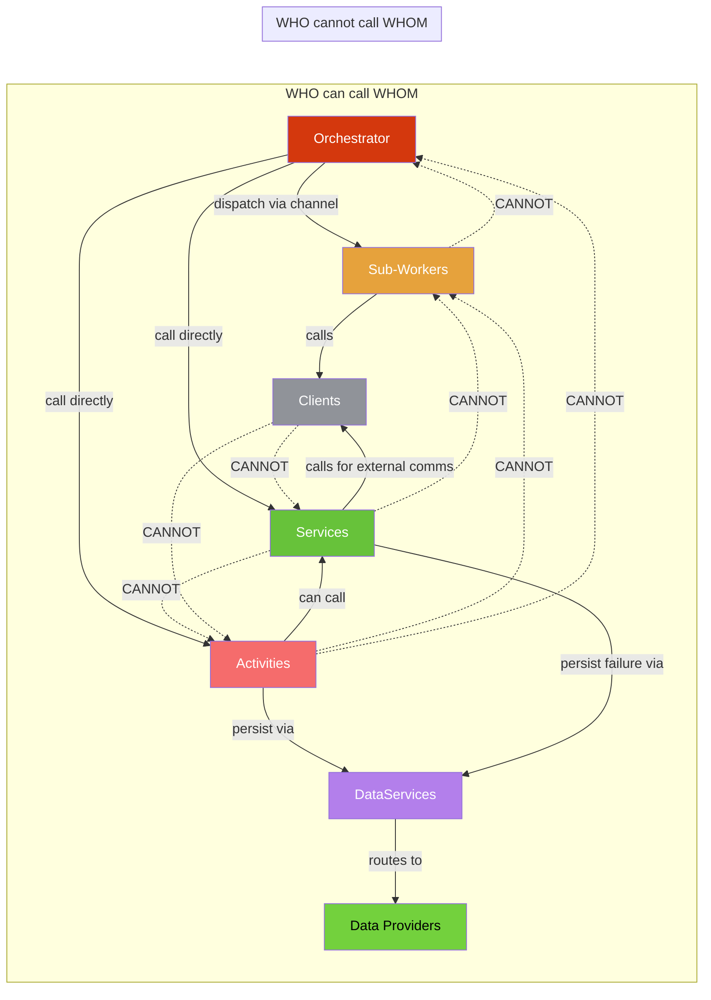
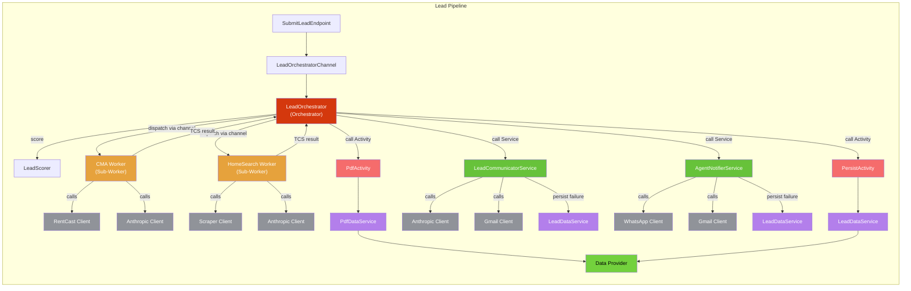
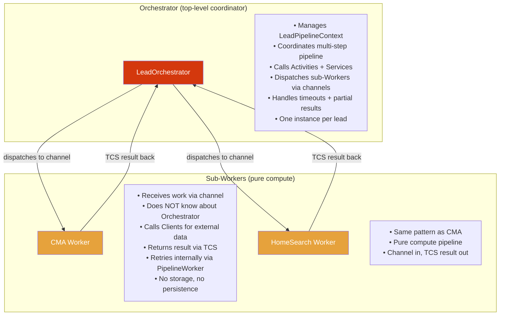

# Project Architecture

## Dependency Graph

## Call Direction Rules

## Lead Pipeline Flow

## Orchestrator vs Sub-Worker

## Layer Rules

| Layer | Purpose | Naming | Can Call | Cannot Call |
|-------|---------|--------|---------|-------------|
| **Api** | Composition root | `*Endpoint`, `*Middleware`, `*HealthCheck` | Everything (DI wiring) | — |
| **Orchestrator** | Multi-step coordinator | `*Orchestrator` | Sub-Workers, Activities, Services | — |
| **Sub-Workers** | Pure compute pipelines | `*Worker`, `*Channel` | Clients (external APIs) | Orchestrator, Activities, Services, DataServices |
| **Activities** | Compute + persist | `*Activity` | Services, DataServices | Workers, Orchestrator |
| **Services** | Sync business logic | `*Service` | Clients, DataServices | Activities, Workers, Orchestrator |
| **Clients** | External API wrappers | `*Client`, `*Sender` | Domain only | Everything else |
| **DataServices** | Storage routing (WHERE) | `*DataService` | Data providers | Clients, Workers, Services, Activities |
| **Data** | Raw I/O (HOW) | `*Provider`, `*Store` | Domain only | Everything else |
| **Domain** | Pure contracts | `I*`, records, enums | NOTHING | Implementations |

## Architecture Tests

All rules enforced by `RealEstateStar.Architecture.Tests`:

| Test Class | What it enforces |
|------------|-----------------|
| `DependencyTests` | Project reference constraints (who can reference whom) |
| `NamingConventionTests` | Class suffix enforcement per layer (*Service, *Activity, etc.) |
| `ProjectTaxonomyTests` | Cross-cutting layer boundary rules |
| `ApiCompositionRootTests` | Api stays thin (no *Service, no BackgroundService) |
| `LayerTests` | NetArchTest type-level rules |
