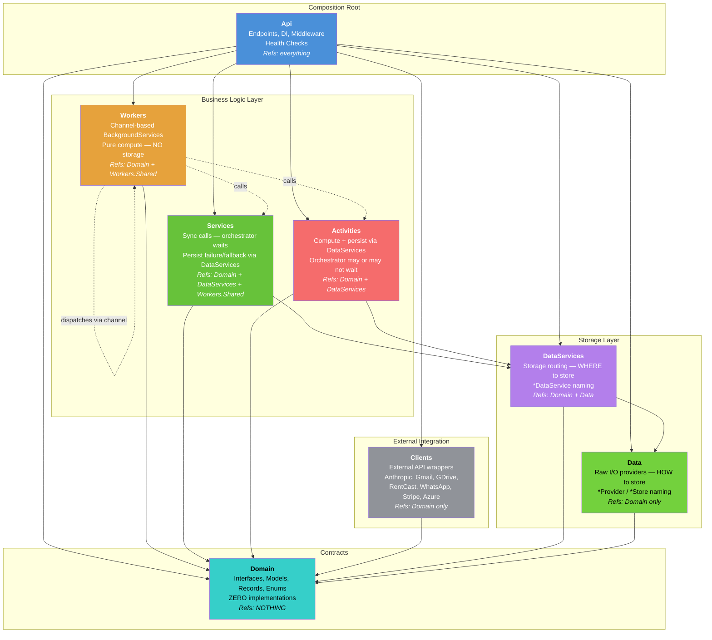
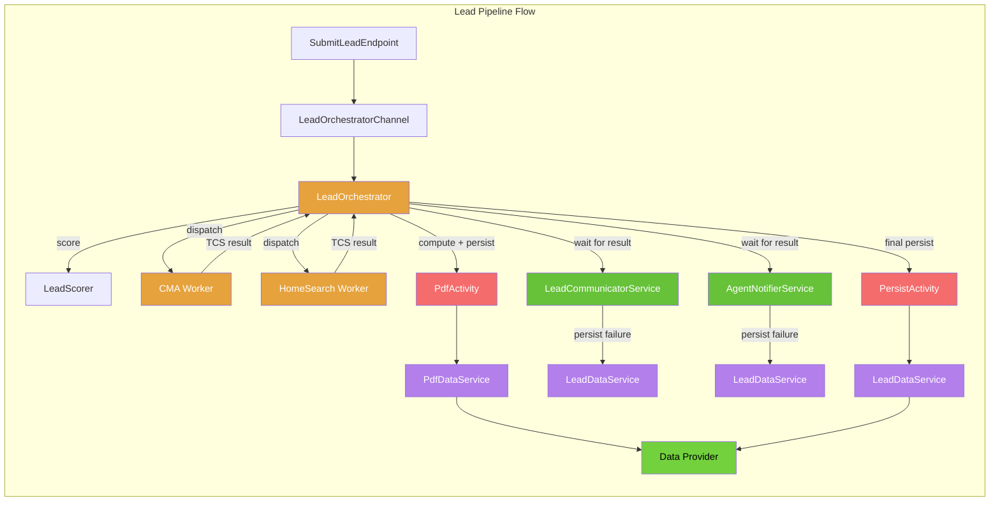

# Project Architecture

## Dependency Graph

## Lead Pipeline Flow

## Layer Rules

| Layer | Purpose | Naming | Allowed Deps | Forbidden |
|-------|---------|--------|-------------|-----------|
| **Api** | Composition root | `*Endpoint`, `*Middleware`, `*HealthCheck` | Everything | `*Service`, `*Worker`, `*Activity`, `BackgroundService` |
| **Workers** | Channel-based compute | `*Worker`, `*Channel`, `*Scorer`, `*Orchestrator` | Domain, Workers.Shared | Data, DataServices, Clients, Services |
| **Services** | Sync calls, orchestrator waits | `*Service` | Domain, DataServices, Workers.Shared | Data, Clients, Workers |
| **Activities** | Compute + persist | `*Activity` | Domain, DataServices | Data, Clients, Workers, Services |
| **Clients** | External API wrappers | `*Client`, `*Sender`, `*Refresher` | Domain | Everything else |
| **DataServices** | Storage routing (WHERE) | `*DataService`, `*Decorator` | Domain, Data | Clients, Workers, Services, Activities |
| **Data** | Raw I/O (HOW) | `*Provider`, `*Store` | Domain | Everything else |
| **Domain** | Pure contracts | `I*` (interfaces), records, enums | NOTHING | Implementations, Diagnostics, Renderers |

## Architecture Tests (72 passing)

All rules enforced by `RealEstateStar.Architecture.Tests`:
- `DependencyTests` — project reference constraints
- `NamingConventionTests` — class suffix enforcement per layer
- `ProjectTaxonomyTests` — cross-cutting layer boundary rules
- `ApiCompositionRootTests` — Api stays thin
- `LayerTests` — NetArchTest type-level rules
