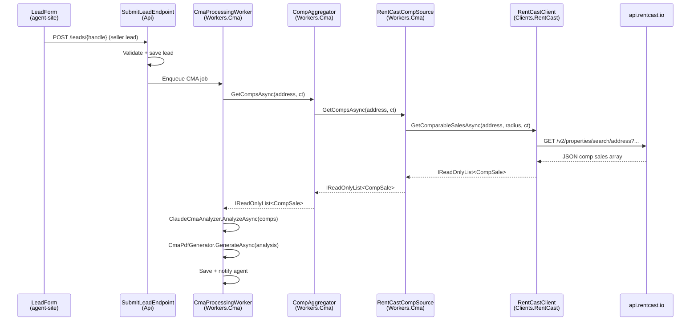

# RentCast Comp Flow

End-to-end flow showing how comparable sales data is fetched from RentCast
and used in the CMA pipeline.

## Overview

When a seller lead is submitted, the CMA pipeline calls `CompAggregator`,
which delegates to `RentCastCompSource`. That source calls `RentCastClient`
to retrieve structured comp data from the RentCast API. The results are
passed back to `ClaudeCmaAnalyzer` for valuation and PDF generation.

## Flow Diagram



## Component Responsibilities

| Component | Project | Responsibility |
|-----------|---------|----------------|
| `CompAggregator` | `Workers.Cma` | Orchestrates one or more comp sources; returns merged results |
| `RentCastCompSource` | `Workers.Cma` | Implements `ICompSource`; maps RentCast data to domain `CompSale` |
| `RentCastClient` | `Clients.RentCast` | HTTP client for api.rentcast.io; owns internal DTOs |
| `IRentCastClient` | `Domain` | Interface contract; no dependency on the client implementation |

## Dependency Path

```
Workers.Cma → Domain (IRentCastClient)
Clients.RentCast → Domain (IRentCastClient impl)
Api → Clients.RentCast (DI wiring)
```

Follows the standard architecture rule: Workers depend only on Domain interfaces;
Api wires the concrete implementation via DI.

## Configuration

`RentCast:ApiKey` is required at startup. Set via:
- Local dev: `appsettings.Development.json` or user secrets
- Production: Azure Container Apps secret `rentcast-api-key` (see deploy-api.yml)

## Grafana Metrics

Monitor these metrics in Grafana Cloud (emitted by `RentCastClient`):

| Metric | Type | Description |
|--------|------|-------------|
| `rentcast.calls_total` | Counter | Total API calls made to RentCast |
| `rentcast.calls_failed` | Counter | Failed calls (non-2xx or network error) |
| `rentcast.comps_returned` | Histogram | Number of comps returned per call |
| `rentcast.call_duration_ms` | Histogram | Round-trip latency to api.rentcast.io |

Use these to alert on elevated failure rates or degraded comp counts that
would produce poor-quality CMA reports.
