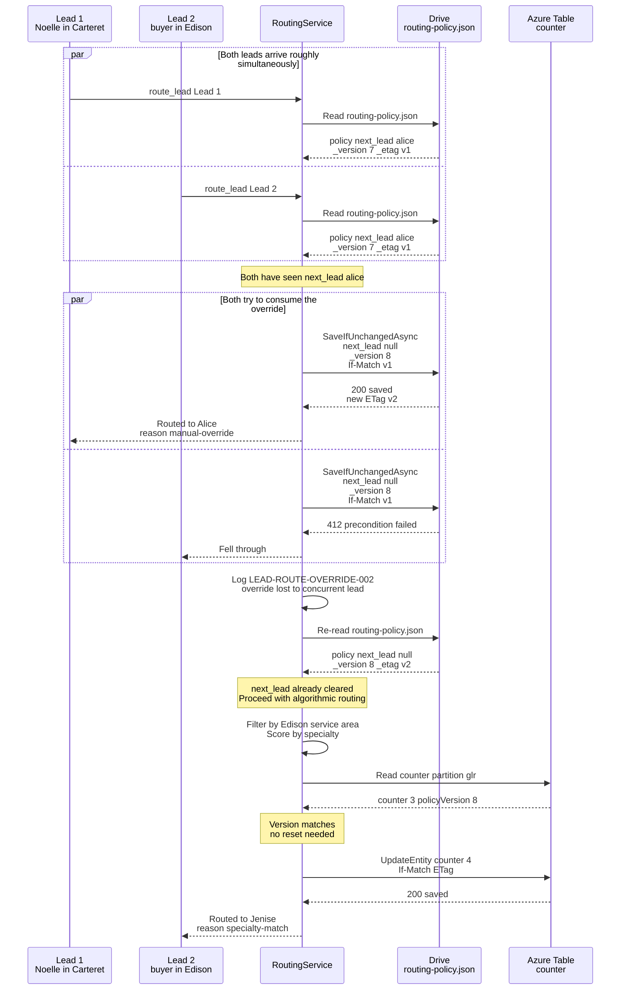

# Routing policy next_lead CAS consumption

Two leads arriving simultaneously at a brokerage with `next_lead: alice` set in `routing-policy.json`. Only one lead goes to Alice; the other falls through to algorithmic routing via CAS on `SaveIfUnchangedAsync`.

