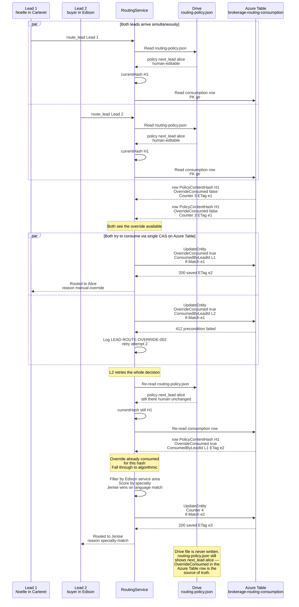

# Routing policy next_lead CAS consumption

Two leads arriving simultaneously at a brokerage with `next_lead: alice` set in Drive's `routing-policy.json`. Only one lead goes to Alice; the other falls through to algorithmic routing. The CAS is on the Azure Table **consumption row** — Drive is read-only on this path because `IFileStorageProvider` has no conditional-write primitive.

**Why the CAS lives in Azure Table and not in Drive**: `GDriveApiClient.UploadAsync` is an unconditional write — there is no If-Match header, no revision precondition, no way to atomically observe-and-mutate a field in Drive. Moving both mutations (override consumption AND counter increment) onto a single Azure Table row keyed by the policy's content hash gives us real ETag CAS via the same `SaveIfUnchangedAsync` primitive already implemented in `AzureTableTokenStore`. Drive remains the human-authored policy; the Azure Table row decides who gets the lead.

**How a brokerage owner re-issues the override**: they edit `routing-policy.json` in Drive — even a no-op save counts, because `_last_edited_at` changes, which changes the content hash, which realigns the Azure Table row on the next routing decision with `OverrideConsumed = false`.
