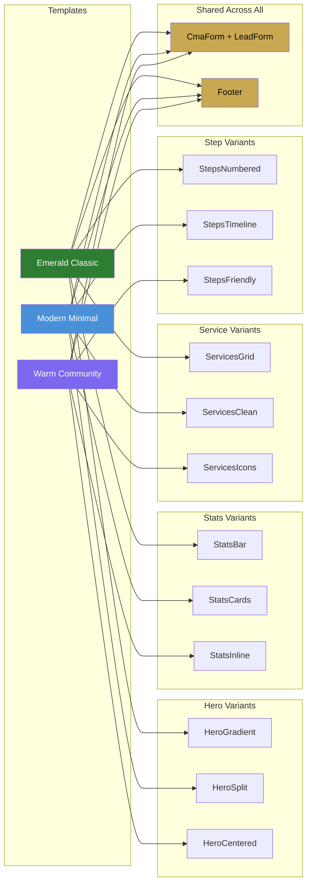

# Section Variant Architecture

How section categories map to template-specific variants. Each template picks one variant per category. Shared sections are identical across all templates.

```mermaid
flowchart LR
    subgraph Templates ["Templates"]
        EC["Emerald Classic"]
        MM["Modern Minimal"]
        WC["Warm Community"]
    end

    subgraph Heroes ["Hero Variants"]
        HG["HeroGradient"]
        HS["HeroSplit"]
        HC["HeroCentered"]
    end

    subgraph Stats ["Stats Variants"]
        SB["StatsBar"]
        SC["StatsCards"]
        SI["StatsInline"]
    end

    subgraph Services ["Service Variants"]
        SG["ServicesGrid"]
        SCl["ServicesClean"]
        SIc["ServicesIcons"]
    end

    subgraph Steps ["Step Variants"]
        SN["StepsNumbered"]
        ST["StepsTimeline"]
        SF["StepsFriendly"]
    end

    subgraph Shared ["Shared Across All"]
        CF["CmaForm + LeadForm"]
        FT["Footer"]
    end

    EC --> HG
    EC --> SB
    EC --> SG
    EC --> SN

    MM --> HS
    MM --> SC
    MM --> SCl
    MM --> ST

    WC --> HC
    WC --> SI
    WC --> SIc
    WC --> SF

    EC --> CF
    MM --> CF
    WC --> CF

    EC --> FT
    MM --> FT
    WC --> FT

    style EC fill:#2E7D32,color:#fff
    style MM fill:#4A90D9,color:#fff
    style WC fill:#7B68EE,color:#fff
    style CF fill:#C8A951,color:#000
    style FT fill:#C8A951,color:#000
```
