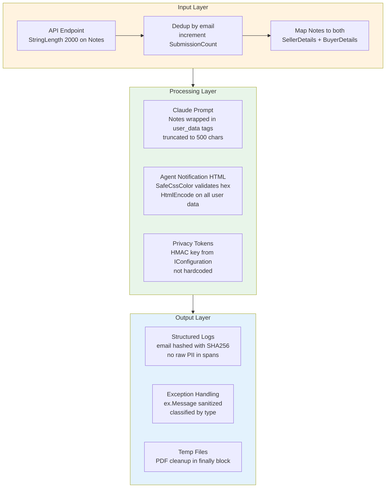

# Security Hardening Layers

Defense-in-depth across the lead pipeline — input sanitization, output encoding, secret management.

```mermaid
flowchart TD
    subgraph Input ["Input Layer"]
        API["API Endpoint<br/>StringLength 2000 on Notes"]
        API --> Dedup["Dedup by email<br/>increment SubmissionCount"]
        Dedup --> Map["Map Notes to both<br/>SellerDetails + BuyerDetails"]
    end

    subgraph Processing ["Processing Layer"]
        Prompt["Claude Prompt<br/>Notes wrapped in user_data tags<br/>truncated to 500 chars"]
        CSS["Agent Notification HTML<br/>SafeCssColor validates hex<br/>HtmlEncode on all user data"]
        HMAC["Privacy Tokens<br/>HMAC key from IConfiguration<br/>not hardcoded"]
    end

    subgraph Output ["Output Layer"]
        Logs["Structured Logs<br/>email hashed with SHA256<br/>no raw PII in spans"]
        Errors["Exception Handling<br/>ex.Message sanitized<br/>classified by type"]
        Temp["Temp Files<br/>PDF cleanup in finally block"]
    end

    Input --> Processing --> Output

    style Input fill:#fff3e0
    style Processing fill:#e8f5e9
    style Output fill:#e3f2fd
```
