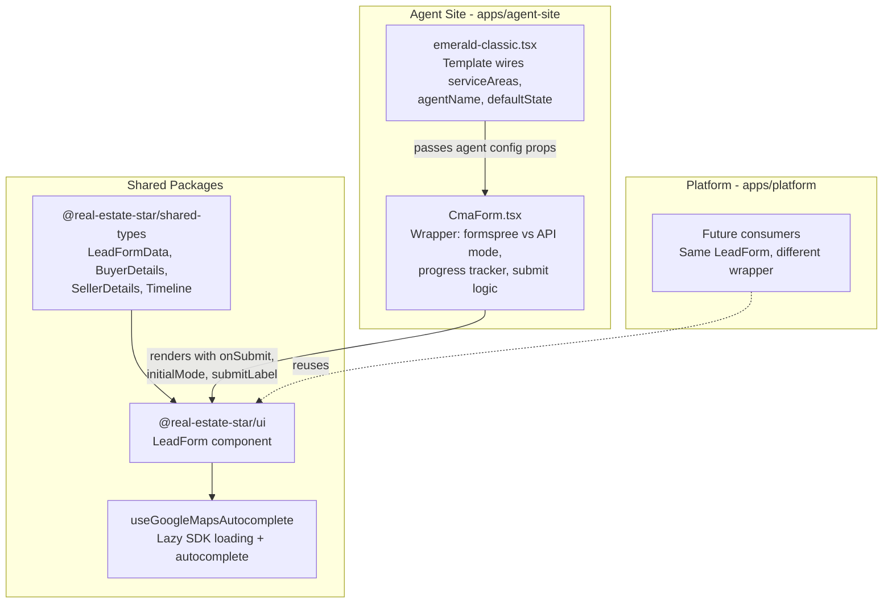

# Shared LeadForm Component Hierarchy

How the shared LeadForm package is consumed by agent sites and the platform.

```mermaid
flowchart TD
    subgraph Packages ["Shared Packages"]
        ST["@real-estate-star/shared-types<br/>LeadFormData, BuyerDetails,<br/>SellerDetails, Timeline"]
        UI["@real-estate-star/ui<br/>LeadForm component"]
        Hook["useGoogleMapsAutocomplete<br/>Lazy SDK loading + autocomplete"]
    end

    subgraph AgentSite ["Agent Site - apps/agent-site"]
        EC["emerald-classic.tsx<br/>Template wires serviceAreas,<br/>agentName, defaultState"]
        CF["CmaForm.tsx<br/>Wrapper: formspree vs API mode,<br/>progress tracker, submit logic"]
    end

    subgraph Platform ["Platform - apps/platform"]
        Future["Future consumers<br/>Same LeadForm, different wrapper"]
    end

    ST --> UI
    UI --> Hook
    EC -->|"passes agent config props"| CF
    CF -->|"renders with onSubmit,<br/>initialMode, submitLabel"| UI
    Future -.->|"reuses"| UI
```
