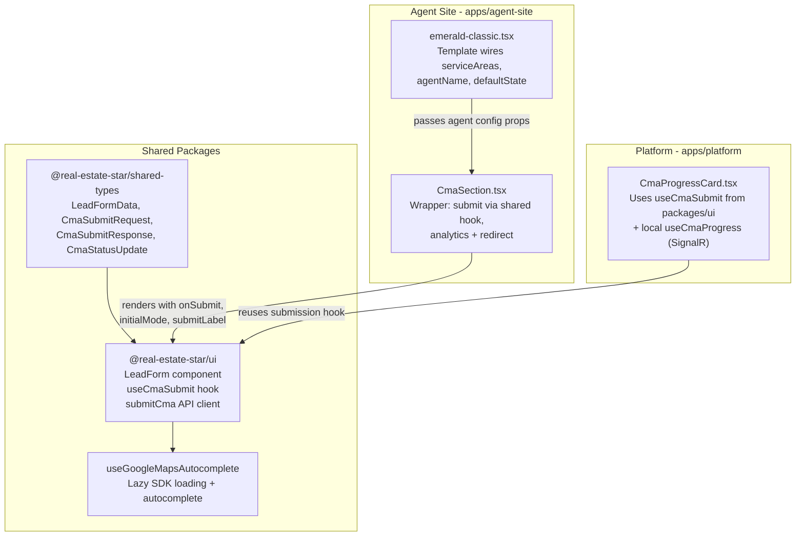

# Shared LeadForm Component Hierarchy

How the shared LeadForm and CMA submission are consumed by agent sites and the platform.

```mermaid
flowchart TD
    subgraph Packages ["Shared Packages"]
        ST["@real-estate-star/shared-types<br/>LeadFormData, CmaSubmitRequest,<br/>CmaSubmitResponse, CmaStatusUpdate"]
        UI["@real-estate-star/ui<br/>LeadForm component<br/>useCmaSubmit hook<br/>submitCma API client"]
        Hook["useGoogleMapsAutocomplete<br/>Lazy SDK loading + autocomplete"]
    end

    subgraph AgentSite ["Agent Site - apps/agent-site"]
        EC["emerald-classic.tsx<br/>Template wires serviceAreas,<br/>agentName, defaultState"]
        CS["CmaSection.tsx<br/>Wrapper: submit via shared hook,<br/>analytics + redirect"]
    end

    subgraph Platform ["Platform - apps/platform"]
        CPC["CmaProgressCard.tsx<br/>Uses useCmaSubmit from packages/ui<br/>+ local useCmaProgress (SignalR)"]
    end

    ST --> UI
    UI --> Hook
    EC -->|"passes agent config props"| CS
    CS -->|"renders with onSubmit,<br/>initialMode, submitLabel"| UI
    CPC -->|"reuses submission hook"| UI
```
