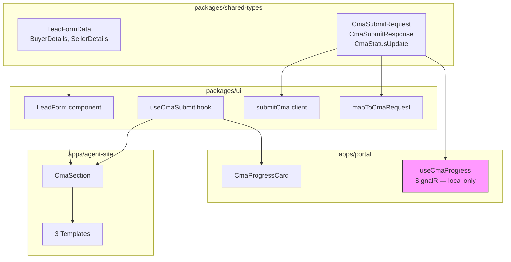

# Shared Package Dependencies

How packages/ui and shared-types are consumed by apps after the CMA integration.

```mermaid
flowchart TD
    subgraph "packages/shared-types"
        LFD["LeadFormData<br/>BuyerDetails, SellerDetails"]
        CMA_T["CmaSubmitRequest<br/>CmaSubmitResponse<br/>CmaStatusUpdate"]
    end

    subgraph "packages/ui"
        LF["LeadForm component"]
        Hook["useCmaSubmit hook"]
        Client["submitCma client"]
        Mapper["mapToCmaRequest"]
    end

    subgraph "apps/agent-site"
        CS["CmaSection"]
        Templates["3 Templates"]
    end

    subgraph "apps/portal"
        CPC["CmaProgressCard"]
        Progress["useCmaProgress<br/>SignalR — local only"]
    end

    LFD --> LF
    CMA_T --> Client
    CMA_T --> Mapper
    CMA_T --> Progress

    LF --> CS
    Hook --> CS
    Hook --> CPC
    CS --> Templates

    style Progress fill:#f9f,stroke:#333
```
