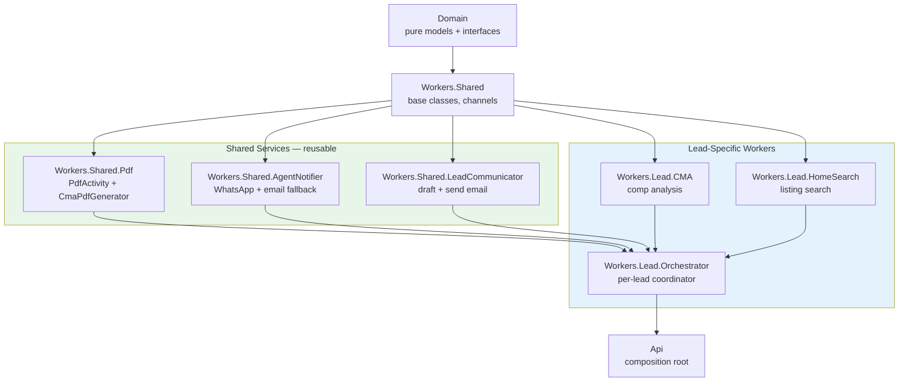

# Shared Project Dependencies

The worker architecture splits into shared services (reusable by future pipelines) and lead-specific workers.

```mermaid
flowchart TD
    Domain["Domain<br/>pure models + interfaces"]
    Shared["Workers.Shared<br/>base classes, channels"]

    Domain --> Shared

    subgraph SharedServices ["Shared Services — reusable"]
        Pdf["Workers.Shared.Pdf<br/>PdfActivity + CmaPdfGenerator"]
        AN["Workers.Shared.AgentNotifier<br/>WhatsApp + email fallback"]
        LC["Workers.Shared.LeadCommunicator<br/>draft + send email"]
    end

    subgraph LeadWorkers ["Lead-Specific Workers"]
        CMA["Workers.Lead.CMA<br/>comp analysis"]
        HS["Workers.Lead.HomeSearch<br/>listing search"]
        Orch["Workers.Lead.Orchestrator<br/>per-lead coordinator"]
    end

    Shared --> Pdf
    Shared --> AN
    Shared --> LC
    Shared --> CMA
    Shared --> HS

    Pdf --> Orch
    AN --> Orch
    LC --> Orch
    CMA --> Orch
    HS --> Orch

    Orch --> Api["Api<br/>composition root"]

    style SharedServices fill:#e8f5e9
    style LeadWorkers fill:#e3f2fd
```
