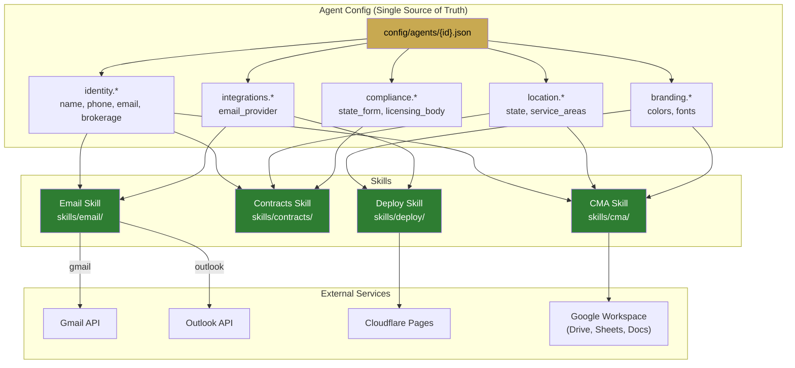
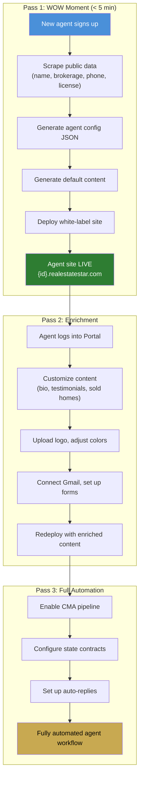

# Skill Integration Architecture

## Config-Driven Skill System

## Agent Onboarding Flow

## Skill → Config Field Mapping

| Skill | identity.* | location.* | branding.* | integrations.* | compliance.* |
|-------|-----------|-----------|-----------|---------------|-------------|
| **CMA** | name, phone, email, brokerage, title, tagline, languages | state, service_areas | primary_color, accent_color, font_family | email_provider | — |
| **Contracts** | name, title, license_id, brokerage, brokerage_id | state | — | — | state_form, licensing_body, disclosure_requirements |
| **Email** | name, title, phone, email, brokerage, tagline, languages | — | — | email_provider | — |
| **Deploy** | website | — | primary_color, secondary_color, accent_color, font_family | hosting | — |
