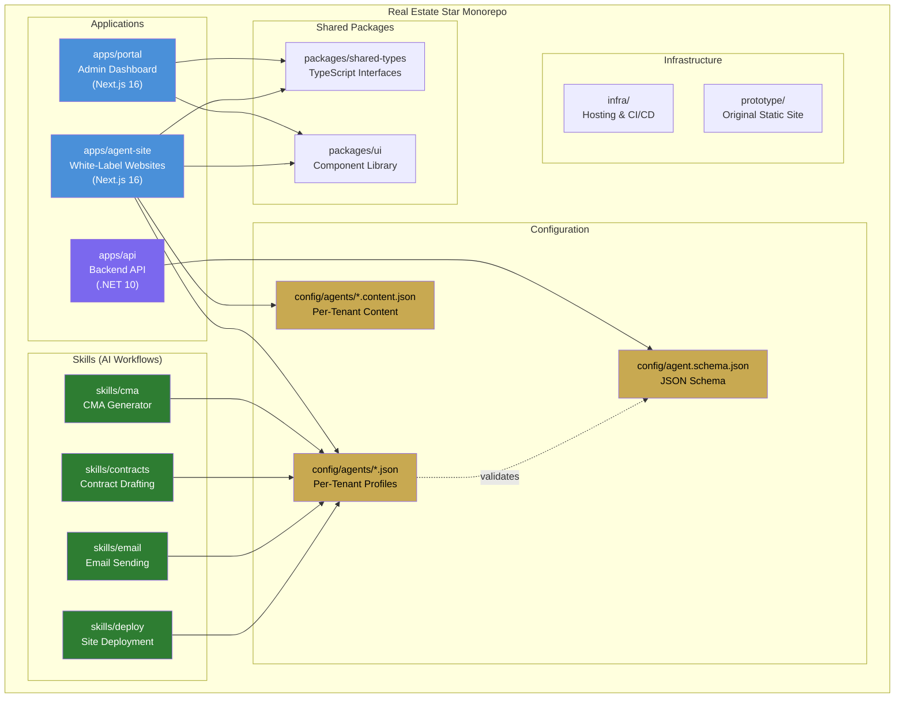

# System Architecture Overview

## Monorepo Structure

## Technology Stack

| Layer | Technology | Purpose |
|-------|-----------|---------|
| Frontend | Next.js 16, React 19, TypeScript | Portal + Agent Sites |
| Styling | Tailwind CSS 4, CSS Variables | Responsive, per-agent branding |
| Backend | .NET 10, C# | API, PDF generation, integrations |
| PDF | QuestPDF | CMA report generation |
| Config | JSON Schema (2020-12) | Agent profile validation |
| Hosting | Cloudflare Pages | Agent site CDN + edge rendering |
| Email | Gmail / Outlook / SMTP | Multi-provider via config |
| CI/CD | GitHub Actions | Build, test, deploy |
| PM | GitHub Issues + Projects | Free project management |
