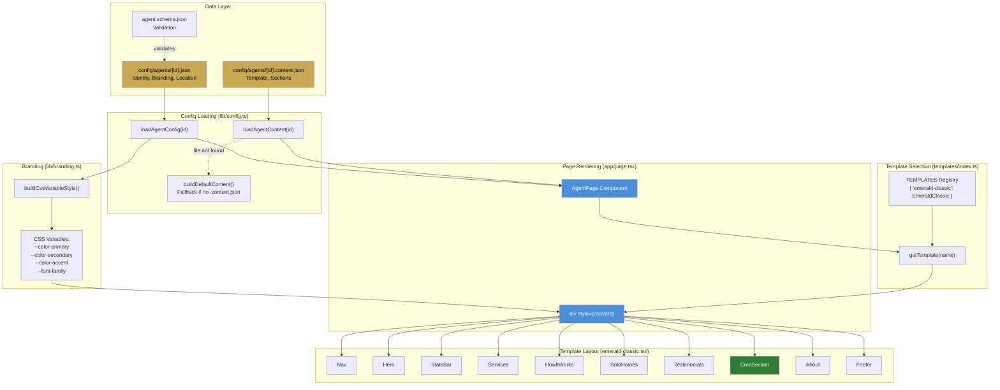
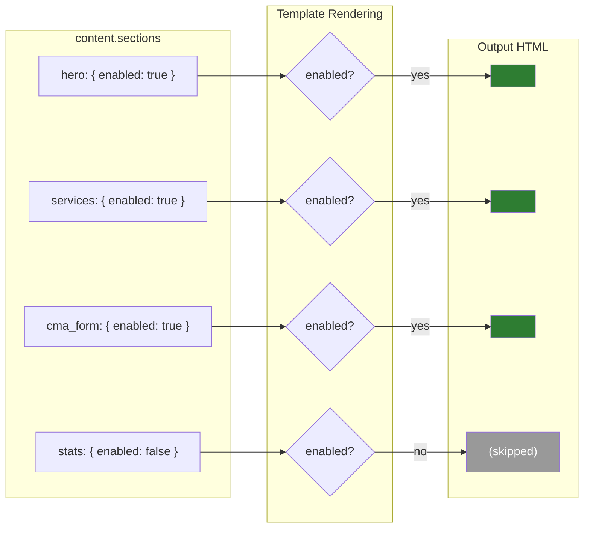
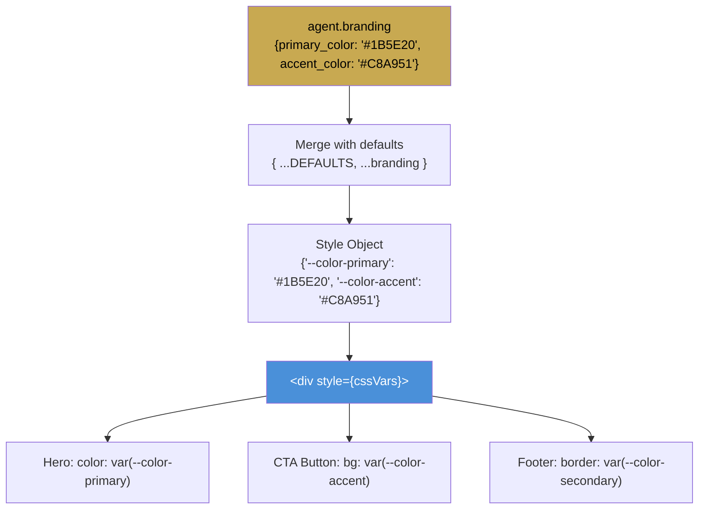

# Template Rendering Architecture

## Rendering Pipeline

```mermaid
flowchart TD
    subgraph "Data Layer"
        agentjson["config/agents/{id}.json<br/>Identity, Branding, Location"]
        contentjson["config/agents/{id}.content.json<br/>Template, Sections"]
        schema["agent.schema.json<br/>Validation"]
    end

    subgraph "Config Loading (lib/config.ts)"
        loadConfig["loadAgentConfig(id)"]
        loadContent["loadAgentContent(id)"]
        defaults["buildDefaultContent()<br/>Fallback if no .content.json"]
    end

    subgraph "Template Selection (templates/index.ts)"
        registry["TEMPLATES Registry<br/>{ 'emerald-classic': EmeraldClassic }"]
        getTemplate["getTemplate(name)"]
    end

    subgraph "Branding (lib/branding.ts)"
        cssVars["buildCssVariableStyle()"]
        vars["CSS Variables:<br/>--color-primary<br/>--color-secondary<br/>--color-accent<br/>--font-family"]
    end

    subgraph "Page Rendering (app/page.tsx)"
        page["AgentPage Component"]
        wrapper["div style={cssVars}"]
    end

    subgraph "Template Layout (emerald-classic.tsx)"
        nav["Nav"]
        hero["Hero"]
        stats["StatsBar"]
        services["Services"]
        how["HowItWorks"]
        sold["SoldHomes"]
        testimonials["Testimonials"]
        cmaform["CmaSection"]
        about["About"]
        footer["Footer"]
    end

    agentjson --> loadConfig
    contentjson --> loadContent
    loadContent -.->|file not found| defaults
    schema -.->|validates| agentjson

    loadConfig --> page
    loadContent --> page
    page --> getTemplate
    registry --> getTemplate
    loadConfig --> cssVars
    cssVars --> vars
    vars --> wrapper

    getTemplate --> wrapper
    wrapper --> nav
    wrapper --> hero
    wrapper --> stats
    wrapper --> services
    wrapper --> how
    wrapper --> sold
    wrapper --> testimonials
    wrapper --> cmaform
    wrapper --> about
    wrapper --> footer

    style agentjson fill:#C8A951,color:#000
    style contentjson fill:#C8A951,color:#000
    style page fill:#4A90D9,color:#fff
    style wrapper fill:#4A90D9,color:#fff
    style cmaform fill:#2E7D32,color:#fff
```

## Section Toggle System

Each section in `content.json` has an `enabled` boolean flag:

```mermaid
flowchart LR
    subgraph "content.sections"
        hero_cfg["hero: { enabled: true }"]
        stats_cfg["stats: { enabled: false }"]
        services_cfg["services: { enabled: true }"]
        cma_cfg["cma_form: { enabled: true }"]
    end

    subgraph "Template Rendering"
        hero_check{enabled?}
        stats_check{enabled?}
        services_check{enabled?}
        cma_check{enabled?}
    end

    subgraph "Output HTML"
        hero_html["<Hero />"]
        services_html["<Services />"]
        cma_html["<CmaSection />"]
        skip["(skipped)"]
    end

    hero_cfg --> hero_check
    stats_cfg --> stats_check
    services_cfg --> services_check
    cma_cfg --> cma_check

    hero_check -->|yes| hero_html
    stats_check -->|no| skip
    services_check -->|yes| services_html
    cma_check -->|yes| cma_html

    style hero_html fill:#2E7D32,color:#fff
    style services_html fill:#2E7D32,color:#fff
    style cma_html fill:#2E7D32,color:#fff
    style skip fill:#999,color:#fff
```

## CSS Variable Cascade

```mermaid
flowchart TD
    config["agent.branding<br/>{primary_color: '#1B5E20', accent_color: '#C8A951'}"]
    merge["Merge with defaults<br/>{ ...DEFAULTS, ...branding }"]
    style_obj["Style Object<br/>{'--color-primary': '#1B5E20', '--color-accent': '#C8A951'}"]
    wrapper_div["&lt;div style={cssVars}&gt;"]
    child1["Hero: color: var(--color-primary)"]
    child2["CTA Button: bg: var(--color-accent)"]
    child3["Footer: border: var(--color-secondary)"]

    config --> merge --> style_obj --> wrapper_div
    wrapper_div --> child1
    wrapper_div --> child2
    wrapper_div --> child3

    style config fill:#C8A951,color:#000
    style wrapper_div fill:#4A90D9,color:#fff
```
