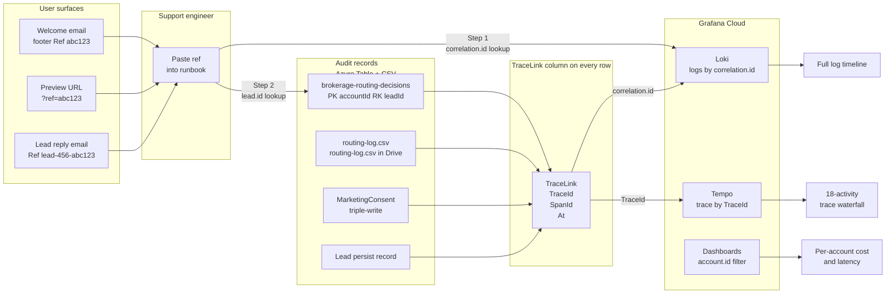

# Trace-to-audit linking for support

How the R5 `TraceLink` pattern lets a support engineer reconstruct the full pipeline trace for any lead, routing decision, or consent record in under 60 seconds.

**Why it matters**: at scale, every support query is some form of "this agent said X didn't work, what happened?" Without a first-class link from business records back to traces, answering that means grepping logs by agent handle or email — which stops working at around 1000 brokerages. R5 commits to a reconstruction path that works via a single shared ID.



**The `TraceLink` record** is a sibling column on every audit Azure Table row and the last column of every audit CSV:

```csharp
public sealed record TraceLink(
    string TraceId,      // W3C traceparent trace-id, 16-byte hex
    string SpanId,       // 8-byte hex
    DateTimeOffset At    // when this span was closed
);
```

It is populated from `Activity.Current?.Context` at the moment of persist, so the trace that produced the record is always discoverable from the record itself. Architecture test `AuditRecords_HaveTraceLink` asserts every audit DTO has the field.

**Inbound user surfaces** carry the correlation ID visibly so support doesn't have to ask the agent to find it:

1. **Welcome email footer** — in addition to "view your site," the footer includes a monospace `Ref: {correlationId}` line. Support asks the agent to paste it.
2. **Preview URL** — `https://preview.jenisesellsnj.com/?ref={correlationId}` (cookie-based auth, query param is display-only).
3. **Lead reply email** — the auto-draft email's transactional footer includes `Ref: {leadId}-{correlationId}`.

**Support runbook** (new, target `docs/runbooks/trace-reconstruction.md`):

1. Given a correlation ID `abc123`: run `logcli query '{component="api"} | json | correlation_id="abc123"' --limit=200` — returns every log line from that request across every service.
2. Given a lead ID: look up `brokerage-routing-decisions` partition `{accountId}` row `{leadId}` — the `TraceLink.TraceId` field is the trace to pull from Grafana Tempo.
3. Given an agent complaint about a missing site feature: look up `account.json` in Drive for `_activation.last_correlation_id` (a new field added by this spec), then pull the orchestrator span by that ID.

**Why this shape and not another**: the alternative is grepping logs by agent handle or email. That requires either a full-text-indexed log store (expensive at Grafana Cloud billing tiers) or a secondary index per attribute (infrastructure nobody wants to maintain). `correlation.id` and `trace.id` are both cheap sharding keys — they're short, bounded, and already used as span attributes. Making them user-visible turns support from "30-minute log dive" into "paste the ref, click the link." This is what world-class observability looks like at scale.

See design spec §16.10 for the full pattern, §5.8 for the correlation ID propagation via `Baggage`, and §18.7 for the SLOs this enables (orchestration success rate can be defined on the orchestrator span, not inferred from activity spans).
