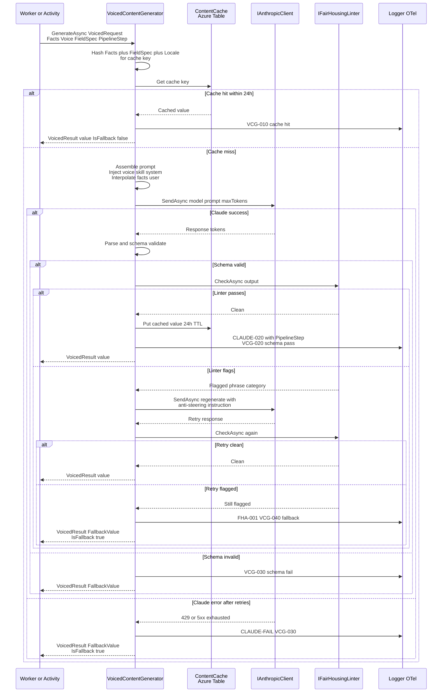

# Voiced content generator lifecycle

The request/response lifecycle of a single `FieldSpec` flowing through `IVoicedContentGenerator`, including cache, schema validation, fair housing linter, retry, and fallback.

