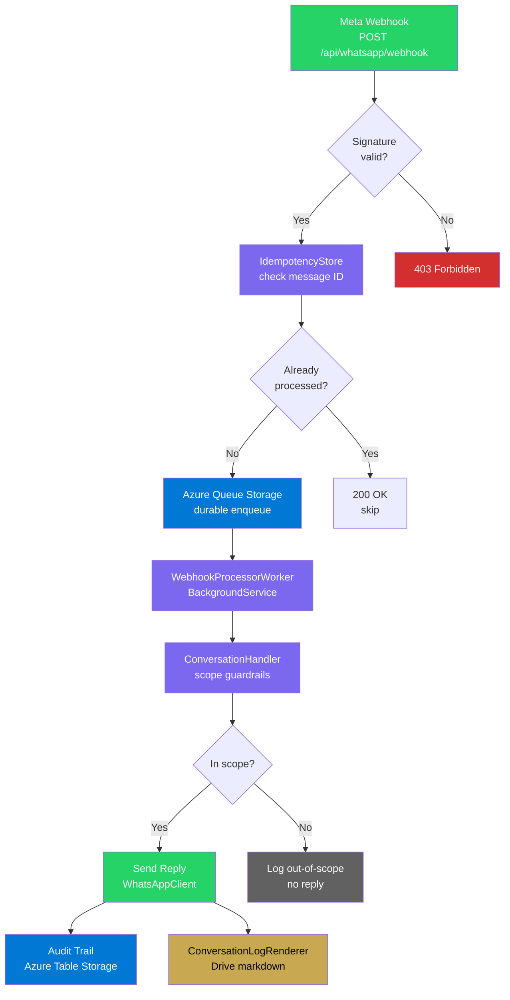

# WhatsApp Message Flow

How inbound WhatsApp messages are verified, deduplicated, and processed through the conversation handler.

```mermaid
flowchart TD
    Meta["Meta Webhook<br/>POST /api/whatsapp/webhook"]
    Verify{"Signature<br/>valid?"}
    Dedup["IdempotencyStore<br/>check message ID"]
    DupCheck{"Already<br/>processed?"}
    Queue["Azure Queue Storage<br/>durable enqueue"]
    Worker["WebhookProcessorWorker<br/>BackgroundService"]
    Conv["ConversationHandler<br/>scope guardrails"]
    Scope{"In scope?"}
    Reply["Send Reply<br/>WhatsAppClient"]
    Audit["Audit Trail<br/>Azure Table Storage"]
    Log["ConversationLogRenderer<br/>Drive markdown"]
    Skip["Log out-of-scope<br/>no reply"]

    Meta --> Verify
    Verify -->|"No"| Reject["403 Forbidden"]
    Verify -->|"Yes"| Dedup
    Dedup --> DupCheck
    DupCheck -->|"Yes"| Ack["200 OK<br/>skip"]
    DupCheck -->|"No"| Queue
    Queue --> Worker
    Worker --> Conv
    Conv --> Scope
    Scope -->|"Yes"| Reply
    Scope -->|"No"| Skip
    Reply --> Audit
    Reply --> Log

    style Meta fill:#25D366,color:#fff
    style Queue fill:#0078D4,color:#fff
    style Worker fill:#7B68EE,color:#fff
    style Conv fill:#7B68EE,color:#fff
    style Reply fill:#25D366,color:#fff
    style Audit fill:#0078D4,color:#fff
    style Log fill:#C8A951,color:#000
    style Dedup fill:#7B68EE,color:#fff
    style Reject fill:#D32F2F,color:#fff
    style Skip fill:#616161,color:#fff
```
