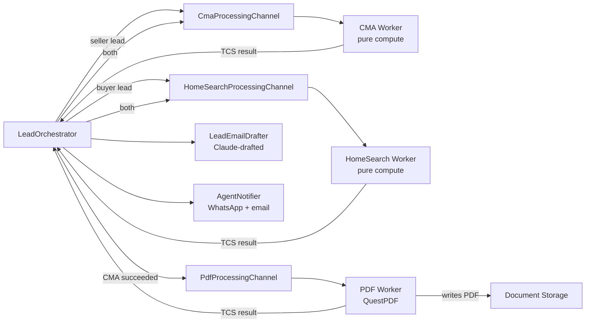

# Worker Dispatch Routing

The orchestrator dispatches CMA and HomeSearch workers based on lead type, collects results via TaskCompletionSource, then dispatches PDF generation if CMA succeeded.

```mermaid
flowchart LR
    Orch["LeadOrchestrator"] -->|"seller lead"| CmaChannel["CmaProcessingChannel"]
    Orch -->|"buyer lead"| HsChannel["HomeSearchProcessingChannel"]
    Orch -->|"both"| CmaChannel
    Orch -->|"both"| HsChannel

    CmaChannel --> CmaWorker["CMA Worker<br/>pure compute"]
    HsChannel --> HsWorker["HomeSearch Worker<br/>pure compute"]

    CmaWorker -->|"TCS result"| Orch
    HsWorker -->|"TCS result"| Orch

    Orch -->|"CMA succeeded"| PdfChannel["PdfProcessingChannel"]
    PdfChannel --> PdfWorker["PDF Worker<br/>QuestPDF"]
    PdfWorker -->|"writes PDF"| Storage["Document Storage"]
    PdfWorker -->|"TCS result"| Orch

    Orch --> Email["LeadEmailDrafter<br/>Claude-drafted"]
    Orch --> Agent["AgentNotifier<br/>WhatsApp + email"]
```
