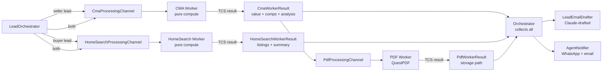

# Worker Dispatch Routing

The orchestrator dispatches CMA and HomeSearch workers based on lead type, then collects results via TaskCompletionSource.

```mermaid
flowchart LR
    Orch["LeadOrchestrator"] -->|"seller lead"| CmaChannel["CmaProcessingChannel"]
    Orch -->|"buyer lead"| HsChannel["HomeSearchProcessingChannel"]
    Orch -->|"both"| CmaChannel
    Orch -->|"both"| HsChannel

    CmaChannel --> CmaWorker["CMA Worker<br/>pure compute"]
    HsChannel --> HsWorker["HomeSearch Worker<br/>pure compute"]

    CmaWorker -->|"TCS result"| CmaResult["CmaWorkerResult<br/>value + comps + analysis"]
    HsWorker -->|"TCS result"| HsResult["HomeSearchWorkerResult<br/>listings + summary"]

    CmaResult --> PdfChannel["PdfProcessingChannel"]
    PdfChannel --> PdfWorker["PDF Worker<br/>QuestPDF"]
    PdfWorker -->|"TCS result"| PdfResult["PdfWorkerResult<br/>storage path"]

    CmaResult --> Orch2["Orchestrator<br/>collects all"]
    HsResult --> Orch2
    PdfResult --> Orch2

    Orch2 --> Email["LeadEmailDrafter<br/>Claude-drafted"]
    Orch2 --> Agent["AgentNotifier<br/>WhatsApp + email"]
```
