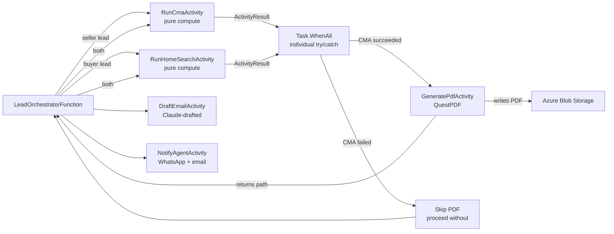

# Worker Dispatch Routing

The orchestrator dispatches CMA and HomeSearch activities in parallel via `ctx.CallActivityAsync`, collects results with `Task.WhenAll`, then dispatches PDF generation if CMA succeeded.

