# Plan: Language as a First-Class Dimension

## Requirements Restatement

Integrate multi-language support as a **cross-cutting dimension** across the entire Real Estate Star system:

1. **Agent language capability** — Extract per-language voice, personality, catchphrases, marketing style, brand voice, and coaching insights during activation. A bilingual agent's Spanish catchphrases come from their *actual Spanish emails*, not translated English.
2. **Contact language preference** — Capture locale at lead submission, use it to select the right per-language artifacts for emails, CMA reports, follow-ups, and welcome messages.
3. **Frontend i18n** — Fix PR #123 CI failure and wire locale into the lead form submission payload.
4. **Observability** — Track language across all telemetry: spans, counters, structured logs. Language becomes a dimension on every metric.
5. **Lead follow-ups** — Language must flow into the follow-up notification system (currently dormant `FollowUpReminder` type exists but isn't triggered). When follow-ups are built, they must respect contact locale.
6. **Language detection** — Reliable detection for emails, documents, and website content to partition data before per-language extraction.
7. **Marketing, brand, and coaching analysis** — All Phase 2 synthesis workers that analyze communication patterns must consider language as a dimension: marketing campaigns in Spanish are different from English ones, brand positioning may have Spanish-specific taglines, and coaching insights should account for bilingual pipeline gaps.
8. **Documentation** — Update architecture diagrams, onboarding guide, CLAUDE.md, agent schema docs, and create formal plan/spec documents.

**Two axes, one system:** The activation pipeline produces per-language artifacts. The lead pipeline consumes them based on contact preference.

---

## Risks

| Risk | Severity | Mitigation |
|------|----------|------------|
| Insufficient non-English email data for voice extraction | HIGH | Low-confidence flag per locale; fallback to Claude translation of English skill with disclaimer |
| Language detection accuracy on short text (< 50 chars) | MEDIUM | Character-set heuristic for short text, Claude Haiku batch for longer; always default to "en" on ambiguity |
| Claude API cost increase (N workers × M languages) | MEDIUM | Only run per-language extraction for languages in `agent.languages`; batch short texts; reuse Phase 1 data |
| Breaking existing tests with model changes | LOW | All new fields are optional (`string?`); existing tests unchanged |
| Marketing keyword filter is English-only | MEDIUM | Add Spanish keyword equivalents; extensible `Dictionary<string, string[]>` pattern for future languages |
| Follow-up system not yet built | LOW | Plan captures language requirements now; implementation deferred. Wire locale into `FollowUpReminder` WhatsApp template params |
| Coaching analysis misses bilingual pipeline gaps | MEDIUM | Explicit prompt instruction: "Analyze lead nurture gaps PER LANGUAGE the agent supports" |

---

## Architecture: Dependency Graph

```mermaid
graph TD
    subgraph "Phase A — Frontend (no backend deps)"
        A1[Fix LanguageSwitcher lint]
        A2[Wire locale into LeadForm payload]
        A3[Add ESLint i18n isolation rules]
    end

    subgraph "Phase B — Domain Models (no worker deps)"
        B1["Lead.Locale"]
        B2["EmailMessage.DetectedLocale"]
        B3["DriveFile.DetectedLocale"]
        B4["ImportedContact.DetectedLocale"]
        B5["CommunicationRecord.Locale"]
        B6["ActivationOutputs.LocalizedSkills"]
        B7["AgentContext locale-aware accessors"]
        B8["LanguageDiagnostics (spans + counters)"]
    end

    subgraph "Phase C — Lead Pipeline (depends on B1, B5, B7)"
        C1["SubmitLeadRequest + mapper"]
        C2["LeadEmailDrafter: locale-aware prompt"]
        C3["LeadEmailTemplate: localized strings"]
        C4["CmaPdfGenerator: localized PDF"]
        C5["LeadOrchestrator: locale threading"]
        C6["AgentNotifier: locale in notification"]
    end

    subgraph "Phase D — Language Detection + Observability (depends on B2, B3, B8)"
        D1["LanguageDetector shared service"]
        D2["AgentEmailFetchWorker: tag emails"]
        D3["DriveIndexWorker: tag documents"]
        D4["OTel registration + Grafana dashboards"]
    end

    subgraph "Phase E — Activation Phase 2 (depends on D1-D3, B6)"
        E1["VoiceExtractionWorker: per-language"]
        E2["PersonalityWorker: per-language"]
        E3["MarketingStyleWorker: per-language + multi-lang keywords"]
        E4["BrandExtractionWorker: per-language signals"]
        E5["BrandVoiceWorker: per-language"]
        E6["CoachingWorker: per-language gap analysis"]
    end

    subgraph "Phase F — Activation Phase 3-4 + Follow-Up (depends on E*)"
        F1["Persist per-language skill files"]
        F2["BrandMerge per-language"]
        F3["Welcome notification in agent language"]
        F4["Completion check per-language"]
        F5["Follow-up locale wiring"]
    end

    subgraph "Phase G — Documentation"
        G1["Design spec + plan docs"]
        G2["Architecture diagrams"]
        G3["CLAUDE.md + onboarding.md"]
        G4["Agent schema docs"]
    end

    A1 --> A2
    A2 --> C1
    B1 --> C1
    B5 --> C2
    B7 --> C2
    B2 --> D2
    B3 --> D3
    B8 --> D4
    D1 --> D2 & D3
    D2 --> E1 & E2 & E3 & E5 & E6
    D3 --> E1 & E2 & E3 & E4 & E6
    B6 --> E1 & E2 & E3 & E4 & E5 & E6
    E1 & E2 & E3 & E4 & E5 & E6 --> F1
    F1 --> F2 --> F3
    B6 --> F4
    B5 --> F5
    E1 & E2 & E3 --> G1
    F1 --> G2
```



---

## Phase A: Frontend Fix + Locale in Form (Independent — start immediately)

**Can run in parallel with Phase B.**

| Task | File | Change |
|------|------|--------|
| A1 | `apps/agent-site/features/i18n/LanguageSwitcher.tsx` | Extract `document.cookie = ...` to function outside component scope |
| A2 | `packages/forms/src/LeadForm/LeadForm.tsx` | Add `locale?: string` to `LeadFormProps`; include in `LeadFormData` on submit |
| A3 | `packages/domain/src/types.ts` | Add `locale?: string` to `LeadFormData` interface |
| A4 | `apps/agent-site/app/page.tsx` | Pass `locale` from searchParams to template → LeadForm |
| A5 | `apps/agent-site/eslint.config.mjs` | Add `no-restricted-imports` rules for `features/i18n/` |

**Verification:** `npm run lint --prefix apps/agent-site` passes; all 1582 tests pass.

---

## Phase B: Domain Models + Diagnostics (Independent — start immediately)

**Can run in parallel with Phase A. All changes are additive (optional fields).**

Launch **3 parallel agents:**

### Agent 1: Lead Domain
| Task | File | Change |
|------|------|--------|
| B1 | `Domain/Leads/Models/Lead.cs` | Add `public string? Locale { get; init; }` |
| B5 | `Domain/Leads/Models/CommunicationRecord.cs` | Add `public string? Locale { get; init; }` |

### Agent 2: Activation Domain
| Task | File | Change |
|------|------|--------|
| B2 | `Domain/Activation/Models/EmailCorpus.cs` | Add `string? DetectedLocale` to `EmailMessage` record |
| B3 | `Domain/Activation/Models/DriveIndex.cs` | Add `string? DetectedLocale` to `DriveFile` record |
| B4 | `Domain/Activation/Models/ImportedContact.cs` | Add `string? DetectedLocale` to `ImportedContact` record |
| B6 | `Domain/Activation/Models/ActivationOutputs.cs` | Add `IReadOnlyDictionary<string, string>? LocalizedSkills` keyed by `"{skillName}.{locale}"` |

### Agent 3: Context + Diagnostics
| Task | File | Change |
|------|------|--------|
| B7 | `Domain/Activation/Models/AgentContext.cs` | Add `IReadOnlyDictionary<string, string>? LocalizedSkills`; add `GetSkill(string skillName, string locale)` method that falls back to English |
| B8 | New: `Domain/Shared/Diagnostics/LanguageDiagnostics.cs` | Static class with `ActivitySource("RealEstateStar.Language")` and `Meter("RealEstateStar.Language")` — see Observability section below |

**Verification:** `dotnet build` succeeds; all existing tests pass.

---

## Phase C: Lead Pipeline Locale Flow (Depends on B1, B5, B7)

**Launch 3 parallel agents:**

### Agent 1: Endpoint + Mapper
| Task | File | Change |
|------|------|--------|
| C1a | `Api/Features/Leads/Submit/SubmitLeadRequest.cs` | Add `public string? Locale { get; init; }` with `[MaxLength(10)]` |
| C1b | `Api/Features/Leads/LeadMappers.cs` | Map `request.Locale` to `Lead.Locale`; fallback to `Accept-Language` header extraction |

### Agent 2: Email Drafting + Template
| Task | File | Change |
|------|------|--------|
| C2a | `Services.LeadCommunicator/LeadEmailDrafter.cs` | `DraftAsync()` reads `lead.Locale`; loads `AgentContext.GetSkill("VoiceSkill", locale)` for per-language voice |
| C2b | `Services.LeadCommunicator/LeadEmailDrafter.cs` | `BuildSystemPrompt()` — when locale != "en": inject `"IMPORTANT: Draft this email entirely in {LanguageName}. Use the agent's {LanguageName} voice, catchphrases, and communication style provided above."` |
| C3a | `Services.LeadCommunicator/LeadEmailTemplate.cs` | `Render()` — add `string? locale` param; dynamic `<html lang="{locale}">` |
| C3b | `Services.LeadCommunicator/LeadEmailTemplate.cs` | Add `GetLocalizedStrings(string locale)` — returns dictionary: greeting ("Hi" / "Hola"), CTA ("I'd love to connect" / "Me encantaría conectar"), footer links text. TCPA stays English. |

### Agent 3: CMA + Orchestrator + Notifications
| Task | File | Change |
|------|------|--------|
| C4a | `Workers.Cma/CmaProcessingWorker.cs` | Pass lead locale through CMA context |
| C4b | `Activities.Pdf/CmaPdfGenerator.cs` | Add `string? locale` to `GenerateAsync()`; localize section headers ("Comparative Market Analysis" → "Análisis Comparativo de Mercado"), property labels, disclaimer text |
| C5 | `Workers.Lead.Orchestrator/LeadOrchestrator.cs` | Thread locale when calling `DraftAsync()`, `GenerateAsync()`, `NotifyAgentAsync()` |
| C6 | `Services.AgentNotifier/AgentNotifierService.cs` | Include lead's locale in agent notification context so agent knows what language the lead prefers |

**Verification:** `dotnet test` passes. New tests: lead with `locale=es` → Spanish email subject/body, CMA PDF has Spanish headers, agent notification mentions lead language preference.

---

## Phase D: Language Detection + Observability (Depends on B2, B3, B8)

**Launch 3 parallel agents:**

### Agent 1: Language Detection Service
| Task | File | Change |
|------|------|--------|
| D1a | New: `Domain/Shared/Services/LanguageDetector.cs` | Static helper in Domain (pure logic, no deps). See **Language Detection** section below for algorithm |
| D1b | Same file | `DetectLocale(string text)` → `string` ("en", "es", "pt", etc.) |
| D1c | Same file | `DetectLocaleBatch(IEnumerable<string> texts)` → `Dictionary<string, string>` for bulk classification |

### Agent 2: Phase 1 Worker Integration
| Task | File | Change |
|------|------|--------|
| D2a | `Workers.Activation.EmailFetch/AgentEmailFetchWorker.cs` | After fetching, call `LanguageDetector.DetectLocale(email.Subject + " " + email.Body)` on each email; set `DetectedLocale` |
| D2b | Same file | Log language distribution: `"[EFETCH-010] Email language distribution: {Distribution}"` |
| D3a | `Workers.Activation.DriveIndex/DriveIndexWorker.cs` | After reading content, call `LanguageDetector.DetectLocale(content)` per file; set `DetectedLocale` on `DriveFile` |
| D3b | `Workers.Activation.MarketingStyle/MarketingStyleWorker.cs` | Extend `IsMarketingEmail()` with Spanish keywords: "recién listado", "casa abierta", "actualización del mercado", "nueva propiedad", "precio reducido", "recién vendido", "alerta de comprador", "boletín" |

### Agent 3: Observability Registration
| Task | File | Change |
|------|------|--------|
| D4a | `Api/Diagnostics/OpenTelemetryExtensions.cs` | Register `"RealEstateStar.Language"` in both `.AddSource()` (line ~60) and `.AddMeter()` (line ~90) |
| D4b | See **Observability** section below for full span/counter/tag specifications |

**Verification:** `dotnet test` passes. Language detection tests: English email → "en", Spanish email → "es", mixed short text → "en" (safe default). Marketing filter catches "recién listado" emails.

---

## Phase E: Activation Phase 2 — Per-Language Synthesis (Depends on D1-D3, B6)

**Launch 6 parallel agents — one per language-aware worker:**

### Agent 1: VoiceExtractionWorker
| Task | File | Change |
|------|------|--------|
| E1a | `Workers.Activation.VoiceExtraction/VoiceExtractionWorker.cs` | Accept language-partitioned `EmailCorpus` + `DriveIndex` |
| E1b | Same | For each locale in `agent.Languages`: filter emails/docs to that locale, run Claude extraction |
| E1c | Same | System prompt addition: `"Extract voice patterns for {Language} communication specifically. Focus on {Language}-specific catchphrases, greetings, sign-offs, and idioms this agent actually uses in {Language}. Do NOT translate English phrases."` |
| E1d | Same | Output: populate `ActivationOutputs.LocalizedSkills["VoiceSkill.{locale}"]` per locale. English version stays in `VoiceSkill` (backward compat) |
| E1e | Same | If < 3 emails in a locale, set `IsLowConfidence = true` for that locale and note in the skill: `"⚠️ Low data — extracted from {N} emails"` |

### Agent 2: PersonalityWorker
| Task | File | Change |
|------|------|--------|
| E2a | `Workers.Activation.Personality/PersonalityWorker.cs` | Same partition pattern as VoiceExtraction |
| E2b | Same | System prompt: `"Extract personality expression patterns in {Language}. Note culturally-specific communication norms — formality levels, warmth expressions, humor style, and relationship-building patterns that are specific to {Language}-speaking client interactions."` |
| E2c | Same | Output: `LocalizedSkills["PersonalitySkill.{locale}"]` per locale |

### Agent 3: MarketingStyleWorker
| Task | File | Change |
|------|------|--------|
| E3a | `Workers.Activation.MarketingStyle/MarketingStyleWorker.cs` | Partition marketing emails by detected locale |
| E3b | Same | System prompt addition: `"Analyze marketing patterns for {Language} campaigns specifically. Note: {Language} real estate marketing may use different channels, cultural references, community connections, and persuasion patterns than English marketing."` |
| E3c | Same | Output: per-locale marketing style + brand signals. Note if Spanish marketing uses different platforms (e.g., WhatsApp groups, community boards vs. email blasts) |

### Agent 4: BrandExtractionWorker
| Task | File | Change |
|------|------|--------|
| E4a | `Workers.Activation.BrandExtraction/BrandExtractionWorker.cs` | Detect language of brokerage website HTML; if site has Spanish sections (common for bilingual brokerages), extract brand signals per language |
| E4b | Same | System prompt addition: `"If the brokerage has {Language} marketing materials or website sections, extract {Language}-specific brand positioning, taglines, and value propositions separately."` |
| E4c | Same | Output: per-locale brand signals for downstream merge |

### Agent 5: BrandVoiceWorker
| Task | File | Change |
|------|------|--------|
| E5a | `Workers.Activation.BrandVoice/BrandVoiceWorker.cs` | Partition emails by locale; extract voice per language |
| E5b | Same | System prompt: `"Extract brand voice patterns from {Language} communications. Note {Language}-specific: greeting formulas, sign-off conventions, formality registers, self-reference patterns."` |
| E5c | Same | Output: per-locale brand voice signals |

### Agent 6: CoachingWorker
| Task | File | Change |
|------|------|--------|
| E6a | `Workers.Activation.Coaching/CoachingWorker.cs` | Accept language distribution from Phase 1 (how many emails per locale) |
| E6b | Same | System prompt addition: `"This agent supports {Languages}. Analyze their lead pipeline PER LANGUAGE:\n- Are they responding to {Language} leads in {Language}?\n- Do they have marketing campaigns in each supported language?\n- Are there language-specific nurture gaps (e.g., Spanish leads getting English follow-ups)?\n- Recommend language-specific improvements."` |
| E6c | Same | New coaching section: `"## Multilingual Pipeline Health"` — per-language response rate, marketing coverage, nurture sequence gaps |
| E6d | Same | Output: coaching report now includes multilingual pipeline analysis |

**Verification:** Activation of bilingual agent (mock: 20 English + 10 Spanish emails) produces:
- `Voice Skill.md` (English) + `Voice Skill.es.md` (Spanish) with *different* catchphrases
- `Personality Skill.es.md` with culturally-adapted expression
- `Marketing Style.es.md` if sufficient Spanish marketing data
- Coaching report flags any bilingual pipeline gaps

---

## Phase F: Activation Phase 3-4 + Follow-Up Wiring (Depends on E*)

**Launch 3 parallel agents:**

### Agent 1: Profile Persistence
| Task | File | Change |
|------|------|--------|
| F1a | `Activities.Activation.PersistAgentProfile/AgentProfilePersistActivity.cs` | Iterate `ActivationOutputs.LocalizedSkills`; persist each as `{Skill Name}.{locale}.md` (e.g., `Voice Skill.es.md`) |
| F1b | Same | Keep existing English skill persistence as-is (backward compatible) |

### Agent 2: Brand Merge + Completion Check
| Task | File | Change |
|------|------|--------|
| F2a | `Activities.Activation.BrandMerge/BrandMergeActivity.cs` | If per-language brand signals exist, run merge per locale → `Brand Profile.{locale}.md` + `Brand Voice.{locale}.md` |
| F2b | `IBrandMergeService` | Add optional `string? locale` parameter to `MergeAsync()` |
| F4 | `Workers.Activation.Orchestrator/ActivationOrchestrator.cs` | Update `IsAlreadyCompleteAsync()` — for each language in agent config beyond English, check per-language skill files exist |

### Agent 3: Welcome + Follow-Up
| Task | File | Change |
|------|------|--------|
| F3a | `Services.WelcomeNotification/WelcomeNotificationService.cs` | Determine welcome language: primary from `outputs.Languages[0]`, or dominant language from email corpus distribution |
| F3b | Same | Load `LocalizedSkills["VoiceSkill.{locale}"]` for catchphrase; load `LocalizedSkills["PersonalitySkill.{locale}"]` for tone |
| F3c | Same | Claude prompt: `"Draft this welcome message in {Language}. Use the agent's {Language} catchphrase: '{catchphrase}'. Maintain the {Language} personality style."` |
| F5a | `Domain/WhatsApp/Models/WhatsAppTypes.cs` | Ensure `FollowUpReminder` template params include `locale` |
| F5b | `Services.AgentNotifier/WhatsAppMappers.cs` | `ToFollowUpParams()` — add `locale` parameter so WhatsApp template can be language-aware |
| F5c | `Services.AgentNotifier/AgentNotifierService.cs` | When follow-up system is built, read `Lead.Locale` and pass to notification channel |

**Verification:** Welcome email uses Spanish catchphrases for Spanish-primary agent. Per-language files exist in storage. Follow-up params include locale.

---

## Phase G: Documentation (Can start during Phase E, finalize after Phase F)

**Launch 3 parallel agents:**

### Agent 1: Design Spec + Plan
| Task | File | Change |
|------|------|--------|
| G1a | New: `docs/superpowers/specs/2026-04-02-language-first-class-design.md` | Formal design spec covering: two-axis model, language detection algorithm, per-language skill extraction, locale flow through lead pipeline, observability additions |
| G1b | New: `docs/superpowers/plans/2026-04-02-language-first-class-plan.md` | Implementation plan (this document, cleaned up for docs/) |

### Agent 2: Architecture Diagrams
| Task | File | Change |
|------|------|--------|
| G2a | New: `docs/architecture/language-locale-flow.md` | Mermaid diagram: locale detection → middleware → page → form → API → lead model → email drafter → template |
| G2b | New: `docs/architecture/per-language-skill-extraction.md` | Mermaid diagram: Phase 1 tagging → Phase 2 partitioned extraction → Phase 3 per-language persistence |
| G2c | Update: `docs/architecture/agent-activation-pipeline.md` | Add language dimension to existing pipeline diagram — show per-language branches in Phase 2 |
| G2d | Update: `docs/architecture/lead-orchestrator-flow.md` | Add locale flow: form → Lead.Locale → drafter → template → email |
| G2e | Update: `docs/architecture/notification-email-flow.md` | Show locale selection for email language |
| G2f | Update: `docs/architecture/observability-span-tree.md` | Add `language.*` spans and `locale` tags to span tree |

### Agent 3: CLAUDE.md + Onboarding + Schema
| Task | File | Change |
|------|------|--------|
| G3a | Update: `.claude/CLAUDE.md` | New section: "## Multi-Language Architecture" — supported locales, locale resolution strategy, per-language skill naming convention, `AgentContext.GetSkill()` usage |
| G3b | Update: `docs/onboarding.md` | New section: "## How Languages & Localization Work" — how to add a new language, how locale flows, how to test bilingual agents |
| G4a | Update: `config/agent.schema.json` | Expand `identity.languages` description: "Array of language names the agent supports. Maps to BCP 47 codes: English→en, Spanish→es, Portuguese→pt. Drives per-language skill extraction during activation and locale-aware lead communications." |
| G4b | Update: `docs/architecture/data-model.md` | Add `locale` field to Lead entity diagram; show `identity.languages` → locale mapping |

**Verification:** All docs render correctly in GitHub. Mermaid diagrams validate. CLAUDE.md accurately reflects the implemented system.

---

## Language Detection — Algorithm Detail

### `LanguageDetector.DetectLocale(string text)` → `string`

**Location:** `Domain/Shared/Services/LanguageDetector.cs` (pure static, no dependencies)

```
Input: any text string (email body, document content, website HTML)
Output: BCP 47 locale code ("en", "es", "pt") or "en" as safe default

Algorithm:
1. Strip HTML tags, normalize whitespace
2. If text length < 20 chars → return "en" (too short to classify reliably)
3. Character-set heuristic (fast, no API call):
   a. Count Unicode code points in Latin Extended ranges:
      - Spanish indicators: ñ, ¿, ¡, á, é, í, ó, ú (weighted)
      - Portuguese indicators: ã, õ, ç, ê, â (weighted)
   b. Count common function words (stop words):
      - Spanish: "el", "la", "los", "las", "de", "en", "que", "por", "con", "para", "es", "un", "una"
      - Portuguese: "o", "a", "os", "as", "do", "da", "em", "que", "por", "com", "para", "é", "um", "uma"
      - English: "the", "is", "are", "was", "were", "have", "has", "and", "but", "for", "with"
   c. Score = (indicator_chars × 3) + (stop_word_count × 2)
   d. If top score > threshold (e.g., 10) AND top score > 2× runner-up → return that locale
4. If heuristic is ambiguous (scores too close) AND text length > 200 chars:
   → Call Claude Haiku with: "Classify the language of this text. Return ONLY a BCP 47 code (en, es, pt). Text: {first 500 chars}"
5. Default: "en"
```

**Design decisions:**
- Pure static method — no DI, no async for heuristic path. Only goes async if Claude fallback needed.
- Batch variant `DetectLocaleBatch()` groups ambiguous texts and makes a single Claude call with multiple texts.
- Conservative: defaults to "en" on ambiguity. A false "en" is safer than a false "es" (English email gets English voice skill = fine; Spanish email misclassified as English = worse but not catastrophic since the agent still speaks Spanish).
- Threshold tuning: 10+ indicator score required. This prevents "José" in an otherwise English email from triggering Spanish classification.

**Test cases:**
- `"Hi, I'd love to schedule a showing for 123 Main St"` → `"en"`
- `"Hola, me gustaría programar una visita para 123 Calle Principal"` → `"es"`
- `"José Martinez - 555-1234"` (short, has ñ but too short) → `"en"` (safe default)
- `"The property at Río Grande has 3 beds"` (mixed, English dominant) → `"en"`
- Empty string → `"en"`

---

## Observability — Full Specification

### New: `LanguageDiagnostics.cs`

Following existing conventions (`LeadDiagnostics.cs`, `OrchestratorDiagnostics.cs`):

```
ActivitySource: "RealEstateStar.Language"
Meter: "RealEstateStar.Language"
```

### Spans (Tracing)

| Span Name | Where | Tags |
|-----------|-------|------|
| `language.detect` | `LanguageDetector.DetectLocale()` | `text.length`, `result.locale`, `method` ("heuristic" or "claude") |
| `language.detect.batch` | `LanguageDetector.DetectLocaleBatch()` | `batch.size`, `locales.found` (comma-separated unique) |
| `language.partition.emails` | `AgentEmailFetchWorker` after detection | `agent.id`, `en.count`, `es.count`, `pt.count`, `unknown.count` |
| `language.partition.docs` | `DriveIndexWorker` after detection | `agent.id`, `en.count`, `es.count`, `pt.count` |
| `language.extract.{skill}` | Each Phase 2 per-language worker run | `agent.id`, `locale`, `skill.name`, `input.count` (emails/docs fed), `is_low_confidence` |

### Counters (Metrics)

| Counter Name | Type | Tags | Purpose |
|-------------|------|------|---------|
| `language.emails.detected` | Counter | `locale` | Emails classified per language |
| `language.docs.detected` | Counter | `locale` | Documents classified per language |
| `language.detection.fallback` | Counter | `reason` ("ambiguous", "short_text") | How often Claude fallback is needed |
| `language.skills.extracted` | Counter | `locale`, `skill_name` | Per-language skills successfully produced |
| `language.skills.low_confidence` | Counter | `locale`, `skill_name` | Skills marked low-confidence |
| `language.lead.locale` | Counter | `locale` | Leads submitted per language |
| `language.email.drafted` | Counter | `locale` | Lead emails drafted per language |
| `language.cma.generated` | Counter | `locale` | CMA PDFs generated per language |
| `language.welcome.sent` | Counter | `locale`, `channel` | Welcome messages per language per channel |

### Histograms

| Histogram Name | Tags | Purpose |
|---------------|------|---------|
| `language.detection_duration_ms` | `method` | Time to detect language (heuristic vs. Claude) |
| `language.extraction_duration_ms` | `locale`, `skill_name` | Time per per-language skill extraction |

### Structured Logging

Log code prefix: `[LANG-###]`

| Code | Message | Level | When |
|------|---------|-------|------|
| `[LANG-001]` | `Email language distribution for {AgentId}: {Distribution}` | Info | Phase 1 email fetch complete |
| `[LANG-002]` | `Document language distribution for {AgentId}: {Distribution}` | Info | Phase 1 drive index complete |
| `[LANG-003]` | `Extracting {SkillName} for locale {Locale} ({InputCount} inputs)` | Info | Phase 2 per-language extraction start |
| `[LANG-004]` | `Low confidence {SkillName} for {Locale}: only {Count} inputs available` | Warning | < 3 emails/docs for a locale |
| `[LANG-005]` | `Language detection fallback to Claude for {Count} ambiguous texts` | Info | Heuristic couldn't decide |
| `[LANG-006]` | `Lead {LeadId} submitted with locale={Locale}` | Info | Lead submission |
| `[LANG-007]` | `Drafting email for {LeadId} in {Locale} using {VoiceSkillSource}` | Info | Email draft start |
| `[LANG-008]` | `Welcome message for {AgentId} sent in {Locale} via {Channel}` | Info | Welcome sent |
| `[LANG-009]` | `Per-language skill {SkillName}.{Locale} persisted for {AgentId}` | Info | Phase 3 persist |
| `[LANG-010]` | `Skipping {Locale} extraction for {SkillName}: no {Locale} data in corpus` | Info | No data for a configured language |

### Existing Telemetry — Add `locale` Tag

These existing counters/spans should gain a `locale` tag dimension:

| Existing Counter/Span | Add Tag |
|----------------------|---------|
| `leads.received` | `locale` |
| `leads.enriched` | `locale` |
| `leads.notification_sent` | `locale` |
| `orchestrator.email_sent` | `locale` |
| `orchestrator.whatsapp_sent` | `locale` |
| `email.draft_duration_ms` | `locale` |
| `email.send_success` | `locale` |
| `cma.generated` | `locale` |
| `activation.completed` | `languages.count` (how many languages the agent supports) |

### Registration

Add to `OpenTelemetryExtensions.cs`:
- `.AddSource("RealEstateStar.Language")` in tracing section
- `.AddMeter("RealEstateStar.Language")` in metrics section

---

## Lead Follow-Ups — Language Wiring

### Current State
- `FollowUpReminder` notification type EXISTS in `WhatsAppTypes.cs` but is **never triggered**
- `ToFollowUpParams(string leadName, int daysSinceSubmission)` mapper exists in `WhatsAppMappers.cs`
- No scheduler, no drip sequence engine, no state machine for follow-up transitions
- `CoachingWorker` already identifies "Lead Nurturing Gaps" as a section — explicitly flags missing drip sequences

### What This Plan Wires (Not Full Implementation)

We're NOT building the follow-up system in this plan. We ARE ensuring locale flows correctly so that when follow-ups are built, language is ready:

1. **`Lead.Locale` persisted** — follow-up scheduler can read it later
2. **`CommunicationRecord.Locale` tracked** — audit trail shows what language each communication was in
3. **`FollowUpReminder` WhatsApp template** — add `locale` to params so template can be language-aware
4. **`ToFollowUpParams()`** — accept `string? locale` parameter
5. **`AgentContext.GetSkill()`** — follow-up drafter will use this to load per-language voice for consistent tone across all touchpoints
6. **`CoachingWorker` multilingual analysis** — coaching report now identifies per-language nurture gaps, giving agents actionable insight

### Future Follow-Up System (Out of Scope, Documented for Reference)

When built, the follow-up system should:
- Read `Lead.Locale` to determine communication language
- Load `AgentContext.GetSkill("VoiceSkill", locale)` for consistent voice
- Draft follow-up emails via Claude with same per-language voice/personality
- Track follow-up language in `CommunicationRecord.Locale`
- Respect TCPA language requirements (consent text stays English)
- Use `FollowUpReminder` WhatsApp template with locale-appropriate content

---

## Parallelism Summary

```
Time →

Phase A (Frontend)          ████████░░░░░░░░░░░░░░░░░░░░░░░░░░░░░░░░░░
Phase B (Domain Models)     ████████░░░░░░░░░░░░░░░░░░░░░░░░░░░░░░░░░░
                                    ↓
Phase C (Lead Pipeline)     ░░░░░░░░████████████░░░░░░░░░░░░░░░░░░░░░░
Phase D (Detection + OTel)  ░░░░░░░░████████████░░░░░░░░░░░░░░░░░░░░░░
                                                ↓
Phase E (Activation Ph2)    ░░░░░░░░░░░░░░░░░░░░████████████████░░░░░░
Phase G (Docs — start)      ░░░░░░░░░░░░░░░░░░░░████░░░░░░░░░░░░░░░░░
                                                                ↓
Phase F (Activation Ph3-4)  ░░░░░░░░░░░░░░░░░░░░░░░░░░░░░░░░░░░░██████
Phase G (Docs — finalize)   ░░░░░░░░░░░░░░░░░░░░░░░░░░░░░░░░░░░░██████

Max concurrent agents per phase:
  A: 1    B: 3    C: 3    D: 3    E: 6    F: 3    G: 3
```

**Total: 7 phases, max 6 concurrent agents (Phase E), ~22 agent invocations**

---

## Complexity Assessment

| Phase | Complexity | Files Changed | New Files | New Tests |
|-------|-----------|--------------|-----------|-----------|
| A (Frontend) | LOW | 5 | 0 | 0 |
| B (Domain) | LOW | 7 | 1 | 0 |
| C (Lead Pipeline) | MEDIUM | 7 | 0 | ~15 |
| D (Detection + OTel) | MEDIUM | 5 | 1 | ~12 |
| E (Activation Ph2) | HIGH | 6 | 0 | ~24 |
| F (Activation Ph3-4) | MEDIUM | 5 | 0 | ~10 |
| G (Documentation) | LOW | 10 | 4 | 0 |
| **Total** | **HIGH** | **~45** | **~6** | **~61** |
