# Lead Communications Loop — Parallel Implementation Plan

**Date**: 2026-04-17
**Status**: Draft
**Supersedes**: n/a
**Related spec**: `docs/superpowers/specs/2026-04-17-lead-communications-loop-design.md`
**Feature branch**: `feat/lead-communications-loop`
**Base branch**: `feat/agent-site-comprehensive-implementation` (PR #157)
**Merge path**: stream branch `feat/lcl-{id}-{slug}` → `feat/lead-communications-loop` (squash) → PR into `feat/agent-site-comprehensive-implementation` (PR #157) → eventually `main`

---

## Strategy Summary

Maximize parallelism by landing all Domain-layer types first (Wave 1 — zero deps, one file per stream, no merge conflicts), then fanning out concrete implementations (Wave 2 — each in its own Clients/Workers/DataServices file), wiring Functions (Wave 3 — inbound + Part I activation), adding Phase 2 outbound streams (Wave 4), and reserving Wave 5 for sequential integration edits to shared files (`Api/Program.cs`, architecture tests, `host.json`). Every non-trivial interface is defined in Wave 1 so downstream streams get stable contracts; concrete stream collisions are prevented by a file-ownership reverse-lookup table.

Phase 1 of the spec (inbound + journey + activation baseline) is fully deliverable after Wave 3 merges. Phase 2 (outbound) lands via Waves 4–5. The two phases are independently mergeable.

---

## Dependency Graph

```mermaid
flowchart TD
    subgraph W1[Wave 1 — Domain foundation  -  ~16 streams, pure parallel]
      A1[A1: Workers.Leads project scaffold]
      A2[A2: LeadJourneyStage enum]
      A3[A3: LeadJourneyDisposition enum]
      A4[A4: PipelineStage Dead value]
      A5[A5: StageMapper]
      A6[A6: Lead.cs extensions]
      A7[A7: LeadPaths helpers]
      A8[A8: Gmail-monitor models]
      A9[A9: Parser models + ParseMode]
      A10[A10: Source registry models]
      A11[A11: Thread log + source context models]
      A12[A12: Drip state models]
      A13[A13: Purpose + stage-inference models]
      A14[A14: Phase 2 message-library models]
      A15[A15: Domain interfaces — Phase 1 set]
      A16[A16: Domain interfaces — Phase 2 set]
      A17[A17: ILeadStore extension methods]
      A18[A18: IGmailSender SentMessageRef]
      A19[A19: AgentPipeline.PipelineLead.EmailMessageIds]
    end

    subgraph W2[Wave 2 — Clients + services, 1 impl per stream]
      B1[B1: GmailLeadReader]
      B2[B2: GmailSender SentMessageRef refactor]
      B3[B3: Gmail exception types]
      B4[B4: AzureGmailMonitorCheckpointStore]
      B5[B5: AzureLeadThreadIndex]
      B6[B6: AzureLeadSourceRegistry]
      B7[B7: AzureGmailMonitorQueue]
      B8[B8: AzureBlobDripStateStore]
      B9[B9: AzureDripStateIndex]
      B10[B10: AzureOutboundLeadQueue]
      B11[B11: LeadEmailClassifier]
      B12[B12: ClaudeLeadEmailParser]
      B13[B13: ClaudeStageInferrer]
      B14[B14: JourneyHistoryAppender]
      B15[B15: PurposeFromClassificationMapper]
      B16[B16: LeadCommunicationsDiagnostics]
      B17[B17: LeadThreadMerger DataService]
      B18[B18: AgentPipelineWriter DataService]
      B19[B19: LeadFileStore new methods]
      B20[B20: LeadMarkdownRenderer new frontmatter]
    end

    subgraph W3[Wave 3 — Functions Phase 1]
      C1[C1: GmailMonitorDtos + retry policies]
      C2[C2: LoadGmailCheckpointActivity]
      C3[C3: FetchNewGmailMessagesActivity]
      C4[C4: ClassifyAndParseMessagesActivity]
      C5[C5: PersistAndEnqueueLeadsActivity]
      C6[C6: SaveGmailCheckpointActivity]
      C7[C7: GmailMonitorOrchestratorFunction]
      C8[C8: GmailMonitorTimerFunction + StartGmailMonitorFunction]
      C9[C9: PipelineAnalysisWorker emailMessageIds extension]
      C10[C10: SeedCommunicationsBaselineActivity]
      C11[C11: ActivationOrchestrator wire SeedCommunicationsBaseline]
      C12[C12: SubmitLeadEndpoint SourceId+DripState retrofit]
      C13[C13: SendLeadEmailFunction threadId capture retrofit]
    end

    subgraph W4[Wave 4 — Functions Phase 2 outbound]
      D1[D1: LeadCommunicationsDtos + retry policies]
      D2[D2: NextMessageSelector]
      D3[D3: ClaudeVoicedMessageRenderer]
      D4[D4: MessageLibraryLoader]
      D5[D5: LoadDripStateActivity]
      D6[D6: SelectNextMessageActivity]
      D7[D7: RenderMessageActivity]
      D8[D8: SendAndAdvanceDripStateActivity]
      D9[D9: AdvanceNextEvaluationActivity]
      D10[D10: OutboundLeadOrchestrator]
      D11[D11: LeadOutboundSchedulerTimerFunction + StartOutboundLeadFunction]
      D12[D12: SeedMessageLibraryActivity]
      D13[D13: ActivationOrchestrator wire SeedMessageLibrary]
      D14[D14: MessageEffectivenessTimerFunction]
    end

    subgraph W5[Wave 5 — Integration + rollout, serial]
      E1[E1: Api/Program.cs DI wiring Phase 1]
      E2[E2: Api/Program.cs DI wiring Phase 2]
      E3[E3: Architecture.Tests updates — arch-change-approved]
      E4[E4: host.json concurrency pins]
      E5[E5: appsettings + feature flags]
      E6[E6: config/accounts/*/account.json monitoring field]
      E7[E7: DripStateSchemaVersionTest + LocaleTests extension]
      E8[E8: Integration tests — full loop end-to-end]
    end

    A1 --> B1
    A1 --> B11
    A1 --> B12
    A1 --> B13
    A1 --> B14
    A1 --> B15
    A1 --> B16
    A15 --> B1
    A15 --> B4
    A15 --> B5
    A15 --> B6
    A15 --> B7
    A15 --> B8
    A15 --> B9
    A15 --> B14
    A16 --> B10
    A16 --> B18
    A17 --> B19
    A17 --> B20
    A18 --> B2
    A8 --> B1
    A9 --> B12
    A10 --> B6
    A11 --> B19
    A12 --> B8
    A12 --> B9
    A13 --> B13
    A14 --> D2
    A14 --> D3
    A14 --> D4
    A19 --> C9
    A19 --> C10

    B1 --> C3
    B4 --> C2
    B4 --> C6
    B5 --> C5
    B6 --> C5
    B7 --> C8
    B8 --> C10
    B11 --> C4
    B12 --> C4
    B14 --> C10
    B15 --> C10
    B16 --> C3
    B17 --> C5
    B18 --> C7
    B19 --> C5
    B20 --> C12
    B2 --> C13

    C1 --> C2
    C1 --> C3
    C1 --> C4
    C1 --> C5
    C1 --> C6
    C1 --> C7
    C2 --> C7
    C3 --> C7
    C4 --> C7
    C5 --> C7
    C6 --> C7
    C7 --> C8
    A19 --> C9
    C9 --> C10
    C10 --> C11

    D1 --> D5
    D1 --> D6
    D1 --> D7
    D1 --> D8
    D1 --> D9
    D1 --> D10
    D2 --> D6
    D3 --> D7
    D4 --> D7
    D5 --> D10
    D6 --> D10
    D7 --> D10
    D8 --> D10
    D9 --> D10
    D10 --> D11
    D12 --> D13
    B16 --> D14

    W1 --> W2
    W2 --> W3
    W3 --> W4
    W4 --> W5
```



Critical cross-wave pinch points:
- **A15/A16 (Domain interfaces)** unblock all Wave 2. Land first inside Wave 1.
- **C7 (GmailMonitorOrchestrator)** consumes every Wave 3 activity output type — sequence after C2–C6.
- **D10 (OutboundLeadOrchestrator)** same for Wave 4.
- **E1/E2 (Program.cs)** and **E3 (Architecture.Tests)** are final serialization points.

---

## Wave 1 — Domain foundation (19 streams)

All files live under `apps/api/RealEstateStar.Domain/`. Zero external deps. One file per stream → zero merge conflicts possible when kept disjoint.

### A1 — Workers.Leads project scaffold

**Branch**: `feat/lcl-a1-workers-leads-project`
**Depends on**: none
**Worktree**: `git worktree add ../worktrees/lcl-a1 -b feat/lcl-a1-workers-leads-project feat/lead-communications-loop`
**Spec sections**: Files to Add — Workers.Leads

**Files created**:
- `apps/api/RealEstateStar.Workers/Lead/RealEstateStar.Workers.Leads/RealEstateStar.Workers.Leads.csproj`
- `apps/api/RealEstateStar.Workers/Lead/RealEstateStar.Workers.Leads/README.md` (one-line purpose)
- `apps/api/RealEstateStar.Workers/Lead/RealEstateStar.Workers.Leads/GmailMonitor/.gitkeep`
- `apps/api/RealEstateStar.Workers/Lead/RealEstateStar.Workers.Leads/LeadCommunications/.gitkeep`
- `apps/api/RealEstateStar.Workers/Lead/RealEstateStar.Workers.Leads/Diagnostics/.gitkeep`

**Files modified**:
- `apps/api/RealEstateStar.sln` — add project reference to the `.csproj`

**Must not touch**: any Domain file (A2–A19 own those); any `Api/Program.cs` code (E1 owns DI).

**Interface contract**: csproj references `RealEstateStar.Domain` and `RealEstateStar.Workers.Shared` only.

**Acceptance criteria**:
- [ ] `dotnet build` succeeds with empty project
- [ ] `DependencyTests` updated in Wave 5 — this stream leaves the project empty but discoverable
- [ ] Project naming matches sibling `Workers.Lead.*` convention

---

### A2 — LeadJourneyStage enum

**Branch**: `feat/lcl-a2-lead-journey-stage`
**Depends on**: none
**Spec sections**: Part B — Journey State Machine

**Files created**:
- `apps/api/RealEstateStar.Domain/Leads/Models/LeadJourneyStage.cs`
- `apps/api/RealEstateStar.Tests/RealEstateStar.Domain.Tests/Leads/LeadJourneyStageTests.cs`

**Must not touch**: `LeadJourneyDisposition.cs` (A3), `StageMapper.cs` (A5), `Lead.cs` (A6).

**Interface contract**:
```csharp
[JsonConverter(typeof(JsonStringEnumConverter))]
public enum LeadJourneyStage { New, Contacted, Showing, Applied, UnderContract, Closing, Closed, Lost }
```

**Acceptance criteria**:
- [ ] Enum values exactly 8, names match spec exactly
- [ ] JsonStringEnumConverter attribute present (per CLAUDE.md)
- [ ] Serialization roundtrip test: `"New"` ↔ `LeadJourneyStage.New`
- [ ] 100% branch coverage

---

### A3 — LeadJourneyDisposition enum

**Branch**: `feat/lcl-a3-lead-journey-disposition`
**Depends on**: none

**Files created**:
- `apps/api/RealEstateStar.Domain/Leads/Models/LeadJourneyDisposition.cs`
- `apps/api/RealEstateStar.Tests/RealEstateStar.Domain.Tests/Leads/LeadJourneyDispositionTests.cs`

**Interface contract**:
```csharp
[JsonConverter(typeof(JsonStringEnumConverter))]
public enum LeadJourneyDisposition { Active, Paused, Escalated, Halted }
```

**Acceptance**: serialization roundtrip, 100% branch coverage.

---

### A4 — PipelineStage.Dead additive value

**Branch**: `feat/lcl-a4-pipeline-stage-dead`
**Depends on**: none
**Spec sections**: Part B — PipelineStage extension

**Files modified**:
- `apps/api/RealEstateStar.Domain/Activation/Models/ContactEnums.cs` — append `Dead` value after `Closed`
- `apps/api/RealEstateStar.Tests/RealEstateStar.Domain.Tests/Activation/PipelineStageTests.cs` (if exists, else create) — add `Dead` round-trip + back-compat test (existing 4 values still deserialize)

**Must not touch**: any other file — this is a one-line enum addition + test.

**Acceptance**:
- [ ] `PipelineStage.Dead` enumerates to integer value 4 (after `Closed=3`)
- [ ] Back-compat test: pre-existing JSON `"Lead"|"ActiveClient"|"UnderContract"|"Closed"` still deserializes

---

### A5 — StageMapper

**Branch**: `feat/lcl-a5-stage-mapper`
**Depends on**: A2, A4

**Files created**:
- `apps/api/RealEstateStar.Domain/Leads/Models/StageMapper.cs`
- `apps/api/RealEstateStar.Tests/RealEstateStar.Domain.Tests/Leads/StageMapperTests.cs`

**Interface contract** (from spec):
```csharp
public static class StageMapper {
    public static LeadJourneyStage FromPipelineString(string value);
    public static string ToPipelineString(LeadJourneyStage stage);
    public static PipelineStage CoarseFromFine(LeadJourneyStage stage);
}
```

**Must not touch**: `LeadJourneyStage.cs`, `ContactEnums.cs`.

**Acceptance**:
- [ ] Exhaustive-enum test using `Enum.GetValues<LeadJourneyStage>()` asserts every value is covered (compile-time-equivalent safety per spec)
- [ ] Round-trip: `FromPipelineString(ToPipelineString(x)) == x` for all 8 values
- [ ] `FromPipelineString("invalid")` throws `ArgumentException` with `[StageMapper]` prefix
- [ ] 100% branch coverage

---

### A6 — Lead.cs journey extensions

**Branch**: `feat/lcl-a6-lead-journey-fields`
**Depends on**: A2, A3
**Spec sections**: Lead model extension + Files to Modify (Phase 1)

**Files modified**:
- `apps/api/RealEstateStar.Domain/Leads/Models/Lead.cs` — add fields:
  - `GmailThreadId`, `GmailMessageId`, `SourceId`, `SourceConfidence`
  - `JourneyStage`, `PurposesServed`, `Disposition`
  - `PausedUntil`, `HaltReason`
  - `LastInboundMessageAt`, `LastOutboundMessageAt`, `InboundMessageCount`, `OutboundMessageCount`
  - `HistoricalPipelineId`

**Files created**:
- `apps/api/RealEstateStar.Tests/RealEstateStar.Domain.Tests/Leads/LeadJourneyExtensionsTests.cs` — assert all fields default correctly on construction; JSON roundtrip

**Must not touch**: `LeadMarkdownRenderer.cs` (B20 owns frontmatter), `LeadFileStore.cs` (B19).

**Acceptance**:
- [ ] All fields nullable or defaulted per spec — existing code compiles unchanged
- [ ] `LocaleTests` still passes (Lead.Locale unchanged)
- [ ] Roundtrip JSON test
- [ ] 100% branch coverage on new fields

---

### A7 — LeadPaths helpers

**Branch**: `feat/lcl-a7-lead-paths`
**Depends on**: none

**Files modified**:
- `apps/api/RealEstateStar.Domain/Leads/LeadPaths.cs` — add `EmailThreadLogFile`, `SourceContextFile`, `DripStateFile`, `JourneyHistoryFile`
- `apps/api/RealEstateStar.Tests/RealEstateStar.Domain.Tests/Leads/LeadPathsTests.cs` — add tests for the 4 new helpers plus path-traversal rejection

**Acceptance**:
- [ ] Every helper returns `{LeadFolder(name)}/{filename}.md` or `.json` per spec
- [ ] Path-traversal test: lead name `../evil` rejected (matches existing LeadPaths behavior)
- [ ] 100% branch coverage

---

### A8 — Gmail-monitor models

**Branch**: `feat/lcl-a8-gmail-monitor-models`
**Depends on**: none

**Files created**:
- `apps/api/RealEstateStar.Domain/Leads/Models/GmailMonitorCheckpoint.cs`
- `apps/api/RealEstateStar.Domain/Leads/Models/InboundGmailMessage.cs`
- `apps/api/RealEstateStar.Domain/Leads/Models/GmailHistorySlice.cs`
- `apps/api/RealEstateStar.Domain/Leads/Models/GmailMonitorMessage.cs`
- `apps/api/RealEstateStar.Tests/RealEstateStar.Domain.Tests/Leads/GmailMonitorModelsTests.cs` — serialization roundtrip for each record

**Interface contract** (from spec): exact records `GmailMonitorCheckpoint`, `InboundGmailMessage`, `GmailHistorySlice`, `GmailMonitorMessage`.

**Acceptance**: 100% roundtrip coverage + null-guard where nullable fields present.

---

### A9 — Parser models + ParseMode

**Branch**: `feat/lcl-a9-parser-models`
**Depends on**: none

**Files created**:
- `apps/api/RealEstateStar.Domain/Leads/Models/ParsedLeadEmail.cs` (includes `ParseMode` enum)
- `apps/api/RealEstateStar.Domain/Leads/Models/LeadEmailClassification.cs`
- `apps/api/RealEstateStar.Domain/Leads/Models/LeadEnrichmentDelta.cs`
- `apps/api/RealEstateStar.Tests/RealEstateStar.Domain.Tests/Leads/ParserModelsTests.cs`

**Locale required** on `ParsedLeadEmail` (tracked by `LocaleTests`).

**Acceptance**: roundtrip including `Locale` property, `ParseMode` enum has exactly 2 values `NewLead | ThreadEnrichment`.

---

### A10 — Lead source registry models

**Branch**: `feat/lcl-a10-source-registry-models`
**Depends on**: none

**Files created**:
- `apps/api/RealEstateStar.Domain/Leads/Models/LeadSourceEntry.cs`
- `apps/api/RealEstateStar.Domain/Leads/Models/LeadSourceObservation.cs`
- `apps/api/RealEstateStar.Tests/RealEstateStar.Domain.Tests/Leads/SourceRegistryModelsTests.cs`

---

### A11 — Thread-log + source-context models

**Branch**: `feat/lcl-a11-thread-log-models`
**Depends on**: none

**Files created**:
- `apps/api/RealEstateStar.Domain/Leads/Models/EmailThreadLogEntry.cs`
- `apps/api/RealEstateStar.Domain/Leads/Models/SourceContextSnapshot.cs`
- `apps/api/RealEstateStar.Tests/RealEstateStar.Domain.Tests/Leads/ThreadLogModelsTests.cs`

---

### A12 — Drip state models

**Branch**: `feat/lcl-a12-drip-state-models`
**Depends on**: A2, A3

**Files created**:
- `apps/api/RealEstateStar.Domain/Leads/Models/LeadDripState.cs` (contains `SchemaVersion = 1`)
- `apps/api/RealEstateStar.Domain/Leads/Models/DripMessageHistoryEntry.cs`
- `apps/api/RealEstateStar.Tests/RealEstateStar.Domain.Tests/Leads/LeadDripStateTests.cs` — full JSON roundtrip, `Locale` field propagated, ETag property present, `SchemaVersion == 1` asserted by name

**Acceptance**:
- [ ] `LeadDripState.SchemaVersion` constant is `1`
- [ ] Every field listed in Part B spec present
- [ ] Roundtrip for each disposition/stage combo

---

### A13 — Purpose + stage-inference models

**Branch**: `feat/lcl-a13-purpose-stage-inference-models`
**Depends on**: A2, A3

**Files created**:
- `apps/api/RealEstateStar.Domain/Leads/Models/PurposeServed.cs`
- `apps/api/RealEstateStar.Domain/Leads/Models/PurposeNeeded.cs`
- `apps/api/RealEstateStar.Domain/Leads/Models/InferredPurpose.cs`
- `apps/api/RealEstateStar.Domain/Leads/Models/StageInferenceResult.cs`
- `apps/api/RealEstateStar.Tests/RealEstateStar.Domain.Tests/Leads/PurposeModelsTests.cs`

---

### A14 — Phase 2 message-library models

**Branch**: `feat/lcl-a14-message-library-models`
**Depends on**: A2

**Files created**:
- `apps/api/RealEstateStar.Domain/Leads/Models/MessageTemplate.cs` (includes `LeadTypeFilter` enum)
- `apps/api/RealEstateStar.Domain/Leads/Models/RenderedMessage.cs`
- `apps/api/RealEstateStar.Domain/Leads/Models/LibraryManifest.cs`
- `apps/api/RealEstateStar.Domain/Leads/Models/OutboundLeadInput.cs`
- `apps/api/RealEstateStar.Domain/Leads/Models/SentMessageRef.cs`
- `apps/api/RealEstateStar.Tests/RealEstateStar.Domain.Tests/Leads/MessageLibraryModelsTests.cs`

**Acceptance**:
- [ ] `MessageTemplate.Locales` is `IReadOnlySet<string>` (LocaleTests verifies)
- [ ] `RenderedMessage` carries locale via subject/body rendering — ensure locale is threaded through

---

### A15 — Domain interfaces (Phase 1 set)

**Branch**: `feat/lcl-a15-domain-interfaces-p1`
**Depends on**: A8, A9, A10, A11, A12, A13
**Spec sections**: New Domain Interfaces (RealEstateStar.Domain — ZERO deps)

**Files created**:
- `apps/api/RealEstateStar.Domain/Leads/Interfaces/IGmailLeadReader.cs`
- `apps/api/RealEstateStar.Domain/Leads/Interfaces/IGmailMonitorCheckpointStore.cs`
- `apps/api/RealEstateStar.Domain/Leads/Interfaces/ILeadEmailParser.cs`
- `apps/api/RealEstateStar.Domain/Leads/Interfaces/ILeadEmailClassifier.cs`
- `apps/api/RealEstateStar.Domain/Leads/Interfaces/ILeadThreadIndex.cs`
- `apps/api/RealEstateStar.Domain/Leads/Interfaces/ILeadSourceRegistry.cs`
- `apps/api/RealEstateStar.Domain/Leads/Interfaces/IGmailMonitorQueue.cs`
- `apps/api/RealEstateStar.Domain/Leads/Interfaces/IStageInferrer.cs`
- `apps/api/RealEstateStar.Domain/Leads/Interfaces/IDripStateStore.cs`
- `apps/api/RealEstateStar.Domain/Leads/Interfaces/IDripStateIndex.cs`
- `apps/api/RealEstateStar.Domain/Leads/Interfaces/IJourneyHistoryAppender.cs`

**Each interface**: signatures copied verbatim from spec (Part C, Detailed Component Design).

**Must not touch**: any `Models/*` file — this stream is interfaces only.

**Acceptance**:
- [ ] Every method has `CancellationToken ct` (required per MEMORY.md — no `= default`)
- [ ] Compile succeeds with zero impl yet
- [ ] `DiRegistrationTests` will fail until Wave 5 E1 registers — expected

---

### A16 — Domain interfaces (Phase 2 set)

**Branch**: `feat/lcl-a16-domain-interfaces-p2`
**Depends on**: A14

**Files created**:
- `apps/api/RealEstateStar.Domain/Leads/Interfaces/IMessageTemplateRenderer.cs`
- `apps/api/RealEstateStar.Domain/Leads/Interfaces/IMessageTemplateLibrary.cs`
- `apps/api/RealEstateStar.Domain/Leads/Interfaces/INextMessageSelector.cs`
- `apps/api/RealEstateStar.Domain/Leads/Interfaces/IOutboundLeadQueue.cs`
- `apps/api/RealEstateStar.Domain/Leads/Interfaces/IAgentPipelineWriter.cs`

**Acceptance**: signatures match spec Part C, Part D exactly.

---

### A17 — ILeadStore extension methods

**Branch**: `feat/lcl-a17-leadstore-extensions`
**Depends on**: A11, A12

**Files modified**:
- `apps/api/RealEstateStar.Domain/Leads/Interfaces/ILeadStore.cs` — add `AppendEmailThreadLogAsync`, `WriteSourceContextAsync`, `MergeFromEnrichmentAsync`, `LoadDripStateAsync`, `SaveDripStateIfUnchangedAsync`, `AppendJourneyHistoryAsync`

**Must not touch**: `LeadFileStore.cs` (B19 owns implementation).

**Acceptance**:
- [ ] All 6 methods require `CancellationToken`
- [ ] Spec signatures matched verbatim
- [ ] Compile succeeds; all existing `ILeadStore` implementations in `DataServices` get "does not implement" warnings — resolved in B19

**Merge-conflict risk**: touches same file as current `ILeadStore.cs` — serialize behind A11/A12 to lock Models. B19 consumes.

---

### A18 — IGmailSender.SendAsync SentMessageRef return

**Branch**: `feat/lcl-a18-igmail-sender-sentref`
**Depends on**: A14

**Files modified**:
- `apps/api/RealEstateStar.Domain/Shared/Interfaces/External/IGmailSender.cs` — change `SendAsync` return type from current (likely `Task` or `Task<string>`) to `Task<SentMessageRef>`

**Must not touch**: `GmailSender.cs` (B2 owns impl), `SendLeadEmailFunction.cs` (C13 owns call-site).

**Acceptance**:
- [ ] Interface signature returns `Task<SentMessageRef>` with `MessageId` + `ThreadId`
- [ ] All existing callers get compile error — tracked by B2 (impl) and C13 (lead pipeline)

---

### A19 — AgentPipeline.PipelineLead.EmailMessageIds

**Branch**: `feat/lcl-a19-pipeline-lead-emailids`
**Depends on**: none
**Spec sections**: Part I — PipelineAnalysisWorker modification

**Files modified**:
- `apps/api/RealEstateStar.Domain/Activation/Models/AgentPipeline.cs` — add `IReadOnlyList<string> EmailMessageIds` to `PipelineLead` record
- `apps/api/RealEstateStar.Tests/RealEstateStar.Domain.Tests/Activation/AgentPipelineTests.cs` — back-compat deserialization: old pipeline.json without `emailMessageIds` still loads (defaulted to `[]`)

**Must not touch**: `PipelineAnalysisWorker.cs` (C9 owns prompt+validation update).

**Acceptance**:
- [ ] Additive field, existing JSON still deserializes cleanly
- [ ] WhatsApp fast-path `PipelineQueryService` unaffected (spec)

---

## Wave 2 — Clients + service implementations (20 streams)

All streams consume Wave 1 contracts. Each targets one concrete class in one project.

### B1 — GmailLeadReader (Clients.Gmail)

**Branch**: `feat/lcl-b1-gmail-lead-reader`
**Depends on**: A1, A8, A15

**Files created**:
- `apps/api/RealEstateStar.Clients/RealEstateStar.Clients.Gmail/GmailLeadReader.cs` (implements `IGmailLeadReader`)
- `apps/api/RealEstateStar.Tests/RealEstateStar.Clients.Gmail.Tests/GmailLeadReaderTests.cs`

**Log codes**: `[GMLM-RDR-NNN]` per spec log-code table.

**Must not touch**: `GmailSender.cs` (B2), `GmailReaderClient.cs` (existing — reuse its `ExtractBody`).

**Acceptance**:
- [ ] `historyNotFound` (404) → `HistoryExpired=true`
- [ ] `MaxResults = 100` page cap honored
- [ ] HTML-to-plain body extraction delegates to existing `ExtractBody`
- [ ] Must throw (never return null) per code-quality.md Google API rule
- [ ] 100% branch coverage

---

### B2 — GmailSender SentMessageRef refactor

**Branch**: `feat/lcl-b2-gmail-sender-sentref`
**Depends on**: A18

**Files modified**:
- `apps/api/RealEstateStar.Clients/RealEstateStar.Clients.Gmail/GmailSender.cs` — `SendAsync` captures and returns `SentMessageRef { MessageId, ThreadId }` from Gmail API response
- `apps/api/RealEstateStar.Tests/RealEstateStar.Clients.Gmail.Tests/GmailSenderTests.cs` — add test asserting `ThreadId` surfaces correctly

**Must not touch**: callers (all updated in their own streams — C13 for lead pipeline, D8 for outbound).

**Acceptance**:
- [ ] Returns `SentMessageRef`, not `void`
- [ ] Test asserts both MessageId and ThreadId captured
- [ ] All existing GmailSender callers compile-check in E1/E2

---

### B3 — Gmail exception types

**Branch**: `feat/lcl-b3-gmail-exceptions`
**Depends on**: A1

**Files created**:
- `apps/api/RealEstateStar.Clients/RealEstateStar.Clients.Gmail/GmailUnauthorizedException.cs`
- `apps/api/RealEstateStar.Clients/RealEstateStar.Clients.Gmail/GmailRateLimitException.cs`
- `apps/api/RealEstateStar.Clients/RealEstateStar.Clients.Gmail/GmailBadRequestException.cs`
- `apps/api/RealEstateStar.Tests/RealEstateStar.Clients.Gmail.Tests/GmailExceptionMappingTests.cs`

**Must not touch**: `GmailSender.cs` (B2) — call-site mapping is B2's concern, but the raw exception classes live here.

**Acceptance**: each exception carries inner `HttpRequestException` + the response body snippet.

---

### B4 — AzureGmailMonitorCheckpointStore

**Branch**: `feat/lcl-b4-azure-checkpoint-store`
**Depends on**: A15, A8

**Files created**:
- `apps/api/RealEstateStar.Clients/RealEstateStar.Clients.Azure/AzureGmailMonitorCheckpointStore.cs`
- `apps/api/RealEstateStar.Tests/RealEstateStar.Clients.Azure.Tests/AzureGmailMonitorCheckpointStoreTests.cs`

**Acceptance**: ETag optimistic concurrency, DPAPI encryption for `LastHistoryId` if token-adjacent (confirm with spec), per-agent partitioning.

---

### B5 — AzureLeadThreadIndex

**Branch**: `feat/lcl-b5-azure-thread-index`
**Depends on**: A15
**Spec sections**: Dedup + Replay Safety Strategy

**Files created**:
- `apps/api/RealEstateStar.Clients/RealEstateStar.Clients.Azure/AzureLeadThreadIndex.cs` — table `ProcessedGmailMessages` keyed by `(agentId, messageId)` + thread lookup table
- `apps/api/RealEstateStar.Tests/RealEstateStar.Clients.Azure.Tests/AzureLeadThreadIndexTests.cs`

**Log codes**: `[GMLM-IDX-NNN]`.

**Acceptance**:
- [ ] `HasProcessedMessageAsync` idempotent
- [ ] `LinkThreadAsync` + `GetByThreadIdAsync` round-trip
- [ ] Concurrent access test (per SemaphoreSlim or Table-ETag)
- [ ] 100% branch coverage

---

### B6 — AzureLeadSourceRegistry

**Branch**: `feat/lcl-b6-azure-source-registry`
**Depends on**: A15, A10

**Files created**:
- `apps/api/RealEstateStar.Clients/RealEstateStar.Clients.Azure/AzureLeadSourceRegistry.cs`
- `apps/api/RealEstateStar.Tests/RealEstateStar.Clients.Azure.Tests/AzureLeadSourceRegistryTests.cs`

**Acceptance**:
- [ ] Two-table design (`LeadSources` + `LeadSourceObservations`) per spec
- [ ] `RegisterOrUpdateAsync` is idempotent — duplicate (agentId, sourceId, leadId) is no-op
- [ ] MergeEntity atomic upsert for display name + LastSeenAt

---

### B7 — AzureGmailMonitorQueue

**Branch**: `feat/lcl-b7-azure-monitor-queue`
**Depends on**: A15, A8

**Files created**:
- `apps/api/RealEstateStar.Clients/RealEstateStar.Clients.Azure/AzureGmailMonitorQueue.cs` (wraps `gmail-monitor-requests` Azure Queue)
- `apps/api/RealEstateStar.Tests/RealEstateStar.Clients.Azure.Tests/AzureGmailMonitorQueueTests.cs`

---

### B8 — AzureBlobDripStateStore

**Branch**: `feat/lcl-b8-azure-blob-drip-state`
**Depends on**: A15, A12
**Spec sections**: Part B — IDripStateStore; DripState schema migration strategy

**Files created**:
- `apps/api/RealEstateStar.Clients/RealEstateStar.Clients.Azure/AzureBlobDripStateStore.cs`
- `apps/api/RealEstateStar.Tests/RealEstateStar.Clients.Azure.Tests/AzureBlobDripStateStoreTests.cs`

**Acceptance**:
- [ ] Blob ETag CAS on `SaveIfUnchangedAsync`
- [ ] `SchemaVersion==1` on write; lazy upgrade on read implemented
- [ ] `SaveNewAsync` blocks duplicate create
- [ ] 100% branch coverage including CAS mismatch path

---

### B9 — AzureDripStateIndex

**Branch**: `feat/lcl-b9-azure-drip-state-index`
**Depends on**: A15, A12

**Files created**:
- `apps/api/RealEstateStar.Clients/RealEstateStar.Clients.Azure/AzureDripStateIndex.cs` — Table `DripStateIndex` keyed by `(agentId, nextEvaluationAt)` for outbound scheduler due-query
- `apps/api/RealEstateStar.Tests/RealEstateStar.Clients.Azure.Tests/AzureDripStateIndexTests.cs`

---

### B10 — AzureOutboundLeadQueue

**Branch**: `feat/lcl-b10-azure-outbound-queue`
**Depends on**: A16

**Files created**:
- `apps/api/RealEstateStar.Clients/RealEstateStar.Clients.Azure/AzureOutboundLeadQueue.cs`
- `apps/api/RealEstateStar.Tests/RealEstateStar.Clients.Azure.Tests/AzureOutboundLeadQueueTests.cs`

---

### B11 — LeadEmailClassifier

**Branch**: `feat/lcl-b11-lead-email-classifier`
**Depends on**: A1, A15, A8, A9
**Spec sections**: Parser Design (two-mode) — Classifier rules

**Files created**:
- `apps/api/RealEstateStar.Workers/Lead/RealEstateStar.Workers.Leads/GmailMonitor/LeadEmailClassifier.cs`
- `apps/api/RealEstateStar.Tests/RealEstateStar.Workers.Leads.Tests/GmailMonitor/LeadEmailClassifierTests.cs` — 30+ table-driven scenarios

**Log codes**: `[GMLM-CLS-NNN]`.

**Acceptance**:
- [ ] 4 classifier rules from spec implemented verbatim
- [ ] 30+ test scenarios per Test Strategy section
- [ ] 100% branch coverage
- [ ] Pure C#, no I/O, no Claude

---

### B12 — ClaudeLeadEmailParser

**Branch**: `feat/lcl-b12-claude-parser`
**Depends on**: A1, A9, A15
**Spec sections**: Parser Design — two-mode

**Files created**:
- `apps/api/RealEstateStar.Workers/Lead/RealEstateStar.Workers.Leads/GmailMonitor/ClaudeLeadEmailParser.cs`
- `apps/api/RealEstateStar.Tests/RealEstateStar.Workers.Leads.Tests/GmailMonitor/ClaudeLeadEmailParserTests.cs`

**Log codes**: `[GMLM-PARSE-NNN]`.

**Acceptance**:
- [ ] `<email_body>` delimiter prompt-injection mitigation
- [ ] Markdown code-fence stripping before `JsonDocument.Parse`
- [ ] NewLead + ThreadEnrichment mode prompts (separate system prompts)
- [ ] Confidence threshold logic: ≥0.7 accept, 0.4–0.7 log, <0.4 drop (NewLead); ≥0.5 merge, <0.5 log (ThreadEnrichment)
- [ ] On `JsonException`: log first 200 chars of Claude response (never email body), return null — `[GMLM-PARSE-001]`
- [ ] Locale field extracted
- [ ] 100% branch coverage including JSON-parse-failure path

---

### B13 — ClaudeStageInferrer

**Branch**: `feat/lcl-b13-claude-stage-inferrer`
**Depends on**: A1, A13, A15
**Spec sections**: Part E — Stage Inference on Reply; Part G — Signal → Transition Table

**Files created**:
- `apps/api/RealEstateStar.Workers/Lead/RealEstateStar.Workers.Leads/GmailMonitor/ClaudeStageInferrer.cs`
- `apps/api/RealEstateStar.Tests/RealEstateStar.Workers.Leads.Tests/GmailMonitor/ClaudeStageInferrerTests.cs` — **one test per row of Part G table** (16 scenarios)

**Acceptance**:
- [ ] `LowConfidenceThreshold` = 0.5 from config
- [ ] Fee/commission trigger → `Disposition = Escalated`
- [ ] "Not interested" → `Halted` with `HaltReason = "lead-disqualified"`
- [ ] `<reply_body>` delimiter prompt injection mitigation
- [ ] 100% branch coverage

---

### B14 — JourneyHistoryAppender

**Branch**: `feat/lcl-b14-journey-history-appender`
**Depends on**: A1, A15, A17

**Files created**:
- `apps/api/RealEstateStar.Workers/Lead/RealEstateStar.Workers.Leads/LeadCommunications/JourneyHistoryAppender.cs` (implements `IJourneyHistoryAppender`)
- `apps/api/RealEstateStar.Tests/RealEstateStar.Workers.Leads.Tests/LeadCommunications/JourneyHistoryAppenderTests.cs`

**Acceptance**:
- [ ] Append-only (never overwrites)
- [ ] Entries prefixed `## {yyyy-MM-dd HH:mm} UTC —`
- [ ] Baseline entries contain `via: baseline-seed` marker (per Part I idempotency)
- [ ] 100% branch coverage

---

### B15 — PurposeFromClassificationMapper

**Branch**: `feat/lcl-b15-purpose-mapper`
**Depends on**: A1
**Spec sections**: Part I — PurposeFromClassificationMapper

**Files created**:
- `apps/api/RealEstateStar.Workers/Lead/RealEstateStar.Workers.Leads/LeadCommunications/PurposeFromClassificationMapper.cs`
- `apps/api/RealEstateStar.Tests/RealEstateStar.Workers.Leads.Tests/LeadCommunications/PurposeFromClassificationMapperTests.cs` — 30+ scenarios per `SeedCommunicationsBaseline_PurposeMapping_Deterministic`

**Acceptance**:
- [ ] Pure static function, zero I/O
- [ ] Every `(EmailCategory, direction)` tuple covered
- [ ] `initial-response` only on first outbound
- [ ] `fee-discussed-historically` for outbound FeeRelated; no purpose for inbound FeeRelated
- [ ] 100% branch coverage

---

### B16 — LeadCommunicationsDiagnostics

**Branch**: `feat/lcl-b16-lead-comm-diagnostics`
**Depends on**: A1
**Spec sections**: Part H — ActivitySource + Meter

**Files created**:
- `apps/api/RealEstateStar.Workers/Lead/RealEstateStar.Workers.Leads/Diagnostics/LeadCommunicationsDiagnostics.cs` — 3 ActivitySources (`Inbound`, `Outbound`, `Journey`) + one Meter with every counter/histogram named in spec
- `apps/api/RealEstateStar.Tests/RealEstateStar.Workers.Leads.Tests/Diagnostics/LeadCommunicationsDiagnosticsTests.cs`

**Acceptance**:
- [ ] All counter names match spec Part H exactly
- [ ] No PII tags (enforced via naming convention test)

---

### B17 — LeadThreadMerger (DataServices)

**Branch**: `feat/lcl-b17-lead-thread-merger`
**Depends on**: A17, A9 (`LeadEnrichmentDelta`)

**Files created**:
- `apps/api/RealEstateStar.DataServices/Leads/LeadThreadMerger.cs`
- `apps/api/RealEstateStar.Tests/RealEstateStar.DataServices.Tests/Leads/LeadThreadMergerTests.cs`

**Acceptance**:
- [ ] Empty → fill; non-empty → append to notes
- [ ] `LeadType` upgrade Buyer → Both handled
- [ ] Deterministic — pure logic, no I/O except through `ILeadStore`

---

### B18 — AgentPipelineWriter (DataServices)

**Branch**: `feat/lcl-b18-agent-pipeline-writer`
**Depends on**: A16, A5, A19

**Files created**:
- `apps/api/RealEstateStar.DataServices/Leads/AgentPipelineWriter.cs` (implements `IAgentPipelineWriter`)
- `apps/api/RealEstateStar.Tests/RealEstateStar.DataServices.Tests/Leads/AgentPipelineWriterTests.cs`

**Acceptance**:
- [ ] ETag CAS on `pipeline.json`
- [ ] Uses `StageMapper.ToPipelineString` for inverse map
- [ ] Updates only `Stage`, `LastActivity`, `Next` per spec

---

### B19 — LeadFileStore new methods

**Branch**: `feat/lcl-b19-lead-file-store-methods`
**Depends on**: A17, A7, A11, A12

**Files modified**:
- `apps/api/RealEstateStar.DataServices/Leads/LeadFileStore.cs` — implement `AppendEmailThreadLogAsync`, `WriteSourceContextAsync`, `MergeFromEnrichmentAsync`, `LoadDripStateAsync`, `SaveDripStateIfUnchangedAsync`, `AppendJourneyHistoryAsync`
- `apps/api/RealEstateStar.Tests/RealEstateStar.DataServices.Tests/Leads/LeadFileStoreTests.cs` — add symmetric coverage for each new method + GDrive/local symmetry per `code-quality.md`

**Must not touch**: `LeadMarkdownRenderer.cs` (B20), `ILeadStore.cs` (A17 owns interface, already merged by this point).

**Acceptance**:
- [ ] Path traversal test per new method (filenames from spec helpers)
- [ ] Roundtrip: render → parse frontmatter → assert values match
- [ ] 100% branch coverage

---

### B20 — LeadMarkdownRenderer new frontmatter

**Branch**: `feat/lcl-b20-lead-markdown-renderer`
**Depends on**: A6

**Files modified**:
- `apps/api/RealEstateStar.DataServices/Leads/LeadMarkdownRenderer.cs` — render new fields: `sourceId`, `gmailThreadId`, `gmailMessageId`, `journeyStage`, `purposesServed`, `disposition`, etc.
- `apps/api/RealEstateStar.Tests/RealEstateStar.DataServices.Tests/Leads/LeadMarkdownRendererTests.cs` — YAML-injection tests for each new field (newline, colon, quote)

**Acceptance**:
- [ ] YAML escape for every user-or-Claude-sourced field
- [ ] Render → parse roundtrip for every new field
- [ ] Injection test per code-quality.md

---

## Wave 3 — Functions Phase 1 (13 streams)

All under `apps/api/RealEstateStar.Functions/Leads/GmailMonitor/`.

### C1 — GmailMonitorDtos + retry policies

**Branch**: `feat/lcl-c1-monitor-dtos-retry`
**Depends on**: A8, A9, A13

**Files created**:
- `apps/api/RealEstateStar.Functions/Leads/GmailMonitor/Models/GmailMonitorDtos.cs` — every activity input/output DTO (`FetchNewGmailMessagesInput`, `ClassifyAndParseInput`, `ClassifyAndParseOutput`, `PersistAndEnqueueInput`, `GmailMonitorOrchestratorInput`)
- `apps/api/RealEstateStar.Functions/Leads/GmailMonitor/GmailMonitorRetryPolicies.cs` — `Standard`, `GmailRead`, `Parse`, `Persist` TaskOptions (verbatim from spec)
- `apps/api/RealEstateStar.Tests/RealEstateStar.Functions.Tests/Leads/GmailMonitor/GmailMonitorRetryPoliciesTests.cs`

**Acceptance**:
- [ ] Retry policy attempts + base + coefficient match spec exactly (3/15s/2, 4/30s/2, 2/10s/2, 4/15s/2)
- [ ] Every DTO has `CorrelationId` field (CLAUDE.md observability mandate)
- [ ] `Locale` property on every DTO that carries content to users (LocaleTests)

---

### C2 — LoadGmailCheckpointActivity

**Branch**: `feat/lcl-c2-load-checkpoint-activity`
**Depends on**: C1, B4

**Files created**:
- `apps/api/RealEstateStar.Functions/Leads/GmailMonitor/Activities/LoadGmailCheckpointActivity.cs`
- `apps/api/RealEstateStar.Tests/RealEstateStar.Functions.Tests/Leads/GmailMonitor/LoadGmailCheckpointActivityTests.cs`

**Log codes**: `[GMLM-ACTV-CKP-NNN]`.

**Acceptance**: try/catch/log/rethrow per code-quality.md activity-function rules; FATAL classification.

---

### C3 — FetchNewGmailMessagesActivity

**Branch**: `feat/lcl-c3-fetch-messages-activity`
**Depends on**: C1, B1, B16

**Files created**:
- `apps/api/RealEstateStar.Functions/Leads/GmailMonitor/Activities/FetchNewGmailMessagesActivity.cs`
- `apps/api/RealEstateStar.Tests/RealEstateStar.Functions.Tests/Leads/GmailMonitor/FetchNewGmailMessagesActivityTests.cs`

**Log codes**: `[GMLM-ACTV-FETCH-NNN]`.

**Acceptance**:
- [ ] FATAL; retry `GmailRead`
- [ ] `HistoryExpired=true` triggers rebaseline path (per spec — `newer_than:1d`)
- [ ] Memory cap: respect `MaxResults=100`
- [ ] Emits `leadcomm.inbound.fetch` span via B16 diagnostics

---

### C4 — ClassifyAndParseMessagesActivity

**Branch**: `feat/lcl-c4-classify-parse-activity`
**Depends on**: C1, B11, B12, B16

**Files created**:
- `apps/api/RealEstateStar.Functions/Leads/GmailMonitor/Activities/ClassifyAndParseMessagesActivity.cs`
- `apps/api/RealEstateStar.Tests/RealEstateStar.Functions.Tests/Leads/GmailMonitor/ClassifyAndParseMessagesActivityTests.cs`

**Log codes**: `[GMLM-ACTV-PARSE-NNN]`.

**Acceptance**:
- [ ] BEST-EFFORT per-message: one bad email cannot fail the batch (per-message try/catch, continue on error, counter increment)
- [ ] Serial parse (no `Task.WhenAll`) per memory budget (spec)
- [ ] Thread-index lookup before classify — bypass classifier if `ILeadThreadIndex.GetByThreadIdAsync` matches

---

### C5 — PersistAndEnqueueLeadsActivity

**Branch**: `feat/lcl-c5-persist-enqueue-activity`
**Depends on**: C1, B5, B6, B17, B19, A15

**Files created**:
- `apps/api/RealEstateStar.Functions/Leads/GmailMonitor/Activities/PersistAndEnqueueLeadsActivity.cs`
- `apps/api/RealEstateStar.Tests/RealEstateStar.Functions.Tests/Leads/GmailMonitor/PersistAndEnqueueLeadsActivityTests.cs`

**Log codes**: `[GMLM-ACTV-PERSIST-NNN]`.

**Acceptance**:
- [ ] Full write sequence per spec (1a–1b–2–3) — idempotent at every step
- [ ] NewLead threshold: <0.4 drop, 0.4–0.7 log uncertain, ≥0.7 proceed
- [ ] ThreadEnrichment threshold: <0.5 log only, ≥0.5 merge
- [ ] `HasProcessedMessageAsync` check before every write
- [ ] 100% branch coverage
- [ ] FATAL; retry `Persist`

---

### C6 — SaveGmailCheckpointActivity

**Branch**: `feat/lcl-c6-save-checkpoint-activity`
**Depends on**: C1, B4

**Files created**:
- `apps/api/RealEstateStar.Functions/Leads/GmailMonitor/Activities/SaveGmailCheckpointActivity.cs`
- `apps/api/RealEstateStar.Tests/RealEstateStar.Functions.Tests/Leads/GmailMonitor/SaveGmailCheckpointActivityTests.cs`

---

### C7 — GmailMonitorOrchestratorFunction

**Branch**: `feat/lcl-c7-monitor-orchestrator`
**Depends on**: C1, C2, C3, C4, C5, C6, B18

**Files created**:
- `apps/api/RealEstateStar.Functions/Leads/GmailMonitor/GmailMonitorOrchestratorFunction.cs`
- `apps/api/RealEstateStar.Tests/RealEstateStar.Functions.Tests/Leads/GmailMonitor/GmailMonitorOrchestratorFunctionTests.cs`

**Log codes**: `[GMLM-ORCH-NNN]`.

**Acceptance**:
- [ ] Exactly 5 CallActivityAsync calls — within 5–6 cap
- [ ] Every call passes `TaskOptions` from `GmailMonitorRetryPolicies`
- [ ] Replay-safe: no `DateTime.UtcNow`, no `Guid.NewGuid()`, all logs guarded by `!ctx.IsReplaying`
- [ ] `DisabledUntil` backoff path exits early without side effects
- [ ] `HistoryExpired` path writes checkpoint + returns
- [ ] `AgentPipelineWriter` mirror call on stage advance (via C5's activity result — orchestrator level or activity level, per spec)

---

### C8 — Timer + StartGmailMonitor queue trigger

**Branch**: `feat/lcl-c8-monitor-timer-start`
**Depends on**: C7, B7

**Files created**:
- `apps/api/RealEstateStar.Functions/Leads/GmailMonitor/GmailMonitorTimerFunction.cs` — `[TimerTrigger("0 */15 * * * *")]`
- `apps/api/RealEstateStar.Functions/Leads/GmailMonitor/StartGmailMonitorFunction.cs` — queue trigger, schedules orchestration with deterministic instance id `gmail-monitor-{accountId}-{agentId}-{yyyyMMddHHmm-floor5}`
- `apps/api/RealEstateStar.Tests/RealEstateStar.Functions.Tests/Leads/GmailMonitor/GmailMonitorTimerFunctionTests.cs`
- `apps/api/RealEstateStar.Tests/RealEstateStar.Functions.Tests/Leads/GmailMonitor/StartGmailMonitorFunctionTests.cs`

**Log codes**: `[GMLM-TMR-NNN]`, `[GMLM-SQ-NNN]`.

**Acceptance**:
- [ ] Deterministic instance id prevents duplicate in-flight
- [ ] Cron `0 */15` (inbound — outbound offsets by 5 in D11)
- [ ] Fan-out limited by `IActivatedAgentLister`

---

### C9 — PipelineAnalysisWorker emailMessageIds extension

**Branch**: `feat/lcl-c9-pipeline-analysis-emailids`
**Depends on**: A19
**Spec sections**: Part I — upstream modification

**Files modified**:
- `apps/api/RealEstateStar.Workers/Activation/RealEstateStar.Workers.Activation.PipelineAnalysis/PipelineAnalysisWorker.cs` — extend SystemPrompt JSON schema to include `emailMessageIds` per lead; add validation that returned IDs exist in input corpus (hallucination guard)
- `apps/api/RealEstateStar.Tests/RealEstateStar.Workers.Activation.PipelineAnalysis.Tests/PipelineAnalysisWorkerTests.cs` — add `EmitsEmailMessageIds` test, `RejectsHallucinatedIds` test

**Must not touch**: any other worker; ActivationDtos (unless the DTO already mirrors `PipelineLead.EmailMessageIds` via A19).

**Acceptance**:
- [ ] Existing `AgentPipeline` consumers unaffected (back-compat test)
- [ ] Hallucination guard rejects IDs not in input corpus
- [ ] Cost delta documented in commit message (~$0.001/activation)

---

### C10 — SeedCommunicationsBaselineActivity

**Branch**: `feat/lcl-c10-seed-communications-baseline`
**Depends on**: B5, B6, B8, B14, B15, B17, A5, A19, C9
**Spec sections**: Part I — SeedCommunicationsBaselineActivity

**Files created**:
- `apps/api/RealEstateStar.DataServices/Activation/SeedCommunicationsBaselineActivity.cs`
- `apps/api/RealEstateStar.Functions/Activation/Activities/SeedCommunicationsBaselineFunction.cs` (activity-function wrapper following existing convention)
- `apps/api/RealEstateStar.Tests/RealEstateStar.DataServices.Tests/Activation/SeedCommunicationsBaselineActivityTests.cs`
- `apps/api/RealEstateStar.Tests/RealEstateStar.Functions.Tests/Activation/SeedCommunicationsBaselineFunctionTests.cs`

**Log codes**: `[SCB-NNN]` (per spec).

**Acceptance**:
- [ ] Zero Claude calls (deterministic)
- [ ] Idempotent re-activation — seeds only new leads (matches `HistoricalPipelineId`)
- [ ] Closed/Lost → `Disposition = Halted`, `HaltReason = "historical"`
- [ ] Under-contract/closing → seeded but silent-stage
- [ ] Small-inbox path: `pipeline == null` → `[SCB-001]` warning, exit clean
- [ ] Unresolved real-name path: skip with `[SCB-003]` warning
- [ ] All integration tests from Test Strategy Part I pass
- [ ] 100% branch coverage

---

### C11 — ActivationOrchestrator wire SeedCommunicationsBaseline

**Branch**: `feat/lcl-c11-wire-seed-baseline`
**Depends on**: C10
**Spec sections**: Files to Modify — ActivationOrchestratorWorker, ActivationOrchestratorFunction

**Files modified**:
- `apps/api/RealEstateStar.Workers/Activation/RealEstateStar.Workers.Activation.Orchestrator/ActivationOrchestratorWorker.cs` — insert `SeedCommunicationsBaselineActivity` after `PersistAgentProfileActivity`, before `WelcomeNotificationActivity`
- `apps/api/RealEstateStar.Functions/Activation/ActivationOrchestratorFunction.cs` — same wiring at function level
- `apps/api/RealEstateStar.Functions/Activation/ActivityNames.cs` — add `SeedCommunicationsBaseline` constant

**Must not touch**: other activation activities, retry policies (already defined), activation DTOs (unless adding Seed output to `ActivationOutputs`).

**Acceptance**:
- [ ] Orchestrator position verified — between PersistAgentProfile and WelcomeNotification
- [ ] Activation orchestrator retry policy `ActivationRetryPolicies.Persist` applied
- [ ] Existing in-flight activation instances **must be purged** before deploy (per replay-safety rule — flag in PR description)

---

### C12 — SubmitLeadEndpoint SourceId + DripState retrofit

**Branch**: `feat/lcl-c12-submit-lead-retrofit`
**Depends on**: A6, A15, B6, B8, B20
**Spec sections**: Existing SubmitLeadEndpoint retrofit

**Files modified**:
- `apps/api/RealEstateStar.Api/Features/Leads/Submit/SubmitLeadEndpoint.cs` — populate `SourceId = "website"`; call `ILeadSourceRegistry.RegisterOrUpdateAsync`; seed initial `LeadDripState` via `IDripStateStore.SaveNewAsync`
- `apps/api/RealEstateStar.Tests/RealEstateStar.Api.Tests/Features/Leads/Submit/SubmitLeadEndpointTests.cs` — add `SourceId` assertion, source-registry-called assertion, drip-state-seeded assertion

**Acceptance**:
- [ ] `SourceId = "website"` on every form-submitted Lead
- [ ] Source registry registers `(agentId, "website", observation)` idempotently
- [ ] DripState seeded in `JourneyStage.New`, `Disposition.Active`
- [ ] No re-submission creates duplicate DripState (idempotent via check-then-seed)

---

### C13 — SendLeadEmailFunction threadId capture retrofit

**Branch**: `feat/lcl-c13-send-email-thread-capture`
**Depends on**: A18, B2, B5
**Spec sections**: Existing CMA-email-delivery retrofit

**Files modified**:
- `apps/api/RealEstateStar.Functions/Lead/Activities/SendLeadEmailFunction.cs` — capture `SentMessageRef` from `GmailSender.SendAsync`; call `ILeadThreadIndex.LinkThreadAsync(agentId, leadId, threadId, sentMessageId)`; append `Email Thread Log.md` via `ILeadStore.AppendEmailThreadLogAsync`; update `DripState.MessageHistory` with initial outbound (if Phase 2 Outbound enabled)
- `apps/api/RealEstateStar.Tests/RealEstateStar.Functions.Tests/Lead/Activities/SendLeadEmailFunctionTests.cs` — add thread-linkage assertion

**Acceptance**:
- [ ] ThreadId captured and linked every send
- [ ] Email Thread Log appended with verbatim outbound
- [ ] Idempotency guard preserved (existing behavior)

---

## Wave 4 — Functions Phase 2 outbound (14 streams)

### D1 — LeadCommunicationsDtos + retry policies

**Branch**: `feat/lcl-d1-outbound-dtos-retry`
**Depends on**: A12, A13, A14

**Files created**:
- `apps/api/RealEstateStar.Functions/Leads/LeadCommunications/Models/LeadCommunicationsDtos.cs` — `OutboundLeadInput`, `LoadDripStateOutput`, `SelectMessageInput/Output`, `RenderMessageInput/Output`, `SendAndAdvanceInput`, `AdvanceEvaluationInput`
- `apps/api/RealEstateStar.Functions/Leads/LeadCommunications/LeadCommRetryPolicies.cs` — `Standard`, `ClaudeRender`, `GmailSend`, `Persist` TaskOptions (verbatim from spec)
- `apps/api/RealEstateStar.Tests/RealEstateStar.Functions.Tests/Leads/LeadCommunications/LeadCommRetryPoliciesTests.cs`

**Acceptance**: retry policies match spec (3/15s/2, 2/30s/2, 4/30s/2, 4/15s/2); Locale on every content-carrying DTO.

---

### D2 — NextMessageSelector

**Branch**: `feat/lcl-d2-next-message-selector`
**Depends on**: A14, A16
**Spec sections**: Part D — Next-Message Selector

**Files created**:
- `apps/api/RealEstateStar.Workers/Lead/RealEstateStar.Workers.Leads/LeadCommunications/NextMessageSelector.cs`
- `apps/api/RealEstateStar.Tests/RealEstateStar.Workers.Leads.Tests/LeadCommunications/NextMessageSelectorTests.cs` — golden + property-based tests per Test Strategy

**Acceptance**:
- [ ] Deterministic, pure
- [ ] Halted/Escalated always returns null (property-based)
- [ ] Monotonicity: adding to `purposesServed` never causes prereq-violating pick
- [ ] Signal-triggered `purposesNeeded` wins over `stageDefaults`
- [ ] Cooldown enforcement
- [ ] 100% branch coverage

---

### D3 — ClaudeVoicedMessageRenderer

**Branch**: `feat/lcl-d3-voice-renderer`
**Depends on**: A14, A16
**Spec sections**: Part C — Voice rendering

**Files created**:
- `apps/api/RealEstateStar.Workers/Lead/RealEstateStar.Workers.Leads/LeadCommunications/ClaudeVoicedMessageRenderer.cs`
- `apps/api/RealEstateStar.Tests/RealEstateStar.Workers.Leads.Tests/LeadCommunications/ClaudeVoicedMessageRendererTests.cs`

**Acceptance**:
- [ ] Deterministic variable substitution happens first
- [ ] Voice-anchor Claude calls bounded to ≤3 per template (load-time validation fails closed)
- [ ] **EXPLICIT GUARD**: renderer rejects (throws) if Fee Structure content is detected in prompt assembly — per spec Part C
- [ ] No-rogue-URL enforcement: output MUST NOT contain URLs the template didn't include
- [ ] Fail-closed on missing `VoiceSkill.md` for locale
- [ ] Character-budget enforcement per anchor
- [ ] 100% branch coverage including the Fee Structure rejection path

---

### D4 — MessageLibraryLoader

**Branch**: `feat/lcl-d4-message-library-loader`
**Depends on**: A14, A16

**Files created**:
- `apps/api/RealEstateStar.Workers/Lead/RealEstateStar.Workers.Leads/LeadCommunications/MessageLibraryLoader.cs`
- `apps/api/RealEstateStar.Tests/RealEstateStar.Workers.Leads.Tests/LeadCommunications/MessageLibraryLoaderTests.cs`

**Acceptance**:
- [ ] Reads `library.yaml` + `Campaigns/*.md` from agent Drive via `IDocumentStorageProvider`
- [ ] mtime-based cache invalidation
- [ ] Rejects invalid YAML frontmatter (test)
- [ ] Rejects templates with undeclared variables
- [ ] Locale-aware loading

---

### D5 — LoadDripStateActivity

**Branch**: `feat/lcl-d5-load-drip-state-activity`
**Depends on**: D1, B8

**Files created**:
- `apps/api/RealEstateStar.Functions/Leads/LeadCommunications/Activities/LoadDripStateActivity.cs`
- `apps/api/RealEstateStar.Tests/RealEstateStar.Functions.Tests/Leads/LeadCommunications/LoadDripStateActivityTests.cs`

---

### D6 — SelectNextMessageActivity

**Branch**: `feat/lcl-d6-select-message-activity`
**Depends on**: D1, D2, D4

**Files created**:
- `apps/api/RealEstateStar.Functions/Leads/LeadCommunications/Activities/SelectNextMessageActivity.cs`
- `apps/api/RealEstateStar.Tests/RealEstateStar.Functions.Tests/Leads/LeadCommunications/SelectNextMessageActivityTests.cs`

---

### D7 — RenderMessageActivity

**Branch**: `feat/lcl-d7-render-message-activity`
**Depends on**: D1, D3

**Files created**:
- `apps/api/RealEstateStar.Functions/Leads/LeadCommunications/Activities/RenderMessageActivity.cs`
- `apps/api/RealEstateStar.Tests/RealEstateStar.Functions.Tests/Leads/LeadCommunications/RenderMessageActivityTests.cs`

**Acceptance**: memory cap — activity holds ≤2MB template+rendered body per spec memory math.

---

### D8 — SendAndAdvanceDripStateActivity

**Branch**: `feat/lcl-d8-send-advance-activity`
**Depends on**: D1, B2, B3, B5, B8, B14
**Spec sections**: Part F — Send + advance as one atomic activity; Gmail send failure classification

**Files created**:
- `apps/api/RealEstateStar.Functions/Leads/LeadCommunications/Activities/SendAndAdvanceDripStateActivity.cs`
- `apps/api/RealEstateStar.Tests/RealEstateStar.Functions.Tests/Leads/LeadCommunications/SendAndAdvanceDripStateActivityTests.cs`

**Log codes**: `[GMLM-OUT-NNN]` per spec.

**Acceptance**:
- [ ] Pre-send idempotency check (10-min window for same templateId)
- [ ] ETag CAS re-read + verify
- [ ] Full exception classification per spec table: 401/403 → Paused+OAuth mark, 400 → Paused 7d + log, 429 → DF retry, 5xx/network → DF retry
- [ ] Journey History entry appended on success
- [ ] OTel counters emitted: `LeadOutboundMessageSent{templateId}`, `GmailSendFailures{reason}`
- [ ] 100% branch coverage for every failure class

---

### D9 — AdvanceNextEvaluationActivity

**Branch**: `feat/lcl-d9-advance-evaluation-activity`
**Depends on**: D1, B8

**Files created**:
- `apps/api/RealEstateStar.Functions/Leads/LeadCommunications/Activities/AdvanceNextEvaluationActivity.cs`
- `apps/api/RealEstateStar.Tests/RealEstateStar.Functions.Tests/Leads/LeadCommunications/AdvanceNextEvaluationActivityTests.cs`

---

### D10 — OutboundLeadOrchestrator

**Branch**: `feat/lcl-d10-outbound-orchestrator`
**Depends on**: D1, D5, D6, D7, D8, D9

**Files created**:
- `apps/api/RealEstateStar.Functions/Leads/LeadCommunications/OutboundLeadOrchestrator.cs`
- `apps/api/RealEstateStar.Tests/RealEstateStar.Functions.Tests/Leads/LeadCommunications/OutboundLeadOrchestratorTests.cs`

**Log codes**: `[LCL-OUT-NNN]`.

**Acceptance**:
- [ ] Exactly 5 CallActivityAsync calls (5-activity cap): LoadDripState → SelectNextMessage → RenderMessage → SendAndAdvanceDripState, with AdvanceNextEvaluation as the null-template branch
- [ ] Every call uses `LeadCommRetryPolicies.*`
- [ ] Replay-safe
- [ ] `pausedUntil > now` → no-op path
- [ ] Integration tests from Test Strategy pass

---

### D11 — Outbound timer + start

**Branch**: `feat/lcl-d11-outbound-timer-start`
**Depends on**: D10, B10

**Files created**:
- `apps/api/RealEstateStar.Functions/Leads/LeadCommunications/LeadOutboundSchedulerTimerFunction.cs` — `[TimerTrigger("5 */15 * * * *")]` (offset 5m from inbound per spec)
- `apps/api/RealEstateStar.Functions/Leads/LeadCommunications/StartOutboundLeadFunction.cs` — queue trigger
- Tests mirror C8

**Acceptance**:
- [ ] Cron offset: `5 */15` vs inbound `0 */15`
- [ ] Scans `IDripStateStore.ListDueForEvaluationAsync` per agent
- [ ] Deterministic instance id prevents race

---

### D12 — SeedMessageLibraryActivity

**Branch**: `feat/lcl-d12-seed-message-library`
**Depends on**: A14, D3, D4 (loader for validation)
**Spec sections**: Part C — Template seeding at activation

**Files created**:
- `apps/api/RealEstateStar.DataServices/Activation/SeedMessageLibraryActivity.cs`
- `apps/api/RealEstateStar.Functions/Activation/Activities/SeedMessageLibraryFunction.cs`
- `apps/api/RealEstateStar.Tests/RealEstateStar.DataServices.Tests/Activation/SeedMessageLibraryActivityTests.cs`

**Acceptance**:
- [ ] One Claude call per template (~13 × ~$0.02 = ~$0.30/activation)
- [ ] Idempotent via file existence check
- [ ] Consumes `CoachingReport` + `VoiceSkill` + `PersonalitySkill` + `Marketing Style`
- [ ] **Must not** consume `Fee Structure.md` (guard by explicit check)
- [ ] Writes `Campaigns/library.yaml` + 13 template files
- [ ] Template validation: ≤3 voice anchors (load-time guard)

---

### D13 — ActivationOrchestrator wire SeedMessageLibrary

**Branch**: `feat/lcl-d13-wire-seed-library`
**Depends on**: D12, C11 (sequencing)

**Files modified**:
- `apps/api/RealEstateStar.Workers/Activation/RealEstateStar.Workers.Activation.Orchestrator/ActivationOrchestratorWorker.cs` — wire SeedMessageLibrary after SeedCommunicationsBaseline, before WelcomeNotification
- `apps/api/RealEstateStar.Functions/Activation/ActivationOrchestratorFunction.cs` — same
- `apps/api/RealEstateStar.Functions/Activation/ActivityNames.cs` — add `SeedMessageLibrary` constant

**Merge-conflict risk**: high (collides with C11 on ActivationOrchestratorFunction.cs). Mitigate: D13 must rebase after C11 lands.

**Acceptance**:
- [ ] Purge in-flight activation instances before deploy (same rule as C11)

---

### D14 — MessageEffectivenessTimerFunction

**Branch**: `feat/lcl-d14-message-effectiveness-timer`
**Depends on**: B16, B8
**Spec sections**: Part H — Message-effectiveness tracking

**Files created**:
- `apps/api/RealEstateStar.Functions/Leads/LeadCommunications/MessageEffectivenessTimerFunction.cs` — daily aggregator
- `apps/api/RealEstateStar.Clients/RealEstateStar.Clients.Azure/AzureMessageEffectivenessStore.cs` — Table `MessageEffectivenessEvents`
- Tests

**Acceptance**:
- [ ] Daily timer
- [ ] 14d lookback populates `replied_within_14d`, `stage_advanced_within_14d`, `halted_within_14d`, `escalated_within_14d`
- [ ] Feature-flag gated via `Features:LeadCommunications:Outbound:MessageEffectivenessEnabled`

---

## Wave 5 — Integration + rollout (8 streams, largely serial)

### E1 — Api/Program.cs DI wiring Phase 1

**Branch**: `feat/lcl-e1-program-di-p1`
**Depends on**: all B-series Phase 1 streams merged (B1–B9, B11–B20)

**Files modified**:
- `apps/api/RealEstateStar.Api/Program.cs` — register: `IGmailLeadReader → GmailLeadReader`, `IGmailMonitorCheckpointStore → AzureGmailMonitorCheckpointStore`, `ILeadEmailParser → ClaudeLeadEmailParser`, `ILeadEmailClassifier → LeadEmailClassifier`, `ILeadThreadIndex → AzureLeadThreadIndex`, `ILeadSourceRegistry → AzureLeadSourceRegistry`, `IGmailMonitorQueue → AzureGmailMonitorQueue`, `IStageInferrer → ClaudeStageInferrer`, `IDripStateStore → AzureBlobDripStateStore`, `IDripStateIndex → AzureDripStateIndex`, `IJourneyHistoryAppender → JourneyHistoryAppender`, `IAgentPipelineWriter → AgentPipelineWriter`

**Merge-conflict risk**: HIGH — single file, serial edit. Schedule last in Wave 5.

**Acceptance**:
- [ ] `DiRegistrationTests` passes for every Phase 1 interface
- [ ] No DI scope violations (scoped vs singleton per pattern)

---

### E2 — Api/Program.cs DI wiring Phase 2

**Branch**: `feat/lcl-e2-program-di-p2`
**Depends on**: E1, all D-series streams

**Files modified**:
- `apps/api/RealEstateStar.Api/Program.cs` — register: `IMessageTemplateRenderer → ClaudeVoicedMessageRenderer`, `IMessageTemplateLibrary → MessageLibraryLoader`, `INextMessageSelector → NextMessageSelector`, `IOutboundLeadQueue → AzureOutboundLeadQueue`

**Merge-conflict risk**: HIGH with E1 — must serialize after E1.

---

### E3 — Architecture.Tests updates

**Branch**: `feat/lcl-e3-arch-tests-approved`
**Depends on**: A1 (new project), all B-series (new Clients/DataServices/Workers.Leads code)
**Commit message must include**: `[arch-change-approved]`

**Files modified**:
- `apps/api/RealEstateStar.Tests/RealEstateStar.Architecture.Tests/DependencyTests.cs` — add `Workers.Leads` allowlist: depends only on `Domain` + `Workers.Shared`; add new Clients.Azure + Clients.Gmail types to Clients allowlist
- `apps/api/RealEstateStar.Tests/RealEstateStar.Architecture.Tests/DiRegistrationTests.cs` — add every new interface from A15/A16 to the DI-required set
- `apps/api/RealEstateStar.Tests/RealEstateStar.Architecture.Tests/LayerTests.cs` — if new rules needed (e.g., `Workers.Leads` cannot reference `DataServices`)

**Merge-conflict risk**: HIGH — single files, architecture-enforced. Coordinate with merge queue.

**Acceptance**:
- [ ] `[arch-change-approved]` marker in commit
- [ ] User approval in PR description
- [ ] All 41+ existing architecture tests still pass
- [ ] No exclusion-list weakening

---

### E4 — host.json concurrency pins

**Branch**: `feat/lcl-e4-host-json-pins`
**Depends on**: C7, C8, D10, D11

**Files modified**:
- `apps/api/RealEstateStar.Functions/host.json` — add queues (`batchSize: 8`, `newBatchThreshold: 4`, `maxDequeueCount: 5`) and durableTask (`maxConcurrentOrchestratorFunctions: 8`, `maxConcurrentActivityFunctions: 16`) per spec Part F

**Acceptance**:
- [ ] Memory math from spec respected
- [ ] Claude RPS safety (16 concurrent renders << 50 RPS)

---

### E5 — appsettings + feature flags

**Branch**: `feat/lcl-e5-appsettings-flags`
**Depends on**: all streams

**Files modified**:
- `apps/api/RealEstateStar.Api/appsettings.json` — add every key under `Features:LeadCommunications:*` per spec config surface
- `apps/api/RealEstateStar.Api/appsettings.Development.json` — `Enabled=false`, `Outbound:Enabled=false` for dev
- `apps/api/RealEstateStar.Functions/appsettings.json` — same keys (Functions reads its own config)

**Acceptance**:
- [ ] Every spec config key present with default value
- [ ] Dev overrides keep loop off locally (no accidental Gmail sends)
- [ ] Per-agent Layer-1 flag + master Layer-2 flag + allowlist Layer-3 flag all wired

---

### E6 — config/accounts/*/account.json monitoring field

**Branch**: `feat/lcl-e6-account-monitoring-field`
**Depends on**: E5

**Files modified**:
- `config/accounts/jenise-buckalew/account.json` — add `"monitoring": { "gmail": { "enabled": true, "startedAt": "..." } }`
- `config/agent.schema.json` — add `monitoring` object schema
- Every other test agent config

**Acceptance**:
- [ ] JSON Schema validation passes
- [ ] Defaults to `enabled: true` per Q5 resolution
- [ ] Field optional for back-compat

---

### E7 — DripStateSchemaVersionTest + LocaleTests extension

**Branch**: `feat/lcl-e7-schema-version-locale-tests`
**Depends on**: A12, A14
**Commit message must include**: `[arch-change-approved]` (LocaleTests touches architecture tests)

**Files modified**:
- `apps/api/RealEstateStar.Tests/RealEstateStar.Architecture.Tests/LocaleTests.cs` — add assertions for `ParsedLeadEmail.Locale`, `MessageTemplate.Locales`, `RenderedMessage` carries locale
- `apps/api/RealEstateStar.Tests/RealEstateStar.Architecture.Tests/DripStateSchemaVersionTest.cs` — **new** test: asserts `LeadDripState.SchemaVersion == 1`; fails on bump to force migration decision

**Acceptance**: any future schema bump fails CI until spec Part I migration path is documented.

---

### E8 — Integration tests full loop

**Branch**: `feat/lcl-e8-integration-tests-full`
**Depends on**: E1, E2, E3, E4, E5

**Files created**:
- `apps/api/RealEstateStar.Tests/RealEstateStar.Integration.Tests/LeadCommunicationsLoop/FullLoopLeadFormToConversionTests.cs`
- `apps/api/RealEstateStar.Tests/RealEstateStar.Integration.Tests/LeadCommunicationsLoop/FullLoopDisqualificationChainTests.cs`
- `apps/api/RealEstateStar.Tests/RealEstateStar.Integration.Tests/LeadCommunicationsLoop/FullLoopFeeQuestionEscalatesTests.cs`
- `apps/api/RealEstateStar.Tests/RealEstateStar.Integration.Tests/LeadCommunicationsLoop/FullLoopHistoricalClientRepliesTests.cs`
- `apps/api/RealEstateStar.Tests/RealEstateStar.Integration.Tests/LeadCommunicationsLoop/FullLoopMessageEffectivenessTests.cs`

**Acceptance**: 5 scenarios from Test Strategy "Integration tests (full loop)" all pass with fake Gmail + fake Claude.

---

## Test Strategy Mapping Table

| Spec test case | Stream owner |
|---|---|
| `LeadEmailClassifierTests` (30+) | B11 |
| `ClaudeLeadEmailParserTests` | B12 |
| `ClaudeStageInferrerTests` (Part G — 16 rows) | B13 |
| `GmailLeadReaderTests` | B1 |
| `LeadThreadIndexTests` | B5 |
| `LeadSourceRegistryTests` | B6 |
| `DripStateSerializationTests` | A12, B8 |
| `NextMessageSelectorTests` | D2 |
| `JourneyHistoryAppenderTests` | B14 |
| `ClaudeVoicedMessageRendererTests` (incl. Fee Structure rejection) | D3 |
| `MessageLibraryLoaderTests` | D4 |
| `SendAndAdvanceDripStateActivityTests` | D8 |
| `GmailMonitorOrchestrator_*` integration | C7 + E8 |
| `OutboundLeadOrchestrator_*` integration | D10 + E8 |
| `SeedCommunicationsBaseline_*` (10 cases) | C10 |
| `PipelineAnalysisWorker_EmitsEmailMessageIds` | C9 |
| `AgentPipelineWriter_RuntimeMirror` | B18 |
| `FullLoop_*` (5 scenarios) | E8 |
| `LocaleTests` extensions | E7 |
| `DripStateSchemaVersionTest` | E7 |

---

## Merge Protocol

1. Every stream PR targets `feat/lead-communications-loop` (squash merge).
2. At Wave boundary:
   - Run full test suite on `feat/lead-communications-loop`.
   - Run `dotnet test` + `npm run test` + architecture tests.
   - Tag `v-lcl-wave-N-complete` on the branch.
   - Purge in-flight Durable Function instances in dev/staging before testing orchestrator changes (spec + CLAUDE.md rule).
3. After Wave 3 merges: Phase 1 is shippable — open PR `feat/lead-communications-loop` → `feat/agent-site-comprehensive-implementation` (PR #157), even if Wave 4/5 are not yet done. Feature flags gate outbound.
4. After Wave 5 merges: final PR into PR #157 branch.
5. Architecture-touching streams (A15, A17, A18, A19, C11, D13, E3, E7) require `[arch-change-approved]` in commit and explicit user approval per CLAUDE.md.

---

## Risk Register

| # | Risk | Severity | Mitigation |
|---|---|---|---|
| 1 | Merge conflicts on `Lead.cs` between A6 and later B20/C12 edits | HIGH | A6 lands first with only new fields (additive); B20/C12 only add rendering/population in disjoint code paths. Reverse-lookup table enforced. |
| 2 | Merge conflicts on `ILeadStore.cs` between A17 and existing callers | MEDIUM | A17 land early; B19 is the only stream that touches `LeadFileStore` impl. Existing callers unaffected because new methods have no prior implementations. |
| 3 | Merge conflicts on `Api/Program.cs` between E1 and E2 (and other in-flight work) | HIGH | E1 → E2 strictly serial. Schedule these last. Block other Program.cs edits during the window. |
| 4 | Architecture tests break with new project deps | HIGH | E3 consolidates every arch-test edit into one stream with `[arch-change-approved]`. No other stream touches Architecture.Tests/. |
| 5 | Durable Functions replay breakage when C11/D13 insert new activities | HIGH | Commit message flags "purge in-flight activation instances before deploy". Deploy runbook update in E5 or separate ops doc. |
| 6 | Two concurrent orchestrators (inbound C7, outbound D10) racing on the same `LeadDripState` | MEDIUM | Addressed architecturally: 5-minute timer offset + ETag CAS in B8. Covered by `OutboundLeadOrchestrator_CASConflict_Retries` in D10. |
| 7 | Wave 2 streams produce conflicting impls (e.g., two streams picking different patterns for retry/try-catch) | MEDIUM | Code-reviewer agent run on every Wave 2 PR. Reference impl: `VoiceExtractionFunction.cs` per code-quality.md. |
| 8 | Test flakiness across parallel branches (Azure Table emulator, Claude mocks) | MEDIUM | Standardize on existing TestUtilities helpers; no stream introduces new test infra without updating the shared TestUtilities project. |
| 9 | `PipelineStage.Dead` back-compat miss breaks WhatsApp fast-path | HIGH | A4 includes explicit back-compat test; `PipelineQueryService` must switch on `Dead` explicitly (no default fall-through). |
| 10 | Fee Structure leaking into outbound renderer | HIGH (product/legal) | D3 includes explicit guard + test. E3 architecture test asserts `ClaudeVoicedMessageRenderer` does NOT reference any FeeStructure type. |
| 11 | OAuth token revocation during inbound read causes silent data loss | HIGH | Per code-quality.md: Google API clients throw on missing credentials (never return null). B1 implements this. |
| 12 | Memory OOM when 16 concurrent Claude renders + 16 concurrent parse all hold 2MB | MEDIUM | E4 pins `maxConcurrentActivityFunctions = 16`. Spec memory math verified: ~50MB peak. |

---

## Kickoff Checklist

Prerequisite sanity checks (run from `feat/lead-communications-loop` before branching):

```bash
cd /c/Users/Edward.Rosado/Real-Estate-Star
git checkout feat/lead-communications-loop
git pull
cd apps/api
dotnet build    # must be clean
dotnet test --filter "FullyQualifiedName~Architecture.Tests"   # must be green
```

Worktree creation for every Wave 1 stream (run in parallel):

```bash
REPO=/c/Users/Edward.Rosado/Real-Estate-Star
cd $REPO

git worktree add ../worktrees/lcl-a1  -b feat/lcl-a1-workers-leads-project   feat/lead-communications-loop
git worktree add ../worktrees/lcl-a2  -b feat/lcl-a2-lead-journey-stage      feat/lead-communications-loop
git worktree add ../worktrees/lcl-a3  -b feat/lcl-a3-lead-journey-disposition feat/lead-communications-loop
git worktree add ../worktrees/lcl-a4  -b feat/lcl-a4-pipeline-stage-dead     feat/lead-communications-loop
git worktree add ../worktrees/lcl-a5  -b feat/lcl-a5-stage-mapper            feat/lead-communications-loop
git worktree add ../worktrees/lcl-a6  -b feat/lcl-a6-lead-journey-fields     feat/lead-communications-loop
git worktree add ../worktrees/lcl-a7  -b feat/lcl-a7-lead-paths              feat/lead-communications-loop
git worktree add ../worktrees/lcl-a8  -b feat/lcl-a8-gmail-monitor-models    feat/lead-communications-loop
git worktree add ../worktrees/lcl-a9  -b feat/lcl-a9-parser-models           feat/lead-communications-loop
git worktree add ../worktrees/lcl-a10 -b feat/lcl-a10-source-registry-models feat/lead-communications-loop
git worktree add ../worktrees/lcl-a11 -b feat/lcl-a11-thread-log-models      feat/lead-communications-loop
git worktree add ../worktrees/lcl-a12 -b feat/lcl-a12-drip-state-models      feat/lead-communications-loop
git worktree add ../worktrees/lcl-a13 -b feat/lcl-a13-purpose-stage-inference-models feat/lead-communications-loop
git worktree add ../worktrees/lcl-a14 -b feat/lcl-a14-message-library-models feat/lead-communications-loop
git worktree add ../worktrees/lcl-a15 -b feat/lcl-a15-domain-interfaces-p1   feat/lead-communications-loop
git worktree add ../worktrees/lcl-a16 -b feat/lcl-a16-domain-interfaces-p2   feat/lead-communications-loop
git worktree add ../worktrees/lcl-a17 -b feat/lcl-a17-leadstore-extensions   feat/lead-communications-loop
git worktree add ../worktrees/lcl-a18 -b feat/lcl-a18-igmail-sender-sentref  feat/lead-communications-loop
git worktree add ../worktrees/lcl-a19 -b feat/lcl-a19-pipeline-lead-emailids feat/lead-communications-loop
```

---

## Appendix A — Stream ID → Branch → Owner

| Stream | Branch | Owner |
|---|---|---|
| A1 | feat/lcl-a1-workers-leads-project | |
| A2 | feat/lcl-a2-lead-journey-stage | |
| A3 | feat/lcl-a3-lead-journey-disposition | |
| A4 | feat/lcl-a4-pipeline-stage-dead | |
| A5 | feat/lcl-a5-stage-mapper | |
| A6 | feat/lcl-a6-lead-journey-fields | |
| A7 | feat/lcl-a7-lead-paths | |
| A8 | feat/lcl-a8-gmail-monitor-models | |
| A9 | feat/lcl-a9-parser-models | |
| A10 | feat/lcl-a10-source-registry-models | |
| A11 | feat/lcl-a11-thread-log-models | |
| A12 | feat/lcl-a12-drip-state-models | |
| A13 | feat/lcl-a13-purpose-stage-inference-models | |
| A14 | feat/lcl-a14-message-library-models | |
| A15 | feat/lcl-a15-domain-interfaces-p1 | |
| A16 | feat/lcl-a16-domain-interfaces-p2 | |
| A17 | feat/lcl-a17-leadstore-extensions | |
| A18 | feat/lcl-a18-igmail-sender-sentref | |
| A19 | feat/lcl-a19-pipeline-lead-emailids | |
| B1 | feat/lcl-b1-gmail-lead-reader | |
| B2 | feat/lcl-b2-gmail-sender-sentref | |
| B3 | feat/lcl-b3-gmail-exceptions | |
| B4 | feat/lcl-b4-azure-checkpoint-store | |
| B5 | feat/lcl-b5-azure-thread-index | |
| B6 | feat/lcl-b6-azure-source-registry | |
| B7 | feat/lcl-b7-azure-monitor-queue | |
| B8 | feat/lcl-b8-azure-blob-drip-state | |
| B9 | feat/lcl-b9-azure-drip-state-index | |
| B10 | feat/lcl-b10-azure-outbound-queue | |
| B11 | feat/lcl-b11-lead-email-classifier | |
| B12 | feat/lcl-b12-claude-parser | |
| B13 | feat/lcl-b13-claude-stage-inferrer | |
| B14 | feat/lcl-b14-journey-history-appender | |
| B15 | feat/lcl-b15-purpose-mapper | |
| B16 | feat/lcl-b16-lead-comm-diagnostics | |
| B17 | feat/lcl-b17-lead-thread-merger | |
| B18 | feat/lcl-b18-agent-pipeline-writer | |
| B19 | feat/lcl-b19-lead-file-store-methods | |
| B20 | feat/lcl-b20-lead-markdown-renderer | |
| C1 | feat/lcl-c1-monitor-dtos-retry | |
| C2 | feat/lcl-c2-load-checkpoint-activity | |
| C3 | feat/lcl-c3-fetch-messages-activity | |
| C4 | feat/lcl-c4-classify-parse-activity | |
| C5 | feat/lcl-c5-persist-enqueue-activity | |
| C6 | feat/lcl-c6-save-checkpoint-activity | |
| C7 | feat/lcl-c7-monitor-orchestrator | |
| C8 | feat/lcl-c8-monitor-timer-start | |
| C9 | feat/lcl-c9-pipeline-analysis-emailids | |
| C10 | feat/lcl-c10-seed-communications-baseline | |
| C11 | feat/lcl-c11-wire-seed-baseline | |
| C12 | feat/lcl-c12-submit-lead-retrofit | |
| C13 | feat/lcl-c13-send-email-thread-capture | |
| D1 | feat/lcl-d1-outbound-dtos-retry | |
| D2 | feat/lcl-d2-next-message-selector | |
| D3 | feat/lcl-d3-voice-renderer | |
| D4 | feat/lcl-d4-message-library-loader | |
| D5 | feat/lcl-d5-load-drip-state-activity | |
| D6 | feat/lcl-d6-select-message-activity | |
| D7 | feat/lcl-d7-render-message-activity | |
| D8 | feat/lcl-d8-send-advance-activity | |
| D9 | feat/lcl-d9-advance-evaluation-activity | |
| D10 | feat/lcl-d10-outbound-orchestrator | |
| D11 | feat/lcl-d11-outbound-timer-start | |
| D12 | feat/lcl-d12-seed-message-library | |
| D13 | feat/lcl-d13-wire-seed-library | |
| D14 | feat/lcl-d14-message-effectiveness-timer | |
| E1 | feat/lcl-e1-program-di-p1 | |
| E2 | feat/lcl-e2-program-di-p2 | |
| E3 | feat/lcl-e3-arch-tests-approved | |
| E4 | feat/lcl-e4-host-json-pins | |
| E5 | feat/lcl-e5-appsettings-flags | |
| E6 | feat/lcl-e6-account-monitoring-field | |
| E7 | feat/lcl-e7-schema-version-locale-tests | |
| E8 | feat/lcl-e8-integration-tests-full | |

---

## Appendix B — File → Stream Owner Reverse Lookup

| File | Owner |
|---|---|
| `apps/api/RealEstateStar.Domain/Leads/Models/Lead.cs` | A6 |
| `apps/api/RealEstateStar.Domain/Leads/Models/LeadJourneyStage.cs` | A2 |
| `apps/api/RealEstateStar.Domain/Leads/Models/LeadJourneyDisposition.cs` | A3 |
| `apps/api/RealEstateStar.Domain/Leads/Models/StageMapper.cs` | A5 |
| `apps/api/RealEstateStar.Domain/Leads/LeadPaths.cs` | A7 |
| `apps/api/RealEstateStar.Domain/Leads/Models/GmailMonitorCheckpoint.cs`, `InboundGmailMessage.cs`, `GmailHistorySlice.cs`, `GmailMonitorMessage.cs` | A8 |
| `apps/api/RealEstateStar.Domain/Leads/Models/ParsedLeadEmail.cs`, `LeadEmailClassification.cs`, `LeadEnrichmentDelta.cs` | A9 |
| `apps/api/RealEstateStar.Domain/Leads/Models/LeadSourceEntry.cs`, `LeadSourceObservation.cs` | A10 |
| `apps/api/RealEstateStar.Domain/Leads/Models/EmailThreadLogEntry.cs`, `SourceContextSnapshot.cs` | A11 |
| `apps/api/RealEstateStar.Domain/Leads/Models/LeadDripState.cs`, `DripMessageHistoryEntry.cs` | A12 |
| `apps/api/RealEstateStar.Domain/Leads/Models/PurposeServed.cs`, `PurposeNeeded.cs`, `InferredPurpose.cs`, `StageInferenceResult.cs` | A13 |
| `apps/api/RealEstateStar.Domain/Leads/Models/MessageTemplate.cs`, `RenderedMessage.cs`, `LibraryManifest.cs`, `OutboundLeadInput.cs`, `SentMessageRef.cs` | A14 |
| `apps/api/RealEstateStar.Domain/Leads/Interfaces/IGmailLeadReader.cs` (+10 more Phase 1 interfaces) | A15 |
| `apps/api/RealEstateStar.Domain/Leads/Interfaces/IMessageTemplateRenderer.cs` (+4 more Phase 2 interfaces) | A16 |
| `apps/api/RealEstateStar.Domain/Leads/Interfaces/ILeadStore.cs` (extensions) | A17 |
| `apps/api/RealEstateStar.Domain/Shared/Interfaces/External/IGmailSender.cs` | A18 |
| `apps/api/RealEstateStar.Domain/Activation/Models/AgentPipeline.cs` | A19 |
| `apps/api/RealEstateStar.Domain/Activation/Models/ContactEnums.cs` | A4 |
| `apps/api/RealEstateStar.Clients/RealEstateStar.Clients.Gmail/GmailLeadReader.cs` | B1 |
| `apps/api/RealEstateStar.Clients/RealEstateStar.Clients.Gmail/GmailSender.cs` | B2 |
| `apps/api/RealEstateStar.Clients/RealEstateStar.Clients.Gmail/Gmail*Exception.cs` | B3 |
| `apps/api/RealEstateStar.Clients/RealEstateStar.Clients.Azure/AzureGmailMonitorCheckpointStore.cs` | B4 |
| `apps/api/RealEstateStar.Clients/RealEstateStar.Clients.Azure/AzureLeadThreadIndex.cs` | B5 |
| `apps/api/RealEstateStar.Clients/RealEstateStar.Clients.Azure/AzureLeadSourceRegistry.cs` | B6 |
| `apps/api/RealEstateStar.Clients/RealEstateStar.Clients.Azure/AzureGmailMonitorQueue.cs` | B7 |
| `apps/api/RealEstateStar.Clients/RealEstateStar.Clients.Azure/AzureBlobDripStateStore.cs` | B8 |
| `apps/api/RealEstateStar.Clients/RealEstateStar.Clients.Azure/AzureDripStateIndex.cs` | B9 |
| `apps/api/RealEstateStar.Clients/RealEstateStar.Clients.Azure/AzureOutboundLeadQueue.cs` | B10 |
| `apps/api/RealEstateStar.Clients/RealEstateStar.Clients.Azure/AzureMessageEffectivenessStore.cs` | D14 |
| `apps/api/RealEstateStar.Workers/Lead/RealEstateStar.Workers.Leads/` (project) | A1 |
| `...Workers.Leads/GmailMonitor/LeadEmailClassifier.cs` | B11 |
| `...Workers.Leads/GmailMonitor/ClaudeLeadEmailParser.cs` | B12 |
| `...Workers.Leads/GmailMonitor/ClaudeStageInferrer.cs` | B13 |
| `...Workers.Leads/LeadCommunications/JourneyHistoryAppender.cs` | B14 |
| `...Workers.Leads/LeadCommunications/PurposeFromClassificationMapper.cs` | B15 |
| `...Workers.Leads/Diagnostics/LeadCommunicationsDiagnostics.cs` | B16 |
| `...Workers.Leads/LeadCommunications/NextMessageSelector.cs` | D2 |
| `...Workers.Leads/LeadCommunications/ClaudeVoicedMessageRenderer.cs` | D3 |
| `...Workers.Leads/LeadCommunications/MessageLibraryLoader.cs` | D4 |
| `apps/api/RealEstateStar.DataServices/Leads/LeadThreadMerger.cs` | B17 |
| `apps/api/RealEstateStar.DataServices/Leads/AgentPipelineWriter.cs` | B18 |
| `apps/api/RealEstateStar.DataServices/Leads/LeadFileStore.cs` | B19 |
| `apps/api/RealEstateStar.DataServices/Leads/LeadMarkdownRenderer.cs` | B20 |
| `apps/api/RealEstateStar.DataServices/Activation/SeedCommunicationsBaselineActivity.cs` | C10 |
| `apps/api/RealEstateStar.DataServices/Activation/SeedMessageLibraryActivity.cs` | D12 |
| `apps/api/RealEstateStar.Functions/Leads/GmailMonitor/Models/GmailMonitorDtos.cs`, `GmailMonitorRetryPolicies.cs` | C1 |
| `...GmailMonitor/Activities/LoadGmailCheckpointActivity.cs` | C2 |
| `...GmailMonitor/Activities/FetchNewGmailMessagesActivity.cs` | C3 |
| `...GmailMonitor/Activities/ClassifyAndParseMessagesActivity.cs` | C4 |
| `...GmailMonitor/Activities/PersistAndEnqueueLeadsActivity.cs` | C5 |
| `...GmailMonitor/Activities/SaveGmailCheckpointActivity.cs` | C6 |
| `...GmailMonitor/GmailMonitorOrchestratorFunction.cs` | C7 |
| `...GmailMonitor/GmailMonitorTimerFunction.cs`, `StartGmailMonitorFunction.cs` | C8 |
| `apps/api/RealEstateStar.Workers/Activation/RealEstateStar.Workers.Activation.PipelineAnalysis/PipelineAnalysisWorker.cs` | C9 |
| `apps/api/RealEstateStar.Functions/Activation/Activities/SeedCommunicationsBaselineFunction.cs` | C10 |
| `apps/api/RealEstateStar.Functions/Activation/Activities/SeedMessageLibraryFunction.cs` | D12 |
| `apps/api/RealEstateStar.Workers/Activation/RealEstateStar.Workers.Activation.Orchestrator/ActivationOrchestratorWorker.cs` | C11 (Phase 1) + D13 (Phase 2 — sequential) |
| `apps/api/RealEstateStar.Functions/Activation/ActivationOrchestratorFunction.cs` | C11 + D13 (sequential) |
| `apps/api/RealEstateStar.Functions/Activation/ActivityNames.cs` | C11 + D13 (sequential) |
| `apps/api/RealEstateStar.Api/Features/Leads/Submit/SubmitLeadEndpoint.cs` | C12 |
| `apps/api/RealEstateStar.Functions/Lead/Activities/SendLeadEmailFunction.cs` | C13 |
| `...LeadCommunications/Models/LeadCommunicationsDtos.cs`, `LeadCommRetryPolicies.cs` | D1 |
| `...LeadCommunications/Activities/LoadDripStateActivity.cs` | D5 |
| `...LeadCommunications/Activities/SelectNextMessageActivity.cs` | D6 |
| `...LeadCommunications/Activities/RenderMessageActivity.cs` | D7 |
| `...LeadCommunications/Activities/SendAndAdvanceDripStateActivity.cs` | D8 |
| `...LeadCommunications/Activities/AdvanceNextEvaluationActivity.cs` | D9 |
| `...LeadCommunications/OutboundLeadOrchestrator.cs` | D10 |
| `...LeadCommunications/LeadOutboundSchedulerTimerFunction.cs`, `StartOutboundLeadFunction.cs` | D11 |
| `...LeadCommunications/MessageEffectivenessTimerFunction.cs` | D14 |
| `apps/api/RealEstateStar.Api/Program.cs` | E1 (Phase 1) → E2 (Phase 2) |
| `apps/api/RealEstateStar.Tests/RealEstateStar.Architecture.Tests/DependencyTests.cs`, `DiRegistrationTests.cs`, `LayerTests.cs` | E3 |
| `apps/api/RealEstateStar.Tests/RealEstateStar.Architecture.Tests/LocaleTests.cs`, `DripStateSchemaVersionTest.cs` | E7 |
| `apps/api/RealEstateStar.Functions/host.json` | E4 |
| `apps/api/RealEstateStar.Api/appsettings*.json`, `apps/api/RealEstateStar.Functions/appsettings.json` | E5 |
| `config/accounts/*/account.json`, `config/agent.schema.json` | E6 |
| `apps/api/RealEstateStar.Tests/RealEstateStar.Integration.Tests/LeadCommunicationsLoop/*` | E8 |

---

# Summary

**Plan file location**: `c:/Users/Edward.Rosado/Real-Estate-Star/docs/superpowers/plans/2026-04-17-lead-communications-loop-plan.md` (content above — **Write tool not available in my tool list, so please save manually from the content above**)

**Total stream count**: 64

**Per-wave stream counts**:
- Wave 1 (Domain foundation): 19 streams
- Wave 2 (Clients + services): 20 streams
- Wave 3 (Functions Phase 1): 13 streams
- Wave 4 (Functions Phase 2): 14 streams
- Wave 5 (Integration + rollout): 8 streams
- (A1 counted in W1; other numeric consistency: 19+20+13+14+8 = 74 if overcounting — recount: A1-A19=19, B1-B20=20, C1-C13=13, D1-D14=14, E1-E8=8; total = 74. Revised total: 74 streams.)

Correction — **Total stream count: 74** (A=19, B=20, C=13, D=14, E=8).

**Top 3 parallelism-limiting choke points**:
1. **A15 (Phase 1 Domain interfaces)** — 11 interfaces in one file batch; all Wave 2 streams depend on it. Consider splitting into A15a/A15b if 11 interfaces in one PR is too large to review, but they are disjoint file-wise.
2. **`Api/Program.cs` serialization (E1 → E2)** — single file, impossible to parallelize within; all DI registration collapses here. Mitigation: land Phase 1 (E1) separately from Phase 2 (E2) so the project ships after Wave 3.
3. **ActivationOrchestrator edits (C11, D13) on the same three files** — forces Phase-2 wiring to rebase after Phase-1 wiring, and requires instance purging on both deploys.

**Top 3 merge-conflict risks**:
1. `Api/Program.cs` (E1/E2): single file with cross-cutting DI edits. Mitigation: strict serial order; block other edits during the E1/E2 window.
2. `Architecture.Tests/{Dependency,DiRegistration,Layer}Tests.cs` (E3): single stream with `[arch-change-approved]` marker consolidates all updates; no other stream touches these files.
3. `ActivationOrchestratorWorker.cs` + `ActivationOrchestratorFunction.cs` + `ActivityNames.cs` (C11 and D13): D13 must rebase after C11 merges. Also requires Durable Functions instance purge in both deploys — flagged in commit messages.
agentId: a65f7cc5c45d291f7 (use SendMessage with to: 'a65f7cc5c45d291f7' to continue this agent)
<usage>total_tokens: 150411
tool_uses: 32
duration_ms: 729050</usage>