# Lead Submission API — Design Spec

> **Updated 2026-03-20:** CMA feature removed entirely. LeadType is now an enum (`Buyer`, `Seller`, `Both`) instead of `List<string>`. Config migrated from `config/agents/` to `config/accounts/`. Services restructured: endpoint-specific services colocated in endpoint folders (e.g., `Submit/`), shared services remain in `Services/`. Dead code removed (BuyerListingEmailRenderer, DomainService, DriveFolderInitializer). Polly resilience policies wired to all HttpClient registrations. GWS CLI calls wrapped in Polly retry pipeline. Some diagrams and sections below still reference CMA — treat those as historical context.
>
> **Updated 2026-03-20 (Staff-Level Cleanup):** Major architectural improvements applied — see [Addendum: Staff-Level Cleanup](#addendum-staff-level-cleanup-2026-03-20) at the bottom of this document. Key changes: (1) `Task.Run` fire-and-forget replaced with `Channel<T>` + `BackgroundService` worker, (2) unified Polly v8 resilience with unique log codes per policy, (3) structured logging with `[PREFIX-NNN]` codes on every service, (4) HMAC middleware wired in pipeline with dev passthrough, (5) YAML frontmatter key mismatch fix, (6) folder structure simplified — all shared services in `Features/Leads/Services/`. References to `Task.Run` in sections below are superseded by the addendum.

## Goal

Wire up the LeadForm/CmaForm on agent sites to submit lead data to the .NET API backend. Currently the form renders UI but buyer-only leads are silently lost — the CmaSection only calls the API for sellers. This design creates a unified lead endpoint that handles all lead types.

## Context

- **LeadForm** (`packages/ui/LeadForm/`) collects structured data: contact info, buyer details, seller details, timeline, notes
- **CmaSection** (`apps/agent-site/components/sections/shared/CmaSection.tsx`) wraps LeadForm but only calls the API when the lead includes seller data
- **gws CLI** is already integrated for sending emails from the agent's Gmail account
- **Agent config** (`config/accounts/{handle}/account.json`) has the agent's email, name, and service areas

## Scope

**Phase 1 (this spec):**
- New `POST /agents/{agentId}/leads` endpoint (server-to-server only, not browser-accessible)
- Server-side submission: LeadForm → Next.js server action → HMAC-signed → .NET API
- Bot protection: Cloudflare Turnstile + honeypot field
- Google Drive lead storage (human-readable markdown docs in agent's Drive — Drive IS the UI)
- Lead enrichment pipeline: scrape public data, infer motivation, build profile, score lead
- Agent notification email via gws CLI (all leads, after enrichment completes)
- Trigger home search pipeline for buyer leads (MLS → Zillow/Redfin fallback → email curated listings to buyer)
- Marketing consent audit log (Google Sheets)
- GDPR/CCPA data deletion with email verification
- Opt-out / re-subscribe flow with links in all lead-facing emails
- No portal UI — agents see everything in Google Drive

**Phase 2 (future):**
- Recurring home search alerts (new listings matching buyer criteria → periodic emails)
- Paid enrichment providers (Clearbit, Apollo, PeopleDataLabs) as pluggable alternatives to scraping

## Architecture

```
┌──────────────────────────────────────────────────────────────────────────────┐
│  BROWSER (untrusted)                                                         │
│  ┌─────────────┐                                                             │
│  │  LeadForm    │──► POST /api/leads (Next.js server action)                 │
│  │  + Turnstile │    ▲ Turnstile token included                              │
│  │  + Honeypot  │    │                                                       │
│  └─────────────┘    │ { leadId, status }                                    │
└──────────────────────┼───────────────────────────────────────────────────────┘
                       │
┌──────────────────────┼───────────────────────────────────────────────────────┐
│  CLOUDFLARE WORKER   │  (agent-site, server-side — trust boundary)           │
│                      ▼                                                       │
│  ┌───────────────────────────────┐                                           │
│  │  Next.js Server Action        │                                           │
│  │  1. Validate Turnstile token  │                                           │
│  │  2. Check honeypot (reject)   │                                           │
│  │  3. HMAC-sign request body    │──► POST /agents/{agentId}/leads           │
│  │  4. Forward to .NET API       │    Headers: X-Signature, X-Timestamp      │
│  └───────────────────────────────┘                                           │
└──────────────────────────────────────────────────┬───────────────────────────┘
                                                   │
┌──────────────────────────────────────────────────┼───────────────────────────┐
│  .NET API  (internal, no browser access)         ▼                           │
│  ┌──────────────────────────────────────────────────┐                        │
│  │  HMAC Validation Middleware                       │                        │
│  │  - Verify signature matches body + timestamp     │                        │
│  │  - Reject if timestamp > 5 min old (replay)      │                        │
│  │  - Reject if signature invalid (tampered)         │                        │
│  └────────────────────────┬─────────────────────────┘                        │
│                           ▼                                                  │
│  ┌──────────────────┐  ┌──────────────┐  ┌────────┐                         │
│  │ILeadStore        │  │ILeadEnricher │  │  CMA   │                         │
│  │                  │  │(scrape+score)│  │Pipeline│                         │
│  └────────┬─────────┘  └──────┬───────┘  └───┬────┘                         │
│           │              ┌────┴────┐          │                              │
│           │              ▼         ▼          │                              │
│           │        ┌─────────┐ ┌────────┐    │                              │
│           │        │ScraperAPI│ │ Claude │    │                              │
│           │        └─────────┘ └────────┘    │                              │
│           │              │                    │                              │
│           │              ▼                    │                              │
│           │        ┌──────────────┐           │                              │
│           │        │ILeadNotifier │           │                              │
│           │        └──────┬───────┘           │                              │
│           ▼               ▼                   ▼                              │
│     ┌─────────────────────────────────────────────┐                          │
│     │          IGwsService (gws CLI)              │                          │
│     │  ┌───────────┐  ┌────────┐  ┌───────────┐  │                          │
│     │  │Google Drive│  │ Gmail  │  │  Sheets   │  │                          │
│     │  │  (leads)   │  │ (send) │  │(audit log)│  │                          │
│     │  └───────────┘  └────────┘  └───────────┘  │                          │
│     └─────────────────────────────────────────────┘                          │
└──────────────────────────────────────────────────────────────────────────────┘
```

### Request Routing

How the lead submission flows from the browser through the trust boundary to backend services.

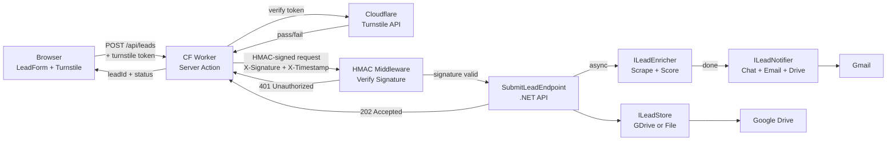

### Core Logic Flow

The endpoint's decision tree: authenticate, validate, store, enrich, notify, and conditionally trigger home search.

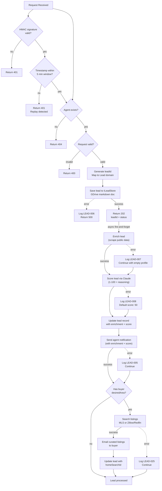

### Data Model Relationships

How the Leads feature domain types relate to each other.

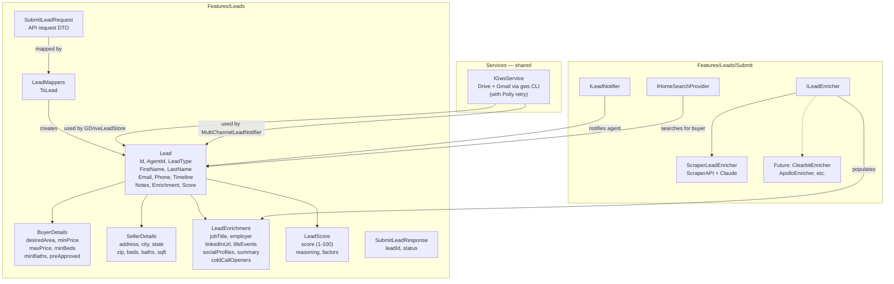

### Pluggable Storage Providers

The `ILeadStore` interface enables swapping storage backends via config.

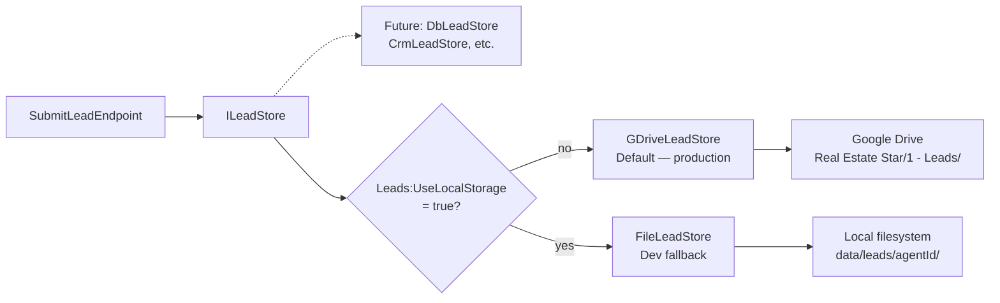

### Data Flow

1. **Frontend**: CmaSection posts to `POST /agents/{agentId}/leads` for ALL lead types
2. **Endpoint**: Validates request, generates leadId (GUID), renders `Lead Profile.md` (human-readable markdown) to Google Drive, records marketing consent to Google Sheets audit log
3. **Response**: Returns `{ leadId, status: "received" }` immediately — everything after this is fire-and-forget async
4. **Enrichment**: Scrape public data (LinkedIn, socials, email lookups, property records) → Claude infers motivation, builds profile, generates lead score (1-100) + cold call openers
5. **Update lead record**: Enrichment profile + score rendered as `Research & Insights.md` in Google Drive (separate file from `Lead Profile.md` — agent gets two clean documents)
6. **Agent email**: Sends notification to agent via gws CLI with motivation, enrichment profile, score, and cold call openers
7. **Home search**: If lead includes buyer data with a desired area → search MLS/Zillow/Redfin → Claude curates top listings → email curated listings to buyer → save search results to Google Drive

### Google Drive Write Summary

Every endpoint that modifies data writes to Google Drive via `IGwsService`. This table summarizes all Drive touchpoints:

| Endpoint / Step | Google Drive Write | Location (via `LeadPaths.*`) |
|----------------|-------------------|----------|
| `POST /leads` — save lead | Create lead folder + `Lead Profile.md` | `Real Estate Star/1 - Leads/{Name}/Lead Profile.md` |
| `POST /leads` — consent log | Append row to Google Sheet | `Real Estate Star/Marketing Consent Log` |
| `POST /leads` — enrichment | Create `Research & Insights.md` + update `Lead Profile.md` | `Real Estate Star/1 - Leads/{Name}/Research & Insights.md` |
| `POST /leads` — home search results | Create search results JSON | `Real Estate Star/1 - Leads/{Name}/Home Search/{date}-Home Search Results.md` |
| `POST /leads/opt-out` | Update `Lead Profile.md` + append sheet row | Lead folder + `Marketing Consent Log` |
| `POST /leads/subscribe` | Update `Lead Profile.md` + append sheet row | Lead folder + `Marketing Consent Log` |
| `POST /leads/deletion-request` | Append row to Google Sheet | `Real Estate Star/Deletion Audit Log` |
| `DELETE /leads/{id}/data` | Delete lead folder + redact sheet rows | Entire `1 - Leads/{Name}/` folder + consent/deletion sheets |

## API Design

### Endpoint

```
POST /agents/{agentId}/leads
Content-Type: application/json
```

### Request (`SubmitLeadRequest`)

Matches the `LeadFormData` shape from `packages/shared-types/lead-form.ts` — no more flattening:

```json
{
  "leadType": "both",
  "firstName": "Jane",
  "lastName": "Doe",
  "email": "jane@example.com",
  "phone": "555-123-4567",
  "timeline": "1-3months",
  "buyer": {
    "desiredArea": "Nags Head",
    "minPrice": 300000,
    "maxPrice": 500000,
    "minBeds": 3,
    "minBaths": 2,
    "preApproved": "yes",
    "preApprovalAmount": 450000
  },
  "seller": {
    "address": "123 Main St",
    "city": "Kill Devil Hills",
    "state": "NC",
    "zip": "27948",
    "beds": 4,
    "baths": 2,
    "sqft": 2100
  },
  "notes": "Looking to sell and buy in the same area",
  "marketingConsent": {
    "optedIn": true,
    "consentText": "I agree to receive marketing communications from Jenise Buckalew about real estate opportunities. You can opt out at any time.",
    "channels": ["email"]
  }
}
```

**Validation rules:**
- `leadType` required, one of: `buyer`, `seller`, `both` (enum)
- `firstName`, `lastName`, `email`, `phone` required
- `email` must be valid email format
- `phone` must match `^\+?[\d\s\-().]{7,20}$`
- `timeline` required, must be one of: `asap`, `1-3months`, `3-6months`, `6-12months`, `justcurious`
- If `leadType` is `seller` or `both`: `seller.address`, `seller.city`, `seller.state`, `seller.zip` required
- If `leadType` is `buyer` or `both`: `buyer.desiredArea` required
- `seller.state` must be 2-letter state code
- `seller.zip` must match `^\d{5}(-\d{4})?$` (5-digit or zip+4, consistent with existing CMA Lead model)
- `marketingConsent` required
- `marketingConsent.consentText` required (non-empty — exact text shown to user)
- `marketingConsent.channels` required, at least one of `["email", "sms", "phone"]`

**Note:** `ipAddress` and `userAgent` are NOT in the request body — the endpoint extracts them from `HttpContext.Connection.RemoteIpAddress` and `HttpContext.Request.Headers["User-Agent"]`.

**StringLength constraints** (matching existing CMA Lead where applicable):
- `firstName`: 100, `lastName`: 100, `email`: 254, `phone`: 30
- `seller.address`: 300, `seller.city`: 100
- `buyer.desiredArea`: 200
- `notes`: 2000

### Response (`SubmitLeadResponse`)

```json
{
  "leadId": "a1b2c3d4-e5f6-7890-abcd-ef1234567890",
  "status": "received"
}
```

### Error Responses

- `400` — Validation failure (missing required fields, invalid formats)
- `404` — Agent not found (invalid `agentId` — use `IAgentConfigService.GetAgentAsync()` to validate; return 404 if null. This reuses the existing path traversal protections and config loading.)
- `500` — Internal error (file write failure, email failure does NOT block response)

## Storage Architecture

### Design Principle: Abstract File Storage

All persistent storage in this feature — leads, search results, consent logs, deletion logs — goes through a single **`IFileStorageProvider`** abstraction. Today that's Google Drive via gws CLI. Tomorrow it could be a GitHub repo, S3, Azure Blob, or a database. No feature code should know or care where files live.

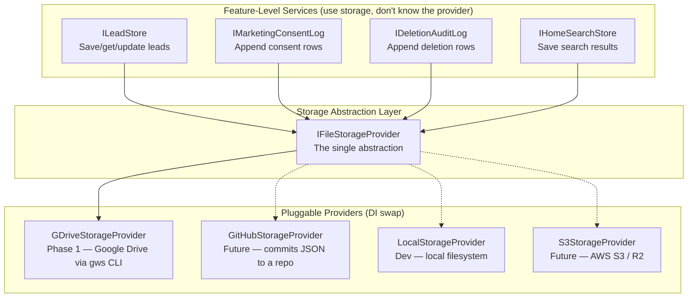

### `IFileStorageProvider` Interface

This is the low-level abstraction that all feature services build on. It knows how to read, write, append, list, and delete files/rows in a storage backend — nothing more.

```csharp
namespace RealEstateStar.Api.Services.Storage;

public interface IFileStorageProvider
{
    // Document operations (markdown files — leads, search results)
    Task WriteDocumentAsync(string folder, string fileName, string content, CancellationToken ct);
    Task<string?> ReadDocumentAsync(string folder, string fileName, CancellationToken ct);
    Task UpdateDocumentAsync(string folder, string fileName, string content, CancellationToken ct);
    Task DeleteDocumentAsync(string folder, string fileName, CancellationToken ct);
    Task<List<string>> ListDocumentsAsync(string folder, CancellationToken ct);

    // Spreadsheet operations (audit logs — consent, deletion)
    Task AppendRowAsync(string sheetName, List<string> values, CancellationToken ct);
    Task<List<List<string>>> ReadRowsAsync(string sheetName, string filterColumn, string filterValue, CancellationToken ct);
    Task RedactRowsAsync(string sheetName, string filterColumn, string filterValue, string redactedMarker, CancellationToken ct);

    // Folder management
    Task EnsureFolderExistsAsync(string folder, CancellationToken ct);
}
```

**Key design decisions:**
- `folder` is a logical path (e.g., `"Real Estate Star/1 - Leads/Jane Doe"`) — the provider maps it to the actual storage location (Drive folder, GitHub directory, S3 prefix). Always use `LeadPaths.*` constants instead of inline strings.
- `sheetName` is a logical name (e.g., `"Marketing Consent Log"`) — the provider maps it to a Google Sheet, GitHub CSV, or database table
- The interface is storage-agnostic — no Google-specific types leak through
- Feature services (`ILeadStore`, `IMarketingConsentLog`, etc.) compose on top of this, adding domain-specific logic

### Provider Implementations

| Provider | Document Storage | Spreadsheet Storage | When to use |
|----------|-----------------|---------------------|-------------|
| **`GDriveStorageProvider`** | Markdown docs in Google Drive folders | Google Sheets rows | Production (Phase 1) |
| **`LocalStorageProvider`** | Markdown files in `data/` directory | CSV files in `data/logs/` | Local development |
| **`GitHubStorageProvider`** | Markdown files committed to a repo | CSV files committed to a repo | Future — version-controlled storage |
| **`S3StorageProvider`** | JSON objects in S3/R2 buckets | DynamoDB or CSV in S3 | Future — cloud-native storage |

### `GDriveStorageProvider` (Phase 1)

Maps `IFileStorageProvider` operations to `IGwsService` calls:

| Interface method | IGwsService method |
|-----------------|-------------------|
| `WriteDocumentAsync` | `CreateDocAsync(agentEmail, folder, fileName, content, ct)` |
| `ReadDocumentAsync` | `DownloadDocAsync(agentEmail, folder, fileName, ct)` |
| `UpdateDocumentAsync` | `UpdateDocAsync(agentEmail, folder, fileName, content, ct)` |
| `DeleteDocumentAsync` | `DeleteDocAsync(agentEmail, folder, fileName, ct)` |
| `ListDocumentsAsync` | `ListFilesAsync(agentEmail, folder, ct)` |
| `AppendRowAsync` | `AppendSheetRowAsync(agentEmail, sheetName, values, ct)` |
| `ReadRowsAsync` | `ReadSheetAsync(agentEmail, sheetName, ct)` + filter in-memory |
| `RedactRowsAsync` | `UpdateSheetRowsAsync(agentEmail, sheetName, ...)` |
| `EnsureFolderExistsAsync` | `CreateDriveFolderAsync(agentEmail, folder, ct)` |

### Feature Services Built on `IFileStorageProvider`

Feature services add domain logic on top of the raw storage operations:

```csharp
// ILeadStore delegates to IFileStorageProvider — uses LeadPaths for all path construction
// IMPORTANT: All files are rendered as human-readable markdown, NOT JSON.
// Google Drive IS the agent's UI — they read these files directly.
public class LeadStore : ILeadStore
{
    private readonly IFileStorageProvider _storage;

    public async Task SaveAsync(Lead lead, CancellationToken ct)
    {
        var leadFolder = LeadPaths.LeadFolder(lead.FullName);
        await _storage.EnsureFolderExistsAsync(leadFolder, ct);

        // Render Lead Profile.md — agent-readable markdown, not JSON
        var content = LeadMarkdownRenderer.RenderLeadProfile(lead);
        await _storage.WriteDocumentAsync(leadFolder, "Lead Profile.md", content, ct);
    }

    public async Task SaveEnrichmentAsync(Lead lead, LeadEnrichment enrichment, LeadScore score, CancellationToken ct)
    {
        var leadFolder = LeadPaths.LeadFolder(lead.FullName);
        var content = LeadMarkdownRenderer.RenderResearchInsights(lead, enrichment, score);
        await _storage.WriteDocumentAsync(leadFolder, "Research & Insights.md", content, ct);
    }
}

// IMarketingConsentLog delegates to IFileStorageProvider
public class MarketingConsentLog : IMarketingConsentLog
{
    private readonly IFileStorageProvider _storage;

    public async Task RecordConsentAsync(MarketingConsent consent, CancellationToken ct)
    {
        await _storage.AppendRowAsync(LeadPaths.ConsentLogSheet, [
            consent.Timestamp.ToString("o"),
            consent.LeadId.ToString(),
            consent.Email,
            consent.FullName,
            consent.Action,    // "opt-in" or "opt-out"
            consent.Channel,
            consent.ConsentText,
            consent.Source,
            consent.IpAddress,
            consent.UserAgent,
        ], ct);
    }
}
```

### DI Registration

```csharp
// Storage provider — GDrive by default, local fallback for dev
if (builder.Configuration.GetValue<bool>("Storage:UseLocal"))
    builder.Services.AddSingleton<IFileStorageProvider>(new LocalStorageProvider("data"));
else
    builder.Services.AddScoped<IFileStorageProvider, GDriveStorageProvider>();

// Feature services (all use IFileStorageProvider internally)
builder.Services.AddScoped<ILeadStore, LeadStore>();
builder.Services.AddScoped<IMarketingConsentLog, MarketingConsentLog>();
builder.Services.AddScoped<ILeadDataDeletion, LeadDataDeletion>();
builder.Services.AddScoped<ILeadNotifier, MultiChannelLeadNotifier>();
builder.Services.AddScoped<ILeadEnricher, ScraperLeadEnricher>();
```

**Switching providers** is a single DI registration change — all feature services automatically use the new backend.

### Google Drive Folder Structure

The lead submission feature builds on top of the **existing numbered folder hierarchy** created by `DriveFolderInitializer` during onboarding. Every agent's Google Drive has this structure — it MUST NOT be changed, only extended. New folders are added under the existing top-level numbered folders.

**Existing structure** (created by `DriveFolderInitializer`):

```
Real Estate Star/                              ← Root (created by onboarding)
├── 1 - Leads/                                 ← Top-level lead folder
│   └── {Lead Name}/                           ← Per-lead subfolder (created by CMA pipeline)
│       └── {Address}/                         ← CMA artifacts (PDF, lead brief doc)
├── 2 - Active Clients/
├── 3 - Under Contract/
├── 4 - Closed/
├── 5 - Inactive/
│   ├── Dead Leads/
│   └── Expired Clients/
└── 6 - Referral Network/
    ├── Agents/
    ├── Brokerages/
    └── Summary/
```

**Extended structure** (added by lead submission feature):

```
Real Estate Star/
├── 1 - Leads/
│   └── {FirstName} {LastName}/                ← Per-lead subfolder
│       ├── Lead Profile.md                          ← Lead record (contact, buyer, seller, enrichment, score)
│       ├── Research & Insights.md                    ← Full enrichment profile (scraped data + Claude analysis)
│       ├── {Address}/                         ← CMA artifacts (existing pipeline, seller leads only)
│       │   ├── cma-report.pdf
│       │   └── lead-brief.gdoc
│       └── Home Search/                       ← Home search results (buyer leads only)
│           └── {date}-Home Search Results.md     ← Curated listings from MLS/scraper
│
├── 2 - Active Clients/                        ← Future: lead promoted to active when agent engages
├── 3 - Under Contract/                        ← Future: lead promoted to under contract
├── 4 - Closed/                                ← Future: lead promoted to closed
├── 5 - Inactive/
│   ├── Dead Leads/                            ← Future: unresponsive leads moved here
│   └── Expired Clients/
├── 6 - Referral Network/
│   ├── Agents/
│   ├── Brokerages/
│   └── Summary/
│
├── Marketing Consent Log                      ← Google Sheet (one row per consent event)
└── Deletion Audit Log                         ← Google Sheet (one row per deletion request/execution)
```

**Folder/file naming conventions:**

| Item | Naming Pattern | Example |
|------|---------------|---------|
| Lead subfolder | `{FirstName} {LastName}` | `Jane Doe` |
| Lead record | `Lead Profile.md` (always) | `Real Estate Star/1 - Leads/Jane Doe/Lead Profile.md` |
| Enrichment record | `Research & Insights.md` (always) | `Real Estate Star/1 - Leads/Jane Doe/Research & Insights.md` |
| CMA artifacts | `{Address}/` (existing pattern) | `Real Estate Star/1 - Leads/Jane Doe/123 Main St, Edison NJ/` |
| Home search results | `Home Search/{date}-Home Search Results.md` | `Real Estate Star/1 - Leads/Jane Doe/Home Search/2026-03-19-Home Search Results.md` |
| Marketing consent log | `Marketing Consent Log` (Google Sheet) | `Real Estate Star/Marketing Consent Log` |
| Deletion audit log | `Deletion Audit Log` (Google Sheet) | `Real Estate Star/Deletion Audit Log` |

**Why per-lead subfolders under `1 - Leads/`:**
- Matches the existing CMA pipeline pattern (`GwsService.BuildLeadFolderPath` → `Real Estate Star/1 - Leads/{leadName}/{address}`)
- Agent sees a clean folder per person in Drive — not hundreds of flat files
- All artifacts for one lead (profile, enrichment, CMA report, home search) are colocated
- Easy to move the entire folder to `2 - Active Clients/` or `5 - Inactive/Dead Leads/` when lead status changes

**Duplicate lead names:** If two leads share the same name (e.g., two "John Smith" leads), append the leadId short hash: `John Smith (a1b2c3d4)`. The `ILeadStore.SaveAsync` method checks for existing folders before creating:

```csharp
var folderName = lead.FullName;
var existingFolders = await _storage.ListDocumentsAsync($"Real Estate Star/1 - Leads", ct);
if (existingFolders.Any(f => f == folderName))
{
    // Check if the existing folder belongs to a different lead
    var existingLead = await _storage.ReadDocumentAsync(
        $"Real Estate Star/1 - Leads/{folderName}", "Lead Profile.md", ct);
    if (existingLead != null)
    {
        var existing = JsonSerializer.Deserialize<Lead>(existingLead);
        if (existing?.Id != lead.Id)
            folderName = $"{lead.FullName} ({lead.Id.ToString()[..8]})";
    }
}
```

**Path construction** — centralized in a static helper (like the existing `GwsService.BuildLeadFolderPath`):

```csharp
// Features/Leads/LeadPaths.cs
public static class LeadPaths
{
    public const string Root = "Real Estate Star";
    public const string LeadsFolder = "Real Estate Star/1 - Leads";
    public const string ConsentLogSheet = "Real Estate Star/Marketing Consent Log";
    public const string DeletionLogSheet = "Real Estate Star/Deletion Audit Log";

    public static string LeadFolder(string leadName) =>
        $"{LeadsFolder}/{leadName}";

    public static string LeadFile(string leadName) =>
        $"{LeadsFolder}/{leadName}/Lead Profile.md";

    public static string EnrichmentFile(string leadName) =>
        $"{LeadsFolder}/{leadName}/Research & Insights.md";

    public static string HomeSearchFolder(string leadName) =>
        $"{LeadsFolder}/{leadName}/Home Search";

    public static string HomeSearchFile(string leadName, DateTime date) =>
        $"{LeadsFolder}/{leadName}/Home Search/{date:yyyy-MM-dd}-Home Search Results.md";

    // Existing CMA pattern — delegates to GwsService.BuildLeadFolderPath
    public static string CmaFolder(string leadName, string address) =>
        $"{LeadsFolder}/{leadName}/{address}";
}
```

> **CRITICAL**: All `ILeadStore`, `IMarketingConsentLog`, and `ILeadDataDeletion` implementations MUST use `LeadPaths.*` constants — never construct Drive paths inline. This ensures the folder structure stays consistent and is easy to audit/change.

### Document Format: Human-Readable Markdown

> **Google Drive IS the agent's user interface.** Every file in the lead folder must be clean, readable, and immediately useful to a real estate agent who opens it on their phone between showings. No JSON, no code, no developer jargon. Think of these as automatically-generated briefing documents.

**Design principles for Drive documents:**
- **Scannable** — headers, bullet points, bold labels. No walls of text.
- **Action-oriented** — lead with what the agent should DO (call openers, key talking points), then supporting detail.
- **Plain language** — "Pre-approved for $450K" not `"preApprovalAmount": 450000`.
- **Mobile-friendly** — short lines, no wide tables that break on phone screens.
- **No system metadata visible** — leadId, agentId, timestamps, tokens, internal status are stored in a hidden YAML frontmatter block that the agent never sees (Google Drive renders markdown, not frontmatter).
- **Searchable frontmatter** — YAML frontmatter contains structured, indexable fields for every key data point. This enables building a search/filter capability later (e.g., "show me all leads in Nags Head", "leads scored above 70", "relocation leads from this month").

### Frontmatter as Search Index

Every markdown document includes comprehensive YAML frontmatter with **all structured data in indexable key-value format**. The human-readable markdown body is rendered FROM this frontmatter — the frontmatter is the source of truth, the markdown is the presentation layer.

**Why this matters for future search:**
- A search service can parse YAML frontmatter without understanding markdown formatting
- Fields are typed and consistent across all leads — `score: 82` not "Lead Score: 82 / 100"
- Supports exact match (`city: "Kill Devil Hills"`), range queries (`score >= 70`), and full-text search on `tags` and `notes`
- Can be indexed into Elasticsearch, Algolia, or even a simple SQLite FTS table later
- No regex scraping of human-readable text needed — every searchable fact has a dedicated key

**Indexable fields per document:**

| Document | Indexable Frontmatter Fields |
|----------|-----------------------------|
| `Lead Profile.md` | leadId, agentId, receivedAt, status, leadTypes, firstName, lastName, email, phone, timeline, city, state, zip, address, desiredArea, minPrice, maxPrice, beds, baths, preApproved, score, motivationCategory, tags |
| `Research & Insights.md` | leadId, enrichedAt, score, motivationCategory, primaryMotivation, jobTitle, employer, industry, sourcesUsed, tags |
| `Home Search Results.md` | leadId, searchDate, area, minPrice, maxPrice, beds, baths, listingCount, source, tags |

#### `Lead Profile.md` — What the agent sees when a new lead comes in

```markdown
---
# === System (internal, not displayed) ===
leadId: a1b2c3d4-e5f6-7890-abcd-ef1234567890
agentId: jenise-buckalew
receivedAt: 2026-03-19T14:30:00Z
status: received
consentToken: optout-hashed-abc123
cmaJobId: xyz-7890-abcd
homeSearchId: search-5678-efgh

# === Indexable (structured, searchable) ===
leadTypes: [buying, selling]
firstName: Jane
lastName: Doe
email: jane@example.com
phone: "5551234567"
timeline: 1-3months
score: 82
motivationCategory: relocation

# Seller fields
address: "123 Main St"
city: Kill Devil Hills
state: NC
zip: "27948"
beds: 4
baths: 2
sqft: 2100

# Buyer fields
desiredArea: Nags Head
minPrice: 300000
maxPrice: 500000
buyerBeds: 3
buyerBaths: 2
preApproved: true
preApprovalAmount: 450000

# Search tags (enrichment-derived, for filtering)
tags: [relocation, high-score, pre-approved, buying, selling, kill-devil-hills, nags-head]
---

# Jane Doe

**New lead received March 19, 2026 at 2:30 PM**

## Contact

- **Phone:** (555) 123-4567
- **Email:** jane@example.com
- **Timeline:** 1–3 months

## Interested In

Buying and Selling

## Selling

- **Property:** 123 Main St, Kill Devil Hills, NC 27948
- **Beds / Baths:** 4 bed / 2 bath
- **Square Feet:** 2,100

## Buying

- **Desired Area:** Nags Head
- **Budget:** $300,000 – $500,000
- **Bedrooms:** 3+
- **Bathrooms:** 2+
- **Pre-Approved:** Yes — $450,000

## Notes from Lead

> Looking to sell and buy in the same area
```

#### `Research & Insights.md` — Background intel for the agent's first call

```markdown
---
# === System ===
leadId: a1b2c3d4-e5f6-7890-abcd-ef1234567890
enrichedAt: 2026-03-19T14:30:45Z
provider: scraper

# === Indexable ===
score: 82
motivationCategory: relocation
primaryMotivation: "Relocating for VP of Engineering role at Acme Corp"
jobTitle: VP of Engineering
employer: Acme Corp
industry: Technology
yearsAtAddress: 8
estimatedPropertyValue: 385000
sourcesUsed: [linkedin, facebook, zillow, tax_records, google, gravatar]
tags: [relocation, tech-executive, high-equity, growing-family, strong-motivation]
---

# Jane Doe — Research & Insights

**Lead Score: 82 / 100** ⭐⭐⭐⭐

> High-quality lead. Active timeline, pre-approved buyer, seller with
> property details, recent job change suggests relocation.

## Why They're Moving

**Primary motivation:** Relocating for new VP of Engineering role at Acme Corp in Raleigh

**Supporting factors:**
- Growing family (expecting second child)
- Strong equity in current home (8 years ownership)

**Category:** Relocation

**Evidence:**
- LinkedIn: Started VP of Engineering at Acme Corp (Jan 2026)
- Facebook: Posted about "new chapter" and "big move" (Feb 2026)
- Tax records: Owned since 2018, assessed at $365K

## Conversation Starters

Use these when you call — they show you've done your homework:

1. "Congratulations on the VP role at Acme Corp! A lot of folks relocating to Raleigh love the [Neighborhood] area."
2. "I see you've been in your Kill Devil Hills home for about 8 years — with that market appreciation, you'd be in a great equity position."
3. "Moving for a new job is exciting but stressful — I specialize in helping people sell and buy in the same timeline."

## Professional Background

- **Title:** VP of Engineering
- **Company:** Acme Corp
- **Industry:** Technology
- **LinkedIn:** https://linkedin.com/in/janedoe

## Personal

- **Interests:** Hiking, Photography, Home renovation
- **Community:** Youth soccer coach, PTA member
- **Social Profiles:** LinkedIn, Facebook

## Property History

- **Owner since:** 2018 (8 years)
- **Estimated current value:** $385,000
- **Recent activity:** Home renovation permits filed in 2025

## Life Events

- New job at Acme Corp (2026)
- Expecting second child
- Home renovation permits (2025)

## Score Breakdown

| Factor | Weight |
|--------|--------|
| Active timeline (1–3 months) | High |
| Pre-approved buyer | High |
| Property details provided | Medium |
| Recent job change | High |

---
*Research compiled automatically from public sources on March 19, 2026.*
*This report is generated by Real Estate Star to help you prepare for your first conversation.*
```

#### `Home Search Results.md` — Curated listings for buyer leads

```markdown
---
# === System ===
leadId: a1b2c3d4-e5f6-7890-abcd-ef1234567890
searchDate: 2026-03-19
source: mls

# === Indexable ===
area: Nags Head
minPrice: 300000
maxPrice: 500000
beds: 3
baths: 2
listingCount: 5
tags: [nags-head, under-500k, 3-bed, mls-sourced]
---

# Home Search Results for Jane Doe

**Search Date:** March 19, 2026
**Criteria:** Nags Head area · $300K–$500K · 3+ beds · 2+ baths

---

### 1. 456 Ocean View Dr, Nags Head, NC 27959 — $425,000

- **Beds / Baths:** 4 bed / 3 bath · 2,400 sq ft
- **Year Built:** 2018
- **Days on Market:** 12
- **Why this fits:** Modern build, extra bedroom for growing family, within budget with room for negotiation.
- **MLS #:** 12345678

---

### 2. 789 Beachside Ln, Nags Head, NC 27959 — $389,000

- **Beds / Baths:** 3 bed / 2 bath · 1,950 sq ft
- **Year Built:** 2015
- **Days on Market:** 28
- **Why this fits:** Well below budget ceiling, recently updated kitchen, close to schools.
- **MLS #:** 23456789

---

*... (3 more listings) ...*

---
*These listings were curated by Real Estate Star based on Jane's preferences.*
*Sent to jane@example.com on March 19, 2026.*
```

### Markdown Rendering: `LeadMarkdownRenderer`

A dedicated static class renders domain models into clean markdown. This is the **single place** where document formatting lives — if the agent wants a different layout, we change one class.

```csharp
// Features/Leads/LeadMarkdownRenderer.cs
public static class LeadMarkdownRenderer
{
    /// <summary>
    /// Renders Lead Profile.md — the first document the agent sees for a new lead.
    /// YAML frontmatter contains system metadata (IDs, tokens, timestamps).
    /// The visible markdown body is clean, scannable, and action-oriented.
    /// </summary>
    public static string RenderLeadProfile(Lead lead)
    {
        var sb = new StringBuilder();

        // YAML frontmatter — system metadata, hidden from casual reading
        sb.AppendLine("---");
        sb.AppendLine($"leadId: {lead.Id}");
        sb.AppendLine($"agentId: {lead.AgentId}");
        sb.AppendLine($"receivedAt: {lead.ReceivedAt:O}");
        sb.AppendLine($"status: {lead.Status}");
        sb.AppendLine($"leadTypes: [{string.Join(", ", lead.LeadTypes)}]");
        if (lead.OptOutToken != null) sb.AppendLine($"consentToken: {lead.OptOutToken}");
        if (lead.CmaJobId != null) sb.AppendLine($"cmaJobId: {lead.CmaJobId}");
        if (lead.HomeSearchId != null) sb.AppendLine($"homeSearchId: {lead.HomeSearchId}");
        sb.AppendLine("---");
        sb.AppendLine();

        // Visible content — what the agent reads
        sb.AppendLine($"# {lead.FullName}");
        sb.AppendLine();
        sb.AppendLine($"**New lead received {lead.ReceivedAt:MMMM d, yyyy} at {lead.ReceivedAt:h:mm tt}**");
        sb.AppendLine();

        // Contact section
        sb.AppendLine("## Contact");
        sb.AppendLine();
        sb.AppendLine($"- **Phone:** {FormatPhone(lead.Phone)}");
        sb.AppendLine($"- **Email:** {lead.Email}");
        sb.AppendLine($"- **Timeline:** {FormatTimeline(lead.Timeline)}");
        // ... (seller details, buyer details, notes)

        return sb.ToString();
    }

    /// <summary>
    /// Renders Research & Insights.md — background intel for the agent's first call.
    /// Leads with motivation + conversation starters + professional/personal context.
    /// </summary>
    public static string RenderResearchInsights(Lead lead, LeadEnrichment enrichment, LeadScore score)
    {
        // ... renders the full research document with score, motivation,
        // conversation starters, professional background, etc.
    }

    /// <summary>
    /// Renders Home Search Results.md — curated listings for buyer leads.
    /// Each listing has a "Why this fits" note personalized to the buyer's criteria.
    /// </summary>
    public static string RenderHomeSearchResults(Lead lead, HomeSearchCriteria criteria, List<Listing> listings)
    {
        // ... renders the curated listing document
    }

    // Helper: "(555) 123-4567" formatting
    private static string FormatPhone(string phone) => ...;

    // Helper: "1-3months" → "1–3 months"
    private static string FormatTimeline(string timeline) => ...;

    // Helper: 300000 → "$300,000"
    private static string FormatCurrency(decimal amount) => amount.ToString("C0");
}
```

**Key design rules for `LeadMarkdownRenderer`:**
1. **Lead with action** — `Research & Insights.md` starts with score + conversation starters, not raw data
2. **YAML frontmatter for system data** — IDs, tokens, timestamps live in frontmatter. The agent sees clean markdown below the `---` fence. When we need to read back, parse the frontmatter.
3. **No abbreviations** — "Square Feet" not "sqft", "Bedrooms" not "beds" in headers
4. **Format numbers** — `$300,000` not `300000`, `(555) 123-4567` not `5551234567`
5. **Personalized commentary** — home search results include "Why this fits" notes that reference the buyer's specific criteria
6. **Footer attribution** — every document ends with a small note crediting Real Estate Star

### Internal Data Model

While the documents the agent sees are markdown, the internal domain model remains strongly-typed C# objects (the `Lead`, `LeadEnrichment`, `LeadScore` classes defined elsewhere in this spec). `LeadMarkdownRenderer` is a one-way transform: **domain model → markdown**.

To read a lead back from Drive (e.g., for updates or deletion), parse the **YAML frontmatter only** — the visible markdown content is derived and doesn't need to be round-tripped. The frontmatter contains all system fields needed for operations (leadId, status, tokens, job references).

```csharp
// Reading lead data back from Drive — parse YAML frontmatter, not markdown body
public async Task<Lead?> GetAsync(string agentId, string leadName, CancellationToken ct)
{
    var content = await _storage.ReadDocumentAsync(
        LeadPaths.LeadFolder(leadName), "Lead Profile.md", ct);
    if (content == null) return null;

    var frontmatter = YamlFrontmatterParser.Parse(content);
    // Reconstruct Lead from frontmatter fields + re-read enrichment if needed
    return LeadMappers.FromFrontmatter(frontmatter);
}
```

> **Why frontmatter, not a separate metadata file?** A single file is simpler — the agent sees one document, and the system data rides along invisibly. If we split into `lead-meta.json` + `Lead Profile.md`, the agent sees a confusing JSON file in their folder. Frontmatter is invisible to humans, visible to code.

## Marketing Consent Audit Log

### Regulatory Requirement

All marketing opt-in and opt-out events must be recorded in an immutable, auditable log for CAN-SPAM, TCPA, and state-level compliance. This log must capture:
- **Who** consented (lead email)
- **What** they consented to (email marketing, SMS, phone calls)
- **When** they consented (timestamp)
- **How** they consented (form submission, checkbox text shown)
- **IP address** at time of consent (for legal evidence)

### Storage: Google Sheets Audit Log

The audit log is stored as a Google Sheet in the agent's Google Drive — one row per consent event. Google Sheets is the right fit because:
- Human-readable and searchable by the agent (no dev tooling needed to audit)
- Append-only via `IGwsService.AppendSheetRowAsync()` (already integrated)
- Easy to export for legal discovery
- Immutable rows (agents can view but shouldn't delete — Drive permissions can enforce read-only on the sheet)

**Sheet location:** `Real Estate Star/Marketing Consent Log`

**Sheet columns:**

| Column | Description | Example |
|--------|-------------|---------|
| Timestamp | UTC ISO 8601 | 2026-03-19T14:30:00Z |
| LeadId | GUID | a1b2c3d4-e5f6-... |
| Email | Lead's email | jane@example.com |
| Name | Lead's full name | Jane Doe |
| Action | `opt-in` or `opt-out` | opt-in |
| Channel | `email`, `sms`, `phone`, or `all` | email |
| ConsentText | Exact checkbox/disclosure text shown | "I agree to receive marketing emails..." |
| Source | Where consent was captured | agent-site-lead-form |
| IP Address | Submitter's IP | 203.0.113.42 |
| UserAgent | Browser user agent | Mozilla/5.0... |

### `IMarketingConsentLog` Interface

```csharp
public interface IMarketingConsentLog
{
    Task RecordConsentAsync(MarketingConsent consent, CancellationToken ct);
}

public record MarketingConsent
{
    public required Guid LeadId { get; init; }
    public required string Email { get; init; }
    public required string FullName { get; init; }
    public required string Action { get; init; }       // "opt-in" or "opt-out"
    public required string Channel { get; init; }      // "email", "sms", "phone", "all"
    public required string ConsentText { get; init; }  // Exact text shown to user
    public required string Source { get; init; }       // "agent-site-lead-form"
    public required string IpAddress { get; init; }
    public required string UserAgent { get; init; }
    public DateTime Timestamp { get; init; } = DateTime.UtcNow;
}
```

### Implementation: `GDriveMarketingConsentLog`

Uses `IGwsService.AppendSheetRowAsync()` to append a row to the Google Sheet. Creates the sheet on first write if it doesn't exist.

```csharp
public class GDriveMarketingConsentLog : IMarketingConsentLog
{
    // Uses IGwsService to append rows to "Real Estate Star/Marketing Consent Log" sheet
    // Sheet is created with header row on first use
    // Each consent event = one row, append-only
}
```

### Frontend: Consent Checkbox

The `LeadForm` must include a marketing consent checkbox. The exact text shown must be captured and sent to the API so the audit log records what the user actually agreed to.

**Request additions:**

```json
{
  "marketingConsent": {
    "optedIn": true,
    "consentText": "I agree to receive marketing communications from [Agent Name] about real estate opportunities. You can opt out at any time.",
    "channels": ["email"]
  }
}
```

**Validation:**
- `marketingConsent` object is required
- `marketingConsent.consentText` is required (must not be empty — the API records exactly what was shown)
- If `optedIn` is false, the lead is still stored but no marketing emails are sent

### Integration with Lead Submission

**Submitting the lead form is itself an opt-in event.** When `marketingConsent.optedIn = true`, the `POST /leads` endpoint writes an `opt-in` row to the **same Marketing Consent Audit Log** (Google Sheet) that opt-out and re-subscribe use. This ensures a complete consent history from the very first interaction.

**Google Drive writes on lead submission (synchronous, before 202):**
1. Save `Lead Profile.md` to Google Drive (`Real Estate Star/1 - Leads/{Name}/Lead Profile.md`)
2. Append `opt-in` row to **Marketing Consent Audit Log** (Google Sheet) — same sheet as opt-out/subscribe, with action `opt-in`, source `agent-site-lead-form`, and the exact consent text shown to the user

**Then 202 returned, followed by `Task.Run`:**
   a. Enrich lead (scrape + motivation + score)
   b. Notify agent (with enrichment — always sent, this is the agent's notification, not marketing to the lead)
   c. Trigger CMA pipeline (if seller) — email to lead is transactional
   d. Trigger home search (if buyer) — email to lead is transactional

**All three consent events write to the same Google Sheet:**

| Event | Action | Source | Sheet |
|-------|--------|--------|-------|
| Lead submits form with opt-in | `opt-in` | `agent-site-lead-form` | Marketing Consent Log |
| Lead clicks unsubscribe link | `opt-out` | `email-unsubscribe` | Marketing Consent Log |
| Lead clicks re-subscribe link | `opt-in` | `re-subscribe` | Marketing Consent Log |

This creates a complete, auditable consent timeline per lead — exactly what regulators want to see.

**Note:** CMA report and buyer listing emails are **transactional** (the user explicitly requested them by submitting the form). They are sent regardless of marketing consent. The consent checkbox controls future marketing emails only.

### Opt-Out Link in All Lead-Facing Emails

**Every email sent to a lead** (including the CMA report email) must include an opt-out/unsubscribe footer per CAN-SPAM requirements. Even transactional emails should include privacy links as a best practice.

**Email footer (appended to all lead-facing emails):**

For opted-in leads:
```
---
You're receiving this because you submitted a request through {agentName}'s website.

To opt out of future marketing emails: {agentSiteUrl}/privacy/opt-out?email={encodedEmail}&token={token}
To request deletion of your data: {agentSiteUrl}/privacy/delete
Privacy questions? Contact {agentEmail}
```

For opted-out leads (on transactional emails only, e.g. CMA reports):
```
---
You're receiving this because you requested a market analysis through {agentName}'s website.
You are currently unsubscribed from marketing emails.

To re-subscribe: {agentSiteUrl}/privacy/subscribe?email={encodedEmail}&token={token}
To request deletion of your data: {agentSiteUrl}/privacy/delete
Privacy questions? Contact {agentEmail}
```

**Opt-out flow:**
1. Lead clicks the opt-out link in any email
2. Agent site shows a confirmation page: "Are you sure you want to unsubscribe?"
3. On confirm → `POST /agents/{agentId}/leads/opt-out` with the token
4. API records an `opt-out` event in the Marketing Consent Audit Log (Google Sheet)
5. Lead is marked as opted-out — no future marketing emails sent

**Opt-out endpoint:**
```
POST /agents/{agentId}/leads/opt-out
Content-Type: application/json
```

```json
{
  "email": "jane@example.com",
  "token": "optout-abc123...",
  "channels": ["email"]
}
```

Response: `200 { "status": "opted_out" }` — always returns success (no email enumeration).

**Google Drive writes on opt-out:**
1. Update the lead's `Lead Profile.md` YAML frontmatter in Google Drive — set `marketingConsent.optedOut = true`, `marketingConsent.optOutAt = now`
2. Append a row to the **Marketing Consent Audit Log** (Google Sheet) with action `opt-out`, timestamp, email, consent text, and source

**Opt-out tokens:** Generated at lead creation time, stored alongside the lead record. Single-use is NOT required for opt-out (user should be able to click the link multiple times). Token is tied to the lead's email — prevents opting out someone else.

### Re-Subscribe (Opt Back In)

Leads who previously opted out can re-subscribe. GDPR requires it be as easy to opt back in as to opt out.

**Re-subscribe flow:**
1. Lead visits `{agentSiteUrl}/privacy/subscribe?email={encodedEmail}&token={subscribeToken}`
2. Agent site shows a confirmation page: "Would you like to receive marketing emails from {agentName} again?"
3. On confirm → `POST /agents/{agentId}/leads/subscribe` with the token
4. API records an `opt-in` event in the Marketing Consent Audit Log (new row, preserving the opt-out history)
5. Lead is marked as opted-in — marketing emails resume

**Subscribe endpoint:**
```
POST /agents/{agentId}/leads/subscribe
Content-Type: application/json
```

```json
{
  "email": "jane@example.com",
  "token": "optout-abc123...",
  "channels": ["email"]
}
```

Response: `200 { "status": "subscribed" }` — always returns success (no email enumeration).

**Google Drive writes on re-subscribe:**
1. Update the lead's `Lead Profile.md` YAML frontmatter in Google Drive — set `marketingConsent.optedOut = false`, `marketingConsent.optOutAt = null`
2. Append a row to the **Marketing Consent Audit Log** (Google Sheet) with action `opt-in`, timestamp, email, consent text, and source `"re-subscribe"`

**Token reuse:** The subscribe endpoint uses the **same token** as opt-out (the `optOutToken` stored on the lead record). This avoids generating a separate token and ensures only the actual lead can re-subscribe. The token name is a misnomer at this point — it's really a "consent management token."

**Where does the link appear?** Two places:
- The opt-out confirmation page itself: "You've been unsubscribed. Changed your mind? [Re-subscribe]"
- The email footer on transactional emails (CMA reports are still sent to opted-out leads since they're transactional): "You're currently unsubscribed from marketing emails. [Re-subscribe]"

**Audit trail:** The consent log captures the full history — opt-in → opt-out → opt-in — each as a separate row with timestamp, source, and consent text. This provides a complete audit trail for compliance.

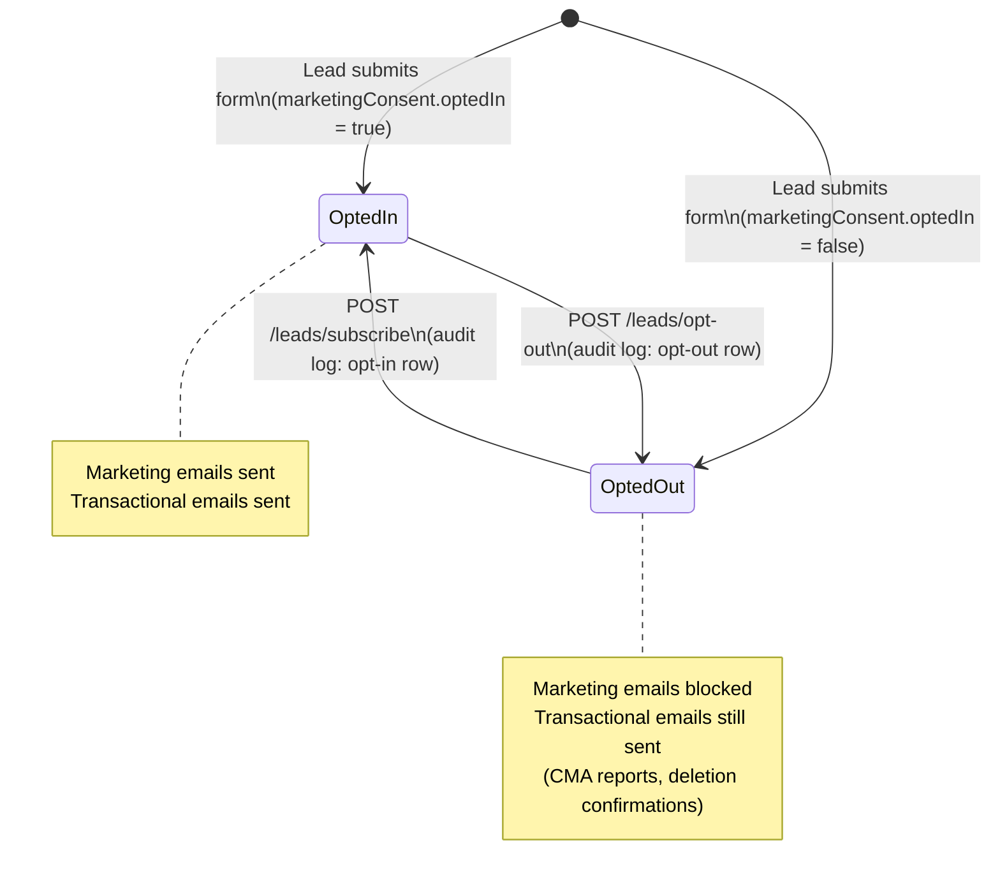

### Vertical Slice Addition for Consent Management

```
Features/
  Leads/
    OptOut/
      OptOutRequest.cs              # POST request DTO
      OptOutEndpoint.cs             # POST /agents/{agentId}/leads/opt-out
    Subscribe/
      SubscribeRequest.cs           # POST request DTO
      SubscribeEndpoint.cs          # POST /agents/{agentId}/leads/subscribe
```

### DI Registration

```csharp
builder.Services.AddScoped<IMarketingConsentLog, GDriveMarketingConsentLog>();
```

### Concurrency

Each consent event is an append to a Google Sheet — no concurrent write conflicts. The `UpdateCmaJobIdAsync` call re-uploads the doc — acceptable since it only happens once per lead, after CMA completes.

### Development Fallback

`FileLeadStore` writes markdown files to `data/leads/{agentId}/{leadName}/Lead Profile.md` locally using write-to-temp-then-rename. Same `LeadMarkdownRenderer` output as production — the dev folder mirrors the Drive folder structure. Used when gws CLI is not configured (dev environments without Google credentials).

## Lead Enrichment Pipeline

### Purpose

**The primary goal of enrichment is to infer the lead's motivation — why are they buying or selling right now?**

Real estate decisions are triggered by life events: a new baby means they need more space, a job change means they're relocating, retirement means they're downsizing, a divorce means they're splitting assets. The agent who understands the *why* behind the inquiry can tailor their pitch, build rapport on the first call, and close faster.

Every lead submission triggers a background enrichment pipeline that scrapes publicly available data with this lens: **what life event or circumstance is driving this person to act now?** The pipeline builds a motivation profile, scores the lead's urgency, and generates cold call openers that speak directly to their situation — not generic sales scripts.

The agent never gets a "bare" lead — every notification arrives actionable with the inferred motivation, supporting evidence, and personalized conversation starters.

### Pipeline Steps

1. **Web scraping** — Search for the lead across multiple data sources to gather evidence of **life events and circumstances that explain their motivation**. Every query is framed through this lens: "What is happening in this person's life that would cause them to buy or sell a home?"

   **Name + location based:**

   | Source | What we look for | Query pattern |
   |--------|------------------|---------------|
   | **LinkedIn** | Job title, employer, career history, education, skills | `"{firstName} {lastName}" site:linkedin.com/in {city} {state}` |
   | **Google Search** | News mentions, public records, social profiles, personal sites | `"{firstName} {lastName}" {city} {state}` |
   | **Facebook** | Life events (engaged, married, new baby, moved), mutual connections | `"{firstName} {lastName}" site:facebook.com {city}` |
   | **Instagram** | Lifestyle signals, location tags, interests | `"{firstName} {lastName}" site:instagram.com` |
   | **Zillow/Redfin** | Property history, Zestimate, previous sales, time on market (seller leads) | `"{address}" site:zillow.com OR site:redfin.com` |
   | **County tax records** | Property ownership verification, tax assessed value, purchase date | `"{firstName} {lastName}" {county} county property records` |
   | **Local news** | Community involvement, business ownership, awards, event attendance | `"{firstName} {lastName}" {city} {state} news` |
   | **Whitepages/Spokeo** | Address history, household size, length of residence | `"{firstName} {lastName}" {city} {state} site:whitepages.com` |

   **Email-based reverse lookups** (often the most reliable — email is a unique identifier):

   | Source | What we look for | Method |
   |--------|------------------|--------|
   | **Gravatar** | Profile photo, linked accounts, display name | `GET https://gravatar.com/{md5(email)}.json` (free, no API key) |
   | **GitHub** | Developer profile, projects, employer, bio | `GET https://api.github.com/search/users?q={email}` (free, rate-limited) |
   | **Google search by email** | Personal sites, forum posts, professional directories, bios | `"{email}"` via ScraperAPI |
   | **Have I Been Pwned** | Breach exposure (signals how long the email has been active, not used for scoring — informational only) | `GET https://haveibeenpwned.com/api/v3/breachedaccount/{email}` (requires API key) |
   | **Twitter/X** | Posts, bio, follower count, interests, location | `"{email}" site:twitter.com OR site:x.com` |
   | **Domain WHOIS** | If email domain is custom (not gmail/yahoo), check WHOIS for business ownership | `whois {email_domain}` via WHOIS API |

   **Phone-based** (if phone number provided):

   | Source | What we look for | Method |
   |--------|------------------|--------|
   | **Reverse phone lookup** | Carrier type (mobile/landline), location, associated names | `"{phone}" site:whitepages.com` or CallerID API |
   | **Truecaller** | Name, spam score, business association | Truecaller API (requires key, future Phase 2) |

   Not all sources will return results for every lead. The pipeline fires all queries in parallel and collects whatever comes back. Each source has a short timeout (5s per source, 30s total) — partial results are fine. Claude cross-references across sources to build confidence (e.g., LinkedIn employer matches Google search results = high confidence).

2. **Claude motivation analysis** — Send combined scraped data to Claude API with a system prompt focused on answering: **"Why is this person buying or selling right now? What life event is driving this decision?"**

   Claude extracts:
   - **Primary motivation** (the single most likely reason) — e.g., "Relocating for new job at Acme Corp in Raleigh"
   - **Supporting motivations** (secondary signals) — e.g., "Growing family (expecting second child), current home is 2BR"
   - **Motivation category** — one of: `relocation`, `upsizing`, `downsizing`, `investment`, `life_change`, `financial`, `lifestyle`, `unknown`

   Common motivation patterns the prompt is tuned to detect:

   | Motivation | Buyer signals | Seller signals |
   |-----------|---------------|----------------|
   | **Relocation** | New job in different city, spouse transferred | Job change to another market, remote-to-office shift |
   | **Growing family** | Baby announcement, wedding, kids aging into school district needs | House too small, need more bedrooms/yard |
   | **Downsizing** | Empty nesters, retirement, kids moved out | Large home, long ownership, reduced income signals |
   | **Divorce/separation** | Single name on form after public records show couple | Property split, change in social media relationship status |
   | **Financial** | Pre-approved at higher amount than current area, investment interest | Long ownership + high equity, financial stress signals |
   | **Retirement** | Retirement announcements, age signals, pension/401k mentions | Moving to retirement-friendly area, seasonal property interest |
   | **Lifestyle** | Interest in specific neighborhoods/amenities, hobby-driven location | Upgrading for lifestyle (beach, mountains, city life) |
   | **First-time buyer** | No property history, younger professional, rental references | N/A |
   | **Investment** | Multiple property interest, LLC ownership, landlord signals | Rental property offloading, market timing language |

   Also extracts supporting profile data:
   - Job title, employer, and career trajectory
   - Social media profiles with URLs
   - Community involvement and interests
   - Property ownership history and assessed values
   - Household composition signals
   - Brief summary paragraph connecting motivation to evidence

3. **Lead scoring** — Claude scores the lead 1-100, weighted heavily toward **motivation clarity and urgency**:

   | Factor | Weight | Examples |
   |--------|--------|---------|
   | **Motivation strength** | 30% | Clear life event (job change, baby) = high; "just curious" with no signals = low |
   | **Timeline urgency** | 25% | ASAP + relocation start date = very high; "just curious" = low |
   | **Financial readiness** | 20% | Pre-approved buyer, high equity seller = high; no pre-approval = medium |
   | **Data completeness** | 15% | Full form + rich enrichment data = high; minimal form + no public data = low |
   | **Engagement signals** | 10% | Detailed notes, specific property criteria, multiple lead types = high |

   The score represents "how likely is this lead to transact in the near term" — a lead with a clear motivation (relocating for a job starting next month) scores 85+, while a lead with no detectable motivation ("just curious") scores 30-40.

4. **Cold call openers** — Claude generates 2-3 personalized conversation starters that **reference the inferred motivation directly**, making the agent sound informed without being creepy:
   - e.g., "Congratulations on the new role at Acme Corp! A lot of folks moving to Raleigh for work love the [Neighborhood] area — great commute and schools."
   - e.g., "I noticed you've been in your Kill Devil Hills home for about 8 years — with the way that market has appreciated, you'd be in a great equity position. Happy to run the numbers for you."
   - e.g., "Growing families in this area tend to love [Neighborhood] for the school district and yard space — want me to send you a few options in your budget?"

   **Tone guidance in Claude prompt:** Sound like a well-prepared agent who did their homework, not a stalker. Reference publicly available information naturally. Never mention scraping, data sources, or that AI generated the openers.

### Architecture: Pluggable Enrichment Providers

```
ILeadEnricher
├── ScraperLeadEnricher (Phase 1) — ScraperAPI + Claude parsing
├── (future) ClearbitEnricher — paid API, richer data
├── (future) ApolloEnricher — sales intel platform
└── (future) PeopleDataLabsEnricher — comprehensive people data
```

The `ILeadEnricher` interface returns a `LeadEnrichment` record regardless of provider. Swapping providers is a DI registration change.

### `ILeadEnricher` Interface

```csharp
public interface ILeadEnricher
{
    Task<LeadEnrichment> EnrichAsync(Lead lead, CancellationToken ct);
}
```

### `LeadEnrichment` Model

```csharp
namespace RealEstateStar.Api.Features.Leads;

public class LeadEnrichment
{
    // === MOTIVATION (primary output — why are they buying/selling?) ===
    public string? PrimaryMotivation { get; init; }             // "Relocating for new job at Acme Corp in Raleigh"
    public List<string> SupportingMotivations { get; init; } = []; // Secondary signals
    public string? MotivationCategory { get; init; }            // relocation, upsizing, downsizing, investment, life_change, financial, lifestyle, unknown
    public List<string> MotivationEvidence { get; init; } = []; // Source-attributed evidence: "LinkedIn: started VP role at Acme (Jan 2026)"

    // === LIFE EVENTS (the raw signals that feed motivation) ===
    public List<string> LifeEvents { get; init; } = [];         // "New job at Acme (2026)", "Recently engaged", "Expecting child"

    // === PROFESSIONAL ===
    public string? JobTitle { get; init; }
    public string? Employer { get; init; }
    public string? Industry { get; init; }
    public string? LinkedInUrl { get; init; }

    // === PERSONAL ===
    public List<string> SocialProfiles { get; init; } = [];     // URLs: LinkedIn, Facebook, Instagram, Twitter, GitHub
    public List<string> Interests { get; init; } = [];          // "Golf", "Photography", "Youth soccer coach"
    public string? CommunityInvolvement { get; init; }          // "Board member at local HOA", "Rotary Club"
    public string? GravatarPhotoUrl { get; init; }              // Profile photo from Gravatar (free, by email hash)
    public string? PersonalWebsite { get; init; }               // From WHOIS, GitHub, or Google search
    public bool? IsBusinessOwner { get; init; }                 // From domain WHOIS or Google results

    // === PROPERTY (for sellers, from Zillow/tax records) ===
    public string? PropertyOwnerSince { get; init; }            // "2018" — from tax records
    public decimal? EstimatedPropertyValue { get; init; }       // Zestimate or tax assessed
    public int? YearsAtCurrentAddress { get; init; }            // From Whitepages/tax records

    // === ANALYSIS ===
    public string? Summary { get; init; }                       // 2-3 sentence profile connecting motivation to evidence
    public List<string> ColdCallOpeners { get; init; } = [];    // 2-3 starters that reference the inferred motivation
    public List<string> SourcesUsed { get; init; } = [];        // Which sources returned data: ["linkedin", "zillow", "facebook"]

    // === METADATA ===
    public DateTime EnrichedAt { get; init; }
    public string Provider { get; init; } = "scraper";          // tracks which provider was used
}
```

### `LeadScore` Model

```csharp
namespace RealEstateStar.Api.Features.Leads;

public class LeadScore
{
    public required int Score { get; init; }                    // 1-100
    public required string Reasoning { get; init; }             // Why this score
    public required string MotivationStrength { get; init; }    // "strong", "moderate", "weak", "unknown"
    public required List<ScoreFactor> Factors { get; init; }    // Weighted breakdown
    public DateTime ScoredAt { get; init; }
}

public record ScoreFactor
{
    public required string Name { get; init; }       // "Motivation", "Timeline", "Financial", "Data", "Engagement"
    public required int Points { get; init; }        // Points earned in this category
    public required int MaxPoints { get; init; }     // Max possible for this category
    public required string Detail { get; init; }     // "Clear relocation trigger (new job)"
}
```

### `ScraperLeadEnricher` Implementation (Phase 1)

Uses the existing `ScraperAPI` integration (same as CMA pipeline) for web scraping, and the existing Claude API service for parsing and scoring.

**Steps:**
1. Build search queries for each data source from lead data (see source table above)
2. Fire all ScraperAPI requests in parallel (`Task.WhenAll`) with per-source timeouts (5s each, 30s total)
3. For each response: extract structured data from script tags (JSON-LD, `__NEXT_DATA__`) before stripping HTML — per existing scraping lessons
4. Combine all scraped text with source labels (e.g., `<linkedin>...</linkedin>`, `<zillow>...</zillow>`)
5. Send combined scraped text to Claude with a system prompt that:
   - Extracts profile fields (job, employer, life events, social links, property history)
   - Cross-references data across sources (e.g., LinkedIn job + Facebook life event = relocation signal)
   - Scores the lead 1-100 with reasoning
   - Generates 2-3 cold call openers personalized to the strongest signals
   - Wraps user data in XML delimiters (prompt injection prevention per security lessons)
6. Parse Claude's JSON response (strip markdown fences per LLM parsing lessons)
7. Return `LeadEnrichment` + `LeadScore`

**Graceful degradation:** If scraping fails or returns no results, enrichment returns an empty profile and a default score of 50 ("Unknown — no public data found"). The notification email still sends — it just won't have the enrichment section.

### Enrichment Mermaid Diagram

```mermaid
flowchart TD
    Lead["Lead submitted<br/>name, email, location"]
    Search["Build search queries<br/>per data source"]

    subgraph NameSearch ["Name + location queries (parallel)"]
        S1["LinkedIn<br/>job, employer, career"]
        S2["Google Search<br/>news, records, profiles"]
        S3["Facebook<br/>life events, connections"]
        S4["Instagram<br/>lifestyle, location tags"]
        S5["Local News<br/>community, business"]
        S6["Whitepages<br/>address history, residence"]
    end

    subgraph EmailSearch ["Email reverse lookups (parallel)"]
        E1["Gravatar<br/>photo, linked accounts"]
        E2["GitHub<br/>dev profile, employer"]
        E3["Google by email<br/>forums, directories"]
        E4["Twitter/X<br/>posts, bio, interests"]
        E5["Domain WHOIS<br/>business ownership"]
    end

    Seller{"Seller lead?"}
    S7["Zillow/Redfin<br/>property history, Zestimate"]
    S8["County Tax Records<br/>ownership, assessed value"]

    Combine["Combine all scraped text<br/>with XML source labels<br/>+ lead form data"]
    Claude["Claude API<br/>System: extract + cross-reference<br/>User: multi-source data in XML"]
    Parse["Parse JSON response<br/>(strip code fences)"]
    Profile["LeadEnrichment<br/>job, events, social, property"]
    Score["LeadScore<br/>1-100 + reasoning"]
    Openers["Cold Call Openers<br/>2-3 personalized starters"]
    Update["Update lead in Drive<br/>with enrichment + score"]

    Lead --> Search
    Search --> NameSearch
    Search --> EmailSearch
    Search --> Seller
    Seller -->|"yes"| S7
    Seller -->|"yes"| S8
    Seller -->|"no"| Combine
    S1 --> Combine
    S2 --> Combine
    S3 --> Combine
    S4 --> Combine
    S5 --> Combine
    S6 --> Combine
    E1 --> Combine
    E2 --> Combine
    E3 --> Combine
    E4 --> Combine
    E5 --> Combine
    S7 --> Combine
    S8 --> Combine
    Combine --> Claude
    Claude --> Parse
    Parse --> Profile
    Parse --> Score
    Parse --> Openers
    Profile --> Update
    Score --> Update
    Openers --> Update
```

## Agent Notification

### Trigger

Fires async (fire-and-forget) **after enrichment completes** (or after enrichment fails with graceful degradation). The notification waits for the enrichment + score so the agent gets a complete picture. Notification failure is logged but does NOT fail the API response.

### Notification Channels

`ILeadNotifier` is a multi-channel notifier — it sends through **all configured channels** for the agent. A failure in one channel does not block the others.

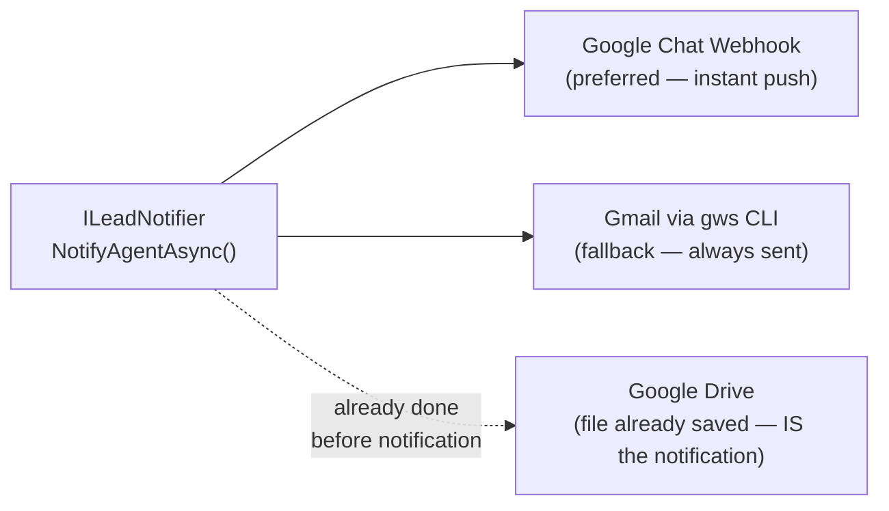

#### Channel 1: Google Chat Webhook (preferred)

Google Chat supports **incoming webhooks** — a URL that accepts a JSON POST with no OAuth. The agent creates a Chat Space (or DM), adds a webhook via `Apps & Integrations > Add Webhooks`, and saves the URL in their agent config.

**Config:**
```json
// config/agents/jenise-buckalew.json
{
  "integrations": {
    "notifications": {
      "chatWebhookUrl": "https://chat.googleapis.com/v1/spaces/SPACE_ID/messages?key=KEY&token=TOKEN"
    }
  },
  "voice": {
    "description": "Warm, professional, and approachable. Uses first names. Avoids jargon — explains terms when needed. Ends messages with a question to keep the conversation going. Light humor is OK. Emoji-friendly but not excessive. Signs off as 'Jenise' not 'Jenise Buckalew, REALTOR®'.",
    "sampleMessages": [
      "Hi Jane! I saw your inquiry about homes in Nags Head — great area! I actually have a few off-market options I think you'd love. Want me to send them over?",
      "Hey John, I ran the numbers on your place and wow — you've built some serious equity! Let me put together a full market analysis for you. Free, no strings. Sound good?"
    ],
    "importedFrom": null
  }
}
```

> **Agent voice** is used by Claude whenever it drafts any communication on behalf of the agent — WhatsApp messages, email follow-ups, Chat card text, cold call openers, and even the "Why this fits" notes in home search results. The `description` field is injected into Claude's system prompt. The `sampleMessages` array provides few-shot examples of the agent's actual writing style. The `importedFrom` field (Phase 2) can point to a URL or file where the agent's voice was scraped from (e.g., their existing website, social media posts, past emails).

**Why Chat over email:**
- **Instant push notification** on agent's phone — they see it immediately between showings
- **Rich cards** with buttons — "Call Now", "View in Drive", "Send CMA"
- **No self-send confusion** — email notification comes from the agent's own Gmail (gws CLI sends as authenticated user), which is confusing. Chat feels like a separate system alerting them.
- **Threaded conversation** — multiple leads don't get buried in inbox

**Chat card format:**
```json
{
  "cardsV2": [{
    "cardId": "lead-{leadId}",
    "card": {
      "header": {
        "title": "New Lead: Jane Doe",
        "subtitle": "Relocation — Score: 82/100 ⭐⭐⭐⭐",
        "imageUrl": "{gravatarUrl}"
      },
      "sections": [
        {
          "header": "Why They're Moving",
          "widgets": [{
            "decoratedText": {
              "text": "Relocating for new VP of Engineering role at Acme Corp in Raleigh"
            }
          }]
        },
        {
          "header": "Conversation Starters",
          "widgets": [{
            "decoratedText": {
              "text": "\"Congratulations on the VP role at Acme Corp! A lot of folks relocating to Raleigh love the [Neighborhood] area.\""
            }
          }]
        },
        {
          "header": "Contact",
          "widgets": [{
            "decoratedText": {
              "startIcon": { "knownIcon": "PHONE" },
              "text": "(555) 123-4567"
            }
          }, {
            "decoratedText": {
              "startIcon": { "knownIcon": "EMAIL" },
              "text": "jane@example.com"
            }
          }]
        },
        {
          "widgets": [{
            "buttonList": {
              "buttons": [
                { "text": "View Full Profile", "onClick": { "openLink": { "url": "{driveLeadFolderUrl}" } } },
                { "text": "Call Now", "onClick": { "openLink": { "url": "tel:5551234567" } } }
              ]
            }
          }]
        }
      ]
    }
  }]
}
```

**Rate limit:** 1 request/second per Chat space — fine for lead volume.

#### Channel 2: Gmail Email (always sent as fallback)

Uses `IGwsService` to send via gws CLI from the agent's Gmail account. This is always sent even if Chat webhook succeeds — email serves as the permanent record.

**Note:** This means the agent receives an email from their own address. This is a known trade-off — gws CLI sends as the authenticated Gmail user. Acceptable for MVP; a system sender address can be added later if agents find it confusing.

#### Channel 3: WhatsApp Business API (Phase 2)

Many real estate agents live in WhatsApp — it's often their primary communication tool with clients. The `ILeadNotifier` architecture supports adding WhatsApp as a notification channel via the **WhatsApp Business API** (or a provider like Twilio WhatsApp).

**Config:**
```json
{
  "integrations": {
    "notifications": {
      "chatWebhookUrl": "https://chat.googleapis.com/...",
      "whatsappPhoneId": "+15551234567",
      "whatsappProvider": "twilio"
    }
  }
}
```

**Not in Phase 1** — requires WhatsApp Business verification, template message approval (WhatsApp requires pre-approved templates for business-initiated messages), and a Twilio/Meta Business account. But the `MultiChannelLeadNotifier` is designed to add this with a single new `try/catch` block per the existing Chat pattern. Log code `[LEAD-040]` is reserved.

#### Channel 4: Google Drive (implicit — already done)

The `Lead Profile.md` and `Research & Insights.md` files are already saved to Drive before the notification fires. The Drive folder IS the canonical record. Chat, email, and WhatsApp are just alerts pointing the agent to Drive.

### Email Content

**To:** Agent's email (from agent config `identity.email`)
**Subject:** `New Lead: {firstName} {lastName} — {motivationCategory} ({score}/100)`
  - e.g., "New Lead: Jane Doe — Relocation (82/100)"
  - e.g., "New Lead: John Smith — First-Time Buyer (45/100)"
  - e.g., "New Lead: Sarah Lee — Growing Family (71/100)"
  - Falls back to lead types if motivation is unknown: "New Lead: Bob Jones — Buying & Selling (38/100)"

**Body** (plain text, formatted):
```
You have a new lead!

━━━ WHY THEY'RE MOVING ━━━
Relocation — Jane started a new VP of Engineering role at Acme Corp
in Raleigh (Jan 2026). She's been in Kill Devil Hills for 8 years and
appears to be selling to relocate closer to the new office.

Supporting signals:
  • LinkedIn: Promoted to VP of Engineering at Acme Corp (Jan 2026)
  • Facebook: Posted about "new chapter" and "big move" (Feb 2026)
  • Property: Owned since 2018, estimated value $385K — strong equity position

━━━ LEAD SCORE: 82/100 ━━━
Motivation: Strong (clear relocation trigger) — 30pts
Timeline: High urgency (1-3 months, job already started) — 22pts
Financial: Pre-approved buyer, high equity seller — 18pts
Data: Rich profile from 5 sources — 12pts

━━━ COLD CALL OPENERS ━━━
• "Congratulations on the VP role at Acme Corp! A lot of folks relocating
  to Raleigh for work love the [Neighborhood] area — great commute and
  schools. Want me to send you a few options?"
• "I see you've been in your Kill Devil Hills home for about 8 years —
  with the way that market has appreciated, you'd be in a great equity
  position. Happy to run the numbers for you."
• "Moving for a new job is exciting but stressful — I specialize in
  helping people sell and buy in the same timeline. Want to chat about
  how to coordinate both?"

━━━ LEAD DETAILS ━━━
Name: Jane Doe
Email: jane@example.com
Phone: 555-123-4567
Timeline: 1-3 months
Interested in: Buying & Selling

━━━ PROFILE ━━━
Job: VP of Engineering at Acme Corp (since Jan 2026)
Industry: Technology
LinkedIn: https://linkedin.com/in/janedoe
Facebook: https://facebook.com/janedoe
Community: Youth soccer coach, PTA member
Interests: Hiking, photography, home renovation

Property: Owned since 2018 | Est. value: $385,000
Years at address: 8

━━━ BUYING DETAILS ━━━
Desired Area: Nags Head
Budget: $300,000 - $500,000
Bedrooms: 3+ | Bathrooms: 2+
Pre-approved: Yes ($450,000)

━━━ SELLING DETAILS ━━━
Property: 123 Main St, Kill Devil Hills, NC 27948
Beds: 4 | Baths: 2 | Sqft: 2,100

Notes: Looking to sell and buy in the same area

---
This lead was submitted through your Real Estate Star website.
Lead analysis powered by Real Estate Star AI.
```

Sections are omitted when not applicable (buyer-only shows no selling section, enrichment sections omitted if enrichment returned empty).

## CMA Pipeline Trigger

When `leadTypes` includes `"selling"` and `seller.address` is present, the endpoint triggers the existing CMA pipeline. This requires creating a `CmaJob` aggregate — the pipeline cannot run with just a Lead.

**Steps in `SubmitLeadEndpoint`:**

1. Map seller data + contact info to `Features.Cma.Lead` domain model via `LeadMappers.ToCmaLead()`. **Important**: The `Timeline` field must be mapped from compact enum values to display-format strings that `CmaJob.GetReportType()` expects:
   - `"asap"` → `"ASAP"`
   - `"1-3months"` → `"1-3 months"`
   - `"3-6months"` → `"3-6 months"`
   - `"6-12months"` → `"6-12 months"`
   - `"justcurious"` → `"Just curious"`

   Without this mapping, `GetReportType` defaults to `Standard` for all leads regardless of urgency.
2. Create a `CmaJob` via `CmaJob.Create(agentId, cmaLead)` — this initializes the state machine at `Parsing`
3. Store the job in `ICmaJobStore.Set(agentId, job)`
4. Fire `Task.Run` with try-catch (same pattern as `SubmitCmaEndpoint`):
   ```csharp
   _ = Task.Run(async () =>
   {
       try
       {
           // Step 1: Enrich the lead (scrape + score)
           LeadEnrichment enrichment;
           LeadScore score;
           try
           {
               enrichment = await enricher.EnrichAsync(lead, CancellationToken.None);
               score = enrichment.Score; // Score is generated as part of enrichment
               lead.Enrichment = enrichment;
               lead.Score = score;
               await leadStore.UpdateEnrichmentAsync(agentId, lead.Id, enrichment, score, CancellationToken.None);
               logger.LogInformation("[LEAD-009] Lead enriched for agent {AgentId}, lead {LeadId}, score {Score}",
                   agentId, lead.Id, score.Score);
           }
           catch (Exception ex)
           {
               logger.LogWarning(ex, "[LEAD-007] Lead enrichment failed for agent {AgentId}, lead {LeadId}",
                   agentId, lead.Id);
               // Graceful degradation — notify with whatever we have
           }

           // Step 2: Notify agent (with enrichment if available)
           try
           {
               await notifier.NotifyAgentAsync(lead, agentEmail, agentName, CancellationToken.None);
           }
           catch (Exception ex)
           {
               logger.LogError(ex, "[LEAD-005] Agent notification failed for agent {AgentId}, lead {LeadId}",
                   agentId, lead.Id);
           }

           // Step 3: Trigger CMA pipeline if seller
           if (lead.LeadTypes.Contains("selling") && lead.Seller?.Address is not null)
           {
               var cmaLead = LeadMappers.ToCmaLead(lead);
               var job = CmaJob.Create(agentId, cmaLead);
               cmaJobStore.Set(agentId, job);

               try
               {
                   await pipeline.ExecuteAsync(job, agentId, cmaLead, async status =>
                   {
                       job.AdvanceTo(status);
                       cmaJobStore.Set(agentId, job);
                   }, CancellationToken.None);

                   await leadStore.UpdateCmaJobIdAsync(agentId, lead.Id, job.Id.ToString(), CancellationToken.None);
               }
               catch (Exception ex)
               {
                   logger.LogError(ex, "[LEAD-004] CMA pipeline failed for agent {AgentId}, lead {LeadId}, job {JobId}",
                       agentId, lead.Id, job.Id);
                   job.Fail("Pipeline execution failed.");
                   cmaJobStore.Set(agentId, job);
               }
           }
       }
       catch (Exception ex)
       {
           logger.LogError(ex, "[LEAD-010] Unhandled error in lead processing for agent {AgentId}, lead {LeadId}",
               agentId, lead.Id);
       }
   });
   ```
5. Store the `job.Id` as `cmaJobId` in the lead's JSON file after pipeline completes

**Dependencies injected into `SubmitLeadEndpoint.Handle`:**
- `string agentId` — from route
- `SubmitLeadRequest request` — from body
- `IAgentConfigService agentConfig` — validate agent exists (404 if null)
- `ILeadStore leadStore` — new, file-based lead persistence
- `ILeadEnricher enricher` — new, lead enrichment pipeline (scrape + score)
- `ILeadNotifier notifier` — new, agent email notification
- `IHomeSearchProvider homeSearchProvider` — new, buyer listing search (MLS or scraper)
- `IMarketingConsentLog consentLog` — new, audit log to Google Sheets
- `ICmaJobStore cmaJobStore` — existing, for CmaJob persistence (only used for seller leads)
- `ICmaPipeline pipeline` — existing, for pipeline execution (only used for seller leads)
- `ILogger<SubmitLeadEndpoint> logger` — structured logging
- `CancellationToken ct` — required (no `= default`)

**Note on `CancellationToken.None` in `Task.Run`:** The fire-and-forget block passes `CancellationToken.None` to `pipeline.ExecuteAsync()` intentionally — the background work must not be cancelled when the HTTP request completes. Do not "fix" this to use `ct`.

This reuses the existing pipeline with zero changes to it. The calling code mirrors `SubmitCmaEndpoint` lines 38-67.

## Buyer Home Search Pipeline

When `leadTypes` includes `"buying"` and `buyer.desiredArea` is present, the endpoint triggers a home search pipeline that finds active listings matching the buyer's criteria and emails them a curated list.

### Purpose

Just like seller leads get a CMA report, buyer leads get a **personalized home search** — a curated set of active listings matching their criteria, delivered to their inbox. This makes the lead's first interaction with the agent immediately valuable and demonstrates the agent's market knowledge.

### Data Source Hierarchy

The pipeline uses a tiered approach — try the best source first, fall back to public data:

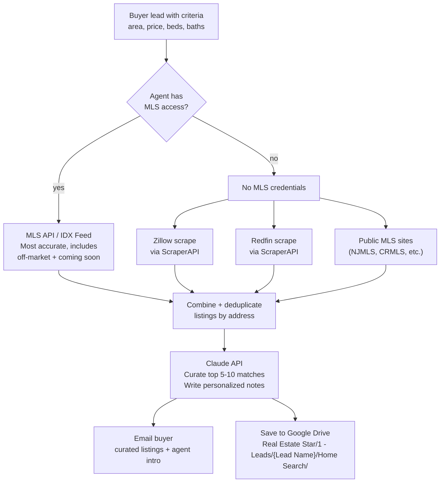

| Source | Pros | Cons | Access Method |
|--------|------|------|---------------|
| **MLS API / IDX Feed** | Most accurate, includes pending/coming-soon, agent-exclusive data | Requires MLS membership + API credentials per board | Agent config: `integrations.mls.apiKey`, `integrations.mls.boardId` |
| **Zillow** | Largest consumer inventory, Zestimates, photos | Rate-limited, may block scrapers, data can lag 24-48h | ScraperAPI with `render=true`, extract from `__NEXT_DATA__` |
| **Redfin** | Accurate pricing, good map data, agent tour insights | Same scraping challenges as Zillow | ScraperAPI, extract from JSON-LD or script tags |
| **Public MLS portals** | Direct from source, sometimes more current than Zillow | Different URL patterns per MLS board, fragmented | ScraperAPI, board-specific URL templates in config |

### `IHomeSearchProvider` Interface

```csharp
public interface IHomeSearchProvider
{
    Task<List<Listing>> SearchAsync(HomeSearchCriteria criteria, CancellationToken ct);
}
```

**Implementations:**
- `MlsHomeSearchProvider` — Direct MLS/IDX API (preferred, when agent has credentials)
- `ScraperHomeSearchProvider` — Zillow + Redfin + public MLS scraping via ScraperAPI (fallback)

Provider selection is based on agent config — if `integrations.mls` is configured, use MLS; otherwise fall back to scraping.

### `HomeSearchCriteria` Model

```csharp
public record HomeSearchCriteria
{
    public required string DesiredArea { get; init; }     // From buyer.desiredArea
    public decimal? MinPrice { get; init; }
    public decimal? MaxPrice { get; init; }
    public int? MinBeds { get; init; }
    public int? MinBaths { get; init; }
    public string? AgentId { get; init; }                 // For MLS credential lookup
}
```

### `Listing` Model

```csharp
public record Listing
{
    public required string Address { get; init; }
    public required string City { get; init; }
    public required string State { get; init; }
    public required string Zip { get; init; }
    public required decimal Price { get; init; }
    public int? Beds { get; init; }
    public int? Baths { get; init; }
    public int? Sqft { get; init; }
    public string? PhotoUrl { get; init; }
    public string? ListingUrl { get; init; }              // Link to view listing
    public string? MlsNumber { get; init; }
    public string? Source { get; init; }                  // "mls", "zillow", "redfin"
    public DateTime? ListedDate { get; init; }
    public int? DaysOnMarket { get; init; }
    public string? AgentNote { get; init; }               // Claude-generated per-listing note
}
```

### Pipeline Steps

1. **Build search criteria** from `BuyerDetails` — map `desiredArea`, price range, beds, baths
2. **Search listings** via `IHomeSearchProvider`:
   - If agent has MLS credentials → `MlsHomeSearchProvider` (returns 20-50 raw listings)
   - Else → `ScraperHomeSearchProvider` (scrapes Zillow + Redfin + public MLS in parallel, deduplicates by address)
3. **Claude curation** — Send listings + buyer profile + enrichment data to Claude:
   - Select top 5-10 best matches (not just by criteria, but by inferred motivation — e.g., if relocating for work, prioritize short commute)
   - Write a personalized 1-2 sentence note per listing explaining why it's a good fit
   - Write an intro paragraph from the agent's perspective
   - If enrichment found the buyer's motivation, use it to frame the selections
4. **Email buyer** — Send curated listings via `IGwsService.SendEmailAsync()`:
   - From: agent's Gmail (via gws CLI)
   - Subject: `{agentName}: {count} homes in {desiredArea} matching your criteria`
   - Body: Intro paragraph + listing cards with photos, price, details, agent notes, and listing links
5. **Save search results** to Google Drive via `LeadPaths.HomeSearchFile(lead.FullName, DateTime.UtcNow)` → `Real Estate Star/1 - Leads/{Name}/Home Search/{date}-Home Search Results.md`
6. **Update lead record** with `homeSearchId` linking to the saved search

### Integration with Lead Submission Flow

The home search runs in the same `Task.Run` block as enrichment, notification, and CMA — all sharing the captured `parentContext` for distributed tracing:

```csharp
// Inside Task.Run, after notification
// Step 4: Home search if buyer
if (lead.LeadTypes.Contains("buying") && lead.Buyer?.DesiredArea is not null)
{
    using var searchActivity = LeadActivitySource.Source.StartActivity(
        "lead.home_search", ActivityKind.Internal, parentContext);
    try
    {
        var criteria = LeadMappers.ToSearchCriteria(lead);
        var listings = await homeSearchProvider.SearchAsync(criteria, CancellationToken.None);
        var curated = await curateWithClaude(listings, lead, CancellationToken.None);
        await notifier.SendBuyerListingsAsync(lead, curated, agentEmail, agentName, CancellationToken.None);
        await leadStore.UpdateHomeSearchIdAsync(agentId, lead.Id, searchId, CancellationToken.None);
        logger.LogInformation("[LEAD-024] Home search completed for agent {AgentId}, lead {LeadId}, {Count} listings",
            agentId, lead.Id, curated.Count);
    }
    catch (Exception ex)
    {
        logger.LogError(ex, "[LEAD-025] Home search failed for agent {AgentId}, lead {LeadId}",
            agentId, lead.Id);
    }
}
```

### CMA + Home Search for Buy-and-Sell Leads

When a lead includes **both** buyer and seller data, **both pipelines fire**:
- CMA pipeline → seller gets a market analysis report
- Home search pipeline → buyer gets curated listings

The lead record tracks both: `cmaJobId` and `homeSearchId`.

### Buyer Email Content

**To:** Lead's email
**Subject:** `Jenise Buckalew: 7 homes in Nags Head matching your criteria`

**Body:**
```
Hi Jane,

Thank you for reaching out! Based on what you're looking for — a 3+ bed, 2+ bath
home in Nags Head in the $300K-$500K range — I've pulled together some listings
I think you'll love.

Since you're relocating for your new role, I focused on areas with easy access
to the main corridors and great school districts for families.

━━━━━━━━━━━━━━━━━━━━━━━━━━━━━━━━━━━━━━━━

📍 123 Ocean Blvd, Nags Head, NC 27959
   $425,000 | 4 bed | 2.5 bath | 2,200 sqft
   Listed 5 days ago | MLS# 12345
   → "Great fit — spacious layout, 10 min from the business district,
     and the school district is one of the best in the area."
   View: https://...

📍 456 Beach Rd, Nags Head, NC 27959
   $389,000 | 3 bed | 2 bath | 1,800 sqft
   Listed 12 days ago | MLS# 67890
   → "Under budget with room to spare. Recently renovated kitchen,
     and the neighborhood has a young-family feel you might like."
   View: https://...

... (5-10 listings total)

━━━━━━━━━━━━━━━━━━━━━━━━━━━━━━━━━━━━━━━━

Want to schedule tours for any of these? Just reply to this email or call me
at {agentPhone}. I'd love to help you find the right home!

Best,
{agentName}
{agentPhone}
{agentEmail}

---
You're receiving this because you submitted a home search request through
{agentName}'s website.

To opt out of future marketing emails: {agentSiteUrl}/privacy/opt-out?...
To request deletion of your data: {agentSiteUrl}/privacy/delete
```

**Note:** This email is **transactional** (the buyer explicitly requested a home search by submitting the form with buyer criteria), so it is sent regardless of marketing consent. The opt-out footer is still included per CAN-SPAM best practice.

### Vertical Slice Addition

```
Features/
  Leads/
    Services/
      IHomeSearchProvider.cs          # Pluggable listing search interface
      MlsHomeSearchProvider.cs        # Direct MLS/IDX API (preferred)
      ScraperHomeSearchProvider.cs    # Zillow + Redfin + public MLS scraping
    HomeSearchCriteria.cs             # Search criteria mapped from BuyerDetails
    Listing.cs                        # Individual listing record
```

### DI Registration

```csharp
// Home search — MLS if configured, scraper fallback
if (builder.Configuration.GetSection("Mls").Exists())
    builder.Services.AddScoped<IHomeSearchProvider, MlsHomeSearchProvider>();
else
    builder.Services.AddScoped<IHomeSearchProvider, ScraperHomeSearchProvider>();
```

### Agent Config Addition

```json
// config/agents/jenise-buckalew.json
{
  "integrations": {
    "mls": {
      "provider": "njmls",
      "apiKey": "mls_abc123...",
      "boardId": "NJMLS",
      "agentMlsId": "12345"
    }
  }
}
```

If `integrations.mls` is absent, the pipeline falls back to scraping. This keeps the system working for agents who don't have MLS API access yet.

## Google Drive Change Monitor

### Purpose

The agent's Google Drive is a **two-way interface** — the system writes to it, but the agent also acts on it. When an agent moves a lead folder from `1 - Leads/` to `2 - Active Clients/`, renames it, adds notes, or deletes a file, Claude should detect the change and react. This is the foundation for:

- **Lead lifecycle tracking** — agent moves folder → status automatically updates
- **WhatsApp notifications** — folder move triggers a WhatsApp message to the buyer/seller ("Your agent is now actively working with you!")
- **Automated follow-ups** — lead sits in `1 - Leads/` for 48 hours with no folder move → Claude sends agent a reminder
- **Activity logging** — every agent action on Drive is captured for analytics

### Architecture: Cron + gws CLI Polling

Instead of registering a Drive webhook (which requires a public HTTPS endpoint, channel renewal every 7 days, and infrastructure complexity), use a **cron job that polls Google Drive via the gws CLI** on a schedule. This fits the existing architecture — no new infrastructure, no webhook management.

```
┌───────────────────────────────────────────────────────────────────────────┐
│  DRIVE CHANGE MONITOR                                                     │
│                                                                           │
│  ┌─────────────┐     ┌──────────────────────┐     ┌──────────────────┐   │
│  │  Cron Job    │────►│  .NET API             │────►│  Google Drive    │   │
│  │  (every 60s) │     │  DriveChangeMonitor   │     │  via gws CLI    │   │
│  │              │     │  service              │     │                  │   │
│  └─────────────┘     └──────────┬───────────┘     └──────────────────┘   │
│                                  │                                        │
│                    ┌─────────────┼──────────────┐                        │
│                    ▼             ▼              ▼                         │
│             ┌───────────┐ ┌───────────┐ ┌─────────────┐                  │
│             │  Update    │ │  WhatsApp │ │  Agent      │                  │
│             │  Lead      │ │  Notifier │ │  Reminder   │                  │
│             │  Status    │ │  (Phase 2)│ │  (Phase 2)  │                  │
│             └───────────┘ └───────────┘ └─────────────┘                  │
└───────────────────────────────────────────────────────────────────────────┘
```

### How It Works

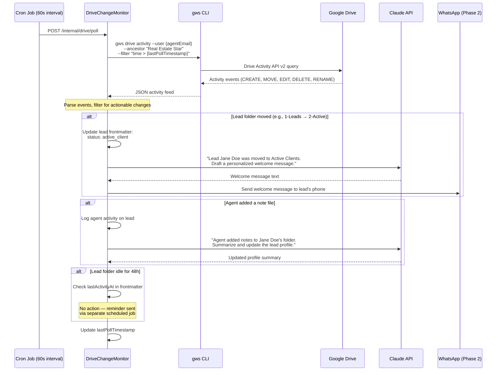

### Implementation

#### `DriveChangeMonitor` Service

```csharp
// Features/Leads/Services/DriveChangeMonitor.cs
public class DriveChangeMonitor(
    IGwsService gwsService,
    IFileStorageProvider storage,
    ILeadNotifier notifier,
    ILogger<DriveChangeMonitor> logger)
{
    // Folder number → lead status mapping
    private static readonly Dictionary<string, string> FolderStatusMap = new()
    {
        ["1 - Leads"] = "new_lead",
        ["2 - Active Clients"] = "active_client",
        ["3 - Under Contract"] = "under_contract",
        ["4 - Closed"] = "closed",
        ["5 - Inactive"] = "inactive",
    };

    public async Task<DriveChangeResult> PollAsync(string agentId, string agentEmail,
        DateTime since, CancellationToken ct)
    {
        // Step 1: Query Drive Activity API via gws CLI
        var activityJson = await gwsService.QueryDriveActivityAsync(
            agentEmail,
            ancestorFolder: "Real Estate Star",
            since: since,
            ct);

        var events = DriveActivityParser.Parse(activityJson);
        var result = new DriveChangeResult();

        foreach (var evt in events)
        {
            switch (evt.Action)
            {
                case DriveAction.Move:
                    await HandleFolderMoveAsync(agentId, agentEmail, evt, ct);
                    result.MovesProcessed++;
                    break;

                case DriveAction.Create:
                    // Agent added a new file (e.g., notes, photos)
                    await HandleFileCreateAsync(agentId, evt, ct);
                    result.CreatesProcessed++;
                    break;

                case DriveAction.Edit:
                    // Agent edited a file — could be adding notes to Lead Profile
                    await HandleFileEditAsync(agentId, evt, ct);
                    result.EditsProcessed++;
                    break;

                case DriveAction.Delete:
                    logger.LogWarning("[LEAD-041] Agent deleted file {FileName} in {Folder}",
                        evt.FileName, evt.ParentFolder);
                    result.DeletesDetected++;
                    break;
            }
        }

        return result;
    }

    private async Task HandleFolderMoveAsync(string agentId, string agentEmail,
        DriveActivityEvent evt, CancellationToken ct)
    {
        // Detect which numbered folder the lead was moved TO
        var destinationFolder = evt.DestinationParent; // e.g., "Real Estate Star/2 - Active Clients"
        var folderNumber = FolderStatusMap.Keys
            .FirstOrDefault(k => destinationFolder.Contains(k));

        if (folderNumber == null) return;

        var newStatus = FolderStatusMap[folderNumber];
        logger.LogInformation("[LEAD-042] Lead folder {LeadName} moved to {Destination} — status: {Status}",
            evt.FileName, destinationFolder, newStatus);

        // Update frontmatter status
        var leadProfilePath = $"{destinationFolder}/{evt.FileName}/Lead Profile.md";
        var content = await storage.ReadDocumentAsync(
            $"{destinationFolder}/{evt.FileName}", "Lead Profile.md", ct);

        if (content != null)
        {
            var updated = YamlFrontmatterParser.UpdateField(content, "status", newStatus);
            updated = YamlFrontmatterParser.UpdateField(updated, "movedAt", DateTime.UtcNow.ToString("O"));
            await storage.UpdateDocumentAsync(
                $"{destinationFolder}/{evt.FileName}", "Lead Profile.md", updated, ct);
        }

        // Phase 2: Trigger WhatsApp notification based on new status
        // e.g., moved to "Active Clients" → send welcome message to lead
        // e.g., moved to "Under Contract" → send congratulations to lead
    }
}
```

#### Poll Endpoint (internal only)

```csharp
// Features/Leads/PollDriveChanges/PollDriveChangesEndpoint.cs
// POST /internal/drive/poll
// Called by cron job — not exposed to CF Worker
internal static async Task<IResult> Handle(
    DriveChangeMonitor monitor,
    IAgentConfigService agentConfig,
    IConfiguration config,
    ILogger<PollDriveChangesEndpoint> logger,
    CancellationToken ct)
{
    var lastPoll = config.GetValue<DateTime?>("DriveMonitor:LastPollTimestamp")
                   ?? DateTime.UtcNow.AddMinutes(-2); // Default: look back 2 minutes

    // Poll for ALL agents (iterate agent configs)
    var agents = await agentConfig.ListAllAsync(ct);
    var totalResult = new DriveChangeResult();

    foreach (var agent in agents)
    {
        try
        {
            var result = await monitor.PollAsync(agent.Id, agent.Email, lastPoll, ct);
            totalResult.Merge(result);
        }
        catch (Exception ex)
        {
            logger.LogWarning(ex, "[LEAD-043] Drive poll failed for agent {AgentId}", agent.Id);
            // Continue with other agents — one failure doesn't block all
        }
    }

    // Persist last poll timestamp (in-memory for now, could be a file or config)
    // TODO: Persist to durable storage when multi-instance
    logger.LogInformation("[LEAD-044] Drive poll complete: {Moves} moves, {Creates} creates, {Edits} edits",
        totalResult.MovesProcessed, totalResult.CreatesProcessed, totalResult.EditsProcessed);

    return Results.Ok(totalResult);
}
```

#### Cron Configuration

The poll runs on a fixed interval. Two options:

**Option A: Azure Container Apps Cron Job** (preferred for production)
```yaml
# infra/azure/drive-monitor-cron.yaml
apiVersion: apps/v1
kind: CronJob
metadata:
  name: drive-change-monitor
spec:
  schedule: "*/1 * * * *"  # Every 60 seconds
  jobTemplate:
    spec:
      containers:
        - name: poll
          image: curlimages/curl:latest
          command: ["curl", "-s", "-X", "POST",
                    "http://real-estate-star-api/internal/drive/poll"]
```

**Option B: GitHub Actions scheduled workflow** (simpler, good for MVP)
```yaml
# .github/workflows/drive-monitor.yml
name: Drive Change Monitor

on:
  schedule:
    - cron: '*/2 * * * *'  # Every 2 minutes (GitHub Actions minimum is 5 min, but close)
  workflow_dispatch:         # Manual trigger for testing

jobs:
  poll:
    runs-on: ubuntu-latest
    steps:
      - name: Poll for Drive changes
        run: |
          curl -s -X POST \
            -H "Authorization: Bearer ${{ secrets.INTERNAL_API_TOKEN }}" \
            "https://api.real-estate-star.com/internal/drive/poll"
```

> **Note:** GitHub Actions `schedule` has a minimum granularity of ~5 minutes and is not guaranteed to be exact. For production, use Azure Container Apps cron or a dedicated scheduler. For MVP, the GitHub Actions approach is acceptable with a 5-minute interval.

### Actionable Events & Responses

| Agent Action in Drive | How Detected | Automated Response | Phase |
|----------------------|--------------|-------------------|-------|
| Move lead folder `1 - Leads/` → `2 - Active Clients/` | `MOVE` event, destination contains "2 - Active Clients" | Update frontmatter `status: active_client`. WhatsApp buyer: "Your agent is now working with you!" | 1 (status), 2 (WhatsApp) |
| Move lead folder → `3 - Under Contract/` | `MOVE` event | Update status. WhatsApp: "Congratulations! You're under contract." | 1 (status), 2 (WhatsApp) |
| Move lead folder → `4 - Closed/` | `MOVE` event | Update status. WhatsApp: "Closing complete! Congratulations on your new home." | 1 (status), 2 (WhatsApp) |
| Move lead folder → `5 - Inactive/Dead Leads/` | `MOVE` event | Update status. Stop all future communications. | 1 |
| Agent adds a file to lead folder | `CREATE` event in lead subfolder | Log activity. Optionally: Claude reads the file and updates the lead summary. | 2 |
| Agent edits `Lead Profile.md` | `EDIT` event on known file | Log activity. Claude diffs the change and updates search index tags. | 2 |
| Agent deletes a file from lead folder | `DELETE` event | Log warning `[LEAD-041]`. Do NOT auto-restore — agent may have intentionally deleted. | 1 |
| Lead folder untouched for 48 hours | No activity events for folder | Send agent a reminder via Chat: "Jane Doe submitted 2 days ago — have you followed up?" | 2 |

### gws CLI Integration

The `gws` CLI wraps the Google Drive Activity API v2. Add a new method to `IGwsService`:

```csharp
// Features/Cma/Services/Gws/IGwsService.cs — add new method
Task<string> QueryDriveActivityAsync(
    string agentEmail,
    string ancestorFolder,
    DateTime since,
    CancellationToken ct);
```

**Implementation:**
```csharp
// gws CLI command
// gws drive activity --user jenise@email.com --ancestor "Real Estate Star" --after "2026-03-19T14:00:00Z"
// Returns JSON array of activity events

public async Task<string> QueryDriveActivityAsync(
    string agentEmail, string ancestorFolder, DateTime since, CancellationToken ct)
{
    return await RunGwsAsync(ct,
        "drive", "activity",
        "--user", agentEmail,
        "--ancestor", ancestorFolder,
        "--after", since.ToString("O"),
        "--format", "json");
}
```

### Drive Activity Event Model

```csharp
// Features/Leads/DriveActivityEvent.cs
public record DriveActivityEvent
{
    public required DriveAction Action { get; init; }      // Move, Create, Edit, Delete, Rename
    public required string FileName { get; init; }          // "Jane Doe" (folder) or "Lead Profile.md" (file)
    public required string ParentFolder { get; init; }      // "Real Estate Star/1 - Leads"
    public string? DestinationParent { get; init; }         // For MOVE: "Real Estate Star/2 - Active Clients"
    public required DateTime Timestamp { get; init; }
    public required string ActorEmail { get; init; }        // Who made the change
}

public enum DriveAction { Move, Create, Edit, Delete, Rename }

// Features/Leads/DriveChangeResult.cs
public class DriveChangeResult
{
    public int MovesProcessed { get; set; }
    public int CreatesProcessed { get; set; }
    public int EditsProcessed { get; set; }
    public int DeletesDetected { get; set; }

    public void Merge(DriveChangeResult other)
    {
        MovesProcessed += other.MovesProcessed;
        CreatesProcessed += other.CreatesProcessed;
        EditsProcessed += other.EditsProcessed;
        DeletesDetected += other.DeletesDetected;
    }
}
```

### WhatsApp Integration (Phase 2 — triggered by Drive changes)

When the Drive monitor detects a folder move, it can trigger a WhatsApp message to the lead. This is where the **Drive → Claude → WhatsApp** loop closes:

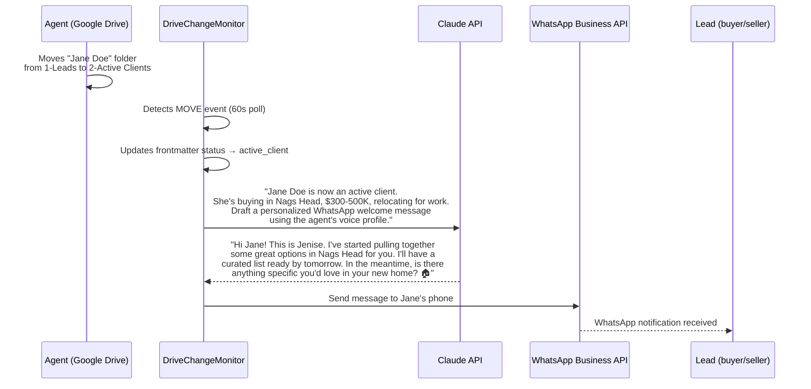

**Message templates by status change:**

| Status Change | Claude Prompt Context | Message Tone |
|--------------|----------------------|-------------|
| `new_lead` → `active_client` | Lead details, buyer/seller criteria, motivation | Warm welcome, "I'm on it" |
| `active_client` → `under_contract` | Property details, transaction context | Congratulatory, next-steps |
| `under_contract` → `closed` | Closing details | Celebration, ask for review |
| Any → `inactive` | Last activity date | No message (lead is dead) |

> **Claude's role:** Claude doesn't send templates — it drafts **personalized messages** using the lead's enrichment data (motivation, interests, property details). The agent sees the draft in a Google Chat card with "Approve & Send" and "Edit" buttons before it goes to WhatsApp. **No auto-send without agent approval** in Phase 2.

### Vertical Slice Files

```
Features/Leads/
  Services/
    DriveChangeMonitor.cs             # Polls Drive, processes events
    DriveActivityParser.cs            # Parses gws CLI JSON output → DriveActivityEvent[]
  DriveActivityEvent.cs               # Event model (Move, Create, Edit, Delete)
  DriveChangeResult.cs                # Poll result aggregate
  PollDriveChanges/
    PollDriveChangesEndpoint.cs       # POST /internal/drive/poll
```

### Log Codes

- `[LEAD-041]` Agent deleted file from lead folder (warning)
- `[LEAD-042]` Lead folder moved — status updated (info)
- `[LEAD-043]` Drive poll failed for agent (warning, continues with other agents)
- `[LEAD-044]` Drive poll complete — summary of changes processed (info)
- `[LEAD-045]` WhatsApp message drafted by Claude for lead (info, Phase 2)
- `[LEAD-046]` WhatsApp message sent to lead (info, Phase 2)
- `[LEAD-047]` WhatsApp send failed (warning, Phase 2)

### Security Considerations

- **`/internal/drive/poll` is NOT exposed to CF Workers** — it's internal only, protected by a separate `Authorization: Bearer {INTERNAL_API_TOKEN}` header. Add to the API's auth middleware as a separate path.
- **Agent impersonation risk**: The gws CLI authenticates as the agent's Google account. The poll must only read activity — never delete or modify files without going through `IFileStorageProvider` (which has audit logging).
- **Rate limiting**: Google Drive Activity API has a 600 queries/minute/user quota. With 60-second polling and ~10 agents, this is well within limits. Monitor with `[LEAD-044]` logs.
- **Clock skew**: Use `since = lastPollTimestamp - 30s` overlap to avoid missing events that arrive slightly out of order. Deduplicate by event ID.

## OpenAPI Spec + TypeScript Client Codegen

### Prerequisite: Add OpenAPI to the .NET API

.NET 10 has built-in OpenAPI support via `Microsoft.AspNetCore.OpenApi` (no Swashbuckle needed).

**Program.cs additions:**
```csharp
builder.Services.AddOpenApi();

// After app.Build():
app.MapOpenApi(); // Serves spec at /openapi/v1.json
```

This auto-generates an OpenAPI 3.1 spec from all minimal API endpoints (including the new `/agents/{agentId}/leads`). DataAnnotations (`[Required]`, `[StringLength]`, `[EmailAddress]`, etc.) are reflected as schema constraints.

### Generated TypeScript Client

Use `openapi-typescript` + `openapi-fetch` to generate a type-safe client from the API spec.

**New package:** `packages/api-client/`

```
packages/api-client/
  package.json
  openapi.json              # Checked-in spec snapshot (updated by codegen script)
  generated/
    types.ts                # Auto-generated types from OpenAPI spec
  client.ts                 # Typed fetch client (thin wrapper around openapi-fetch)
  index.ts                  # Re-exports
```

**Codegen script** (in `packages/api-client/package.json`):
```json
{
  "scripts": {
    "generate": "openapi-typescript http://localhost:5135/openapi/v1.json -o generated/types.ts",
    "generate:ci": "openapi-typescript openapi.json -o generated/types.ts"
  }
}
```

**Workflow:**
1. Developer runs API locally → `npm run generate` pulls live spec → regenerates types
2. CI uses checked-in `openapi.json` snapshot via `generate:ci` (no API needed at build time)
3. Update snapshot: `curl http://localhost:5135/openapi/v1.json > packages/api-client/openapi.json`

**Client usage** (in `packages/api-client/client.ts`):
```typescript
import createClient from "openapi-fetch";
import type { paths } from "./generated/types";

export function createApiClient(baseUrl: string) {
  return createClient<paths>({ baseUrl });
}
```

**Consumer usage** (in hooks like `useLeadSubmit`):
```typescript
const client = createApiClient(apiBaseUrl);
const { data, error } = await client.POST("/agents/{agentId}/leads", {
  params: { path: { agentId } },
  body: leadData,
});
```

Types for request body, response, and path params are all inferred from the spec — no manual `SubmitLeadRequest` / `SubmitLeadResponse` types needed.

### Impact on shared-types

The manually-defined types in `packages/shared-types/leads.ts` are **no longer needed** — they come from the generated spec. The existing `packages/shared-types/cma.ts` types (`CmaSubmitRequest`, `CmaSubmitResponse`) can also be replaced by the generated types in a follow-up, since the CMA endpoints will appear in the same OpenAPI spec.

`packages/shared-types/lead-form.ts` (form-side types like `LeadFormData`, `BuyerDetails`, `SellerDetails`) **stays** — these are UI form types, not API contract types. The `useLeadSubmit` hook maps from `LeadFormData` to the generated API request type.

### CI Integration

Add to the API's GitHub Actions workflow (or a monorepo-level step):
```yaml
- name: Generate API client types
  run: cd packages/api-client && npm run generate:ci
- name: Check for uncommitted type changes
  run: git diff --exit-code packages/api-client/generated/
```

This fails CI if someone changes an API endpoint but forgets to regenerate the client types — enforcing frontend/backend contract sync.

## Frontend Changes

### CmaSection.tsx

Replace the current submission logic:

**Before (current):**
```typescript
// Only calls API for sellers — buyer leads are lost
const isSelling = leadData.leadTypes.includes("selling") && leadData.seller?.address;
if (isSelling) {
  const success = await submit(accountId, leadData);
  if (!success) return;
}
```

**After:**
```typescript
// All leads go through server action (never calls API directly)
const result = await submitLead(accountId, leadData, turnstileToken);
if (result.error) { setError(result.error); return; }
```

### LeadForm: Turnstile + Honeypot

The LeadForm component adds two bot protection layers:

```tsx
import { Turnstile } from "@cloudflare/turnstile-widget";

function LeadForm({ onSubmit, agentId }) {
  const [turnstileToken, setTurnstileToken] = useState<string>("");

  return (
    <form onSubmit={handleSubmit}>
      {/* ... existing fields ... */}

      {/* Honeypot — hidden from real users, bots auto-fill it */}
      <input type="text" name="website" tabIndex={-1} autoComplete="off"
             style={{ position: "absolute", left: "-9999px" }} aria-hidden="true" />

      {/* Marketing consent checkbox */}
      <label>
        <input type="checkbox" name="marketingConsent" required />
        I agree to receive marketing communications from {agentName}...
      </label>

      {/* Turnstile — invisible, runs in background */}
      <Turnstile siteKey={process.env.NEXT_PUBLIC_TURNSTILE_SITE_KEY}
                 onSuccess={setTurnstileToken} />

      <button type="submit" disabled={!turnstileToken}>Submit</button>
    </form>
  );
}
```

### New: Server Action `submitLead`

Lives in `apps/agent-site/actions/submit-lead.ts`. This replaces the old direct-to-API pattern:

```typescript
"use server";

export async function submitLead(agentId: string, formData: LeadFormData, turnstileToken: string) {
  // 1. Check honeypot
  if (formData.website) return { leadId: "fake-id", status: "received" }; // Silent fake success

  // 2. Validate Turnstile server-side
  const isHuman = await validateTurnstile(turnstileToken);
  if (!isHuman) return { error: "Verification failed. Please try again." };

  // 3. API Key + HMAC-sign and forward to .NET API (secrets never in browser)
  const body = JSON.stringify(mapToApiRequest(formData));
  const response = await signAndForward(`/agents/${agentId}/leads`, body);

  return response.ok ? await response.json() : { error: "Something went wrong." };
}
```

**Key point:** The API URL (`LEAD_API_URL`), API key (`LEAD_API_KEY`), and HMAC secret (`LEAD_HMAC_SECRET`) are only in server-side environment — they never appear in the browser bundle.

### Removed: Direct API Client

The `useLeadSubmit` hook and `packages/api-client/` generated client are **no longer needed for lead submission** — server actions replace them. The generated client may still be useful for future portal features, but for this feature the browser never talks to the API.

### New Pages: Privacy

```
apps/agent-site/app/[handle]/privacy/
  delete/page.tsx       # Data deletion request form
  opt-out/page.tsx      # Marketing opt-out confirmation (includes re-subscribe link)
  subscribe/page.tsx    # Marketing re-subscribe confirmation
```

These pages also use server actions that HMAC-sign requests to the API.

## Vertical Slice Structure

```
Features/
  Leads/
    Lead.cs                         # Domain model (distinct from Cma.Lead — see below)
    BuyerDetails.cs                 # Buyer sub-object
    SellerDetails.cs                # Seller sub-object
    LeadEnrichment.cs               # Enrichment profile (job, events, openers)
    LeadScore.cs                    # Lead quality score (1-100 + reasoning)
    LeadMappers.cs                  # SubmitLeadRequest → Lead domain + ToCmaLead()
    LeadPaths.cs                    # Static path constants for Google Drive folder structure
    LeadMarkdownRenderer.cs         # Domain model → human-readable markdown (Lead Profile, Research, Home Search)
    Services/
      ILeadStore.cs                 # Pluggable storage interface
      GDriveLeadStore.cs            # Google Drive via gws CLI (default)
      FileLeadStore.cs              # Local markdown files (dev fallback)
      ILeadNotifier.cs              # Interface
      MultiChannelLeadNotifier.cs   # Chat webhook + Gmail email (multi-channel)
      LeadChatCardRenderer.cs       # Google Chat card JSON for new lead notifications
    RetryFailed/
      RetryFailedLeadsEndpoint.cs   # POST /internal/leads/retry-failed (re-process enrichment_failed leads)
      ILeadEnricher.cs              # Pluggable enrichment interface
      ScraperLeadEnricher.cs        # ScraperAPI + Claude (Phase 1 default)
    Submit/
      SubmitLeadRequest.cs          # Request DTO
      SubmitLeadResponse.cs         # Response DTO
      SubmitLeadEndpoint.cs         # POST /agents/{agentId}/leads
```

### Domain Model: `Features.Leads.Lead`

This is a **new type**, distinct from `Features.Cma.Lead` (which requires `[Required]` on Address/City/State/Zip and is seller-specific). The Leads domain model supports all lead types:

```csharp
namespace RealEstateStar.Api.Features.Leads;

public class Lead
{
    public required Guid Id { get; init; }
    public required string AgentId { get; init; }
    public required List<string> LeadTypes { get; init; }  // ["buying"], ["selling"], or both
    public required string FirstName { get; init; }
    public required string LastName { get; init; }
    public required string Email { get; init; }
    public required string Phone { get; init; }
    public required string Timeline { get; init; }
    public BuyerDetails? Buyer { get; init; }
    public SellerDetails? Seller { get; init; }
    public string? Notes { get; init; }
    public DateTime ReceivedAt { get; init; }
    public LeadEnrichment? Enrichment { get; set; }
    public LeadScore? Score { get; set; }
    public string? CmaJobId { get; set; }
    public string? HomeSearchId { get; set; }

    public string FullName => $"{FirstName} {LastName}";
}
```

Validation uses DataAnnotations on the request DTO, not the domain model — conditional validation (seller fields required only when leadTypes includes "selling") is handled in the endpoint with manual checks.

### Prerequisite: Promote `IGwsService` to Shared Service

`IGwsService` currently lives at `Features/Cma/Services/Gws/`. Since `Features/Leads/` will also depend on it, it must be promoted to a top-level shared location per the vertical slice rules ("only truly cross-feature services used by 2+ features live at top-level"):

```
Services/
  Gws/
    IGwsService.cs                  # Moved from Features/Cma/Services/Gws/
    GwsService.cs                   # Moved from Features/Cma/Services/Gws/
```

Update `using` statements in `Features/Cma/` to point to the new namespace. No logic changes.

### `ILeadStore` Interface

```csharp
public interface ILeadStore
{
    Task SaveAsync(Lead lead, CancellationToken ct);
    Task UpdateEnrichmentAsync(string agentId, Guid leadId, LeadEnrichment enrichment, LeadScore score, CancellationToken ct);
    Task UpdateCmaJobIdAsync(string agentId, Guid leadId, string cmaJobId, CancellationToken ct);
    Task UpdateHomeSearchIdAsync(string agentId, Guid leadId, string homeSearchId, CancellationToken ct);
    Task<Lead?> GetAsync(string agentId, Guid leadId, CancellationToken ct);
}
```

**Implementations:**

- **`GDriveLeadStore`** (default): Renders human-readable markdown documents via `LeadMarkdownRenderer` and writes them to per-lead subfolders under `Real Estate Star/1 - Leads/{Name}/`. Files include `Lead Profile.md` (contact + property details), `Research & Insights.md` (enrichment + score + cold call openers), and `Home Search Results.md` (curated listings for buyers). Uses `LeadPaths.*` for all path construction. YAML frontmatter carries system metadata (IDs, tokens) invisibly — the agent only sees clean markdown.
  - `SaveAsync`: Creates folder if needed, renders Lead Profile.md via `LeadMarkdownRenderer`, uploads to Drive
  - `UpdateCmaJobIdAsync`: Downloads doc, updates `cmaJobId`, re-uploads
  - `GetAsync`: Downloads and deserializes doc by ID

- **`FileLeadStore`** (dev fallback): Writes markdown files to local `data/leads/{agentId}/{leadName}/Lead Profile.md` using write-to-temp-then-rename. Same `LeadMarkdownRenderer` output as production — mirrors Drive folder structure locally. Used when gws CLI is not configured.

### `ILeadNotifier` Interface

```csharp
public interface ILeadNotifier
{
    Task NotifyAgentAsync(Lead lead, string agentEmail, string agentName, CancellationToken ct);
}
```

The `MultiChannelLeadNotifier` implementation sends through all configured channels. Each channel is independent — one failure doesn't block the others:

```csharp
public class MultiChannelLeadNotifier(
    IGwsService gwsService,
    IHttpClientFactory httpClientFactory,
    IAgentConfigService agentConfig,
    ILogger<MultiChannelLeadNotifier> logger) : ILeadNotifier
{
    public async Task NotifyAgentAsync(Lead lead, string agentEmail, string agentName, CancellationToken ct)
    {
        var config = await agentConfig.GetAsync(lead.AgentId, ct);
        var chatWebhookUrl = config?.Integrations?.Notifications?.ChatWebhookUrl;

        // Channel 1: Google Chat webhook (if configured)
        if (!string.IsNullOrEmpty(chatWebhookUrl))
        {
            try
            {
                var card = LeadChatCardRenderer.RenderNewLeadCard(lead);
                var client = httpClientFactory.CreateClient();
                await client.PostAsJsonAsync(chatWebhookUrl, card, ct);
                logger.LogInformation("[LEAD-033] Chat notification sent for lead {LeadId}", lead.Id);
            }
            catch (Exception ex)
            {
                logger.LogWarning(ex, "[LEAD-034] Chat notification failed for lead {LeadId}", lead.Id);
                // Don't rethrow — email fallback continues
            }
        }

        // Channel 2: Gmail email (always sent)
        await gwsService.SendEmailAsync(agentEmail, agentEmail, subject, body, null, ct);
        logger.LogInformation("[LEAD-003] Email notification sent for lead {LeadId}", lead.Id);
    }
}
```

### DI Registration

Add to `Program.cs` alongside existing service registrations:

```csharp
// Lead storage — GDrive by default, file fallback for dev
if (builder.Configuration.GetValue<bool>("Leads:UseLocalStorage"))
    builder.Services.AddSingleton<ILeadStore>(new FileLeadStore("data/leads"));
else
    builder.Services.AddScoped<ILeadStore, GDriveLeadStore>();

builder.Services.AddScoped<ILeadNotifier, MultiChannelLeadNotifier>();
builder.Services.AddScoped<ILeadEnricher, ScraperLeadEnricher>();
```

This makes the storage provider a config switch. Production uses GDrive; local dev can set `Leads:UseLocalStorage=true` in `appsettings.Development.json`.

## Data Deletion (GDPR / CCPA Right to Erasure)

### Regulatory Requirement

Both GDPR (EU) and CCPA (California) grant individuals the right to request deletion of their personal data. As a platform that collects PII (name, email, phone, address, employer, social profiles), Real Estate Star must support:

- **GDPR Art. 17**: "Right to erasure" — delete all personal data upon request
- **CCPA §1798.105**: "Right to delete" — delete personal information collected from the consumer

### What Gets Deleted

When a deletion request is processed, **all** data tied to that lead must be removed across every storage location:

| Storage | Data | Deletion Method |
|---------|------|-----------------|
| Google Drive Lead Profile.md | Full lead record (contact, buyer, seller details) + YAML frontmatter (IDs, tokens) | `IGwsService` delete file |
| Google Sheets consent log | Consent rows for this email | Row values replaced with `[DELETED — erasure request {requestId}]` |
| CMA pipeline artifacts | CMA report PDF, analysis, comps (if seller lead triggered CMA) | `ICmaJobStore.Remove()` + Drive file delete |
| Application logs | Any log entries containing the leadId | **Not deleted** — logs use leadId/agentId only (no PII per observability rules). Retention policy handles log expiry. |
| Research & Insights.md | Job title, employer, LinkedIn, life events, social profiles, score | `IGwsService` delete file (separate file from Lead Profile) |

**Consent log special handling:** The consent log rows are **not fully deleted** — they are redacted (PII replaced with a deletion marker). This preserves the audit trail showing that consent was recorded and later a deletion was requested, which is itself a compliance requirement. The timestamp, action, and deletion request ID remain.

### API Endpoint

```
DELETE /agents/{agentId}/leads/{leadId}/data
Content-Type: application/json
```

**Request body (`DeleteLeadDataRequest`):**
```json
{
  "reason": "gdpr_erasure",
  "requestedBy": "jane@example.com",
  "verificationToken": "abc123..."
}
```

**Validation:**
- `reason` required, one of: `gdpr_erasure`, `ccpa_deletion`, `user_request`
- `requestedBy` required, must match the lead's email (the person can only request deletion of their own data)
- `verificationToken` required — prevents unauthorized deletion. Token is generated and emailed to the lead when they initiate a deletion request (see Verification Flow below).

**Response (`DeleteLeadDataResponse`):**
```json
{
  "requestId": "del-a1b2c3d4",
  "status": "completed",
  "deletedItems": ["lead_record", "consent_log_redacted", "cma_artifacts"],
  "completedAt": "2026-03-19T15:00:00Z"
}
```

**Error Responses:**
- `400` — Invalid reason, missing fields
- `401` — Invalid or expired verification token
- `404` — Lead not found
- `409` — Deletion already processed for this lead

### Verification Flow

To prevent unauthorized deletion (e.g., someone guessing a leadId), the deletion requires email verification:

1. Lead visits a deletion request page on the agent site (e.g., `/privacy/delete`)
2. Lead enters their email address
3. API sends a verification email with a time-limited token (24-hour expiry, single-use)
4. Lead clicks the link → confirms deletion → API processes the erasure

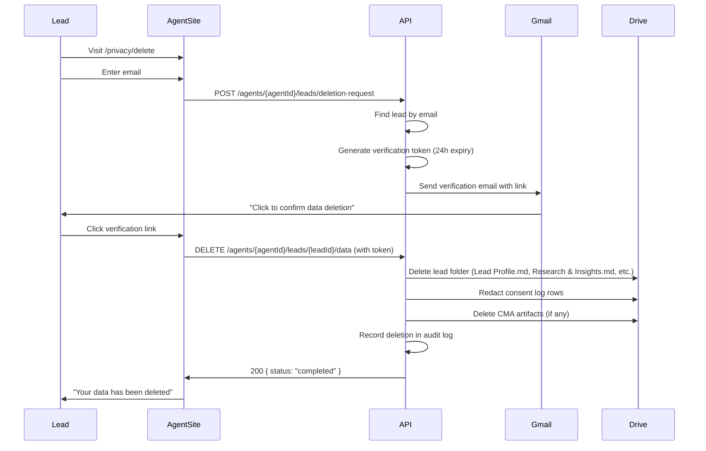

### Deletion Request Initiation Endpoint

```
POST /agents/{agentId}/leads/deletion-request
Content-Type: application/json
```

**Request (`RequestDeletionRequest`):**
```json
{
  "email": "jane@example.com"
}
```

**Response:** Always returns `202 Accepted` with a generic message regardless of whether the email matches a lead — prevents email enumeration attacks.

```json
{
  "message": "If we have your data on file, you'll receive a verification email shortly."
}
```

### Deletion Audit Log

Every deletion request (initiated, verified, completed, or failed) is recorded in a separate Google Sheet: `Real Estate Star/Deletion Audit Log`

| Column | Description | Example |
|--------|-------------|---------|
| Timestamp | UTC ISO 8601 | 2026-03-19T15:00:00Z |
| RequestId | Unique deletion request ID | del-a1b2c3d4 |
| AgentId | Which agent's lead | jenise-buckalew |
| LeadId | Lead being deleted | a1b2c3d4-e5f6-... |
| Email | Lead's email (redacted after completion) | jane@example.com → [REDACTED] |
| Reason | GDPR, CCPA, or user request | gdpr_erasure |
| Status | initiated, verified, completed, failed | completed |
| DeletedItems | What was removed | lead_record, consent_log_redacted, cma_artifacts |
| Error | Error message if failed | (empty) |

After deletion completes, the email in the deletion audit log is itself redacted to `[REDACTED]` — the requestId is sufficient for traceability.

### `ILeadDataDeletion` Interface

```csharp
public interface ILeadDataDeletion
{
    Task<string> InitiateDeletionRequestAsync(string agentId, string email, CancellationToken ct);
    Task<DeleteResult> ExecuteDeletionAsync(string agentId, Guid leadId, string verificationToken, string reason, CancellationToken ct);
}

public record DeleteResult
{
    public required string RequestId { get; init; }
    public required string Status { get; init; }          // "completed" or "failed"
    public required List<string> DeletedItems { get; init; }
    public DateTime CompletedAt { get; init; }
    public string? Error { get; init; }
}
```

### Vertical Slice Addition

```
Features/
  Leads/
    ...existing files...
    Services/
      ILeadDataDeletion.cs            # Deletion orchestration interface
      GDriveLeadDataDeletion.cs       # Coordinates deletion across Drive, Sheets, CMA
    DeleteData/
      DeleteLeadDataRequest.cs        # DELETE request DTO
      DeleteLeadDataResponse.cs       # DELETE response DTO
      DeleteDataEndpoint.cs           # DELETE /agents/{agentId}/leads/{leadId}/data
    RequestDeletion/
      RequestDeletionRequest.cs       # POST request DTO
      RequestDeletionEndpoint.cs      # POST /agents/{agentId}/leads/deletion-request
```

### DI Registration

```csharp
builder.Services.AddScoped<ILeadDataDeletion, GDriveLeadDataDeletion>();
```

### Rate Limiting

- `deletion-request`: 5 per hour per IP (prevent abuse of verification emails)
- `delete-data`: 10 per hour per IP (actual deletions are token-gated, but still rate-limited)

### Timing: Response Deadline

GDPR requires response within **30 days** (with possible 60-day extension). CCPA requires response within **45 days**. Since our deletion is automated and immediate (no manual review), we process it synchronously during the DELETE request — well within both deadlines.

### Security Considerations

- **Verification tokens**: Cryptographically random (128-bit), stored hashed (SHA-256), single-use, 24-hour expiry
- **Email enumeration**: The initiation endpoint always returns 202 regardless of whether the email exists
- **Authorization**: Only the lead themselves can request deletion (verified via email token). Agents cannot delete lead data on behalf of leads through this endpoint.
- **Idempotency**: Re-deleting an already-deleted lead returns 409 (not an error, just already done)
- **CMA artifacts**: If a CMA was triggered, the PDF and analysis files in Drive are also deleted. The CmaJob in the in-memory store is removed.

## Authorization & API Security

### Design Principle: Server-Side Submission

The .NET API is **never exposed to browsers**. All lead form submissions go through a Next.js server action running on the Cloudflare Worker, which acts as the trust boundary. The browser never knows the API URL, cannot call it directly, and cannot inspect the shared secret.

This eliminates an entire class of attacks (direct API abuse, credential theft from browser DevTools, CORS bypass) by making the attack surface zero from the browser's perspective.

### Threat Model

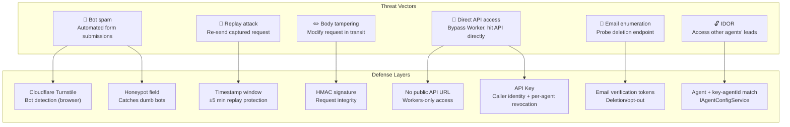

### Layer 1: Bot Protection (Browser → Agent Site)

**Cloudflare Turnstile + Honeypot** — defense in depth at the browser layer.

#### Turnstile

Cloudflare's free, invisible CAPTCHA alternative. No puzzle for the user — Turnstile runs a background challenge and returns a token that the server validates.

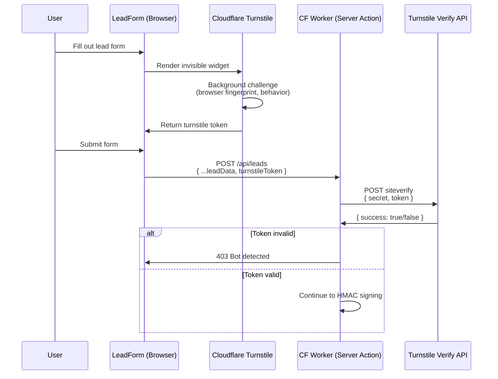

**Implementation:**
- Add `@cloudflare/turnstile` widget to LeadForm component
- Site key in agent site env vars (public, per-environment)
- Secret key in Worker secrets (never in browser)
- Validation: `POST https://challenges.cloudflare.com/turnstile/v0/siteverify`

#### Honeypot

A hidden form field that real users never see or fill in. Bots that auto-fill all fields will populate it, revealing themselves.

```html
<!-- Hidden via CSS, aria-hidden from screen readers -->
<input type="text" name="website" tabindex="-1" autocomplete="off"
       style="position:absolute;left:-9999px" aria-hidden="true" />
```

If `website` has a value on submission → reject silently (return fake 202 so the bot thinks it succeeded).

### Layer 2: Server-to-Server Auth (Worker → API)

**API Key + HMAC Signature (layered)** — the API key identifies *who* is calling (which agent site), and the HMAC proves the request *wasn't tampered with* and *isn't a replay*.

| Layer | Header | Purpose | What it proves |
|-------|--------|---------|----------------|
| API Key | `X-API-Key` | Identity | "This request claims to come from agent site X" |
| HMAC | `X-Signature` + `X-Timestamp` | Integrity + freshness | "The body hasn't been modified and this isn't a replay" |

**Why both?** The API key allows per-agent revocation and audit logging ("which agent site sent this?") without invalidating every agent's HMAC secret. The HMAC prevents replay and tampering that an API key alone can't detect. Either layer failing = 401.

#### How It Works Together

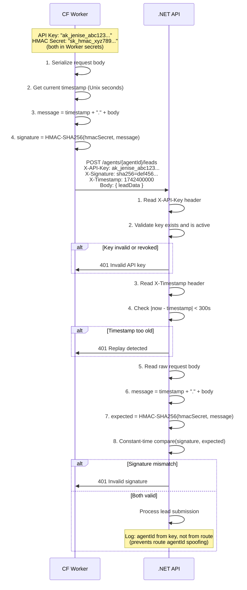

#### API Key Design

Each agent gets a unique API key stored in their agent config:

```json
// config/agents/jenise-buckalew.json
{
  "integrations": {
    "leadApi": {
      "apiKey": "ak_jenise_abc123..."
    }
  }
}
```

**Key format:** `ak_{agentId}_{random}` — the prefix makes keys self-documenting in logs.

**Validation on the API side:**
1. Look up the key in agent config via `IAgentConfigService`
2. Verify the key's `agentId` matches the route's `agentId` (prevents using agent A's key to submit leads for agent B)
3. If key is revoked or missing → 401

**Revocation:** Remove or rotate the key in the agent's config file. Takes effect immediately since config is read per-request.

#### HMAC Signing Flow

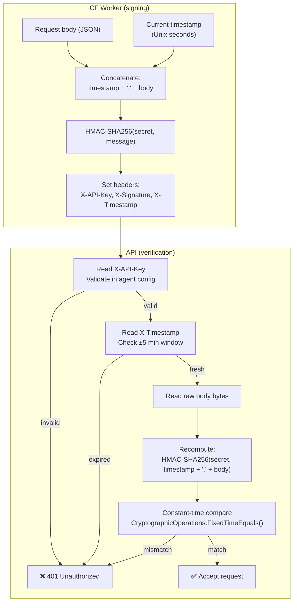

#### Implementation — Worker Side (TypeScript)

```typescript
// In the Next.js server action (runs on CF Worker, not browser)
async function submitLeadToApi(agentId: string, body: string): Promise<Response> {
  const apiKey = process.env.LEAD_API_KEY;       // Per-agent identity
  const hmacSecret = process.env.LEAD_HMAC_SECRET; // Shared HMAC signing secret
  const timestamp = Math.floor(Date.now() / 1000).toString();
  const message = `${timestamp}.${body}`;

  const key = await crypto.subtle.importKey(
    "raw", new TextEncoder().encode(hmacSecret),
    { name: "HMAC", hash: "SHA-256" }, false, ["sign"]
  );
  const sig = await crypto.subtle.sign("HMAC", key, new TextEncoder().encode(message));
  const signature = `sha256=${Buffer.from(sig).toString("hex")}`;

  return fetch(`${API_BASE_URL}/agents/${agentId}/leads`, {
    method: "POST",
    headers: {
      "Content-Type": "application/json",
      "X-API-Key": apiKey,
      "X-Signature": signature,
      "X-Timestamp": timestamp,
    },
    body,
  });
}
```

#### Implementation — API Side (C#)

```csharp
// ApiKeyHmacMiddleware.cs — runs before endpoint handlers on /agents/*/leads routes
public class ApiKeyHmacMiddleware
{
    // Step 1: API Key validation
    //   - Read X-API-Key header
    //   - Look up in IAgentConfigService
    //   - Verify key.agentId matches route agentId
    //   - Return 401 if invalid/revoked/mismatched

    // Step 2: HMAC validation
    //   - Read X-Timestamp, reject if |now - timestamp| > 300 seconds
    //   - Read raw body bytes (enable request buffering)
    //   - Compute HMAC-SHA256(hmacSecret, timestamp + "." + body)
    //   - Constant-time compare with X-Signature via CryptographicOperations.FixedTimeEquals()
    //   - Return 401 if mismatch
}
```

**Key management:**

| Secret | Location | Per-agent? | Purpose |
|--------|----------|------------|---------|
| `LEAD_API_KEY` | CF Worker secrets + agent config | Yes | Identity — which agent site |
| `LEAD_HMAC_SECRET` | CF Worker secrets + API config | No (global) | Integrity — request signing |

**Rotation procedures:**
- **API Key rotation:** Generate new key, update agent config + Worker secret, old key stops working immediately
- **HMAC secret rotation:** Deploy new secret to API with dual-accept (old + new) for 24h → deploy to all Workers → remove old from API after 24h

#### Comparison: Why API Key + HMAC

| Property | API Key alone | HMAC alone | API Key + HMAC |
|----------|--------------|------------|----------------|
| Identifies caller | ✅ | ❌ (shared secret, all agents look the same) | ✅ API key |
| Prevents replay | ❌ | ✅ timestamp | ✅ HMAC |
| Request integrity | ❌ | ✅ body signed | ✅ HMAC |
| Per-agent revocation | ✅ | ❌ (revoking = revoking all) | ✅ API key |
| Audit trail | ✅ (which agent) | ⚠️ (which secret, less granular) | ✅ both |
| Implementation complexity | Low | Medium | Medium (additive) |

### Layer 3: Network Isolation

The .NET API should **not** have CORS headers for the lead endpoints — no browser should ever call them directly.

```csharp
// Remove lead routes from the default CORS policy
// Option A: Don't apply CORS to lead endpoints at all
app.MapPost("/agents/{agentId}/leads", SubmitLeadEndpoint.Handle)
    .RequireRateLimiting("lead-create");
    // No .RequireCors() — returns no Access-Control headers
    // Browser requests get blocked by same-origin policy

// Option B: Restrict CORS to only Worker origins (defense-in-depth)
// Not needed since Workers don't use browser CORS, but documents intent
```

**Cloudflare network-level protection (optional, future):**
- Use Cloudflare Access to restrict the API's `/agents/*/leads` path to only Cloudflare Worker service tokens
- This makes the API endpoint literally unreachable from the internet, even if someone discovers the URL

### Layer 4: Per-Endpoint Rate Limiting

Rate limits apply at the API level as a last line of defense (even if a compromised Worker sends too many requests):

| Endpoint | Limit | Partition | Purpose |
|----------|-------|-----------|---------|
| `POST /agents/{agentId}/leads` | 20/hour | IP | Lead submission spam |
| `POST /agents/{agentId}/leads/deletion-request` | 5/hour | IP | Verification email abuse |
| `DELETE /agents/{agentId}/leads/{leadId}/data` | 10/hour | IP | Deletion abuse (token-gated too) |
| `POST /agents/{agentId}/leads/opt-out` | 10/hour | IP | Opt-out abuse (token-gated too) |

### Security Summary: Defense-in-Depth Layers

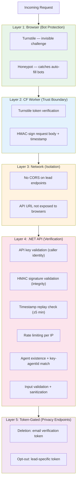

### Endpoint Security Matrix

| Endpoint | Caller | Auth | Rate Limit | Additional |
|----------|--------|------|------------|------------|
| `POST /agents/{agentId}/leads` | CF Worker only | API Key + HMAC | 20/hr/IP | Turnstile + honeypot at browser |
| `POST /agents/{agentId}/leads/deletion-request` | CF Worker only | API Key + HMAC | 5/hr/IP | Always returns 202 (no enumeration) |
| `DELETE /agents/{agentId}/leads/{leadId}/data` | CF Worker only | API Key + HMAC + verification token | 10/hr/IP | Token: 24h expiry, single-use, hashed |
| `POST /agents/{agentId}/leads/opt-out` | CF Worker only | API Key + HMAC + consent token | 10/hr/IP | Token tied to lead email |
| `POST /agents/{agentId}/leads/subscribe` | CF Worker only | API Key + HMAC + consent token | 10/hr/IP | Same token as opt-out |

### Secret Management

| Secret | Location | Per-Agent? | Purpose |
|--------|----------|------------|---------|
| `LEAD_API_KEY` | CF Worker secrets + agent config JSON | Yes | API key — caller identity |
| `LEAD_HMAC_SECRET` | CF Worker secrets + API appsettings | No (global) | HMAC signing/verification |
| `TURNSTILE_SECRET_KEY` | CF Worker secrets | No (global) | Turnstile server-side validation |
| `TURNSTILE_SITE_KEY` | Agent site env (public) | No (global) | Turnstile widget in browser |

**Rotation procedures:**
- **API Key:** Generate new key → update agent config JSON + Worker secret → old key stops immediately (no grace period needed since it's per-agent)
- **HMAC Secret:** Generate new → deploy to API with dual-accept for 24h → deploy to all Workers → remove old from API
- **Turnstile keys:** Rotate in Cloudflare dashboard → update Worker secret + site env var → deploy

### Frontend Changes for Server-Side Submission

The LeadForm no longer calls an external API directly. Instead:

**Before (removed):**
```typescript
// Browser calls API directly — INSECURE, removed
const res = await fetch(`${apiBaseUrl}/agents/${agentId}/leads`, { ... });
```

**After:**
```typescript
// Browser calls its own server action — API URL never exposed
"use server";

import { validateTurnstile } from "@/lib/turnstile";
import { signAndForward } from "@/lib/hmac";

export async function submitLead(agentId: string, formData: LeadFormData, turnstileToken: string) {
  // 1. Validate Turnstile (server-side)
  const isHuman = await validateTurnstile(turnstileToken);
  if (!isHuman) return { error: "Verification failed" };

  // 2. HMAC-sign and forward to .NET API
  const body = JSON.stringify(mapToApiRequest(formData));
  return signAndForward(agentId, body);
}
```

### Vertical Slice Additions

```
apps/agent-site/
  lib/
    turnstile.ts                    # Turnstile server-side validation
    hmac.ts                         # HMAC signing for API requests
  app/[handle]/api/leads/
    route.ts                        # (alternative to server action — API route handler)

apps/api/RealEstateStar.Api/
  Infrastructure/
    ApiKeyHmacMiddleware.cs         # API key validation + HMAC signature verification
    ApiKeyHmacOptions.cs            # Config: HMAC secret, timestamp tolerance, key lookup
```

## Security Considerations

- **Path traversal**: `agentId` and `leadId` validated with allowlist regex. For `FileLeadStore` (dev): `Path.GetFullPath` + `StartsWith(basePath)` check on all file operations. For `GDriveLeadStore`: Drive folder paths are constructed server-side from validated IDs — no user input in paths.
- **PII in logs**: Log leadId and agentId only — no email, phone, or address in log statements or OTel spans.
- **Email injection**: Validate email format server-side before passing to gws CLI. Use `ArgumentList` (not string concatenation) for CLI args.
- **IDOR**: Validate `agentId` exists via `IAgentConfigService.GetAgentAsync()` before processing.
- **File atomicity**: Write to temp file, then rename — prevents partial writes.
- **CORS**: Lead endpoints have **no CORS headers** — they are not browser-accessible. The HMAC middleware rejects any request without a valid signature, making CORS irrelevant.
- **HMAC constant-time comparison**: Use `CryptographicOperations.FixedTimeEquals()` to prevent timing attacks on signature validation.

## Observability

### Distributed Tracing (Browser → Worker → API → Background Tasks)

A single `traceId` connects the entire lead lifecycle — from the user clicking "Submit" in the browser, through the Cloudflare Worker, into the .NET API, and through every background task (enrichment, notification, CMA pipeline). All spans appear as one waterfall in Grafana Tempo.

#### Trace Architecture

```
Browser (Grafana Faro)
  │  traceparent: 00-{traceId}-{spanId}-01
  │  auto-injected on fetch() by Faro
  ▼
CF Worker (@microlabs/otel-cf-workers)
  │  Reads traceparent, creates child span
  │  Forwards traceparent to .NET API
  │  Exports spans → Grafana Cloud OTLP
  ▼
.NET API (OpenTelemetry.Instrumentation.AspNetCore)
  │  Reads traceparent automatically
  │  Activity.Current set for request lifetime
  │
  ├─► lead.submit span (endpoint handler)
  │     ├─► lead.store span (save to Drive)
  │     └─► Task.Run (captured ActivityContext)
  │           ├─► lead.enrich span
  │           │     ├─► lead.enrich.scrape span (ScraperAPI)
  │           │     └─► lead.enrich.score span (Claude API)
  │           ├─► lead.notify span (Chat webhook + Gmail email)
  │           └─► lead.cma span (if seller)
  │                 └─► [existing CMA pipeline spans]
  │
  Exports spans → Grafana Cloud OTLP
```

#### End-to-End Trace Flow

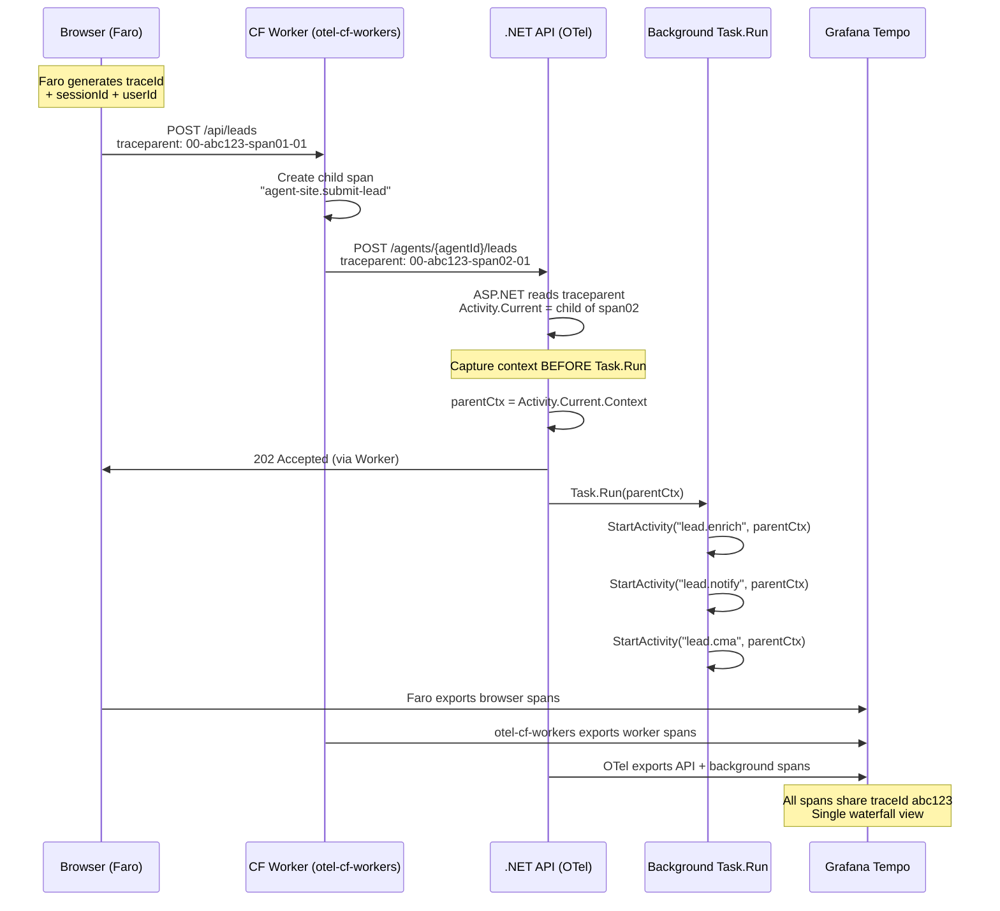

#### Layer 1: Browser — Grafana Faro

Grafana Faro is Grafana's official frontend observability SDK. It provides RUM metrics, session tracking, error capture, and — critically — auto-injects W3C `traceparent` headers on all `fetch()` calls.

**Packages:**
```bash
npm install @grafana/faro-web-sdk @grafana/faro-web-tracing @grafana/faro-react
```

**Initialization** (in agent-site layout or entry point):
```typescript
import { initializeFaro } from "@grafana/faro-web-sdk";
import { TracingInstrumentation } from "@grafana/faro-web-tracing";

initializeFaro({
  url: "https://faro-collector-prod-{region}.grafana.net/collect/{api-key}",
  app: { name: "agent-site", version: "1.0.0" },
  instrumentations: [
    new TracingInstrumentation({
      instrumentationOptions: {
        // Only inject traceparent on our own server actions, not third-party
        propagateTraceHeaderCorsUrls: [/\/api\//],
      },
    }),
  ],
  sessionTracking: { enabled: true },
});
```

**What Faro provides automatically:**

| Capability | Details |
|------------|---------|
| `traceparent` injection | Auto-added to all `fetch()` calls matching the URL filter |
| Session ID | Auto-generated per browser session, attached to all telemetry |
| User identification | `faro.api.setUser({ id, email })` — optional, for future lead tracking |
| Core Web Vitals | LCP, FID, CLS, TTFB, FCP — auto-captured as RUM metrics |
| JS errors | Unhandled exceptions + console errors captured and exported |
| Log correlation | Logs include `traceId` attribute → clickable link to trace in Loki |

**Export path:** Faro → Grafana Alloy (Faro receiver) → Tempo (traces) + Loki (logs). Grafana Cloud provisions the Alloy collector endpoint.

#### Layer 2: Cloudflare Worker — otel-cf-workers

`@microlabs/otel-cf-workers` is the de facto standard for OpenTelemetry in Cloudflare Workers. It automatically reads incoming `traceparent`, creates child spans, and forwards `traceparent` on outgoing `fetch()` calls.

**Package:**
```bash
npm install @microlabs/otel-cf-workers @opentelemetry/api
```

**wrangler.toml:**
```toml
compatibility_flags = ["nodejs_compat"]
```

**Configuration:**
```typescript
import { instrument, ResolveConfigFn } from "@microlabs/otel-cf-workers";

const config: ResolveConfigFn = (env) => ({
  exporter: {
    url: "https://otlp-gateway-prod-{region}.grafana.net/otlp/v1/traces",
    headers: {
      Authorization: `Basic ${btoa(`${env.GRAFANA_INSTANCE_ID}:${env.GRAFANA_API_TOKEN}`)}`,
    },
  },
  service: { name: "agent-site-worker", version: "1.0.0" },
});

export default instrument(handler, config);
```

**What happens automatically:**
1. Reads `traceparent` from browser's Faro-injected header
2. Creates a Worker span as a child of the browser span
3. Injects `traceparent` into the HMAC-signed `fetch()` to the .NET API
4. Exports the Worker span to Grafana Cloud Tempo

#### Layer 3: .NET API — OpenTelemetry ASP.NET Core

The existing OTel setup already reads `traceparent` automatically via `AddAspNetCoreInstrumentation()`. The critical addition is **propagating trace context into `Task.Run` background tasks**.

**The problem:** `Task.Run` creates a new thread pool context. `Activity.Current` is `null` inside the lambda unless you explicitly capture and restore it.

**The pattern:**
```csharp
// In SubmitLeadEndpoint.Handle — Activity.Current is set by ASP.NET middleware
var parentContext = Activity.Current?.Context ?? default;

_ = Task.Run(async () =>
{
    // Step 1: Enrich — linked to the same trace
    using var enrichActivity = LeadActivitySource.Source.StartActivity(
        "lead.enrich", ActivityKind.Internal, parentContext);
    try
    {
        enrichActivity?.SetTag("lead.id", lead.Id.ToString());
        enrichActivity?.SetTag("agent.id", agentId);

        using var scrapeSpan = LeadActivitySource.Source.StartActivity(
            "lead.enrich.scrape", ActivityKind.Client, enrichActivity?.Context ?? parentContext);
        // ... ScraperAPI calls ...

        using var scoreSpan = LeadActivitySource.Source.StartActivity(
            "lead.enrich.score", ActivityKind.Client, enrichActivity?.Context ?? parentContext);
        // ... Claude API call ...
    }
    catch (Exception ex)
    {
        enrichActivity?.SetStatus(ActivityStatusCode.Error, ex.Message);
        logger.LogWarning(ex, "[LEAD-007] ...");
    }

    // Step 2: Notify — linked to the same trace
    using var notifyActivity = LeadActivitySource.Source.StartActivity(
        "lead.notify", ActivityKind.Internal, parentContext);
    // ...

    // Step 3: CMA — linked to the same trace
    if (lead.LeadTypes.Contains("selling") && lead.Seller?.Address is not null)
    {
        using var cmaActivity = LeadActivitySource.Source.StartActivity(
            "lead.cma", ActivityKind.Internal, parentContext);
        // ...
    }
});
```

**Key rule: Always capture `Activity.Current?.Context` BEFORE `Task.Run`, pass it as `parentContext` to every `StartActivity` call inside.** This ensures all background spans appear as children of the original HTTP request span in Tempo.

#### Span Catalog

All spans for the lead submission feature, showing parent-child relationships:

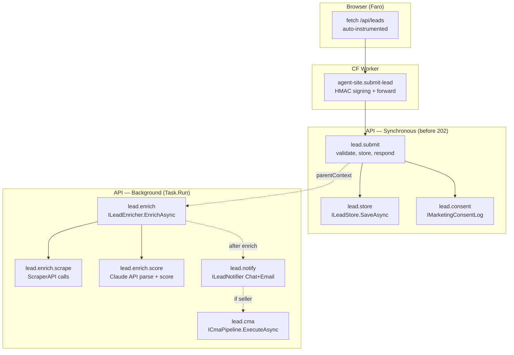

| Span Name | Kind | Parent | Tags |
|-----------|------|--------|------|
| `fetch /api/leads` | Client | (root) | `faro.session.id`, `http.url` |
| `agent-site.submit-lead` | Server | fetch span | `agent.id`, `http.method` |
| `lead.submit` | Server | worker span | `lead.id`, `agent.id`, `lead.types` |
| `lead.store` | Internal | lead.submit | `lead.id`, `store.provider` |
| `lead.consent` | Internal | lead.submit | `lead.id`, `consent.action` |
| `lead.enrich` | Internal | lead.submit | `lead.id`, `enrichment.provider` |
| `lead.enrich.scrape` | Client | lead.enrich | `scraper.queries_count` |
| `lead.enrich.score` | Client | lead.enrich | `score.value`, `score.factors_count` |
| `lead.notify` | Internal | lead.submit | `lead.id`, `notification.channel` |
| `lead.cma` | Internal | lead.submit | `lead.id`, `cma.job_id` |

**PII rules for span tags:** No email, phone, name, or address in tags. Use `lead.id`, `agent.id`, and aggregate values only (e.g., `score.value: 82`, not `lead.name: Jane Doe`).

#### Grafana Cloud Integration

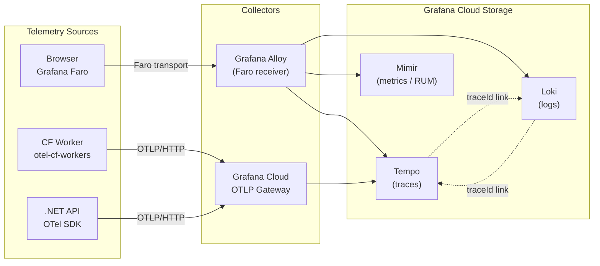

**What you get in Grafana dashboards:**
- **Tempo**: Single waterfall showing browser → worker → API → enrichment → notification → CMA, with timing for each span
- **Loki**: All `[LEAD-0xx]` log entries have a `traceId` attribute — click to jump to the trace in Tempo
- **Mimir/RUM**: Core Web Vitals, page load times, error rates — correlated by session
- **Cross-linking**: Click a log line in Loki → see the full trace in Tempo. Click a trace → see all related logs. Click a RUM metric → see which traces contributed.

#### Secrets for Observability

| Secret | Location | Purpose |
|--------|----------|---------|
| `FARO_COLLECTOR_URL` | Agent site env (public — contains API key in URL) | Browser → Alloy |
| `GRAFANA_INSTANCE_ID` | CF Worker secrets | Worker → OTLP Gateway |
| `GRAFANA_API_TOKEN` | CF Worker secrets + API config | Worker + API → OTLP Gateway |

#### Packages Summary

| Layer | Package | Purpose |
|-------|---------|---------|
| Browser | `@grafana/faro-web-sdk` | Core Faro SDK (errors, logs, RUM) |
| Browser | `@grafana/faro-web-tracing` | OTel tracing + `traceparent` injection |
| Browser | `@grafana/faro-react` | React route tracking, error boundaries |
| CF Worker | `@microlabs/otel-cf-workers` | OTel spans + `traceparent` propagation |
| CF Worker | `@opentelemetry/api` | Span API for custom instrumentation |
| .NET API | `OpenTelemetry.Instrumentation.AspNetCore` | Auto `traceparent` pickup |
| .NET API | `OpenTelemetry.Instrumentation.HttpClient` | Propagate on outbound HTTP |
| .NET API | `OpenTelemetry.Exporter.OpenTelemetryProtocol` | Export to Grafana OTLP |
| .NET API | `Microsoft.Extensions.Http.Polly` | Retry + circuit breaker policies for HTTP clients |
| .NET API | `YamlDotNet` | Parse YAML frontmatter from markdown files (lead data round-trip) |

### Readiness Health Checks (`/health/ready`)

The existing split health check pattern (`/health/live` for liveness, `/health/ready` for readiness with dependency checks) extends to cover the full lead submission stack. All new checks are tagged `"ready"` — they appear in `/health/ready` but NOT in `/health/live` (which must remain a fast no-dep check for container orchestrators).

**New health checks to register:**

```csharp
// Program.cs — extend existing AddHealthChecks() chain
builder.Services.AddHealthChecks()
    .AddCheck<ClaudeApiHealthCheck>("claude_api", tags: ["ready"])          // existing
    .AddCheck<GwsCliHealthCheck>("gws_cli", tags: ["ready"])               // existing (may not be registered yet)
    .AddCheck<GoogleDriveHealthCheck>("google_drive", tags: ["ready"])     // NEW
    .AddCheck<ScraperApiHealthCheck>("scraper_api", tags: ["ready"])       // NEW
    .AddCheck<TurnstileHealthCheck>("turnstile", tags: ["ready"]);        // NEW
```

| Health Check | What it verifies | Failure mode |
|-------------|-----------------|--------------|
| `GoogleDriveHealthCheck` | Can list files in the agent's root Drive folder via `IFileStorageProvider.ListDocumentsAsync(LeadPaths.LeadsFolder, ct)` | Unhealthy → leads can't be stored or retrieved |
| `ScraperApiHealthCheck` | HTTP GET to `https://api.scraperapi.com/account?api_key={key}` returns 200 | Degraded → enrichment still fires but may fail (graceful degradation) |
| `TurnstileHealthCheck` | HTTP POST to `https://challenges.cloudflare.com/turnstile/v0/siteverify` with a test token validates the secret key config exists | Degraded → bot protection weakened but leads still accepted |

**Implementation pattern** (matches existing `ClaudeApiHealthCheck`):

```csharp
// Health/GoogleDriveHealthCheck.cs
public class GoogleDriveHealthCheck(IFileStorageProvider storage) : IHealthCheck
{
    public async Task<HealthCheckResult> CheckHealthAsync(
        HealthCheckContext context, CancellationToken ct)
    {
        try
        {
            await storage.ListDocumentsAsync(LeadPaths.LeadsFolder, ct);
            return HealthCheckResult.Healthy("Google Drive accessible");
        }
        catch (Exception ex)
        {
            return HealthCheckResult.Unhealthy("Google Drive unreachable", ex);
        }
    }
}
```

**Full-stack readiness** — the `/health/ready` endpoint now validates every external dependency in the lead pipeline:

```
/health/ready
  ├── claude_api        ✅  (enrichment scoring + CMA analysis)
  ├── gws_cli           ✅  (email sending via Gmail)
  ├── google_drive      ✅  (lead storage, consent logs, CMA artifacts)
  ├── scraper_api       ⚠️  (enrichment data — degraded OK)
  └── turnstile         ⚠️  (bot protection — degraded OK)
```

**CI/CD integration** — `deploy-api.yml` already polls `/health/live` post-deploy. Update to also check `/health/ready`:

```yaml
# deploy-api.yml — Verify deployment step (after existing /health/live check)
- name: Verify readiness
  run: |
    STATUS=$(curl -s -o /dev/null -w "%{http_code}" "https://${FQDN}/health/ready" || true)
    if [ "$STATUS" != "200" ]; then
      echo "WARNING: /health/ready returned $STATUS — some dependencies may be unavailable"
      # Log the detailed response for debugging
      curl -s "https://${FQDN}/health/ready" | jq .
    fi
```

> **Note:** `/health/ready` failure should WARN, not fail the deploy — the API may be functional even with degraded dependencies (e.g., ScraperAPI down but leads still accepted).

### Metrics & Counters

- **Meter counters**: `leads.received` (by agentId, leadType), `leads.enriched`, `leads.enrichment_failed`, `leads.notification_sent`, `leads.notification_failed`, `leads.score` (histogram), `leads.deleted`, `leads.deletion_requested`
- **Meter histograms**: `leads.enrichment_duration_ms`, `leads.notification_duration_ms`, `leads.home_search_duration_ms`, `leads.cma_trigger_duration_ms`, `leads.total_pipeline_duration_ms` (wall time from Task.Run start to all background work complete)
- **Meter counters (token usage)**: `leads.llm_tokens.input` (by model, operation), `leads.llm_tokens.output` (by model, operation), `leads.llm_tokens.total` (by model, operation), `leads.llm_cost_usd` (by model, operation)

### Alerting — Async Task Bottlenecks

Configure Grafana Alert Rules to catch pipeline health issues before they become visible to agents or leads:

```
┌─────────────────────────────────────────────────────────────────────────┐
│  Grafana Alerting Rules (Mimir → AlertManager → Slack/PagerDuty)       │
│                                                                         │
│  ┌──────────────────────────┐  ┌──────────────────────────────────┐    │
│  │ BOTTLENECK ALERTS        │  │ FAILURE RATE ALERTS              │    │
│  │                          │  │                                  │    │
│  │ P95 enrichment > 30s     │  │ enrichment_failed / enriched     │    │
│  │ P95 notification > 15s   │  │   > 20% in 15min → WARN         │    │
│  │ P95 home_search > 60s    │  │   > 50% in 15min → CRITICAL     │    │
│  │ P95 cma_trigger > 120s   │  │                                  │    │
│  │ P95 total_pipeline > 5m  │  │ notification_failed / sent       │    │
│  │   → WARN on any          │  │   > 10% in 15min → CRITICAL     │    │
│  │   → CRITICAL if > 2x     │  │                                  │    │
│  └──────────────────────────┘  └──────────────────────────────────┘    │
│                                                                         │
│  ┌──────────────────────────┐  ┌──────────────────────────────────┐    │
│  │ QUEUE DEPTH / BACKLOG    │  │ TOKEN USAGE ALERTS               │    │
│  │                          │  │                                  │    │
│  │ Task.Run active count    │  │ llm_tokens.total > 500K/hr       │    │
│  │   (ThreadPool pending)   │  │   → WARN (cost spike)            │    │
│  │   > 50 → WARN            │  │ llm_tokens.total > 2M/hr         │    │
│  │   > 200 → CRITICAL       │  │   → CRITICAL (runaway)           │    │
│  │                          │  │                                  │    │
│  │ leads.received with no   │  │ llm_cost_usd > $10/hr            │    │
│  │ matching enriched event  │  │   → CRITICAL (budget breach)     │    │
│  │ within 5min → WARN       │  │                                  │    │
│  └──────────────────────────┘  └──────────────────────────────────┘    │
└─────────────────────────────────────────────────────────────────────────┘
```

**Alert destinations:**
- **WARN** → `#real-estate-star-alerts` Slack channel
- **CRITICAL** → PagerDuty (or Slack with `@here` mention)

**Key alert rules (PromQL):**

| Alert | PromQL Expression | Severity | For |
|-------|------------------|----------|-----|
| Enrichment slow | `histogram_quantile(0.95, rate(leads_enrichment_duration_ms_bucket[15m])) > 30000` | WARN | 5m |
| Enrichment very slow | `histogram_quantile(0.95, rate(leads_enrichment_duration_ms_bucket[15m])) > 60000` | CRITICAL | 5m |
| Enrichment failing | `rate(leads_enrichment_failed_total[15m]) / rate(leads_enriched_total[15m]) > 0.5` | CRITICAL | 5m |
| Notifications failing | `rate(leads_notification_failed_total[15m]) / rate(leads_notification_sent_total[15m]) > 0.1` | CRITICAL | 5m |
| Pipeline backlog | `leads_received_total - leads_enriched_total - leads_enrichment_failed_total > 50` | WARN | 10m |
| Token cost spike | `rate(leads_llm_cost_usd_total[1h]) > 10` | CRITICAL | 5m |
| Token runaway | `rate(leads_llm_tokens_total[1h]) > 2000000` | CRITICAL | 5m |
| Health check degraded | `up{job="real-estate-star-api"} == 0` | CRITICAL | 1m |

### Structured Logging

Unique codes per path (all log entries include `traceId` via OTel log correlation):

- `[LEAD-001]` Lead received and validated
- `[LEAD-002]` Lead stored to file
- `[LEAD-003]` Agent notification email sent
- `[LEAD-004]` CMA pipeline failed (in fire-and-forget Task.Run catch block)
- `[LEAD-005]` Agent notification email failed (in fire-and-forget Task.Run catch block)
- `[LEAD-006]` File store write failed
- `[LEAD-007]` Lead enrichment failed (graceful degradation — continues without enrichment)
- `[LEAD-008]` Lead scoring failed (defaults to score 50)
- `[LEAD-009]` Lead enriched successfully (includes score in log)
- `[LEAD-010]` Unhandled error in lead processing Task.Run
- `[LEAD-011]` Marketing consent recorded to audit log
- `[LEAD-012]` Marketing consent audit log write failed
- `[LEAD-013]` Deletion request initiated (email hashed in log)
- `[LEAD-014]` Deletion verified and executed
- `[LEAD-015]` Deletion failed
- `[LEAD-016]` Deletion verification token expired or invalid
- `[LEAD-017]` Lead opted out of marketing
- `[LEAD-018]` Consent token invalid (opt-out or subscribe)
- `[LEAD-023]` Lead re-subscribed to marketing
- `[LEAD-024]` Home search completed (includes listing count)
- `[LEAD-025]` Home search failed
- `[LEAD-019]` API key validation failed (invalid or revoked)
- `[LEAD-020]` API key agentId mismatch with route agentId
- `[LEAD-021]` HMAC signature validation failed
- `[LEAD-022]` HMAC timestamp replay detected
- `[LEAD-026]` Claude API token usage — enrichment scoring (includes: model, inputTokens, outputTokens, totalTokens, estimatedCostUsd)
- `[LEAD-027]` Claude API token usage — CMA analysis (includes: model, inputTokens, outputTokens, totalTokens, estimatedCostUsd)
- `[LEAD-028]` Claude API token usage — home search curation (includes: model, inputTokens, outputTokens, totalTokens, estimatedCostUsd)
- `[LEAD-029]` Claude API token usage — session total (includes: totalInputTokens, totalOutputTokens, totalCostUsd, operationCount)
- `[LEAD-030]` Health check — Google Drive connectivity result
- `[LEAD-031]` Health check — ScraperAPI connectivity result
- `[LEAD-032]` Health check — Turnstile secret validation result
- `[LEAD-033]` Google Chat notification sent successfully
- `[LEAD-034]` Google Chat notification failed (falls through to email)
- `[LEAD-035]` HTTP retry attempt (includes attempt number, delay, status code)
- `[LEAD-036]` Circuit breaker OPEN — service paused (includes service name, duration)
- `[LEAD-037]` Circuit breaker CLOSED — service resumed
- `[LEAD-038]` Retry: re-processing failed enrichment for lead
- `[LEAD-039]` Retry: enrichment still failing after retry
- `[LEAD-040]` WhatsApp notification sent (future — when WhatsApp Business API integrated)
- `[LEAD-041]` Agent deleted file from lead folder (detected by Drive monitor)
- `[LEAD-042]` Lead folder moved — status updated automatically
- `[LEAD-043]` Drive poll failed for agent (warning, continues with other agents)
- `[LEAD-044]` Drive poll complete — summary of changes processed
- `[LEAD-045]` WhatsApp message drafted by Claude for lead (Phase 2)
- `[LEAD-046]` WhatsApp message sent to lead (Phase 2)
- `[LEAD-047]` WhatsApp send failed (Phase 2)

### LLM Token Usage Logging

Every Claude API call in the lead pipeline MUST log token consumption explicitly. This serves three purposes: (1) cost visibility per-lead, (2) alerting on runaway token usage, (3) audit trail for billing.

**Pattern — wrap every Claude API call:**

```csharp
// After every Claude API response, extract and log token usage
var response = await claudeClient.CreateMessageAsync(request, ct);

var usage = new
{
    Model = request.Model,
    InputTokens = response.Usage.InputTokens,
    OutputTokens = response.Usage.OutputTokens,
    TotalTokens = response.Usage.InputTokens + response.Usage.OutputTokens,
    EstimatedCostUsd = EstimateCost(request.Model, response.Usage)
};

logger.LogInformation("[LEAD-026] Claude API token usage — enrichment scoring: " +
    "model={Model}, input={InputTokens}, output={OutputTokens}, " +
    "total={TotalTokens}, cost=${EstimatedCostUsd:F4}",
    usage.Model, usage.InputTokens, usage.OutputTokens,
    usage.TotalTokens, usage.EstimatedCostUsd);

// Also emit as OTel metrics for alerting
tokenInputCounter.Add(usage.InputTokens,
    new("model", usage.Model), new("operation", "enrichment_scoring"));
tokenOutputCounter.Add(usage.OutputTokens,
    new("model", usage.Model), new("operation", "enrichment_scoring"));
costCounter.Add(usage.EstimatedCostUsd,
    new("model", usage.Model), new("operation", "enrichment_scoring"));
```

**Cost estimation helper** (keep model pricing in config, not hardcoded — prices change):

```csharp
// Services/LlmCostEstimator.cs
public static class LlmCostEstimator
{
    // Loaded from appsettings.json → "LlmPricing" section
    // Default prices per 1M tokens (updated as pricing changes)
    public static decimal EstimateCost(string model, Usage usage, IConfiguration config)
    {
        var section = config.GetSection($"LlmPricing:{model}");
        var inputPer1M = section.GetValue<decimal>("InputPer1M", 3.00m);
        var outputPer1M = section.GetValue<decimal>("OutputPer1M", 15.00m);

        return (usage.InputTokens * inputPer1M / 1_000_000m)
             + (usage.OutputTokens * outputPer1M / 1_000_000m);
    }
}
```

**Operations that log tokens:**
| Log Code | Operation | Typical Token Range |
|----------|-----------|-------------------|
| `[LEAD-026]` | Enrichment scoring (motivation + score + cold call openers) | 2K-8K input, 500-2K output |
| `[LEAD-027]` | CMA analysis (existing pipeline — add token logging there too) | 5K-15K input, 2K-5K output |
| `[LEAD-028]` | Home search curation (filter + rank + personalize listings) | 3K-10K input, 1K-3K output |
| `[LEAD-029]` | Session total (logged once at end of Task.Run, sums all above) | Aggregate |

**Session total** — at the end of the `Task.Run` block, log a summary:

```csharp
logger.LogInformation("[LEAD-029] Claude API token usage — session total: " +
    "totalInput={TotalInput}, totalOutput={TotalOutput}, " +
    "totalCost=${TotalCost:F4}, operations={OpCount}",
    sessionTotalInput, sessionTotalOutput, sessionTotalCost, operationCount);
```

### Fire-and-Forget Safety

The enrichment, notification, and CMA pipeline all run in a single `Task.Run` with nested try-catch blocks that log each exception with a unique `[LEAD-0xx]` code. **All background spans use the captured `parentContext`** so they appear in the same trace as the originating HTTP request. This matches the pattern in `SubmitCmaEndpoint` lines 38-67.

## Endpoint Conventions

- **CancellationToken**: `Handle` method takes `CancellationToken ct` as a **required parameter** (no `= default`) per project convention.
- **Handle method visibility**: `internal static` so tests can call directly without reflection.
- **Auto-discovery**: Implements `IEndpoint` — registered automatically via `AddEndpoints(Assembly.GetExecutingAssembly())` in `Program.cs`.

## Testing Strategy

### API Tests
- Endpoint validation: missing fields, invalid formats, valid submission, marketing consent required
- File store: write/read roundtrip, path traversal prevention, concurrent writes
- Lead enrichment: successful enrichment, graceful degradation on failure, empty profile default
- Lead scoring: score range (1-100), default score on failure, cold call opener generation
- Lead notifier: email formatting (buyer-only, seller-only, both, with/without enrichment), error handling
- Marketing consent log: opt-in recorded, opt-out recorded, consent text captured, IP/UA captured
- Data deletion: verification token generation, token expiry, token reuse rejected, lead data deleted from Drive, consent log rows redacted, CMA artifacts deleted, deletion audit log written, email enumeration prevention (202 for unknown emails), idempotent re-deletion (409)
- CMA trigger: fires for seller leads, skipped for buyer-only
- Integration: full flow from request → store → enrich → notify → CMA
- Integration: deletion flow from request → verify → delete → audit

### Frontend Tests
- `useLeadSubmit` hook: success, error, reset states
- `leads-api.ts`: fetch mock for success/error responses
- `CmaSection.tsx`: all leads call new endpoint, error display, loading state
- Marketing consent checkbox: required, consent text matches config, channels selection
- Privacy deletion page: email input, verification flow, confirmation message, opt-out link in emails

## Fault Handling & Resilience

### Design Principle: The Pipeline Never Loses a Lead

The lead submission pipeline is designed to be **failure-resilient at every step**. If any external dependency goes down (Claude API, ScraperAPI, Google Drive, Gmail, Google Chat), the pipeline degrades gracefully — it never loses lead data and it can always pick up where it left off.

```
┌────────────────────────────────────────────────────────────────────────────┐
│  RESILIENCE MODEL                                                          │
│                                                                            │
│  Step 1: Save lead ──► MUST succeed (synchronous, before 202)              │
│    ↓ failure = 500, lead resubmits via form                                │
│                                                                            │
│  Step 2: Consent log ──► MUST succeed (synchronous, before 202)            │
│    ↓ failure = 500, lead resubmits via form                                │
│                                                                            │
│  ── 202 returned ── (everything below is fire-and-forget) ──               │
│                                                                            │
│  Step 3: Enrichment ──► CAN fail (graceful degradation)                    │
│    ↓ failure = lead saved with empty enrichment, score = 50                │
│    ↓ status in frontmatter: "enrichment_failed"                            │
│                                                                            │
│  Step 4: Notification ──► CAN fail (chat OR email, not both)               │
│    ↓ failure = logged, lead still in Drive for agent to find               │
│                                                                            │
│  Step 5: CMA pipeline ──► CAN fail (existing pipeline handles own errors)  │
│    ↓ failure = logged, lead exists, CMA can be retried manually            │
│                                                                            │
│  Step 6: Home search ──► CAN fail (buyer still has lead profile)           │
│    ↓ failure = logged, no search results email sent                        │
│                                                                            │
│  ANY step failure ──► Lead exists in Drive ──► Agent can still call lead   │
└────────────────────────────────────────────────────────────────────────────┘
```

### Claude API Down — Graceful Degradation

Claude is used in two places: enrichment scoring and home search curation. Both are **non-critical** — the lead is already saved before they run.

```csharp
// When Claude is unavailable, enrichment degrades gracefully
try
{
    enrichment = await enricher.EnrichAsync(lead, CancellationToken.None);
}
catch (HttpRequestException ex) when (ex.StatusCode is HttpStatusCode.ServiceUnavailable
                                       or HttpStatusCode.TooManyRequests
                                       or HttpStatusCode.InternalServerError)
{
    logger.LogWarning(ex, "[LEAD-007] Claude API unavailable — enrichment skipped for lead {LeadId}. " +
        "HTTP {StatusCode}. Lead saved with empty enrichment, default score 50.",
        lead.Id, (int?)ex.StatusCode);

    enrichment = LeadEnrichment.Empty();
    score = LeadScore.Default(reason: "Enrichment skipped — AI service temporarily unavailable");

    // Update lead status in frontmatter so retry can find it
    lead.Status = "enrichment_failed";
    await leadStore.SaveAsync(lead, CancellationToken.None);

    leadsEnrichmentFailedCounter.Add(1, new("agentId", agentId), new("reason", "claude_unavailable"));
}
```

**What the agent sees when Claude is down:**
- `Lead Profile.md` — full contact + property details (all from the form, no Claude needed)
- `Research & Insights.md` — **NOT created** (no enrichment data to render)
- Agent notification says "New Lead: Jane Doe — Score: 50/100 (enrichment pending)"
- When Claude comes back, a retry job can re-enrich pending leads (see Resumability below)

### Error Logging Strategy

**Every `catch` block logs with a unique `[LEAD-0xx]` code, the exception, and enough context to diagnose without reproducing.** No silent swallows. No generic "something went wrong" messages.

| Error Scenario | Log Code | Severity | Action Taken |
|---------------|----------|----------|-------------|
| Claude API 503/429/500 | `[LEAD-007]` | Warning | Skip enrichment, default score 50, mark status `enrichment_failed` |
| Claude API timeout (>30s) | `[LEAD-007]` | Warning | Same as above (HttpClient timeout is an `OperationCanceledException`) |
| Claude API returns invalid JSON | `[LEAD-008]` | Warning | Log raw response body (truncated to 500 chars), default score |
| ScraperAPI failure | `[LEAD-007]` | Warning | Skip that source, continue with other sources |
| Google Drive write failure | `[LEAD-006]` | Error | **This is critical** — 500 returned to client, lead NOT saved |
| Google Sheets append failure | `[LEAD-012]` | Error | **This is critical** — 500 returned, consent log not written |
| Gmail send failure | `[LEAD-005]` | Error | Lead still saved, logged, agent can find in Drive |
| Google Chat webhook failure | `[LEAD-034]` | Warning | Fall through to email, lead still saved |
| MLS API failure | `[LEAD-025]` | Warning | Fall back to scraper sources for home search |
| All home search sources fail | `[LEAD-025]` | Warning | No search results email sent, buyer lead still saved |
| HMAC validation failure | `[LEAD-021]` | Warning | 401 returned, request rejected |
| Turnstile validation failure | — | Warning | Handled at CF Worker level, never reaches API |
| Unhandled exception in Task.Run | `[LEAD-010]` | Error | Outer catch-all, lead already saved |

### Retry & Circuit Breaker Strategy

External HTTP calls use **Polly** policies for transient fault handling:

```csharp
// Program.cs — HTTP client policies
builder.Services.AddHttpClient("claude-api")
    .AddPolicyHandler(Policy.HandleTransientHttpError()
        .WaitAndRetryAsync(3, attempt => TimeSpan.FromSeconds(Math.Pow(2, attempt)),
            onRetry: (outcome, delay, attempt, _) =>
            {
                logger.LogWarning("[LEAD-035] Retry {Attempt}/3 for Claude API after {Delay}s — {StatusCode}",
                    attempt, delay.TotalSeconds, outcome.Result?.StatusCode);
            }))
    .AddPolicyHandler(Policy.HandleTransientHttpError()
        .CircuitBreakerAsync(5, TimeSpan.FromMinutes(1),
            onBreak: (_, duration) =>
                logger.LogError("[LEAD-036] Circuit breaker OPEN for Claude API — pausing for {Duration}s", duration.TotalSeconds),
            onReset: () =>
                logger.LogInformation("[LEAD-037] Circuit breaker CLOSED for Claude API — resuming")));

builder.Services.AddHttpClient("scraper-api")
    .AddPolicyHandler(Policy.HandleTransientHttpError()
        .WaitAndRetryAsync(2, attempt => TimeSpan.FromSeconds(attempt * 2)))
    .AddPolicyHandler(Policy.HandleTransientHttpError()
        .CircuitBreakerAsync(10, TimeSpan.FromMinutes(2)));

builder.Services.AddHttpClient("google-chat")
    .AddPolicyHandler(Policy.HandleTransientHttpError()
        .WaitAndRetryAsync(1, _ => TimeSpan.FromSeconds(1)));
```

**Policy per service:**

| Service | Retry | Circuit Breaker | Timeout | Rationale |
|---------|-------|----------------|---------|-----------|
| Claude API | 3x exponential (2s, 4s, 8s) | Open after 5 failures, 1 min pause | 30s per call | Expensive — retry but protect budget |
| ScraperAPI | 2x linear (2s, 4s) | Open after 10 failures, 2 min pause | 5s per source | Cheap — retry aggressively per source |
| Google Drive (gws) | 2x (1s, 2s) | Open after 5 failures, 30s pause | 10s per call | Critical for save — retry but fail fast |
| Google Chat webhook | 1x (1s) | None | 5s | Non-critical, email fallback exists |
| Gmail (gws) | 2x (1s, 2s) | None | 15s | Important but not blocking |

### Resumability — Pick Up Where It Left Off

The `Lead Profile.md` frontmatter contains a `status` field that tracks where the pipeline stopped. This enables a **retry/resume mechanism** that can re-process failed leads without re-running successful steps.

**Status state machine:**

```mermaid
stateDiagram-v2
    [*] --> received: Lead saved to Drive
    received --> enriching: Enrichment started
    enriching --> enriched: Enrichment + score complete
    enriching --> enrichment_failed: Claude/scraper error
    enriched --> notified: Agent notified (Chat + email)
    enriched --> notification_failed: Chat + email both failed
    enrichment_failed --> notified: Notified with default score
    notified --> cma_complete: CMA pipeline finished (seller)
    notified --> search_complete: Home search finished (buyer)
    notified --> complete: No CMA or search needed
    cma_complete --> complete: All done
    search_complete --> complete: All done
    notification_failed --> complete: Lead in Drive, agent finds it

    enrichment_failed --> enriching: RETRY enrichment
    notification_failed --> notified: RETRY notification
```

**Retry endpoint** (admin/internal only — not exposed to CF Worker):

```
POST /internal/leads/retry-failed
```

Scans `Real Estate Star/1 - Leads/*/Lead Profile.md` for leads with `status: enrichment_failed` or `status: notification_failed`, and re-runs the failed step. This can be triggered manually or on a schedule (e.g., hourly cron that retries failed enrichments after Claude comes back up).

```csharp
// Features/Leads/RetryFailed/RetryFailedLeadsEndpoint.cs
internal static async Task<IResult> Handle(
    IFileStorageProvider storage,
    ILeadEnricher enricher,
    ILeadNotifier notifier,
    ILogger<RetryFailedLeadsEndpoint> logger,
    CancellationToken ct)
{
    var leadFolders = await storage.ListDocumentsAsync(LeadPaths.LeadsFolder, ct);
    var retried = 0;

    foreach (var folder in leadFolders)
    {
        var content = await storage.ReadDocumentAsync(folder, "Lead Profile.md", ct);
        if (content == null) continue;

        var frontmatter = YamlFrontmatterParser.Parse(content);
        var status = frontmatter.GetValueOrDefault("status");

        if (status == "enrichment_failed")
        {
            logger.LogInformation("[LEAD-038] Retrying enrichment for lead in {Folder}", folder);
            var lead = LeadMappers.FromFrontmatter(frontmatter);
            try
            {
                var enrichment = await enricher.EnrichAsync(lead, ct);
                // ... update files, advance status to "enriched"
                retried++;
            }
            catch (Exception ex)
            {
                logger.LogWarning(ex, "[LEAD-039] Retry enrichment still failing for {Folder}", folder);
            }
        }
    }

    return Results.Ok(new { retriedCount = retried });
}
```

**Idempotency guarantees:**
- Re-saving a lead to the same folder is safe — `WriteDocumentAsync` overwrites
- Re-appending consent log is NOT safe — check for existing row before appending (or accept duplicates in the audit log, which is harmless for compliance)
- Re-running CMA pipeline checks `cmaJobId` — if already set, skips
- Re-running home search checks `homeSearchId` — if already set, skips

### Timeouts

Every external call has an explicit timeout. No unbounded waits.

| Operation | Timeout | What happens on timeout |
|-----------|---------|----------------------|
| Claude API (enrichment) | 30s | `OperationCanceledException` → default score, status `enrichment_failed` |
| Claude API (home search curation) | 30s | Same — raw listings saved without Claude personalization |
| ScraperAPI (per source) | 5s | That source skipped, others continue |
| Google Drive (gws CLI) | 10s | If save step: 500 to client. If background: logged, status updated |
| Gmail (gws CLI) | 15s | Logged, lead still in Drive |
| Google Chat webhook | 5s | Logged, falls through to email |
| Turnstile verification | 5s | Handled at CF Worker — returns error to browser |
| MLS API | 15s | Falls back to scraper sources |

## Dead Code & Branch Cleanup

### Branches to Delete After Merge

| Branch | Status | Action |
|--------|--------|--------|
| `feat/pages-architecture` | Current working branch — all lead submission changes here | Merge to main, then delete |
| Any `fix/lead-*` or `feat/lead-*` branches | Created during development | Delete after PR merge |
| PR preview deployments | `real-estate-star-agents-pr-{N}` Cloudflare Workers | Auto-cleaned by Cloudflare after PR close |

### Dead Code to Remove

After the lead submission feature ships, clean up code that is superseded:

| File / Code | What | Why it's dead | Action |
|------------|------|--------------|--------|
| `apps/agent-site/components/sections/shared/CmaSection.tsx` — direct `useCmaSubmit` call | CmaSection currently calls CMA API directly for seller leads | Replaced by `useLeadSubmit` → server action → unified lead endpoint | Remove `useCmaSubmit` import and direct API call. Replace with `useLeadSubmit`. |
| `packages/ui/LeadForm/hooks/useCmaSubmit.ts` | Hook that calls CMA API directly from browser | Browser no longer calls API directly — server-side submission only | **Keep** — still used by `SubmitCmaFormTool` in onboarding chat. Mark with `@deprecated` comment if only one caller remains. |
| `packages/ui/LeadForm/api/cma-api.ts` | Direct CMA API client | Same — browser-to-API pattern replaced by server action | **Keep** — same reason as above. Evaluate removing when onboarding chat migrates to server-side. |
| Any unused imports in modified files | Dead imports after refactoring | ESLint will catch these | Run `npm run lint --fix` before committing |

### Dead Endpoint Audit

| Endpoint | Status | Consumers | Action |
|----------|--------|-----------|--------|
| `POST /agents/{agentId}/cma` | **Keep** | `SubmitCmaFormTool` (onboarding chat) | Not dead — still used by onboarding flow. The lead endpoint triggers CMA internally, but the direct endpoint remains for the chat tool. |
| `GET /agents/{agentId}/cma/{jobId}/status` | **Keep** | Onboarding chat SSE status polling | Same — onboarding flow still needs it |
| `GET /agents/{agentId}/cma/{jobId}/stream` | **Keep** | Onboarding chat SSE streaming | Same |

> **No endpoints are being removed in this feature.** The lead submission feature adds new endpoints alongside existing ones. The existing CMA endpoints continue to serve the onboarding chat flow. When the onboarding chat migrates to use the lead submission endpoint, the direct CMA endpoints can be deprecated.

### Post-Merge Cleanup Checklist

- [ ] Delete feature branch after PR merge
- [ ] Verify no Cloudflare preview workers remain for closed PRs
- [ ] Run `npm run lint` across all packages — fix any dead imports
- [ ] Search for `TODO: lead-submission` comments and resolve them
- [ ] Verify `useCmaSubmit` has `@deprecated` JSDoc if only onboarding chat uses it
- [ ] Run `npx knip` or `npx depcheck` to find any unused dependencies added during development

## Migration Notes

- The existing `POST /agents/{agentId}/cma` endpoint is NOT removed — the onboarding chat tool (`SubmitCmaFormTool`) still uses it directly
- `useCmaSubmit` and `cma-api.ts` remain in the UI package for potential direct CMA use elsewhere
- CmaSection switches from `useCmaSubmit` to `useLeadSubmit` — the CMA pipeline is now triggered server-side

## CI/CD Pipeline Updates Required

All GitHub Actions workflows must be updated to support the new lead submission feature. Changes are required across every pipeline:

### `api.yml` — API CI (PR + push)

| Change | Details |
|--------|---------|
| **Path filter** | Add `config/agents/**` to the `api` filter — agent config changes (new `leadApi`/`mls` fields) should trigger API tests |
| **Env vars for test** | Add `ScraperApi__ApiKey: test`, `Anthropic__ApiKey: test`, `Storage__UseLocal: true` to the test step env so DI resolves `LocalStorageProvider` |
| **Coverage gate** | Add coverage threshold check: `dotnet-coverage merge ... --threshold 80` (lead feature must meet 80%+ branch coverage) |

### `deploy-api.yml` — API Deploy

| Change | Details |
|--------|---------|
| **Path filter** | Add `config/agents/**` to trigger deploys when agent config changes (new fields affect runtime behavior) |
| **Docker build args** | No change needed — Dockerfile already copies all project files |
| **Readiness check** | Add `/health/ready` verification step after the existing `/health/live` check (see Health Checks section above). WARN only, don't fail deploy. |
| **New secrets** | Add to GitHub repo secrets: `SCRAPER_API_KEY`, `LEAD_HMAC_SECRET` (per-agent secrets stored in agent config, but the API needs a master key for the HMAC middleware). Add to Container App env vars via `az containerapp update --set-env-vars`. |
| **Rollback awareness** | The existing rollback step works as-is — it rolls back the entire container revision, which includes the new health checks and lead endpoints |

### `agent-site.yml` — Agent Site CI (PR + push)

| Change | Details |
|--------|---------|
| **New env vars** | Add `NEXT_PUBLIC_TURNSTILE_SITE_KEY: test`, `LEAD_API_KEY: test`, `LEAD_HMAC_SECRET: test` to the build and test steps |
| **Faro disabled in CI** | Faro initialization should be gated on `process.env.NEXT_PUBLIC_FARO_COLLECTOR_URL` — absent in CI, so no network calls to Grafana during tests |
| **Server action tests** | The `useLeadSubmit` hook and server action tests need the `LEAD_API_KEY` env var to compile |

### `deploy-agent-site.yml` — Agent Site Deploy

| Change | Details |
|--------|---------|
| **Wrangler secrets** | Add to Cloudflare Worker secrets (via `wrangler secret put` or CF dashboard): `LEAD_API_KEY`, `LEAD_HMAC_SECRET`, `TURNSTILE_SECRET_KEY` |
| **Build env vars** | Add `NEXT_PUBLIC_TURNSTILE_SITE_KEY: ${{ secrets.TURNSTILE_SITE_KEY }}` to the Next.js build step |
| **Post-deploy smoke test** | Add a step that curls the deployed agent site and verifies the Turnstile script tag is present in the HTML response |

### New Workflow: `lead-pipeline-smoke.yml` (Optional — Phase 2)

A dedicated smoke test workflow that runs nightly or on-demand to verify the full lead pipeline is healthy:

```yaml
name: Lead Pipeline Smoke Test

on:
  schedule:
    - cron: '0 6 * * *'  # Daily at 6 AM UTC
  workflow_dispatch:

jobs:
  smoke:
    name: "Lead Pipeline — end-to-end smoke"
    runs-on: ubuntu-latest
    steps:
      - name: Check API readiness
        run: |
          STATUS=$(curl -s -o /dev/null -w "%{http_code}" \
            "https://api.real-estate-star.com/health/ready")
          echo "API /health/ready: $STATUS"
          if [ "$STATUS" != "200" ]; then
            echo "::warning::API readiness check returned $STATUS"
          fi

      - name: Check agent site Turnstile
        run: |
          BODY=$(curl -s "https://jenise-buckalew.real-estate-star.com")
          if echo "$BODY" | grep -q "turnstile"; then
            echo "Turnstile script found"
          else
            echo "::error::Turnstile script missing from agent site"
            exit 1
          fi

      - name: Check Grafana Faro
        run: |
          BODY=$(curl -s "https://jenise-buckalew.real-estate-star.com")
          if echo "$BODY" | grep -q "faro"; then
            echo "Faro SDK found"
          else
            echo "::warning::Faro SDK not detected in agent site HTML"
          fi
```

### Secrets Summary — All Pipelines

| Secret | Where | Used by |
|--------|-------|---------|
| `SCRAPER_API_KEY` | GitHub Secrets → API Container App env | `ScraperLeadEnricher`, `ScraperApiHealthCheck` |
| `LEAD_HMAC_SECRET` | GitHub Secrets → API Container App env + CF Worker secrets | `ApiKeyHmacMiddleware`, agent-site server action |
| `TURNSTILE_SITE_KEY` | GitHub Secrets → agent-site build env (`NEXT_PUBLIC_*`) | LeadForm Turnstile widget (public, embedded in HTML) |
| `TURNSTILE_SECRET_KEY` | GitHub Secrets → CF Worker secrets | Server-side Turnstile token validation |
| `FARO_COLLECTOR_URL` | GitHub Secrets → agent-site build env (`NEXT_PUBLIC_*`) | Grafana Faro initialization (public, contains API key) |
| `GRAFANA_API_TOKEN` | GitHub Secrets → CF Worker secrets + API Container App env | OTel span export to Grafana Cloud |
| `GRAFANA_INSTANCE_ID` | GitHub Secrets → CF Worker secrets | Worker → OTLP Gateway auth |
| `INTERNAL_API_TOKEN` | GitHub Secrets → API Container App env + drive-monitor cron | `POST /internal/drive/poll` auth (Bearer token) |

### New Workflow: `drive-monitor.yml` — Drive Change Polling

```yaml
name: Drive Change Monitor

on:
  schedule:
    - cron: '*/5 * * * *'  # Every 5 minutes (GitHub Actions minimum practical interval)
  workflow_dispatch:

jobs:
  poll:
    runs-on: ubuntu-latest
    steps:
      - name: Poll for Drive changes
        run: |
          RESPONSE=$(curl -s -w "\n%{http_code}" -X POST \
            -H "Authorization: Bearer ${{ secrets.INTERNAL_API_TOKEN }}" \
            "https://api.real-estate-star.com/internal/drive/poll")
          HTTP_CODE=$(echo "$RESPONSE" | tail -1)
          BODY=$(echo "$RESPONSE" | head -1)
          echo "Response: $HTTP_CODE — $BODY"
          if [ "$HTTP_CODE" != "200" ]; then
            echo "::warning::Drive poll returned $HTTP_CODE"
          fi
```

> **Production upgrade path:** Replace GitHub Actions cron with Azure Container Apps cron job for 60-second polling (GitHub minimum is ~5 min). The endpoint is the same — only the caller changes.

### Pipeline Dependency Diagram

```mermaid
graph TD
    subgraph "PR Pipeline"
        AgentSiteCI["agent-site.yml<br/>lint + test + build"]
        ApiCI["api.yml<br/>build + test"]
    end

    subgraph "Deploy Pipeline (main only)"
        AgentSiteDeploy["deploy-agent-site.yml<br/>build + deploy to CF Workers"]
        ApiDeploy["deploy-api.yml<br/>build + test + Docker + Azure"]
        ApiHealth["/health/ready check"]
        TurnstileCheck["Turnstile presence check"]
    end

    subgraph "Monitoring (nightly)"
        Smoke["lead-pipeline-smoke.yml<br/>readiness + Turnstile + Faro"]
    end

    AgentSiteCI -->|"merge to main"| AgentSiteDeploy
    ApiCI -->|"merge to main"| ApiDeploy
    ApiDeploy --> ApiHealth
    AgentSiteDeploy --> TurnstileCheck

    ApiHealth -.->|"alerts if degraded"| Smoke
    TurnstileCheck -.->|"alerts if missing"| Smoke
```

## Documentation Updates Required

After implementation, the following documentation and READMEs must be updated to capture these changes:

| Document | What to update |
|----------|---------------|
| **`CLAUDE.md`** (root) | Add Lead Submission API to Infrastructure table (endpoints, Google Drive storage, Google Sheets audit logs). Add `IHomeSearchProvider`, `ILeadEnricher`, `ILeadStore` to key interfaces. |
| **`.claude/CLAUDE.md`** | Update Monorepo Structure to include `Features/Leads/` vertical slice. Add Lead API endpoints to docs section. |
| **`docs/onboarding.md`** | Add section: how lead form submission works end-to-end (server-side flow, enrichment, notifications). Include Google Drive folder structure agents will see. |
| **`apps/agent-site/README.md`** | Document Turnstile + honeypot integration, server action architecture, privacy pages (`/privacy/delete`, `/privacy/opt-out`, `/privacy/subscribe`), Faro setup, and env vars (`TURNSTILE_SITE_KEY`, `LEAD_API_KEY`, `LEAD_HMAC_SECRET`). |
| **`apps/api/README.md`** | Document new endpoints (`POST /leads`, `DELETE /leads/{id}/data`, `POST /leads/deletion-request`, `POST /leads/opt-out`, `POST /leads/subscribe`). Document HMAC + API Key auth middleware. Add `Features/Leads/` to vertical slice map. |
| **`config/agent.schema.json`** | Add `integrations.leadApi.apiKey`, `integrations.mls` (provider, apiKey, boardId, agentMlsId), `integrations.notifications.chatWebhookUrl`, and `voice` (description, sampleMessages, importedFrom) to the schema. Reserve `integrations.notifications.whatsappPhoneId` for Phase 2. |
| **`config/agents/jenise-buckalew.json`** | Add `leadApi`, `mls`, and `notifications` integration config for the reference tenant. |
| **`packages/ui/README.md`** | Document LeadForm changes: Turnstile widget, honeypot field, marketing consent checkbox, server action submission (no direct API calls). |
| **`docs/plans/` directory** | Link this spec from a new implementation plan once created. |
| **`.claude/rules/security-checklists.md`** | Add HMAC signature checklist (triggered when `X-Signature`, `HMAC`, or `ApiKeyHmac` code is present). Add Lead Enrichment PII checklist (no PII in spans/logs). |
| **`.claude/rules/code-quality.md`** | Add check: "Every `Task.Run` captures `Activity.Current?.Context` before handoff" to post-build smoke check. |
| **Memory (`MEMORY.md`)** | Update project state: lead submission API added, Google Drive storage for leads/searches/audit logs, Grafana Faro for browser tracing, HMAC + API Key auth pattern. |

---

## Addendum: Staff-Level Cleanup (2026-03-20)

This addendum documents architectural improvements made after the initial implementation. All changes below **supersede** corresponding sections in the original spec.

### Change 1: Channel + BackgroundService Replaces Task.Run

**Problem:** The original design used `Task.Run` fire-and-forget in `SubmitLeadEndpoint` for enrichment, notification, and home search. This pattern:
- Lost correlation IDs (new thread pool context)
- Ignored graceful shutdown (no `CancellationToken` propagation)
- Swallowed exceptions silently
- Made `Activity.Current` null (broken distributed tracing)

**Solution:** Bounded `Channel<LeadProcessingRequest>` + `LeadProcessingWorker` (BackgroundService).

```
POST /agents/{agentId}/leads
  │
  ├── 1. Validate request
  ├── 2. Save lead to ILeadStore
  ├── 3. Record marketing consent
  ├── 4. Write to Channel<LeadProcessingRequest>  ◄── bounded(100), Wait mode
  └── 5. Return 202 Accepted
          │
          ▼
  ┌─────────────────────────────────────────┐
  │  LeadProcessingWorker (BackgroundService) │
  │  ── reads from channel, single reader ──  │
  │                                           │
  │  for each LeadProcessingRequest:          │
  │    1. Start OTel activity "lead.process"  │
  │    2. Enrich lead (ScraperAPI + Claude)   │
  │    3. Update enrichment in ILeadStore     │
  │    4. Notify agent (multi-channel)        │
  │    5. Home search (if buyer)              │
  │    6. Record metrics + durations          │
  │                                           │
  │  Each step: try/catch with [PREFIX-NNN]   │
  │  Failure in one step doesn't block others │
  └─────────────────────────────────────────┘
```

**Key files:**
- `Features/Leads/Services/LeadProcessingChannel.cs` — bounded channel (capacity 100, `SingleReader=true`)
- `Features/Leads/Services/LeadProcessingWorker.cs` — BackgroundService consumer
- `Features/Leads/Submit/SubmitLeadEndpoint.cs` — now writes to channel instead of `Task.Run`

**DI registration in Program.cs:**
```csharp
builder.Services.AddSingleton<LeadProcessingChannel>();
builder.Services.AddHostedService<LeadProcessingWorker>();
```

### Change 2: Unified Polly v8 Resilience Policies

**Problem:** All 3 HTTP policies shared duplicate `[LEAD-035/036/037]` log codes, and jitter was disabled (thundering herd risk). GWS CLI had no circuit breaker.

**Solution:** Each policy gets its own prefix and tuned parameters:

| Policy | Retry | Backoff | Circuit Breaker | Log Prefix |
|--------|-------|---------|-----------------|------------|
| Claude API | 3x exponential (2s base) | jitter ✅ | 5 failures / 60s → 1 min break | `[CLAUDE-001/002/003]` |
| ScraperAPI | 2x linear (1s) | jitter ✅ | 10 failures / 120s → 2 min break | `[SCRAPER-001/002/003]` |
| Google Chat | 1x constant (500ms) | jitter ✅ | 5 failures / 60s → 30s break | `[GCHAT-001/002/003]` |
| GWS CLI | 3x exponential (2s base) | jitter ✅ | 5 failures / 60s → 2 min break | `[GWS-020/022/023]` |

**Key file:** `Infrastructure/PollyPolicies.cs`

### Change 3: Structured Logging with Unique Log Codes

Every service now has structured logging with unique `[PREFIX-NNN]` codes for Grafana filtering:

| Prefix | Service | Codes |
|--------|---------|-------|
| `[LEAD-001/002]` | SubmitLeadEndpoint | Received, saved+enqueued |
| `[WORKER-001..042]` | LeadProcessingWorker | Started, processing, enrichment, notification, home search |
| `[LDS-010..015]` | GDriveLeadStore | Save, enrichment update, delete |
| `[CONSENT-001]` | MarketingConsentLog | Consent recorded |
| `[DELETE-001/002]` | DeletionAuditLog | Initiation, completion |
| `[HMAC-010]` | ApiKeyHmacMiddleware | Auth skipped (dev mode) |
| `[CLAUDE-001..003]` | PollyPolicies (Claude) | Retry, CB open, CB close |
| `[SCRAPER-001..003]` | PollyPolicies (Scraper) | Retry, CB open, CB close |
| `[GCHAT-001..003]` | PollyPolicies (Chat) | Retry, CB open, CB close |
| `[GWS-020..023]` | GwsService | Retry, CB open, CB close |

### Change 4: HMAC Middleware Wired with Dev Passthrough

**Problem:** `ApiKeyHmacMiddleware` existed with tests but was never called via `app.UseMiddleware<>()`.

**Solution:**
- Wired in `Program.cs`: `app.UseMiddleware<ApiKeyHmacMiddleware>()` after rate limiter
- Added dev/test passthrough: skips auth when `ApiKeys.Count == 0 || HmacSecret is empty`
- Log code `[HMAC-010]` emitted at Debug level when skipped

### Change 5: YAML Frontmatter Key Fix

**Bug:** `FileLeadStore.UpdateMarketingOptInAsync` wrote key `marketingOptedIn` (camelCase) but `GDriveLeadStore.ParseLead()` reads `marketing_opted_in` (snake_case). Result: marketing opt-in state was silently lost on every update.

**Fix:** Standardized on `marketing_opted_in` in all stores.

### Change 6: Folder Structure Simplified

All shared lead services moved from `Features/Leads/Submit/` to `Features/Leads/Services/`:

```
Features/Leads/
  ├── Lead.cs, LeadType.cs, LeadStatus.cs, ...     # Domain types
  ├── LeadMappers.cs, LeadMarkdownRenderer.cs       # Feature-level utilities
  ├── LeadPaths.cs, YamlFrontmatterParser.cs        # Shared constants + parsing
  │
  ├── Submit/                                        # POST /agents/{agentId}/leads
  │   ├── SubmitLeadEndpoint.cs
  │   ├── SubmitLeadRequest.cs
  │   └── SubmitLeadResponse.cs
  │
  ├── DeleteData/                                    # DELETE /agents/{agentId}/leads/data
  ├── RequestDeletion/                               # POST /agents/{agentId}/leads/request-deletion
  ├── OptOut/                                        # POST /agents/{agentId}/leads/opt-out
  ├── Subscribe/                                     # POST /agents/{agentId}/leads/subscribe
  │
  └── Services/                                      # All shared services
      ├── ILeadStore.cs, GDriveLeadStore.cs, FileLeadStore.cs
      ├── ILeadEnricher.cs, ScraperLeadEnricher.cs
      ├── ILeadNotifier.cs, MultiChannelLeadNotifier.cs
      ├── IHomeSearchProvider.cs, ScraperHomeSearchProvider.cs
      ├── ILeadDataDeletion.cs, GDriveLeadDataDeletion.cs
      ├── IMarketingConsentLog.cs, MarketingConsentLog.cs
      ├── IDeletionAuditLog.cs, DeletionAuditLog.cs
      ├── LeadProcessingChannel.cs                   # Bounded Channel<T>
      ├── LeadProcessingWorker.cs                    # BackgroundService consumer
      ├── LeadChatCardRenderer.cs
      └── DriveChangeMonitor.cs, DriveActivityParser.cs
```

### Change 7: Correlation ID Propagation

**Problem:** Correlation IDs from HTTP requests were lost in background processing.

**Solution:** `CorrelationIdMiddleware` now stores the ID in `HttpContext.Items[CorrelationIdKey]`. The endpoint reads it and includes it in `LeadProcessingRequest`. The worker logs it on every step.

### System Architecture Diagram

#### Request Flow — Browser to API

```mermaid
flowchart TB
    subgraph Browser["Browser (untrusted)"]
        LeadForm["LeadForm + Turnstile + Honeypot"]
    end

    subgraph CF["Cloudflare Worker (agent-site)"]
        SA["Next.js Server Action"]
        SA1["1. Validate Turnstile token"]
        SA2["2. Check honeypot field"]
        SA3["3. HMAC-sign request body"]
        SA4["4. Forward to .NET API"]
        SA --> SA1 --> SA2 --> SA3 --> SA4
    end

    subgraph API[".NET API (Azure Container Apps)"]
        MW["Middleware Pipeline"]
        CorrId["CorrelationIdMiddleware"]
        RL["RateLimiter"]
        HMAC["ApiKeyHmacMiddleware"]
        CorrId --> RL --> HMAC

        EP["SubmitLeadEndpoint"]
        V1["1. Validate request"]
        V2["2. Verify agent exists"]
        V3["3. Save lead → ILeadStore"]
        V4["4. Record consent → IMarketingConsentLog"]
        V5["5. Write to Channel‹T›"]
        V6["6. Return 202 Accepted"]
        EP --> V1 --> V2 --> V3 --> V4 --> V5 --> V6
    end

    LeadForm -->|"POST /api/leads"| SA
    SA4 -->|"POST /agents/{agentId}/leads\nX-Api-Key + X-Signature + X-Timestamp"| MW
    MW --> EP
```

#### Async Processing — Fan-Out Background Worker Pipeline

The lead processing pipeline uses a **fan-out architecture** with three independent `BackgroundService` workers, each with its own bounded `Channel<T>`. The `LeadProcessingWorker` handles enrichment and agent notification, then dispatches to dedicated CMA and Home Search workers based on lead type. Each worker has full OpenTelemetry tracing via correlation IDs propagated through the channels.

```mermaid
flowchart TB
    EP["SubmitLeadEndpoint\n[LEAD-001] writes to channel"] --> Q

    subgraph LeadChannel["LeadProcessingChannel (bounded=100)"]
        Q["Channel‹LeadProcessingRequest›"]
    end

    subgraph LeadWorker["LeadProcessingWorker (BackgroundService)"]
        direction TB
        Start["[WORKER-010] Read from channel"]

        subgraph S1["Step 1: Enrich (all leads)"]
            Scrape["ScraperLeadEnricher\n8 parallel scrapes"]
            ScraperAPI["ScraperAPI\n+ Polly 2x linear, CB 10/120s"]
            Claude1["Claude API\n+ Polly 3x exp, CB 5/60s"]
            SaveEnrich["ILeadStore.UpdateEnrichmentAsync"]
            Scrape --> ScraperAPI --> Claude1 --> SaveEnrich
        end

        subgraph S2["Step 2: Notify Agent (all leads)"]
            MCN["MultiChannelLeadNotifier"]
            Chat["Google Chat webhook\n+ Polly 1x, CB 5/60s"]
            Gmail["Gmail via gws CLI\n+ Polly 3x exp, CB 5/60s"]
            WA["WhatsApp Business API\n(Phase 2)"]
            MCN --> Chat
            MCN --> Gmail
            MCN -.-> WA
        end

        Dispatch["[WORKER-040/050] Dispatch\nbased on LeadType"]

        Start --> S1 --> S2 --> Dispatch
    end

    Dispatch -->|"Seller/Both\n+ SellerDetails"| CmaQ
    Dispatch -->|"Buyer/Both\n+ BuyerDetails"| HsQ

    subgraph CmaChannel["CmaProcessingChannel (bounded=50)"]
        CmaQ["Channel‹CmaProcessingRequest›\n(includes enrichment + score)"]
    end

    subgraph CmaWorker["CmaProcessingWorker (BackgroundService)"]
        direction TB
        CmaStart["[CMA-WORKER-010] Start pipeline"]

        subgraph CS1["Step 1: Fetch Comps"]
            Agg["CompAggregator"]
            ZillowSrc["Zillow via ScraperAPI"]
            RedfinSrc["Redfin via ScraperAPI"]
            RealtorSrc["Realtor.com via ScraperAPI"]
            ClaudeExtract["Claude → extract comps\nfrom HTML"]
            Agg --> ZillowSrc & RedfinSrc & RealtorSrc
            ZillowSrc & RedfinSrc & RealtorSrc --> ClaudeExtract
        end

        subgraph CS2["Step 2: Analyze"]
            CmaAnalyze["ClaudeCmaAnalyzer\nValue range + narrative + trend"]
        end

        subgraph CS3["Step 3: Generate PDF"]
            PdfGen["CmaPdfGenerator (QuestPDF)\nCover → Comps → Analysis → Value → Agent"]
        end

        subgraph CS4["Step 4: Notify Seller + Store"]
            CmaEmail["Email CMA PDF to seller\nvia gws CLI"]
            CmaDrive["Upload PDF to GDrive\n{Name}/{Address}/CMA Report.pdf"]
            CmaRecord["Store email record in GDrive"]
            CmaEmail --> CmaDrive --> CmaRecord
        end

        CmaStart --> CS1 --> CS2 --> CS3 --> CS4
    end

    subgraph HsChannel["HomeSearchProcessingChannel (bounded=50)"]
        HsQ["Channel‹HomeSearchProcessingRequest›"]
    end

    subgraph HsWorker["HomeSearchProcessingWorker (BackgroundService)"]
        direction TB
        HsStart["[HS-WORKER-010] Start pipeline"]

        subgraph HS1["Step 1: Fetch & Curate Listings"]
            HSProvider["ScraperHomeSearchProvider"]
            HSZillow["Zillow + Redfin + MLS\nvia ScraperAPI (parallel)"]
            HSClaude["Claude → curate top 5-10\nwith 'Why this fits' notes"]
            HSProvider --> HSZillow --> HSClaude
        end

        subgraph HS2["Step 2: Notify Buyer + Store"]
            HsEmail["Email branded listings\nto buyer via gws CLI"]
            HsDrive["Store results in GDrive\n{Name}/Home Search/{date}-Results.md"]
            HsSave["ILeadStore.UpdateHomeSearchIdAsync"]
            HsEmail --> HsDrive --> HsSave
        end

        HsStart --> HS1 --> HS2
    end

    CmaQ --> CmaStart
    HsQ --> HsStart

    Q --> Start
```

#### Storage Architecture — IFileStorageProvider Abstraction

```mermaid
flowchart TB
    subgraph Services["Lead Services"]
        LS["ILeadStore"]
        CL["IMarketingConsentLog"]
        DA["IDeletionAuditLog"]
        DD["ILeadDataDeletion"]
    end

    subgraph Abstraction["IFileStorageProvider"]
        WD["WriteDocumentAsync"]
        RD["ReadDocumentAsync"]
        AR["AppendRowAsync (sheets)"]
        RR["RedactRowsAsync (sheets)"]
        EF["EnsureFolderExistsAsync"]
    end

    subgraph Prod["GDriveStorageProvider (production)"]
        GWS["IGwsService (gws CLI)"]
        subgraph GDrive["Google Drive — Agent's Drive"]
            direction TB
            Root["Real Estate Star/"]
            Leads["1 - Leads/"]
            LeadDir["{Lead Name}/"]
            LP["Lead Profile.md\n(YAML frontmatter + markdown)"]
            RI["Research & Insights.md\n(enrichment + score)"]
            HSDir["Home Search/"]
            HSFile["{date}-Home Search Results.md"]
            CMADir["{Address}/"]
            CMAFile["CMA Report.pdf"]
            CMARecord["CMA Email Record.md\n(sent-at, subject, body)"]

            Root --> Leads --> LeadDir
            LeadDir --> LP
            LeadDir --> RI
            LeadDir --> HSDir --> HSFile
            LeadDir --> CMADir --> CMAFile
            CMADir --> CMARecord
        end
        subgraph GSheets["Google Sheets — Audit Logs"]
            ConsentSheet["Marketing Consent Log\n(opt-in / opt-out / re-subscribe)"]
            DeletionSheet["Deletion Audit Log\n(initiation / completion)"]
        end
        GWS --> GDrive
        GWS --> GSheets
    end

    subgraph Dev["LocalStorageProvider (development)"]
        LocalFS["data/leads/{agentId}/"]
        LocalLeads["{Lead Name}/Lead Profile.md"]
        LocalEnrich["{Lead Name}/Research & Insights.md"]
        LocalHS["{Lead Name}/Home Search/..."]
        LocalCMA["{Lead Name}/{Address}/CMA Report.pdf"]
        LocalFS --> LocalLeads
        LocalFS --> LocalEnrich
        LocalFS --> LocalHS
        LocalFS --> LocalCMA
    end

    Services --> Abstraction
    Abstraction -->|"Storage:UseLocal = false"| Prod
    Abstraction -->|"Storage:UseLocal = true"| Dev
```

#### External Dependencies and Resilience

```mermaid
flowchart LR
    subgraph API[".NET API — 3 BackgroundService Workers"]
        LeadWorker["LeadProcessingWorker\n(enrichment + agent notify)"]
        CmaWorker["CmaProcessingWorker\n(comps + analysis + PDF + email)"]
        HsWorker["HomeSearchProcessingWorker\n(listings + email + Drive)"]
    end

    subgraph External["External Services"]
        ScraperAPI["ScraperAPI\n(web scraping)"]
        ClaudeAPI["Claude API\n(enrichment + analysis + curation)"]
        GChat["Google Chat\n(webhook notification)"]
        GWS["gws CLI\n(Drive + Sheets + Gmail)"]
    end

    subgraph Polly["Polly v8 Resilience"]
        P1["CLAUDE: 3x exp 2s + CB 5/60s→1m\n[CLAUDE-001/002/003]"]
        P2["SCRAPER: 2x linear 1s + CB 10/120s→2m\n[SCRAPER-001/002/003]"]
        P3["GCHAT: 1x const 500ms + CB 5/60s→30s\n[GCHAT-001/002/003]"]
        P4["GWS: 3x exp 1s + CB 5/120s→2m\n[GWS-001/002/003]"]
    end

    subgraph OTel["Observability (Grafana Cloud)"]
        Traces["Tempo\n(distributed traces via correlation ID)"]
        Metrics["Mimir\n(counters + histograms)"]
        Logs["Loki\n(structured [PREFIX-NNN] logs)"]
    end

    LeadWorker --> P1 --> ClaudeAPI
    LeadWorker --> P2 --> ScraperAPI
    LeadWorker --> P3 --> GChat
    CmaWorker --> P1
    CmaWorker --> P2
    CmaWorker --> P4 --> GWS
    HsWorker --> P1
    HsWorker --> P2
    HsWorker --> P4

    API -->|"OTLP gRPC"| Traces
    API -->|"OTLP gRPC"| Metrics
    API -->|"Serilog"| Logs
```

### OTel Metrics Summary

| Metric | Type | Unit | Description |
|--------|------|------|-------------|
| `leads.received` | Counter | count | Leads accepted by the endpoint |
| `leads.enriched` | Counter | count | Leads successfully enriched |
| `leads.enrichment_failed` | Counter | count | Enrichment failures |
| `leads.notification_sent` | Counter | count | Notifications delivered |
| `leads.notification_failed` | Counter | count | Notification failures |
| `leads.deleted` | Counter | count | Leads deleted (GDPR/CCPA) |
| `leads.enrichment_duration_ms` | Histogram | ms | Enrichment step duration |
| `leads.notification_duration_ms` | Histogram | ms | Notification step duration |
| `leads.home_search_duration_ms` | Histogram | ms | Home search step duration |
| `leads.total_pipeline_duration_ms` | Histogram | ms | Full pipeline wall time |
| `leads.llm_tokens.input` | Counter | tokens | Claude input tokens |
| `leads.llm_tokens.output` | Counter | tokens | Claude output tokens |
| `leads.llm_cost_usd` | Counter | USD | Estimated Claude cost |
| **CMA Pipeline** | | | |
| `cma.generated` | Counter | count | CMA reports generated |
| `cma.failed` | Counter | count | CMA pipeline failures |
| `cma.comps_duration_ms` | Histogram | ms | Comp fetch duration |
| `cma.analysis_duration_ms` | Histogram | ms | Claude analysis duration |
| `cma.pdf_duration_ms` | Histogram | ms | QuestPDF generation duration |
| `cma.drive_duration_ms` | Histogram | ms | GDrive upload duration |
| `cma.email_duration_ms` | Histogram | ms | CMA email delivery duration |
| `cma.total_duration_ms` | Histogram | ms | Full CMA pipeline wall time |
| `cma.comps_found` | Histogram | count | Comps per CMA report |
| **Home Search Pipeline** | | | |
| `home_search.completed` | Counter | count | Home searches completed |
| `home_search.failed` | Counter | count | Home search failures |
| `home_search.fetch_duration_ms` | Histogram | ms | Listing fetch duration |
| `home_search.curation_duration_ms` | Histogram | ms | Claude curation duration |
| `home_search.drive_duration_ms` | Histogram | ms | GDrive save duration |
| `home_search.email_duration_ms` | Histogram | ms | Buyer email duration |
| `home_search.total_duration_ms` | Histogram | ms | Full home search pipeline wall time |
| `home_search.listings_found` | Histogram | count | Listings per search |

### Superseded Sections

The following sections in the original spec are superseded by this addendum:

| Original Section | What Changed |
|------------------|-------------|
| "Data Flow" step 3 (line ~260) | No longer "fire-and-forget async" — now Channel + Worker |
| "Submit Lead Implementation" (lines ~1783-1870) | `Task.Run` block replaced with `processingChannel.Writer.WriteAsync()` |
| "Note on CancellationToken.None" (line ~1869) | No longer applicable — worker uses `stoppingToken` |
| "Home Search Pipeline" trigger (lines ~1993-1996) | Runs inside worker, not inside `Task.Run` |
| OTel tracing section (lines ~3647-3695) | Worker has native `Activity.Current` — no manual capture needed |
| Log codes table (lines ~3949-3955) | Replaced with new `[WORKER-*]` / `[CLAUDE-*]` / `[SCRAPER-*]` / `[GCHAT-*]` codes |
| Folder structure (lines ~2721-2728) | Services moved from `Submit/` to `Services/` |
| code-quality.md update (line ~4541) | No longer need `Task.Run` + ActivityContext check — worker handles this natively |
