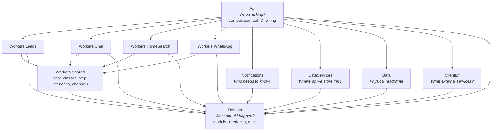

# API Project Restructure — Multi-Project Architecture

**Date:** 2026-03-21
**Status:** Draft
**Author:** Eddie Rosado + Claude

## Problem

The current `RealEstateStar.Api` project is a single project with ~160 production files mixing HTTP endpoints, domain models, background workers, storage implementations, API clients, and notification services under `Features/`. This creates several problems:

1. **CMA lives inside Leads** — CMA is a separate domain (scrape → analyze → PDF → notify) but is nested under `Features/Leads/Cma/` because it's triggered by a lead. Finding CMA code requires knowing this relationship.
2. **No separation of concerns** — a change to Google Drive storage can accidentally touch lead processing logic because they're in the same project with the same namespace.
3. **"Who needs to know" violations** — the HTTP endpoint layer can see background worker internals. Workers can see HTTP DTOs. Everything sees everything.
4. **Background services are tangled with endpoints** — `LeadProcessingWorker` lives next to `SubmitLeadEndpoint` despite having completely different lifecycles and dependencies.
5. **External API clients are embedded in features** — `WhatsAppClient` (Meta Graph API) lives in `Features/WhatsApp/Services/`. `ScraperCompSource` (ScraperAPI) lives in `Features/Leads/Cma/`. Swapping a provider means touching a feature folder.

## Principles

Each project answers exactly one question:

| Project | Question it answers | Example |
|---------|-------------------|---------|
| **Domain** | "What should happen?" | Process lead → enrich → notify → enqueue CMA |
| **DataServices** | "Where do we store this?" | Route to Drive or local based on config, manage folder structure |
| **Data** | "How do we physically read/write?" | Local filesystem provider, in-memory provider |
| **Notifications** | "Who needs to know?" | Email the agent, send WhatsApp to seller, post chat card |
| **Api** | "Who's asking?" | HTTP request → validate → authorize → hand to Domain |
| **Workers.*** | "How do we do it?" | Dequeue → run steps in order → handle errors |
| **Clients.*** | "What external services do we use?" | Meta Graph API, Claude API, ScraperAPI, Stripe |

Additional structural rules:

- **Every non-Api project depends only on Domain** (plus Workers.Shared for Workers.*). Api is the sole composition root that sees everything else.
- **Domain defines ALL contracts** — every interface lives in Domain. Data, Clients.*, DataServices, Notifications all implement Domain interfaces. No project outside Domain defines interfaces consumed by other projects.
- **Clients are fully isolated** — each client project has its own DTOs, implements a Domain interface, and has its own HttpClient configuration. Zero dependency on any other project except Domain.
- **Client DTO boundary** — Clients.* define their OWN request/response DTOs internally. The Domain interface they implement uses Domain types. The Client maps between its internal DTOs and Domain types in its own implementation.

## Architecture



**Maximum isolation:** Every non-Api project has exactly **1 dependency** (Domain), except Workers.* which have **2** (Domain + Workers.Shared). No project outside Api knows that Clients.*, Data, or DataServices exist. Workers call Domain interfaces like `ILeadStore`, `IAnthropicClient`. Notifications calls `IEmailSender`, `IWhatsAppSender`. DataServices calls `ILocalFileProvider`, `IGDriveClient`. Api wires all the real implementations via DI.

## Projects

### RealEstateStar.Domain

Pure domain models, enums, interfaces, and business rules. Zero external dependencies. **Every interface in the system lives here.**

```
Domain/
  Shared/
    Models/                          DeletionAuditEntry, DriveActivityEvent, DriveChangeResult,
                                     AccountConfig, StepProgress
    Interfaces/
      Storage/                       ILocalFileProvider, IAccountConfigService, IStepProgressStore
      Clients/                       IAnthropicClient, IScraperClient, IStripeClient,
                                     ICloudflareClient, ITurnstileClient,
                                     IGDriveClient, IGmailClient, IGoogleOAuthClient,
                                     IAzureTableClient
      Senders/                       IEmailSender, IWhatsAppSender
    Markdown/                        YamlFrontmatterParser (generic, not lead-specific)
  Leads/
    Models/                          Lead, LeadType, LeadStatus, LeadScore, BuyerDetails,
                                     SellerDetails, LeadEnrichment, LeadNotification,
                                     MarketingConsent, HomeSearchCriteria, Listing,
                                     DeleteResult
    Interfaces/                      ILeadStore, ILeadNotifier, ILeadEnricher,
                                     IEmailNotifier, ILeadDataDeletion, IMarketingConsentLog
    Markdown/                        LeadMarkdownRenderer
    LeadDiagnostics.cs
  Cma/
    Models/                          CmaAnalysis, CmaResult, Comp, CompSearchRequest, ReportType
    Interfaces/                      ICmaAnalyzer, ICmaPdfGenerator, ICmaNotifier,
                                     ICompAggregator, ICompSource
    CmaDiagnostics.cs
  HomeSearch/
    Interfaces/                      IHomeSearchProvider, IHomeSearchNotifier
    Markdown/                        HomeSearchMarkdownRenderer
    HomeSearchDiagnostics.cs
  Privacy/
    Interfaces/                      IDeletionAuditLog, IMarketingConsentLog
  WhatsApp/
    Models/                          WhatsAppTypes, WhatsAppAuditEntry
    Interfaces/                      IConversationHandler, IConversationLogger,
                                     IIntentClassifier, IResponseGenerator,
                                     IWhatsAppAuditService, IWhatsAppNotifier,
                                     IWebhookQueueService
    WhatsAppDiagnostics.cs
  Billing/
    Interfaces/                      IStripeService, IBillingNotifier
    Models/                          SubscriptionStatus (if needed)
    BillingDiagnostics.cs
  Onboarding/
    Models/                          OnboardingSession, OnboardingState, ChatMessage,
                                     ScrapedProfile, GoogleTokens
    Interfaces/                      ISessionStore, IProfileScraperService,
                                     IOnboardingTool, IToolDispatcher
    Services/                        OnboardingStateMachine
    OnboardingHelpers.cs
    OnboardingDiagnostics.cs
```

**Note on interface organization:** Domain/Shared/Interfaces/ is organized into subfolders by concern:
- **Storage/** — contracts for physical data access (`ILocalFileProvider` for local disk, `IAccountConfigService` for config, `IStepProgressStore` for checkpoints)
- **Clients/** — contracts for every external API (`IAnthropicClient`, `IGDriveClient`, `IGmailClient`, etc.). Each Clients.* project implements exactly one of these.
- **Senders/** — thin delivery contracts (`IEmailSender`, `IWhatsAppSender`) used by Notifications to send messages without knowing which client implements them.

**Note on Onboarding tools:** Domain defines the tool contracts (`IOnboardingTool`, `IToolDispatcher`) but NOT the tool implementations. Tool implementations live in `Api/Features/Onboarding/Tools/` because they depend on Domain client interfaces that are implemented by Clients.* projects — and only Api has visibility into those bindings. Domain only defines the shape of a tool and the dispatcher contract.

**Note on AccountConfig:** `AccountConfig` is a core multi-tenant model used throughout the system. It lives in Domain/Shared/Models/ with its interface `IAccountConfigService` in Domain/Shared/Interfaces/Storage/. The implementation (which reads JSON config files from disk) lives in DataServices/ since it orchestrates config loading.

**Note on per-domain Diagnostics:** Each domain folder contains its own `*Diagnostics.cs` file (e.g., `LeadDiagnostics.cs`, `CmaDiagnostics.cs`). These move from the current top-level `Diagnostics/` folder into their respective domain folders. The cross-cutting `OpenTelemetryExtensions.cs` stays in Api/Diagnostics/ since it wires up the OTel pipeline at the host level.

**Dependencies:** None.

### RealEstateStar.Data

Pure physical storage providers — how to read/write bytes to local filesystem, in-memory, etc. No business logic, no routing, no config awareness. Each provider implements a Domain interface.

```
Data/
  LocalFileProvider.cs               implements ILocalFileProvider (read/write/delete local files)
  InMemoryFileProvider.cs            implements ILocalFileProvider (for testing)
```

Data is intentionally thin. It answers "how do I physically read/write to this medium?" and nothing else. All business-level storage logic (folder structure, routing, format decisions) lives in DataServices.

**Dependencies:** Domain (for `ILocalFileProvider` interface).

### RealEstateStar.DataServices

Storage orchestration — decides WHERE to store data based on config, manages folder structures, and implements all business-level storage interfaces. Calls Domain interfaces for physical providers (local file, GDrive, Azure Table) — the implementations are wired by Api.

```
DataServices/
  Config/
    AccountConfigService.cs          implements IAccountConfigService (reads JSON config files)
  Leads/
    LeadStore.cs                     implements ILeadStore (routes to GDrive or local based on config)
    LeadPaths.cs                     Drive folder structure constants
    LeadDataDeletion.cs              implements ILeadDataDeletion
  Cma/
    CmaStore.cs                      implements storage for CMA results
  Privacy/
    DeletionAuditLog.cs              implements IDeletionAuditLog
    MarketingConsentLog.cs           implements IMarketingConsentLog
    DriveActivityParser.cs
    DriveChangeMonitor.cs            monitors Google Drive for changes
  WhatsApp/
    WhatsAppAuditService.cs          implements IWhatsAppAuditService (calls IAzureTableClient)
    DisabledWhatsAppAuditService.cs
    WebhookQueueService.cs           implements IWebhookQueueService (calls IAzureTableClient)
    WhatsAppIdempotencyStore.cs
    WhatsAppPaths.cs
    ConversationLogger.cs            implements IConversationLogger (calls IGDriveClient)
    ConversationLogRenderer.cs
  Onboarding/
    SessionStore.cs                  implements ISessionStore (calls ILocalFileProvider)
    EncryptingSessionStoreDecorator.cs
    ProfileScraperService.cs         implements IProfileScraperService (calls IScraperClient)
  Progress/
    StepProgressStore.cs             implements IStepProgressStore (calls IAzureTableClient or ILocalFileProvider)
```

**Note on storage routing:** `LeadStore` reads `AccountConfig` to determine whether to use `IGDriveClient` (prod) or `ILocalFileProvider` (dev). The routing decision is business logic — it belongs here, not in Data or Clients.

**Note on ConversationLogger:** Moved from Notifications to DataServices because it answers "where does this conversation log go?" — not "who needs to know?" It calls `IGDriveClient` to write markdown files to the agent's Drive folder.

**Dependencies:** Domain (for all interfaces — storage contracts, client contracts, model types).

### RealEstateStar.Notifications

How to tell people things happened — email, WhatsApp messages, chat cards. Notifications depends ONLY on Domain. It calls Domain sender interfaces (`IEmailSender`, `IWhatsAppSender`) — never knows about Meta Graph API, SendGrid, etc.

```
Notifications/
  Leads/
    MultiChannelLeadNotifier.cs      implements ILeadNotifier (calls IEmailSender, IWhatsAppSender)
    CascadingAgentNotifier.cs
    LeadChatCardRenderer.cs
    NoopEmailNotifier.cs
  Cma/
    CmaSellerNotifier.cs             implements ICmaNotifier (calls IEmailSender)
  HomeSearch/
    HomeSearchBuyerNotifier.cs       implements IHomeSearchNotifier (calls IEmailSender)
  WhatsApp/
    WhatsAppNotifier.cs              implements IWhatsAppNotifier (calls IWhatsAppSender)
    DisabledWhatsAppNotifier.cs
```

**Dependencies:** Domain only.

### RealEstateStar.Clients.*

Each external API gets its own fully isolated project. Each implements a Domain interface, has its own internal DTOs, and its own HttpClient configuration.

**DTO boundary rule:** Clients define their own internal request/response DTOs for HTTP communication. The Domain interface they implement uses Domain types. The client maps between its internal DTOs and Domain types within its own implementation. No other project ever sees Client DTOs.

```
Clients.Anthropic/                   Claude API → implements IAnthropicClient
  AnthropicClient.cs
  AnthropicOptions.cs
  Dto/
    ChatRequest.cs, ChatResponse.cs, ...

Clients.Scraper/                     ScraperAPI → implements IScraperClient
  ScraperClient.cs
  ScraperOptions.cs
  Dto/
    ScrapeRequest.cs, ScrapeResponse.cs, ...

Clients.WhatsApp/                    Meta Graph API → implements IWhatsAppSender
  WhatsAppApiClient.cs
  WhatsAppApiOptions.cs
  WhatsAppResiliencePolicies.cs      Polly retry + circuit breaker for WhatsApp HttpClient
  Dto/
    SendMessageRequest.cs, SendMessageResponse.cs, WebhookPayload.cs, ...

Clients.GDrive/                      Google Drive API → implements IGDriveClient
  GDriveClient.cs
  GDriveOptions.cs
  GDriveResiliencePolicies.cs        Polly retry for Drive API (rate limits, transient failures)
  Dto/
    ...

Clients.Gmail/                       Gmail API → implements IGmailClient, IEmailSender
  GmailClient.cs
  GmailOptions.cs
  Dto/
    ...

Clients.GoogleOAuth/                 Google OAuth2 → implements IGoogleOAuthClient
  GoogleOAuthClient.cs
  GoogleOAuthOptions.cs
  Dto/
    OAuthTokenResponse.cs, ...

Clients.Stripe/                      Stripe API → implements IStripeClient
  StripeClient.cs
  StripeOptions.cs
  Dto/...

Clients.Cloudflare/                  Cloudflare API (DNS, Workers) → implements ICloudflareClient
  CloudflareClient.cs
  CloudflareOptions.cs
  Dto/...

Clients.Turnstile/                   Cloudflare Turnstile → implements ITurnstileClient
  TurnstileClient.cs
  TurnstileOptions.cs
  Dto/...

Clients.Azure/                       Azure Table Storage → implements IAzureTableClient
  AzureTableClient.cs
  AzureTableOptions.cs
  Dto/...
```

**Note on Google split:** The old `Clients.Google` is split into 3 projects because Drive, Gmail, and OAuth are different APIs with different auth patterns, different rate limits, and different use cases. Each gets its own Polly policies, HttpClient config, and options class.

**Note on resilience:** Each client that calls a rate-limited or unreliable API includes its own `*ResiliencePolicies.cs` with Polly retry + circuit breaker configuration. These are registered with `IHttpClientFactory` in Api's DI wiring.

**Dependencies:** Domain (for the interface each client implements).

### RealEstateStar.Workers.Shared

Base classes, step interfaces, channel abstractions shared across all worker projects.

```
Workers.Shared/
  IWorkerStep.cs                     interface IWorkerStep<TRequest, TResponse>
  WorkerStepBase.cs                  abstract base with diagnostics, logging, error handling
  IProcessingChannel.cs              channel abstraction
  ProcessingChannelBase.cs           base Channel<T> implementation
  WorkerBase.cs                      base BackgroundService (dequeue → run steps → handle errors)
  DependencyInjection/
    WorkerServiceCollectionExtensions.cs   AddWorkerPipeline<TChannel, TWorker>()
  Pdf/
    PdfGenerator.cs                  shared QuestPDF wrapper (carries the QuestPDF NuGet dependency)
```

**Unified DI registration:** `AddWorkerPipeline<TChannel, TWorker>()` auto-discovers and registers all `IWorkerStep<,>` implementations in the worker's assembly via reflection. No manual step registration needed — adding a new step class is enough.

```csharp
// Workers.Shared/DependencyInjection/WorkerServiceCollectionExtensions.cs
public static class WorkerServiceCollectionExtensions
{
    public static IServiceCollection AddWorkerPipeline<TChannel, TWorker>(
        this IServiceCollection services)
        where TChannel : class
        where TWorker : BackgroundService
    {
        services.AddSingleton<TChannel>();
        services.AddHostedService<TWorker>();

        var assembly = typeof(TWorker).Assembly;
        foreach (var type in assembly.GetTypes()
            .Where(t => !t.IsAbstract && t.GetInterfaces()
                .Any(i => i.IsGenericType
                       && i.GetGenericTypeDefinition() == typeof(IWorkerStep<,>))))
        {
            services.AddTransient(type);
        }

        return services;
    }
}
```

```csharp
// Program.cs — one line per pipeline, zero step registration boilerplate
builder.Services.AddWorkerPipeline<LeadProcessingChannel, LeadProcessingWorker>();
builder.Services.AddWorkerPipeline<CmaProcessingChannel, CmaProcessingWorker>();
builder.Services.AddWorkerPipeline<HomeSearchProcessingChannel, HomeSearchProcessingWorker>();
builder.Services.AddWorkerPipeline<WebhookProcessorChannel, WebhookProcessorWorker>();
```

**Note on QuestPDF:** The QuestPDF NuGet dependency lives in Workers.Shared/Pdf/ so any pipeline that needs PDF generation can use it. Currently only Workers.Cma uses it (via `GeneratePdfStep`), but placing it here avoids a future extraction when a second pipeline needs PDFs.

**Dependencies:** Domain (for shared types referenced in step interfaces).

### RealEstateStar.Workers.Leads

Lead ingestion pipeline: enrich → score → store → notify → fan-out to CMA/HomeSearch.

```
Workers.Leads/
  LeadProcessingChannel.cs
  LeadProcessingWorker.cs
  Steps/
    EnrichLeadStep.cs                in: EnrichLeadRequest → out: EnrichLeadResponse
                                     (calls IScraperClient + IAnthropicClient for enrichment)
    ScoreLeadStep.cs                 in: ScoreLeadRequest → out: ScoreLeadResponse
    StoreLeadStep.cs                 in: StoreLeadRequest → out: StoreLeadResponse
                                     (calls ILeadStore)
    NotifyAgentStep.cs               in: NotifyAgentRequest → out: NotifyAgentResponse
                                     (calls ILeadNotifier)
    EnqueueCmaStep.cs                in: EnqueueCmaRequest → out: EnqueueCmaResponse
    EnqueueHomeSearchStep.cs         in: EnqueueSearchRequest → out: EnqueueSearchResponse
  Mappers/
    LeadWorkerMappers.cs             maps between step request/response types
```

**Note on mapper splitting:** `LeadMappers.cs` from the current codebase will be split: HTTP-facing mappings (SubmitLeadRequest ↔ Domain Lead) stay in `Api/Features/Leads/LeadMappers.cs`, while worker-facing mappings go to `Workers.Leads/Mappers/LeadWorkerMappers.cs`.

**Dependencies:** Domain, Workers.Shared.

### RealEstateStar.Workers.Cma

CMA pipeline: fetch comps → analyze → generate PDF → store → notify seller.

```
Workers.Cma/
  CmaProcessingChannel.cs
  CmaProcessingWorker.cs
  Steps/
    FetchCompsStep.cs                in: FetchCompsRequest → out: FetchCompsResponse
                                     (calls IScraperClient — aggregates multiple comp sources)
    AnalyzeCompsStep.cs              in: AnalyzeCompsRequest → out: AnalyzeCompsResponse
                                     (calls IAnthropicClient for Claude-powered CMA analysis)
    GeneratePdfStep.cs               in: GeneratePdfRequest → out: GeneratePdfResponse
                                     (uses QuestPDF via Workers.Shared/Pdf/)
    StoreCmaStep.cs                  in: StoreCmaRequest → out: StoreCmaResponse
                                     (calls IGDriveClient or ILocalFileProvider)
    NotifySellerStep.cs              in: NotifySellerRequest → out: NotifySellerResponse
                                     (calls ICmaNotifier)
  Mappers/
    CmaWorkerMappers.cs
```

**Note on CMA steps:** `CmaPdfGenerator`, `ClaudeCmaAnalyzer`, and `CompAggregator` from the old codebase become steps (`GeneratePdfStep`, `AnalyzeCompsStep`, `FetchCompsStep`). Each extends `WorkerStepBase<TRequest, TResponse>`, getting structured logging, OTel spans, and error handling for free.

**Dependencies:** Domain, Workers.Shared.

### RealEstateStar.Workers.HomeSearch

Home search pipeline: search listings → curate → store → notify buyer.

```
Workers.HomeSearch/
  HomeSearchProcessingChannel.cs
  HomeSearchProcessingWorker.cs
  Steps/
    SearchListingsStep.cs            in: SearchRequest → out: SearchResponse
                                     (calls IScraperClient for listing data)
    CurateListingsStep.cs            in: CurateRequest → out: CurateResponse
    StoreResultsStep.cs              in: StoreRequest → out: StoreResponse
    NotifyBuyerStep.cs               in: NotifyRequest → out: NotifyResponse
  Mappers/
    HomeSearchWorkerMappers.cs
```

**Dependencies:** Domain, Workers.Shared.

### RealEstateStar.Workers.WhatsApp

WhatsApp webhook processing: dequeue → classify intent → generate response → send.

```
Workers.WhatsApp/
  WebhookProcessorWorker.cs
  WhatsAppRetryJob.cs                background service for retrying failed WhatsApp sends
  Steps/
    ClassifyIntentStep.cs            in: ClassifyRequest → out: ClassifyResponse
    GenerateResponseStep.cs          in: GenerateRequest → out: GenerateResponse
    SendReplyStep.cs                 in: SendRequest → out: SendResponse
    LogConversationStep.cs           in: LogRequest → out: LogResponse
  Mappers/
    WhatsAppWorkerMappers.cs
```

**Dependencies:** Domain, Workers.Shared.

### RealEstateStar.Api

Thin HTTP layer: endpoints, middleware, health checks, DI registration. The **sole composition root** — the only project that sees Data, DataServices, Notifications, Workers.*, and Clients.*. Also hosts request-scoped services for Onboarding and Billing (which are NOT background pipelines).

```
Api/
  Features/
    Leads/
      Submit/                        SubmitLeadEndpoint, SubmitLeadRequest, SubmitLeadResponse
      OptOut/                        OptOutEndpoint, OptOutRequest
      DeleteData/                    DeleteDataEndpoint, DeleteLeadDataRequest, DeleteLeadDataResponse
      RequestDeletion/               RequestDeletionEndpoint, RequestDeletionRequest
      Subscribe/                     SubscribeEndpoint, SubscribeRequest
      LeadMappers.cs                 HTTP DTOs ↔ Domain models (HTTP-facing only)
    Billing/
      Webhooks/                      StripeWebhookEndpoint
      Services/
        StripeService.cs             implements IStripeService (calls IStripeClient)
      BillingMappers.cs
    Onboarding/
      CreateSession/                 endpoint + DTOs
      GetSession/                    endpoint + DTOs
      PostChat/                      endpoint + DTOs
      ConnectGoogle/                 endpoint
      StartGoogleOAuth/              endpoint (initiates OAuth redirect)
      Services/
        OnboardingChatService.cs     orchestrates chat (calls IAnthropicClient, dispatches tools)
        GoogleOAuthService.cs        handles OAuth flow (calls IGoogleOAuthClient)
      Tools/
        ToolDispatcher.cs            implements IToolDispatcher (resolves + dispatches tools from DI)
        DeploySiteTool.cs            implements IOnboardingTool (calls ICloudflareClient)
        ScrapeUrlTool.cs             implements IOnboardingTool (calls IScraperClient)
        CreateStripeSessionTool.cs   implements IOnboardingTool (calls IStripeClient)
        GoogleAuthCardTool.cs        implements IOnboardingTool (calls IGoogleOAuthClient)
        SendWhatsAppWelcomeTool.cs   implements IOnboardingTool (calls IWhatsAppSender)
      OnboardingMappers.cs
    WhatsApp/
      Webhook/
        ReceiveWebhook/              endpoint + payload DTOs
        VerifyWebhook/               endpoint
      WhatsAppMappers.cs             HTTP-facing mappings only
  Infrastructure/
    IEndpoint.cs
    EndpointExtensions.cs
    ApiKeyHmacMiddleware.cs
    ApiKeyHmacOptions.cs
  Middleware/
    AgentIdEnricher.cs
    CorrelationIdMiddleware.cs
  Health/
    BackgroundServiceHealthCheck.cs
    BackgroundServiceHealthTracker.cs
    ClaudeApiHealthCheck.cs
    GoogleDriveHealthCheck.cs
    ScraperApiHealthCheck.cs
    TurnstileHealthCheck.cs
  Diagnostics/
    OpenTelemetryExtensions.cs       OTel pipeline setup (cross-cutting infra, stays in Api)
  Logging/
    LoggingExtensions.cs
  Services/
    ProcessRunner.cs                 runs CLI commands (infra — used by SiteDeployService)
    SiteDeployService.cs             deployment infra (wraps ProcessRunner for site deploys)
  Program.cs
```

**Note on Onboarding services:** `OnboardingChatService`, `GoogleOAuthService`, and `StripeService` are request-scoped services called inline during HTTP requests. They are NOT background workers. They live in Api because they orchestrate the HTTP request flow.

**Note on tool implementations:** Tool implementations (`DeploySiteTool`, `ScrapeUrlTool`, etc.) live in Api because they call Domain client interfaces — and Api is the composition root that can resolve any interface. Domain only defines `IOnboardingTool` and `IToolDispatcher` contracts.

**Note on duplicate DI registrations:** During migration, watch for duplicate registrations where the same interface is registered in both the old location and the new project. Clean these up as each project is migrated — run the full test suite after each step to catch conflicts.

**TrialExpiryService** is a `BackgroundService` but it is a simple timer (check expiry, update state) — not a multi-step pipeline. It stays in Api as a hosted service registered in `Program.cs`, not in a Workers.* project.

**Dependencies:** Domain, Data, DataServices, Notifications, Workers.*, Clients.* (for DI registration and health checks).

### Test Projects

Each production project gets its own test project in a top-level `tests/` folder.

```
tests/
  RealEstateStar.Domain.Tests/
    Leads/Models/                    LeadTests
    Leads/Markdown/                  LeadMarkdownRendererTests
    Cma/Models/                      ...
    Shared/Markdown/                 YamlFrontmatterParserTests
    Billing/                         ...
    Onboarding/Services/             OnboardingStateMachineTests

  RealEstateStar.Data.Tests/
    LocalFileProviderTests
    InMemoryFileProviderTests

  RealEstateStar.DataServices.Tests/
    Leads/                           LeadStoreTests
    Config/                          AccountConfigServiceTests
    Onboarding/                      SessionStoreTests, EncryptingSessionStoreDecoratorTests
    WhatsApp/                        ConversationLoggerTests, WhatsAppAuditServiceTests
    Progress/                        StepProgressStoreTests

  RealEstateStar.Notifications.Tests/
    Leads/                           MultiChannelLeadNotifierTests
    Cma/                             CmaSellerNotifierTests
    ...

  RealEstateStar.Workers.Leads.Tests/
    Steps/                           EnrichLeadStepTests, ScoreLeadStepTests, ...

  RealEstateStar.Workers.Cma.Tests/
    Steps/                           FetchCompsStepTests, AnalyzeCompsStepTests,
                                       GeneratePdfStepTests, ...

  RealEstateStar.Workers.HomeSearch.Tests/
    Steps/                           SearchListingsStepTests, ...

  RealEstateStar.Workers.WhatsApp.Tests/
    Steps/                           ClassifyIntentStepTests, ...
    WhatsAppRetryJobTests

  RealEstateStar.Clients.Anthropic.Tests/
  RealEstateStar.Clients.Scraper.Tests/
  RealEstateStar.Clients.WhatsApp.Tests/
  RealEstateStar.Clients.GDrive.Tests/
  RealEstateStar.Clients.Gmail.Tests/
  RealEstateStar.Clients.GoogleOAuth.Tests/
  RealEstateStar.Clients.Stripe.Tests/
  RealEstateStar.Clients.Azure.Tests/

  RealEstateStar.Api.Tests/
    Features/Leads/Submit/           SubmitLeadEndpointTests
    Features/Leads/OptOut/           OptOutEndpointTests
    Features/Billing/                StripeWebhookEndpointTests, StripeServiceTests
    Features/Onboarding/Services/    OnboardingChatServiceTests, GoogleOAuthServiceTests
    Features/Onboarding/Tools/       ToolDispatcherTests, DeploySiteToolTests, ...
    ...

  RealEstateStar.TestUtilities/
    TestHelpers.cs                   shared builders, fakes, assertion helpers
    TestData.cs                      shared fixture data
```

**Note on InternalsVisibleTo:** Each production project adds `[InternalsVisibleTo("RealEstateStar.{Project}.Tests")]` in its .csproj.

**Note on CI:** Each test project can run independently (`dotnet test tests/RealEstateStar.Domain.Tests/`), or all at once from the solution.

## Worker Step Pattern

### Base Interface

```csharp
public interface IWorkerStep<TRequest, TResponse>
{
    Task<TResponse> ExecuteAsync(TRequest request, CancellationToken ct);
}
```

### Base Class

```csharp
public abstract class WorkerStepBase<TRequest, TResponse>(
    ILogger logger) : IWorkerStep<TRequest, TResponse>
{
    public async Task<TResponse> ExecuteAsync(TRequest request, CancellationToken ct)
    {
        using var activity = ActivitySource.StartActivity(StepName);
        var sw = Stopwatch.StartNew();
        try
        {
            var result = await HandleAsync(request, ct);
            logger.LogInformation("[{StepName}] completed in {ElapsedMs}ms", StepName, sw.ElapsedMilliseconds);
            return result;
        }
        catch (Exception ex)
        {
            logger.LogError(ex, "[{StepName}] failed after {ElapsedMs}ms", StepName, sw.ElapsedMilliseconds);
            throw;
        }
    }

    protected abstract Task<TResponse> HandleAsync(TRequest request, CancellationToken ct);
    protected abstract string StepName { get; }
    protected virtual ActivitySource ActivitySource => WorkerDiagnostics.ActivitySource;
}
```

### Step Progress (Checkpoint/Resume)

Each work item's progress is checkpointed after every step. On retry, completed steps are skipped and their persisted output is used to feed the next step. This is critical for Claude API calls — re-running an `AnalyzeCompsStep` wastes tokens, latency, and produces non-deterministic output.

```csharp
// Domain/Shared/Models/StepProgress.cs
public record StepProgress
{
    public required string WorkItemId { get; init; }
    public required string PipelineName { get; init; }
    public int LastCompletedStep { get; init; }              // 0 = not started
    public Dictionary<int, string> StepOutputs { get; init; } = [];  // step index → serialized response
    public string? LastError { get; init; }
    public int RetryCount { get; init; }
    public DateTime UpdatedAt { get; init; }
}

// Domain/Shared/Interfaces/Storage/IStepProgressStore.cs
public interface IStepProgressStore
{
    Task<StepProgress?> GetAsync(string workItemId, string pipelineName, CancellationToken ct);
    Task SaveAsync(StepProgress progress, CancellationToken ct);
    Task DeleteAsync(string workItemId, string pipelineName, CancellationToken ct);  // cleanup after success
}
```

**Storage:** `IStepProgressStore` implementation lives in DataServices/ (routes to Azure Table Storage in prod or local JSON files in dev).

### WorkerBase (checkpoint/resume built in)

`WorkerBase` owns the entire checkpoint loop. Subclasses only declare their steps and mappers — zero checkpoint logic in each pipeline.

```csharp
// Workers.Shared/WorkerBase.cs
public abstract class WorkerBase<TWorkItem>(
    IProcessingChannel<TWorkItem> channel,
    IStepProgressStore progressStore,
    ILogger logger) : BackgroundService where TWorkItem : IWorkItem
{
    protected abstract string PipelineName { get; }

    protected override async Task ExecuteAsync(CancellationToken ct)
    {
        await foreach (var item in channel.ReadAllAsync(ct))
        {
            var progress = await progressStore.GetAsync(item.Id, PipelineName, ct)
                           ?? new StepProgress { WorkItemId = item.Id, PipelineName = PipelineName };

            try
            {
                await ProcessWithCheckpointsAsync(item, progress, ct);
                // All steps succeeded — delete checkpoint (no stale data)
                await progressStore.DeleteAsync(item.Id, PipelineName, ct);
            }
            catch (Exception ex)
            {
                logger.LogError(ex, "[{Pipeline}] Failed at step {Step}. Checkpoint preserved for retry.",
                    PipelineName, progress.LastCompletedStep);
                // Checkpoint is already saved by RunOrResumeAsync — next dequeue will resume
            }
        }
    }

    protected abstract Task ProcessWithCheckpointsAsync(
        TWorkItem item, StepProgress progress, CancellationToken ct);

    /// <summary>
    /// Run a step or resume from checkpoint. Call this for each step in order.
    /// On success: persists output and advances checkpoint.
    /// On failure: checkpoint preserved at last successful step — retry will skip completed steps.
    /// </summary>
    protected async Task<T> RunOrResumeAsync<T>(
        StepProgress progress, int stepIndex, Func<Task<T>> execute, CancellationToken ct)
    {
        if (stepIndex < progress.LastCompletedStep
            && progress.StepOutputs.TryGetValue(stepIndex, out var cached))
        {
            logger.LogInformation("[{Pipeline}] Resuming — skipping step {Step}",
                PipelineName, stepIndex);

            try
            {
                return JsonSerializer.Deserialize<T>(cached)!;
            }
            catch (JsonException ex)
            {
                logger.LogWarning(ex, "[{Pipeline}] Checkpoint deserialization failed for step {Step}. Re-executing.",
                    PipelineName, stepIndex);
                // Fall through to re-execute the step
            }
        }

        var result = await execute();

        var updated = progress with
        {
            LastCompletedStep = stepIndex + 1,
            StepOutputs = new(progress.StepOutputs) { [stepIndex] = JsonSerializer.Serialize(result) },
            UpdatedAt = DateTime.UtcNow
        };
        await progressStore.SaveAsync(updated, ct);

        return result;
    }
}
```

### Worker Orchestrator (declarative steps)

Each pipeline is ~15 lines — just step order and mappers. All checkpoint, logging, error handling, and cleanup is in `WorkerBase`.

```csharp
public class CmaProcessingWorker(
    CmaProcessingChannel channel,
    IStepProgressStore progressStore,
    FetchCompsStep fetchComps,
    AnalyzeCompsStep analyzeComps,
    GeneratePdfStep generatePdf,
    StoreCmaStep storeCma,
    NotifySellerStep notifySeller,
    ILogger<CmaProcessingWorker> logger) : WorkerBase<CmaWorkItem>(channel, progressStore, logger)
{
    protected override string PipelineName => "Cma";

    protected override async Task ProcessWithCheckpointsAsync(
        CmaWorkItem item, StepProgress progress, CancellationToken ct)
    {
        var comps    = await RunOrResumeAsync<FetchCompsResponse>(progress, 0,
            () => fetchComps.ExecuteAsync(new FetchCompsRequest(item), ct), ct);
        var analysis = await RunOrResumeAsync<AnalyzeCompsResponse>(progress, 1,
            () => analyzeComps.ExecuteAsync(CmaWorkerMappers.ToAnalyzeRequest(comps, item), ct), ct);
        var pdf      = await RunOrResumeAsync<GeneratePdfResponse>(progress, 2,
            () => generatePdf.ExecuteAsync(CmaWorkerMappers.ToPdfRequest(analysis, item), ct), ct);
        var stored   = await RunOrResumeAsync<StoreCmaResponse>(progress, 3,
            () => storeCma.ExecuteAsync(CmaWorkerMappers.ToStoreRequest(pdf, item), ct), ct);
        await RunOrResumeAsync<NotifySellerResponse>(progress, 4,
            () => notifySeller.ExecuteAsync(CmaWorkerMappers.ToNotifyRequest(stored, item), ct), ct);
    }
}
```

**Key behaviors:**
- WorkerBase owns the checkpoint loop — test it once, all pipelines get it for free
- On first run: every step executes, output is checkpointed after each
- On retry: completed steps are skipped, cached output deserialized and fed to next mapper
- On full success: checkpoint deleted (no stale data)
- On failure: checkpoint preserved at last successful step — retry resumes from there
- On deserialization failure: step re-executes (handles schema changes between deploys)
- Claude API steps never re-run if already succeeded — saves tokens, latency, preserves output

## Dependency Matrix

```
                  Domain  Data  DataSvc  Notif  Workers.Shared  Clients.*
Domain              -      -      -       -          -             -
Data                ✓      -      -       -          -             -
Clients.*           ✓      -      -       -          -             -
DataServices        ✓      -      -       -          -             -
Notifications       ✓      -      -       -          -             -
Workers.Shared      ✓      -      -       -          -             -
Workers.*           ✓      -      -       -          ✓             -
Api                 ✓      ✓      ✓       ✓          ✓             ✓
```

**Maximum isolation:** Every non-Api project has at most **2 dependencies** (Workers.* = Domain + Workers.Shared). All other non-Api projects have exactly **1 dependency** (Domain). No project outside Api knows that Clients.*, Data, or DataServices exist. Api is the sole composition root — the only project that wires implementations to interfaces.

## Architecture Enforcement

### 1. Compile-Time: .csproj ProjectReference

Each .csproj file declares only its allowed dependencies via `<ProjectReference>`. If a developer adds an unauthorized `using` statement, the code won't compile.

```xml
<!-- RealEstateStar.Notifications.csproj — only Domain allowed -->
<ItemGroup>
  <ProjectReference Include="..\RealEstateStar.Domain\RealEstateStar.Domain.csproj" />
</ItemGroup>

<!-- RealEstateStar.Workers.Leads.csproj — Domain + Workers.Shared -->
<ItemGroup>
  <ProjectReference Include="..\RealEstateStar.Domain\RealEstateStar.Domain.csproj" />
  <ProjectReference Include="..\RealEstateStar.Workers.Shared\RealEstateStar.Workers.Shared.csproj" />
</ItemGroup>
```

This is the primary enforcement mechanism — unauthorized dependencies are a compile error, not a warning.

### 2. CI-Time: Architecture Tests

ArchUnit-style tests that assert on the dependency rules. These catch drift that .csproj references alone can't prevent (e.g., someone adds a ProjectReference they shouldn't have).

```csharp
// tests/RealEstateStar.Architecture.Tests/DependencyTests.cs

public class DependencyTests
{
    private static readonly string[] ProjectPrefixes = ["RealEstateStar"];

    [Theory]
    [InlineData(typeof(MultiChannelLeadNotifier), new[] { "Domain" })]           // Notifications
    [InlineData(typeof(LeadStore), new[] { "Domain" })]                          // DataServices
    [InlineData(typeof(LocalFileProvider), new[] { "Domain" })]                  // Data
    [InlineData(typeof(AnthropicClient), new[] { "Domain" })]                    // Clients.Anthropic
    [InlineData(typeof(WhatsAppApiClient), new[] { "Domain" })]                  // Clients.WhatsApp
    [InlineData(typeof(WorkerStepBase<,>), new[] { "Domain" })]                  // Workers.Shared
    [InlineData(typeof(LeadProcessingWorker), new[] { "Domain", "Workers.Shared" })] // Workers.Leads
    public void Project_only_depends_on_allowed_projects(Type typeInProject, string[] allowedSuffixes)
    {
        var assembly = typeInProject.Assembly;
        var projectName = assembly.GetName().Name!;
        var allowed = allowedSuffixes
            .Select(s => $"RealEstateStar.{s}")
            .Append(projectName)  // always allow self-reference
            .ToHashSet();

        var violations = assembly.GetReferencedAssemblies()
            .Where(a => a.Name!.StartsWith("RealEstateStar"))
            .Where(a => !allowed.Contains(a.Name!))
            .Select(a => a.Name!)
            .ToList();

        Assert.Empty(violations);
    }

    [Fact]
    public void Api_is_the_only_project_that_references_Clients()
    {
        var allAssemblies = AppDomain.CurrentDomain.GetAssemblies()
            .Where(a => a.GetName().Name?.StartsWith("RealEstateStar") == true)
            .Where(a => !a.GetName().Name!.Contains("Api"))
            .Where(a => !a.GetName().Name!.Contains("Tests"));

        foreach (var assembly in allAssemblies)
        {
            var clientRefs = assembly.GetReferencedAssemblies()
                .Where(a => a.Name!.Contains("Clients"))
                .Select(a => a.Name!)
                .ToList();

            Assert.True(clientRefs.Count == 0,
                $"{assembly.GetName().Name} references {string.Join(", ", clientRefs)} — only Api may reference Clients.*");
        }
    }
}
```

These tests live in a dedicated `tests/RealEstateStar.Architecture.Tests/` project that references all production assemblies. They run in CI on every PR — a single unauthorized dependency fails the build.

## Onboarding Architecture Decision

Onboarding is fundamentally different from Leads/CMA/HomeSearch/WhatsApp. Those are background pipelines (enqueue work item → process steps asynchronously). Onboarding is **request-driven**: user sends a chat message via HTTP → API processes it synchronously → returns response.

Because of this, there is no `Workers.Onboarding` project. Instead:

| Layer | What lives there | Why |
|-------|-----------------|-----|
| **Domain/Onboarding/** | Models, Interfaces (`ISessionStore`, `IProfileScraperService`, `IOnboardingTool`, `IToolDispatcher`), `OnboardingStateMachine`, `OnboardingHelpers` | Pure domain logic and contracts. |
| **Domain/Billing/** | Interfaces (`IStripeService`, `IBillingNotifier`), Models | Billing contracts — cross-cutting, not onboarding-specific. |
| **DataServices/Onboarding/** | `SessionStore`, `EncryptingSessionStoreDecorator`, `ProfileScraperService` | Persistence and data access implementations. |
| **Api/Features/Billing/** | `StripeWebhookEndpoint`, `StripeService`, `BillingMappers` | Stripe webhook handling + checkout session creation. |
| **Api/Features/Onboarding/** | Endpoints, Services (`OnboardingChatService`, `GoogleOAuthService`), Tools (`ToolDispatcher`, `DeploySiteTool`, etc.), `OnboardingMappers` | HTTP layer + request-scoped orchestration + tool implementations. |
| **Api/Services/** | `ProcessRunner`, `SiteDeployService` | CLI process execution infra. |

## Migration Strategy

This is a large refactor (~160 production files + ~120 test files). Execute incrementally:

1. **Create all projects with empty folders** — set up .csproj files with correct `<ProjectReference>` dependencies
2. **Add architecture tests** — write the dependency enforcement tests first (they'll all pass against empty projects, then catch violations as code moves)
3. **Move Domain first** — models, interfaces, state machine, helpers. Everything else still compiles against the old location.
4. **Create DataServices** — move storage orchestration (LeadStore, AccountConfigService, etc.)
5. **Create Data** — move pure providers (LocalFileProvider)
6. **Extract Clients** — one at a time, starting with the most isolated: Turnstile → Scraper → Anthropic → Azure → GDrive → Gmail → GoogleOAuth → Stripe → Cloudflare → WhatsApp
7. **Move Notifications** — notifier implementations
8. **Create Workers.Shared** — base classes and interfaces
9. **Move Workers** — one pipeline at a time: Leads → CMA → HomeSearch → WhatsApp
10. **Clean up Api** — remove emptied folders, verify only endpoints + onboarding services + infra remain
11. **Move StripeWebhookEndpoint** — from old Features/Billing/ to Api/Features/Billing/Webhooks/
12. **Move tests** — mirror new structure into `tests/` folder
13. **Delete old empty folders**
14. **Clean up duplicate DI registrations** — verify Program.cs only registers services from their owning projects

Each step should compile, pass tests, and pass architecture tests before moving to the next.

## Open Questions

1. **CI build time impact of 18+ projects vs 2?** More projects means more MSBuild overhead. Measure build time before and after migration. If it increases significantly, consider merging small Clients (e.g., Turnstile is ~2 files — could fold into Clients.Cloudflare).
2. **Should Onboarding services that are request-scoped remain in Api or move to DataServices?** Current decision: they stay in Api because they orchestrate HTTP request flow. But if they grow complex, they could move with the mapping responsibility pushed to a thin Api adapter.
