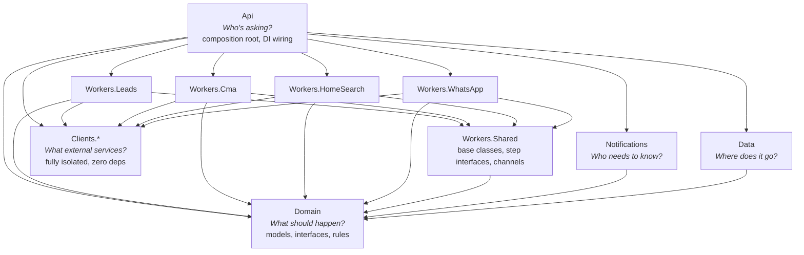

# API Project Restructure — Multi-Project Architecture

**Date:** 2026-03-21
**Status:** Draft
**Author:** Eddie Rosado + Claude

## Problem

The current `RealEstateStar.Api` project is a single project with ~160 production files mixing HTTP endpoints, domain models, background workers, storage implementations, API clients, and notification services under `Features/`. This creates several problems:

1. **CMA lives inside Leads** — CMA is a separate domain (scrape → analyze → PDF → notify) but is nested under `Features/Leads/Cma/` because it's triggered by a lead. Finding CMA code requires knowing this relationship.
2. **No separation of concerns** — a change to Google Drive storage can accidentally touch lead processing logic because they're in the same project with the same namespace.
3. **"Who needs to know" violations** — the HTTP endpoint layer can see background worker internals. Workers can see HTTP DTOs. Everything sees everything.
4. **Background services are tangled with endpoints** — `LeadProcessingWorker` lives next to `SubmitLeadEndpoint` despite having completely different lifecycles and dependencies.
5. **External API clients are embedded in features** — `WhatsAppClient` (Meta Graph API) lives in `Features/WhatsApp/Services/`. `ScraperCompSource` (ScraperAPI) lives in `Features/Leads/Cma/`. Swapping a provider means touching a feature folder.

## Principles

Each project answers exactly one question:

| Project | Question it answers | Example |
|---------|-------------------|---------|
| **Domain** | "What should happen?" | Process lead → enrich → notify → enqueue CMA |
| **Notifications** | "Who needs to know?" | Email the agent, send WhatsApp to seller, post chat card |
| **Data** | "Where does it go?" | Drive folder X, Azure Table Y, local file Z |
| **Api** | "Who's asking?" | HTTP request → validate → authorize → hand to Domain |
| **Workers.*** | "How do we do it?" | Dequeue → run steps in order → handle errors |
| **Clients.*** | "What external services do we use?" | Meta Graph API, Claude API, ScraperAPI, Stripe |

Additional structural rules:

- **Dependency arrows point inward** — Domain is the core with zero dependencies. Everything else depends on Domain (directly or transitively). Nothing depends on Api except the host.
- **Clients are fully isolated** — each client project has its own DTOs, its own interface, its own HttpClient configuration. Zero dependency on Domain or any other project.
- **Client DTO boundary** — Clients.* define their OWN request/response DTOs. When a caller needs a Domain model, it maps from the Client DTO in its own layer (Api service or Worker mapper). This keeps the dependency arrow pointing inward.

## Architecture



**Isolation principle:** Api is the composition root — the only project that sees everything. Every other project has at most 3 dependencies. Workers.* never reference Data or Notifications (they call Domain interfaces like `ILeadStore`, `ILeadNotifier`). Notifications never reference Clients.* (they call Domain sender interfaces like `IEmailSender`, `IWhatsAppSender`). All wiring happens in Api's DI container.

## Projects

### RealEstateStar.Domain

Pure domain models, enums, interfaces, and business rules. Zero external dependencies.

```
Domain/
  Shared/
    Models/                          DeletionAuditEntry, DriveActivityEvent, DriveChangeResult,
                                     AccountConfig, StepProgress
    Interfaces/                      IAccountConfigService, IStepProgressStore,
                                     IEmailSender, IWhatsAppSender, IFileStorageWriter
    Markdown/                        YamlFrontmatterParser (generic, not lead-specific)
  Leads/
    Models/                          Lead, LeadType, LeadStatus, LeadScore, BuyerDetails,
                                     SellerDetails, LeadEnrichment, LeadNotification,
                                     MarketingConsent, HomeSearchCriteria, Listing,
                                     DeleteResult
    Interfaces/                      ILeadStore, ILeadNotifier, ILeadEnricher,
                                     IEmailNotifier, ILeadDataDeletion, IMarketingConsentLog
    Markdown/                        LeadMarkdownRenderer
    LeadDiagnostics.cs
  Cma/
    Models/                          CmaAnalysis, CmaResult, Comp, CompSearchRequest, ReportType
    Interfaces/                      ICmaAnalyzer, ICmaPdfGenerator, ICmaNotifier,
                                     ICompAggregator, ICompSource
    CmaDiagnostics.cs
  HomeSearch/
    Interfaces/                      IHomeSearchProvider, IHomeSearchNotifier
    Markdown/                        HomeSearchMarkdownRenderer
    HomeSearchDiagnostics.cs
  Privacy/
    Interfaces/                      IDeletionAuditLog, IMarketingConsentLog
  WhatsApp/
    Models/                          WhatsAppTypes, WhatsAppAuditEntry
    Interfaces/                      IConversationHandler, IConversationLogger,
                                     IIntentClassifier, IResponseGenerator,
                                     IWhatsAppAuditService, IWhatsAppNotifier,
                                     IWebhookQueueService
    WhatsAppDiagnostics.cs
  Billing/
    Interfaces/                      IStripeService, IBillingNotifier
    Models/                          SubscriptionStatus (if needed)
    BillingDiagnostics.cs
  Onboarding/
    Models/                          OnboardingSession, OnboardingState, ChatMessage,
                                     ScrapedProfile, GoogleTokens
    Interfaces/                      ISessionStore, IProfileScraperService
    Services/                        OnboardingStateMachine
    Tools/                           ToolDispatcher, IOnboardingTool,
                                     DeploySiteTool (depends on ICloudflareClient),
                                     ScrapeUrlTool (depends on IScraperClient),
                                     CreateStripeSessionTool (depends on IStripeService),
                                     GoogleAuthCardTool (depends on IGoogleOAuthClient),
                                     SendWhatsAppWelcomeTool (depends on IWhatsAppApiClient)
    OnboardingHelpers.cs
    OnboardingDiagnostics.cs
```

**Note on Onboarding/Tools/:** These are Claude tool implementations called during the onboarding chat flow, not worker pipeline steps. They live in Domain because they represent domain logic (what tools are available, how to dispatch them). Tools that call external services depend on client interfaces — the actual client implementations are injected at runtime via DI. For example, `SendWhatsAppWelcomeTool` depends on `IWhatsAppApiClient` from Clients.WhatsApp, `DeploySiteTool` depends on `ICloudflareClient` from Clients.Cloudflare, etc. This means Domain has interface-only dependencies — it does NOT reference Clients.* projects directly. The interfaces are defined in the respective Clients.* projects and registered in Api's DI container.

**Note on AccountConfig:** `AccountConfig` is a core multi-tenant model used throughout the system (Api, Workers, Data). It lives in Domain/Shared/Models/ with its interface `IAccountConfigService` in Domain/Shared/Interfaces/. The implementation `AccountConfigService` (which reads JSON config files from disk) lives in Data/ since that is data access.

**Note on per-domain Diagnostics:** Each domain folder contains its own `*Diagnostics.cs` file (e.g., `LeadDiagnostics.cs`, `CmaDiagnostics.cs`, `WhatsAppDiagnostics.cs`, `OnboardingDiagnostics.cs`). These move from the current top-level `Diagnostics/` folder into their respective domain folders. The cross-cutting `OpenTelemetryExtensions.cs` stays in Api/Diagnostics/ since it wires up the OTel pipeline at the host level.

**Dependencies:** None.

### RealEstateStar.Data

Storage implementations — how to persist and retrieve data from Google Drive, local filesystem, Azure Table Storage.

```
Data/
  Shared/
    AccountConfigService.cs          reads JSON config files (implements IAccountConfigService)
  Storage/
    IFileStorageProvider.cs
    GDriveStorageProvider.cs
    LocalFileStorageProvider.cs
    LocalStorageProvider.cs
    NoopFileStorageProvider.cs
  Leads/
    GDriveLeadStore.cs
    FileLeadStore.cs
    LeadPaths.cs                     Drive folder structure constants
    GDriveLeadDataDeletion.cs
  Privacy/
    DeletionAuditLog.cs
    MarketingConsentLog.cs
    DriveActivityParser.cs
    DriveChangeMonitor.cs            monitors Google Drive for changes (data access)
  WhatsApp/
    AzureWhatsAppAuditService.cs
    DisabledWhatsAppAuditService.cs
    AzureWebhookQueueService.cs
    WhatsAppIdempotencyStore.cs
    WhatsAppPaths.cs
  Onboarding/
    JsonFileSessionStore.cs
    EncryptingSessionStoreDecorator.cs
    ProfileScraperService.cs         uses Clients.Scraper (implements IProfileScraperService)
  Progress/
    AzureStepProgressStore.cs        Azure Table Storage (prod)
    LocalStepProgressStore.cs        local JSON files (dev)
  Gws/
    IGwsService.cs
    GwsService.cs
    LeadBriefData.cs
```

**Dependencies:** Domain (for model types used in store interfaces — including `IStepProgressStore` and `StepProgress`).

### RealEstateStar.Notifications

How to tell people things happened — email, WhatsApp messages, Drive chat cards. Notifications depend ONLY on Domain interfaces for delivery — they never reference Clients.* directly.

```
Notifications/
  Leads/
    MultiChannelLeadNotifier.cs      implements ILeadNotifier (calls IEmailSender, IWhatsAppSender)
    CascadingAgentNotifier.cs
    LeadChatCardRenderer.cs
    NoopEmailNotifier.cs
  Cma/
    CmaSellerNotifier.cs             implements ICmaNotifier (calls IEmailSender)
  HomeSearch/
    HomeSearchBuyerNotifier.cs       implements IHomeSearchNotifier (calls IEmailSender)
  WhatsApp/
    WhatsAppNotifier.cs              implements IWhatsAppNotifier (calls IWhatsAppSender)
    DisabledWhatsAppNotifier.cs
    ConversationLogger.cs            implements IConversationLogger (calls IFileStorageWriter)
    ConversationLogRenderer.cs
```

**Dependencies:** Domain only (for model types and delivery interfaces like `IEmailSender`, `IWhatsAppSender`).

**Note on delivery interfaces:** Domain defines thin sender contracts (e.g., `IEmailSender`, `IWhatsAppSender`) that abstract away the external service. Clients.* implement these contracts. Api wires the binding in DI (e.g., `services.AddTransient<IWhatsAppSender, WhatsAppApiClient>()`). This means Notifications never knows about Meta Graph API, SendGrid, etc. — it just calls `IWhatsAppSender.SendAsync()`.

### RealEstateStar.Clients.*

Each external API gets its own fully isolated project. Own DTOs, own interface, own HttpClient config. Zero dependency on Domain or any other project.

**DTO boundary rule:** Clients define their own request/response DTOs. They never reference Domain types. When a caller needs to convert between a Client DTO and a Domain model, the mapping happens in the caller's layer (e.g., `Api/Features/Onboarding/` maps `Clients.Google.Dto.OAuthTokenResponse` to `Domain.Onboarding.Models.GoogleTokens`). This keeps the dependency arrow pointing inward — callers depend on Clients, not the other way around.

```
Clients.Anthropic/                   Claude API
  IAnthropicClient.cs
  AnthropicClient.cs
  AnthropicOptions.cs
  Dto/
    ChatRequest.cs
    ChatResponse.cs
    ...

Clients.Scraper/                     ScraperAPI
  IScraperClient.cs
  ScraperClient.cs
  ScraperOptions.cs
  Dto/
    ScrapeRequest.cs
    ScrapeResponse.cs
    ...

Clients.WhatsApp/                    Meta Graph API
  IWhatsAppApiClient.cs
  WhatsAppApiClient.cs
  WhatsAppApiOptions.cs
  WhatsAppResiliencePolicies.cs      resilience policies (retry, circuit breaker) for WhatsApp HttpClient
  Dto/
    SendMessageRequest.cs
    SendMessageResponse.cs
    WebhookPayload.cs
    ...

Clients.Google/                      Google APIs (Drive, OAuth)
  IGoogleDriveClient.cs
  IGoogleOAuthClient.cs
  GoogleDriveClient.cs
  GoogleOAuthClient.cs
  Dto/
    OAuthTokenResponse.cs
    ...

Clients.Stripe/                      Stripe API
  IStripeClient.cs
  StripeClient.cs
  Dto/...

Clients.Cloudflare/                  Cloudflare API (DNS, Workers)
  ICloudflareClient.cs
  CloudflareClient.cs
  Dto/...

Clients.Turnstile/                   Cloudflare Turnstile
  ITurnstileClient.cs
  TurnstileClient.cs
  Dto/...
```

**Dependencies:** None. Fully isolated.

### RealEstateStar.Workers.Shared

Base classes, step interfaces, channel abstractions shared across all worker projects.

```
Workers.Shared/
  IWorkerStep.cs                     interface IWorkerStep<TRequest, TResponse>
  WorkerStepBase.cs                  abstract base with diagnostics, logging, error handling
  IProcessingChannel.cs              channel abstraction
  ProcessingChannelBase.cs           base Channel<T> implementation
  WorkerBase.cs                      base BackgroundService (dequeue → run steps → handle errors)
  DependencyInjection/
    WorkerServiceCollectionExtensions.cs   AddWorkerPipeline<TChannel, TWorker>()
  Pdf/
    PdfGenerator.cs                  shared QuestPDF wrapper (carries the QuestPDF NuGet dependency)
```

**Unified DI registration:** `AddWorkerPipeline<TChannel, TWorker>()` auto-discovers and registers all `IWorkerStep<,>` implementations in the worker's assembly via reflection. No manual step registration needed — adding a new step class is enough.

```csharp
// Workers.Shared/DependencyInjection/WorkerServiceCollectionExtensions.cs
public static class WorkerServiceCollectionExtensions
{
    public static IServiceCollection AddWorkerPipeline<TChannel, TWorker>(
        this IServiceCollection services)
        where TChannel : class
        where TWorker : BackgroundService
    {
        services.AddSingleton<TChannel>();
        services.AddHostedService<TWorker>();

        var assembly = typeof(TWorker).Assembly;
        foreach (var type in assembly.GetTypes()
            .Where(t => !t.IsAbstract && t.GetInterfaces()
                .Any(i => i.IsGenericType
                       && i.GetGenericTypeDefinition() == typeof(IWorkerStep<,>))))
        {
            services.AddTransient(type);
        }

        return services;
    }
}
```

```csharp
// Program.cs — one line per pipeline, zero step registration boilerplate
builder.Services.AddWorkerPipeline<LeadProcessingChannel, LeadProcessingWorker>();
builder.Services.AddWorkerPipeline<CmaProcessingChannel, CmaProcessingWorker>();
builder.Services.AddWorkerPipeline<HomeSearchProcessingChannel, HomeSearchProcessingWorker>();
builder.Services.AddWorkerPipeline<WebhookProcessorChannel, WebhookProcessorWorker>();
```

**Note on QuestPDF:** The QuestPDF NuGet dependency lives in Workers.Shared/Pdf/ so any pipeline that needs PDF generation can use it. Currently only Workers.Cma uses it (via `GeneratePdfStep`), but placing it here preemptively avoids a future extraction when a second pipeline needs PDFs.

**Dependencies:** Domain (for shared types referenced in step interfaces).

### RealEstateStar.Workers.Leads

Lead ingestion pipeline: enrich → score → store → notify → fan-out to CMA/HomeSearch.

```
Workers.Leads/
  LeadProcessingChannel.cs
  LeadProcessingWorker.cs
  Steps/
    EnrichLeadStep.cs                in: EnrichLeadRequest → out: EnrichLeadResponse
                                     (calls Clients.Scraper + Clients.Anthropic for enrichment)
    ScoreLeadStep.cs                 in: ScoreLeadRequest → out: ScoreLeadResponse
    StoreLeadStep.cs                 in: StoreLeadRequest → out: StoreLeadResponse
    NotifyAgentStep.cs               in: NotifyAgentRequest → out: NotifyAgentResponse
    EnqueueCmaStep.cs                in: EnqueueCmaRequest → out: EnqueueCmaResponse
    EnqueueHomeSearchStep.cs         in: EnqueueSearchRequest → out: EnqueueSearchResponse
  Mappers/
    LeadWorkerMappers.cs             maps between step request/response types + client DTOs
```

**Note on mapper splitting:** `LeadMappers.cs` from the current codebase will be split: HTTP-facing mappings (SubmitLeadRequest ↔ Domain Lead) stay in `Api/Features/Leads/LeadMappers.cs`, while worker-facing mappings (step request/response types ↔ client DTOs) go to `Workers.Leads/Mappers/LeadWorkerMappers.cs`. Same pattern applies to WhatsApp mappers.

**Dependencies:** Workers.Shared, Domain, Clients.Anthropic, Clients.Scraper.

### RealEstateStar.Workers.Cma

CMA pipeline: fetch comps → analyze → generate PDF → store → notify seller.

```
Workers.Cma/
  CmaProcessingChannel.cs
  CmaProcessingWorker.cs
  Steps/
    FetchCompsStep.cs                in: FetchCompsRequest → out: FetchCompsResponse
                                     (aggregates multiple ICompSource implementations via Clients.Scraper)
    AnalyzeCompsStep.cs              in: AnalyzeCompsRequest → out: AnalyzeCompsResponse
                                     (calls Clients.Anthropic for Claude-powered CMA analysis)
    GeneratePdfStep.cs               in: GeneratePdfRequest → out: GeneratePdfResponse
                                     (uses QuestPDF to render the CMA report PDF)
    StoreCmaStep.cs                  in: StoreCmaRequest → out: StoreCmaResponse
    NotifySellerStep.cs              in: NotifySellerRequest → out: NotifySellerResponse
  Mappers/
    CmaWorkerMappers.cs
```

**Note on CMA steps:** `CmaPdfGenerator`, `ClaudeCmaAnalyzer`, and `CompAggregator` from the old codebase are NOT standalone service classes — they become steps (`GeneratePdfStep`, `AnalyzeCompsStep`, `FetchCompsStep` respectively). Each step extends `WorkerStepBase<TRequest, TResponse>`, getting structured logging, OTel spans, and error handling for free. The comp aggregation logic (multi-source fan-out to Zillow/Redfin/Realtor.com/AttomData) lives inside `FetchCompsStep.HandleAsync()`.

**Note on QuestPDF:** `GeneratePdfStep` delegates to `Workers.Shared/Pdf/PdfGenerator.cs` for the actual QuestPDF rendering. The step owns the CMA-specific layout/content decisions; the shared wrapper owns the QuestPDF dependency and document-level boilerplate.

**Dependencies:** Workers.Shared, Domain, Clients.Anthropic, Clients.Scraper.

### RealEstateStar.Workers.HomeSearch

Home search pipeline: search listings → curate → store → notify buyer.

```
Workers.HomeSearch/
  HomeSearchProcessingChannel.cs
  HomeSearchProcessingWorker.cs
  Steps/
    SearchListingsStep.cs            in: SearchRequest → out: SearchResponse
                                     (calls Clients.Scraper for listing data)
    CurateListingsStep.cs            in: CurateRequest → out: CurateResponse
    StoreResultsStep.cs              in: StoreRequest → out: StoreResponse
    NotifyBuyerStep.cs               in: NotifyRequest → out: NotifyResponse
  Mappers/
    HomeSearchWorkerMappers.cs
```

**Dependencies:** Workers.Shared, Domain, Clients.Anthropic, Clients.Scraper.

### RealEstateStar.Workers.WhatsApp

WhatsApp webhook processing: dequeue → classify intent → generate response → send.

```
Workers.WhatsApp/
  WebhookProcessorWorker.cs
  WhatsAppRetryJob.cs                background service for retrying failed WhatsApp sends
  Steps/
    ClassifyIntentStep.cs            in: ClassifyRequest → out: ClassifyResponse
    GenerateResponseStep.cs          in: GenerateRequest → out: GenerateResponse
    SendReplyStep.cs                 in: SendRequest → out: SendResponse
    LogConversationStep.cs           in: LogRequest → out: LogResponse
  Mappers/
    WhatsAppWorkerMappers.cs
```

**Dependencies:** Workers.Shared, Domain, Clients.WhatsApp, Clients.Anthropic.

### RealEstateStar.Api

Thin HTTP layer: endpoints, middleware, health checks, DI registration. Also hosts request-scoped services for Onboarding (which is NOT a background pipeline — it's driven by HTTP requests).

```
Api/
  Features/
    Leads/
      Submit/                        SubmitLeadEndpoint, SubmitLeadRequest, SubmitLeadResponse
      OptOut/                        OptOutEndpoint, OptOutRequest
      DeleteData/                    DeleteDataEndpoint, DeleteLeadDataRequest, DeleteLeadDataResponse
      RequestDeletion/               RequestDeletionEndpoint, RequestDeletionRequest
      Subscribe/                     SubscribeEndpoint, SubscribeRequest
      LeadMappers.cs                 HTTP DTOs ↔ Domain models (HTTP-facing only)
    Billing/
      Webhooks/                      StripeWebhookEndpoint
      Services/
        StripeService.cs             implements IStripeService (calls Clients.Stripe)
      BillingMappers.cs              maps Clients.Stripe DTOs ↔ Domain billing models
    Onboarding/
      CreateSession/                 endpoint + DTOs
      GetSession/                    endpoint + DTOs
      PostChat/                      endpoint + DTOs
      ConnectGoogle/                 endpoint
      Services/
        OnboardingChatService.cs     orchestrates chat (calls Anthropic, dispatches tools inline)
        GoogleOAuthService.cs        handles OAuth flow (calls Clients.Google, maps to Domain)
      OnboardingMappers.cs           maps Clients.* DTOs ↔ Domain onboarding models
    WhatsApp/
      Webhook/
        ReceiveWebhook/              endpoint + payload DTOs
        VerifyWebhook/               endpoint
      WhatsAppMappers.cs             HTTP-facing mappings only
  Infrastructure/
    IEndpoint.cs
    EndpointExtensions.cs
    ApiKeyHmacMiddleware.cs
    ApiKeyHmacOptions.cs
    PollyPolicies.cs                 cross-cutting HTTP resilience (stays here, not in Clients)
  Middleware/
    AgentIdEnricher.cs
    CorrelationIdMiddleware.cs
  Health/
    BackgroundServiceHealthCheck.cs
    BackgroundServiceHealthTracker.cs
    ClaudeApiHealthCheck.cs
    GoogleDriveHealthCheck.cs
    GwsCliHealthCheck.cs
    ScraperApiHealthCheck.cs
    TurnstileHealthCheck.cs
  Diagnostics/
    OpenTelemetryExtensions.cs       OTel pipeline setup (cross-cutting infra, stays in Api)
  Logging/
    LoggingExtensions.cs
  Services/
    ProcessRunner.cs                 runs CLI commands (infra — used by SiteDeployService)
    SiteDeployService.cs             deployment infra (wraps ProcessRunner for site deploys)
  Program.cs
```

**Note on Onboarding services:** `OnboardingChatService`, `GoogleOAuthService`, and `StripeService` are request-scoped services called inline during HTTP requests (PostChat endpoint calls ChatService synchronously, ConnectGoogle calls GoogleOAuthService, etc.). They are NOT background workers. They live in `Api/Features/Onboarding/Services/` because they orchestrate the HTTP request flow and map between Clients.* DTOs and Domain models.

**Note on duplicate DI registrations:** The current `Program.cs` has DI registrations for all services in a single file. During migration, services will be registered by their owning project (e.g., `Workers.Leads` registers its steps, `Data` registers its stores). Watch for duplicate registrations where the same interface is registered in both the old location and the new project. Clean these up as each project is migrated — run the full test suite after each step to catch conflicts.

**Dependencies:** Domain, Data, Notifications, Workers.*, Clients.* (for DI registration and health checks).

### Test Projects

Each production project gets its own test project in a top-level `tests/` folder. This gives per-project isolation, faster targeted test runs, and clear ownership.

```
tests/
  RealEstateStar.Domain.Tests/
    Leads/Models/                    LeadTests
    Leads/Markdown/                  LeadMarkdownRendererTests
    Cma/Models/                      ...
    Shared/Markdown/                 YamlFrontmatterParserTests
    Billing/                         ...
    Onboarding/Services/             OnboardingStateMachineTests
    Onboarding/Tools/                ToolDispatcherTests, DeploySiteToolTests, ...

  RealEstateStar.Data.Tests/
    Leads/                           GDriveLeadStoreTests, FileLeadStoreTests
    Shared/                          AccountConfigServiceTests
    Storage/                         ...
    Onboarding/                      JsonFileSessionStoreTests, EncryptingSessionStoreDecoratorTests

  RealEstateStar.Notifications.Tests/
    Leads/                           MultiChannelLeadNotifierTests
    Cma/                             CmaSellerNotifierTests
    ...

  RealEstateStar.Workers.Leads.Tests/
    Steps/                           EnrichLeadStepTests, ScoreLeadStepTests, ...

  RealEstateStar.Workers.Cma.Tests/
    Steps/                           FetchCompsStepTests, AnalyzeCompsStepTests,
                                       GeneratePdfStepTests, ...

  RealEstateStar.Workers.HomeSearch.Tests/
    Steps/                           SearchListingsStepTests, ...

  RealEstateStar.Workers.WhatsApp.Tests/
    Steps/                           ClassifyIntentStepTests, ...
    WhatsAppRetryJobTests

  RealEstateStar.Clients.Anthropic.Tests/
    AnthropicClientTests

  RealEstateStar.Clients.Scraper.Tests/
    ScraperClientTests

  RealEstateStar.Clients.WhatsApp.Tests/
    WhatsAppApiClientTests, WhatsAppResiliencePoliciesTests

  RealEstateStar.Clients.Google.Tests/
    ...

  RealEstateStar.Clients.Stripe.Tests/
    ...

  RealEstateStar.Api.Tests/
    Features/Leads/Submit/           SubmitLeadEndpointTests
    Features/Leads/OptOut/           OptOutEndpointTests
    Features/Billing/                StripeWebhookEndpointTests, StripeServiceTests
    Features/Onboarding/Services/    OnboardingChatServiceTests, GoogleOAuthServiceTests
    ...

  RealEstateStar.TestUtilities/
    TestHelpers.cs                   shared builders, fakes, assertion helpers
    TestData.cs                      shared fixture data
```

**Note on InternalsVisibleTo:** Each production project adds `[InternalsVisibleTo("RealEstateStar.{Project}.Tests")]` in its .csproj. The `TestUtilities` project is referenced by all test projects that need shared infrastructure.

**Note on CI:** Each test project can run independently (`dotnet test tests/RealEstateStar.Domain.Tests/`), or all at once from the solution. Per-project runs are faster for targeted feedback during development.

## Worker Step Pattern

### Base Interface

```csharp
public interface IWorkerStep<TRequest, TResponse>
{
    Task<TResponse> ExecuteAsync(TRequest request, CancellationToken ct);
}
```

### Base Class

```csharp
public abstract class WorkerStepBase<TRequest, TResponse>(
    ILogger logger) : IWorkerStep<TRequest, TResponse>
{
    public async Task<TResponse> ExecuteAsync(TRequest request, CancellationToken ct)
    {
        using var activity = ActivitySource.StartActivity(StepName);
        var sw = Stopwatch.StartNew();
        try
        {
            var result = await HandleAsync(request, ct);
            logger.LogInformation("[{StepName}] completed in {ElapsedMs}ms", StepName, sw.ElapsedMilliseconds);
            return result;
        }
        catch (Exception ex)
        {
            logger.LogError(ex, "[{StepName}] failed after {ElapsedMs}ms", StepName, sw.ElapsedMilliseconds);
            throw;
        }
    }

    protected abstract Task<TResponse> HandleAsync(TRequest request, CancellationToken ct);
    protected abstract string StepName { get; }
    protected virtual ActivitySource ActivitySource => WorkerDiagnostics.ActivitySource;
}
```

### Step Progress (Checkpoint/Resume)

Each work item's progress is checkpointed after every step. On retry, completed steps are skipped and their persisted output is used to feed the next step. This is critical for Claude API calls — re-running an `AnalyzeCompsStep` wastes tokens, latency, and produces non-deterministic output.

```csharp
// Domain/Shared/Models/StepProgress.cs
public record StepProgress
{
    public required string WorkItemId { get; init; }
    public required string PipelineName { get; init; }
    public int LastCompletedStep { get; init; }              // 0 = not started
    public Dictionary<int, string> StepOutputs { get; init; } = [];  // step index → serialized response
    public string? LastError { get; init; }
    public int RetryCount { get; init; }
    public DateTime UpdatedAt { get; init; }
}

// Domain/Shared/Interfaces/IStepProgressStore.cs
public interface IStepProgressStore
{
    Task<StepProgress?> GetAsync(string workItemId, string pipelineName, CancellationToken ct);
    Task SaveAsync(StepProgress progress, CancellationToken ct);
    Task DeleteAsync(string workItemId, string pipelineName, CancellationToken ct);  // cleanup after success
}
```

**Storage:** `IStepProgressStore` implementation lives in Data/ (Azure Table Storage in prod, local JSON files in dev — same pattern as other stores).

### WorkerBase (checkpoint/resume built in)

`WorkerBase` owns the entire checkpoint loop. Subclasses only declare their steps and mappers — zero checkpoint logic in each pipeline.

```csharp
// Workers.Shared/WorkerBase.cs
public abstract class WorkerBase<TWorkItem>(
    IProcessingChannel<TWorkItem> channel,
    IStepProgressStore progressStore,
    ILogger logger) : BackgroundService where TWorkItem : IWorkItem
{
    protected abstract string PipelineName { get; }

    protected override async Task ExecuteAsync(CancellationToken ct)
    {
        await foreach (var item in channel.ReadAllAsync(ct))
        {
            var progress = await progressStore.GetAsync(item.Id, PipelineName, ct)
                           ?? new StepProgress { WorkItemId = item.Id, PipelineName = PipelineName };

            await ProcessWithCheckpointsAsync(item, progress, ct);

            await progressStore.DeleteAsync(item.Id, PipelineName, ct);
        }
    }

    protected abstract Task ProcessWithCheckpointsAsync(
        TWorkItem item, StepProgress progress, CancellationToken ct);

    /// <summary>
    /// Run a step or resume from checkpoint. Call this for each step in order.
    /// </summary>
    protected async Task<T> RunOrResumeAsync<T>(
        StepProgress progress, int stepIndex, Func<Task<T>> execute, CancellationToken ct)
    {
        if (stepIndex < progress.LastCompletedStep
            && progress.StepOutputs.TryGetValue(stepIndex, out var cached))
        {
            logger.LogInformation("[{Pipeline}] Resuming — skipping step {Step}",
                PipelineName, stepIndex);
            return JsonSerializer.Deserialize<T>(cached)!;
        }

        var result = await execute();

        var updated = progress with
        {
            LastCompletedStep = stepIndex + 1,
            StepOutputs = new(progress.StepOutputs) { [stepIndex] = JsonSerializer.Serialize(result) },
            UpdatedAt = DateTime.UtcNow
        };
        await progressStore.SaveAsync(updated, ct);

        return result;
    }
}
```

### Worker Orchestrator (declarative steps)

Each pipeline is ~15 lines — just step order and mappers. All checkpoint, logging, error handling, and cleanup is in `WorkerBase`.

```csharp
public class CmaProcessingWorker(
    CmaProcessingChannel channel,
    IStepProgressStore progressStore,
    FetchCompsStep fetchComps,
    AnalyzeCompsStep analyzeComps,
    GeneratePdfStep generatePdf,
    StoreCmaStep storeCma,
    NotifySellerStep notifySeller,
    ILogger<CmaProcessingWorker> logger) : WorkerBase<CmaWorkItem>(channel, progressStore, logger)
{
    protected override string PipelineName => "Cma";

    protected override async Task ProcessWithCheckpointsAsync(
        CmaWorkItem item, StepProgress progress, CancellationToken ct)
    {
        var comps    = await RunOrResumeAsync<FetchCompsResponse>(progress, 0,
            () => fetchComps.ExecuteAsync(new FetchCompsRequest(item), ct), ct);
        var analysis = await RunOrResumeAsync<AnalyzeCompsResponse>(progress, 1,
            () => analyzeComps.ExecuteAsync(CmaWorkerMappers.ToAnalyzeRequest(comps, item), ct), ct);
        var pdf      = await RunOrResumeAsync<GeneratePdfResponse>(progress, 2,
            () => generatePdf.ExecuteAsync(CmaWorkerMappers.ToPdfRequest(analysis, item), ct), ct);
        var stored   = await RunOrResumeAsync<StoreCmaResponse>(progress, 3,
            () => storeCma.ExecuteAsync(CmaWorkerMappers.ToStoreRequest(pdf, item), ct), ct);
        await RunOrResumeAsync<NotifySellerResponse>(progress, 4,
            () => notifySeller.ExecuteAsync(CmaWorkerMappers.ToNotifyRequest(stored, item), ct), ct);
    }
}
```

**Key behaviors:**
- WorkerBase owns the checkpoint loop — test it once, all pipelines get it for free
- On first run: every step executes, output is checkpointed after each
- On retry: completed steps are skipped, cached output deserialized and fed to next mapper
- On full success: checkpoint deleted (no stale data)
- Claude API steps never re-run if already succeeded — saves tokens, latency, preserves output

## Dependency Matrix

```
                  Domain  Data  Notif  Workers.Shared  Clients.*
Domain              -      -     -          -             -
Data                ✓      -     -          -             -
Clients.*           -      -     -          -             -
Notifications       ✓      -     -          -             -
Workers.Shared      ✓      -     -          -             -
Workers.*           ✓      -     -          ✓             ✓
Api                 ✓      ✓     ✓          ✓             ✓
```

**Isolation principle:** Every project except Api has at most 3 dependencies. Workers.* never reference Data or Notifications — they call Domain interfaces (`ILeadStore`, `ILeadNotifier`, etc.) and the implementations are injected by Api's DI container. Notifications never reference Clients.* — they call Domain sender interfaces (`IEmailSender`, `IWhatsAppSender`) with Clients.* implementations wired by Api. Api is the only project that sees everything — it's the composition root.

## Onboarding Architecture Decision

Onboarding is fundamentally different from Leads/CMA/HomeSearch/WhatsApp. Those are background pipelines (enqueue work item → process steps asynchronously). Onboarding is **request-driven**: user sends a chat message via HTTP → API processes it synchronously → returns response.

Because of this, there is no `Workers.Onboarding` project. Instead:

| Layer | What lives there | Why |
|-------|-----------------|-----|
| **Domain/Onboarding/** | Models (`OnboardingSession`, `OnboardingState`, `ChatMessage`, `ScrapedProfile`, `GoogleTokens`), Interfaces (`ISessionStore`, `IProfileScraperService`), `OnboardingStateMachine`, `OnboardingHelpers`, Tools (`ToolDispatcher`, all `IOnboardingTool` implementations) | Pure domain logic and contracts. Tools define WHAT can happen, not HOW to call external services. |
| **Domain/Billing/** | Interfaces (`IStripeService`, `IBillingNotifier`), Models (`SubscriptionStatus`), `BillingDiagnostics` | Billing contracts — separated from onboarding because Stripe is cross-cutting (webhooks, plan changes, invoices). |
| **Data/Onboarding/** | `JsonFileSessionStore`, `EncryptingSessionStoreDecorator`, `ProfileScraperService` | Persistence and external data access implementations. |
| **Api/Features/Billing/** | `StripeWebhookEndpoint`, `StripeService`, `BillingMappers` | Stripe webhook handling + checkout session creation. Cross-cutting — not onboarding-specific. |
| **Api/Features/Onboarding/** | Endpoints (`CreateSession`, `GetSession`, `PostChat`, `ConnectGoogle`), Services (`OnboardingChatService`, `GoogleOAuthService`), `OnboardingMappers` | HTTP layer + request-scoped orchestration. ChatService calls Anthropic inline (not via a background channel). |
| **Api/Services/** | `ProcessRunner`, `SiteDeployService` | CLI process execution infra (used by `DeploySiteTool` via interface). |

**TrialExpiryService** is a `BackgroundService` but it is a simple timer (check expiry, update state) — not a multi-step pipeline. It stays in `Api/` as a hosted service registered in `Program.cs`, not in a Workers.* project.

## Migration Strategy

This is a large refactor (~160 production files + ~120 test files). Execute incrementally:

1. **Create projects with empty folders** — set up .csproj files and project references
2. **Move Domain first** — models, interfaces, state machine, tools, helpers. Everything else still compiles against the old location via temporary `using` aliases if needed.
3. **Move Data** — storage implementations, session stores, AccountConfigService
4. **Extract Clients** — one at a time, starting with the most isolated (Turnstile, then Scraper, then Anthropic, then Google, Stripe, Cloudflare, WhatsApp)
5. **Move Notifications** — notifier implementations
6. **Create Workers.Shared** — base classes and interfaces
7. **Move Workers** — one pipeline at a time (Leads, then CMA, then HomeSearch, then WhatsApp)
8. **Clean up Api** — remove emptied folders, verify only endpoints + onboarding services + infra remain
9. **Move tests** — mirror new structure
10. **Delete old empty folders**
11. **Clean up duplicate DI registrations** — verify Program.cs only registers services from their owning projects

Each step should compile and pass tests before moving to the next.

## Open Questions

1. **Single test project or per-project tests?** One `RealEstateStar.Api.Tests` is simpler. Per-project tests (`Domain.Tests`, `Data.Tests`, etc.) give better isolation and faster test runs per project.
2. **How will InternalsVisibleTo work across 13 projects?** Currently, `InternalsVisibleTo` exposes internals from the single Api project to Api.Tests. With 13 projects, each project needs its own `InternalsVisibleTo` pointing to the test project(s) that test it. If using a single test project, every production project needs `[InternalsVisibleTo("RealEstateStar.Api.Tests")]`. If using per-project test projects, each gets its own `InternalsVisibleTo`.
3. **CI build time impact of 13 projects vs 2?** More projects means more MSBuild overhead (project evaluation, dependency resolution, assembly loading). Measure build time before and after migration. If it increases significantly, consider whether some projects should be merged (e.g., all Clients.* into a single Clients project with namespace separation).
4. **Should Onboarding services (ChatService, GoogleOAuthService, StripeService) that are request-scoped remain in Api or move to a Domain/Onboarding/Services/ location?** Current decision: they stay in Api because they orchestrate HTTP request flow and map between Clients.* DTOs and Domain models. But if they grow complex, they could move to Domain with the mapping responsibility pushed to a thin Api adapter.
