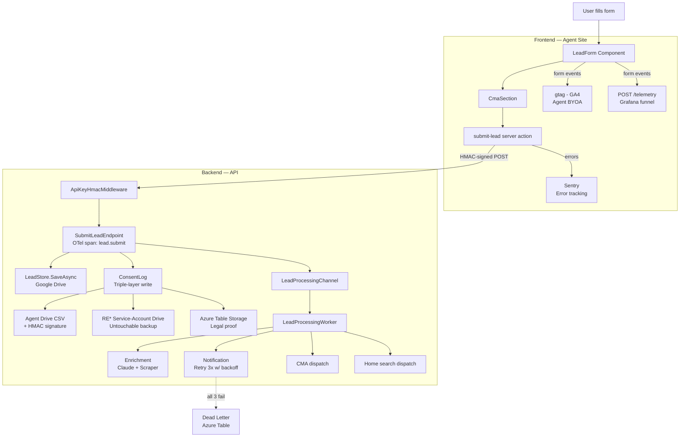
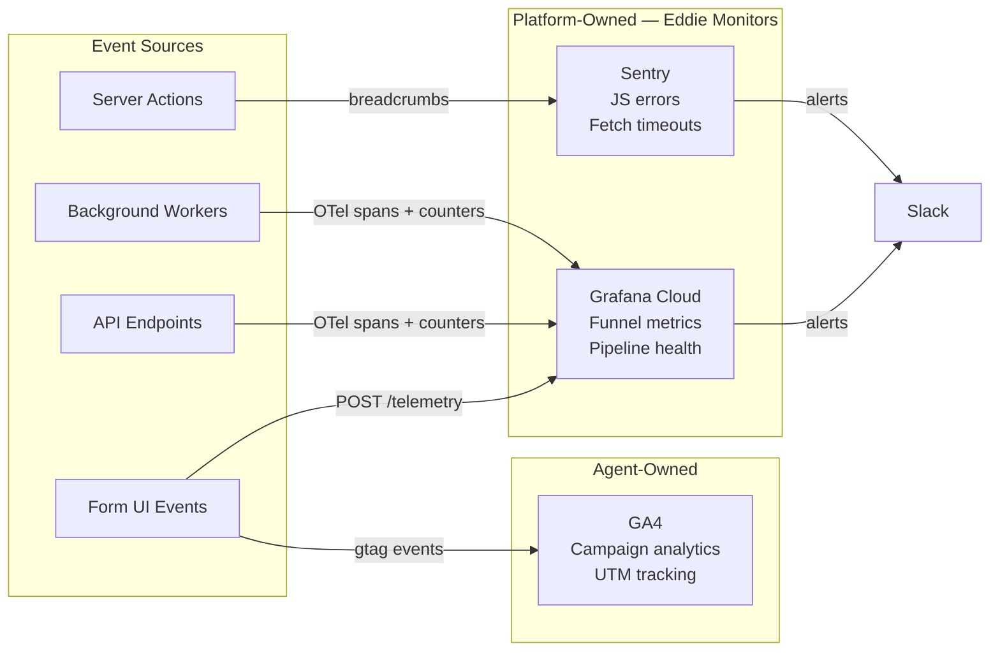
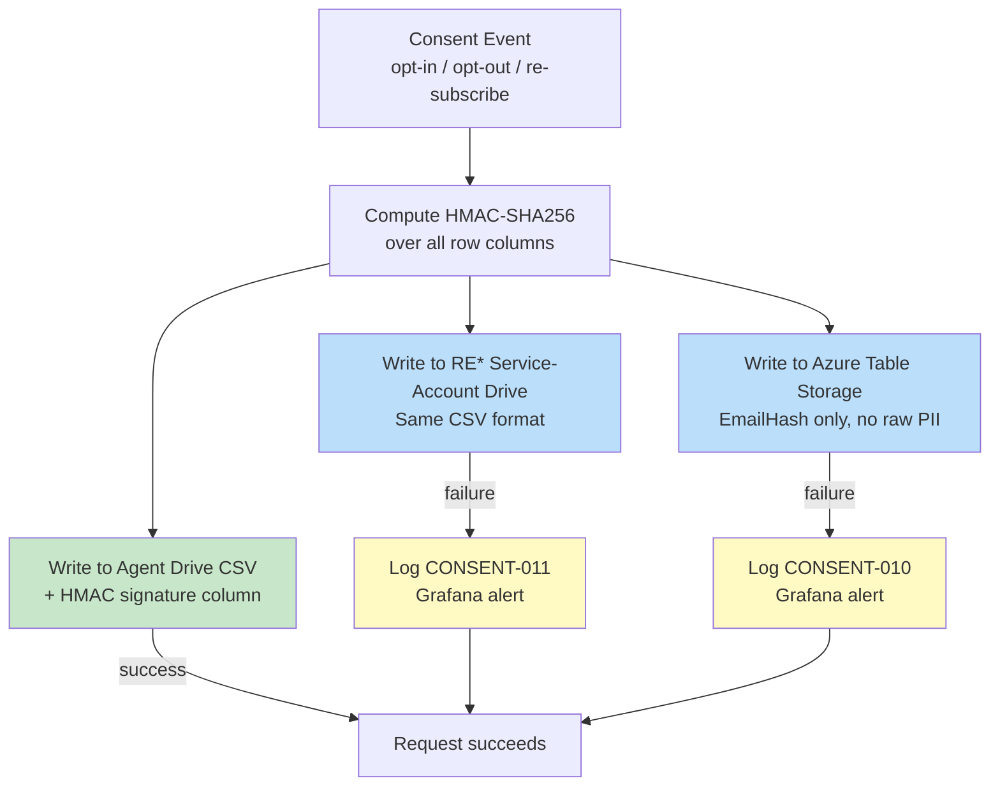
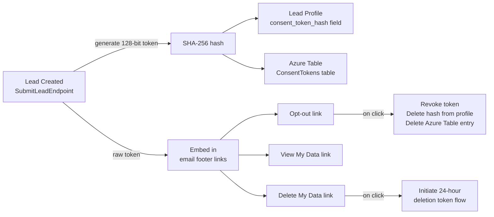
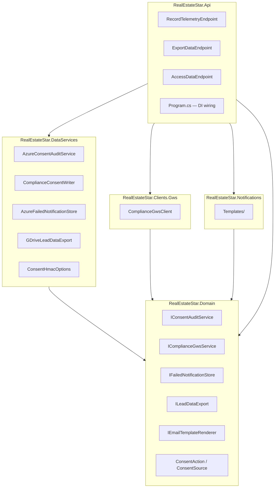
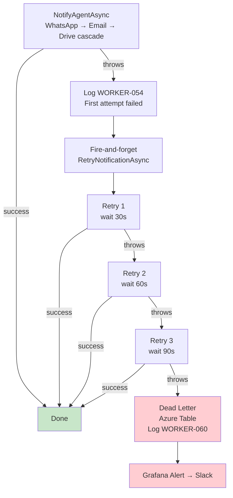
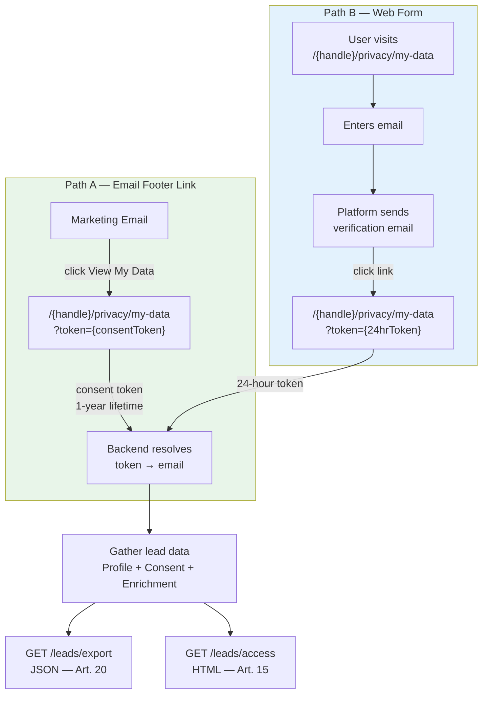

# Form Path Hardening — Design Spec

**Date:** 2026-03-21
**Author:** Claude + Eddie Rosado
**Status:** Draft
**Review:** [docs/superpowers/plans/2026-03-21-form-path-staff-review.md](../plans/2026-03-21-form-path-staff-review.md)

---

## Goal

Harden the lead form submission path — from the UI component through the API, background services, and storage — to be legally compliant, observable, resilient, and auditable before commercial launch.

## Architecture Overview

### End-to-End Form Submission Flow



### Observability Architecture



---

## 1. Consent Text & Legal Copy

### Problem

The TCPA consent text says "calls and text messages" and hardcodes `channels: ["calls", "texts"]`. The platform sends email marketing communications and the agent may call manually. The text doesn't match the product.

### Design

**New consent text:**
> "By submitting this form, you consent to receive email communications from {agentName} regarding your real estate inquiry, including market updates and property information. You also consent to be contacted by {agentName} by phone at the number provided. You may unsubscribe from emails at any time. Consent is not a condition of purchasing any property or service."

**Changes:**
- `channels` field → `["email", "calls"]`
- Thank-you redirect → pass `leadId` instead of `email` in query string. Thank-you page displays a generic confirmation without needing to look up PII.

**Files:**
- `packages/ui/LeadForm/LeadForm.tsx:14-18` — TCPA_CONSENT_TEXT
- `packages/ui/LeadForm/LeadForm.tsx:243` — channels array
- `apps/agent-site/components/sections/shared/CmaSection.tsx:54-55` — redirect URL

---

## 2. Consent Log Triple-Layer Integrity

### Problem

Marketing consent is stored as CSV rows in the agent's Google Drive. The agent has full access and could tamper with records. In a legal dispute, these records cannot be proven authentic.

### Design

Every consent event (opt-in, opt-out, re-subscribe) writes to three destinations:

| Layer | Owner | Purpose | Access |
|-------|-------|---------|--------|
| Agent Drive CSV | Agent | Transparency — agent sees all consent activity | Agent read/write (existing behavior) |
| RE* service-account Drive | Real Estate Star | Recoverability — untouchable backup | Service account only, agent has no access |
| Azure Table Storage | Real Estate Star | Legal proof — queryable, structured | RE* Azure credentials only |

### Consent Write Flow



### Agent Drive CSV (enhanced)

Add an HMAC-SHA256 signature column to each CSV row. The signature is computed over all other columns using a secret the agent doesn't have. If a row is edited, the signature won't match.

**Row format (existing columns + new):**
```
Timestamp,LeadId,Email,FirstName,LastName,OptedIn,ConsentText,Channels,IpAddress,UserAgent,Action,Source,HmacSignature
```

**Action and Source are enums** (defined in `RealEstateStar.Domain/Privacy/`):

```csharp
public enum ConsentAction { OptIn, OptOut, Resubscribe, DataAccessRequest, DataExportRequest }
public enum ConsentSource { LeadForm, PrivacyPage, EmailLink, Api }
```

Serialized as strings in CSV and Azure Table Storage (with `[JsonStringEnumConverter]`).

**Domain model change:** `MarketingConsent.Action` changes from `string?` to `ConsentAction` and `MarketingConsent.Source` changes from `string?` to `ConsentSource`. This is a breaking change that ripples through `SubmitLeadEndpoint`, `OptOutEndpoint`, `SubscribeEndpoint`, `MarketingConsentLog`, and all their tests. All callers currently pass raw strings — they must be updated to use enum values.

### Service-Account Drive Folder

- Path: `Real Estate Star/compliance/{agentId}/consent-log.csv`
- Owned by the RE* Google service account
- Same CSV format as agent copy (including HMAC signature)
- Agent has zero access — not shared, not visible
- Written via the same `IGwsService` using service account credentials

### Azure Table Storage

New `IConsentAuditService` following the `IWhatsAppAuditService` pattern.

**Entity: `ConsentAuditEntry`**
- PartitionKey: `{agentId}`
- RowKey: `{Guid.NewGuid()}` (unique event ID per consent event — a single lead may have multiple events: opt-in, opt-out, re-subscribe)
- Fields: Timestamp, LeadId, EmailHash (SHA-256, full hash for legal lookup — raw email stays in Drive lead profile only), OptedIn, ConsentText, Channels, Action, Source, HmacSignature
- **No PII in Azure Table**: FirstName, LastName, IpAddress, UserAgent are stored in the Drive CSV only. Azure Table stores the legal proof chain (hash + signature) for tamper detection, not the full PII record.

### Write Pattern

All three writes happen in:
- `SubmitLeadEndpoint` (on lead submission)
- `OptOutEndpoint` (on opt-out)
- `SubscribeEndpoint` (on re-subscribe)

**Failure handling:** If Azure Table or service-account Drive fails, the request still succeeds (agent Drive is the primary). A `[CONSENT-010]` warning is logged (for Azure Table failure) or `[CONSENT-011]` (for service-account Drive failure) and a Grafana alert fires. Note: `[CONSENT-001]` is already used for successful consent recording in `MarketingConsentLog.cs`.

### HMAC Secret for Consent Rows

The consent HMAC uses a dedicated secret, separate from the API HMAC auth secret. This prevents an API key compromise from also compromising consent integrity.

- **Config key:** `ConsentHmac:Secret` in appsettings (production: Azure Key Vault reference)
- **Injected via:** `IOptions<ConsentHmacOptions>` (bound in `Program.cs`)
- **`ConsentHmacOptions`** model: `{ string Secret }` — defined in `RealEstateStar.DataServices/Privacy/` (co-located with the HMAC signing logic that consumes it; options classes are configuration, not domain models)
- **Startup validation:** Non-empty check in `Program.cs` for non-Development environments (same pattern as existing `Hmac:HmacSecret` validation)

### Service-Account Drive Credentials

The RE* compliance folder is written using a Google service account that the agent has no access to. Credential switching uses named `IGwsService` registrations:

- **Agent GWS:** `IGwsService` (default registration) — uses agent's OAuth credentials for their Drive
- **Compliance GWS:** New `IComplianceGwsService : IGwsService` marker interface in `RealEstateStar.Domain/Privacy/Interfaces/`. This avoids keyed DI complexity — `ComplianceFileStorage` takes `IComplianceGwsService` in its constructor, and DI resolves it to a GWS client backed by the service account credentials.
- **DI wiring in `Program.cs`:**
  ```csharp
  services.AddSingleton<IComplianceGwsService>(sp =>
      new ComplianceGwsClient(complianceServiceAccountCredentials));
  ```
- **Service account credentials:** Stored as `Compliance:GoogleServiceAccountKey` in appsettings (production: Azure Key Vault reference)
- **Startup validation:** Non-empty check in `Program.cs` for non-Development environments

### Consent Token (Email Footer Links)



Email footer links (opt-out, view data) embed a **consent token** — a long-lived token separate from the 24-hour deletion token.

- **Lifetime:** 1 year (consent relationships are long-lived; tokens can be revoked on opt-out)
- **Generation:** Created in `SubmitLeadEndpoint` alongside lead creation. 128-bit random, Base64url-encoded.
- **Storage:** SHA-256 hash stored in lead profile frontmatter (`consent_token_hash` field) and in Azure Table consent audit entry
- **Revocation:** On opt-out, the consent token hash is deleted from the lead profile. Old links stop working. On data deletion, the consent token is implicitly revoked — the lead profile (containing the token hash) is deleted. Azure Table audit entries retain `LeadId` and `HmacSignature` for legal provenance but the `consent_token_hash` field is cleared.
- **Scope:** Grants access to opt-out, re-subscribe, and view-my-data pages only. Does NOT grant deletion (deletion has its own 24-hour token flow).
- **One token per lead:** If the lead re-subscribes, a new consent token is generated and the old one is invalidated.
- **Lookup mechanism:** Token → lead is resolved via Azure Table Storage. On lead creation, the consent token hash is stored as an entity in a `ConsentTokens` table (PartitionKey: `{agentId}`, RowKey: `{tokenHash}`, Fields: `leadId`, `email`). Lookup is O(1) per request — no linear scan of lead profiles. On revocation, the Azure Table entry is deleted.
- **Frontmatter update:** Add `consent_token_hash` field to lead profile YAML frontmatter via `LeadMarkdownRenderer`. `YamlFrontmatterParser` reads it back for consistency checks.

### Architecture Placement



Following the single-Domain-dependency rule and the established `AzureWhatsAppAuditService` pattern (Azure Table clients live in `DataServices`, not `Clients.Azure`):

- `IConsentAuditService` interface → `RealEstateStar.Domain/Privacy/Interfaces/`
- `AzureConsentAuditService` implementation → `RealEstateStar.DataServices/Privacy/` (same project as `AzureWhatsAppAuditService`)
- `ConsentHmacOptions` model → `RealEstateStar.DataServices/Privacy/`
- HMAC signing logic → `RealEstateStar.DataServices/Privacy/MarketingConsentLog.cs` (extends existing)
- `IComplianceGwsService` marker interface → `RealEstateStar.Domain/Privacy/Interfaces/`
- `ComplianceGwsClient` implementation → `RealEstateStar.Clients.Gws/` (reuses `GwsCliRunner` internals but instantiated with service account email via `--user` flag in `Program.cs`)
- `ComplianceConsentWriter` (orchestrates writing to service-account Drive) → `RealEstateStar.DataServices/Privacy/`
- DI wiring → `RealEstateStar.Api/Program.cs`

---

## 3. Frontend Observability

### Problem

The frontend has zero observability. No error tracking, no form funnel metrics, no fetch timeout detection. If submissions fail, Eddie has no visibility.

### Design: Three Tools, Three Audiences

| Tool | Audience | Purpose |
|------|----------|---------|
| **Grafana** | Eddie (ops) | Platform-wide funnel metrics, error rates, pipeline health, alerting. Eddie monitors and tweaks. |
| **GA4** | Agent (BYOA) | Agent's own funnel analytics, UTM campaign tracking, ad ROAS. Platform supports but does not monitor. |
| **Sentry** | Eddie (ops) | Frontend JS errors, failed server actions, fetch timeouts. Debugging breadcrumbs. |

### Sentry Integration

- Add `@sentry/nextjs` to agent-site
- DSN stored in Cloudflare Worker secrets (`SENTRY_DSN`)
- Captures: unhandled JS errors, failed server actions, network failures
- Alerts Eddie via Sentry Slack integration when error rate spikes

### Fetch Timeout Logging

- Add `AbortController` with 15-second timeout to `signAndForward()` and `validateTurnstile()`
- When timeout fires:
  - `signAndForward`: log `[FETCH-001] API request timeout after 15s` to Sentry as warning
  - `validateTurnstile`: log `[FETCH-002] Turnstile timeout after 15s` to Sentry as warning
- User sees: "Request timed out. Please try again." instead of hanging forever

**Files:**
- `apps/agent-site/lib/hmac.ts` — add AbortController
- `apps/agent-site/lib/turnstile.ts` — add AbortController

### Grafana Funnel Metrics (Platform-Owned)

**New API endpoint:** `POST /telemetry`

A lightweight fire-and-forget endpoint that accepts form events and increments OTel counters. No HMAC auth required (events are anonymous counters, no PII). Protected by:
- **Rate limiting:** 100 requests/minute per IP (prevents counter inflation)
- **Validation:** `event` must be one of the 5 known enum values; `agentId` must match an existing agent
- **No PII:** Payload contains only `event` (string enum) and `agentId` (string). No email, name, or IP logged.

**Events:**
- `form.viewed` — CMA section enters viewport
- `form.started` — first field interaction
- `form.submitted` — submit button clicked
- `form.succeeded` — API returns 202
- `form.failed` — API returns error

**OTel counters** (added to `LeadDiagnostics`):
- `form.viewed` (tagged: agentId)
- `form.started` (tagged: agentId)
- `form.submitted` (tagged: agentId)
- `form.succeeded` (tagged: agentId)
- `form.failed` (tagged: agentId, error_type)

**Grafana dashboards:**
- Funnel: viewed → started → submitted → succeeded (conversion rates)
- Error rate: failed / submitted over time
- Per-agent breakdown

**Grafana alerts:**
- `form.failed` count > 3 in 5 minutes → Slack
- `form.succeeded` drops to 0 for 10 minutes during business hours → Slack

**Frontend implementation:** The agent-site fires `fetch('/telemetry', { method: 'POST', body: JSON.stringify({ event, agentId }), keepalive: true })` at each stage. `keepalive: true` ensures the request completes even if the page navigates away.

**Architecture placement (REPR):**
- `RealEstateStar.Api/Features/Telemetry/Record/RecordTelemetryEndpoint.cs`
- `RealEstateStar.Api/Features/Telemetry/Record/RecordTelemetryRequest.cs` (event enum + agentId)
- Tests: `RealEstateStar.Api.Tests/Features/Telemetry/Record/RecordTelemetryEndpointTests.cs`

### GA4 Integration (Agent-Owned, BYOA)

- New config field: `account.json` → `integrations.ga4MeasurementId`
- Load `gtag.js` conditionally — only when `ga4MeasurementId` is present
- Fire same custom events as Grafana: `form_view`, `form_start`, `form_submit`, `form_success`, `form_error`
- UTM parameters auto-tracked by GA4 (no code needed)
- Cookie consent banner shown only when GA4 is configured (no GA4 = no cookies = no banner needed). Custom lightweight component (< 2 KB, no library) — the agent-site has a 3 MiB Cloudflare Worker size limit.

**Files:**
- `config/agent.schema.json` — add `integrations.ga4MeasurementId`
- `apps/agent-site/components/GA4Script.tsx` — conditional gtag loader
- `apps/agent-site/components/CookieConsent.tsx` — consent banner (only when GA4 enabled)

---

## 4. Backend Observability & Resilience

### OTel Span on SubmitLeadEndpoint

Add an `Activity` span in `SubmitLeadEndpoint.Handle()`:
- Span name: `lead.submit`
- Tags: `lead.id`, `lead.agent_id`, `lead.type`, `correlation.id`
- Connects the HTTP request to the downstream `LeadProcessingWorker` span via correlation ID
- Result: end-to-end trace in Grafana from API receive → save → enqueue → enrich → notify

**File:** `apps/api/RealEstateStar.Api/Features/Leads/Submit/SubmitLeadEndpoint.cs`

### Consent Audit Metrics

New counters in `LeadDiagnostics`:
- `consent.recorded` — incremented on every successful consent write
- `consent.audit_write_failed` — incremented when Azure Table or service-account Drive write fails

**Grafana alert:** `consent.audit_write_failed` > 0 → Slack. Agent copy succeeded but tamper-proof copies didn't.

### Notification Retry with Backoff

**Current behavior:** `LeadProcessingWorker` catches notification failure, logs it, continues. Notification lost.

**New behavior — inline retry with `Task.Delay` (no re-enqueue):**

Retries run as a fire-and-forget background task, **not blocking the main worker loop**. The `LeadProcessingWorker` is a single `BackgroundService` instance — blocking it for 12+ minutes would starve all queued leads.



**Note on current code:** The existing `ILeadNotifier.NotifyAgentAsync()` returns `Task` (void) and throws on failure. `CascadingAgentNotifier` provides the cascade logic but has no result type. The retry design wraps the existing void-returning call in try/catch — exception presence = failure.

```
// In LeadProcessingWorker.ProcessLeadAsync():
try
{
    await leadNotifier.NotifyAgentAsync(agentId, lead, enrichment, score, ct);
}
catch (Exception ex)
{
    log "[WORKER-054] First notification attempt failed: {ex.Message}"
    // Fire-and-forget retry task — does NOT block the channel reader loop
    _ = RetryNotificationAsync(agentId, lead, enrichment, score, ex, ct);
}

// Separate method (not awaited in the main loop):
async Task RetryNotificationAsync(agentId, lead, enrichment, score, lastException, ct):
  try
  {
    for attempt in [1, 2, 3]:
      delay = [30s, 60s, 90s][attempt - 1]
      log "[WORKER-055] Notification retry {attempt}/3, waiting {delay}"
      await Task.Delay(delay, ct)
      try
      {
        await leadNotifier.NotifyAgentAsync(agentId, lead, enrichment, score, ct)
        return  // success
      }
      catch (Exception ex) { lastException = ex }

    // All 3 retries failed — dead letter
    log "[WORKER-056] All retries exhausted, writing to dead letter"
    await failedNotificationStore.RecordAsync(agentId, lead.Id, lastException.Message, ct)
    log "[WORKER-060] Notification permanently failed after 3 retries"
    increment leads.notification_permanently_failed counter
  }
  catch (Exception ex)
  {
    // Prevent unobserved task exception
    log "[WORKER-061] Retry task itself failed: {ex.Message}"
  }
```

- **Fire-and-forget**: The main worker loop continues processing other leads immediately
- **Reduced delays**: 30s, 60s, 90s (total ~3 minutes, not 12+ minutes)
- Uses `CancellationToken` so delays are cancelled on shutdown — no orphan waits
- Each retry attempt goes through the full cascade (WhatsApp → Email → Drive fallback)
- Outer try/catch wraps the entire retry task to prevent unobserved task exceptions
- Uses existing `ILeadNotifier.NotifyAgentAsync` signature (void-returning, throws on failure)

**After 3 retries exhausted:**
- Write to `FailedNotifications` Azure Table (agentId, leadId, timestamp, lastError, retryCount)
- Log `[WORKER-060] Notification permanently failed after 3 retries`
- Increment `leads.notification_permanently_failed` counter

**Grafana alert:** `leads.notification_permanently_failed` > 0 → Slack.

**Architecture placement:**

> **Note:** The current live `LeadProcessingWorker` and `ILeadNotifier` are in `RealEstateStar.Api/Features/Leads/Services/`. The separate `RealEstateStar.Workers.Leads` project exists but the migration is tracked in a separate API restructure spec. New types in this spec should follow the **target architecture** (multi-project) since they will be implemented alongside or after the restructure.

- Retry logic inline in `LeadProcessingWorker` (currently `Api/Features/Leads/Services/`, target `Workers.Leads/`)
- `IFailedNotificationStore` interface → `RealEstateStar.Domain/Leads/Interfaces/`
- `AzureFailedNotificationStore` implementation → `RealEstateStar.DataServices/Leads/` (same pattern as `AzureWhatsAppAuditService` — Azure Table clients live in DataServices)

---

## 5. ADA Compliance Fixes

Targeted CSS and attribute changes in `packages/ui/LeadForm/LeadForm.tsx`:

| Issue | Current | Fix | WCAG |
|-------|---------|-----|------|
| Required asterisk | `color: "red"` | `color: "#d32f2f"` (5.6:1 on white) | AA on colored backgrounds |
| Error messages | `color: "red"` | `color: "#d32f2f"` | AA+ |
| Disclaimer/label text | `#767676` | `#595959` (7:1 on white) | AAA |
| Submit button | Gold `#C8A951` + white text (~4.2:1) | Darken to `#A68A3E` (5.1:1) or dark text on gold | AA |
| ReadOnly state field | Missing attribute | Add `aria-readonly="true"` | Screen reader compliance |
| Google Maps failure | Silent error swallow | Show "Enter your address manually" when autocomplete fails | Graceful degradation |

No structural refactoring — surgical fixes only.

---

## 6. Data Portability & Subject Access

### Problem

GDPR Art. 15 (right of access) and Art. 20 (data portability) require that users can view and download their personal data. No such endpoints exist.

### Design

Two new endpoints with **two access paths** depending on how the user arrives:

**Path A — Email footer link (consent token):** User clicks "View My Data" in a marketing email. The consent token (1-year lifetime, generated at lead creation) is in the URL. Backend resolves token → email → data. No re-verification needed.

**Path B — Web form (fresh 24-hour token):** User visits `/{handle}/privacy/my-data`, enters their email. Platform sends a verification email with a 24-hour token (same flow as deletion requests). User clicks link → data is displayed.



Both paths resolve to the same endpoints:

| Endpoint | GDPR Article | Output |
|----------|-------------|--------|
| `GET /agents/{agentId}/leads/export?token={token}` | Art. 20 (Portability) | JSON — all lead data: profile, consent history, enrichment, communications |
| `GET /agents/{agentId}/leads/access?token={token}` | Art. 15 (Access) | Human-readable HTML — "Here's everything we have on you" |

**Shared logic:** Both endpoints use the same data gathering — read lead profile from Drive, consent history from Azure Table, enrichment data, communication records. Only the serialization differs (JSON vs HTML). The token encodes the email (via hash lookup), so no email in the URL.

**Token flow:**
1. User visits `/{handle}/privacy/my-data` and enters their email
2. Platform sends a verification email with a token link (24-hour expiry, same pattern as deletion tokens)
3. User clicks link → lands on `/{handle}/privacy/my-data?token={token}`
4. Backend resolves token → email → gathers data → returns response
5. No email appears in URLs, browser history, CDN logs, or Referer headers

**New privacy page:** `/{handle}/privacy/my-data` — form to enter email and request data access.

### Architecture Placement

- `ILeadDataExport` interface → `RealEstateStar.Domain/Privacy/Interfaces/`
- `GDriveLeadDataExport` implementation → `RealEstateStar.DataServices/Privacy/`
- `ExportDataEndpoint` → `RealEstateStar.Api/Features/Leads/ExportData/ExportDataEndpoint.cs`
- `AccessDataEndpoint` → `RealEstateStar.Api/Features/Leads/AccessData/AccessDataEndpoint.cs`
- Privacy page → `apps/agent-site/app/[handle]/privacy/my-data/page.tsx`

---

## 7. Email Template Privacy Footer

### Problem

Every marketing email must include links to exercise privacy rights. Currently `NoopEmailNotifier` drops all emails — but the template needs to be ready.

### Design

All marketing emails include a footer with:

```
────────────────────────────────────────
You received this email because you submitted an inquiry to {agentName}.

Unsubscribe | View My Data | Delete My Data

{agentName} | {brokerage} | {officeAddress}
```

**Links (token-only, no email in URLs):**
- **Unsubscribe** → `https://{handle}.real-estate-star.com/{handle}/privacy/opt-out?token={consentToken}`
- **View My Data** → `https://{handle}.real-estate-star.com/{handle}/privacy/my-data?token={consentToken}`
- **Delete My Data** → `https://{handle}.real-estate-star.com/{handle}/privacy/delete?token={consentToken}`

The consent token (1-year lifetime) is generated at lead creation and embedded in all marketing emails. Backend resolves token → email for each action. Deletion still requires its own 24-hour verification token (initiated from the delete page).

**URL pattern note:** The agent site uses Next.js dynamic routes with `[handle]` as a path segment (e.g., `app/[handle]/privacy/opt-out/page.tsx`). The subdomain (`{handle}.real-estate-star.com`) is the CDN entry point; the `/{handle}/` path segment is the Next.js route parameter. Both are present — this is the existing pattern used by all privacy pages.

**Token generation:** When a lead is created, generate a long-lived consent token (separate from the 24-hour deletion token). Store the hash. Embed the raw token in email links so the user can act in one click for opt-out and data access.

### Architecture Placement

- Email template → `RealEstateStar.Notifications/Templates/` (new directory)
- `IEmailTemplateRenderer` interface → `RealEstateStar.Domain/Notifications/Interfaces/` (see Section 7 for full placement)
- Token generation on lead creation → `SubmitLeadEndpoint` (generate and store consent token alongside lead)

---

## Scope Summary

### In Scope (v1)

1. Consent text rewrite (email + calls)
2. Remove email from redirect URL
3. Triple-layer consent log (HMAC + service-account Drive + Azure Table)
4. Sentry integration (error tracking)
5. Fetch timeouts with Sentry warnings
6. Grafana funnel metrics via `/telemetry` endpoint
7. GA4 BYOA integration with cookie consent banner
8. OTel span on SubmitLeadEndpoint
9. Consent audit counters + Grafana alerts
10. Notification retry with backoff (3x, then dead letter)
11. ADA color contrast + accessibility fixes
12. Data portability endpoints (export JSON + access HTML)
13. `/{handle}/privacy/my-data` page
14. Email template with privacy footer links

### Out of Scope (v2+)

- Replace `NoopEmailNotifier` with real email sending (Gmail integration)
- Session replay (Sentry or LogRocket)
- A/B testing on form variants
- Admin dashboard for failed notification review
- Consent log hash chain (append-only Merkle tree)
- Rate limiting by email (prevent same prospect spammed from multiple IPs)

### Review Items Disposition

Items from the [staff review](../plans/2026-03-21-form-path-staff-review.md) not addressed above:

| Review ID | Item | Disposition |
|-----------|------|-------------|
| M2 | No privacy/terms links in consent area | Not needed — privacy links are already in the page footer at `/{handle}/privacy/*`. Adding them redundantly in the consent text area adds clutter. The email footer (Section 7) provides direct-action links. |
| H4 | Dead letter queue for failed pipeline steps | Partially addressed — notification DLQ via Azure Table. Enrichment/CMA/HomeSearch failures are logged but not DLQ'd. Full DLQ deferred to v2. |
| M3 | Google Maps autocomplete silent failure | Addressed in ADA section (Section 5). |
| M4 | ScraperAPI/Turnstile health checks config-only | Deferred to v2 — low risk, Polly circuit breakers already protect runtime. |
| M5 | No WhatsApp/email health checks | Deferred to v2 — WhatsApp has Azure Table audit trail for monitoring. |
| M6 | No alerting infrastructure | Partially addressed — Grafana alerts for form funnel + consent + notification failures. Full PagerDuty/on-call deferred to v2. |

---

## Dependencies

| Dependency | Status | Notes |
|------------|--------|-------|
| Azure Table Storage | Deployed | Already used for WhatsApp audit |
| Grafana Cloud | Deployed | Already receiving backend OTel |
| Sentry | Not configured | Need account + DSN |
| GA4 | Per-agent | Agent brings their own measurement ID |
| Google service account | Exists | Need to verify Drive folder creation permissions |
| Cloudflare Worker secrets | Partially configured | Need: SENTRY_DSN |

---

## Testing Strategy

- **Consent triple-write:** Unit test each layer independently. Integration test verifies all three are written on a single consent event. Test failure isolation (Azure down → agent Drive still succeeds, warning logged).
- **HMAC signatures:** Roundtrip test — write row, compute signature, tamper with row, verify signature mismatch detected. Test verifies the signature column is present in the row passed to `IFileStorageProvider.AppendRowAsync`, not just that the HMAC computation is correct in isolation.
- **Fetch timeouts:** Mock slow responses, verify AbortController fires, verify Sentry warning logged.
- **Notification retry:** Unit test retry count increment, backoff calculation, dead letter write after 3 failures. Fire-and-forget task exception handling.
- **Dead letter store (`AzureFailedNotificationStore`):** Verify `RecordAsync` writes to Azure Table with agentId, leadId, timestamp, error, retryCount. Test in `RealEstateStar.DataServices.Tests`.
- **Data portability:** Roundtrip test — submit lead, request export, verify JSON contains all submitted fields.
- **ADA:** Automated contrast ratio checks in test suite. aria-readonly assertion.
- **GA4:** Verify gtag events fire only when measurement ID configured. Verify no script loaded without config.
- **Telemetry endpoint:** Verify OTel counters increment. Verify no PII in event payload. Verify invalid event names rejected. Verify rate limiting.
- **Consent token:** Token generation, hash storage, lookup by hash, revocation on opt-out, expired token rejection, scope limitation (no deletion access).
- **Data portability:** Token-only URL (no email in query string). Export contains all fields. Access renders HTML. Unknown token returns 404 (no enumeration).
