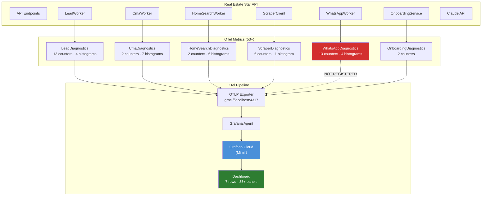
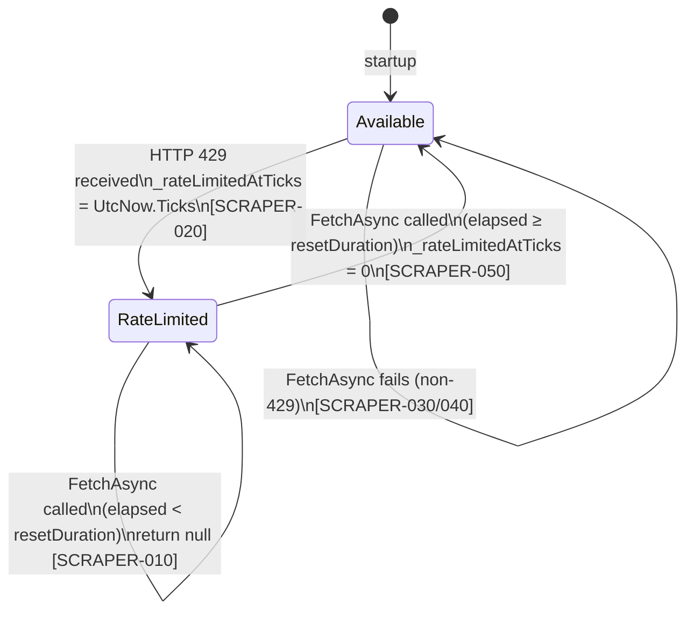
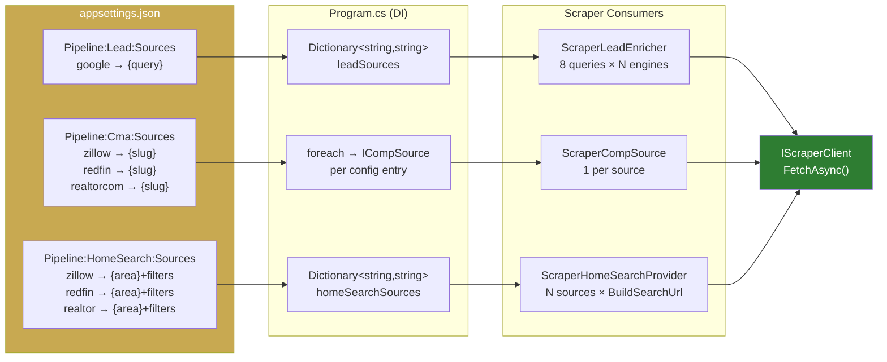
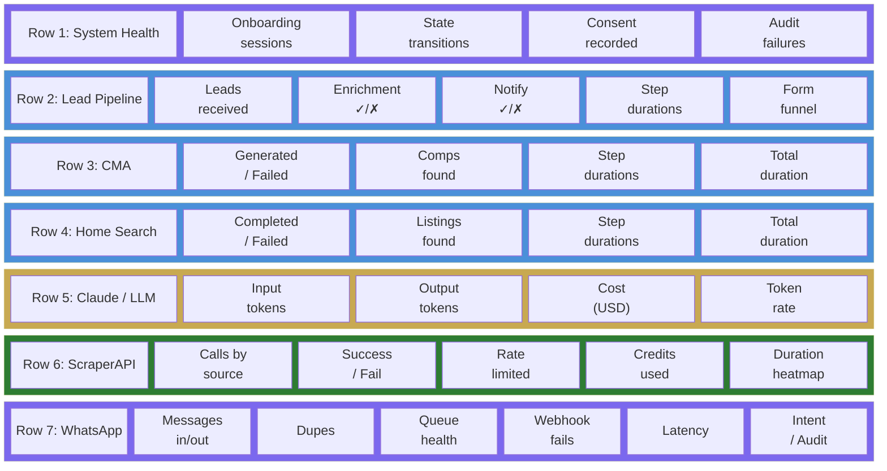

# API Observability Dashboard + Scraper Improvements — Design Spec

**Author:** Eddie Rosado
**Date:** 2026-03-23
**Status:** Draft

---

## Problem Statement

Three gaps remain after the pipeline context merge (PR #39):

1. **No visibility into system health** — 53 OTel metrics exist across 5 subsystems (Lead, CMA, HomeSearch, Scraper, WhatsApp) plus Onboarding, but there's no Grafana dashboard to visualize them. Claude API token usage and cost have no visibility at all.

2. **Circuit breaker has no reset** — `ScraperClient._available` is set to `false` on HTTP 429 and never flipped back. A single rate limit event permanently disables scraping until container restart.

3. **Source URLs are hardcoded** — `appsettings.json` has per-pipeline `Sources` config (`Pipeline:Lead:Sources`, `Pipeline:Cma:Sources`, `Pipeline:HomeSearch:Sources`) but scraper consumers still hardcode Zillow/Redfin/Realtor/Google URLs. Swapping a source requires a code change and redeploy.

Additionally, `WhatsAppDiagnostics` is defined but not registered in `OpenTelemetryExtensions.cs`, so its 13 counters and 4 histograms are silently dropped.

---

## Goals

- **Full-system Grafana dashboard** covering all 53+ metrics, importable via JSON
- **WhatsApp metrics flow to Grafana** by registering the missing diagnostics
- **Circuit breaker auto-resets** after a configurable cooldown (default 10 min)
- **Source URLs read from config** — add/remove/swap a scraper source by editing `appsettings.json`

---

## Architecture Overview



**Key issue:** WhatsAppDiagnostics (red) is defined but never registered — its metrics are silently dropped. This spec fixes that.

---

## Component Design

### 1. Circuit Breaker Reset



**Current behavior:**
```
FetchAsync → 429 → _available = false → all future calls return null forever
```

**New behavior:**
```
FetchAsync entry:
  rateLimitedAt = Interlocked.Read(_rateLimitedAtTicks)
  if rateLimitedAt != 0 AND (UtcNow.Ticks - rateLimitedAt) > resetTicks
    → Interlocked.Exchange(_rateLimitedAtTicks, 0), log [SCRAPER-050]
  if rateLimitedAt != 0 → return null, log [SCRAPER-010]
  ... normal fetch ...
  on 429 → Interlocked.Exchange(_rateLimitedAtTicks, UtcNow.Ticks), log [SCRAPER-020]
```

**Thread-safety:** Collapse the two-field pattern (`_available` bool + `_rateLimitedAt` DateTime) into a single `long _rateLimitedAtTicks` using `Interlocked.Read` / `Interlocked.Exchange`. Value of `0` means available; non-zero means rate-limited at that tick. This eliminates the TOCTOU race between reading the bool and reading the timestamp. The `IsAvailable` property derives from `_rateLimitedAtTicks == 0` (or checks for reset expiry).

```csharp
private long _rateLimitedAtTicks; // 0 = available, >0 = rate-limited at UTC ticks

public bool IsAvailable
{
    get
    {
        var ticks = Interlocked.Read(ref _rateLimitedAtTicks);
        if (ticks == 0) return true;
        // Check if reset duration has passed
        var resetTicks = TimeSpan.FromSeconds(options.Value.CircuitBreakerResetSeconds).Ticks;
        return (DateTime.UtcNow.Ticks - ticks) > resetTicks;
    }
}
```

**Changes to `ScraperClient.cs`:**
- Replace `private volatile bool _available` with `private long _rateLimitedAtTicks`
- Derive `IsAvailable` from ticks + reset duration check
- In `FetchAsync`, use `Interlocked` for all reads/writes
- Log `[SCRAPER-050] Circuit breaker reset after {seconds}s. Scraper re-enabled.`

**Changes to `ScraperOptions.cs`:**
- Add `public int CircuitBreakerResetSeconds { get; init; } = 600;` (10 minutes)

**Changes to `appsettings.json`:**
- Add `"CircuitBreakerResetSeconds": 600` to the existing `Scraper` section (alongside `BaseUrl`, `RenderJavaScript`, etc.)

**Tests required:**
- Concurrent 429 triggering (two threads hit 429 simultaneously)
- Reset at boundary (verify reset fires after exactly the configured duration)
- `IsAvailable` returns consistent value during a reset
- Reset re-enables fetching (after reset, next call makes an HTTP request)

### 2. Configurable Source URLs



Each scraper consumer reads its source URL templates from config instead of hardcoding them.

#### ScraperLeadEnricher

**Current:** Hardcodes `https://www.google.com/search?q={query}` inline. Uses this single search engine URL as the base for 8 different query variants (linkedin, facebook, twitter, local_news, property_records, business_registrations, professional_licenses, court_records).

**New:** Reads `Pipeline:Lead:Sources` from config. Each configured source URL is used as the base for **all 8 query variants**. If a second search engine is added (e.g., `bing`), the enricher fires all 8 queries against that engine too.

```csharp
// Constructor change:
ScraperLeadEnricher(IHttpClientFactory, string claudeApiKey, IScraperClient,
    Dictionary<string, string> sourceUrls, ILogger)

// Usage — each source URL template gets all 8 query variants:
foreach (var (engineName, urlTemplate) in sourceUrls)
{
    foreach (var (queryName, query) in queries)
    {
        var url = urlTemplate.Replace("{query}", Uri.EscapeDataString(query));
        // FetchAsync(url, $"{engineName}-{queryName}", "enrichment", ct)
    }
}
```

The `{query}` placeholder is the only one used for lead enrichment sources. The 8 query strings (linkedin site search, facebook site search, etc.) are built internally — they are query content, not URL configuration.

**Config:**
```json
"Pipeline": {
  "Lead": {
    "Sources": {
      "google": "https://www.google.com/search?q={query}"
    }
  }
}
```

**DI registration in Program.cs:**
```csharp
var leadSources = builder.Configuration.GetSection("Pipeline:Lead:Sources")
    .Get<Dictionary<string, string>>() ?? new();

builder.Services.AddSingleton<ILeadEnricher>(sp =>
    new ScraperLeadEnricher(factory, anthropicKey, scraperClient, leadSources, logger));
```

#### ScraperCompSource

**Current:** Takes `baseUrlPattern` as constructor string, hardcoded in Program.cs per source (3 registrations for Zillow, Redfin, RealtorCom).

**New:** Read patterns from `Pipeline:Cma:Sources` config. Register one `ICompSource` per configured source dynamically. Use `Enum.TryParse` with skip-and-warn for unknown sources (never throw at startup per project convention).

```csharp
// Program.cs — dynamic registration from config:
var cmaSources = builder.Configuration.GetSection("Pipeline:Cma:Sources")
    .Get<Dictionary<string, string>>() ?? new();

foreach (var (sourceName, urlPattern) in cmaSources)
{
    if (!Enum.TryParse<CompSource>(sourceName, ignoreCase: true, out var source))
    {
        logger.LogWarning("[STARTUP-060] Unknown comp source '{SourceName}' in config, skipping", sourceName);
        continue;
    }
    builder.Services.AddSingleton<ICompSource>(sp =>
        new ScraperCompSource(factory, scraperClient, anthropicKey, source, urlPattern, logger));
}
```

**No changes to `ScraperCompSource.cs` class** — it already accepts `baseUrlPattern` via constructor and uses `{slug}` placeholder. The config values already use `{slug}`.

**Note:** The `CompSource` enum must have members matching the config keys. Current values: `Zillow`, `Redfin`, `RealtorCom`. The config key `"realtor"` maps to `RealtorCom` — this needs either a rename in config to `"realtorcom"` or an alias in the parse logic. Simplest: change the appsettings key from `"realtor"` to `"realtorcom"`.

#### ScraperHomeSearchProvider

**Current:** Three hardcoded methods: `BuildZillowUrl()`, `BuildRedfinUrl()`, `BuildMlsUrl()`. Each uses different query parameter names for filters (Zillow: `price-min`, Redfin: `min_price`, Realtor: `price-min`).

**New:** Takes `Dictionary<string, string> sourceUrls` in constructor. URL templates include the full URL with filter placeholders embedded, preserving per-source query parameter naming.

**Config (full templates with per-source filter params):**
```json
"Pipeline": {
  "HomeSearch": {
    "Sources": {
      "zillow": "https://www.zillow.com/homes/{area}_rb/?price-min={minPrice}&price-max={maxPrice}&beds-min={minBeds}&baths-min={minBaths}",
      "redfin": "https://www.redfin.com/city/{area}?min_price={minPrice}&max_price={maxPrice}&num_beds={minBeds}&num_baths={minBaths}",
      "realtor": "https://www.realtor.com/realestateandhomes-search/{area}?price-min={minPrice}&price-max={maxPrice}&beds-min={minBeds}&baths-min={minBaths}"
    }
  }
}
```

The per-source parameter names (`price-min` vs `min_price`) are encoded in the template string itself. The generic `BuildSearchUrl` method substitutes all placeholders, then removes any query params where the value was empty (filter not set):

```csharp
internal static string BuildSearchUrl(string template, HomeSearchCriteria criteria)
{
    var url = template
        .Replace("{area}", Uri.EscapeDataString(criteria.Area))
        .Replace("{minPrice}", criteria.MinPrice?.ToString() ?? "")
        .Replace("{maxPrice}", criteria.MaxPrice?.ToString() ?? "")
        .Replace("{minBeds}", criteria.MinBeds?.ToString() ?? "")
        .Replace("{minBaths}", criteria.MinBaths?.ToString() ?? "");

    // Remove query params with empty values (unused filters)
    // e.g., "price-min=&price-max=500000" → "price-max=500000"
    var uri = new UriBuilder(url);
    var queryParams = System.Web.HttpUtility.ParseQueryString(uri.Query);
    var cleanParams = queryParams.AllKeys
        .Where(k => !string.IsNullOrEmpty(queryParams[k]))
        .Select(k => $"{k}={queryParams[k]}");
    uri.Query = string.Join("&", cleanParams);
    return uri.ToString();
}
```

This replaces `BuildZillowUrl()`, `BuildRedfinUrl()`, and `BuildMlsUrl()` with a single method. Adding a new source is a config change only.

```csharp
// Constructor change:
ScraperHomeSearchProvider(IHttpClientFactory, IScraperClient, string claudeApiKey,
    Dictionary<string, string> sourceUrls, ILogger)

// Usage — iterate over configured sources:
var searchTasks = sourceUrls.Select(kvp =>
    FetchFromSourceAsync(kvp.Key, BuildSearchUrl(kvp.Value, criteria), criteria, ct));
```

### 3. Register WhatsApp Diagnostics

**File:** `Api/Diagnostics/OpenTelemetryExtensions.cs`

Add two lines:
```csharp
.AddSource(WhatsAppDiagnostics.ServiceName)   // in WithTracing
.AddMeter(WhatsAppDiagnostics.ServiceName)     // in WithMetrics
```

Plus `using RealEstateStar.Domain.WhatsApp;` at the top.

### 4. Grafana Dashboard

**File:** `infra/grafana/real-estate-star-api-dashboard.json`

**Datasource:** `${DS_METRICS}` — variable, user selects their Mimir/OTLP datasource on import. Queries use PromQL (Mimir is PromQL-compatible). OTel metric names use dots in code (e.g., `leads.received`) but are converted to underscores in Mimir (e.g., `leads_received`).



**Dashboard layout — 7 rows:**

#### Row 1: System Health (collapsed by default)
| Panel | Type | Query |
|-------|------|-------|
| Onboarding sessions | Stat | `onboarding_sessions_created` |
| State transitions | Counter | `onboarding_state_transitions` |
| Consent recorded | Stat (green) | `consent_recorded` |
| Consent audit failures | Stat (red threshold) | `consent_audit_write_failed` |

#### Row 2: Lead Pipeline
| Panel | Type | Query |
|-------|------|-------|
| Leads received | Time series | `rate(leads_received[5m])` |
| Enrichment success/fail | Stacked bar | `leads_enriched` + `leads_enrichment_failed` |
| Notifications sent/failed | Stacked bar | `leads_notification_sent` + `leads_notification_failed` + `leads_notification_permanently_failed` |
| Step durations | Multi-line time series | `leads_enrichment_duration_ms`, `leads_notification_duration_ms`, `leads_home_search_duration_ms` |
| Pipeline duration | Histogram (p50/p95) | `leads_total_pipeline_duration_ms` |
| Form funnel | Bar gauge | `form_viewed` → `form_started` → `form_submitted` → `form_succeeded` → `form_failed` |

#### Row 3: CMA Pipeline
| Panel | Type | Query |
|-------|------|-------|
| CMA generated/failed | Stat pair | `cma_generated` / `cma_failed` |
| Comps found | Histogram | `cma_comps_found` |
| Step durations | Multi-line time series | `cma_comps_duration_ms`, `cma_analysis_duration_ms`, `cma_pdf_duration_ms`, `cma_drive_duration_ms`, `cma_email_duration_ms` |
| Total duration | Histogram (p50/p95) | `cma_total_duration_ms` |

#### Row 4: Home Search Pipeline
| Panel | Type | Query |
|-------|------|-------|
| Searches completed/failed | Stat pair | `home_search_completed` / `home_search_failed` |
| Listings found | Histogram | `home_search_listings_found` |
| Step durations | Multi-line time series | `home_search_fetch_duration_ms`, `home_search_curation_duration_ms`, `home_search_drive_duration_ms`, `home_search_email_duration_ms` |
| Total duration | Histogram (p50/p95) | `home_search_total_duration_ms` |

#### Row 5: Claude / LLM Usage
| Panel | Type | Query |
|-------|------|-------|
| Input tokens | Time series | `rate(leads_llm_tokens_input[5m])` |
| Output tokens | Time series | `rate(leads_llm_tokens_output[5m])` |
| Estimated cost (USD) | Gauge with threshold | `leads_llm_cost_usd` (yellow at $5, red at $10) |
| Token rate | Time series | `rate(leads_llm_tokens_input[1h]) + rate(leads_llm_tokens_output[1h])` |

#### Row 6: ScraperAPI
| Panel | Type | Query |
|-------|------|-------|
| Calls by source | Time series (stacked) | `scraper_calls_total` grouped by `source` |
| Success / Fail rate | Pie chart | `scraper_calls_succeeded` vs `scraper_calls_failed` |
| Rate limited | Stat (red bg) | `scraper_calls_rate_limited` |
| Credits used | Gauge (monthly limit line) | `scraper_credits_used` |
| Call duration by source | Heatmap | `scraper_call_duration_ms` by `source` |

#### Row 7: WhatsApp
| Panel | Type | Query |
|-------|------|-------|
| Messages in/out | Time series | `whatsapp_messages_received`, `whatsapp_messages_sent_template`, `whatsapp_messages_sent_freeform` |
| Duplicates | Stat | `whatsapp_messages_duplicate` |
| Queue health | Stacked bar | `whatsapp_queue_enqueued`, `whatsapp_queue_processed`, `whatsapp_queue_failed`, `whatsapp_queue_poison` |
| Webhook signature fails | Stat (red threshold) | `whatsapp_webhook_signature_fail` |
| Processing latency | Histogram (p50/p95) | `whatsapp_webhook_processing_ms`, `whatsapp_queue_processing_ms` |
| Intent / Audit | Stat row | `whatsapp_intent_classified`, `whatsapp_audit_written`, `whatsapp_audit_failed`, `whatsapp_agent_not_found` |

**Dashboard settings:**
- Auto-refresh: 30s
- Time range: Last 6 hours (default)
- Annotations: deployment markers (if configured)
- Tags: `real-estate-star`, `api`, `observability`

---

## File Map

### Modified Files
| File | Change |
|------|--------|
| `Clients.Scraper/ScraperClient.cs` | Replace `_available` bool with `_rateLimitedAtTicks` long, add reset logic |
| `Clients.Scraper/ScraperOptions.cs` | Add `CircuitBreakerResetSeconds` property |
| `Workers.Leads/ScraperLeadEnricher.cs` | Accept `Dictionary<string, string> sourceUrls`, use template for search URL |
| `Workers.HomeSearch/ScraperHomeSearchProvider.cs` | Accept `Dictionary<string, string> sourceUrls`, generic `BuildSearchUrl`, remove 3 hardcoded methods |
| `Api/Program.cs` | Read source URLs from config, pass to constructors, dynamic CompSource registration with TryParse |
| `Api/appsettings.json` | Add `CircuitBreakerResetSeconds`, update HomeSearch source URLs to include filter placeholders |
| `Api/Diagnostics/OpenTelemetryExtensions.cs` | Register WhatsAppDiagnostics source + meter |

### New Files
| File | Purpose |
|------|---------|
| `infra/grafana/real-estate-star-api-dashboard.json` | Full-system Grafana dashboard (importable JSON) |

---

## Out of Scope

- **Alerting rules** — Grafana alerting is a separate concern; dashboard provides visibility first
- **Dashboard provisioning automation** — JSON import is sufficient for now
- **Polly circuit breaker metrics** — Polly uses structured logging, not OTel; converting would be a larger effort
- **Claude API cost tracking per-pipeline** — Currently only LeadDiagnostics tracks tokens; CMA and HomeSearch Claude calls don't emit token counters yet
