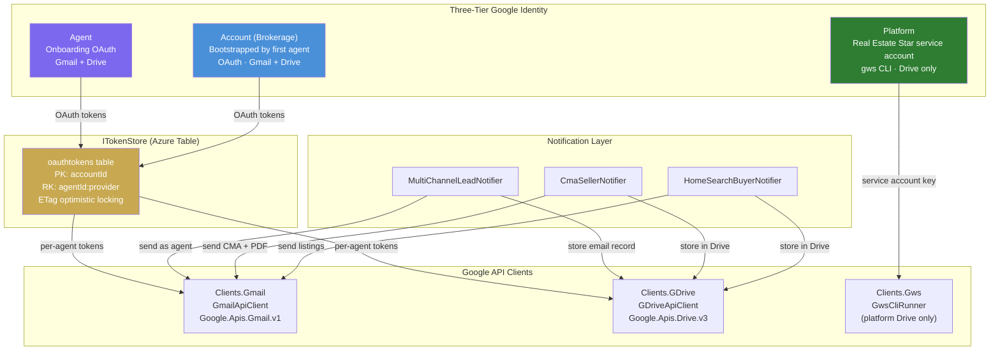
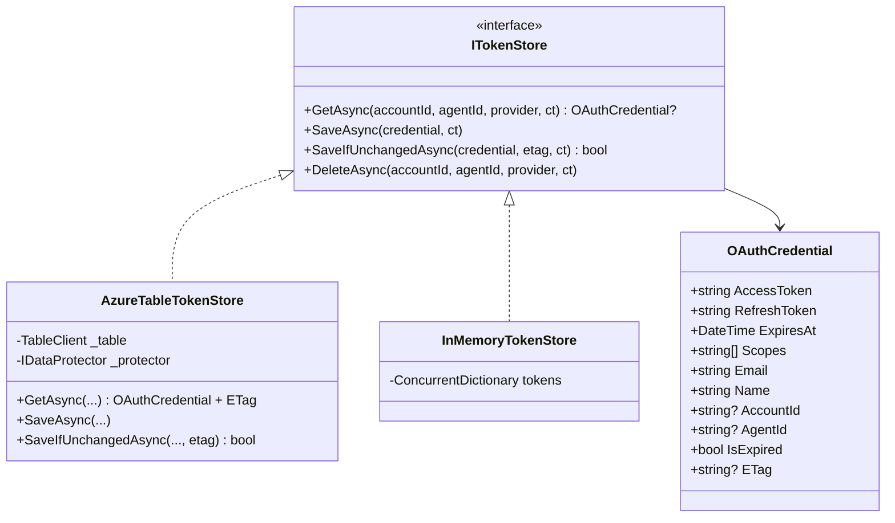
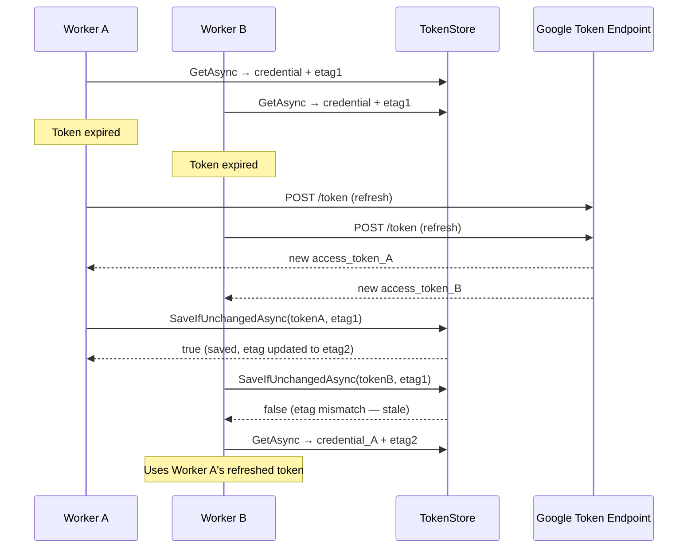
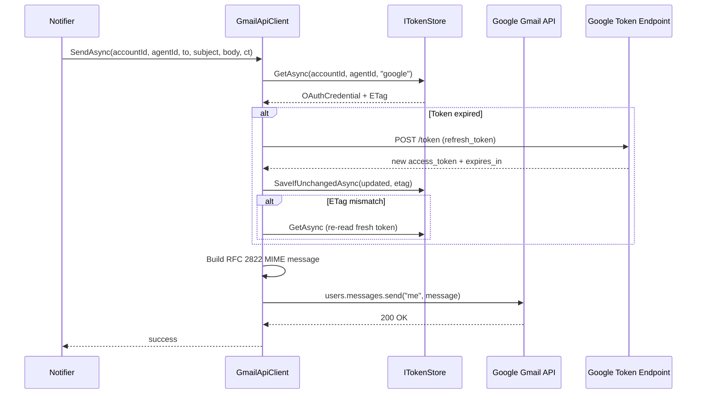
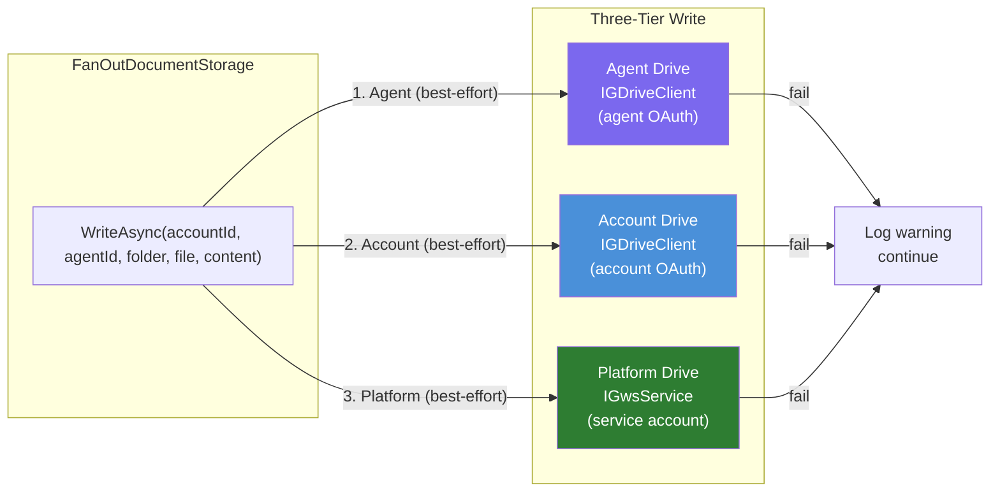
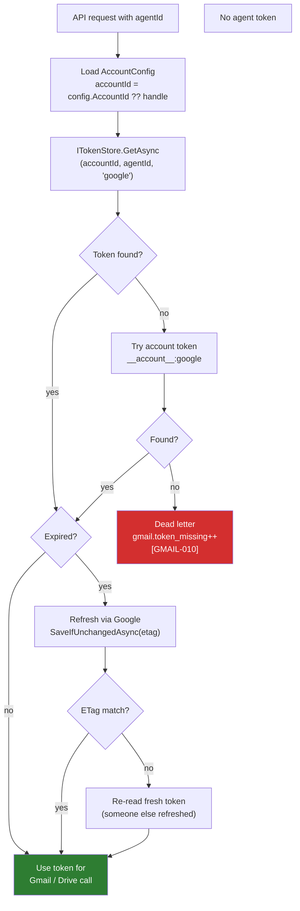

# Google API Clients + Token Persistence — Design Spec

**Author:** Eddie Rosado
**Date:** 2026-03-23
**Status:** Draft

---

## Problem Statement

The lead pipeline's notification step (email) and storage step (Drive) both rely on `gws` CLI — a process-spawning wrapper around a Google Workspace CLI binary. This has three critical problems:

1. **gws CLI isn't in the Docker image** — notifications fail silently in production and dead-letter
2. **gws CLI can't authenticate as different agents** — it uses a single fixed identity. Agents use @gmail.com accounts which don't support service account delegation. Each agent must use their own OAuth tokens.
3. **OAuth tokens aren't durable** — tokens from onboarding OAuth are stored in session files that get cleaned up. Once the session expires, the agent's Google credentials are lost.

---

## Goals

- **Gmail API client** that sends email as any agent using their OAuth tokens
- **Drive API client** that reads/writes to any agent's Drive using their OAuth tokens
- **Durable token store** in Azure Table Storage with DPAPI encryption and concurrent-refresh safety
- **Three-tier identity model**: Agent → Account → Platform, each with their own Google credentials
- **Every email stored as a file** in Drive regardless of send success (compliance record)
- **Fan-out document writes** to Agent Drive + Account Drive + Platform Drive (any layer optional/degradable)

---

## Architecture Overview



---

## Component Design

### 1. Token Persistence Layer



#### Model Consolidation: OAuthCredential replaces GoogleTokens

The existing `Domain/Onboarding/Models/GoogleTokens.cs` is renamed to `OAuthCredential` and moved to `Domain/Shared/Models/OAuthCredential.cs`. All fields are `init`-only (immutable). Token refresh creates a new instance.

```csharp
// Domain/Shared/Models/OAuthCredential.cs
public sealed record OAuthCredential
{
    public required string AccessToken { get; init; }
    public required string RefreshToken { get; init; }
    public required DateTime ExpiresAt { get; init; }
    public required string[] Scopes { get; init; }
    public required string Email { get; init; }
    public required string Name { get; init; }
    public string? AccountId { get; init; }  // null when used in-session (onboarding)
    public string? AgentId { get; init; }    // null when used in-session (onboarding)
    public string? ETag { get; init; }       // Azure Table ETag for optimistic locking
    public bool IsExpired => DateTime.UtcNow >= ExpiresAt.AddMinutes(-5);
}
```

`AccountId` and `AgentId` are nullable — they're null during in-session onboarding usage and populated when stored durably. `ETag` is populated by the token store for optimistic locking.

**Migration:** `OnboardingSession.GoogleTokens` property type changes from `GoogleTokens` to `OAuthCredential`. The session serialization format is backward-compatible since it's a superset (new nullable fields default to null). `GoogleOAuthService.ExchangeCodeAsync` returns `OAuthCredential` instead of `GoogleTokens`.

#### Provider Constants

```csharp
// Domain/Shared/OAuthProviders.cs
public static class OAuthProviders
{
    public const string Google = "google";
}
```

#### Interface

```csharp
// Domain/Shared/Interfaces/Storage/ITokenStore.cs
public interface ITokenStore
{
    Task<OAuthCredential?> GetAsync(string accountId, string agentId, string provider, CancellationToken ct);
    Task SaveAsync(OAuthCredential credential, CancellationToken ct);
    Task<bool> SaveIfUnchangedAsync(OAuthCredential credential, string etag, CancellationToken ct);
    Task DeleteAsync(string accountId, string agentId, string provider, CancellationToken ct);
}
```

`SaveIfUnchangedAsync` returns `false` on ETag mismatch (412 Precondition Failed) — caller retries.

#### Azure Table Implementation

`Clients.Azure/AzureTableTokenStore.cs`:
- Table: `oauthtokens`
- PartitionKey: `{accountId}`, RowKey: `{agentId}:{provider}`
- AccessToken + RefreshToken encrypted with DPAPI (`IDataProtector`, purpose `"OAuthTokenStore.v1"`)
- `GetAsync` returns credential with `ETag` populated from Azure Table entity
- `SaveIfUnchangedAsync` uses `UpdateEntityAsync` with `ETag` + `TableUpdateMode.Replace` — returns false on 412
- Graceful decryption fallback for plaintext (migration path)
- Dev fallback: Azurite when connection string is empty

#### Concurrent Refresh Safety



**Pattern:** Read with ETag → check expired → refresh → `SaveIfUnchangedAsync` with original ETag → on false, re-read (someone else refreshed) → use their token. At most one extra round-trip, no locks, no races.

#### In-Memory Implementation

`TestUtilities/InMemoryTokenStore.cs` — `ConcurrentDictionary<string, (OAuthCredential, string etag)>` for unit tests. `SaveIfUnchangedAsync` checks etag match.

### 2. Gmail API Client



**Interface:** `Domain/Shared/Interfaces/External/IGmailSender.cs`

```csharp
public interface IGmailSender
{
    Task SendAsync(string accountId, string agentId, string to, string subject,
        string htmlBody, CancellationToken ct);
    Task SendWithAttachmentAsync(string accountId, string agentId, string to, string subject,
        string htmlBody, byte[] attachmentBytes, string fileName, CancellationToken ct);
}
```

**Implementation:** `Clients.Gmail/GmailApiClient.cs`

- Uses `Google.Apis.Gmail.v1` NuGet package
- **Bypasses `GoogleWebAuthorizationBroker`** — builds `UserCredential` manually from stored tokens using `TokenResponse` + `GoogleAuthorizationCodeFlow`. Sets `IDataStore` to a no-op implementation to prevent the SDK from attempting its own token persistence or refresh callbacks that could conflict with our `ITokenStore`.
- Auto-refreshes expired tokens using the optimistic locking pattern from Section 1
- Builds RFC 2822 MIME message using `MimeKit` (lightweight, well-tested MIME builder)
- OTel counters: `gmail.sent`, `gmail.failed`, `gmail.token_missing`, `gmail.duration_ms` (tagged by agentId)
- Log codes: `[GMAIL-001]` sent, `[GMAIL-010]` token not found, `[GMAIL-020]` refresh failed, `[GMAIL-030]` send failed

**Error handling:**
- No token found → increment `gmail.token_missing` counter, log `[GMAIL-010]`, return without sending (caller handles dead-letter). **This counter is the observable signal** that an agent needs to re-authenticate — visible in Grafana dashboard.
- Token refresh fails → log `[GMAIL-020]`, return without sending
- Send fails → log `[GMAIL-030]`, throw (caller retries via pipeline)

### 3. Drive API Client

**Interface:** `Domain/Shared/Interfaces/External/IGDriveClient.cs`

```csharp
public interface IGDriveClient
{
    Task<string> CreateFolderAsync(string accountId, string agentId, string folderPath, CancellationToken ct);
    Task<string> UploadFileAsync(string accountId, string agentId, string folderId,
        string fileName, string content, CancellationToken ct);
    Task<string> UploadBinaryAsync(string accountId, string agentId, string folderId,
        string fileName, byte[] data, string mimeType, CancellationToken ct);
    Task<string?> DownloadFileAsync(string accountId, string agentId, string folderId,
        string fileName, CancellationToken ct);
    Task DeleteFileAsync(string accountId, string agentId, string fileId, CancellationToken ct);
    Task<List<string>> ListFilesAsync(string accountId, string agentId, string folderId, CancellationToken ct);
}
```

**Implementation:** `Clients.GDrive/GDriveApiClient.cs`

- Uses `Google.Apis.Drive.v3` NuGet package
- Same token resolution + optimistic refresh pattern as Gmail client
- Same "bring your own tokens" approach — bypasses SDK credential management
- OTel counters: `gdrive.operations`, `gdrive.failed`, `gdrive.token_missing`, `gdrive.duration_ms` (tagged by operation + agentId)
- Log codes: `[GDRIVE-001]` success, `[GDRIVE-010]` token not found, `[GDRIVE-020]` refresh failed, `[GDRIVE-030]` operation failed

### 4. Fan-Out Document Storage



#### New Interface: IDocumentStorageProvider

The existing `IFileStorageProvider` carries Google Sheets methods (`AppendRowAsync`, `ReadRowsAsync`, `RedactRowsAsync`) that don't apply to fan-out. A new narrower interface handles document-only operations:

```csharp
// Domain/Shared/Interfaces/Storage/IDocumentStorageProvider.cs
public interface IDocumentStorageProvider
{
    Task WriteDocumentAsync(string accountId, string agentId, string folder,
        string fileName, string content, CancellationToken ct);
    Task WriteBinaryAsync(string accountId, string agentId, string folder,
        string fileName, byte[] data, string mimeType, CancellationToken ct);
    Task<string?> ReadDocumentAsync(string accountId, string agentId, string folder,
        string fileName, CancellationToken ct);
}
```

`IFileStorageProvider` stays unchanged — Sheets operations continue routing through `IGwsService` for platform-level compliance (consent audit, deletion log).

**`FanOutDocumentStorage`** implements `IDocumentStorageProvider`:
- Writes to all three tiers concurrently (`Task.WhenAll`)
- **All tiers are best-effort** — failure at any tier logs a warning but doesn't fail the operation. Email send is the fatal operation in the notification pipeline, not document storage.
- Each tier independently configurable (enabled/disabled in account config)
- Missing tokens for a tier → skip that tier with a warning log

### 5. Email Record Storage

Every email (sent or failed) gets stored as a markdown file in Drive:

```
{lead-folder}/Communications/
├── 2026-03-23-lead-notification.md
├── 2026-03-23-cma-report.md
└── 2026-03-23-home-search-results.md
```

**YAML frontmatter:**
```yaml
---
type: lead-notification
to: jenisesellsnj@gmail.com
subject: "New Lead: John Smith — Relocating (Score: 78)"
sent: true
sent_at: 2026-03-23T14:30:00.0000000Z
correlation_id: abc-123
---
```

Timestamps use `DateTime.UtcNow.ToString("o")` (round-trip format with `Z` suffix) matching existing conventions.

If send fails: `sent: false`, `error: "token expired"`. The file still exists in Drive as a compliance record.

The email record write happens AFTER the send attempt, via `IDocumentStorageProvider` (fan-out). Since all Drive writes are best-effort, a failed Drive write after a successful email send does NOT cause a pipeline retry (no duplicate emails).

### 6. Notification Layer Changes

**What changes in each notifier:**

| Notifier | Before | After |
|----------|--------|-------|
| `MultiChannelLeadNotifier` | `gwsService.SendEmailAsync(agentEmail, ...)` | `gmailSender.SendAsync(accountId, agentId, ...)` + `documentStorage.WriteDocumentAsync(...)` |
| `CmaSellerNotifier` | `gwsService.SendEmailAsync` + `gwsService.UploadFileAsync` | `gmailSender.SendWithAttachmentAsync(...)` + `documentStorage` for PDF + email record |
| `HomeSearchBuyerNotifier` | `gwsService.SendEmailAsync` | `gmailSender.SendAsync(...)` + `documentStorage.WriteDocumentAsync(...)` |

**accountId resolution:** Each notifier already calls `accountConfigService.GetAccountAsync(agentId, ct)` to load agent config. A new `AccountId` field on `AccountConfig` provides the brokerage identifier. For single-agent brokerages (current state), `AccountId` defaults to the agent handle. This field is added to `account.json` and `agent.schema.json`.

**What doesn't change:**
- `CascadingAgentNotifier` cascade logic (WhatsApp → Email → File Storage)
- WhatsApp notifications (separate API)
- Notification interfaces (`ILeadNotifier`, `ICmaNotifier`, `IHomeSearchNotifier`)
- Google Chat webhook notifications (HTTP, no OAuth needed)
- Sheets operations (consent audit, deletion log) — stay on `IGwsService`

### 7. Onboarding OAuth Migration

**Current:** Tokens saved to encrypted session JSON files → cleaned up after session expires.

**New:** After `GoogleOAuthCallbackEndpoint` exchanges code for tokens:
1. `GoogleOAuthService.ExchangeCodeAsync` returns `OAuthCredential` (replaces `GoogleTokens`)
2. Save to `ITokenStore` (Azure Table) with `accountId` + `agentId` from session context
3. If first agent under the account → also save as `__account__:google` entry
4. Session still holds `OAuthCredential` for in-flight onboarding chat (short-lived, `AccountId`/`AgentId` null)
5. `ITokenStore` is the durable source of truth for all future API calls

**Backward compatibility:** The session store's `EncryptingSessionStoreDecorator` handles deserialization of both old `GoogleTokens` format and new `OAuthCredential` format (extra nullable fields ignored on old sessions).

### 8. OTel Diagnostics

**New:** `Domain/Shared/GmailDiagnostics.cs`
- `gmail.sent`, `gmail.failed`, `gmail.token_missing`, `gmail.duration_ms` (tagged by agentId)

**New:** `Domain/Shared/GDriveDiagnostics.cs`
- `gdrive.operations`, `gdrive.failed`, `gdrive.token_missing`, `gdrive.duration_ms` (tagged by operation, agentId)

Both registered in `OpenTelemetryExtensions.cs`. Both added to the Grafana dashboard (new Row 8: Google API).

The `gmail.token_missing` counter is the **observable signal** in Grafana that an agent needs to re-authenticate. When this counter rises, the agent's OAuth token is missing or revoked. A future spec covers the re-auth UX (prompting the agent to reconnect).

---

## accountId: Where It Comes From

`accountId` is a new field added to `AccountConfig` and `account.json`:

```json
{
  "accountId": "buckalew-realty",
  "handle": "jenise-buckalew",
  "agent": { ... }
}
```

For single-agent brokerages (all current accounts), `accountId` defaults to the agent handle. When a brokerage adds a second agent, `accountId` stays the same and groups them under one partition.

Added to `agent.schema.json` as a required field. Existing accounts without it use the handle as fallback:

```csharp
public string AccountId => config.AccountId ?? config.Handle;
```

---

## Token Store Key Structure

| Identity | PartitionKey | RowKey | Example |
|----------|-------------|--------|---------|
| Agent | `{accountId}` | `{agentId}:google` | PK=`buckalew-realty`, RK=`jenise-buckalew:google` |
| Account | `{accountId}` | `__account__:google` | PK=`buckalew-realty`, RK=`__account__:google` |
| Platform | `__platform__` | `__platform__:google` | PK=`__platform__`, RK=`__platform__:google` |

---

## Identity Resolution Flow



---

## File Map

### New Files

| File | Responsibility |
|------|---------------|
| `Domain/Shared/Models/OAuthCredential.cs` | Immutable OAuth credential record (replaces GoogleTokens) |
| `Domain/Shared/OAuthProviders.cs` | Provider name constants (`Google = "google"`) |
| `Domain/Shared/Interfaces/Storage/ITokenStore.cs` | Token store contract with optimistic locking |
| `Domain/Shared/Interfaces/Storage/IDocumentStorageProvider.cs` | Narrower document-only storage interface for fan-out |
| `Domain/Shared/Interfaces/External/IGmailSender.cs` | Gmail send contract |
| `Domain/Shared/Interfaces/External/IGDriveClient.cs` | Drive operations contract |
| `Domain/Shared/GmailDiagnostics.cs` | Gmail OTel counters |
| `Domain/Shared/GDriveDiagnostics.cs` | Drive OTel counters |
| `Clients.Gmail/GmailApiClient.cs` | Gmail API client with token refresh + optimistic locking |
| `Clients.GDrive/GDriveApiClient.cs` | Drive API client with token refresh + optimistic locking |
| `Clients.Azure/AzureTableTokenStore.cs` | Encrypted token store with ETag-based optimistic locking |
| `TestUtilities/InMemoryTokenStore.cs` | In-memory token store for testing |
| `DataServices/Storage/FanOutDocumentStorage.cs` | Three-tier document fan-out writes |

### Modified Files

| File | Change |
|------|--------|
| `Domain/Onboarding/Models/GoogleTokens.cs` | Delete — replaced by OAuthCredential |
| `Domain/Shared/Models/AccountConfig.cs` | Add `AccountId` property |
| `Notifications/MultiChannelLeadNotifier.cs` | Replace `IGwsService` email with `IGmailSender` + `IDocumentStorageProvider` |
| `Notifications/CmaSellerNotifier.cs` | Same swap + PDF via `IGDriveClient` |
| `Notifications/HomeSearchBuyerNotifier.cs` | Same swap |
| `Api/Features/Onboarding/Services/GoogleOAuthService.cs` | Return `OAuthCredential` instead of `GoogleTokens` |
| `Api/Features/Onboarding/Endpoints/GoogleOAuthCallbackEndpoint.cs` | Also save tokens to `ITokenStore` |
| `DataServices/Onboarding/EncryptingSessionStoreDecorator.cs` | Encrypt/decrypt `OAuthCredential` (backward compat) |
| `Api/Program.cs` | Register all new services |
| `Api/Diagnostics/OpenTelemetryExtensions.cs` | Register Gmail + Drive diagnostics |
| `config/agent.schema.json` | Add `accountId` required field |
| `config/accounts/*/account.json` | Add `accountId` field to each account |
| `tests/RealEstateStar.Architecture.Tests/` | Update dependency rules for new providers |

### Unchanged

| Component | Why |
|-----------|-----|
| `Clients.Gws/GwsCliRunner.cs` | Stays for platform Drive + Sheets + Docs operations |
| `IGwsService` interface | Still used by consent audit, Drive monitoring, Sheets |
| `IFileStorageProvider` | Stays for Sheets operations — fan-out uses new `IDocumentStorageProvider` |
| WhatsApp notifications | Separate API, unrelated |
| Google Chat webhook | HTTP POST, no OAuth |

---

## Config Reference

```json
{
  "Google": {
    "ClientId": "...",
    "ClientSecret": "...",
    "RedirectUri": "https://api.real-estate-star.com/oauth/google/callback"
  },
  "TokenStore": {
    "TableName": "oauthtokens",
    "ConnectionString": ""
  }
}
```

Dev: empty `ConnectionString` → Azurite emulator (`UseDevelopmentStorage=true`)
Prod: Azure Storage connection string from Key Vault

---

## Out of Scope

- **Google Docs API client** — Docs operations stay on `gws` CLI for now
- **Google Sheets API client** — same, stays on `gws` CLI
- **Google Calendar API client** — not needed yet
- **Platform data store** (replacing file-based storage with DB) — separate future spec
- **Drive API replacing gws CLI for platform** — can happen later, gws works for platform-level
- **Agent re-authentication UX** — when `gmail.token_missing` counter rises in Grafana, the agent needs to re-auth. Design the UX (email prompt, platform notification) in a separate spec. The observable signal exists via OTel.
- **Multi-account agent** — an agent belonging to multiple brokerages. Future complexity.
- **Shared Anthropic client extraction** — `OnboardingChatService` TODO (`LOW-6`) is unrelated to Google API work
