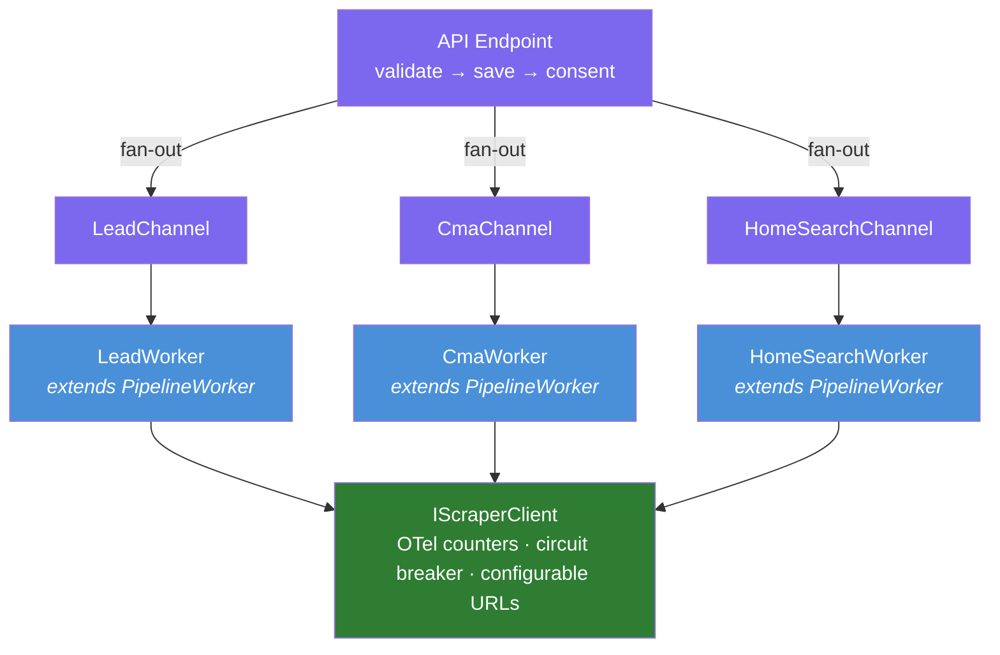
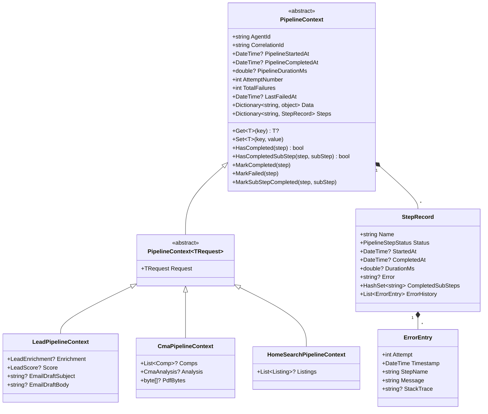
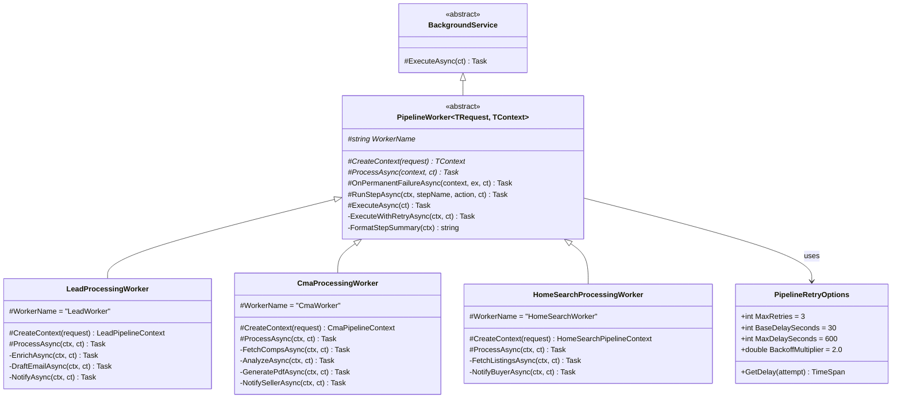
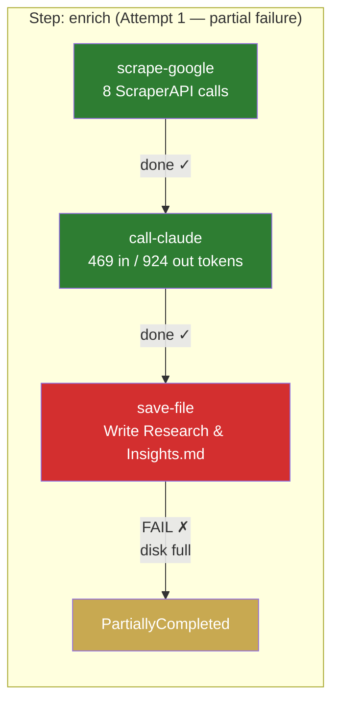
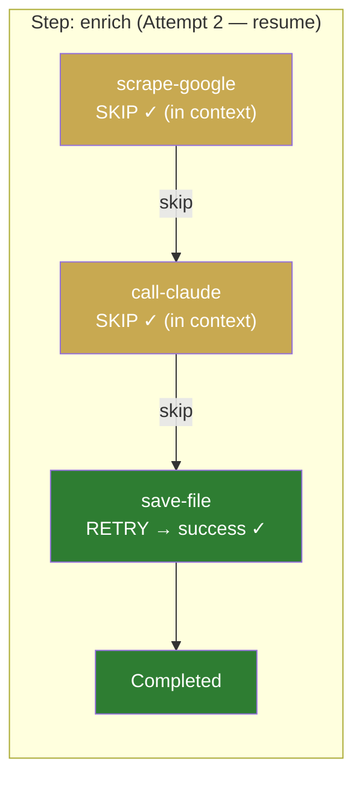
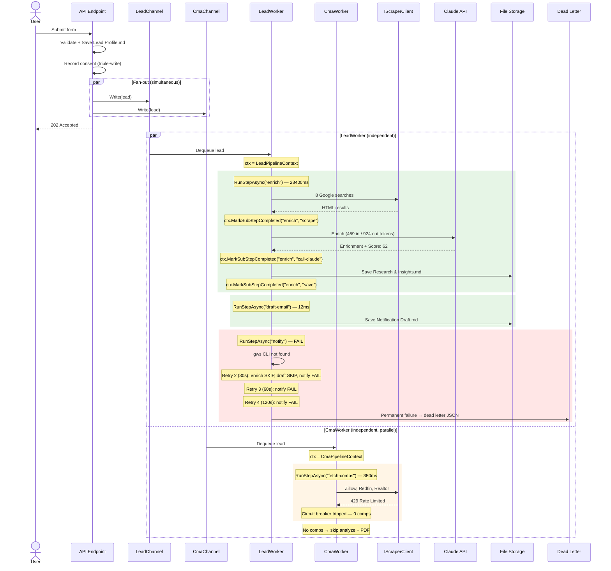
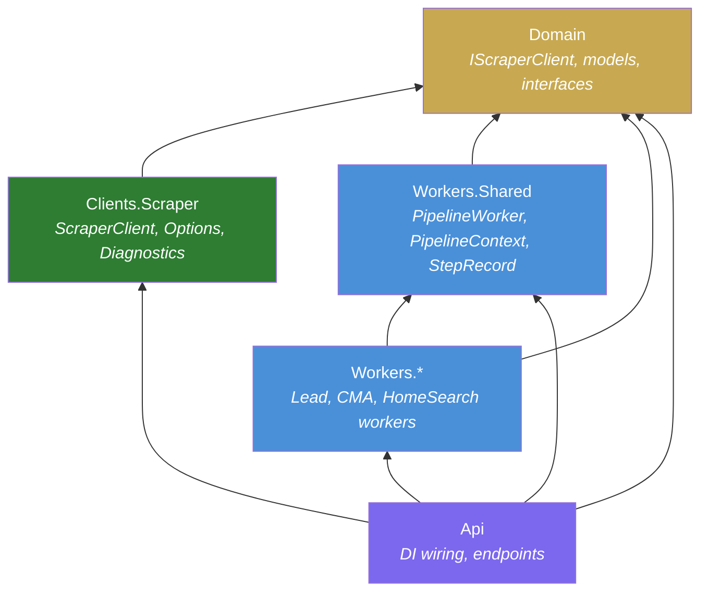

# Pipeline Context + ScraperAPI Observability — Design Spec

**Author:** Eddie Rosado
**Date:** 2026-03-23
**Status:** Draft
**Plan:** `docs/superpowers/plans/2026-03-23-pipeline-context-scraper-observability.md`

---

## Problem Statement

The current pipeline architecture has three critical gaps:

1. **No ScraperAPI observability** — We hit 70% usage on a single test submission with zero visibility. No counters, no rate-limit handling, no configurable URLs. When limits are reached, the system keeps calling and failing silently.

2. **No shared contract for workers** — Each background service (`LeadProcessingWorker`, `CmaProcessingWorker`, `HomeSearchProcessingWorker`) implements its own channel-read loop, error handling, retry logic, and health tracking. Bugs fixed in one worker aren't automatically fixed in others.

3. **No pipeline context** — Each step runs independently, passing raw objects between methods. Intermediate results (scraped HTML, Claude responses, email drafts) are computed and discarded. On retry, everything re-runs from scratch — wasting Claude tokens and ScraperAPI credits. There's no record of what completed, what failed, or how far we got.

---

## Goals

- **Track every ScraperAPI call** with OTel counters visible in Grafana
- **Stop burning credits** when rate limits are hit (circuit breaker)
- **Make source URLs configurable** via appsettings (swap Zillow/Redfin/Realtor without code changes)
- **Single base class** for all pipeline workers with consistent logging, retry, health tracking
- **Pipeline context** that accumulates data across steps — retries resume, not restart
- **Step-level and sub-step-level tracking** — know exactly what completed, what failed, and how long each part took
- **Configurable exponential backoff** with dead letter on permanent failure

---

## Architecture Overview



All three pipelines are **independent** — no data flows between them. The API endpoint fans out to all three channels simultaneously. Each worker runs its own pipeline with its own context.

---

## Component Design

### 1. PipelineContext — The State Carrier

Every pipeline gets a context object that carries:
- The original request
- All intermediate results (enrichment, comps, drafts, PDFs)
- Step completion status with timing
- Sub-step tracking for partial completion
- Retry history with error details



### 2. PipelineWorker — The Shared Contract

Every background service inherits from `PipelineWorker<TRequest, TContext>` which enforces:



**Base class provides:**
- **ExecuteAsync** — channel read loop
- **ExecuteWithRetryAsync** — exponential backoff, preserves context between retries, logs step summary
- **RunStepAsync** — checkpoint/resume per step (skips Completed, resumes PartiallyCompleted, records timing, appends to ErrorHistory)
- **OnPermanentFailureAsync** — dead letter hook after all retries exhausted
- **FormatStepSummary** — `"enrich:Completed(23401ms), notify:Failed(90123ms)"`

**Retry behavior (configurable via appsettings):**

```
Pipeline:Retry:
  MaxRetries: 3
  BaseDelaySeconds: 30
  MaxDelaySeconds: 600
  BackoffMultiplier: 2.0

Attempt 1: immediate
Attempt 2: 30s delay
Attempt 3: 60s delay
Attempt 4: 120s delay
→ Dead letter
```

The context is preserved across retries. On retry, `RunStepAsync` skips completed steps and resumes partially completed ones. Within a partially completed step, the action checks `ctx.HasCompletedSubStep()` to skip expensive sub-work.

### 3. Step and Sub-Step Tracking

**Steps** are named pipeline stages (e.g., `"enrich"`, `"draft-email"`, `"notify"`).

**Sub-steps** are checkpoints within a step for expensive operations:





On retry, `HasCompletedSubStep("enrich", "scrape-google")` → `true` → skip 8 API calls. Same for Claude. Only the file write retries. **Zero wasted tokens or credits.**

This is what saves money. A partial enrichment failure doesn't re-run Claude ($0.01+) or ScraperAPI (10 credits per rendered call).

### 4. Error History

Every failure is recorded with full context:

```csharp
public record ErrorEntry(
    int Attempt,
    DateTime Timestamp,
    string StepName,
    string Message,
    string? StackTrace);
```

On permanent failure, the dead letter contains the full error trail:

```json
{
  "correlationId": "abc-123",
  "totalFailures": 4,
  "pipelineDurationMs": 210000,
  "steps": {
    "enrich": { "status": "Completed", "durationMs": 23401 },
    "draft-email": { "status": "Completed", "durationMs": 12 },
    "notify": { "status": "Failed", "durationMs": 186000 }
  },
  "errorHistory": [
    { "attempt": 1, "step": "notify", "message": "gws: No such file or directory" },
    { "attempt": 2, "step": "notify", "message": "gws: No such file or directory" },
    { "attempt": 3, "step": "notify", "message": "gws: No such file or directory" },
    { "attempt": 4, "step": "notify", "message": "gws: No such file or directory" }
  ]
}
```

One glance: enrichment worked, email was drafted, notification failed 4 times because `gws` binary is missing.

### 5. IScraperClient — Centralized Scraper with Observability

All scraper calls go through a single `IScraperClient` instead of raw `HttpClient`:

```
IScraperClient
├── FetchAsync(targetUrl, source, agentId, ct): Task<string?>
└── IsAvailable: bool     ← false when rate-limited

ScraperClient implements IScraperClient
├── OTel counters: calls_total, calls_succeeded, calls_failed, calls_rate_limited, credits_used
├── OTel histogram: call_duration_ms (tagged by source)
├── Circuit breaker: sets IsAvailable=false on HTTP 429
├── Configurable via ScraperOptions (IOptions pattern)
└── Logs every call with source, agentId, response size, duration
```

**ScraperOptions (appsettings):**

```json
{
  "Scraper": {
    "BaseUrl": "https://api.scraperapi.com",
    "RenderJavaScript": true,
    "TimeoutSeconds": 30,
    "MonthlyLimitWarningPercent": 70,
    "SourceUrls": {
      "zillow": "https://www.zillow.com/homedetails/{slug}",
      "redfin": "https://www.redfin.com/home/{slug}",
      "realtor": "https://www.realtor.com/realestateandhomes-detail/{slug}",
      "google": "https://www.google.com/search?q={query}"
    }
  }
}
```

Swap a source URL without deploying code. Add a new comp source by adding a config entry.

**OTel counters (visible in Grafana):**

| Counter | Tags | Purpose |
|---------|------|---------|
| `scraper.calls_total` | source, agent_id | Total API calls |
| `scraper.calls_succeeded` | source | Successful fetches |
| `scraper.calls_failed` | source | Failed fetches (timeout, error) |
| `scraper.calls_rate_limited` | source | HTTP 429 responses |
| `scraper.credits_used` | — | Estimated credit consumption (render=10, plain=1) |
| `scraper.call_duration_ms` | source | Latency histogram |

### 6. Fan-Out at Endpoint

The endpoint dispatches to all three channels immediately after save + consent:

```csharp
// SubmitLeadEndpoint.Handle — after save + consent
await leadChannel.Writer.WriteAsync(new LeadProcessingRequest(agentId, lead, correlationId), ct);

if (lead.LeadType is LeadType.Seller or LeadType.Both && lead.SellerDetails is not null)
    await cmaChannel.Writer.WriteAsync(new CmaProcessingRequest(agentId, lead, correlationId), ct);

if (lead.LeadType is LeadType.Buyer or LeadType.Both && lead.BuyerDetails is not null)
    await homeSearchChannel.Writer.WriteAsync(new HomeSearchProcessingRequest(agentId, lead, correlationId), ct);
```

No chaining between workers. CMA doesn't wait for enrichment. Home search doesn't wait for CMA. Each runs its own pipeline independently.

**CmaProcessingRequest simplified** — `LeadEnrichment` and `LeadScore` removed:

```csharp
// Before
public sealed record CmaProcessingRequest(string AgentId, Lead Lead,
    LeadEnrichment Enrichment, LeadScore Score, string CorrelationId);

// After
public sealed record CmaProcessingRequest(string AgentId, Lead Lead, string CorrelationId);
```

`DetermineReportType` driven by comp count only (not lead score):

```csharp
internal static ReportType DetermineReportType(int compCount) =>
    compCount switch
    {
        >= 6 => ReportType.Comprehensive,
        >= 3 => ReportType.Standard,
        _ => ReportType.Lean
    };
```

---

## File Map

### New Files (Workers.Shared)

| File | Purpose |
|------|---------|
| `Workers.Shared/Context/PipelineContext.cs` | Base context + generic `PipelineContext<T>` |
| `Workers.Shared/Context/PipelineStepStatus.cs` | Status enum |
| `Workers.Shared/Context/StepRecord.cs` | Per-step timing, status, sub-steps, error history |
| `Workers.Shared/Context/ErrorEntry.cs` | Single error record |
| `Workers.Shared/PipelineWorker.cs` | Base class with retry, checkpoint, timing |
| `Workers.Shared/PipelineRetryOptions.cs` | Configurable retry policy |

### New Files (Clients.Scraper)

| File | Purpose |
|------|---------|
| `Clients.Scraper/ScraperClient.cs` | Centralized client with OTel + circuit breaker |
| `Clients.Scraper/ScraperOptions.cs` | Config: URLs, timeouts, limits |
| `Clients.Scraper/ScraperDiagnostics.cs` | OTel counters + histograms |

### New Files (Domain)

| File | Purpose |
|------|---------|
| `Domain/Shared/Interfaces/External/IScraperClient.cs` | Interface |

### New Files (Per-Pipeline Contexts)

| File | Purpose |
|------|---------|
| `Workers.Leads/LeadPipelineContext.cs` | Typed context with Enrichment, Score, Draft |
| `Workers.Cma/CmaPipelineContext.cs` | Typed context with Comps, Analysis, PDF |
| `Workers.HomeSearch/HomeSearchPipelineContext.cs` | Typed context with Listings |

### Modified Files

| File | Change |
|------|--------|
| `Workers.Leads/LeadProcessingWorker.cs` | Inherit `PipelineWorker`, use context + `RunStepAsync` |
| `Workers.Cma/CmaProcessingWorker.cs` | Inherit `PipelineWorker`, use context + `RunStepAsync` |
| `Workers.HomeSearch/HomeSearchProcessingWorker.cs` | Inherit `PipelineWorker`, use context + `RunStepAsync` |
| `Workers.Leads/ScraperLeadEnricher.cs` | Use `IScraperClient` |
| `Workers.Cma/ScraperCompSource.cs` | Use `IScraperClient` |
| `Workers.HomeSearch/ScraperHomeSearchProvider.cs` | Use `IScraperClient` |
| `Workers.Cma/CmaProcessingChannel.cs` | Remove Enrichment/Score from request |
| `Api/Program.cs` | Register IScraperClient, ScraperOptions, PipelineRetryOptions |
| `Api/appsettings.json` | Add Scraper + Pipeline:Retry config sections |
| `Api/Features/Leads/Submit/SubmitLeadEndpoint.cs` | Fan-out to all 3 channels |
| `Api/Diagnostics/OpenTelemetryExtensions.cs` | Add ScraperDiagnostics meter |

---

## Data Flow Example — Seller Lead (Happy Path)



---

## Dependency Rules

The new files follow the existing project dependency graph:



No new project-to-project dependencies. Architecture tests in `RealEstateStar.Architecture.Tests` continue to enforce this.

---

## Config Reference

```json
{
  "Scraper": {
    "BaseUrl": "https://api.scraperapi.com",
    "RenderJavaScript": true,
    "TimeoutSeconds": 30,
    "MonthlyLimitWarningPercent": 70,
    "SourceUrls": {
      "zillow": "https://www.zillow.com/homedetails/{slug}",
      "redfin": "https://www.redfin.com/home/{slug}",
      "realtor": "https://www.realtor.com/realestateandhomes-detail/{slug}",
      "google": "https://www.google.com/search?q={query}"
    }
  },
  "Pipeline": {
    "Retry": {
      "MaxRetries": 3,
      "BaseDelaySeconds": 30,
      "MaxDelaySeconds": 600,
      "BackoffMultiplier": 2.0
    }
  }
}
```

---

## Out of Scope

- **Persistent storage migration** (GDrive / Azure Blob) — separate spec
- **gws CLI installation in Docker** — separate task
- **Grafana dashboard creation** — OTel counters flow automatically once configured
- **Google Maps PlaceAutocompleteElement migration** — frontend task
- **WhatsApp worker** — different pattern (queue-based, not channel-based), not migrated to PipelineWorker
