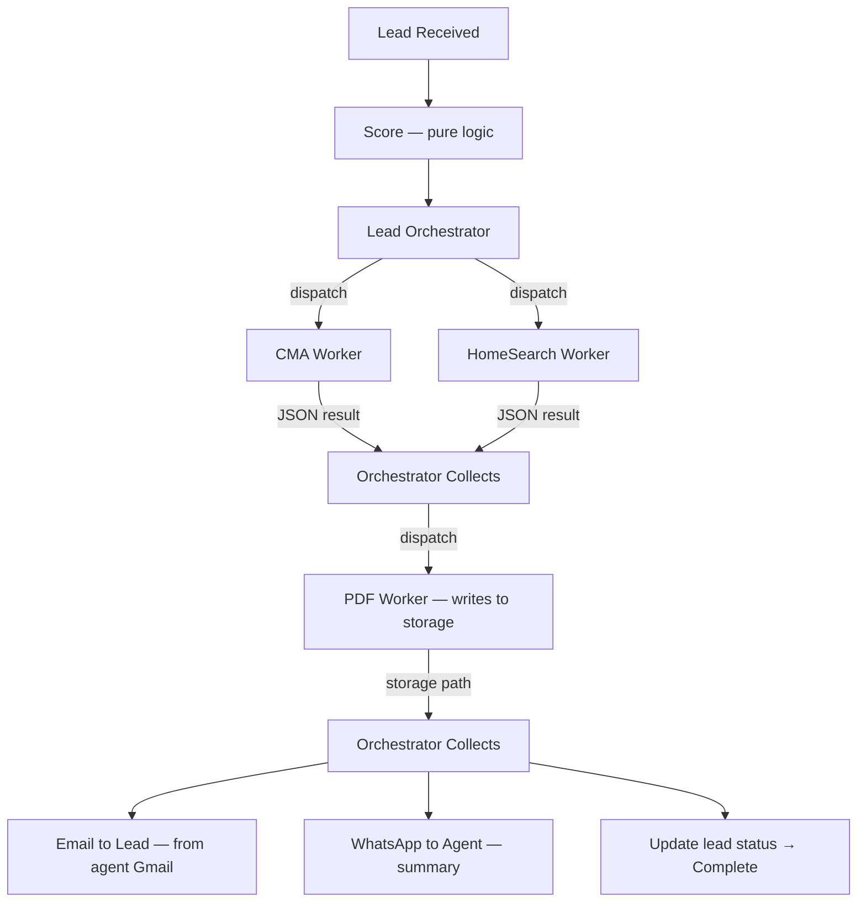
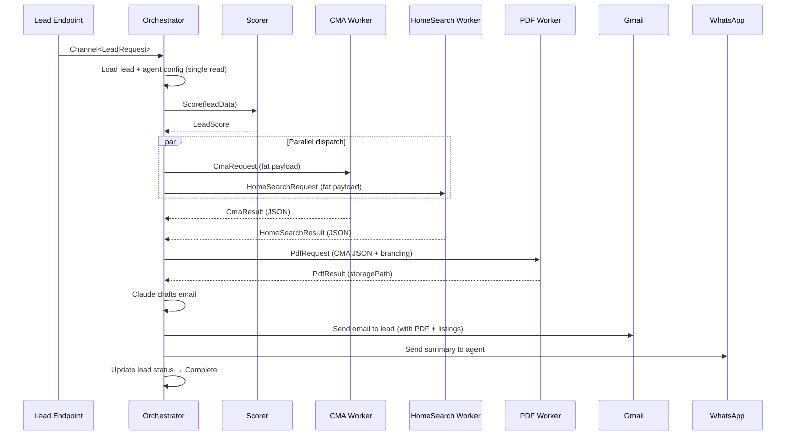

# Lead Pipeline Redesign — Orchestrator Pattern

**Author:** Eddie Rosado
**Date:** 2026-03-26
**Status:** Draft

---

## Problem Statement

The current lead pipeline has a 5-step sequential flow: enrich → draft email → notify agent → dispatch CMA → dispatch HomeSearch. The enrichment step scrapes 8 public sources (LinkedIn, Facebook, court records, etc.) per lead, then sends them to Claude for a "motivation profile." In practice:

- Most scraped profiles are private or irrelevant — noise, not signal.
- The lead score (0-100) is based on unreliable scraped data.
- The 8 parallel scraper queries cost ~$0.13 in ScraperAPI credits per lead.
- The agent already has the useful information (timeline, budget, property) from the form itself.
- CMA and HomeSearch run as separate fire-and-forget jobs — the agent gets the lead notification before the analysis is ready.

The agent receives a lead notification with a "research profile" they don't need, then separately gets a CMA report minutes later. Two disjointed notifications, one of which is useless.

---

## Goals

- **One actionable notification** — the agent gets everything at once: lead info + CMA/listing analysis + PDF
- **Kill person-scraping** — remove the enrichment step entirely, save ScraperAPI credits and Claude tokens
- **Simple lead scoring** — pure logic from form data, no external calls
- **Orchestrator pattern** — decouple workers from storage I/O, enable future Azure Functions migration
- **Two notifications at pipeline end** — email to lead (from agent's Gmail), WhatsApp to agent
- **Workers have no storage I/O** — they call external APIs (RentCast, Claude) but never read from or write to storage. All persistence is owned by the orchestrator (except PDF worker, which writes to storage).

---

## Architecture Overview



**Key principle:** The orchestrator owns all storage I/O (reads, writes, notifications). Workers receive everything they need in the dispatch payload and return structured results. Workers still make external API calls (RentCast, Claude, listing sources) — "no I/O" means no storage reads/writes, not no network calls. One exception: the PDF worker writes to storage and returns a path (PDF bytes are too large for the result channel).

**Azure Functions readiness:** The orchestrator maps to a Durable Function orchestration. CMA, HomeSearch, and PDF workers map to activity functions. The `TaskCompletionSource` dispatch pattern (see Section 2) maps to `Task.WhenAll` on activity calls. No architectural rewrite needed.

### Happy Path Sequence



---

## Component Design

### 1. Lead Scoring (Pure Logic)

Replaces the Claude-based `LeadScore` with a rule-based calculator. No external calls, runs in <1ms.

**Interface:** New `ILeadScorer` replaces `ILeadEnricher`. Returns `LeadScore` only (no `LeadEnrichment`).

**Inputs (all from lead form):**

| Factor | Weight | Scoring |
|--------|--------|---------|
| Timeline | 0.35 | ASAP=100, 1-3mo=80, 3-6mo=50, 6-12mo=25, Just Curious=10 |
| Pre-approval (buyers) | 0.25 | Approved=100, In Progress=60, No=20 |
| Budget alignment (buyers) | 0.15 | Has min+max=100, one=60, neither=20 |
| Property details (sellers) | 0.25 | address+beds+baths+sqft=100, partial=60, address only=40 |
| Notes provided | 0.05 | Has notes=100, empty=0 |

**Output:** `LeadScore { OverallScore, Factors[], Explanation }` — same shape as today.

**Buckets for WhatsApp:**
- 70-100 = Hot lead
- 40-69 = Warm lead
- 0-39 = Cool lead

Weights shift based on lead type: sellers weight property details at 0.25, buyers weight pre-approval at 0.25. Both types always include timeline (0.35) and notes (0.05). Remaining weight is distributed across the type-specific factors.

### 2. Lead Orchestrator

New `LeadOrchestrator` class. A `BackgroundService` that reads from `Channel<LeadRequest>`.

**Relationship to `PipelineWorker<TRequest, TContext>`:** The orchestrator does NOT extend `PipelineWorker`. The existing base class assumes sequential step execution (`RunStepAsync` in order), which doesn't fit the dispatch-and-collect pattern. Instead, `LeadOrchestrator` is a standalone `BackgroundService` that implements its own:
- **Checkpoint/resume** — same pattern (check if phase output exists, skip if so), but implemented directly rather than through the step abstraction.
- **Retry with backoff** — wraps the entire orchestration in a retry loop using Polly (already used elsewhere in the project).
- **Dead letter** — failed leads after max retries go to the existing dead letter mechanism.
- **Health tracking** — reports activity to `BackgroundServiceHealthTracker` (same as current workers).

The existing `PipelineWorker` base class stays for CMA/HomeSearch workers (they still process sequential steps internally). Only the lead pipeline's top-level coordinator changes.

**Worker dispatch and result collection:** Instead of a shared `Channel<WorkerResult>` (which has fan-in routing problems when multiple leads are in-flight), each dispatch uses a `TaskCompletionSource`:

```csharp
// Orchestrator creates a promise per worker
var cmaTcs = new TaskCompletionSource<CmaWorkerResult>();
var hsTcs = new TaskCompletionSource<HomeSearchWorkerResult>();

// Dispatch includes the TCS in the request
await cmaChannel.Writer.WriteAsync(new CmaRequest { ..., Completion = cmaTcs });
await hsChannel.Writer.WriteAsync(new HomeSearchRequest { ..., Completion = hsTcs });

// Wait for results with timeout
var cmaTask = cmaTcs.Task.WaitAsync(TimeSpan.FromMinutes(5));
var hsTask = hsTcs.Task.WaitAsync(TimeSpan.FromMinutes(5));
await Task.WhenAll(cmaTask, hsTask);
```

Each worker calls `request.Completion.SetResult(...)` when done or `request.Completion.SetException(...)` on failure. No shared completion channel, no routing problem, no correlation needed.

**Timeout:** Configurable via `Pipeline:Lead:WorkerTimeoutSeconds` (default: 300 = 5 minutes). Expected latencies: CMA ~15-30s (RentCast API + Claude), HomeSearch ~20-40s (listing fetch + Claude curation). The 5-minute default is generous to handle cold starts and API slowdowns. On timeout, the orchestrator proceeds with whatever results completed.

**Responsibilities:**

1. **Single storage read** — load lead data + agent config at entry. No further storage reads after this point.
2. **Score lead** — call the pure-logic scorer.
3. **Build dispatch payloads** — fat payloads containing everything workers need (see AgentConfig below).
4. **Dispatch workers** — write to `Channel<CmaRequest>` and/or `Channel<HomeSearchRequest>` with `TaskCompletionSource` per worker, based on lead type.
5. **Collect results** — `Task.WhenAll` with timeout on the `TaskCompletionSource` tasks.
6. **Dispatch PDF worker** — if CMA result present, dispatch `PdfRequest` with its own `TaskCompletionSource`. Collect `PdfResult { StoragePath }`.
7. **Send email to lead** — Claude drafts personalized email, sent from agent's Gmail with PDF attachment (if available) and listing highlights.
8. **Send WhatsApp to agent** — summary message with lead details, score, and CMA/listing headline.
9. **Write results to storage** — save CMA analysis JSON, HomeSearch listings JSON, and lead status update.

**AgentConfig payload subset:**

```
AgentConfig {
  AgentId: string
  Name: string             // identity.name
  FirstName: string        // identity.firstName
  Email: string            // identity.email
  Phone: string            // identity.phone
  LicenseNumber: string    // identity.licenseNumber
  BrokerageName: string    // identity.brokerageName
  BrokerageLogo: string    // identity.brokerageLogo (URL)
  PrimaryColor: string     // branding.primaryColor
  AccentColor: string      // branding.accentColor
  State: string            // location.state
  ServiceAreas: string[]   // location.serviceAreas
  Bio: string              // content.bio
  Specialties: string[]    // content.specialties
  Testimonials: string[]   // content.testimonials (first 3)
  Handle: string           // for building privacy links
}
```

This is a defined subset of account.json + content.json — not the full config. Sized to stay well under 64KB for future Azure Queue compatibility.

**Dispatch logic by lead type:**

| Lead Type | Workers Dispatched | Email Content | WhatsApp Content |
|-----------|-------------------|---------------|-----------------|
| Seller | CMA → PDF | Personalized + agent pitch + CMA PDF | Score + property + est. value |
| Buyer | HomeSearch | Personalized + agent pitch + listings | Score + area + listing count |
| Both | CMA + HomeSearch (parallel) → PDF | Personalized + agent pitch + CMA PDF + listings | Score + property + est. value + listing count |

### 3. Worker Result Types

Sealed hierarchy instead of a nullable-property bag:

```csharp
public abstract record WorkerResult(string LeadId, bool Success, string? Error);

public sealed record CmaWorkerResult(
    string LeadId, bool Success, string? Error,
    decimal? EstimatedValue, decimal? PriceRangeLow, decimal? PriceRangeHigh,
    IReadOnlyList<CompSummary>? Comps, string? MarketAnalysis
) : WorkerResult(LeadId, Success, Error);

public sealed record HomeSearchWorkerResult(
    string LeadId, bool Success, string? Error,
    IReadOnlyList<ListingSummary>? Listings, string? AreaSummary
) : WorkerResult(LeadId, Success, Error);

public sealed record PdfWorkerResult(
    string LeadId, bool Success, string? Error,
    string? StoragePath
) : WorkerResult(LeadId, Success, Error);
```

### 4. CMA Worker Changes

The CMA worker currently:
- Receives a `CmaRequest` from the channel
- Scrapes comps (being replaced by RentCast in parallel workstream)
- Runs Claude analysis
- Generates PDF (QuestPDF)
- Saves PDF to storage
- Sends email to agent

**Changes:**
- **Remove:** PDF generation — moved to PDF worker. QuestPDF dependency removed from Workers.Cma project.
- **Remove:** Storage writes — moved to orchestrator/PDF worker. `IFileStorageProvider` dependency removed.
- **Remove:** Email sending — moved to orchestrator. `ILeadNotifier` dependency removed.
- **Remove:** `accountConfigService.GetAccountAsync` calls — agent config comes in the dispatch payload.
- **Add:** Call `request.Completion.SetResult(new CmaWorkerResult(...))` when done.
- **Keep:** RentCast comp fetching (`IRentCastClient`), Claude analysis (`IAnthropicClient`).

After changes, the CMA worker calls external APIs (RentCast, Claude) and returns structured JSON. No storage reads/writes.

### 5. HomeSearch Worker Changes

Similar to CMA. Currently fetches listings, curates with Claude, saves to storage, emails buyer.

**Changes:**
- **Remove:** Storage writes — `IFileStorageProvider` dependency removed.
- **Remove:** Email sending — `ILeadNotifier` dependency removed.
- **Remove:** Config lookups — agent config comes in payload.
- **Add:** Call `request.Completion.SetResult(new HomeSearchWorkerResult(...))` when done.
- **Keep:** Listing fetching, Claude curation.

After changes: fetch listings, curate with Claude, return structured JSON.

### 6. PDF Worker (New)

New `PdfWorker` — a `BackgroundService` reading from `Channel<PdfRequest>`.

**Input:** `PdfRequest { LeadId, CmaWorkerResult, AgentBranding, Completion: TaskCompletionSource<PdfWorkerResult> }`
**Behavior:** Generates PDF from CMA JSON using QuestPDF, writes to storage via `IFileStorageProvider`.
**Output:** Calls `Completion.SetResult(new PdfWorkerResult { StoragePath = "..." })`.

This is the one worker that writes to storage. The PDF bytes are too large (1-2MB) to pass through the result pattern, especially for future Azure Functions migration where queue messages have size limits. The PDF worker writes to blob storage and returns the path.

### 7. Email to Lead

Sent from the agent's Gmail via the existing `GmailApiClient`. HTML, mobile-responsive, branded.

**Structure:**

```
[Agent brokerage logo / branding header — colors from AgentConfig]

Hi {firstName},

{personalizedParagraph — Claude-written, about their property/search}

Why work with {agentFirstName}?
{agentPitchParagraph — Claude-written from AgentConfig bio/specialties/testimonials}

[CMA PDF attached — if seller]
[Listing highlights — if buyer]
[Both — if both]

Best regards,
{agentFirstName} {agentLastName}
Licensed Real Estate Agent | Lic# {licenseNumber}
{brokerageName}
{agentPhone} | {agentEmail}

─────────────────────────
[Opt-out link → {handle}.real-estate-star.com/privacy/opt-out?token={signedToken}]
[CCPA link → {handle}.real-estate-star.com/privacy/my-data?token={signedToken}]
[Privacy link → {handle}.real-estate-star.com/privacy]

Powered by Real Estate Star
─────────────────────────
```

**Privacy link tokens:** Opt-out and CCPA links use a signed HMAC token encoding the email + timestamp, not the raw email in the URL. This prevents PII leakage through browser history, proxy logs, and analytics. The privacy pages decode the token server-side to extract the email.

**Claude call:** One call drafts both the personalized paragraph and the agent pitch paragraph. Inputs:
- Lead form data (name, timeline, property/search details)
- CMA result JSON (estimated value, comp count) — if seller
- HomeSearch result JSON (listing count, price range) — if buyer
- AgentConfig (bio, specialties, testimonials, service areas)
- Lead location (for tailoring agent pitch to relevant experience)

Generic professional real estate tone for now. Voice profiles are a separate future spec.

**Legal requirements sourced from AgentConfig:**
- `LicenseNumber`
- `BrokerageName`
- `BrokerageLogo` (image URL for email header)
- `PrimaryColor`, `AccentColor` (branding)
- `State` (determines applicable privacy disclosures)

### 8. Agent Notification (WhatsApp → Email fallback)

Primary channel: WhatsApp via `WhatsAppApiClient` using a **pre-approved WhatsApp Business message template**. WhatsApp requires all business-initiated messages to use templates approved through the WhatsApp Business Manager. The template must be created and approved before this feature ships.

**Fallback channel:** If WhatsApp is not configured for the agent (no `WhatsApp:PhoneNumberId` in config) or if the WhatsApp send fails after retries, fall back to sending the notification as an email to the agent's own email address via `GmailApiClient`. The email contains the same information as the WhatsApp message but in a formatted HTML layout matching the agent's branding.

**Fallback order:**
1. Try WhatsApp → success → done
2. WhatsApp not configured OR WhatsApp fails → send email to agent's email
3. Email also fails → log error, lead is still saved and email to lead was still sent

**Template name:** `new_lead_notification`

**Template structure (submitted to WhatsApp for approval):**

```
New lead: {{1}} ({{2}}, score {{3}})
{{4}} | {{5}}
Timeline: {{6}}

{{7}}

Intro email sent from your Gmail. Check sent folder for details.
```

**Parameter mapping:**
- `{{1}}` — `{firstName} {lastName}`
- `{{2}}` — `{hotWarmCool}` (Hot lead / Warm lead / Cool lead)
- `{{3}}` — `{score}` (0-100)
- `{{4}}` — `{phone}`
- `{{5}}` — `{email}`
- `{{6}}` — `{timeline}` (ASAP, 1-3 Months, etc.)
- `{{7}}` — Dynamic line: seller details, buyer details, or both

**Pre-requisite:** Template must be submitted and approved in WhatsApp Business Manager before deployment. Approval typically takes 24-48 hours. If rejected, adjust wording and resubmit. The template should be categorized as "UTILITY" (not marketing) since it's a transactional notification to the business owner.

### 9. Orchestrator Diagnostics

New `OrchestratorDiagnostics` class following the same pattern as `LeadDiagnostics`, `CmaDiagnostics`, etc.

**ActivitySource:** `RealEstateStar.Orchestrator`

**Spans (traces):**

| Span Name | Description | Tags |
|-----------|-------------|------|
| `orchestrator.process_lead` | Root span for entire pipeline | `lead.id`, `lead.type`, `agent.id` |
| `orchestrator.score` | Scoring phase | `lead.score`, `lead.bucket` (hot/warm/cool) |
| `orchestrator.dispatch` | Worker dispatch phase | `workers.dispatched` (comma-separated list) |
| `orchestrator.collect` | Waiting for worker results | `workers.completed`, `workers.timed_out`, `workers.failed` |
| `orchestrator.dispatch_pdf` | PDF generation dispatch | `cma.has_result` |
| `orchestrator.draft_email` | Claude email drafting | `claude.input_tokens`, `claude.output_tokens` |
| `orchestrator.send_email` | Gmail send | `email.has_pdf`, `email.has_listings` |
| `orchestrator.send_whatsapp` | WhatsApp send | `whatsapp.template`, `lead.score` |
| `orchestrator.checkpoint` | Checkpoint write | `checkpoint.phase` |

**Counters:**

| Metric | Type | Description |
|--------|------|-------------|
| `orchestrator.leads_processed` | Counter | Total leads that entered the orchestrator |
| `orchestrator.leads_completed` | Counter | Leads that reached Complete status |
| `orchestrator.leads_partial` | Counter | Leads completed with partial results (worker timeout/failure) |
| `orchestrator.leads_failed` | Counter | Leads that failed entirely (dead-lettered) |
| `orchestrator.worker_dispatches` | Counter | Total worker dispatches, tagged by `worker_type` |
| `orchestrator.worker_completions` | Counter | Worker results received, tagged by `worker_type`, `success` |
| `orchestrator.worker_timeouts` | Counter | Worker timeouts, tagged by `worker_type` |
| `orchestrator.email_sent` | Counter | Emails successfully sent to leads |
| `orchestrator.email_failed` | Counter | Email send failures (after retries) |
| `orchestrator.whatsapp_sent` | Counter | WhatsApp notifications sent to agents |
| `orchestrator.whatsapp_failed` | Counter | WhatsApp send failures |
| `orchestrator.checkpoints_written` | Counter | Checkpoint writes, tagged by `phase` |
| `orchestrator.checkpoints_resumed` | Counter | Phases skipped on resume, tagged by `phase` |
| `orchestrator.claude_tokens.input` | Counter | Claude input tokens for email drafting |
| `orchestrator.claude_tokens.output` | Counter | Claude output tokens for email drafting |

**Histograms:**

| Metric | Unit | Description |
|--------|------|-------------|
| `orchestrator.total_duration_ms` | ms | End-to-end pipeline duration (receive → complete) |
| `orchestrator.score_duration_ms` | ms | Scoring phase duration |
| `orchestrator.collect_duration_ms` | ms | Time waiting for all worker results |
| `orchestrator.pdf_duration_ms` | ms | PDF generation wait time |
| `orchestrator.email_draft_duration_ms` | ms | Claude email drafting duration |
| `orchestrator.email_send_duration_ms` | ms | Gmail send duration |
| `orchestrator.whatsapp_send_duration_ms` | ms | WhatsApp send duration |

**Registration:** Add `OrchestratorDiagnostics.ServiceName` to both `.AddSource()` and `.AddMeter()` in `OpenTelemetryExtensions.cs`.

**Grafana dashboard:** Add an "Orchestrator" row to the existing dashboard (`infra/grafana/real-estate-star-api-dashboard.json`) with panels for:
- Pipeline throughput (leads/min)
- End-to-end duration histogram
- Worker dispatch vs completion rates
- Timeout and failure rates
- Partial completion rate
- Email/WhatsApp delivery success rate
- Claude token usage for email drafting

---

## What Gets Deleted

| Component | Reason |
|-----------|--------|
| `ScraperLeadEnricher` | Person-scraping is removed entirely |
| `ILeadEnricher` interface | Replaced by `ILeadScorer` (returns `LeadScore` only) |
| `LeadEnrichment` model | Motivation, professional background, financial indicators — all gone |
| `ILeadNotifier` | Orchestrator handles notifications directly via Gmail/WhatsApp clients |
| `IFailedNotificationStore` | Orchestrator handles notification failures inline |
| 8 Google search query templates | LinkedIn, Facebook, Twitter, news, property/court/business/license records |
| Claude enrichment prompt | The "lead analyst" system prompt |
| Email draft step | Replaced by orchestrator email at end of pipeline |
| Separate agent notification step | Replaced by WhatsApp at end of pipeline |
| `LeadProcessingWorker` | Replaced by `LeadOrchestrator` |

---

## What Stays (Unchanged)

| Component | Notes |
|-----------|-------|
| `LeadScore` model shape | Same `{ OverallScore, Factors[], Explanation }` — reimplemented as pure logic |
| `GmailApiClient` | Used by orchestrator to send lead email |
| `WhatsAppApiClient` | Used by orchestrator to send agent notification |
| Lead form + submission endpoint | No changes to frontend or API endpoint |
| Lead storage (`IFileStorageProvider`) | Same abstraction, orchestrator writes |
| CMA analysis (Claude) | Still runs, just returns JSON instead of triggering PDF/email |
| HomeSearch curation (Claude) | Still runs, just returns JSON instead of triggering email |
| Turnstile, HMAC, consent | All lead submission security/compliance unchanged |
| `PipelineWorker<T,C>` base class | CMA/HomeSearch workers still use it for internal step execution |

---

## Data Flow

```
Lead form submitted
  → API endpoint (unchanged: validate, dedup, save, consent, enqueue)
  → Lead Orchestrator picks up from Channel<LeadRequest>
      │
      ├─ READ lead + agent config (single storage read — no more reads after this)
      ├─ SCORE lead (pure logic, <1ms)
      │
      ├─ DISPATCH based on lead type (each with its own TaskCompletionSource):
      │   ├─ Seller → CmaWorker(fat payload with all context)
      │   ├─ Buyer → HomeSearchWorker(fat payload with all context)
      │   └─ Both → CmaWorker + HomeSearchWorker in parallel
      │
      ├─ COLLECT results via Task.WhenAll with configurable timeout
      │   ├─ CmaWorkerResult { JSON analysis } — or timeout
      │   └─ HomeSearchWorkerResult { JSON listings } — or timeout
      │
      ├─ IF CMA result present:
      │   ├─ DISPATCH PdfWorker(CmaResult + branding) with TaskCompletionSource
      │   └─ COLLECT PdfWorkerResult { storagePath } — or timeout
      │
      ├─ Claude drafts email (one call: personalized paragraph + agent pitch)
      ├─ WRITE: send email to lead via Gmail (attach PDF if available, include listings)
      ├─ WRITE: send WhatsApp summary to agent
      ├─ WRITE: save CMA/HomeSearch result JSON to storage
      └─ WRITE: update lead status → Complete
```

---

## Error Handling

| Failure | Behavior |
|---------|----------|
| CMA worker fails/times out | Orchestrator proceeds. Email sent without CMA, WhatsApp notes "CMA pending." |
| HomeSearch worker fails/times out | Orchestrator proceeds. Email sent without listings, WhatsApp notes "Listings pending." |
| PDF worker fails/times out | Email sent without attachment. PDF can be regenerated later. |
| Claude email draft fails | Fall back to template-only email (no personalized paragraph). |
| Gmail send fails | Retry 3x. If all fail, WhatsApp agent with "Email delivery failed — contact lead manually." |
| WhatsApp send fails | Fall back to email notification to agent's own email. If email also fails, log error. Lead email to lead still sent. |
| All workers fail | Lead still saved, scored, and status updated. Agent gets WhatsApp (or fallback email): "New lead, analysis failed — contact manually." |

Every failure degrades gracefully. The lead is never lost. The agent always hears about it.

---

## Lead Status Progression

**Current:** `Received → Enriched → EmailDrafted → Notified → Complete`

**New:** `Received → Scored → Analyzing → Notified → Complete`

- `Received` — lead saved, consent recorded
- `Scored` — pure-logic score computed
- `Analyzing` — CMA/HomeSearch workers dispatched
- `Notified` — email sent to lead, WhatsApp sent to agent
- `Complete` — all done

**Migration:** Old status values (`Enriched`, `EnrichmentFailed`, `EmailDrafted`, `CmaComplete`, `SearchComplete`) are removed from the enum. Existing leads with old status values are treated as `Complete` if they reached `Notified` or later, or `Received` if they were mid-pipeline. The lead submission endpoint already handles dedup (same email = update existing), so stale mid-pipeline leads will be reprocessed on next submission.

---

## Checkpoint/Resume

The orchestrator implements checkpoint/resume directly (not via `PipelineWorker` base class) using the same file-existence pattern:

1. After scoring → checkpoint score to lead record. On resume: skip scoring if score exists.
2. After collecting CMA/HomeSearch results → checkpoint results JSON to storage. On resume: skip dispatch if results JSON exists.
3. After PDF generation → checkpoint PDF path. On resume: skip PDF worker if path exists.
4. After email + WhatsApp → checkpoint notification status. On resume: skip notifications if flagged.

Retry is handled by Polly wrapping the orchestration loop (exponential backoff, configurable via `Pipeline:Lead:Retry` — same config section as today).

---

## Out of Scope (Future Specs)

- **Voice profiles** — analyze agent's sent emails to learn their writing voice. Email drafts use generic professional tone until then.
- **CMA PDF redesign** — beautiful PDF with market trend charts, graphs, neighborhood data. Uses current QuestPDF template until then.
- **Azure Functions migration** — the orchestrator pattern enables this, but actual migration is a separate effort.
- **Lead dashboard** — web UI for agents to view lead cards, scores, and CMA results. Currently email + WhatsApp only.

---

## Dependencies

- **RentCast integration** (parallel workstream, nearly complete) — CMA worker will use `IRentCastClient` instead of `ScraperCompSource`. This spec assumes RentCast is available.
- **WhatsApp channel** (PR #30, merged) — `WhatsAppApiClient` used for agent notification.
- **Gmail OAuth** (existing) — agent's Gmail used to send lead emails.

---

## Testing Strategy

- **Lead scoring:** Unit tests for every factor combination, boundary values, buyer vs seller vs both weights.
- **Orchestrator:** Integration tests with in-memory channels and `TaskCompletionSource`. Test dispatch logic, timeout handling, partial failure scenarios, checkpoint/resume.
- **Worker result collection:** Test parallel completion, single completion, timeout, mixed success/failure.
- **Worker independence:** Test that CMA/HomeSearch workers have no `IFileStorageProvider`, `ILeadNotifier`, or config service dependencies.
- **Email template:** Snapshot tests for HTML output. Test with/without CMA, with/without listings, legal footer correctness, signed privacy tokens.
- **WhatsApp message:** Unit tests for message formatting, hot/warm/cool buckets.
- **Architecture tests:** Update `DependencyTests.cs` and `LayerTests.cs` for new project dependencies (LeadOrchestrator → Gmail, WhatsApp, Claude clients). Verify Workers.Cma and Workers.HomeSearch no longer reference storage or notification interfaces.
- **End-to-end:** Full pipeline test: submit lead → score → dispatch → collect → notify. Mock external services (RentCast, Claude, Gmail, WhatsApp).
