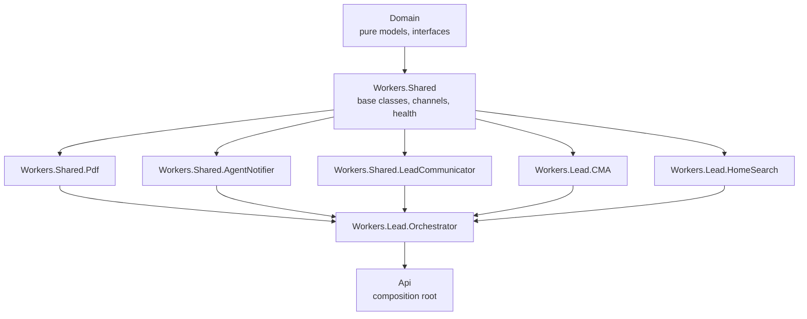
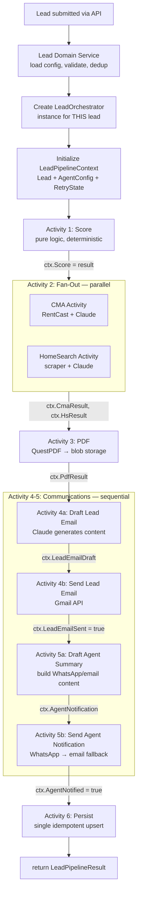
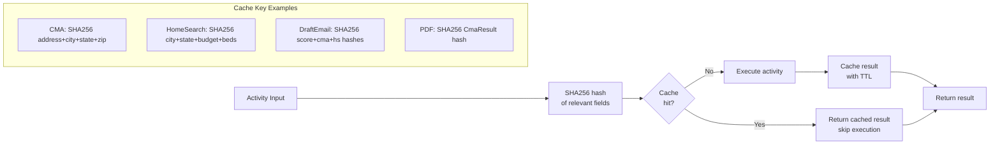
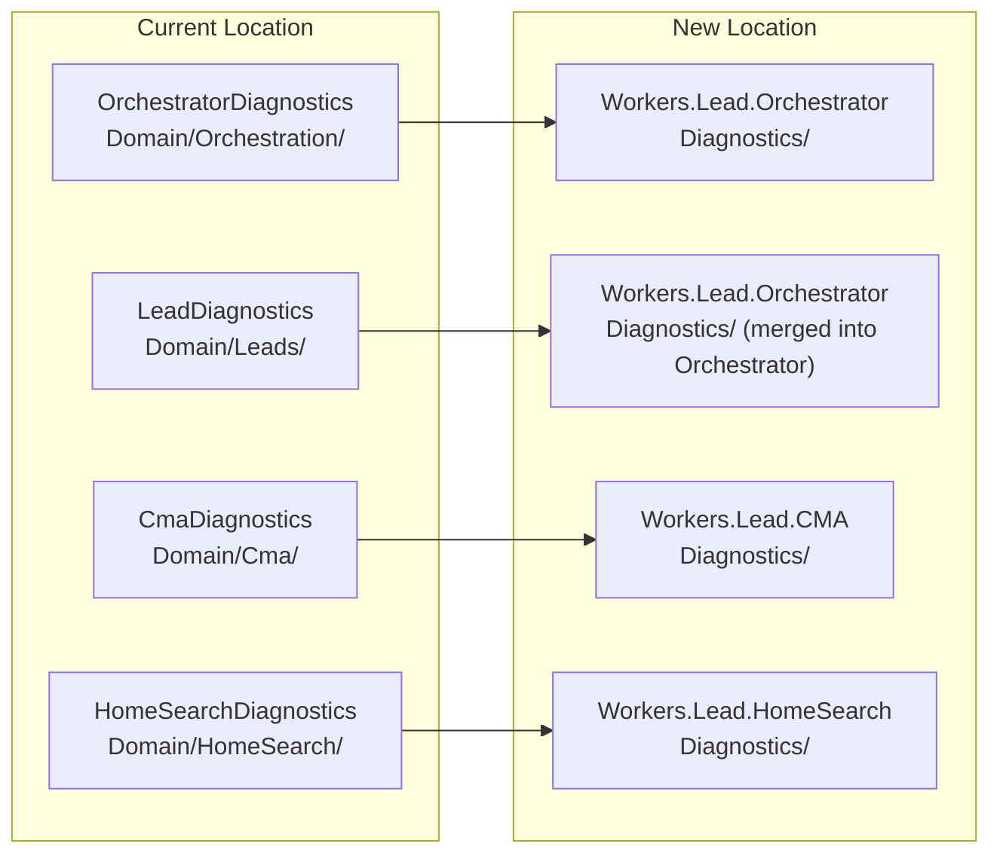
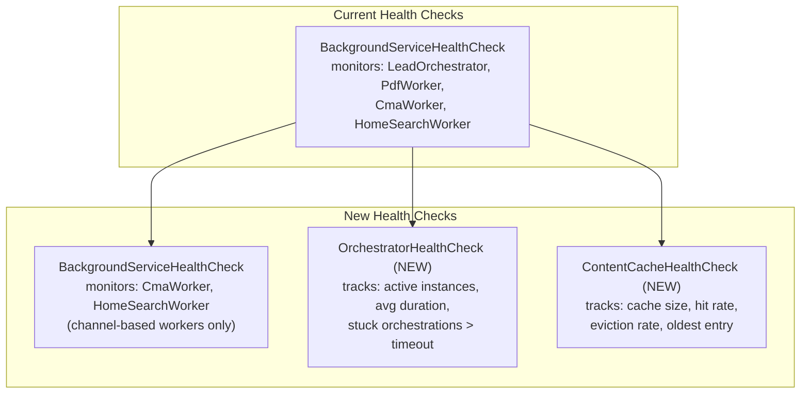

# Worker Architecture Restructure

**Author:** Eddie Rosado
**Date:** 2026-03-27
**Status:** Draft

---

## Problem Statement

The current worker architecture has four problems that limit growth and maintainability:

### 1. Workers.Leads has too many concerns

`RealEstateStar.Workers.Leads` owns 10 files spanning orchestration, scoring, email drafting, email templating, PDF generation, PDF storage, and agent notification. These are distinct responsibilities jammed into one project:

```
Workers.Leads/
  LeadOrchestrator.cs          ← orchestration
  LeadOrchestratorChannel.cs   ← orchestration channel
  LeadScorer.cs                ← scoring logic
  LeadEmailDrafter.cs          ← Claude-powered email drafting
  LeadEmailTemplate.cs         ← HTML email rendering
  AgentNotifier.cs             ← WhatsApp + email fallback to agent
  PdfWorker.cs                 ← BackgroundService for PDF generation
  PdfProcessingChannel.cs      ← PDF channel
  CmaPdfGenerator.cs           ← QuestPDF CMA report rendering
```

This violates the project's "max 2 deps per non-Api project" rule and creates a dependency graph where Workers.Leads pulls in QuestPDF, Claude, Gmail, WhatsApp, and storage — all concerns that belong in separate projects.

### 2. Shared services locked inside lead-specific project

PDF generation (`PdfWorker`, `CmaPdfGenerator`) and notification (`AgentNotifier`, `LeadEmailDrafter`) are reusable capabilities trapped inside `Workers.Leads`. Future pipelines (contract automation, listing management) will need PDF generation and agent notification but cannot reference `Workers.Leads` without creating circular dependencies or pulling in unrelated lead concerns.

### 3. Future pipeline reuse is blocked

The contract automation pipeline (planned) will need:
- PDF generation for contract documents
- Agent notification when contracts are ready for signing
- Lead/client communication for document delivery

None of these can be shared today. Each new pipeline would need to duplicate the code or create a tangled dependency graph.

### 4. Program.cs is a monolith DI file

All worker registrations live in `Program.cs`. Every worker change touches this file, causing merge conflicts across feature branches. Each worker project should own its own `ServiceCollectionExtensions` for self-contained registration.

---

## Goals

- **Single Responsibility** — each worker project has one job
- **Shared services are shared** — PDF, agent notification, and lead communication live in `Workers.Shared.*` projects accessible to any pipeline
- **Self-contained DI** — each project registers its own services via `AddXxx()` extension methods
- **Smart retry** — orchestrator tracks completed steps and only re-runs what changed
- **Azure Durable Functions ready** — per-lead orchestrator instance with stateless activity functions, compatible with event-sourcing replay
- **Domain model improvements** — seller/buyer notes, shared diagnostics interface, WorkerResult consolidation
- **No breaking changes to external contracts** — API endpoints, channels, and domain interfaces stay stable

---

## Architecture Overview

### Current Structure

```
Lead API endpoint
  |
  v
LeadOrchestratorChannel (shared BackgroundService)
  |
  v
Workers.Leads/LeadOrchestrator (one service, processes all leads sequentially)
  |-- LeadScorer
  |-- dispatches --> Workers.Cma/CmaProcessingWorker (via channel)
  |-- dispatches --> Workers.HomeSearch/HomeSearchProcessingWorker (via channel)
  |-- dispatches --> Workers.Leads/PdfWorker (via channel)
  |-- LeadEmailDrafter (Claude)
  |-- LeadEmailTemplate (HTML)
  |-- AgentNotifier (WhatsApp + email)
```

### Proposed Structure — Per-Lead Orchestrator Pattern

Each lead gets its own orchestrator instance. The orchestrator IS the lead's pipeline —
it holds all state in memory and calls sub-workers directly as activities.

```
Lead API endpoint
  |
  v
Lead Domain Service (resolves agent config, validates lead)
  |
  v
LeadOrchestrator instance (one per lead, not a shared BackgroundService)
  |
  +--[1]--> Score (sync, pure logic — LeadScorer)
  |
  +--[2]--> Fan-out: CMA + HomeSearch in parallel
  |         +-- CMA Activity (async — RentCast + Claude analysis)
  |         +-- HomeSearch Activity (async — scraper + Claude parsing)
  |
  +--[3]--> PDF Activity (async — QuestPDF → blob storage)
  |
  +--[4]--> LeadCommunicator Activity (async — Claude draft → Gmail to lead)
  |
  +--[5]--> AgentNotifier Activity (async — WhatsApp → Gmail fallback to agent)
  |
  +--[6]--> Persist final state (single write)
```

**Key difference from current:** The orchestrator does not read from a channel. It is
instantiated per-lead by the Lead Domain Service and runs to completion. Each sub-step
is a stateless function call (activity) that receives input and returns output.

### Azure Durable Functions Migration Path

This per-lead orchestrator maps directly to Azure Durable Functions:

| Current (BackgroundService) | Future (Durable Functions) |
|---|---|
| `new LeadOrchestrator(lead, config)` | `StartNewAsync("LeadOrchestrator", leadId, input)` |
| `await cmaActivity.ExecuteAsync(input)` | `await context.CallActivityAsync("CmaAnalysis", input)` |
| `Task.WhenAll(cmaTask, hsTask)` | `Task.WhenAll(cmaTask, hsTask)` (same) |
| Manual retry tracking (hash keys) | Built-in replay (event sourcing, automatic) |
| In-memory state | Durable state (persisted by framework) |

**Design constraints for Durable Functions compatibility:**
1. Orchestrator logic must be **deterministic** — no `DateTime.Now`, `Guid.NewGuid()`, `Random`
2. All I/O must happen inside **activity functions** — never in the orchestrator body
3. Sub-workers must be **stateless** — receive input, return output, no shared state
4. Pass **references** (IDs, paths) between steps, not large objects (PDF bytes, comp lists)
5. Return **result objects** (`CmaWorkerResult { Success, Error }`) instead of throwing exceptions
6. Activities must be **idempotent** — safe to call twice with the same input

### Project Dependency Diagram



### Orchestrator Lifecycle — Per-Lead Instance

Each lead gets its own orchestrator instance. The orchestrator holds a **shared context**
that accumulates results across all steps. Every activity reads from and writes to this
context — this is how downstream steps access upstream results.



### Shared Pipeline Context

The orchestrator passes a **mutable context object** through every step. Each activity
reads what it needs and writes its output back. This is the single source of truth —
no passing large objects between activities, just references via context.

```mermaid
classDiagram
    class LeadPipelineContext {
        +Lead Lead
        +AgentNotificationConfig AgentConfig
        +string CorrelationId
        +LeadRetryState RetryState
        +LeadScore Score
        +CmaWorkerResult CmaResult
        +HomeSearchWorkerResult HsResult
        +string PdfStoragePath
        +CommunicationRecord LeadEmail
        +CommunicationRecord AgentNotification
        +LeadPipelineResult ToResult()
    }

    class CommunicationRecord {
        +string Subject
        +string HtmlBody
        +string Channel
        +DateTimeOffset DraftedAt
        +DateTimeOffset? SentAt
        +bool Sent
        +string? Error
        +string ContentHash
    }

    class ScoreActivity {
        +Execute(ctx) LeadScore
    }
    class CmaActivity {
        +Execute(ctx) CmaWorkerResult
    }
    class HomeSearchActivity {
        +Execute(ctx) HomeSearchWorkerResult
    }
    class PdfActivity {
        +Execute(ctx) PdfWorkerResult
    }
    class DraftLeadEmailActivity {
        +Execute(ctx) CommunicationRecord
    }
    class SendLeadEmailActivity {
        +Execute(ctx) CommunicationRecord
    }
    class DraftAgentNotificationActivity {
        +Execute(ctx) CommunicationRecord
    }
    class SendAgentNotificationActivity {
        +Execute(ctx) CommunicationRecord
    }
    class PersistActivity {
        +Execute(ctx) void
    }

    LeadPipelineContext *-- CommunicationRecord : LeadEmail
    LeadPipelineContext *-- CommunicationRecord : AgentNotification
    LeadPipelineContext <-- ScoreActivity : reads Lead, writes Score
    LeadPipelineContext <-- CmaActivity : reads Lead.SellerDetails, writes CmaResult
    LeadPipelineContext <-- HomeSearchActivity : reads Lead.BuyerDetails, writes HsResult
    LeadPipelineContext <-- PdfActivity : reads CmaResult + AgentConfig, writes PdfResult
    LeadPipelineContext <-- DraftLeadEmailActivity : reads all results, writes LeadEmail
    LeadPipelineContext <-- SendLeadEmailActivity : reads LeadEmail, updates LeadEmail.Sent
    LeadPipelineContext <-- DraftAgentNotificationActivity : reads all results, writes AgentNotification
    LeadPipelineContext <-- SendAgentNotificationActivity : reads AgentNotification, updates AgentNotification.Sent
    LeadPipelineContext <-- PersistActivity : reads entire context, writes to storage
```



**`CommunicationRecord`** — the shared model for all communications. Holds the draft content,
send status, and a content hash for dedup. The persist activity writes each record as a
separate document in the lead's folder. On retry, if `ContentHash` matches the persisted
record AND `Sent = true`, the persist activity skips re-writing (no duplicates).

```csharp
public record CommunicationRecord
{
    public required string Subject { get; init; }
    public required string HtmlBody { get; init; }
    public required string Channel { get; init; }       // "email", "whatsapp", "email-fallback"
    public required DateTimeOffset DraftedAt { get; init; }
    public DateTimeOffset? SentAt { get; set; }
    public bool Sent { get; set; }
    public string? Error { get; set; }
    public required string ContentHash { get; init; }   // SHA256 of draft inputs — dedup key
}
```

### Happy Path — Step by Step

```
LeadOrchestrator.ProcessLeadAsync(lead, agentConfig, ct)
  |
  |  ctx = new LeadPipelineContext(lead, agentConfig, retryState)
  |
  +--[1]--> ctx.Score = ScoreActivity(ctx)
  |         Pure logic, <1ms, deterministic. No cache needed.
  |
  +--[2]--> Fan-out (parallel, with timeout):
  |         +-- Seller? --> ctx.CmaResult = CmaActivity(ctx)
  |         +-- Buyer?  --> ctx.HsResult = HomeSearchActivity(ctx)
  |         Content-cached: same address = skip CMA, same criteria = skip HomeSearch
  |
  +--[3]--> CMA succeeded? --> ctx.PdfResult = PdfActivity(ctx)
  |         Content-cached: same CmaResult hash = skip PDF
  |
  +--[4a]-> ctx.LeadEmailDraft = DraftLeadEmailActivity(ctx)
  |         Claude drafts personalized email using ctx.Score + ctx.CmaResult + ctx.HsResult
  |         Content-cached: same input hash = skip re-drafting
  |
  +--[4b]-> ctx.LeadEmailSent = SendLeadEmailActivity(ctx)
  |         Sends ctx.LeadEmailDraft via Gmail. Separate from drafting —
  |         if send fails, draft is cached and re-send doesn't re-call Claude.
  |
  +--[5a]-> ctx.AgentNotification = DraftAgentNotificationActivity(ctx)
  |         Builds WhatsApp template params / email HTML from ctx
  |         Content-cached: same input = skip
  |
  +--[5b]-> ctx.AgentNotified = SendAgentNotificationActivity(ctx)
  |         WhatsApp → email fallback. If WhatsApp fails, tries email.
  |         Separate from drafting — retry only re-sends, not re-drafts.
  |
  +--[6]--> PersistActivity(ctx)
  |         Single idempotent upsert: lead + score + results + retry state
  |         Safe to call multiple times — same input = same output
  |
  v
  return ctx.ToResult()
```

**Orchestrator interface:**
```csharp
public interface ILeadOrchestrator
{
    Task<LeadPipelineResult> ProcessLeadAsync(
        Lead lead, AgentNotificationConfig config, CancellationToken ct);
}
```

### Content Cache Dedup — Across Activities



---

## Proposed Architecture

### Project Layout

```
apps/api/
  RealEstateStar.Workers.Lead.Orchestrator/    NEW (from Workers.Leads)
    LeadOrchestrator.cs
    LeadOrchestratorChannel.cs
    LeadScorer.cs
    OrchestratorDependencyInjection/
      OrchestratorServiceCollectionExtensions.cs
    RealEstateStar.Workers.Lead.Orchestrator.csproj

  RealEstateStar.Workers.Lead.CMA/             RENAME (from Workers.Cma)
    CmaProcessingWorker.cs
    CmaProcessingChannel.cs
    ...existing CMA files...
    DependencyInjection/
      CmaServiceCollectionExtensions.cs
    RealEstateStar.Workers.Lead.CMA.csproj

  RealEstateStar.Workers.Lead.HomeSearch/       RENAME (from Workers.HomeSearch)
    HomeSearchProcessingWorker.cs
    HomeSearchProcessingChannel.cs
    ...existing HomeSearch files...
    DependencyInjection/
      HomeSearchServiceCollectionExtensions.cs
    RealEstateStar.Workers.Lead.HomeSearch.csproj

  RealEstateStar.Workers.Shared.Pdf/            NEW (from Workers.Leads)
    PdfActivity.cs                               ← regular activity, NOT BackgroundService
    CmaPdfGenerator.cs
    DependencyInjection/
      PdfServiceCollectionExtensions.cs
    RealEstateStar.Workers.Shared.Pdf.csproj

  RealEstateStar.Workers.Shared.AgentNotifier/  NEW (from Workers.Leads)
    AgentNotifier.cs
    DependencyInjection/
      AgentNotifierServiceCollectionExtensions.cs
    RealEstateStar.Workers.Shared.AgentNotifier.csproj

  RealEstateStar.Workers.Shared.LeadCommunicator/ NEW (from Workers.Leads)
    LeadEmailDrafter.cs
    LeadEmailTemplate.cs
    DependencyInjection/
      LeadCommunicatorServiceCollectionExtensions.cs
    RealEstateStar.Workers.Shared.LeadCommunicator.csproj

  RealEstateStar.Workers.Leads/                 DELETE (emptied out)
```

### Key Design Decisions

#### AgentNotifier vs LeadCommunicator

These serve fundamentally different audiences:

| | AgentNotifier | LeadCommunicator |
|---|---|---|
| **Who receives** | The real estate agent | The lead (potential client) |
| **Channel** | WhatsApp (primary) + email fallback | Email from agent's Gmail |
| **Content** | Summary: score, property, est. value | Personalized email: CMA, listings, agent pitch |
| **Branding** | Light — just the facts | Full branding: logo, colors, CTA |
| **Claude** | No — template-based | Yes — drafts personalized paragraphs |
| **Attachments** | None | CMA PDF (if available) |
| **Legal footer** | None | Privacy, opt-out, CCPA links |

Both are called synchronously by the orchestrator (not dispatched via channel). They are services, not BackgroundServices.

#### Notification as service vs worker — tradeoffs

**Decision: services (not workers/BackgroundServices).**

Tradeoffs considered:

| Approach | Pros | Cons |
|---|---|---|
| **Service (chosen)** | Simpler flow, result available immediately, no TCS overhead, easier error handling | Blocks orchestrator thread during send, no independent retry |
| **Worker (channel-based)** | Non-blocking, independent retry, can be scaled separately | Adds TCS complexity, harder to correlate results, notification failures are harder to surface |

Services are the right call because:
1. Gmail send and WhatsApp send are fast operations (< 2s each) — not worth the channel overhead
2. The orchestrator already handles retry via `PipelineWorker` base class retry
3. Notification results (success/failure) are needed synchronously for status updates and logging
4. Future Azure Functions migration maps services to sub-orchestrator calls, not separate activities

#### PDF generation is a regular activity (NOT a BackgroundService)

PDF generation is a direct activity call like every other step — no channel, no BackgroundService.

**Why not a channel?** Every other activity (CMA, HomeSearch, email draft, notifications) is a direct
`await Activity.ExecuteAsync(ctx)` call. Making PDF a channel-based detour breaks the pattern:
- Adds TCS complexity the orchestrator doesn't need
- Creates a singleton bottleneck (one PdfWorker serves ALL orchestrators sequentially)
- If PdfWorker crashes, all pending orchestrators hang
- Doesn't map to Durable Functions (activities are direct calls, not channel dispatches)

**Throttling:** If CPU pressure from concurrent PDF renders becomes a problem, add a
`SemaphoreSlim` inside the activity — simpler than a channel and keeps the pattern consistent.

```csharp
// PDF is the ONE exception to "PersistActivity writes everything" — PDF bytes can be
// 2-10MB and must not be held in memory on the context. PdfActivity writes directly
// to storage and puts only the storage path on the context.
public class PdfActivity(ICmaPdfGenerator generator, IDocumentStorageProvider storage)
{
    public async Task<string> ExecuteAsync(LeadPipelineContext ctx, CancellationToken ct)
    {
        var pdfBytes = generator.Generate(ctx.CmaResult, ctx.AgentConfig);

        // Use the exact filename the download endpoint expects
        var folder = LeadPaths.LeadFolder(ctx.Lead.FullName);
        var fileName = $"{ctx.Lead.Id}-CMA-Report.pdf.b64";
        await storage.WriteDocumentAsync(folder, fileName, Convert.ToBase64String(pdfBytes), ct);

        return $"{folder}/{fileName}";
    }
}
```

**Why PdfActivity is the exception:** PDF bytes are large (2-10MB). Holding them on the
context wastes memory across concurrent orchestrators. Instead, PdfActivity writes directly
to storage and puts only the `string StoragePath` on the context. PersistActivity skips
the PDF file (already written) but records the path in the lead profile.

**Filename contract:** `{leadId}-CMA-Report.pdf.b64` — must match what `DownloadCmaEndpoint`
searches for. PdfActivity owns this naming, not PersistActivity.

#### Each project owns its ServiceCollectionExtensions

```csharp
// In Workers.Lead.Orchestrator
public static class OrchestratorServiceCollectionExtensions
{
    public static IServiceCollection AddLeadOrchestrator(this IServiceCollection services)
    {
        services.AddSingleton<ILeadOrchestrator, LeadOrchestrator>();
        services.AddSingleton<ILeadScorer, LeadScorer>();
        return services;
    }
}

// In Program.cs — clean one-liner
services.AddLeadOrchestrator();
services.AddCmaWorker();
services.AddHomeSearchWorker();
services.AddPdfService();        // activity, not worker
services.AddAgentNotifier();
services.AddLeadCommunicator();
```

---

## Dependency Rules

```
Workers.Shared.Pdf            --> Domain + Workers.Shared
Workers.Shared.AgentNotifier  --> Domain + Workers.Shared
Workers.Shared.LeadCommunicator --> Domain + Workers.Shared
Workers.Lead.CMA              --> Domain + Workers.Shared
Workers.Lead.HomeSearch        --> Domain + Workers.Shared
Workers.Lead.Orchestrator      --> Domain + Workers.Shared
                                + Workers.Shared.Pdf
                                + Workers.Shared.AgentNotifier
                                + Workers.Shared.LeadCommunicator
                                + Workers.Lead.CMA
                                + Workers.Lead.HomeSearch
```

**Architecture test updates required** in both:
- `DependencyTests.cs` (reflection-based)
- `LayerTests.cs` (NetArchTest-based)

New constraints:
- `Workers.Shared.Pdf` must NOT reference `Workers.Lead.*`
- `Workers.Shared.AgentNotifier` must NOT reference `Workers.Lead.*`
- `Workers.Shared.LeadCommunicator` must NOT reference `Workers.Lead.*`
- `Workers.Lead.CMA` must NOT reference `Workers.Shared.Pdf`, `Workers.Shared.AgentNotifier`, or `Workers.Shared.LeadCommunicator`
- `Workers.Lead.HomeSearch` must NOT reference `Workers.Shared.Pdf`, `Workers.Shared.AgentNotifier`, or `Workers.Shared.LeadCommunicator`
- Only `Workers.Lead.Orchestrator` may reference all worker projects (it is the composition point)

---

## Additional Changes

### 1. Shared Diagnostics Interface

Create a shared `IDiagnosticsProvider` interface in `Workers.Shared` with a `/diagnostics` folder for auto-registration.

```csharp
// In Workers.Shared/Diagnostics/IDiagnosticsProvider.cs
public interface IDiagnosticsProvider
{
    string ServiceName { get; }
    DiagnosticsSnapshot GetSnapshot();
}

public record DiagnosticsSnapshot(
    string ServiceName,
    Dictionary<string, long> Counters,
    Dictionary<string, double> Histograms,
    DateTime CollectedAt);
```

Each worker project implements `IDiagnosticsProvider`:
- `OrchestratorDiagnosticsProvider` in Workers.Lead.Orchestrator
- `CmaDiagnosticsProvider` in Workers.Lead.CMA
- `HomeSearchDiagnosticsProvider` in Workers.Lead.HomeSearch
- `PdfDiagnosticsProvider` in Workers.Shared.Pdf

Auto-registration: `AddWorkerPipeline<>` scans for `IDiagnosticsProvider` implementations and registers them. A shared `/diagnostics` endpoint in Api aggregates all providers into a single JSON response.

### 2. WorkerResult stays in Domain (no change)

`WorkerResult` and its concrete types (`CmaWorkerResult`, `HomeSearchWorkerResult`, `PdfWorkerResult`) stay in `Domain/Leads/Models/WorkerResults.cs`. Domain interfaces (`IAgentNotifier`, `ILeadEmailDrafter`) reference these types in their signatures — moving them to Workers.Shared would violate the dependency rule (Domain → nothing).

### 3. Seller + Buyer notes properties

Add freeform `Notes` property to both `SellerDetails` and `BuyerDetails`:

```csharp
// In Domain/Leads/Models/SellerDetails.cs
public record SellerDetails
{
    // ...existing properties...
    public string? Notes { get; init; }
}

// In Domain/Leads/Models/BuyerDetails.cs
public record BuyerDetails
{
    // ...existing properties...
    public string? Notes { get; init; }
}
```

**Mapping:** The API request has a single `notes` field. The `SubmitLeadEndpoint` maps it into BOTH models:

```csharp
// In SubmitLeadEndpoint — map request.Notes into both details models
if (lead.SellerDetails is not null)
    lead.SellerDetails = lead.SellerDetails with { Notes = request.Notes };
if (lead.BuyerDetails is not null)
    lead.BuyerDetails = lead.BuyerDetails with { Notes = request.Notes };
```

Each activity reads notes from its own model — CMA reads `ctx.Lead.SellerDetails.Notes`, HomeSearch reads `ctx.Lead.BuyerDetails.Notes`. No reaching back to the parent Lead.

**Seller notes use cases:**
- "Recently renovated kitchen and bathrooms" — CMA analyzer factors in improvements
- "Motivated seller, needs to close by June" — affects pricing strategy
- "Property has easement on south side" — disclosure context

**Buyer notes use cases:**
- "Must have garage and backyard" — HomeSearch filtering context
- "Pre-approved with Chase, rate locked at 5.2%" — financial context
- "Relocating from NYC, needs to close by August" — urgency context

Notes are included in the content hash for cache keys — if notes change, CMA/HomeSearch re-runs.

Use cases:
- "Needs home office and fenced yard" — HomeSearch can weight these features
- "Relocating from California, needs good schools" — contextual search refinement
- "Cash buyer, no financing contingency" — affects agent urgency

Passed to `HomeSearchProcessingWorker` in the dispatch payload.

### 5. Submission count boosts lead score

Repeat form submissions signal high intent — someone who submits 3 times is more engaged than a one-time browser. The `LeadScorer` should factor in submission count as a scoring signal.

**Domain model change:**
```csharp
// In Domain/Leads/Models/Lead.cs
public int SubmissionCount { get; set; } = 1;  // incremented on each dedup'd resubmission
```

**Endpoint change:** When `SubmitLeadEndpoint` detects a dedup (same email = existing lead), increment `SubmissionCount` before dispatching to the orchestrator.

**Scoring change:**
```csharp
// In LeadScorer — new factor
var resubmitScore = lead.SubmissionCount switch
{
    1 => 0,      // first submission — no bonus
    2 => 50,     // came back once — moderate signal
    3 => 80,     // came back twice — strong signal
    >= 4 => 100, // persistent — very high intent
    _ => 0
};
factors.Add(new ScoreFactor
{
    Category = "Engagement",
    Score = resubmitScore,
    Weight = 0.10m,
    Explanation = $"Submitted {lead.SubmissionCount} time(s)"
});
```

This adds a 10% weight factor that can push a Warm lead into Hot on repeated submissions. A lead who submits 4+ times gets the full 10-point engagement bonus.

**Interaction with content cache:** Resubmission with same data skips CMA/HomeSearch (cached) but still re-scores (submission count changed) and re-sends notifications (agent sees updated score/bucket).

### 6. IStripeService to Domain

Move `IStripeService` interface from `Api/Features/Onboarding/Services/` to `Domain/Shared/Interfaces/External/`:

```
FROM: RealEstateStar.Api/Features/Onboarding/Services/IStripeService.cs
TO:   RealEstateStar.Domain/Shared/Interfaces/External/IStripeService.cs
```

**Problem:** `IStripeService` currently references `Stripe.Event` (from the Stripe NuGet package) in its `ConstructWebhookEvent` return type. Domain must have ZERO external dependencies.

**Solution:** Split into two interfaces:
```csharp
// In Domain — pure, no Stripe dependency
public interface IPaymentService
{
    Task<string> CreateCheckoutSessionAsync(string sessionId, string agentEmail, CancellationToken ct);
}

// In Api (stays) — Stripe-specific webhook verification
public interface IStripeWebhookVerifier
{
    Stripe.Event ConstructWebhookEvent(string payload, string signatureHeader);
}
```

The `IPaymentService` interface moves to Domain. The Stripe-specific `IStripeWebhookVerifier` stays in Api since it depends on the Stripe SDK type.

### 6. Clients folder — physical directory restructure

Currently all 14 `Clients.*` projects are flat siblings in `apps/api/`. Group them under a `Clients/` directory for IDE navigation:

```
Current:
apps/api/
  RealEstateStar.Clients.Anthropic/
  RealEstateStar.Clients.Azure/
  RealEstateStar.Clients.Cloudflare/
  ...14 projects flat...

Proposed:
apps/api/
  Clients/
    RealEstateStar.Clients.Anthropic/
    RealEstateStar.Clients.Azure/
    RealEstateStar.Clients.Cloudflare/
    ...
```

**Impact:**
- Update all `<ProjectReference>` paths in `.csproj` files that reference `Clients.*`
- Update `sln` file paths
- No namespace changes — `RealEstateStar.Clients.Anthropic` stays the same
- CI/CD paths may need updating if they reference specific directories

**Risk:** High number of file changes for cosmetic improvement. Consider deferring to a separate PR to keep this restructure focused on worker architecture.

### 7. Smart Retry + Content-Addressed Dedup

The orchestrator tracks completed steps with retry keys that are **content-aware**, not just step-name-aware. This enables the critical scenario: when the same lead submits again about a different property, the CMA re-runs (different address) but HomeSearch skips (same buyer criteria).

### 8. DB Write as Activity (Idempotent Persistence)

All storage writes happen as an **activity function** at the end of the pipeline, never inline in the orchestrator body. This is critical for:
- **Durable Functions compatibility** — all I/O must be inside activities
- **Idempotency** — writing the same result twice produces the same state (upsert, not append)
- **Retry safety** — if the orchestrator crashes after CMA but before DB write, restart replays the whole pipeline; cached CMA skips re-execution, DB write runs and persists

The persist activity reads the entire `LeadPipelineContext` and writes all artifacts to the
lead's storage folder in a single pass. Every write is an **idempotent upsert** — same content
hash = overwrite (not append). No duplicates.

```
Lead folder: Real Estate Star/1 - Leads/{FullName}/
  |
  +-- Lead Profile.md              ← upsert: status, score, score_bucket, submission_count
  +-- CMA Summary.md               ← upsert: estimated value, comps, market analysis (if CMA ran)
  +-- HomeSearch Summary.md         ← upsert: listings, area summary (if HomeSearch ran)
  +-- {leadId}-CMA-Report.pdf.b64  ← written by PdfActivity directly (too large for context)
  +-- Lead Email Draft.md           ← upsert: subject + body + sent status + channel
  +-- Agent Notification Draft.md   ← upsert: subject + body + sent status + channel
  +-- Retry State.json              ← upsert: content hashes per activity for smart retry
```

**All files written by PersistActivity** except the PDF (written by PdfActivity directly because
PDF bytes are too large to hold on context). PersistActivity records the PDF path but doesn't
re-write the file. This ensures:
- No large binary data on the context (memory safe for concurrent orchestrators)
- File naming consistent (download endpoint finds `{leadId}-CMA-Report.pdf.b64`)
- Retry safe (PdfActivity upserts the same file, PersistActivity skips if path already set)

**Dedup rule:** Each communication document includes a `content_hash` in its YAML frontmatter.
On persist, if the file exists AND its `content_hash` matches AND `sent: true`, skip the write.
This prevents duplicate drafts when the orchestrator retries after a crash.

```csharp
public class PersistActivity(ILeadStore leadStore, IDocumentStorageProvider storage)
{
    public async Task ExecuteAsync(LeadPipelineContext ctx, CancellationToken ct)
    {
        var folder = LeadPaths.LeadFolder(ctx.Lead.FullName);

        // 1. Lead profile — always upsert (score, status, submission count may change)
        await leadStore.UpdateStatusAsync(ctx.Lead, LeadStatus.Complete, ct);

        // 2. CMA summary — upsert if CMA ran
        if (ctx.CmaResult?.Success == true)
            await UpsertDocumentAsync(folder, "CMA Summary.md",
                RenderCmaSummary(ctx.CmaResult), ctx.RetryState.GetHash("cma"), ct);

        // 3. HomeSearch summary — upsert if HomeSearch ran
        if (ctx.HsResult?.Success == true)
            await UpsertDocumentAsync(folder, "HomeSearch Summary.md",
                RenderHomeSearchSummary(ctx.HsResult), ctx.RetryState.GetHash("homeSearch"), ct);

        // 4. Lead email draft — upsert with dedup
        if (ctx.LeadEmail is not null)
            await UpsertCommunicationAsync(folder, "Lead Email Draft.md", ctx.LeadEmail, ct);

        // 5. Agent notification draft — upsert with dedup
        if (ctx.AgentNotification is not null)
            await UpsertCommunicationAsync(folder, "Agent Notification Draft.md", ctx.AgentNotification, ct);

        // 6. Retry state — always overwrite
        await storage.WriteDocumentAsync(folder, "Retry State.json",
            JsonSerializer.Serialize(ctx.RetryState), ct);
    }

    private async Task UpsertCommunicationAsync(
        string folder, string fileName, CommunicationRecord record, CancellationToken ct)
    {
        // Check existing — if same content hash and already sent, skip
        var existing = await storage.ReadDocumentAsync(folder, fileName, ct);
        if (existing is not null)
        {
            var existingHash = YamlFrontmatterParser.GetField(existing, "content_hash");
            var existingSent = YamlFrontmatterParser.GetField(existing, "sent");
            if (existingHash == record.ContentHash && existingSent == "true")
                return; // Already persisted with same content — no duplicate
        }

        await storage.WriteDocumentAsync(folder, fileName,
            RenderCommunicationRecord(record), ct);
    }
}
```

### 9. Cross-Lead Content Cache (Spam Protection)

The retry keys above protect a single lead from re-running unchanged steps. But what about **100 different people submitting for the same property**? Each is a different lead, so per-lead retry state doesn't help.

Solution: a **shared content cache** keyed on activity input hash, independent of lead identity.

```
CMA request for "123 Main St, Newark, NJ 07102"
  → SHA256("123 Main St|Newark|NJ|07102") = "abc123"
  → Check shared cache: has "abc123" been computed in the last 24 hours?
    YES → Return cached CmaWorkerResult (no RentCast/Claude call)
    NO  → Execute CMA activity, cache result with 24hr TTL
```

This saves API costs (RentCast charges per call) and protects against spam. The cache lives in:
- **Current (BackgroundService):** `IMemoryCache` or Azure Table with TTL
- **Future (Durable Functions):** Durable Entity or external cache (Redis/Table)

Cache scope per activity:

```
+------------------+--------------------------------+----------+
| Activity         | Cache Key                      | TTL      |
+------------------+--------------------------------+----------+
| CMA              | SHA256(address+city+state+zip) | 24 hours |
| HomeSearch       | SHA256(city+state+budget+beds) | 1 hour   |
| PDF              | SHA256(CmaWorkerResult hash)   | 24 hours |
| Notifications    | No cache (always send)         | —        |
| DB Write         | No cache (idempotent upsert)   | —        |
+------------------+--------------------------------+----------+
```

HomeSearch has a shorter TTL because listings change frequently. CMA comps are stable for 24 hours.

---

## Smart Retry Design

### Retry Key Strategy

Each worker dispatch is keyed on its **input content**, not just the step name. The orchestrator computes a hash of the relevant input fields and stores it as the retry key.

```
+------------------+-----------------------------+----------------------------+
| Worker           | Retry Key                   | Re-run Condition           |
+------------------+-----------------------------+----------------------------+
| CMA              | SHA256(address + city +     | Different property address |
|                  |   state + zip)              | = new retry key = re-run   |
+------------------+-----------------------------+----------------------------+
| HomeSearch       | SHA256(city + state +       | Different search criteria  |
|                  |   minBudget + maxBudget +   | = new retry key = re-run   |
|                  |   bedrooms + bathrooms)     |                            |
+------------------+-----------------------------+----------------------------+
| PDF              | SHA256(CmaWorkerResult      | Different CMA result       |
|                  |   serialized JSON)          | = new retry key = re-run   |
+------------------+-----------------------------+----------------------------+
| DraftLeadEmail   | SHA256(score + cmaResult +  | Different analysis results |
|                  |   hsResult hashes)          | = re-draft                 |
+------------------+-----------------------------+----------------------------+
| SendLeadEmail    | (no key — always re-send)   | If draft cached, only      |
|                  |                             | re-sends, no Claude call   |
+------------------+-----------------------------+----------------------------+
| DraftAgentNotif  | SHA256(score + cmaResult +  | Different results          |
|                  |   hsResult hashes)          | = re-draft                 |
+------------------+-----------------------------+----------------------------+
| SendAgentNotif   | (no key — always re-send)   | WhatsApp dedup built-in,   |
|                  |                             | re-send is safe            |
+------------------+-----------------------------+----------------------------+
```

### Retry Context Storage

The orchestrator stores retry state in the lead record (persisted to storage):

```csharp
public record LeadRetryState
{
    public Dictionary<string, string> CompletedStepKeys { get; init; } = new();
    // Key: step name ("cma", "homeSearch", "pdf")
    // Value: SHA256 hash of the input that produced the completed result

    public Dictionary<string, string> CompletedResultPaths { get; init; } = new();
    // Key: step name
    // Value: storage path or serialized result reference
}
```

### Retry Decision Flow

```
Orchestrator receives LeadOrchestrationRequest
  |
  +--[1]--> Load lead (includes LeadRetryState if retrying)
  |
  +--[2]--> Compute CMA retry key: SHA256(sellerDetails.address + city + state + zip)
  |         |
  |         +-- Key matches CompletedStepKeys["cma"]?
  |             YES --> Skip CMA, load cached CmaWorkerResult from CompletedResultPaths["cma"]
  |             NO  --> Dispatch CMA worker, store new key + result on completion
  |
  +--[3]--> Compute HomeSearch retry key: SHA256(buyerDetails.city + state + budget + beds + baths)
  |         |
  |         +-- Key matches CompletedStepKeys["homeSearch"]?
  |             YES --> Skip HomeSearch, load cached HomeSearchWorkerResult
  |             NO  --> Dispatch HomeSearch worker, store new key + result on completion
  |
  +--[4]--> Compute PDF retry key: SHA256(cmaResult JSON)
  |         |
  |         +-- Key matches CompletedStepKeys["pdf"]?
  |             YES --> Skip PDF, use cached StoragePath
  |             NO  --> Dispatch PDF worker, store new key + result on completion
  |
  +--[5]--> Always re-send notifications (agent + lead)
            (Notifications are idempotent — WhatsApp dedup, Gmail thread grouping)
```

### Key Scenario: Same Lead, New Property

```
Lead "Jane Smith" submits form:
  - Seller: 123 Main St, Newark, NJ 07102
  - Buyer: looking in Hoboken, NJ, $400K-$600K

Pipeline runs:
  CMA key = SHA256("123 Main St|Newark|NJ|07102") = "abc123"
  HS key  = SHA256("Hoboken|NJ|400000|600000|null|null") = "def456"
  Both complete, results cached.

Jane resubmits (same email = dedup'd, same lead ID):
  - Seller: 456 Oak Ave, Newark, NJ 07103    <-- different property!
  - Buyer: looking in Hoboken, NJ, $400K-$600K  <-- same criteria

Pipeline retry:
  CMA key = SHA256("456 Oak Ave|Newark|NJ|07103") = "xyz789"
    --> "xyz789" != "abc123" --> RE-RUN CMA (different address)
  HS key  = SHA256("Hoboken|NJ|400000|600000|null|null") = "def456"
    --> "def456" == "def456" --> SKIP HomeSearch (same criteria)
  PDF key depends on new CMA result --> will re-run (input changed)
  Notifications --> always re-send
```

---

## Observability Parity

The restructure MUST maintain or improve all existing observability. Current state: 15 diagnostics modules, 80+ counters/histograms, 14 tracing sources, 8 health checks, 100+ log codes, 42+ Grafana panels.

### Diagnostics Migration Map

Each current diagnostics class maps to a new project home:



**Why merge LeadDiagnostics into OrchestratorDiagnostics?** The current `LeadDiagnostics` tracks lead pipeline events (received, enriched, notified). In the new architecture, the orchestrator owns the full lead lifecycle — these metrics belong there.

### New Diagnostics for New Activities

Activities introduced by the restructure need their own metrics:

| Activity | Metrics to Add |
|----------|---------------|
| **PdfGeneration** | `pdf.generation_duration_ms`, `pdf.size_bytes`, `pdf.storage_duration_ms`, `pdf.success`, `pdf.failed` |
| **DraftLeadEmail** | `email.draft_duration_ms`, `email.draft_claude_tokens`, `email.draft_fallback` (when Claude fails) |
| **SendLeadEmail** | `email.send_duration_ms`, `email.send_success`, `email.send_failed` |
| **DraftAgentNotification** | `agent_notify.draft_duration_ms` |
| **SendAgentNotification** | `agent_notify.whatsapp_success`, `agent_notify.whatsapp_failed`, `agent_notify.email_fallback` |
| **PersistResult** | `persist.duration_ms`, `persist.success`, `persist.failed` |
| **ContentCache** | `cache.hit`, `cache.miss`, `cache.evicted` (per activity type) |

### Activity Span Map

Every activity gets its own trace span. The orchestrator span is the parent:

```
orchestrator.process_lead (per-lead instance)
  ├── activity.score
  ├── activity.cma (parallel)
  ├── activity.home_search (parallel)
  ├── activity.pdf
  ├── activity.draft_lead_email
  ├── activity.send_lead_email
  ├── activity.draft_agent_notification
  ├── activity.send_agent_notification
  └── activity.persist
```

Tags on every span: `lead.id`, `agent.id`, `correlation.id`
Additional tags per activity: `cache.hit=true/false`, `duration_ms`, `result.success`

### Health Check Updates



| Health Check | Status | What Changes |
|---|---|---|
| `ClaudeApiHealthCheck` | **Unchanged** | Real HTTP probe to `/v1/models` |
| `GoogleDriveHealthCheck` | **Unchanged** | Real `ListDocumentsAsync` call |
| `OtlpExportHealthCheck` | **Unchanged** | Real POST probe |
| `GwsCliHealthCheck` | **Unchanged** | Runs `gws --version` |
| `ScraperApiHealthCheck` | **Unchanged** | Config key check |
| `RentCastHealthCheck` | **Unchanged** | Config key check |
| `TurnstileHealthCheck` | **Unchanged** | Config key check |
| `BackgroundServiceHealthCheck` | **Updated** | Monitors CmaWorker + HomeSearchWorker only (PdfWorker removed — now an activity) |
| `OrchestratorHealthCheck` | **NEW** | Tracks active per-lead orchestrator instances, flags stuck ones (> timeout threshold) |
| `ContentCacheHealthCheck` | **NEW** | Reports cache hit/miss rates, warns if cache is growing unbounded |

### Grafana Dashboard Updates

New row: **Content Cache** — panels for hit rate (gauge), cache size (time series), eviction rate (time series)

Updated row: **Orchestrator** — add per-activity duration breakdown (stacked bar), cache hit/miss overlay on throughput panel

### Log Code Allocation for New Activities

| Prefix | Activity | Codes |
|--------|----------|-------|
| `ORCH-0xx` | Orchestrator lifecycle | `ORCH-001` (started), `ORCH-010` (failed), `ORCH-020` (timeout) |
| `DRAFT-0xx` | Email/notification drafting | `DRAFT-001` (success), `DRAFT-010` (Claude failed, fallback), `DRAFT-011` (cache hit) |
| `SEND-0xx` | Email/notification sending | `SEND-001` (email sent), `SEND-010` (email failed), `SEND-020` (WhatsApp sent), `SEND-021` (WhatsApp failed, email fallback) |
| `CACHE-0xx` | Content cache | `CACHE-001` (hit), `CACHE-002` (miss), `CACHE-010` (evicted) |
| `PDF-0xx` | PDF generation | `PDF-001` (generated), `PDF-010` (generation failed), `PDF-011` (storage failed), `PDF-020` (cache hit) |
| `PERSIST-0xx` | Final persistence | `PERSIST-001` (success), `PERSIST-010` (failed), `PERSIST-011` (retry) |

---

## Files to Create/Modify/Delete

### New Files

| File | Description |
|---|---|
| `Workers.Lead.Orchestrator/LeadOrchestrator.cs` | Moved from Workers.Leads, updated namespace |
| `Workers.Lead.Orchestrator/LeadOrchestratorChannel.cs` | Moved from Workers.Leads |
| `Workers.Lead.Orchestrator/LeadScorer.cs` | Moved from Workers.Leads |
| `Workers.Lead.Orchestrator/DependencyInjection/OrchestratorServiceCollectionExtensions.cs` | Self-contained DI |
| `Workers.Lead.Orchestrator/RealEstateStar.Workers.Lead.Orchestrator.csproj` | New project file |
| `Workers.Shared.Pdf/PdfActivity.cs` | Refactored from PdfWorker — regular activity, no channel |
| `Workers.Shared.Pdf/CmaPdfGenerator.cs` | Moved from Workers.Leads |
| `Workers.Shared.Pdf/DependencyInjection/PdfServiceCollectionExtensions.cs` | Self-contained DI |
| `Workers.Shared.Pdf/RealEstateStar.Workers.Shared.Pdf.csproj` | New project file (QuestPDF dep) |
| `Workers.Shared.AgentNotifier/AgentNotifier.cs` | Moved from Workers.Leads, updated namespace |
| `Workers.Shared.AgentNotifier/DependencyInjection/AgentNotifierServiceCollectionExtensions.cs` | Self-contained DI |
| `Workers.Shared.AgentNotifier/RealEstateStar.Workers.Shared.AgentNotifier.csproj` | New project file |
| `Workers.Shared.LeadCommunicator/LeadEmailDrafter.cs` | Moved from Workers.Leads |
| `Workers.Shared.LeadCommunicator/LeadEmailTemplate.cs` | Moved from Workers.Leads |
| `Workers.Shared.LeadCommunicator/DependencyInjection/LeadCommunicatorServiceCollectionExtensions.cs` | Self-contained DI |
| `Workers.Shared.LeadCommunicator/RealEstateStar.Workers.Shared.LeadCommunicator.csproj` | New project file |
| `Workers.Shared/Diagnostics/IDiagnosticsProvider.cs` | Shared diagnostics interface |
| `Workers.Shared/Diagnostics/DiagnosticsSnapshot.cs` | Diagnostics snapshot record |
| `Domain/Leads/Models/LeadRetryState.cs` | Smart retry state model |
| `Domain/Shared/Interfaces/External/IPaymentService.cs` | Payment interface (from IStripeService) |
| `tests/RealEstateStar.Workers.Lead.Orchestrator.Tests/` | New test project |
| `tests/RealEstateStar.Workers.Shared.Pdf.Tests/` | New test project |
| `tests/RealEstateStar.Workers.Shared.AgentNotifier.Tests/` | New test project |
| `tests/RealEstateStar.Workers.Shared.LeadCommunicator.Tests/` | New test project |

### Modified Files

| File | Change |
|---|---|
| `Domain/Leads/Models/SellerDetails.cs` | Add `Notes` property |
| `Domain/Leads/Models/BuyerDetails.cs` | Add `Notes` property |
| `Domain/Leads/Models/Lead.cs` | Add `RetryState` property |
| `Api/Program.cs` | Replace monolith DI with `AddLeadOrchestrator()`, `AddCmaWorker()`, etc. |
| `Api/RealEstateStar.Api.csproj` | Update project references |
| `Api/Features/Onboarding/Services/IStripeService.cs` | Split into `IStripeWebhookVerifier` (keep) + `IPaymentService` (move to Domain) |
| `Api/Features/Onboarding/Services/StripeService.cs` | Implement both interfaces |
| `Workers.Cma/RealEstateStar.Workers.Cma.csproj` | Rename to `Workers.Lead.CMA` |
| `Workers.HomeSearch/RealEstateStar.Workers.HomeSearch.csproj` | Rename to `Workers.Lead.HomeSearch` |
| `Workers.Shared/DependencyInjection/WorkerServiceCollectionExtensions.cs` | Add diagnostics auto-registration |
| `tests/RealEstateStar.Architecture.Tests/DependencyTests.cs` | Add new project dependency constraints |
| `tests/RealEstateStar.Architecture.Tests/LayerTests.cs` | Add new project layer constraints |
| `RealEstateStar.sln` | Add new projects, remove Workers.Leads |

### Deleted Files

| File | Reason |
|---|---|
| `Workers.Leads/LeadOrchestrator.cs` | Moved to Workers.Lead.Orchestrator |
| `Workers.Leads/LeadOrchestratorChannel.cs` | Moved to Workers.Lead.Orchestrator |
| `Workers.Leads/LeadScorer.cs` | Moved to Workers.Lead.Orchestrator |
| `Workers.Leads/PdfWorker.cs` | Refactored into PdfActivity in Workers.Shared.Pdf |
| `Workers.Leads/PdfProcessingChannel.cs` | Deleted — PDF is now a direct activity call |
| `Workers.Leads/CmaPdfGenerator.cs` | Moved to Workers.Shared.Pdf |
| `Workers.Leads/AgentNotifier.cs` | Moved to Workers.Shared.AgentNotifier |
| `Workers.Leads/LeadEmailDrafter.cs` | Moved to Workers.Shared.LeadCommunicator |
| `Workers.Leads/LeadEmailTemplate.cs` | Moved to Workers.Shared.LeadCommunicator |
| `Workers.Leads/RealEstateStar.Workers.Leads.csproj` | Entire project deleted |
| `tests/RealEstateStar.Workers.Leads.Tests/` | Replaced by 4 new test projects |

### Renamed Projects

| From | To |
|---|---|
| `RealEstateStar.Workers.Cma` | `RealEstateStar.Workers.Lead.CMA` |
| `RealEstateStar.Workers.HomeSearch` | `RealEstateStar.Workers.Lead.HomeSearch` |
| `RealEstateStar.Workers.WhatsApp` | `RealEstateStar.Workers.Lead.WhatsApp` (if applicable) |

---

## Migration Strategy

### Phase 0: Prep (non-breaking)

**Goal:** Add new properties and interfaces without touching the worker structure.

1. Add `Notes` property to `SellerDetails` and `BuyerDetails`
2. Add `LeadRetryState` model to Domain
3. Add `IDiagnosticsProvider` and `DiagnosticsSnapshot` to Workers.Shared
4. Split `IStripeService` into `IPaymentService` (Domain) + `IStripeWebhookVerifier` (Api)
5. Add `RetryState` property to `Lead` model
6. All tests pass, existing code unaffected

### Phase 1: Extract Shared Projects (non-breaking)

**Goal:** Create the 3 new shared projects with code copied (not moved) from Workers.Leads.

1. Create `Workers.Shared.Pdf` project:
   - Refactor `PdfWorker.cs` → `PdfActivity.cs` (regular service, no channel/BackgroundService)
   - Copy `CmaPdfGenerator.cs`
   - Delete `PdfProcessingChannel.cs` (no longer needed)
   - Update namespaces to `RealEstateStar.Workers.Shared.Pdf`
   - Add `PdfServiceCollectionExtensions`
   - Create test project, copy relevant tests

2. Create `Workers.Shared.AgentNotifier` project:
   - Copy `AgentNotifier.cs`
   - Update namespace to `RealEstateStar.Workers.Shared.AgentNotifier`
   - Add `AgentNotifierServiceCollectionExtensions`
   - Create test project, copy relevant tests

3. Create `Workers.Shared.LeadCommunicator` project:
   - Copy `LeadEmailDrafter.cs`, `LeadEmailTemplate.cs`
   - Update namespace to `RealEstateStar.Workers.Shared.LeadCommunicator`
   - Add `LeadCommunicatorServiceCollectionExtensions`
   - Create test project, copy relevant tests

4. **Do not delete originals yet.** Both old and new coexist.
5. All tests pass in both old and new projects.

### Phase 2: Create Orchestrator Project (non-breaking)

**Goal:** Create `Workers.Lead.Orchestrator` referencing the new shared projects.

1. Create `Workers.Lead.Orchestrator` project:
   - Copy `LeadOrchestrator.cs`, `LeadOrchestratorChannel.cs`, `LeadScorer.cs`
   - Update references to use new shared projects instead of Workers.Leads internal types
   - Add `OrchestratorServiceCollectionExtensions`
   - Create test project

2. Update `Program.cs` to register from the new project:
   ```csharp
   // OLD:
   services.AddWorkerPipeline<LeadOrchestratorChannel, LeadOrchestrator>();
   services.AddSingleton<PdfActivity>();
   services.AddSingleton<ILeadScorer, LeadScorer>();
   services.AddSingleton<IAgentNotifier, AgentNotifier>();
   services.AddSingleton<ILeadEmailDrafter, LeadEmailDrafter>();

   // NEW:
   services.AddLeadOrchestrator();
   services.AddCmaWorker();
   services.AddHomeSearchWorker();
   services.AddPdfWorker();
   services.AddAgentNotifier();
   services.AddLeadCommunicator();
   ```

3. All tests pass with new registrations.

### Phase 3: Rename CMA/HomeSearch Projects

**Goal:** Rename existing projects to the `Workers.Lead.*` convention.

1. Rename `Workers.Cma` --> `Workers.Lead.CMA`
2. Rename `Workers.HomeSearch` --> `Workers.Lead.HomeSearch`
3. Update all `<ProjectReference>` paths
4. Update solution file
5. Update architecture tests

### Phase 4: Delete Workers.Leads (breaking)

**Goal:** Remove the old project entirely.

1. Remove `Workers.Leads` from solution
2. Delete `Workers.Leads/` directory
3. Delete `tests/RealEstateStar.Workers.Leads.Tests/`
4. Update `Api.csproj` to remove Workers.Leads reference
5. Update architecture tests to remove old project references
6. Full test suite passes

### Phase 5: Smart Retry (additive)

**Goal:** Add content-aware retry to the orchestrator.

1. Add retry key computation to orchestrator
2. Add retry state persistence (save/load from lead storage)
3. Add skip logic for already-completed steps with matching keys
4. Test: same lead, same property = skip all
5. Test: same lead, different property = re-run CMA, skip HomeSearch
6. Test: same lead, different buyer criteria = skip CMA, re-run HomeSearch

### Phase 6: Clients Folder (cosmetic, defer)

**Goal:** Group `Clients.*` projects under a `Clients/` directory.

1. Move all 14 `Clients.*` directories under `apps/api/Clients/`
2. Update all `<ProjectReference>` paths
3. Update solution file
4. **Recommend: separate PR** — high file-change count, no functional change

---

## Testing Strategy

### Unit Tests

| Project | Key Test Cases |
|---|---|
| Workers.Lead.Orchestrator.Tests | Dispatch logic by lead type, timeout handling, partial failure, smart retry key computation, retry skip/re-run decisions |
| Workers.Shared.Pdf.Tests | PDF generation with/without comps, currency formatting, storage path construction, error handling |
| Workers.Shared.AgentNotifier.Tests | WhatsApp template parameters, email fallback, both-fail logging |
| Workers.Shared.LeadCommunicator.Tests | Email draft with/without CMA, with/without listings, privacy token signing, HTML encoding |

### Architecture Tests — Exhaustive Dependency Graph Enforcement

The current architecture tests check a handful of constraints but don't enforce the FULL
dependency graph. The Stripe project was misconfigured and nobody caught it. We need a test
that validates EVERY project's allowed dependencies — if a project references something
it shouldn't, CI fails.

#### Exhaustive Allowed-Dependencies Test

One test, one source-of-truth table. Every project lists its allowed dependencies. Any
dependency not in the list = test failure. No exceptions, no allowlists added silently.

```csharp
[Theory]
[InlineData("RealEstateStar.Domain", new string[] { })]  // Domain depends on NOTHING
[InlineData("RealEstateStar.Data", new[] { "Domain" })]
[InlineData("RealEstateStar.DataServices", new[] { "Domain" })]
[InlineData("RealEstateStar.Notifications", new[] { "Domain" })]
[InlineData("RealEstateStar.Workers.Shared", new[] { "Domain" })]
[InlineData("RealEstateStar.Workers.Cma", new[] { "Domain", "Workers.Shared" })]
[InlineData("RealEstateStar.Workers.HomeSearch", new[] { "Domain", "Workers.Shared" })]
[InlineData("RealEstateStar.Workers.WhatsApp", new[] { "Domain", "Workers.Shared" })]
[InlineData("RealEstateStar.Workers.Leads", new[] { "Domain", "Workers.Shared", "Workers.Cma", "Workers.HomeSearch" })]
[InlineData("RealEstateStar.Clients.Anthropic", new[] { "Domain" })]
[InlineData("RealEstateStar.Clients.Azure", new[] { "Domain" })]
[InlineData("RealEstateStar.Clients.Cloudflare", new[] { "Domain" })]
[InlineData("RealEstateStar.Clients.GDocs", new[] { "Domain", "Clients.GoogleOAuth" })]
[InlineData("RealEstateStar.Clients.GDrive", new[] { "Domain", "Clients.GoogleOAuth" })]
[InlineData("RealEstateStar.Clients.Gmail", new[] { "Domain", "Clients.GoogleOAuth" })]
[InlineData("RealEstateStar.Clients.GoogleOAuth", new[] { "Domain" })]
[InlineData("RealEstateStar.Clients.GSheets", new[] { "Domain", "Clients.GoogleOAuth" })]
[InlineData("RealEstateStar.Clients.Gws", new[] { "Domain" })]
[InlineData("RealEstateStar.Clients.RentCast", new[] { "Domain" })]
[InlineData("RealEstateStar.Clients.Scraper", new[] { "Domain" })]
[InlineData("RealEstateStar.Clients.Stripe", new[] { "Domain" })]
[InlineData("RealEstateStar.Clients.Turnstile", new[] { "Domain" })]
[InlineData("RealEstateStar.Clients.WhatsApp", new[] { "Domain" })]
public void Project_OnlyReferencesAllowedDependencies(string project, string[] allowed)
{
    var assembly = LoadAssembly(project);
    var referencedProjects = assembly.GetReferencedAssemblies()
        .Where(a => a.Name!.StartsWith("RealEstateStar."))
        .Select(a => a.Name!)
        .ToList();

    var disallowed = referencedProjects
        .Where(r => !allowed.Any(a => r.Contains(a)))
        .ToList();

    disallowed.Should().BeEmpty(
        $"{project} references {string.Join(", ", disallowed)} which are not in its allowed list: [{string.Join(", ", allowed)}]");
}
```

#### csproj Reference Audit Test

The assembly-level test catches runtime dependencies. But we also need to catch **compile-time**
references in `.csproj` files — a project might reference another project's csproj but never
actually use any types (yet). This is a latent violation waiting to happen.

```csharp
[Fact]
public void AllCsprojReferences_MatchAllowedDependencyTable()
{
    // Parse every .csproj under apps/api/
    // Extract <ProjectReference> elements
    // Verify each reference is in the allowed table above
    // Fail with: "MyProject.csproj references DisallowedProject.csproj"
}
```

#### Single-Purpose Project Validation

Each project should have ONE clear purpose. Enforce via a manifest:

```csharp
[Theory]
[InlineData("RealEstateStar.Domain", "Pure models, interfaces, enums — zero dependencies")]
[InlineData("RealEstateStar.Clients.Anthropic", "Claude API client")]
[InlineData("RealEstateStar.Clients.RentCast", "RentCast API client")]
[InlineData("RealEstateStar.Workers.Cma", "CMA pipeline worker")]
[InlineData("RealEstateStar.Workers.Leads", "Lead pipeline orchestration")]
// ... every project
public void Project_HasSinglePurpose_DocumentedInManifest(string project, string purpose)
{
    // Verify the project's .csproj has a <Description> element matching the purpose
    // This forces every new project to declare its intent at creation time
}
```

This catches Stripe-style mistakes: if someone adds a `<ProjectReference>` to a client
project that shouldn't have it, CI fails immediately with a clear message.

New constraints for the restructured projects:

```csharp
// Shared workers must NOT depend on lead-specific workers
[InlineData("Workers.Shared.Pdf", new[] { "Domain", "Workers.Shared" })]
[InlineData("Workers.Shared.AgentNotifier", new[] { "Domain", "Workers.Shared" })]
[InlineData("Workers.Shared.LeadCommunicator", new[] { "Domain", "Workers.Shared" })]

// Orchestrator CAN depend on everything it dispatches
[InlineData("Workers.Lead.Orchestrator", new[] { "Domain", "Workers.Shared",
    "Workers.Shared.Pdf", "Workers.Shared.AgentNotifier", "Workers.Shared.LeadCommunicator",
    "Workers.Lead.CMA", "Workers.Lead.HomeSearch" })]
```

### Integration Tests

- Full pipeline: submit lead --> score --> dispatch --> collect --> PDF --> notify --> complete
- Smart retry: submit, complete, resubmit with different property, verify CMA re-runs
- Timeout: mock slow CMA worker, verify orchestrator proceeds with partial results
- Channel backpressure: fill PDF channel to capacity, verify graceful handling

---

## Out of Scope (Future Specs)

- **Contract automation pipeline** — will use `Workers.Shared.Pdf` and `Workers.Shared.AgentNotifier` once this restructure ships
- **Azure Functions migration** — the project split maps cleanly to activity functions but migration is separate
- **Clients/ folder restructure** — cosmetic directory grouping, separate PR
- **Voice profiles** — personalized email tone based on agent's writing style
- **Lead dashboard** — web UI for agents to view pipeline status

---

## Dependencies

- **Lead Pipeline Redesign spec** (`2026-03-26-lead-pipeline-redesign-design.md`) — this restructure builds on the orchestrator pattern established there. The orchestrator, scorer, email drafter, and agent notifier implementations already exist in `Workers.Leads`; this spec moves them to their proper projects.
- **RentCast integration** (merged, PR #66) — CMA worker uses `IRentCastClient`
- **WhatsApp channel** (merged) — AgentNotifier uses `IWhatsAppSender`
- **Architecture tests** — both `DependencyTests.cs` and `LayerTests.cs` must be updated in the same PR as each phase

---

## Risk Assessment

| Risk | Likelihood | Impact | Mitigation |
|---|---|---|---|
| Namespace changes break existing code | High | Low | Find-and-replace, compiler catches all |
| Test project rename misses coverage | Medium | Medium | Verify test count before/after matches |
| DI registration order matters | Low | High | Integration test that boots full DI container |
| Merge conflicts with in-flight PRs | Medium | Medium | Coordinate timing, merge to main first |
| Solution file corruption | Low | Medium | Regenerate solution file if needed |
