# Google OAuth Authorization Link

**Date:** 2026-03-29
**Status:** Draft
**Author:** Eddie Rosado + Claude

## Problem

Real Estate Star needs Google OAuth tokens (Gmail send, Drive file access) from agents before it can process leads on their behalf. Today, tokens are only collected during the onboarding flow (session-based popup with postMessage). There's no way to collect tokens from an agent who already has an account — for example, a brokerage that just signed a contract and needs 10 agents to authorize.

## Solution

A stateless, HMAC-signed authorization link that Eddie generates manually and sends to agents. The agent clicks the link, authorizes with Google, and their OAuth tokens are stored. No frontend, no payment, no onboarding session required.

## Requirements

- Generate a secure, time-limited URL for a specific agent to authorize Google OAuth
- Works for agents with or without an existing `config/accounts/{handle}/` directory
- 24-hour expiry on links
- Re-authorization supported — clicking the link overwrites any existing token
- Simple branded HTML success/error page (no postMessage, no redirect)
- Reuses existing `GoogleOAuthService`, `ITokenStore`, and DPAPI encryption

## Non-Goals

- Email delivery of the link (manual copy-paste for now)
- Admin authentication on the generate endpoint (internal tool)
- Triggering downstream workflows on authorization (future hook point)
- Frontend UI for generating/managing links

## High-Level Architecture

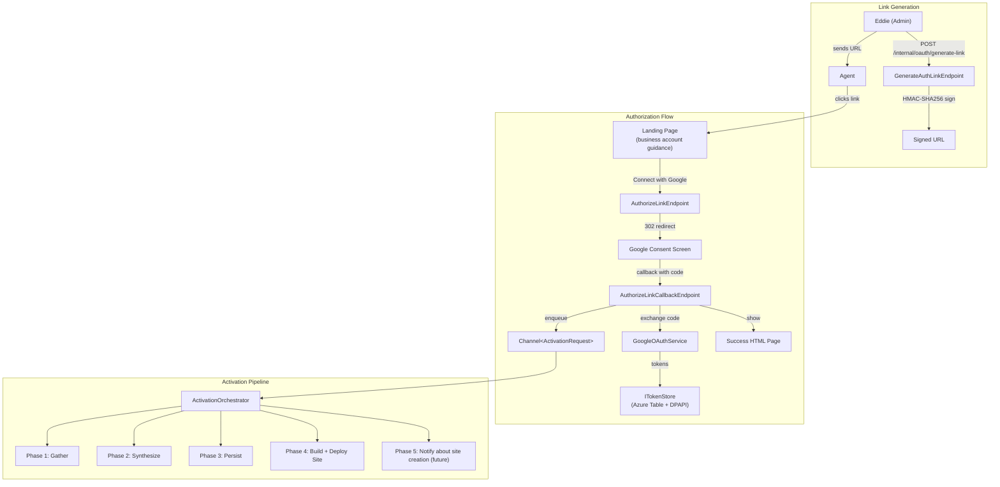

### Link Format

```
https://api.real-estate-star.com/oauth/google/authorize
  ?accountId=acme-realty
  &agentId=jane-doe
  &email=jane@gmail.com
  &exp=1743350400
  &sig=<hmac-sha256-hex>
```

**Signature payload:** `accountId.agentId.email.exp` (dot-separated, HMAC-SHA256 with `OAuthLink:Secret`)

### Endpoints

| Endpoint | Method | Purpose |
|----------|--------|---------|
| `/internal/oauth/generate-link` | POST | Generate a signed authorization URL |
| `/oauth/google/authorize` | GET | Validate link, show landing page with business account guidance |
| `/oauth/google/authorize/connect` | POST | Generate nonce, redirect to Google consent screen |
| `/oauth/google/authorize/callback` | GET | Handle Google callback, store tokens, show result |

### Authorization Flow

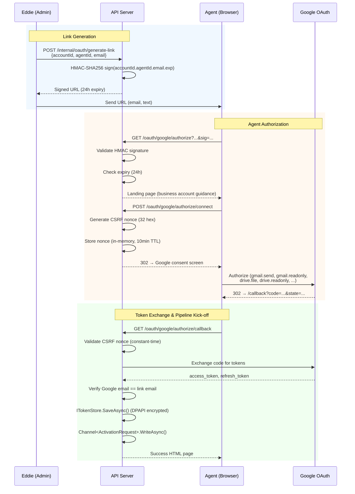

### Project Placement

No new projects. All components in existing projects:

| Component | Project | Location |
|-----------|---------|----------|
| `AuthorizationLinkState` record | `Domain` | `Shared/Models/AuthorizationLinkState.cs` |
| `GenerateAuthLinkEndpoint` | `Api` | `Features/OAuth/GenerateLink/` |
| `AuthorizeLinkEndpoint` | `Api` | `Features/OAuth/AuthorizeLink/` |
| `AuthorizeLinkCallbackEndpoint` | `Api` | `Features/OAuth/AuthorizeLink/` |
| `AuthorizationLinkService` | `Api` | `Features/OAuth/Services/` |

**Reused infrastructure:**
- `GoogleOAuthService` (Api) — token exchange + Google auth URL building
- `ITokenStore` / `AzureTableTokenStore` (Domain / Clients.Azure) — encrypted token persistence
- Rate limiting (Api) — new policies added

### CSRF Nonce Storage

`ConcurrentDictionary<string, AuthorizationLinkState>` in `AuthorizationLinkService`:

- Key: nonce (32 hex chars)
- Value: `AuthorizationLinkState` record (accountId, agentId, email, createdAt)
- TTL: 10 minutes (agent must complete Google consent within 10 min of clicking link)
- Cleanup: `Timer` fires every 5 minutes, purges expired entries
- Single-use: nonce deleted from dictionary after successful validation

### Configuration

```json
// appsettings.json
{
  "OAuthLink": {
    "Secret": "generated-secret-here",
    "ExpirationHours": 24
  }
}
```

`OAuthLink:Secret` is separate from `Hmac:HmacSecret`. Required at startup — throws `InvalidOperationException` if missing.

### User-Facing Copy

The agent sees **three pages** during the flow. All pages are simple branded HTML (Real Estate Star logo, clean typography, no framework).

**1. Landing Page** (shown after clicking the link, before Google redirect):

```
Connect Your Business Google Account

Hi {agentName},

Real Estate Star needs access to your business Google account to:
  • Send emails to leads on your behalf
  • Store documents in your Google Drive
  • Build your personalized communication style

⚠ Important: Please use your dedicated business Google account
  (e.g., jane@acmerealty.com), not a personal account.

  Using a personal account will mix personal emails with business
  communications and produce a less accurate profile of your
  professional voice.

  If you don't have a business Google account, ask your brokerage
  administrator to set one up before proceeding.

                    [ Connect with Google → ]
```

The "Connect with Google" button submits to a second endpoint that generates the nonce and redirects to Google. This makes the landing page a pure GET (no state mutation on link click).

**2. Success Page** (shown after successful authorization):

```
You're Connected!

{agentName}, your business Google account ({email}) is now linked
to Real Estate Star.

We're analyzing your email history and documents to build your
personalized communication profile. This runs in the background
and will be ready shortly.

You can close this tab.
```

**3. Error Page** (shown on failure — expired link, email mismatch, etc.):

```
Something Went Wrong

{contextual error message — e.g., "This link has expired.
Please request a new one from your administrator."}

If you used a personal Google account instead of your business
account, please request a new link and try again with your
business email.
```

**Email mismatch gets a specific message:**

```
Google Account Mismatch

You signed in with {googleEmail}, but this link was created for
{expectedEmail}.

Please sign out of Google, then click the link again and sign in
with your business account ({expectedEmail}).
```

## Observability

### Activation Pipeline Telemetry

Service name: `RealEstateStar.Activation`

**ActivitySource (distributed tracing):**

| Span | Parent | Layer | Tags |
|------|--------|-------|------|
| `activation.pipeline` | root | Orchestrator | `accountId`, `agentId`, `outcome` (completed/skipped/failed) |
| **Phase 1: Gather Workers** | | | |
| `activation.gather.email_fetch` | pipeline | Worker | `sent_count`, `inbox_count`, `signature_extracted` |
| `activation.gather.drive_index` | pipeline | Worker | `files_found`, `docs_read`, `folder_created`, `urls_found` |
| `activation.gather.agent_discovery` | pipeline | Worker | `headshot_found`, `logo_found`, `websites_found`, `whatsapp_enabled`, `reviews_count`, `ga4_found` |
| **Phase 2: Synthesis Workers** | | | |
| `activation.synthesis.voice` | pipeline | Worker | `email_count`, `confidence` (high/low) |
| `activation.synthesis.personality` | pipeline | Worker | `email_count`, `confidence` |
| `activation.synthesis.cma_style` | pipeline | Worker | `cma_docs_found`, `skipped` (bool) |
| `activation.synthesis.marketing` | pipeline | Worker | `marketing_emails_found`, `skipped` |
| `activation.synthesis.website_style` | pipeline | Worker | `sites_analyzed`, `skipped` |
| `activation.synthesis.pipeline_analysis` | pipeline | Worker | `deals_found`, `skipped` |
| `activation.synthesis.coaching` | pipeline | Worker | `recommendations_count`, `skipped` |
| `activation.synthesis.brand_extraction` | pipeline | Worker | `confidence`, `brokerage_site_found` |
| `activation.synthesis.brand_voice` | pipeline | Worker | `confidence`, `brokerage_site_found` |
| **Phase 3: Persist + Merge (Activities + Services)** | | | |
| `activation.persist.agent_profile` | pipeline | Activity | `files_written`, `account_json_generated` |
| `activation.persist.agent_config` | persist.agent_profile | Service | `fields_populated`, `fields_omitted` |
| `activation.brand_merge` | pipeline | Activity | `existing_brand_found`, `agents_merged_count` |
| `activation.brand_merge.service` | brand_merge | Service | `merge_strategy` (create/enrich), `claude_tokens` |
| **Phase 4: Notify (Service)** | | | |
| `activation.welcome_notification` | pipeline | Service | `channel` (whatsapp/email), `sent`, `draft_tokens` |
| **Checkpoints** | | | |
| `activation.checkpoint.save` | pipeline | — | `phase`, `checkpoint_size_bytes` |
| `activation.checkpoint.resume` | pipeline | — | `phase`, `skipped_steps` |
| `activation.skip_if_complete` | pipeline | — | `all_files_present`, `missing_files` |

**Meters (counters + histograms):**

| Metric | Type | Tags | Purpose |
|--------|------|------|---------|
| `activation.started` | Counter | `accountId` | Activations initiated |
| `activation.completed` | Counter | `accountId` | Successful completions |
| `activation.skipped` | Counter | `accountId` | Re-auth, all files present |
| `activation.failed` | Counter | `accountId`, `phase`, `component`, `error_code` | Failures by phase + component |
| `activation.duration_ms` | Histogram | `phase` (gather/synthesis/persist/merge/notify) | Phase-level latency |
| `activation.worker.duration_ms` | Histogram | `worker` | Per-worker latency |
| `activation.service.duration_ms` | Histogram | `service` | Per-service latency |
| `activation.claude_tokens_input` | Counter | `worker` | Input tokens per Claude call |
| `activation.claude_tokens_output` | Counter | `worker` | Output tokens per Claude call |
| `activation.claude_cost_cents` | Counter | `worker` | Estimated cost per worker |
| `activation.claude_cost_total_cents` | Counter | `agentId` | Total cost per agent activation |
| `activation.emails_fetched` | Counter | `type` (sent/inbox) | Emails gathered |
| `activation.drive_docs_read` | Counter | `doc_type` (cma/contract/marketing/other) | Drive docs by type |
| `activation.websites_scraped` | Counter | `source` (agent_site/zillow/brokerage) | Sites fetched |
| `activation.files_written` | Counter | `file_type` (voice/personality/brand/etc) | Outputs persisted |
| `activation.checkpoint_resumed` | Counter | `phase` | Checkpoint hits |
| `activation.low_confidence_output` | Counter | `worker` | Thin-data outputs |
| `activation.config_generated` | Counter | `accountId` | account.json auto-generated |
| `activation.welcome_sent` | Counter | `channel` (whatsapp/email) | Welcome notifications |

**Structured logging error codes:**

| Code | Layer | Meaning |
|------|-------|---------|
| `[ACTV-001]` | Orchestrator | Pipeline started |
| `[ACTV-002]` | Orchestrator | Pipeline skipped (all files present) |
| `[ACTV-003]` | Orchestrator | Pipeline completed |
| `[ACTV-010]` | Worker | Email fetch failed |
| `[ACTV-011]` | Worker | Drive index failed |
| `[ACTV-012]` | Worker | Agent discovery failed |
| `[ACTV-020]` | Worker | Voice extraction failed |
| `[ACTV-021]` | Worker | Personality extraction failed |
| `[ACTV-022]` | Worker | CMA style extraction failed |
| `[ACTV-023]` | Worker | Marketing style extraction failed |
| `[ACTV-024]` | Worker | Website style extraction failed |
| `[ACTV-025]` | Worker | Pipeline analysis failed |
| `[ACTV-026]` | Worker | Coaching analysis failed |
| `[ACTV-027]` | Worker | Brand extraction failed |
| `[ACTV-028]` | Worker | Brand voice extraction failed |
| `[ACTV-030]` | Activity | Brand merge activity failed |
| `[ACTV-031]` | Service | BrandMergeService Claude call failed |
| `[ACTV-040]` | Activity | PersistAgentProfile failed |
| `[ACTV-041]` | Service | AgentConfigService — account.json generation failed |
| `[ACTV-042]` | Service | AgentConfigService — content.json generation failed |
| `[ACTV-043]` | Service | AgentConfigService — schema validation failed |
| `[ACTV-050]` | Service | WelcomeNotificationService — WhatsApp send failed, falling back to email |
| `[ACTV-051]` | Service | WelcomeNotificationService — email send failed |
| `[ACTV-052]` | Service | WelcomeNotificationService — all channels failed |
| `[ACTV-060]` | Orchestrator | Checkpoint save failed |
| `[ACTV-061]` | Orchestrator | Checkpoint resume succeeded |
| `[ACTV-070]` | Worker | Worker skipped (insufficient data) |
| `[ACTV-071]` | Worker | Low confidence output produced |

### AgentContext Loading Telemetry

`IAgentContextLoader` telemetry — added to every communication drafter (LeadEmailDrafter, AgentNotifierService, CmaPdfGenerator, ConversationHandler):

Service name: `RealEstateStar.AgentContext`

| Metric | Type | Tags | Purpose |
|--------|------|------|---------|
| `agent_context.loaded` | Counter | `agentId`, `is_activated` | Context load attempts |
| `agent_context.voice_skill_loaded` | Counter | `agentId`, `loaded` (true/false) | Voice Skill availability |
| `agent_context.personality_skill_loaded` | Counter | `agentId`, `loaded` (true/false) | Personality Skill availability |
| `agent_context.brand_voice_loaded` | Counter | `agentId`, `loaded` (true/false) | Brand Voice availability |
| `agent_context.coaching_loaded` | Counter | `agentId`, `loaded` (true/false) | Coaching Report availability |
| `agent_context.branding_kit_loaded` | Counter | `agentId`, `loaded` (true/false) | Branding Kit availability |
| `agent_context.cma_style_loaded` | Counter | `agentId`, `loaded` (true/false) | CMA Style Guide availability |
| `agent_context.fallback_generic` | Counter | `agentId`, `missing_skill`, `reason` (not_found/load_error) | Fallback to generic tone |
| `agent_context.load_duration_ms` | Histogram | `agentId` | Context load latency |
| `agent_context.cache_hit` | Counter | `agentId` | Cache hits within pipeline run |

**Structured logging:**

| Code | Meaning |
|------|---------|
| `[CTX-001]` | Full AgentContext loaded successfully (all skills present) |
| `[CTX-002]` | Partial AgentContext loaded (some skills missing) |
| `[CTX-003]` | AgentContext not found — agent not activated, using generic tone |
| `[CTX-010]` | Voice Skill loaded |
| `[CTX-011]` | Voice Skill not found — fallback |
| `[CTX-012]` | Voice Skill load error — fallback |
| `[CTX-020]` | Personality Skill loaded |
| `[CTX-021]` | Personality Skill not found — fallback |
| `[CTX-022]` | Personality Skill load error — fallback |
| `[CTX-030]` | Brand Voice loaded |
| `[CTX-031]` | Brand Voice not found — agent tone only |
| `[CTX-032]` | Brand Voice load error — agent tone only |
| `[CTX-040]` | Coaching Report loaded (improvements applied to draft) |
| `[CTX-041]` | Coaching Report not found — drafting without coaching |
| `[CTX-050]` | Branding Kit loaded (colors, fonts, logo) |
| `[CTX-051]` | Branding Kit not found — using template defaults |
| `[CTX-060]` | CMA Style Guide loaded |
| `[CTX-061]` | CMA Style Guide not found — using default CMA layout |

### Grafana Dashboards

All dashboards live in the existing `RealEstateStar` Grafana Cloud org.

**Dashboard 1: Activation Pipeline Overview**

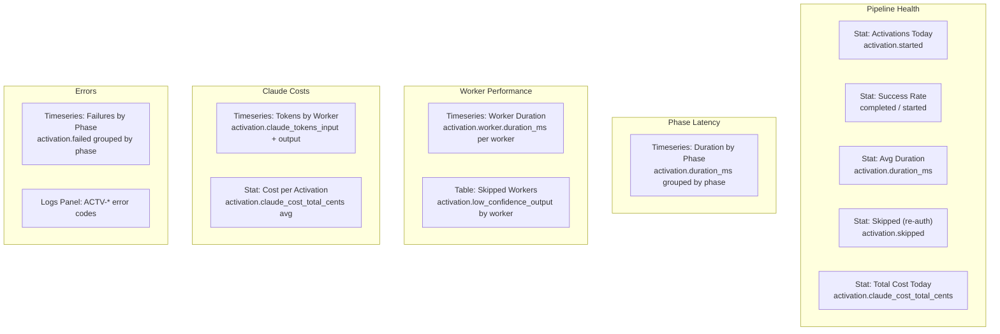

**Dashboard 2: Agent Context & Skills**

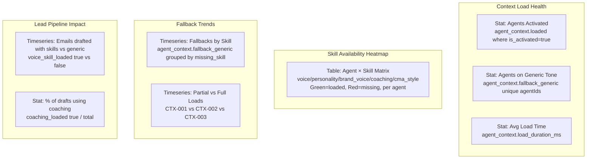

**Dashboard 3: Brand Intelligence**

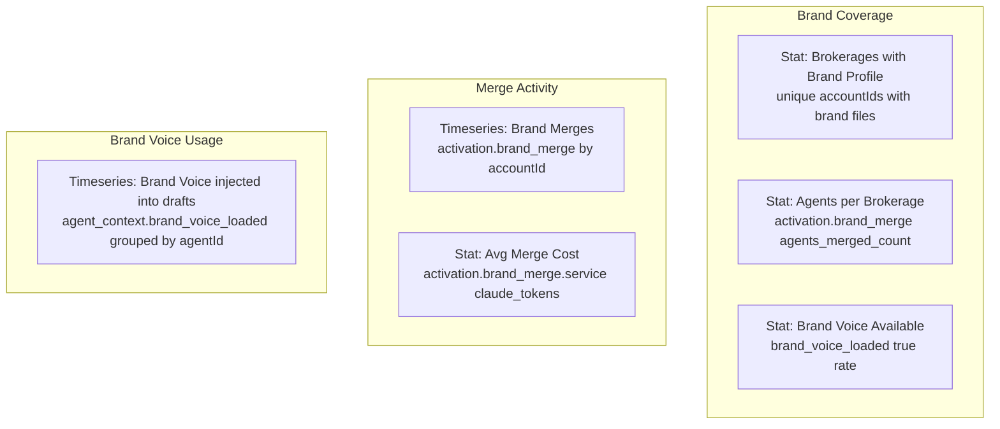

**Grafana alert rules:**

| Alert | Condition | Severity | Action |
|-------|-----------|----------|--------|
| Activation failed | `activation.failed` > 0 for 5min | Critical | Notify Eddie (Slack) |
| Agent stuck on generic | `agent_context.fallback_generic` > 10 in 1hr for same agentId | Warning | Agent needs activation |
| High Claude cost | `activation.claude_cost_total_cents` > 200 for single activation | Warning | Investigate token usage |
| Brand Voice missing | `agent_context.brand_voice_loaded` false rate > 50% for 1hr | Warning | Check brand merge pipeline |
| Welcome notification failed | `[ACTV-052]` logged | Critical | All channels failed — manual follow-up |
| Checkpoint loop | `activation.checkpoint_resumed` > 3 for same agentId in 1hr | Warning | Pipeline may be stuck in retry loop |
| Low confidence spike | `activation.low_confidence_output` > 5 in 1hr | Info | Review thin-data agents |

### OpenTelemetry Registration

All new ActivitySources and Meters registered in `Api/Diagnostics/OpenTelemetryExtensions.cs`:

```csharp
// Existing pattern — add these alongside existing sources
.AddSource("RealEstateStar.Activation")
.AddSource("RealEstateStar.AgentContext")
.AddMeter("RealEstateStar.Activation")
.AddMeter("RealEstateStar.AgentContext")
```

### Health Checks

Existing health checks in `Program.cs`:
- `/health/live` — liveness (always 200)
- `/health/ready` — readiness (OTLP, Claude API, Google Drive, Scraper, RentCast, Turnstile)
- `/health/workers` — background worker health

**New health checks for the activation pipeline:**

| Check | Tag | What it validates |
|-------|-----|-------------------|
| `ActivationOrchestratorHealthCheck` | `ready`, `workers` | `ActivationOrchestrator` BackgroundService is running and consuming from `Channel<ActivationRequest>` |
| `GmailReadHealthCheck` | `ready` | `IGmailReader` can authenticate and list messages (validates Gmail readonly scope works) |
| `OAuthLinkSecretHealthCheck` | `ready` | `OAuthLink:Secret` is configured and non-empty (startup guard, but also runtime check) |

**Updates to existing health checks:**
- `BackgroundServiceHealthCheck` — already checks all `IHostedService` instances. The `ActivationOrchestrator` registers as a `BackgroundService`, so it's automatically included. However, add a dedicated check for channel backpressure (queue depth > 100 = degraded)
- `GoogleDriveHealthCheck` — already exists. No change needed since Drive access uses the same `IOAuthRefresher` pipeline

**Health check implementation:**
```csharp
// ActivationOrchestratorHealthCheck
// - Healthy: orchestrator running, channel reader count < 100
// - Degraded: channel reader count > 100 (backpressure)
// - Unhealthy: orchestrator not running

// GmailReadHealthCheck
// - Healthy: can call Gmail API list with a test account
// - Degraded: slow response (> 5s)
// - Unhealthy: auth failure or API unreachable

// OAuthLinkSecretHealthCheck
// - Healthy: secret configured, length >= 32 chars
// - Unhealthy: missing or too short
```

**Registration in Program.cs:**
```csharp
builder.Services.AddHealthChecks()
    // ... existing checks ...
    .AddCheck<ActivationOrchestratorHealthCheck>("activation_orchestrator", tags: ["ready", "workers"])
    .AddCheck<GmailReadHealthCheck>("gmail_read", tags: ["ready"])
    .AddCheck<OAuthLinkSecretHealthCheck>("oauth_link_secret", tags: ["ready"]);
```

## Security

### Link Validation Flow

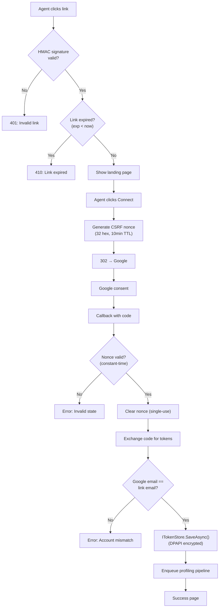

| Concern | Mitigation |
|---------|-----------|
| Link tampering | HMAC-SHA256 signature over all params; any change invalidates |
| Link expiry | 24-hour window via `exp` Unix timestamp |
| CSRF on Google callback | Cryptographic nonce in `state` param, constant-time comparison, single-use |
| Nonce leakage | In-memory only, 10-minute TTL, purged on use |
| Email mismatch | Google-authorized email compared to link `email` param (case-insensitive); reject on mismatch |
| Timing attacks | `CryptographicOperations.FixedTimeEquals()` for HMAC sig and nonce |
| Rate limiting | `oauth-link-generate`: 10/hr per IP; `oauth-link-authorize`: 5/hr per IP |
| Separate secrets | `OAuthLink:Secret` distinct from `Hmac:HmacSecret` |
| PII in URL | Email in query string — acceptable for single-use 24h link over HTTPS; not logged by API |

## Testing

### Unit Tests

| Test | Verifies |
|------|----------|
| Generate link — valid params → signed URL | HMAC signature is deterministic and round-trips |
| Generate link — missing params → 400 | Validation rejects empty accountId/agentId/email |
| Validate signature — correct sig passes | Round-trip: generate then validate |
| Validate signature — tampered param rejects | Changing any param → signature mismatch |
| Validate signature — expired link rejects | `exp` in the past → 410 Gone |
| Re-authorize — existing token overwritten | Agent with existing token → new token replaces old |
| Authorize flow — nonce verified | Correct nonce passes, wrong nonce rejects |
| Authorize flow — nonce single-use | Second attempt with same nonce fails |
| Authorize flow — nonce expired | 10-minute TTL enforced |
| Callback — email mismatch rejects | Google email ≠ link email → error page |
| Callback — success stores token | `ITokenStore.SaveAsync` called with correct accountId + agentId |
| Success page — HTML encoded | Agent name in response is HTML-safe |

### Integration Test

Full flow: generate link → hit authorize endpoint → mock Google token exchange → verify token stored in `ITokenStore`.

## Activation Pipeline

After tokens are stored, the callback endpoint enqueues a message on `Channel<ActivationRequest>`. The `ActivationOrchestrator` picks it up and coordinates the pipeline. The agent sees the success page immediately.

### Pipeline Overview

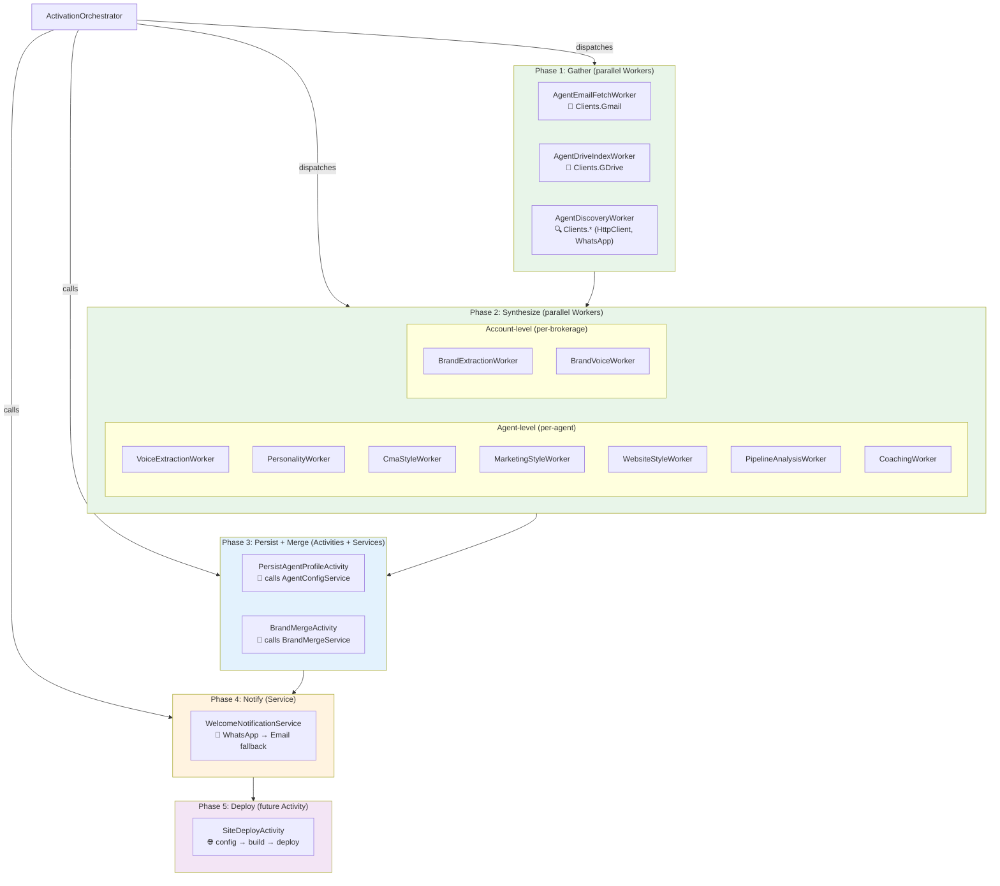

**Color legend:** Green = Workers (pure compute), Blue = Activities (persist), Orange = Services (business logic), Purple = Future

### Data Flow

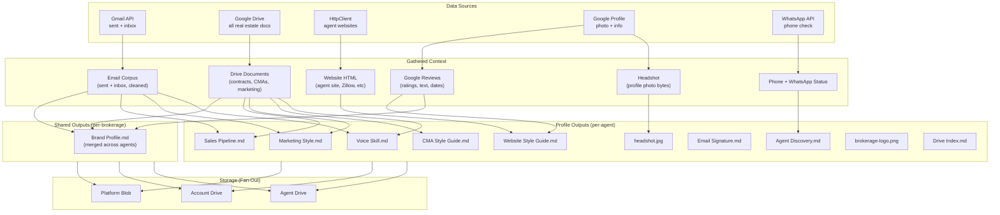

### Core Philosophy: Discovery, Not Creation

The activation pipeline is a **discovery** phase. Agents already have leads in Gmail (buyer/seller inquiries), files in Drive (contracts, CMAs, listing docs), and an online presence (website, social media). We don't ask them to re-enter anything.

**The agent's Google Drive is the canonical store.** Our platform blob storage is a fan-out fallback copy, not the source of truth. All artifacts we create (Lead Profiles, CMA Reports, Brand Voice) are written TO the agent's Drive first, then fan-out copied to platform storage.

**What we discover vs what we create:**

| Source | We discover | We create |
|--------|-------------|-----------|
| Gmail | Lead emails, communication style, response patterns | Lead Profile.md per discovered lead |
| Drive | Existing CMAs, contracts, listing docs | Drive Index.md, organized folder structure |
| Website | Branding, bio, testimonials, listings | Website Style Guide.md, Brand Profile.md |
| Google Profile | Headshot, reviews | headshot.jpg, review analysis |

### Orchestrator Design

Follows the project's orchestrator pattern — thin coordinator that dispatches Workers and calls Activities:

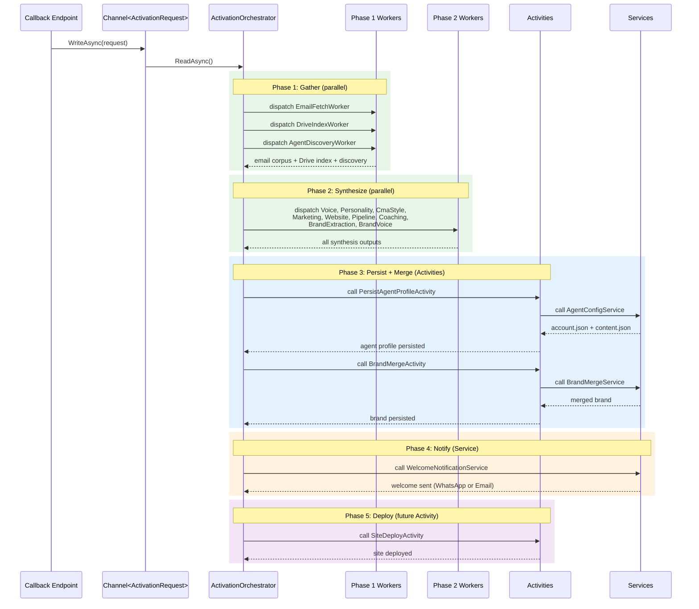

Detailed orchestrator flow (ASCII reference):

```
AuthorizeLinkCallbackEndpoint
  └─ Channel<ActivationRequest>.Writer.WriteAsync(...)
       │
ActivationOrchestrator (BackgroundService, reads from channel)
  │
  │  ── Phase 1: Data Gathering (parallel workers) ──────────
  │
  ├─ 1a. dispatch → AgentEmailFetchWorker (pure compute)
  │     └─ Fetch last 100 sent + 100 inbox emails via IGmailReader
  │     └─ Extract email signature FIRST (most common sig block across sent emails)
  │     │   └─ Parse structured data: name, title, phone, license #, brokerage,
  │     │       social links, headshot URL, website URL, logo URL
  │     │   └─ Save as EmailSignature artifact — high-confidence contact data
  │     └─ THEN strip signatures, quoted replies, boilerplate from corpus
  │     └─ Return: cleaned sent corpus + inbox thread corpus + EmailSignature
  │
  ├─ 1b. dispatch → AgentDriveIndexWorker (pure compute)
  │     └─ List + read all real estate docs in agent's Drive
  │     └─ Collect website URLs from docs
  │     └─ Find or create "real-estate-star" folder
  │     └─ Return: DriveIndex (folder ID, catalog, contents, URLs)
  │
  ├─ 1c. dispatch → AgentDiscoveryWorker (pure compute)
  │     └─ Download Google profile photo (headshot)
  │     └─ Download brokerage logo (from email sig image URL, website favicon/header, or Drive)
  │     └─ Extract phone from profile + email signatures
  │     └─ Scan sigs + Drive docs + web search for website URLs
  │     │   (include brokerage main website — about, culture, values, mission)
  │     └─ Fetch discovered websites via plain HttpClient (no ScraperAPI)
  │     │   └─ Agent's personal site
  │     │   └─ Brokerage website (home, about, team, culture pages)
  │     │       → rich source for brand voice, values, mission, positioning
  │     └─ Fetch 3rd-party agent profiles:
  │     │   └─ Zillow — agent profile page, recent sales, reviews, ratings
  │     │   └─ Realtor.com — agent profile, active listings, sold listings
  │     │   └─ Homes.com — agent profile if present
  │     │   └─ Compass/KW/RE/MAX team pages — if agent is on a team
  │     │   └─ For each profile, extract:
  │     │       - Bio / about text
  │     │       - Review count + average rating per platform
  │     │       - Full review text (all reviews, not just featured)
  │     │         → feeds into content.json testimonials
  │     │         → feeds into Coaching Report (client satisfaction patterns)
  │     │       - Recent sold listings (address, price, date, beds/baths/sqft, photo URL)
  │     │       - Active/featured listings (address, list price, status, photo URL, MLS#)
  │     │       - Total sales count + volume
  │     │       - Specialties / designations listed
  │     │       - Service areas listed
  │     │       - Years of experience
  │     │       - Profile photo (cross-reference with Google headshot)
  │     │   └─ Combine Google Business reviews + Zillow reviews + Realtor.com
  │     │       reviews into a unified review corpus (deduplicated, sourced)
  │     │   └─ Store as ThirdPartyProfiles artifact
  │     └─ Extract Google Analytics keys (GA4 measurement IDs like G-XXXXXXX)
  │     │   from website HTML — check for gtag.js, Google Tag Manager, or
  │     │   inline GA snippets. These become the agent's BYOK analytics
  │     │   keys for their Real Estate Star agent site
  │     └─ Pull Google Business reviews if available
  │     │   └─ Search for agent/brokerage Google Business Profile
  │     │   └─ Fetch customer reviews (text, rating, date)
  │     │   └─ Feeds into brand profile + website testimonials
  │     └─ Check WhatsApp status (IWhatsAppClient)
  │     └─ Return: AgentDiscovery (headshot, phone, HTML, reviews,
  │         GA4 keys, WhatsApp status)
  │
  │  ── Phase 2: Synthesis (parallel Workers) ────────────────
  │  All workers receive the full gathered context from Phase 1.
  │  Workers are pure compute — call Clients.Anthropic only.
  │  Orchestrator dispatches ALL of them directly.
  │
  ├─ 2a. dispatch → BrandingDiscoveryWorker
  │     └─ Input: website HTML (agent + brokerage), email sigs, Drive docs,
  │     │   brokerage logo bytes
  │     └─ Extract branding assets:
  │     │   - Primary, secondary, accent colors (from CSS, inline styles, meta theme-color)
  │     │   - Font families (from CSS @font-face, Google Fonts links, font-family declarations)
  │     │   - Logo variations (full logo, icon/favicon, email sig logo — download all)
  │     │   - Color palette context (which colors are used for what — headers, CTAs, text, bg)
  │     │   - Typography hierarchy (heading font vs body font vs accent font)
  │     │   - Brand imagery style (photo treatments, overlays, gradients)
  │     └─ Cross-reference: if agent site and brokerage site have different colors,
  │     │   note both and flag which is the brokerage standard
  │     └─ Return: BrandingKit (colors, fonts, logo bytes, palette context)
  ├─ 2b. dispatch → VoiceExtractionWorker
  │     └─ emails + Drive docs + 3rd party bios → Claude → Voice Skill markdown
  ├─ 2b. dispatch → PersonalityWorker
  │     └─ emails + Drive docs + reviews → Claude → Personality Skill markdown
  ├─ 2c. dispatch → CmaStyleWorker
  │     └─ CMA docs from Drive → Claude → CMA Style Guide markdown
  │     └─ Skip if no CMA docs found
  ├─ 2d. dispatch → MarketingStyleWorker
  │     └─ marketing emails + Drive → Claude → Marketing Style markdown
  │     └─ Also returns brand-relevant signals (passed to merge)
  ├─ 2e. dispatch → WebsiteStyleWorker
  │     └─ scraped HTML → Claude → Website Style Guide markdown
  │     └─ Skip if no websites found
  ├─ 2f. dispatch → PipelineAnalysisWorker
  │     └─ inbox + sent + Drive → Claude → Sales Pipeline markdown
  ├─ 2g. dispatch → ComplianceAnalysisWorker
  │     └─ Input: email footers/disclaimers, Drive docs (contracts, disclosures),
  │     │   agent website legal pages, brokerage website legal/privacy pages,
  │     │   3rd party profile disclaimers
  │     └─ Claude extracts all legal/compliance language the agent currently uses:
  │     │   - Email disclaimers (confidentiality, fair housing, licensing)
  │     │   - Website privacy policy language
  │     │   - Website terms of service language
  │     │   - Cookie consent patterns
  │     │   - Equal housing / fair housing notices
  │     │   - Brokerage-required legal disclosures
  │     │   - State-specific disclosure requirements
  │     │   - MLS disclaimers and IDX attribution
  │     │   - Commission/compensation disclosures (post-NAR settlement)
  │     └─ Cross-reference against our standard language:
  │     │   - packages/legal/ (EqualHousingNotice, CookieConsent, LegalPageLayout)
  │     │   - account.json compliance.disclosure_requirements
  │     │   - State-specific requirements for agent's location.state
  │     └─ Produce delta report:
  │     │   - What the agent has that we DON'T → flag for review (may need to adopt)
  │     │   - What we have that the agent DOESN'T → flag for agent site (must include)
  │     │   - Wording differences → note the agent's preferred phrasing
  │     │   - Missing compliance items → risk flags
  │     └─ Return Compliance Analysis markdown
  ├─ 2h. dispatch → CoachingWorker
  │     └─ all context (including fee/commission signals) → Claude → Coaching Report
  │     └─ Fee-related coaching: commission negotiation patterns, whether
  │     │   they're leaving money on the table, how their rates compare
  │     │   to typical market rates, split optimization opportunities
  ├─ 2h. dispatch → BrandExtractionWorker
  │     └─ emails + Drive + brokerage website HTML → Claude → raw brand signals
  │     └─ Returns brand data (NOT persisted yet)
  ├─ 2i. dispatch → BrandVoiceWorker
  │     └─ emails + Drive + brokerage website HTML → Claude → raw brand voice signals
  │     └─ Returns voice data (NOT persisted yet)
  ├─ 2j. dispatch → FeeStructureWorker
  │     └─ emails (commission threads) + Drive (contracts, listing agreements)
  │     │   + website (fee pages) → Claude → Fee Structure markdown
  │     └─ Extracts: commission rates, brokerage split, fee model,
  │     │   negotiation patterns, earnest money, closing cost allocation
  │     └─ Skip if no commission/fee references found
  │     └─ Stored but NOT wired into communications — intelligence only
  │
  │  ── Phase 3: Persist + Merge (Activities calling Services) ──
  │
  ├─ 3a. call → PersistAgentProfileActivity
  │     └─ Write all per-agent outputs to real-estate-star/{agentId}/
  │     │   via IFileStorageProvider (fan-out):
  │     │   Voice Skill.md, Personality Skill.md, CMA Style Guide.md,
  │     │   Marketing Style.md, Website Style Guide.md, Sales Pipeline.md,
  │     │   Coaching Report.md, Drive Index.md, Agent Discovery.md,
  │     │   Email Signature.md, headshot.jpg, brokerage-logo.png
  │     └─ calls → AgentConfigService (Service)
  │           └─ Detects single-agent vs brokerage case from the link params:
  │           │   If accountId == agentId → SINGLE AGENT case
  │           │   If accountId != agentId → BROKERAGE case
  │           │
  │           │   ── SINGLE AGENT (accountId == agentId) ──────────
  │           │   Generate: config/accounts/{handle}/account.json
  │           │     (contains both brokerage + agent info, like jenise-buckalew)
  │           │   Generate: config/accounts/{handle}/content.json
  │           │
  │           │   ── BROKERAGE: FIRST AGENT (accountId != agentId,
  │           │      no account.json exists yet) ──────────────────
  │           │   Step 1: Bootstrap brokerage-level config
  │           │     Generate: config/accounts/{accountId}/account.json
  │           │       - handle, accountId, template (brokerage-wide)
  │           │       - branding.* (from Branding Kit — brokerage colors/fonts)
  │           │       - brokerage.* (name, license, office, address)
  │           │       - broker.* (owner/managing broker if discoverable)
  │           │       - location.* (brokerage service area)
  │           │       - NO agent section (agents are nested)
  │           │     Generate: config/accounts/{accountId}/content.json
  │           │       - Brokerage homepage content (team overview, brand story)
  │           │   Step 2: Create agent under brokerage
  │           │     Generate: config/accounts/{accountId}/agents/{agentId}/config.json
  │           │       - id, name, title, phone, email, headshot_url
  │           │       - license_number, languages, tagline, credentials
  │           │       - (lightweight — inherits brokerage branding/compliance)
  │           │     Generate: config/accounts/{accountId}/agents/{agentId}/content.json
  │           │       - Agent-specific page content (hero, stats, gallery, testimonials)
  │           │
  │           │   ── BROKERAGE: SUBSEQUENT AGENT (accountId != agentId,
  │           │      account.json already exists) ─────────────────
  │           │   Skip brokerage-level config (already exists)
  │           │   Create agent under existing brokerage:
  │           │     Generate: config/accounts/{accountId}/agents/{agentId}/config.json
  │           │     Generate: config/accounts/{accountId}/agents/{agentId}/content.json
  │           │
  │           │   Config file details below:
  │           │
  │           └─ Generate account.json / config.json fields:
  │           │
  │           │   === Agent Identity ===
  │           │   agent.name → Google profile name
  │           │   agent.email → from OAuth link (verified by Google)
  │           │   agent.phone → email sig (is_preferred=true for cell)
  │           │   agent.headshot_url → Google profile photo path
  │           │   agent.title → email sig ("REALTOR®", "Broker Associate", etc.)
  │           │   agent.id → agentId from link
  │           │   agent.license_number → (searched aggressively — compliance critical)
  │           │     1. Email signature (most common location)
  │           │     2. Zillow/Realtor.com profile (usually listed)
  │           │     3. Drive docs (listing agreements, contracts)
  │           │     4. Brokerage website team page
  │           │     5. State licensing board lookup (by name + brokerage)
  │           │   agent.tagline → existing website headline or email sig
  │           │   agent.languages → (searched broadly — key differentiator)
  │           │     1. Email signature ("Se Habla Español", "Falamos Português")
  │           │     2. 3rd party bios (Zillow "Languages" field)
  │           │     3. Website (language toggles, multilingual pages, copy in other languages)
  │           │     4. Email corpus (emails written in other languages)
  │           │     5. Google Business profile (languages listed)
  │           │     If multilingual: also note fluency level if discernible
  │           │       (e.g., "Spanish" vs "Basic Spanish")
  │           │   agent.credentials → 3rd party profiles (awards, designations)
  │           │
  │           │   === Brokerage ===
  │           │   brokerage.name → email sig, 3rd party profiles, Drive docs
  │           │   brokerage.license_number → email sig, Drive docs
  │           │   brokerage.office_phone → brokerage website, Google Business
  │           │   brokerage.office_address → brokerage website, Google Business
  │           │
  │           │   === Location ===
  │           │   location.state → from office address, email sig, 3rd party profiles
  │           │   location.service_areas → 3rd party profiles, Google Business, sold listings
  │           │
  │           │   === Branding (from Branding Kit) ===
  │           │   branding.primary_color → Branding Kit palette
  │           │   branding.secondary_color → Branding Kit palette
  │           │   branding.accent_color → Branding Kit palette
  │           │   branding.font_family → Branding Kit typography
  │           │   branding.logo_url → path to brokerage-logo.png in Drive folder
  │           │
  │           │   === Contact Info (all discovered, ranked by preference) ===
  │           │   contact_info[] → aggregated from all sources:
  │           │     - Cell phone (is_preferred=true if used most in emails)
  │           │     - Office phone + ext (from brokerage info)
  │           │     - Email (from OAuth)
  │           │     - Preference detection: which contact method the agent
  │           │       uses most in their email signatures and website CTAs
  │           │       determines is_preferred flag
  │           │
  │           │   === Integrations ===
  │           │   integrations.email_provider → "gmail" (they just OAuth'd)
  │           │   integrations.ga4MeasurementId → from website HTML (gtag.js / GTM)
  │           │   integrations.custom_domain → detected from agent's existing website
  │           │     (e.g., "jenisesellsnj.com" → store for future DNS setup)
  │           │   integrations.whatsapp.phone_number → if WhatsApp detected
  │           │
  │           │   === Compliance (from ComplianceAnalysisWorker) ===
  │           │   compliance.state_form → state-specific form ID for agent's state
  │           │   compliance.licensing_body → derived from state
  │           │   compliance.disclosure_requirements → state-specific + agent-specific
  │           │
  │           │   === Template Recommendation ===
  │           │   template → intelligent selection based on:
  │           │     - Sold listing patterns (property types, neighborhoods, price range)
  │           │       e.g., lots of beach homes → "coastal-living"
  │           │       e.g., luxury properties → "obsidian-luxury"
  │           │       e.g., first-time buyers → "fresh-start"
  │           │       e.g., suburban family homes → "emerald-classic"
  │           │     - Branding Kit colors/fonts (dark palette → dark template)
  │           │     - Market positioning from Brand Profile
  │           │     - Agent's existing website style (if found)
  │           │     - Service area character (urban / suburban / coastal / rural)
  │           │
  │           │   === Metadata ===
  │           │   handle → agentId from link
  │           │   accountId → from link
  │           └─ Generate content.json — field-by-field source mapping:
  │               hero.headline → Claude drafts from Voice Skill tone + brand positioning
  │               hero.highlight_word → extracted from agent's most-used power word
  │               hero.tagline → agent.tagline from account.json (from email sig or website)
  │               hero.body → Claude drafts from 3rd party bios + email voice + credentials
  │               hero.cta_text → from Coaching Report (strongest CTA pattern observed)
  │               stats.items → 3rd party profiles:
  │                 - "{N}+ Homes Sold" → Zillow/Realtor.com recent sales count
  │                 - "{X} ★ Zillow Rating ({N} Reviews)" → Zillow profile
  │                 - "{Award}" → credentials from 3rd party bios or email sig
  │                 - "{N}+ Years Experience" → Zillow/Realtor.com profile
  │                 - "${low}–${high}" → price range from recent sales
  │               features.items → Claude generates from:
  │                 - Services mentioned in 3rd party bios
  │                 - Patterns from Marketing Style (what they promote)
  │                 - Specialties from Zillow/Realtor.com profiles
  │                 - Languages from email sigs or profile
  │               steps → template defaults (consistent across agents)
  │               gallery.items (Recently Sold) → from Zillow/Realtor.com:
  │                 - Pull last 6-10 sold listings (most recent first)
  │                 - address, city, state, price, sale date
  │                 - beds, baths, sqft (if available from listing data)
  │                 - image_url: listing photo from Zillow/Realtor.com
  │                   (download and store in real-estate-star/{agentId}/sold/)
  │                 - Sorted by sale date (newest first)
  │               featured_listings.items (Active/Featured) → from Zillow/Realtor.com:
  │                 - Pull all currently active listings for this agent
  │                 - address, city, state, list_price, days_on_market
  │                 - beds, baths, sqft, lot_size
  │                 - image_url: primary listing photo (download + store in
  │                   real-estate-star/{agentId}/listings/)
  │                 - listing_url: link to full listing on Zillow/Realtor.com
  │                 - status: "Active" / "Under Contract" / "Coming Soon"
  │                 - MLS number (if visible)
  │                 - Refreshed on each site build (listings change frequently)
  │               testimonials.items → unified reviews from:
  │                 - Zillow reviews (full text, reviewer, rating, source="Zillow")
  │                 - Realtor.com reviews (source="Realtor.com")
  │                 - Google Business reviews (source="Google")
  │                 - Best reviews selected by Claude (highest impact, most specific)
  │               contact_form → template defaults + agent name/context
  │               about.bio → Claude drafts from:
  │                 - 3rd party bios (Zillow, Realtor.com — richest source)
  │                 - Email patterns (how they describe themselves)
  │                 - Brokerage info (office locations, brand association)
  │                 - Credentials and awards
  │               about.credentials → aggregated from all sources:
  │                 - License from email sig / Drive docs
  │                 - Awards from 3rd party profiles
  │                 - Sales milestones from Zillow/Realtor.com
  │                 - Languages from email sig / profile
  │               thank_you → template defaults + agent name
  │
  ├─ 3b. call → BrandMergeActivity
  │     └─ calls → BrandMergeService (Service)
  │     │     └─ Input: raw brand signals + brand voice signals + marketing signals
  │     │     └─ Read existing Brand Profile.md + Brand Voice.md from
  │     │     │   real-estate-star/{accountId}/ (if they exist)
  │     │     └─ Claude merges existing + new signals
  │     └─ Write Brand Profile.md + Brand Voice.md to
  │     │   real-estate-star/{accountId}/ via IFileStorageProvider (fan-out)
  │     └─ This is the ONLY place that reads + writes brand files
  │         (single writer prevents concurrent clobber)
  │
  │  ── Phase 4: Notify (Service) ───────────────────────────
  │
  ├─ 4. calls → WelcomeNotificationService
  │     └─ Send welcome message with channel fallback:
  │     │   1. WhatsApp (if AgentDiscoveryWorker flagged WhatsApp-enabled)
  │     │   2. Email via Gmail (always available — they just OAuth'd)
  │     └─ Message drafted using Voice Skill + Personality Skill
  │     │   (the agent's first taste of personalized AI comms)
  │     └─ Goal: WOW the agent. Short, punchy, impressive. NOT a deep dive.
  │     └─ Content strategy:
  │     │   - Open with one of THEIR catchphrases (from Voice Skill)
  │     │   - 1-2 sentence brand synthesis ("We see {brokerage} is all about
  │     │     {value proposition} — love that.")
  │     │   - Quick pipeline insight ("Looks like you've got {N} deals in
  │     │     motion right now — we can help you close them faster.")
  │     │   - 1 sharp coaching tip — the easiest quick win from Coaching
  │     │     Report, framed as a teaser ("Did you know responding to leads
  │     │     in under 5 minutes doubles your close rate? We can automate
  │     │     that for you.")
  │     │   - Agent site URL depends on account type:
  │     │     Single agent: https://{handle}.real-estate-star.com
  │     │     Brokerage agent: https://{handle}.real-estate-star.com/agents/{agentId}
  │     │   - Close with their own sign-off style
  │     │   - Keep it under 150 words. Leave them wanting more.
  │     └─ Idempotent — tracks whether welcome was already sent
  │
  └─ 5. call → SiteDeployActivity (future — SiteDeployService)
        └─ Write agent config + content JSON to disk
        └─ next build → opennextjs-cloudflare build → wrangler pages deploy
        └─ Agent site live at {handle}.real-estate-star.com
  │
  └─ 6. (future) call → NotifyActivity
        └─ Email to agent with their new site URL
        └─ Welcome email to agent with site URL
        └─ Welcome email to agent
```

**Key design decisions:**
- **Orchestrator dispatches ALL workers directly** — no Activity-calls-Worker pattern. The orchestrator is the single coordinator
- **Workers are pure compute** — call Clients only (Gmail, GDrive, Anthropic, HttpClient, WhatsApp). NO storage, NO DataServices
- **Activities persist via DataServices** and call Services for business logic. Launched by Orchestrator ONLY
- **Services handle sync business logic** — AgentConfigService generates configs, BrandMergeService runs Claude merge, WelcomeNotificationService sends via Clients. Services CANNOT call Activities or Workers
- Phase 1 (3 gather workers) runs **in parallel** (independent I/O)
- Phase 2 (9 synthesis workers) runs **in parallel** (all consume same gathered context)
- Phase 3 merge runs **sequentially** after both activities complete — it needs agent marketing signals to enrich the brand
- Workers remain **pure compute** — no storage. Only Activities persist via DataServices
- Each Activity has its own PersistActivity for writes — agent-level and account-level storage are separate concerns

### Graceful Degradation (Low-Data Agents)

Not every agent will have 100 sent emails, a populated Drive, or an existing website. The pipeline must handle thin data gracefully — produce what it can, skip what it can't, and never fail because of missing data.

**Data thresholds and behavior:**

| Source | Minimum for analysis | Below threshold behavior |
|--------|---------------------|------------------------|
| Sent emails | 5 | < 5: Voice Skill uses industry defaults + whatever is available. Flag as "low confidence" in output |
| Inbox emails | 5 | < 5: Sales Pipeline marked "insufficient data". Skip CoachingWorker |
| Drive docs | 0 | Empty Drive is fine — skip CMA Style, mark Drive Index as "no documents found" |
| Existing website | 0 | No website is fine — skip WebsiteStyleWorker entirely |
| Google reviews | 0 | No reviews is fine — omit testimonials section from content.json |
| Brokerage website | 0 | No brokerage site found — Brand Voice relies on emails + docs only |

**Per-worker failsafe behavior:**
- **VoiceExtractionWorker:** Always runs. With < 5 emails, outputs a minimal Voice Skill with "Low confidence — based on {N} emails. Profile will improve as the agent sends more emails through Real Estate Star."
- **PersonalityWorker:** Always runs. With < 5 emails, outputs minimal personality profile with industry-default temperament and "low confidence" flag. Even a few emails reveal something about communication style
- **CmaStyleWorker:** Skipped if no CMA documents found in Drive. No CMA Style Guide written (optional file)
- **MarketingStyleWorker:** Skipped if no marketing emails detected. No Marketing Style written. Brand merge proceeds without marketing signals
- **WebsiteStyleWorker:** Skipped if no websites discovered. No Website Style Guide written (optional file)
- **PipelineAnalysisWorker:** With < 5 inbox emails, outputs "Insufficient email history to map pipeline. Will update after Real Estate Star processes the first few leads."
- **CoachingWorker:** Skipped entirely if < 5 sent + < 5 inbox emails. Not enough data to coach on
- **BrandExtractionWorker / BrandVoiceWorker:** Always run. With thin data, lean heavily on brokerage website (if found). Output marked "low confidence" if based on < 10 total data points
- **account.json generation:** Always generated. Fields with no data source are omitted (not populated with guesses). Schema validation ensures only real data goes in

**The key principle:** Better to produce a thin-but-accurate profile than a rich-but-fabricated one. Low-confidence outputs are honest about their limitations and improve over time as the agent uses the platform.

### Resiliency & Cost Optimization Summary

The activation pipeline has three layers of protection against wasted compute:

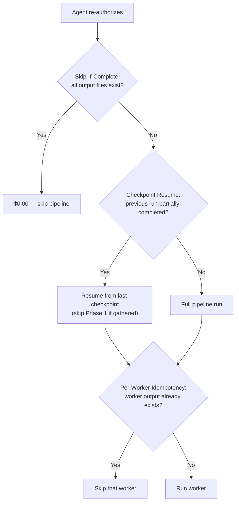

### Layer 1: Skip-If-Complete (Re-Authorization Guard)

First thing the orchestrator does on every activation. **Cost: 1 IFileStorageProvider read (free).**

```
Read real-estate-star/{agentId}/ via IFileStorageProvider

Required files:
  - Voice Skill.md
  - Personality Skill.md
  - Marketing Style.md
  - Sales Pipeline.md
  - Coaching Report.md
  - Agent Discovery.md
  - Branding Kit.md
  - Email Signature.md
  - headshot.jpg
  - Drive Index.md

Required account files (real-estate-star/{accountId}/):
  - Brand Profile.md
  - Brand Voice.md

If ALL required files exist:
  → SKIP entire pipeline ($0.00 Claude cost)
  → Log [ACTV-002] "Agent {agentId} already activated. No work needed."
  → Still call WelcomeNotificationService (idempotent — checks sent flag)

If ANY required file is missing:
  → Clear ALL checkpoints
  → Full re-run from Phase 1 (start fresh)
  → No partial recovery — rebuild everything for consistency
```

**Optional files** (CMA Style Guide, Website Style Guide) are not checked — their absence may mean the agent has no CMAs or no website. The Drive Index records what was found, so we know whether those files were intentionally skipped.

### Layer 2: Checkpoint Pattern (Internal Retry Resilience)

Within a single pipeline run, each phase persists a checkpoint before proceeding. If the pipeline fails mid-run and retries (up to 3x), it resumes from the last checkpoint instead of re-doing expensive work.

```
real-estate-star/{agentId}/activation/
  ├── checkpoint-phase1-gather.json     (corpus hash + file counts)
  ├── checkpoint-phase2-synthesis.json  (per-worker completion status + output hashes)
  ├── checkpoint-phase3-persist.json    (files written)
  └── checkpoint-phase3-merge.json      (brand merge completed)
```

**Retry behavior within a single run:**

| Failure point | What gets skipped on retry | Claude cost saved |
|---------------|---------------------------|-------------------|
| Phase 2 worker fails after Phase 1 | Phase 1 (email fetch + Drive index + discovery) | $0.00 (no Claude in Phase 1) but saves ~30s of API calls |
| Phase 2: 5 of 9 workers complete, 4 fail | The 5 completed workers | ~$0.25-0.50 per skipped worker |
| Phase 3 persist fails | Phase 1 + Phase 2 (all synthesis) | ~$0.50-1.50 (entire Claude spend) |
| Phase 3 brand merge fails | Phase 1 + Phase 2 + agent persist | ~$0.50-1.50 |

**Checkpoint-phase2-synthesis.json format:**
```json
{
  "corpusHash": "sha256:abc123...",
  "workers": {
    "voice": { "status": "completed", "outputHash": "sha256:def456..." },
    "personality": { "status": "completed", "outputHash": "sha256:ghi789..." },
    "cmaStyle": { "status": "skipped", "reason": "no_cma_docs" },
    "marketing": { "status": "failed", "error": "ACTV-023", "retries": 1 },
    "websiteStyle": { "status": "pending" },
    ...
  }
}
```

On retry, only workers with status `failed` or `pending` are re-dispatched. Workers with `completed` are loaded from their saved output. Workers with `skipped` stay skipped.

**Checkpoints are transient** — cleared on pipeline completion. They are NOT output files.

### Layer 3: Per-Worker Idempotency

Each synthesis worker checks if its output already exists in the `real-estate-star` folder before calling Claude:

```csharp
// In every synthesis worker
var existing = await storage.ReadDocumentAsync(
    $"real-estate-star/{agentId}", "Voice Skill.md", ct);
if (existing is not null)
{
    logger.LogDebug("[ACTV-070] Voice Skill already exists, skipping");
    return existing; // Return cached output, $0.00 Claude cost
}
// Only call Claude if output doesn't exist
```

This protects against the edge case where checkpoints are lost but outputs were already written.

### Cost Estimate Per Activation

**Phase 1: Gather (no Claude cost)**

| Operation | API | Cost |
|-----------|-----|------|
| Fetch 100 sent emails | Gmail API | Free (quota-based) |
| Fetch 100 inbox emails | Gmail API | Free |
| List + read Drive docs | Drive API | Free |
| Download headshot | Google UserInfo | Free |
| Download brokerage logo | HttpClient | Free |
| Fetch agent website(s) | HttpClient | Free |
| Fetch brokerage website | HttpClient | Free |
| Google Business reviews | Places API | Free tier (may need API key) |
| WhatsApp status check | WhatsApp API | Free (lookup only) |
| **Phase 1 total** | | **$0.00** |

**Phase 2: Synthesis (Claude compute)**

Estimates based on Sonnet 4.6 pricing ($3/1M input, $15/1M output):

| Worker | Input tokens (est.) | Output tokens (est.) | Cost (est.) |
|--------|--------------------:|---------------------:|------------:|
| BrandingDiscoveryWorker | ~30K (CSS + HTML) | ~2K | $0.12 |
| VoiceExtractionWorker | ~50K (100 emails) | ~3K | $0.20 |
| PersonalityWorker | ~50K | ~2K | $0.18 |
| CmaStyleWorker | ~20K (CMA docs) | ~2K | $0.09 |
| MarketingStyleWorker | ~30K (marketing emails) | ~2K | $0.12 |
| WebsiteStyleWorker | ~40K (HTML) | ~2K | $0.15 |
| PipelineAnalysisWorker | ~50K (inbox + sent) | ~3K | $0.20 |
| CoachingWorker | ~60K (all context) | ~4K | $0.24 |
| BrandExtractionWorker | ~40K (emails + website) | ~2K | $0.15 |
| BrandVoiceWorker | ~40K (emails + website) | ~2K | $0.15 |
| **Phase 2 total** | **~410K input** | **~24K output** | **~$1.60** |

**Phase 3: Persist + Merge**

| Operation | Cost |
|-----------|------|
| Write ~12 files to Drive (fan-out) | Free |
| AgentConfigService (no Claude) | $0.00 |
| BrandMergeService (Claude merge) | ~$0.10-0.20 (existing brand + new signals) |
| **Phase 3 total** | **~$0.10-0.20** |

**Phase 4: Notify**

| Operation | Cost |
|-----------|------|
| WelcomeNotificationService (Claude draft) | ~$0.05 (short message) |
| WhatsApp or Gmail send | Free |
| **Phase 4 total** | **~$0.05** |

### Cost Summary

| Scenario | Claude Cost | API Cost | Total |
|----------|-----------|----------|-------|
| **First activation (full run)** | ~$1.85 | $0.00 | **~$1.85** |
| **Re-auth (all files present — skip)** | $0.00 | $0.00 | **$0.00** |
| **Re-auth (files missing — full re-run)** | ~$1.70 | $0.00 | **~$1.70** |
| **Retry after Phase 2 failure (5/9 workers done)** | ~$0.75 | $0.00 | **~$0.75** |
| **Second agent in brokerage** | ~$1.80 | $0.00 | **~$1.80** (brand merge adds ~$0.10) |
| **10-agent brokerage (total)** | ~$18.20 | $0.00 | **~$18.20** |

**Cost optimization levers:**
- **Model selection:** Use Haiku for low-complexity workers (CmaStyle, WebsiteStyle) → 3x cheaper. Use Sonnet for high-complexity (Voice, Personality, Coaching)
- **Prompt caching:** If multiple agents in a brokerage activate close together, the system prompt and brand context can be cached across calls
- **Corpus truncation:** Cap email corpus at ~30K tokens per worker. Most voice/personality signal is in the first 50 emails
- **Parallel batching:** All 9 Phase 2 workers run in parallel — wall-clock time is the slowest worker, not the sum

### Re-Runnability Guarantee

Every component in the pipeline is re-runnable with zero extra Claude cost:

| Component | Re-run behavior | Cost on re-run |
|-----------|----------------|----------------|
| Orchestrator | Skip-if-complete check first | $0.00 if all files present |
| Phase 1 Workers | Checkpoint resume skips if gathered | $0.00 (no Claude in Phase 1) |
| Phase 2 Workers | Checkpoint tracks per-worker status; skip completed | $0.00 per completed worker |
| Per-Worker | Idempotency check — output exists? skip | $0.00 |
| PersistAgentProfileActivity | Overwrites (idempotent) | $0.00 |
| BrandMergeActivity | Reads existing + merges (idempotent, additive) | ~$0.10-0.20 |
| WelcomeNotificationService | Tracks sent flag — skip if already sent | $0.00 |
| account.json generation | Skip if config already exists | $0.00 |

### The `real-estate-star` Folder

This is Real Estate Star's home in the agent's Google Drive. Everything the platform writes lives here.

**Discovery logic (in AgentDriveIndexWorker):**
1. Search root of agent's Drive for folder named `real-estate-star`
2. If found → select it, list and read its contents (existing profiles, prior outputs)
3. If not found → create it via `IGDriveClient.CreateFolderAsync()`
4. Return the folder ID + contents for downstream use

**Folder structure (over time):**
```
real-estate-star/                          (root folder in agent's Drive)
  ├── {agentId}/
  │   ├── Voice Skill.md                   (agent's persona profile)
  │   ├── CMA Style Guide.md              (agent's CMA look/feel/copy preferences)
  │   ├── Marketing Style.md              (agent's marketing email patterns)
  │   ├── Sales Pipeline.md               (current deals, stages, velocity)
  │   ├── Personality Skill.md             (temperament, EQ, relationship style)
  │   ├── Coaching Report.md              (close rate improvement recommendations)
  │   ├── Website Style Guide.md          (existing site look/feel analysis)
  │   ├── Branding Kit.md                 (colors, fonts, palette, template recommendation)
  │   ├── Compliance Analysis.md          (legal delta — agent's language vs our standard)
  │   ├── Fee Structure.md               (commission rates, splits — analysis only, not automated)
  │   ├── brokerage-icon.png              (favicon/icon variant)
  │   ├── Third Party Profiles.md          (Zillow, Realtor.com, Homes.com data)
  │   ├── Agent Discovery.md              (phone, social, WhatsApp, URLs)
  │   ├── headshot.jpg                     (Google profile photo)
  │   ├── Drive Index.md                   (catalog of Drive docs found)
  │   ├── sold/                            (recently sold listing photos)
  │   ├── listings/                        (active/featured listing photos)
  │   └── leads/                           (future: lead files)
  ├── {accountId}/
  │   ├── Brand Profile.md                 (shared brokerage brand — includes
  │   │                                     merged marketing signals from all agents)
  │   └── Brand Voice.md                   (brokerage communication style)
  └── (future: contracts, etc.)
```

### OAuth Scope Changes

The existing scopes need two additions in `GoogleOAuthService`:

```
https://www.googleapis.com/auth/gmail.readonly    (NEW — read sent mail for voice extraction)
https://www.googleapis.com/auth/drive.readonly     (NEW — read all Drive files for indexing)
```

The existing `drive.file` scope only allows access to files the app created. We need `drive.readonly` to index the agent's existing real estate documents. The consent screen will show these additional permissions.

**Note:** `drive.file` is still needed for writing to the `real-estate-star` folder. Keep both scopes.

### Voice Skill Output Format

A markdown file (`Voice Skill.md`) stored in the agent's Google Drive:

```markdown
# Voice Profile: {Agent Name}
Generated: {date}

## Core Directive
This agent is a licensed real estate professional. All communications
should prioritize client satisfaction and lead nurturing. The goal of
every interaction is to serve the customer, build trust, and guide them
toward their real estate goals. Always be helpful, responsive, and
client-first.

## Usage Instruction
MANDATORY: When drafting any communication on behalf of this agent,
you MUST load and apply BOTH this Voice Skill AND the corresponding
Personality Skill. The Voice Skill defines WHAT to say (words, phrases,
templates). The Personality Skill defines HOW to say it (energy,
empathy, confidence). Together they produce authentic agent communications.
Never draft without both.

## Tone & Style
- Formality: {casual / professional / mixed}
- Greeting patterns: {examples}
- Sign-off style: {examples}
- Sentence structure: {short and punchy / detailed / mixed}
- Common phrases: {list}

## Personality Traits
- {trait}: {evidence from emails}

## Signature Phrases & Sayings
- Catchphrases: {phrases the agent uses repeatedly across emails}
- Go-to expressions: {e.g., "Let's make it happen!", "Happy to help!"}
- How they open conversations: {typical first-line patterns}
- How they close deals verbally: {urgency phrases, reassurance patterns}
- Unique vocabulary: {words or phrases distinctive to this agent}
- Humor / personality markers: {if any — e.g., always uses exclamation marks, emoji patterns}

## Communication Preferences
- Response length: {brief / detailed}
- Follow-up patterns: {proactive / reactive}
- Topics emphasized: {list}

## Email Templates

### New Lead Response
{how they greet a brand new lead, response time expectations, initial hook}

### Lead Nurturing / Drip
{follow-up cadence, check-in language, re-engagement after silence}

### CMA Delivery
{how they introduce and frame CMA reports to sellers, key talking points}

### Listing Follow-Up
{post-showing follow-up, interest gauging, next steps language}

### Showing Confirmation
{scheduling tone, logistics details, preparation tips}

### Open House Invitation
{event framing, urgency language, RSVP handling}

### Offer Submitted / Under Contract
{how they communicate milestones, excitement level, next steps}

### Closing Congratulations
{celebration tone, post-close relationship maintenance}

### Market Update
{how they share market data, positioning as expert, call-to-action}

### Referral Request
{how they ask for referrals, timing, language}

### Anniversary / Check-In
{past client touchpoints, relationship maintenance cadence}
```

### Brokerage Brand Profile Output Format

A markdown file (`Brand Profile.md`) stored in the first authorized agent's Google Drive, shared across the brokerage:

```markdown
# Brand Profile: {Brokerage Name}
Generated: {date}
Last updated: {date} (from {N} agents' emails)

## Brand Identity
- Brokerage name (as used in emails): {exact usage patterns}
- Taglines / slogans: {list}
- Value propositions: {what they promise clients}

## Market Positioning
- Target market: {luxury / first-time buyers / investors / mixed}
- Service areas emphasized: {neighborhoods, cities, regions}
- Competitive differentiators: {what sets them apart}
- Price range focus: {if discernible}

## Brand Voice
- Tone: {professional / warm / aggressive / consultative}
- Marketing language: {common phrases, power words}
- How agents reference the brokerage: {patterns}

## Recurring Themes
- Topics emphasized across agents: {list}
- Client communication style: {educational / transactional / relationship-focused}

## Agent Brand Deviations Summary
Aggregated from all activated agents. Updated on each agent activation.

### {Agent Name 1}
- {N} deviations ({N} major, {N} minor, {N} info)
- Major: {list}

### {Agent Name 2}
- {N} deviations ({N} major, {N} minor, {N} info)
- Major: {list}

### Brokerage-Wide Patterns
- Most common deviation: {e.g., "3 of 5 agents use a different primary color"}
- Compliance risks: {any major deviations involving disclaimers or licensing}
- Recommendation: {e.g., "Consider issuing updated brand guidelines — agents
  are drifting on font usage"}
```

### Branding Kit Output Format

A markdown file (`Branding Kit.md`) + asset files, stored per-agent:

```markdown
# Branding Kit: {Agent Name} / {Brokerage Name}
Generated: {date}
Sources: {agent website, brokerage website, email signatures, Drive docs}

## Color Palette
| Role | Hex | Source | Usage |
|------|-----|--------|-------|
| Primary | #1a4d8f | Brokerage website header | Headers, CTAs, links |
| Secondary | #f5a623 | Brokerage website accents | Buttons, highlights, badges |
| Accent | #2ecc71 | Agent personal site CTA | Success states, hover effects |
| Text | #333333 | Both sites | Body text |
| Background | #ffffff | Both sites | Page background |
| Muted | #f7f7f7 | Brokerage site sections | Alternating section bg |

**Color conflict notes:** {e.g., "Agent site uses blue primary (#2a5db0) while
brokerage standard is darker (#1a4d8f). Recommend brokerage standard for consistency."}

## Typography
| Role | Font Family | Weight | Source |
|------|------------|--------|--------|
| Headings | Montserrat | 700 | Brokerage website |
| Body | Open Sans | 400 | Brokerage website |
| Accent/CTA | Montserrat | 600 | Agent website buttons |

**Font source URLs:** {Google Fonts links for easy embedding}

## Logo Assets
| Variant | File | Source | Dimensions |
|---------|------|--------|-----------|
| Full logo | brokerage-logo.png | Email signature | {w}x{h} |
| Icon/favicon | brokerage-icon.png | Website favicon | {w}x{h} |
| Agent headshot | headshot.jpg | Google profile | {w}x{h} |

## Brand Imagery Style
- Photo treatment: {full bleed / rounded corners / overlays / filters}
- Hero pattern: {full-width photo / gradient overlay / video background}
- Section styling: {alternating bg colors / cards / minimal whitespace}

## Template Recommendation
Based on the agent's branding, web presence, and market positioning:

- **Recommended template:** {template name from available templates}
- **Why:** {e.g., "Agent targets luxury market with dark, elegant branding.
  The 'obsidian-luxury' template matches the dark palette and serif typography."}
- **Confidence:** {high / medium / low}
- **Fallback template:** {alternative if recommended doesn't match well}
- **Customization notes:** {what to override in the template to match the brand —
  e.g., "Swap primary color from template default to #1a4d8f"}
```

## Brand Deviations (per-agent)
Tracks where this agent's branding deviates from the brokerage standard.
Each deviation includes the source so we know where it came from.

| Element | Brokerage Standard | Agent's Usage | Source | Severity |
|---------|-------------------|---------------|--------|----------|
| Primary color | #1a4d8f | #2a5db0 | Agent personal website | Minor |
| Font (headings) | Montserrat | Playfair Display | Agent email signature | Major |
| Logo | Standard brokerage logo | Custom agent logo | Agent Drive files | Info |
| Sign-off | "Your {Brokerage} Team" | "Cheers, {Name}" | Email patterns | Minor |
| Disclaimer | Full state disclaimer | Abbreviated version | Email footer | Major |

**Severity levels:**
- **Major:** Compliance risk or significant brand inconsistency (wrong disclaimer, different logo)
- **Minor:** Cosmetic difference (slightly different shade, alternative font)
- **Info:** Intentional personalization that doesn't conflict (agent tagline, personal photo)

**Source tracking:** Every deviation records WHERE it was observed:
- `agent_website` — agent's personal site
- `email_signature` — email sig block
- `email_body` — patterns in email content
- `drive_docs` — marketing materials or contracts in Drive
- `google_profile` — Google account info
- `zillow_profile` — Zillow/Realtor.com listing
```

**How this feeds into the platform:**
- `account.json` → `branding.primary_color`, `secondary_color`, `accent_color`, `font_family`, `logo_url` auto-populated from this kit
- `account.json` → `template` set to the recommended template
- Agent site build reads branding values from config and applies as CSS custom properties
- Logo files stored in `real-estate-star/{agentId}/` and referenced by URL in config

### Brand Voice Output Format

A markdown file (`Brand Voice.md`) stored per-brokerage, shared across all agents:

```markdown
# Brand Voice: {Brokerage Name}
Generated: {date}
Last updated: {date} (from {N} agents' emails + brokerage website)

## Usage Instruction
MANDATORY: This Brand Voice MUST be loaded when drafting ANY branded copy
on behalf of this brokerage or its agents. This includes:
- Lead response emails (the agent represents the brokerage)
- CMA reports (branded deliverables)
- Marketing emails (campaigns, open house invites, market updates)
- Agent website copy (about, bio, services, testimonials)
- WhatsApp messages (informal but still on-brand)
- Any client-facing document or communication

The Brand Voice defines the brokerage's communication identity.
The agent's Voice Skill personalizes it. Both MUST be applied together.

## Official Tone
- Primary register: {formal / consultative / warm / energetic}
- How the brokerage presents itself: {authoritative expert / trusted neighbor / luxury concierge}
- Formality gradient: {client-facing vs agent-facing vs marketing}

## Brand Language
- Standard greetings: {how agents open emails representing the brokerage}
- Standard sign-offs: {brokerage-approved closings}
- Power words: {words the brokerage uses repeatedly}
- Phrases to always include: {taglines, value props that should appear in copy}
- Phrases to never use: {competitor references, off-brand language}

## Self-Reference Style
- First person vs third person: {how the brokerage talks about itself}
- Name usage: {"Acme Realty" vs "we" vs "our team" vs "your Acme agent"}
- Values language: {how they express mission/culture in client comms}

## Client Communication Standards
- Response expectations: {urgency, tone, follow-up cadence}
- Empathy patterns: {how the brokerage handles client concerns}
- Celebration style: {milestones, closings, anniversaries}

## Compliance Language
- Required disclaimers: {standard legal language for the state/brokerage}
- Fair housing language: {patterns observed}
- Licensing references: {how they cite credentials}

## Marketing Voice
- Campaign tone: {educational / urgency-driven / lifestyle}
- Social proof style: {testimonials, stats, awards}
- CTA patterns: {how they drive action in marketing copy}
```

### CMA Style Guide Output Format

A markdown file (`CMA Style Guide.md`) stored per-agent:

```markdown
# CMA Style Guide: {Agent Name}
Generated: {date}
Based on: {N} CMAs found in Drive

## Layout & Structure
- Report format: {single page / multi-page / presentation style}
- Section ordering: {list of sections in typical order}
- Unique sections: {any non-standard sections they include}

## Data Presentation
- Comp display: {table / narrative / hybrid}
- Data points emphasized: {price/sqft, lot size, days on market, school ratings, etc.}
- Adjustment methodology: {how they explain price adjustments}
- Charts/visuals used: {yes/no, types}

## Copy & Tone
- Language style: {formal / conversational / consultative}
- How they frame the market: {examples of market commentary}
- Value proposition language: {how they position their expertise}
- Disclaimer style: {brief legal / detailed / none observed}

## Branding Treatment
- Logo placement: {header / footer / watermark}
- Color usage: {primary brand colors observed}
- Typography patterns: {serif vs sans-serif, heading styles}
- Contact info placement: {where and how detailed}

## Recommendations for Our CMA
- Match these patterns when generating CMAs for this agent
- {specific guidance derived from analysis}
```

**How this feeds into our CMA pipeline:** The `CmaProcessingWorker` can load the agent's CMA Style Guide at generation time and pass it to Claude as context when generating the CMA narrative and layout decisions. This makes our output feel like the agent wrote it themselves.

### Marketing Email Style Output Format

A markdown file (`Marketing Style.md`) stored per-agent, merged into the brokerage brand at account level:

```markdown
# Marketing Style: {Agent Name}
Generated: {date}
Based on: {N} marketing emails found

## Campaign Types
- {type}: {frequency, typical audience, example subject lines}
  (e.g., "Just Listed" blasts, open house invitations, market updates,
   neighborhood spotlights, holiday greetings, drip campaigns)

## Email Design Patterns
- Layout: {text-heavy / image-rich / balanced}
- CTA style: {button text patterns, urgency language}
- Subject line patterns: {emoji usage, length, personalization}
- Preview text strategy: {observed patterns}

## Marketing Voice
- Tone vs regular correspondence: {more formal / same / more casual}
- Selling language: {how they pitch properties, unique descriptors}
- Urgency patterns: {FOMO language, scarcity, deadline-driven}
- Social proof usage: {testimonials, stats, awards}

## Audience Segmentation Signals
- Different styles for: {buyers vs sellers, luxury vs starter, etc.}
- Personalization level: {generic blasts vs targeted}
- Follow-up patterns: {post-open-house, post-showing, nurture sequences}
```

**Account-level merge:** Marketing patterns from all agents in a brokerage are merged into the Brand Profile's "Brand Voice" and "Recurring Themes" sections — giving a complete picture of how the brokerage markets itself.

### Sales Pipeline Output Format

A markdown file (`Sales Pipeline.md`) stored per-agent — a snapshot of their current business:

```markdown
# Sales Pipeline: {Agent Name}
Generated: {date}
Based on: inbox + sent emails + Drive documents

## Active Deals
### {Property Address or Client Name}
- Stage: {prospecting / showing / offer submitted / under contract / closing / post-close}
- Last activity: {date, summary}
- Key contacts: {buyer/seller, lender, title company, inspector}
- Estimated close: {if discernible}
- Notes: {anything notable — contingencies, delays, urgency}

## Pipeline Summary
- Total active deals: {N}
- By stage: {breakdown}
- Average deal velocity: {days between stages, if enough data}
- Price range: {low — high}
- Property types: {SFH, condo, townhouse, etc.}

## Patterns & Insights
- Common bottlenecks: {where deals stall}
- Client communication cadence: {how often they follow up}
- Preferred vendors: {lenders, inspectors, title companies used repeatedly}
- Seasonal patterns: {if discernible from email history}

## Key Relationships
- {Name}: {role, how often they appear, relationship context}
```

### Personality Skill Output Format

A markdown file (`Personality Skill.md`) stored per-agent:

```markdown
# Personality Profile: {Agent Name}
Generated: {date}

## Core Identity
This agent is a driven real estate professional who is eager to
outperform and works relentlessly hard for their clients. They don't
just meet expectations — they exceed them. Every interaction should
reflect hustle, dedication, and a genuine desire to win for the client.

## Usage Instruction
MANDATORY: This Personality Skill MUST be used alongside the Voice Skill
when drafting any communication for this agent. The Voice Skill defines
the words and templates. This Personality Skill defines the emotional
register, energy, and interpersonal approach. Never use one without the other.

## Temperament
- Primary style: {warm / analytical / driver / expressive}
- Secondary style: {if blended}
- Evidence: {examples from emails}

## Emotional Intelligence
- Empathy signals: {how they respond to stressed/frustrated clients}
- Conflict handling: {avoidant / direct / diplomatic / assertive}
- Celebration style: {how they share good news — understated vs enthusiastic}
- Bad news delivery: {how they communicate setbacks or issues}

## Communication Energy
- Enthusiasm level: {measured / moderate / high energy}
- Confidence: {assertive language vs hedging / tentative}
- Humor: {frequency, type — dry / playful / none}
- Exclamation usage: {frequent / rare / context-dependent}

## Relationship Style
- Focus: {relationship-builder vs transaction-closer vs balanced}
- Trust-building: {credentials-first / rapport-first / social-proof-first}
- Personal touches: {do they remember birthdays, kids names, pets?}
- Boundary setting: {professional distance vs personal connection}

## Working Style
- Detail orientation: {big picture / granular / adapts to audience}
- Decision-making: {data-driven / intuition / consensus}
- Follow-through: {proactive / reactive / structured cadence}
- Urgency calibration: {creates urgency vs lets client pace}

## Cultural & Contextual Awareness
- Language adaptation: {formal with some, casual with others?}
- Multilingual signals: {code-switching patterns if any}
- Community awareness: {neighborhood expertise, local references}
```

**How this feeds into the platform:** The personality skill shapes HOW Claude communicates on behalf of the agent — not just what words to use (voice skill), but the emotional register, energy level, and interpersonal approach. Combined with the voice skill, Claude can produce emails that feel authentically like the agent wrote them.

### Fee Structure Output Format

A markdown file (`Fee Structure.md`) stored per-agent — analyzed during activation, not wired into communications:

```markdown
# Fee Structure: {Agent Name}
Generated: {date}
Confidence: {high / medium / low}
Status: STORED — not wired into lead pipeline communications

## Commission Structure
- Seller-side rate: {X%} (observed in {N} transactions)
- Buyer-side rate: {X%}
- Total typical commission: {X%}
- Evidence: {summarized from email threads / contracts}

## Brokerage Split
- Agent take: {X%}
- Brokerage take: {X%}
- Split model: {fixed / graduated / cap}
- Evidence: {if discernible from docs}

## Fee Model
- Primary model: {percentage / flat fee / tiered / hybrid}
- Variations observed: {discount for repeat clients, different rates by price tier}

## Negotiation Patterns
- How they respond to commission pushback: {examples}
- Common concessions offered: {reduced rate, credit at closing, etc.}
- Firmness level: {always negotiates / firm / depends on deal size}

## Other Fees
- Admin/transaction fees: {amount if found}
- Earnest money typical: {amount or percentage}
- Closing cost allocation: {patterns observed}

## Raw Signals
- {N} emails referencing commission/fees
- {N} Drive docs (listing agreements, commission schedules)
- Website fee page: {URL if found}
```

**Referenced by:** Coaching Report (fee coaching section). NOT referenced by lead pipeline, CMA, or communications.

### Compliance Analysis Output Format

A markdown file (`Compliance Analysis.md`) stored per-agent:

```markdown
# Compliance Analysis: {Agent Name}
Generated: {date}
State: {state}
Sources: email disclaimers, website legal pages, Drive docs, 3rd party profiles

## Agent's Current Legal Language

### Email Disclaimers
- Confidentiality notice: {exact text observed}
- Fair housing statement: {exact text observed, or "MISSING"}
- License disclosure: {exact text observed}
- Brokerage attribution: {exact text observed}

### Website Legal Pages
- Privacy policy: {URL if found, summary of key terms}
- Terms of service: {URL if found, summary}
- Cookie consent: {pattern observed — banner / modal / none}
- Equal housing notice: {present / missing / non-standard}
- MLS/IDX disclaimer: {exact text if found}

### Brokerage-Required Disclosures
- {disclosure 1}: {present / missing / modified}
- {disclosure 2}: {present / missing / modified}

### Post-NAR Settlement Compliance
- Buyer compensation disclosure: {present / missing}
- Written buyer agreement reference: {observed / not observed}

## Delta: Agent vs Real Estate Star Standard

### We MUST include (agent is missing these)
| Item | Our Standard | Source | Risk |
|------|-------------|--------|------|
| Equal Housing Notice | packages/legal/EqualHousingNotice | Federal requirement | HIGH |
| Cookie Consent Banner | packages/legal/CookieConsent | GDPR/CCPA | MEDIUM |
| {state} disclosure | compliance.disclosure_requirements | State law | HIGH |

### Agent has, we should adopt/preserve
| Item | Agent's Language | Source | Action |
|------|-----------------|--------|--------|
| {specific disclaimer} | "{exact text}" | Email footer | Preserve in agent site footer |
| {brokerage notice} | "{exact text}" | Website | Include per brokerage requirement |

### Wording Differences (same intent, different phrasing)
| Item | Our Version | Agent's Version | Recommendation |
|------|------------|-----------------|----------------|
| Fair housing | Standard HUD language | {agent's variation} | Use agent's if compliant, flag if not |
| Confidentiality | Standard boilerplate | {agent's variation} | Agent's preferred phrasing |

### Missing Compliance Items (risk flags)
- {item}: {why it's missing, what the risk is, recommendation}
```

**How this feeds into the platform:**
- Agent site build: auto-includes all items from "We MUST include" section
- Agent site legal pages: populated with agent's preferred language where compliant
- Brand Voice: compliance/legal language patterns from this analysis
- account.json `compliance.disclosure_requirements`: cross-referenced and updated
- Coaching Report: flags compliance gaps as high-priority quick wins

### Coaching Report Output Format

A markdown file (`Coaching Report.md`) stored per-agent — actionable recommendations to improve close rate:

```markdown
# Coaching Report: {Agent Name}
Generated: {date}
Based on: {N} emails, {N} Drive docs, {N} active deals

## Overall Assessment
- Communication grade: {A-F based on responsiveness, personalization, follow-through}
- Estimated close rate impact: {potential improvement with recommendations}

## Quick Wins (implement immediately)
### 1. {Recommendation title}
- **Issue:** {what we observed — e.g., "Average response time to new leads is 4+ hours"}
- **Impact:** {why it matters — "50% of leads go with the first agent to respond"}
- **Action:** {specific change — "Set up auto-response within 5 minutes via Real Estate Star"}

### 2. {Recommendation title}
...

## Lead Nurturing Gaps
- Where leads drop off: {stage analysis}
- Missing touchpoints: {e.g., no 30-day check-in after showing}
- Recommended drip sequence: {cadence + content suggestions}

## Communication Improvements
- Response time: {current avg vs industry benchmark}
- CTA strength: {examples of weak vs strong CTAs from their emails}
- Personalization score: {how generic vs tailored their emails are}
- Objection handling: {observed patterns, missed opportunities}

## CMA Presentation
- What's working: {strengths in their CMA delivery}
- Opportunities: {e.g., "Add neighborhood insights section", "Include market trend charts"}
- Comparison to top performers: {benchmarked patterns}

## Follow-Up Cadence
- Current: {observed cadence per deal stage}
- Recommended: {industry best practice cadence}
- Gap analysis: {where they're under/over-communicating}

## Fee & Commission Insights
- Current rate vs market average: {how they compare}
- Negotiation posture: {too firm / too flexible / well-calibrated}
- Commission objection handling: {strong / needs work / not observed}
- Money left on the table: {patterns where they discount unnecessarily}
- Split optimization: {opportunities to negotiate better brokerage split}
- Recommended adjustments: {specific, actionable — e.g., "Your 2.5% buyer-side
  rate is below the 2.8% market average for your area. Consider raising it for
  luxury listings where your expertise commands a premium."}

## Real Estate Star Can Help With
- {Specific platform features that address each gap}
- {e.g., "Automated lead response — covers the 5-minute response window"}
- {e.g., "CMA Style Guide applied to our PDF generator — matches your branding"}
```

**How this feeds into the platform:** The coaching report:
- Drives feature adoption (recommends specific Real Estate Star tools for each gap)
- Provides Eddie with a conversation starter when onboarding agents
- Feeds into automated drip sequence configuration
- Prioritizes which automation features to activate first for this agent

**How this feeds into our platform:** Understanding the agent's current pipeline lets us:
- Avoid duplicate lead responses for clients already in their pipeline
- Match our communication style to their follow-up cadence
- Reference their preferred vendors in generated content
- Prioritize leads that match their active price range and property type

**Merge behavior:** When a second (or third, etc.) agent in the same brokerage authorizes, the worker:
1. Reads the existing `Brand Profile.md` via `IFileStorageProvider` (fan-out read fallback: Agent Drive → Account Drive → Platform Blob)
2. Sends it to Claude along with the new agent's brand signals
3. Claude merges — adding new patterns, reinforcing existing ones, noting divergences
4. Writes the enriched version via `IFileStorageProvider` (fan-out to all 3 tiers)

**No special owner tracking needed.** The fan-out storage provider writes to Account Drive (shared brokerage-level folder) and Platform Blob — both are accessible regardless of which agent authorized first. The read fallback chain ensures the profile is found wherever it lives.

### Project Dependencies

```mermaid
graph TD
    subgraph "Workers (pure compute → Domain + Workers.Shared)"
        direction TB
        ORCH["Workers.Activation.Orchestrator"]
        EF["Workers.Activation.EmailFetch"]
        DI["Workers.Activation.DriveIndex"]
        AD["Workers.Activation.AgentDiscovery"]
        VE["Workers.Activation.VoiceExtraction"]
        PE["Workers.Activation.Personality"]
        CS["Workers.Activation.CmaStyle"]
        MS["Workers.Activation.MarketingStyle"]
        WS["Workers.Activation.WebsiteStyle"]
        PA["Workers.Activation.PipelineAnalysis"]
        CO["Workers.Activation.Coaching"]
        BE["Workers.Activation.BrandExtraction"]
        BV["Workers.Activation.BrandVoice"]
    end

    subgraph "Activities (persist → Domain + Workers.Shared)"
        PAP["Activities.Activation.PersistAgentProfile"]
        BMA["Activities.Activation.BrandMerge"]
    end

    subgraph "Services (business logic → Domain only)"
        ACS["Services.AgentConfig"]
        BMS["Services.BrandMerge"]
        WNS["Services.WelcomeNotification"]
    end

    subgraph "Existing (reused)"
        D["Domain"]
        WSh["Workers.Shared"]
        DS["DataServices"]
    end

    subgraph "Existing (touched)"
        API["Api (endpoints + DI)"]
        CG["Clients.Gmail (+ IGmailReader)"]
    end

    ORCH & EF & DI & AD & VE & PE & CS & MS & WS & PA & CO & BE & BV --> D & WSh
    PAP & BMA --> D & WSh
    ACS & BMS & WNS --> D
    PAP -.calls.-> ACS
    BMA -.calls.-> BMS
    API --> ORCH

    style ORCH fill:#e8f5e9,stroke:#4caf50
    style EF fill:#e8f5e9,stroke:#4caf50
    style DI fill:#e8f5e9,stroke:#4caf50
    style AD fill:#e8f5e9,stroke:#4caf50
    style VE fill:#e8f5e9,stroke:#4caf50
    style PE fill:#e8f5e9,stroke:#4caf50
    style CS fill:#e8f5e9,stroke:#4caf50
    style MS fill:#e8f5e9,stroke:#4caf50
    style WS fill:#e8f5e9,stroke:#4caf50
    style PA fill:#e8f5e9,stroke:#4caf50
    style CO fill:#e8f5e9,stroke:#4caf50
    style BE fill:#e8f5e9,stroke:#4caf50
    style BV fill:#e8f5e9,stroke:#4caf50
    style PAP fill:#e3f2fd,stroke:#1976d2
    style BMA fill:#e3f2fd,stroke:#1976d2
    style ACS fill:#fff3e0,stroke:#ff9800
    style BMS fill:#fff3e0,stroke:#ff9800
    style WNS fill:#fff3e0,stroke:#ff9800
```

**Color legend:** Green = Workers, Blue = Activities, Orange = Services

### Project Placement

Each worker/activity is its own project under `apps/api/workers/`:

| Component | Layer | Project (csproj) | Namespace |
|-----------|-------|-----------------|-----------|
| **Domain (pure models, interfaces)** | | | |
| `ActivationRequest` | Domain | `Domain` | `RealEstateStar.Domain.Activation` |
| `DriveIndex` | Domain | `Domain` | `RealEstateStar.Domain.Activation` |
| `AgentContext` | Domain | `Domain` | `RealEstateStar.Domain.Activation` |
| `IGmailReader` | Domain | `Domain` | `RealEstateStar.Domain.Shared.Interfaces.External` |
| `IAgentContextLoader` | Domain | `Domain` | `RealEstateStar.Domain.Activation.Interfaces` |
| **Clients (external API calls only)** | | | |
| `GmailReaderClient` | Client | `Clients.Gmail` | `RealEstateStar.Clients.Gmail` |
| **Workers (pure compute, NO storage, call Clients only)** | | | |
| `AgentEmailFetchWorker` | Worker | `Workers.Activation.EmailFetch` | `RealEstateStar.Workers.Activation.EmailFetch` |
| `AgentDriveIndexWorker` | Worker | `Workers.Activation.DriveIndex` | `RealEstateStar.Workers.Activation.DriveIndex` |
| `AgentDiscoveryWorker` | Worker | `Workers.Activation.AgentDiscovery` | `RealEstateStar.Workers.Activation.AgentDiscovery` |
| `VoiceExtractionWorker` | Worker | `Workers.Activation.VoiceExtraction` | `RealEstateStar.Workers.Activation.VoiceExtraction` |
| `PersonalityWorker` | Worker | `Workers.Activation.Personality` | `RealEstateStar.Workers.Activation.Personality` |
| `CmaStyleWorker` | Worker | `Workers.Activation.CmaStyle` | `RealEstateStar.Workers.Activation.CmaStyle` |
| `MarketingStyleWorker` | Worker | `Workers.Activation.MarketingStyle` | `RealEstateStar.Workers.Activation.MarketingStyle` |
| `WebsiteStyleWorker` | Worker | `Workers.Activation.WebsiteStyle` | `RealEstateStar.Workers.Activation.WebsiteStyle` |
| `PipelineAnalysisWorker` | Worker | `Workers.Activation.PipelineAnalysis` | `RealEstateStar.Workers.Activation.PipelineAnalysis` |
| `CoachingWorker` | Worker | `Workers.Activation.Coaching` | `RealEstateStar.Workers.Activation.Coaching` |
| `BrandExtractionWorker` | Worker | `Workers.Activation.BrandExtraction` | `RealEstateStar.Workers.Activation.BrandExtraction` |
| `BrandVoiceWorker` | Worker | `Workers.Activation.BrandVoice` | `RealEstateStar.Workers.Activation.BrandVoice` |
| `BrandingDiscoveryWorker` | Worker | `Workers.Activation.BrandingDiscovery` | `RealEstateStar.Workers.Activation.BrandingDiscovery` |
| `ComplianceAnalysisWorker` | Worker | `Workers.Activation.ComplianceAnalysis` | `RealEstateStar.Workers.Activation.ComplianceAnalysis` |
| `FeeStructureWorker` | Worker | `Workers.Activation.FeeStructure` | `RealEstateStar.Workers.Activation.FeeStructure` |
| **Services (sync business logic, CAN call Clients + DataServices, CANNOT call Activities or Workers)** | | | |
| `AgentConfigService` | Service | `Services.AgentConfig` | `RealEstateStar.Services.AgentConfig` |
| `BrandMergeService` | Service | `Services.BrandMerge` | `RealEstateStar.Services.BrandMerge` |
| `WelcomeNotificationService` | Service | `Services.WelcomeNotification` | `RealEstateStar.Services.WelcomeNotification` |
| `AgentContextLoader` | DataService | `DataServices` | `RealEstateStar.DataServices.Activation` |
| **Activities (compute + persist via DataServices, CAN call Services, launched by Orchestrator ONLY)** | | | |
| `PersistAgentProfileActivity` | Activity | `Activities.Activation.PersistAgentProfile` | `RealEstateStar.Activities.Activation.PersistAgentProfile` |
| `BrandMergeActivity` | Activity | `Activities.Activation.BrandMerge` | `RealEstateStar.Activities.Activation.BrandMerge` |
| `SiteDeployActivity` (future) | Activity | `Activities.Activation.SiteDeploy` | `RealEstateStar.Activities.Activation.SiteDeploy` |
| **Orchestrator** | | | |
| `ActivationOrchestrator` | Worker | `Workers.Activation.Orchestrator` | `RealEstateStar.Workers.Activation.Orchestrator` |
| **DI** | | | |
| `Channel<ActivationRequest>` | — | `Api` (DI registration) | Wired in Program.cs |

**Alignment with CLAUDE.md architecture rules:**

Per the project's established call hierarchy:
```
Orchestrator (top-level coordinator)
  ├─ dispatches → Workers (pure compute, via channel) — call Clients only
  ├─ calls → Activities (compute + persist via DataServices, can call Services)
  └─ calls → Services (sync business logic, can call Clients + DataServices)
```

**Constraints enforced:**
- Workers: pure compute, NO storage, NO DataServices — call Clients only
- Services: CAN call Clients + DataServices — CANNOT call Activities or Workers
- Activities: CAN call Services — launched by Orchestrators ONLY
- DataServices: storage routing — called by Activities and Services

**Activation pipeline call hierarchy:**
```
ActivationOrchestrator
  │
  ├─ dispatches → Workers (Phase 1: gather)
  │    EmailFetchWorker, DriveIndexWorker, AgentDiscoveryWorker
  │
  ├─ dispatches → Workers (Phase 2: synthesis — pure compute via Clients.Anthropic)
  │    VoiceExtractionWorker, PersonalityWorker, CmaStyleWorker,
  │    MarketingStyleWorker, WebsiteStyleWorker, PipelineAnalysisWorker,
  │    CoachingWorker, BrandExtractionWorker, BrandVoiceWorker
  │
  ├─ calls → PersistAgentProfileActivity (Phase 3a: persist agent outputs)
  │    └─ calls → AgentConfigService (Service — generates account.json)
  │
  ├─ calls → BrandMergeActivity (Phase 3b: merge + persist brand outputs)
  │    └─ calls → BrandMergeService (Service — Claude merge logic)
  │
  └─ calls → WelcomeNotificationService (Phase 4: notify — Service, not Activity)
       └─ calls → Clients (Gmail, WhatsApp) + DataServices (track sent status)
```

**Key corrections from previous draft:**
1. **Activities do NOT call Workers.** The orchestrator dispatches all workers directly (Phase 1 + Phase 2), collects results, then calls Activities with the results
2. **AgentProfileCreationActivity and AccountProfileCreationActivity are removed.** They were coordination wrappers — that's the orchestrator's job. Instead, the orchestrator dispatches synthesis workers directly and calls persist activities with the results
3. **WelcomeNotification is a Service**, not an Activity — it calls Clients (Gmail, WhatsApp) for delivery + DataServices for tracking, which matches the Service definition
4. **BrandMerge stays an Activity** — it persists via DataServices. The Claude merge logic is extracted into a `BrandMergeService` that the activity calls
5. **AgentConfigService (new Service)** — generates `account.json` + `content.json` from gathered data. Called by `PersistAgentProfileActivity`

**Directory layout:**

Workers and Activities each grouped by feature in their own top-level directory:

```
apps/api/RealEstateStar.Workers/
  ├── RealEstateStar.Workers.Shared/                          (existing)
  │
  ├── Leads/
  │   ├── RealEstateStar.Workers.Lead.Orchestrator/           (existing)
  │   ├── RealEstateStar.Workers.Lead.CMA/                    (existing)
  │   └── RealEstateStar.Workers.Lead.HomeSearch/             (existing)
  │
  ├── Activation/
  │   ├── RealEstateStar.Workers.Activation.Orchestrator/
  │   ├── RealEstateStar.Workers.Activation.EmailFetch/
  │   ├── RealEstateStar.Workers.Activation.DriveIndex/
  │   ├── RealEstateStar.Workers.Activation.AgentDiscovery/
  │   ├── RealEstateStar.Workers.Activation.VoiceExtraction/
  │   ├── RealEstateStar.Workers.Activation.Personality/
  │   ├── RealEstateStar.Workers.Activation.CmaStyle/
  │   ├── RealEstateStar.Workers.Activation.MarketingStyle/
  │   ├── RealEstateStar.Workers.Activation.WebsiteStyle/
  │   ├── RealEstateStar.Workers.Activation.PipelineAnalysis/
  │   ├── RealEstateStar.Workers.Activation.Coaching/
  │   ├── RealEstateStar.Workers.Activation.BrandExtraction/
  │   ├── RealEstateStar.Workers.Activation.BrandVoice/
  │   ├── RealEstateStar.Workers.Activation.BrandingDiscovery/
  │   ├── RealEstateStar.Workers.Activation.ComplianceAnalysis/
  │   └── RealEstateStar.Workers.Activation.FeeStructure/
  │
  └── WhatsApp/
      └── RealEstateStar.Workers.WhatsApp/                    (existing, moved)

apps/api/RealEstateStar.Activities/
  ├── Shared/
  │   └── RealEstateStar.Activities.Pdf/                      (existing, moved — shared across features)
  │
  ├── Leads/
  │   └── RealEstateStar.Activities.Persist/                  (existing, moved — scoped to Lead pipeline)
  │
  └── Activation/
      ├── RealEstateStar.Activities.Activation.PersistAgentProfile/
      ├── RealEstateStar.Activities.Activation.BrandMerge/
      └── RealEstateStar.Activities.Activation.SiteDeploy/    (future)

apps/api/RealEstateStar.Services/
  ├── RealEstateStar.Services.AgentNotifier/                  (existing)
  ├── RealEstateStar.Services.LeadCommunicator/               (existing)
  │
  └── Activation/
      ├── RealEstateStar.Services.AgentConfig/
      ├── RealEstateStar.Services.BrandMerge/
      └── RealEstateStar.Services.WelcomeNotification/
```

**Architecture compliance:**
- **Workers** (13 new): pure compute, call Clients only (Gmail, GDrive, Anthropic, WhatsApp). NO storage, NO DataServices
- **Activities** (2 new + 1 future): compute + persist via DataServices. CAN call Services. Launched by Orchestrator ONLY
- **Services** (3 new): sync business logic. CAN call Clients + DataServices. CANNOT call Activities or Workers
- **DataServices** (1 new): `AgentContextLoader` — storage routing for activation outputs
- **Orchestrator** dispatches Workers and calls Activities directly — never the other way around
- **No architecture test changes required** — all new projects conform to existing dependency rules

**Note:** Moving existing projects into feature subfolders requires updating the solution file paths. No namespace or csproj changes — just the folder location in the sln.

**`IGmailReader` vs expanding `IGmailSender`:** Separate interface per ISP. `IGmailSender` stays focused on sending. `IGmailReader` is a new interface in Domain, implemented by `GmailReaderClient` in `Clients.Gmail`. Both share the same `IOAuthRefresher` and credential factory internally.

### Testing

| Test | Verifies |
|------|----------|
| Callback enqueues profiling request | `Channel<ActivationRequest>` receives message after token save |
| Orchestrator phases — correct order | Phase 1 (parallel gather) → Phase 2 (parallel synthesis) → Phase 3 (persist) |
| AgentEmailFetchWorker — retrieves sent emails | Last 100 sent emails fetched via `IGmailReader`, decoded |
| AgentEmailFetchWorker — strips noise | Signatures, quoted replies, boilerplate removed |
| AgentDriveIndexWorker — finds existing folder | Selects `real-estate-star` folder, loads contents |
| AgentDriveIndexWorker — creates missing folder | Creates `real-estate-star` folder when not found |
| AgentDriveIndexWorker — filters real estate docs | Contracts, listings, CMAs, marketing flyers indexed; junk skipped |
| AgentDriveIndexWorker — reads full content | Document contents read, not just metadata |
| VoiceExtractionWorker — uses emails + Drive docs | Both sources fed to Claude for richer profile |
| VoiceExtractionWorker — produces valid profile | Claude returns structured voice skill markdown |
| BrandExtractionWorker — creates new profile | First agent in brokerage → new Brand Profile.md |
| BrandExtractionWorker — merges existing profile | Second agent → existing profile enriched, not replaced |
| BrandExtractionWorker — uses emails + Drive docs | Both sources fed to Claude for richer brand kit |
| CmaStyleWorker — analyzes CMA documents | Extracts layout, data emphasis, copy tone from found CMAs |
| CmaStyleWorker — no CMAs found | Gracefully skips, no CMA Style Guide written |
| MarketingStyleWorker — identifies marketing emails | Filters marketing from regular correspondence |
| MarketingStyleWorker — extracts campaign patterns | Campaign types, design patterns, marketing voice analyzed |
| MarketingStyleWorker — signals merge into brand | Marketing signals included for Brand Profile merge |
| PipelineAnalysisWorker — maps sales pipeline | Active deals, stages, patterns extracted from inbox threads |
| PipelineAnalysisWorker — identifies deal stages | Correctly categorizes threads into pipeline stages |
| PersonalityWorker — produces personality profile | Temperament, EQ, relationship style extracted |
| PersonalityWorker — low data | Minimal profile with "low confidence" flag |
| CoachingWorker — produces recommendations | Actionable close rate improvements from email analysis |
| CoachingWorker — references platform features | Recommendations tie to Real Estate Star capabilities |
| WebsiteStyleWorker — analyzes existing site | Layout, colors, typography, content patterns extracted |
| WebsiteStyleWorker — no websites found | Gracefully skips, no Website Style Guide written |
| AgentDiscoveryWorker — pulls Google profile photo | Headshot bytes downloaded from Google UserInfo |
| AgentDiscoveryWorker — discovers website URLs | URLs found in email sigs, Drive docs, and web search |
| AgentDiscoveryWorker — fetches website HTML | Discovered URLs fetched via HttpClient (no ScraperAPI) |
| AgentDiscoveryWorker — pulls Google reviews | Reviews fetched from Google Business Profile |
| AgentDiscoveryWorker — no reviews found | Gracefully skips, no reviews in output |
| AgentDiscoveryWorker — detects WhatsApp | Phone checked against WhatsApp, status recorded |
| WelcomeNotificationActivity — sends via WhatsApp | Welcome sent via WhatsApp when detected |
| WelcomeNotificationActivity — falls back to email | Welcome sent via Gmail when no WhatsApp |
| WelcomeNotificationActivity — uses voice + personality | Welcome message drafted with agent's skills |
| WelcomeNotificationActivity — idempotent | Second activation doesn't send duplicate welcome |
| PersistProfileActivity — headshot saved | headshot.jpg written to real-estate-star folder |
| PersistProfileActivity — writes to real-estate-star folder | All outputs written to the correct subfolder |
| PersistProfileActivity — generates account.json | Live config created with auto-populated fields |
| PersistProfileActivity — generates content.json | Content config with reviews as testimonials |
| PersistProfileActivity — validates against schema | Generated account.json passes agent.schema.json |
| PersistProfileActivity — does not overwrite existing config | If account.json already exists, skip generation |
| PersistProfileActivity — Drive Index saved | Drive Index.md catalogs what was found |
| PersistProfileActivity — re-auth overwrites | Re-running replaces existing outputs |
| Pipeline failure — doesn't affect token storage | Token save succeeds even if orchestrator fails |
| Workers are pure compute | No IFileStorageProvider or DataServices calls in workers |

## Brokerage Multi-Agent Flow

### Single Agent Flow (accountId == agentId)

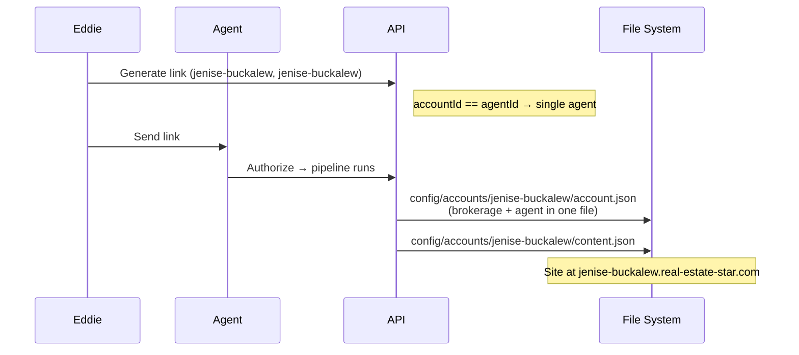

### Brokerage Flow (accountId != agentId)

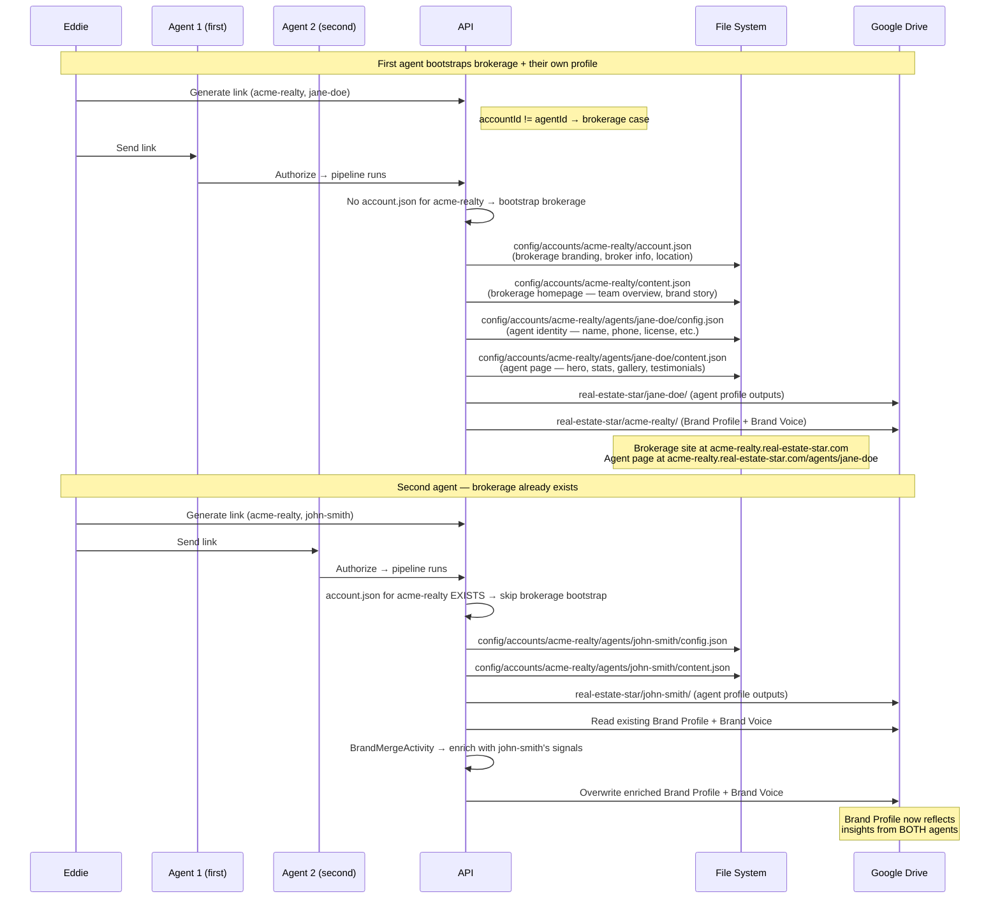

### Config Structure Comparison

```
Single agent (accountId == agentId):
  config/accounts/jenise-buckalew/
    ├── account.json       (brokerage + agent in one file)
    ├── content.json       (full site content)
    └── legal/

Brokerage (accountId != agentId):
  config/accounts/acme-realty/
    ├── account.json       (brokerage-level: branding, broker, location — NO agent section)
    ├── content.json       (brokerage homepage: team overview, brand story)
    ├── legal/
    └── agents/
        ├── jane-doe/
        │   ├── config.json    (agent identity: name, phone, license, tagline)
        │   └── content.json   (agent page: hero, stats, gallery, testimonials)
        └── john-smith/
            ├── config.json
            └── content.json
```

## Integration: Lead Pipeline Voice + Personality

The existing lead pipeline (`LeadOrchestrator` → `LeadEmailDrafter` in `Workers.Leads`) must load the agent's Voice Skill + Personality Skill when drafting communications. This is a modification to the existing lead pipeline, not the activation pipeline.

**Agent Context Loader:**

A shared service (`IAgentContextLoader` in Domain, implementation in DataServices) that loads all activation outputs for an agent. Called at the start of any communication drafting.

```csharp
public interface IAgentContextLoader
{
    Task<AgentContext?> LoadAsync(string accountId, string agentId, CancellationToken ct);
}

public record AgentContext
{
    // Per-agent skills
    public string? VoiceSkill { get; init; }
    public string? PersonalitySkill { get; init; }
    public string? CmaStyleGuide { get; init; }
    public string? MarketingStyle { get; init; }
    public string? SalesPipeline { get; init; }
    public string? CoachingReport { get; init; }
    public string? WebsiteStyleGuide { get; init; }
    public string? BrandingKit { get; init; }

    // Per-brokerage brand
    public string? BrandProfile { get; init; }
    public string? BrandVoice { get; init; }

    // Metadata
    public bool IsActivated { get; init; }
    public bool IsLowConfidence { get; init; }
}
```

Loads all files from `real-estate-star/{agentId}/` and `real-estate-star/{accountId}/` via `IFileStorageProvider`. Returns `null` if agent not activated (no files). Cached per-agent for the lifetime of a pipeline run (don't re-read Drive for every email).

**Changes to communication drafters:**

Each drafter loads the full `AgentContext` and injects the relevant subset into the Claude prompt based on the email type:

| Email Type | Context Injected |
|-----------|-----------------|
| **New lead response** | Voice + Personality + **Brand Voice** + **Branding Kit** + Coaching |
| **Lead nurture / drip** | Voice + Personality + **Brand Voice** + **Branding Kit** + Marketing Style + Coaching |
| **CMA delivery** | Voice + Personality + **Brand Voice** + **Branding Kit** + CMA Style Guide + Brand Profile + Coaching |
| **Listing follow-up** | Voice + Personality + **Brand Voice** + **Branding Kit** + Sales Pipeline + Coaching |
| **Showing confirmation** | Voice + Personality + **Brand Voice** + **Branding Kit** + Coaching |
| **Open house invitation** | Voice + Personality + **Brand Voice** + **Branding Kit** + Marketing Style + Coaching |
| **Offer / under contract** | Voice + Personality + **Brand Voice** + **Branding Kit** + Coaching |
| **Closing congratulations** | Voice + Personality + **Brand Voice** + **Branding Kit** + Coaching |
| **Market update** | Voice + Personality + **Brand Voice** + **Branding Kit** + Marketing Style + Brand Profile + Coaching |
| **Agent notification** | Voice + Personality + **Brand Voice** + **Branding Kit** |
| **WhatsApp message** | Voice (abbreviated) + Personality (casual) + **Brand Voice** (compliance) + Coaching |
| **Agent site copy** | **Branding Kit** (primary — colors, fonts, logo) + **Brand Voice** + Voice + Personality + Website Style Guide + Brand Profile |
| **CMA PDF generation** | **Branding Kit** (primary — colors, fonts, logo for PDF layout) + CMA Style Guide + Brand Profile |
| **Email HTML template** | **Branding Kit** (colors for header/footer/CTA buttons, logo in header) |

**Brand Voice is ALWAYS injected** — it's the foundation layer for every piece of branded copy. The agent's Voice Skill and Personality Skill personalize on top of it. Think of it as: Brand Voice = the brokerage's rules, Voice Skill = the agent's words, Personality Skill = the agent's energy.

Each email type gets the coaching recommendations relevant to that communication — not the full report, just the applicable sections. The Voice Skill template for the email type is always highlighted separately.

**Prompt structure:**
```
System: You are drafting a {email type} email on behalf of {agentName}.

=== VOICE SKILL (WHAT to say) ===
{full voice skill}

=== RELEVANT TEMPLATE ===
{specific email template section from voice skill for this email type}

=== PERSONALITY SKILL (HOW to say it) ===
{personality skill}

=== BRAND VOICE (brokerage communication standards — MANDATORY) ===
{brand voice — full contents}
All copy MUST align with the brokerage's brand voice above. Use their
standard greetings, power words, self-reference style, and compliance
language. The agent's personal voice adds personality on top of the
brand foundation — never contradict the brand voice.

=== COACHING IMPROVEMENTS (apply these) ===
{relevant recommendations from Coaching Report}
Apply these improvements naturally — stronger CTAs, faster follow-up
language, better personalization, tighter objection handling — while
staying true to the agent's voice and personality above.

=== BRANDING KIT (visual identity) ===
{colors, fonts, logo references from Branding Kit}
All visual elements (email templates, PDF reports, web copy) MUST use
these brand colors, fonts, and logo placement. Reference specific hex
values and font families — do not approximate.

=== ADDITIONAL CONTEXT ===
{marketing style / CMA style guide / sales pipeline — as relevant}

Draft the email for {lead name} regarding {context}...
```

**Coaching integration:** The Coaching Report recommendations are injected into every draft so Claude actively improves the agent's communication patterns. The agent's voice stays authentic, but the weak spots identified by the coach (vague CTAs, missing follow-up urgency, generic openings) are quietly strengthened. Over time, the agent's actual close rate improves because every AI-drafted email applies the coaching.

**Fallback behavior:**
- If `AgentContext` is null (not activated): current generic professional tone
- If specific template section not found in Voice Skill: use general tone/style sections
- If Brand Voice missing but Voice Skill present: use Voice Skill only (agent tone without brokerage overlay)

**Service-by-service integration:**

### LeadOrchestrator (Workers.Lead.Orchestrator)
- **Change:** Inject `IAgentContextLoader` into constructor
- **When:** At pipeline start, before any drafting, call `LoadAsync(accountId, agentId, ct)`
- **Cache:** Store `AgentContext` on the pipeline context object — passed to all downstream workers
- **No context = no problem:** Pipeline runs exactly as before, just with generic tone

### LeadEmailDrafter (Workers.Lead.Orchestrator)
- **Current:** Calls `IAnthropicClient` with a generic prompt to draft lead response email
- **Change:** Accept `AgentContext` parameter. Build prompt with Voice Skill + Personality + Brand Voice + Coaching + relevant email template
- **Template selection:** Map `LeadType` (buyer/seller) + pipeline stage to the right Voice Skill template section
- **Context used:** Voice Skill, Personality Skill, Brand Voice (always), Coaching Report, Marketing Style (for nurture emails)

### LeadScorer (Workers.Lead.Orchestrator)
- **Current:** Scores leads based on form data
- **Change:** Accept `AgentContext.SalesPipeline` to factor in the agent's current pipeline when scoring
- **Example:** A seller lead in a neighborhood where the agent has 3 active deals scores higher (agent has local expertise)

### AgentNotifierService (Notifications)
- **Current:** Sends HTML email notification to agent about new lead
- **Change:** Inject `IAgentContextLoader`. Draft notification using Voice Skill + Brand Voice
- **Why:** Even internal notifications should feel on-brand — the agent sees these and judges the platform quality
- **Context used:** Voice Skill (tone), Brand Voice (brokerage standards), Personality (energy level)

### CmaProcessingWorker (Workers.Lead.CMA)
- **Current:** Generates CMA narrative and PDF via Claude + QuestPDF
- **Change:** Accept `AgentContext`. Inject CMA Style Guide + Brand Voice + Voice Skill into Claude prompt
- **CMA Style Guide:** Layout preferences, data emphasis, comp presentation style
- **Brand Voice:** Compliance language, disclaimers, brokerage name usage
- **Voice Skill:** Narrative tone, how they explain market data to clients
- **Context used:** CMA Style Guide (primary), Brand Voice, Voice Skill, Brand Profile

### CmaPdfGenerator (Workers.Lead.CMA)
- **Current:** Renders PDF with hardcoded layout
- **Change:** Accept `AgentContext`. Use CMA Style Guide to drive layout decisions
- **CMA Style Guide fields applied:**
  - Section ordering → page layout
  - Branding treatment → logo placement, colors
  - Data presentation → table vs narrative
  - Disclaimer style → footer content
- **Brand assets:** `brokerage-logo.png` and `headshot.jpg` from agent's Drive folder

### HomeSearchProcessingWorker (Workers.Lead.HomeSearch)
- **Current:** Scrapes listings and generates summary
- **Change:** Accept `AgentContext`. Use Voice Skill + Brand Voice when drafting search summary
- **Context used:** Voice Skill (how they describe properties), Brand Voice (marketing language), Personality (enthusiasm level)

### WebhookProcessorWorker / ConversationHandler (Workers.WhatsApp)
- **Current:** Processes WhatsApp messages and drafts responses
- **Change:** Accept `AgentContext`. Use Voice Skill (casual register) + Personality + Brand Voice (compliance)
- **WhatsApp-specific:** Shorter messages, more informal, but still on-brand. Coaching applied for response time
- **Context used:** Voice Skill (abbreviated), Personality (casual register), Brand Voice (compliance language), Coaching (response time)

### WelcomeNotificationActivity (Workers.Activation.WelcomeNotification)
- **Already designed:** Uses full AgentContext for the welcome message
- **Context used:** Voice Skill (catchphrases, sign-off), Personality, Brand Voice, Coaching (one tip), Sales Pipeline (deal count)

### Summary: IAgentContextLoader injection points

| Service | Project | Injects | Primary Context |
|---------|---------|---------|----------------|
| `LeadOrchestrator` | Workers.Lead.Orchestrator | `IAgentContextLoader` | Loads once, passes to all workers |
| `LeadEmailDrafter` | Workers.Lead.Orchestrator | `AgentContext` (from orchestrator) | Voice + Personality + Brand Voice + Branding Kit + Coaching |
| `LeadScorer` | Workers.Lead.Orchestrator | `AgentContext` (from orchestrator) | Sales Pipeline |
| `AgentNotifierService` | Notifications | `IAgentContextLoader` | Voice + Brand Voice + Personality |
| `CmaProcessingWorker` | Workers.Lead.CMA | `AgentContext` (from orchestrator) | CMA Style Guide + Brand Voice + Voice |
| `CmaPdfGenerator` | Workers.Lead.CMA | `AgentContext` (from orchestrator) | CMA Style Guide + Branding Kit (colors, fonts, logo) + Brand Profile |
| `HomeSearchProcessingWorker` | Workers.Lead.HomeSearch | `AgentContext` (from orchestrator) | Voice + Brand Voice + Personality |
| `ConversationHandler` | Workers.WhatsApp | `IAgentContextLoader` | Voice + Personality + Brand Voice + Coaching |
| `WelcomeNotificationActivity` | Workers.Activation | `AgentContext` (from orchestrator) | All |

**Files modified:**
- `apps/api/RealEstateStar.Domain/Activation/Interfaces/IAgentContextLoader.cs` (new)
- `apps/api/RealEstateStar.Domain/Activation/Models/AgentContext.cs` (new)
- `apps/api/RealEstateStar.DataServices/Activation/AgentContextLoader.cs` (new)
- `apps/api/RealEstateStar.Workers/Leads/RealEstateStar.Workers.Lead.Orchestrator/LeadOrchestrator.cs`
- `apps/api/RealEstateStar.Workers/Leads/RealEstateStar.Workers.Lead.Orchestrator/LeadEmailDrafter.cs`
- `apps/api/RealEstateStar.Workers/Leads/RealEstateStar.Workers.Lead.Orchestrator/LeadScorer.cs`
- `apps/api/RealEstateStar.Workers/Leads/RealEstateStar.Workers.Lead.CMA/CmaProcessingWorker.cs`
- `apps/api/RealEstateStar.Workers/Leads/RealEstateStar.Workers.Lead.CMA/CmaPdfGenerator.cs`
- `apps/api/RealEstateStar.Workers/Leads/RealEstateStar.Workers.Lead.HomeSearch/HomeSearchProcessingWorker.cs`
- `apps/api/RealEstateStar.Notifications/AgentNotifierService.cs`
- `apps/api/RealEstateStar.Workers/WhatsApp/RealEstateStar.Workers.WhatsApp/ConversationHandler.cs`

## Documentation Updates Required

The following documentation must be updated as part of this feature:

| Document | Update |
|----------|--------|
| `.claude/CLAUDE.md` | Add Activation Pipeline section under Architecture. Update Orchestrator Design Rules to include Activities-call-Services pattern. Add `Workers.Activation.*`, `Activities.Activation.*`, `Services.Activation.*` to project list. Update call hierarchy if Activities-calling-Services is new. |
| `docs/architecture/README.md` | Add Activation Pipeline architecture diagram. Show data flow from OAuth → Gather → Synthesize → Persist → Notify |
| `docs/architecture/fan-out-storage.md` | Add `real-estate-star/` folder as a new write target. Document Voice Skill, Brand Profile, and other activation outputs |
| `.claude/CLAUDE.md` Monorepo Structure | Add all new projects to the project listing. Update project count |
| `.claude/CLAUDE.md` API Dependency Rules | Verify new projects conform. Add `Services.AgentConfig`, `Services.BrandMerge`, `Services.WelcomeNotification` |
| `docs/onboarding.md` | Add section on Activation Pipeline for new developers |
| `config/agent.schema.json` | Ensure all auto-populated fields from `AgentConfigService` are in the schema |
| Architecture tests | **NO CHANGES** — new projects must conform to existing tests. If a test fails, fix the code, not the test |

## Architecture Test Compliance

**Architecture tests are IMMUTABLE.** Code conforms to architecture, never the other way around.

The following existing tests will validate the new projects automatically:
- `DependencyTests.cs` — verifies Workers depend only on Domain + Workers.Shared, Activities depend only on Domain + Workers.Shared, Services depend only on Domain
- `LayerTests.cs` — verifies type-level rules (no DataServices in Workers, etc.)
- `DiRegistrationTests.cs` — verifies all new interfaces have DI registrations

**Pre-implementation checklist:**
- [ ] Read all architecture test files before writing any code
- [ ] Ensure every new Worker calls Clients only (no DataServices, no IFileStorageProvider)
- [ ] Ensure every new Activity calls Services + DataServices only (no Clients directly)
- [ ] Ensure every new Service calls Clients + DataServices only (no Activities, no Workers)
- [ ] Run `dotnet test` on architecture tests after adding each project — catch violations early
- [ ] Naming conventions: `*Worker` for workers, `*Activity` for activities, `*Service` for services

## Future Hooks (Beyond Profiling Pipeline)

The callback endpoint + orchestrator should be designed so adding more post-auth work is trivial:
- Deploy agent site
- Send welcome email
- Email agent with site URL when deployment completes
- Populate `real-estate-star` folder with templates, guides, etc.

### Future: Fee Structure Automation

The `FeeStructureWorker` is a Phase 2 worker that runs during activation and stores `Fee Structure.md`. The analysis is produced and the Coaching Report references it, but it is NOT wired into communications or contract automation yet.

**Future automation targets:**
- Contract automation (auto-populate commission fields in state-specific forms)
- CMA reports (include commission context for seller pricing guidance)
