# Azure Durable Functions Migration Plan

**Status:** Draft — awaiting review
**Date:** 2026-03-31
**Author:** Eddie + Claude

## Context

The API currently runs as a single Azure Container App with all pipelines (Activation, Lead, CMA, WhatsApp) running as `BackgroundService` hosted services in-process. This works but has limitations:

- Custom checkpoint/resume logic is error-prone and hand-rolled per pipeline
- No built-in audit trail for failed steps
- Scale-to-zero on Container Apps kills in-flight background work
- All pipelines share CPU/memory — a heavy CMA generation starves lead processing
- No cross-container durability for activation state (lives in file storage)

Azure Durable Functions provides orchestration-as-a-service: automatic checkpointing, retry policies, execution history, and independent scaling — but only the **Orchestrators** need it. Everything else stays what it is.

## Key Principle: Our Architecture Doesn't Change

The Durable Task framework is an **implementation detail of how Orchestrators checkpoint and dispatch**. It does NOT restructure our call hierarchy:

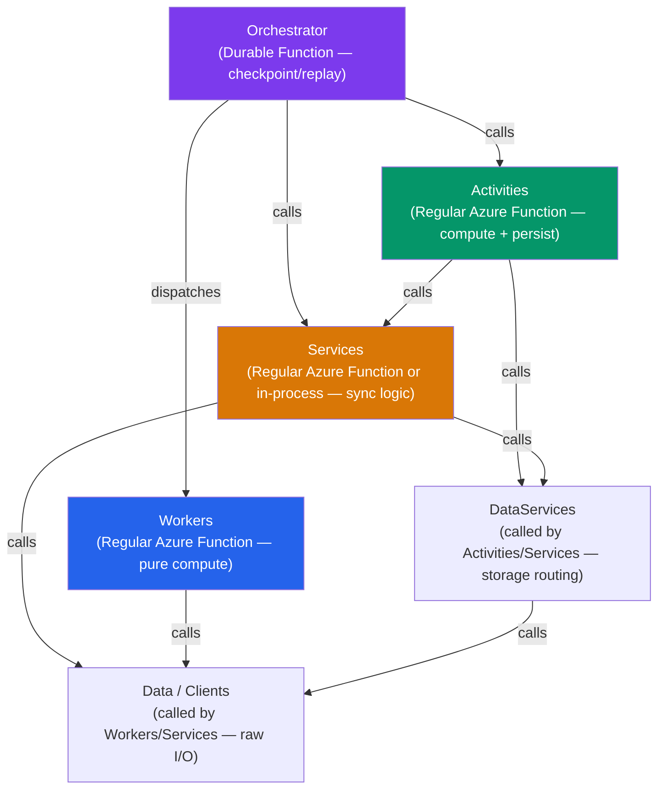

**Only Orchestrators become Durable Functions.** Workers, Activities, and Services become regular Azure Functions (or stay in-process calls). Same names, same roles, same dependency rules.

### File Storage Is Unchanged

The `IFileStorageProvider` → `DataServices` → `GDriveClient` / `LocalStorageProvider` chain is untouched. Lead files, CMA PDFs, and agent config files continue to be stored in the agent's Google Drive (prod) or local filesystem (dev).

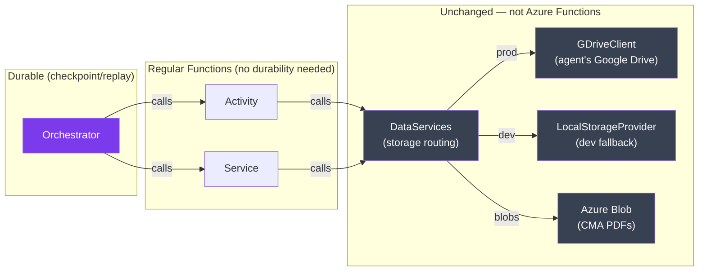

**Rule:** Orchestrators MUST NOT call DataServices, Clients, or any I/O directly. This is already enforced by our architecture — the migration doesn't change it. Durable orchestrator code must be deterministic (replay-safe), which means no I/O. Our separation already guarantees this.

## Current Architecture

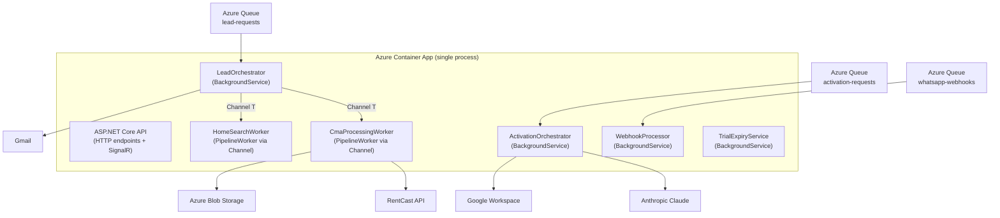

## Proposed Architecture

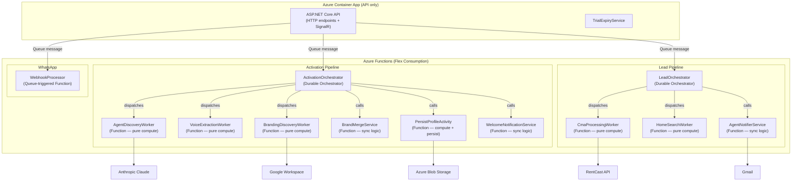

## What Moves vs. What Stays

| Component | Current | Proposed | Role Unchanged? |
|-----------|---------|----------|:---:|
| **HTTP API** | Container App | Container App | Yes |
| **SignalR Hub** | Container App | Container App | Yes |
| **TrialExpiryService** | BackgroundService | BackgroundService (stays) | Yes |
| **ActivationOrchestrator** | BackgroundService + queue poll | Durable Function | Yes — still orchestrates |
| **LeadOrchestrator** | BackgroundService + Channel\<T\> | Durable Function | Yes — still orchestrates |
| **CmaProcessingWorker** | PipelineWorker via Channel | Regular Azure Function | Yes — still pure compute |
| **HomeSearchWorker** | PipelineWorker via Channel | Regular Azure Function | Yes — still pure compute |
| **BrandMergeService** | In-process service | Regular Azure Function | Yes — still sync logic |
| **PersistProfileActivity** | In-process activity | Regular Azure Function | Yes — still compute + persist |
| **WebhookProcessor** | BackgroundService + queue poll | Queue-triggered Function | Yes — still processes messages |

**No renames. No restructuring. Same architecture, different runtime.**

## What the Durable Task Framework Replaces

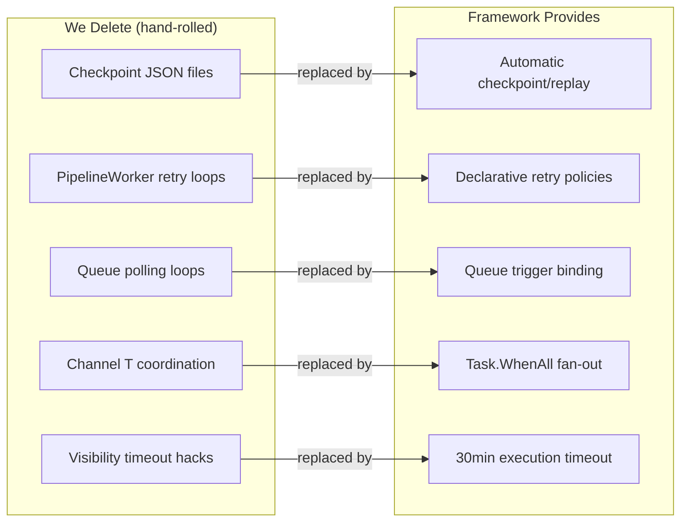

## Durable Functions Hosting: Flex Consumption

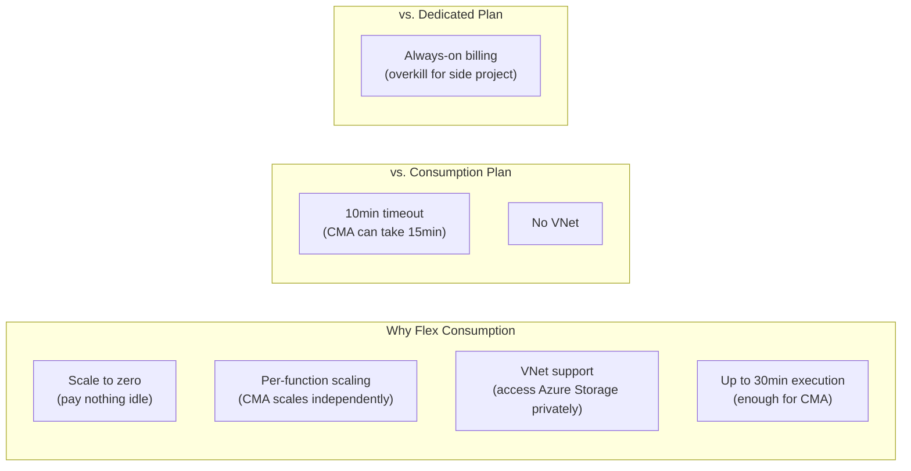

## Activation Pipeline: Before & After

### Before (Custom Orchestration)

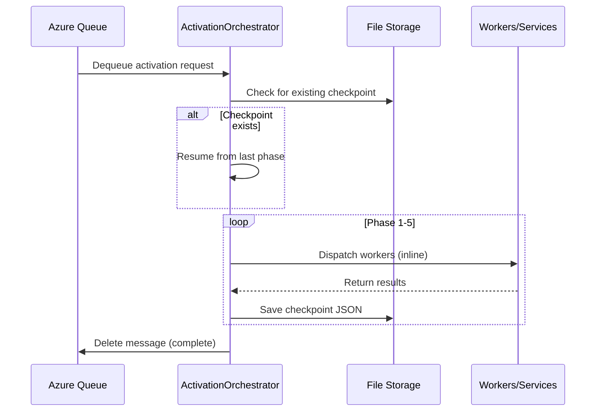

### After (Durable Orchestrator)

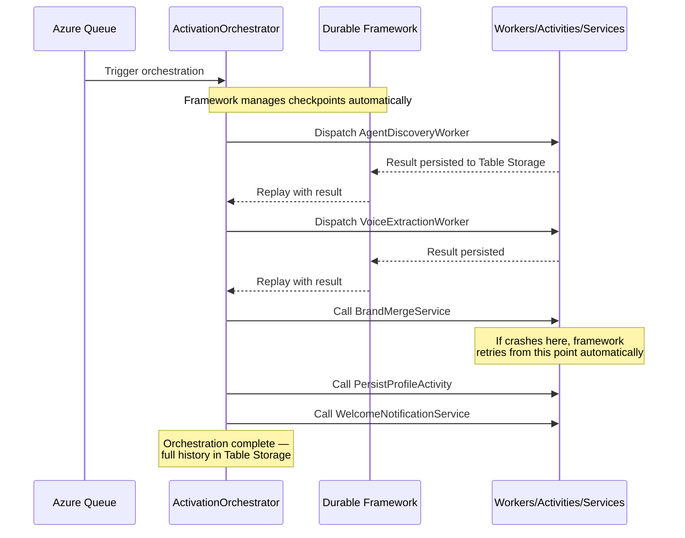

## Lead Pipeline: Fan-Out Pattern

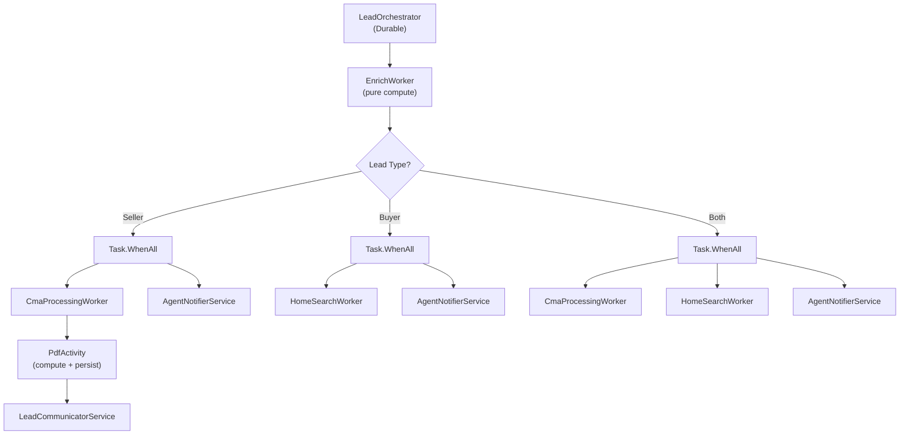

## Migration Phases

### Phase 0: Preparation (no behavior change)

- Ensure all Workers are stateless: input DTO in, output DTO out, no shared state
- Ensure all Activities/Services have clean interfaces (they already do via Domain)
- Add `Microsoft.Azure.Functions.Worker` and `Microsoft.DurableTask` packages
- Create `apps/api/RealEstateStar.Functions/` project as a thin host — it references the existing Worker/Activity/Service projects, not duplicates them

### Phase 1: WhatsApp Webhook (simplest, low risk)

- Queue-triggered function replaces `WebhookProcessorWorker`
- Drop custom polling loop and poison message counter
- Same `IConversationHandler` logic, just triggered by Azure Functions queue binding
- **Risk:** Low — stateless, single message processing

### Phase 2: Activation Pipeline (medium risk)

- `ActivationOrchestrator` becomes a Durable Function orchestrator
- Workers (AgentDiscovery, VoiceExtraction, etc.) become regular Azure Functions
- Activities (PersistProfile) and Services (BrandMerge, WelcomeNotification) become regular Azure Functions
- Delete custom checkpoint/resume JSON logic — framework handles it
- **Risk:** Medium — complex 5-phase orchestration, needs integration testing

### Phase 3: Lead Pipeline (medium-high risk)

- `LeadOrchestrator` becomes a Durable Function orchestrator
- CmaProcessingWorker and HomeSearchWorker become regular Azure Functions
- `Channel<T>` coordination replaced by `Task.WhenAll` fan-out in the orchestrator
- SignalR progress via HTTP polling (Durable Functions provides built-in status endpoint)
- **Risk:** Medium-high — loss of Channel\<T\> backpressure, needs load testing

### Phase 4: Decommission Container App workers

- Remove `BackgroundService` registrations from Program.cs
- Remove `PipelineWorker<T>` base class and `ProcessingChannelBase`
- Container App becomes API-only (HTTP + SignalR)
- Scale settings can be more aggressive (no background work to protect)

## Cost Comparison

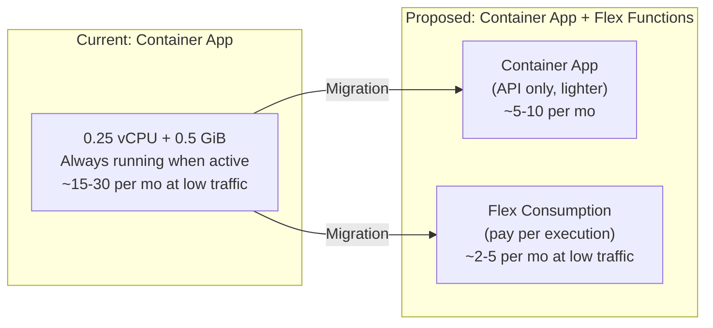

At current traffic (side project, single agent), Flex Consumption would cost pennies. The Container App gets lighter because it only serves HTTP.

## SignalR Considerations

The CMA pipeline currently pushes real-time progress via SignalR. Azure Functions can't hold WebSocket connections. Options:

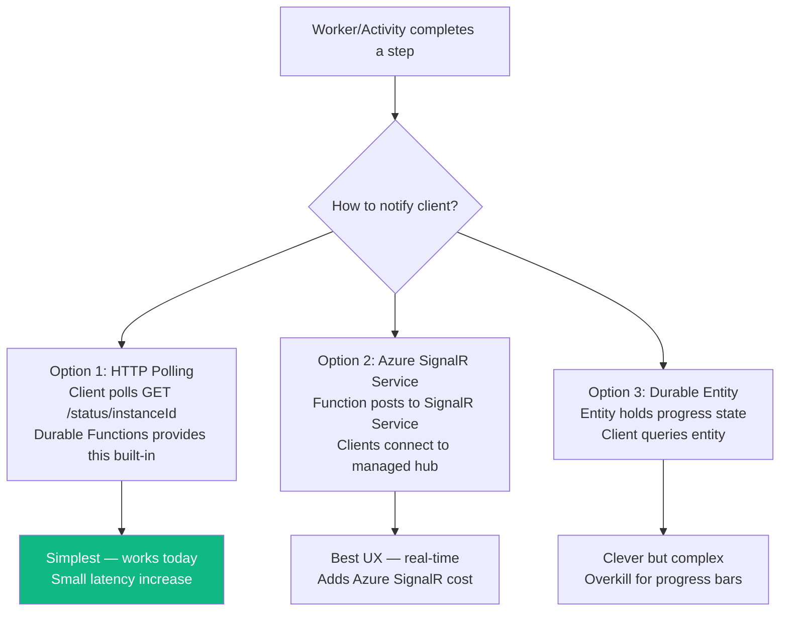

**Recommendation:** Start with HTTP polling (Option 1). Durable Functions provides a built-in status query endpoint. Add Azure SignalR Service later if real-time UX matters enough.

## What This Unlocks

1. **Automatic checkpoint/replay** — crash mid-pipeline, resume exactly where you left off
2. **Declarative retry policies** — no more hand-rolled retry loops
3. **Execution history** — every dispatch/call logged in Table Storage (free audit trail)
4. **Independent scaling** — CMA worker scales separately from lead intake
5. **30min execution** — Flex Consumption supports it natively (vs. our 5min visibility timeout hack)
6. **Simpler testing** — Workers are already pure compute; now they're independently deployable too
7. **Cost optimization** — pay per execution, not per always-on container

## Idempotency: The Replay Problem

With Durable Functions, the orchestrator and the functions it calls run in **separate executions**. If a function completes successfully but the orchestrator crashes before recording that completion, the framework replays and calls the function again. This is safe for pure compute and file overwrites — but dangerous for side effects like sending emails.

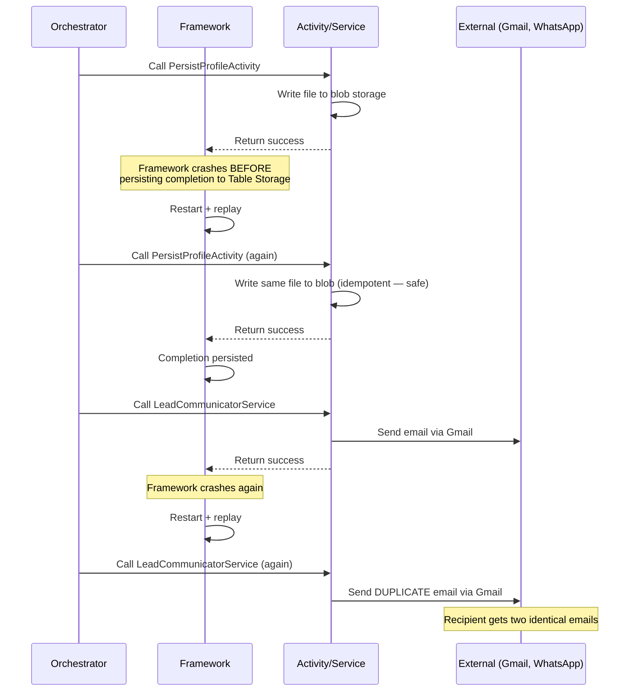

### Idempotency Audit

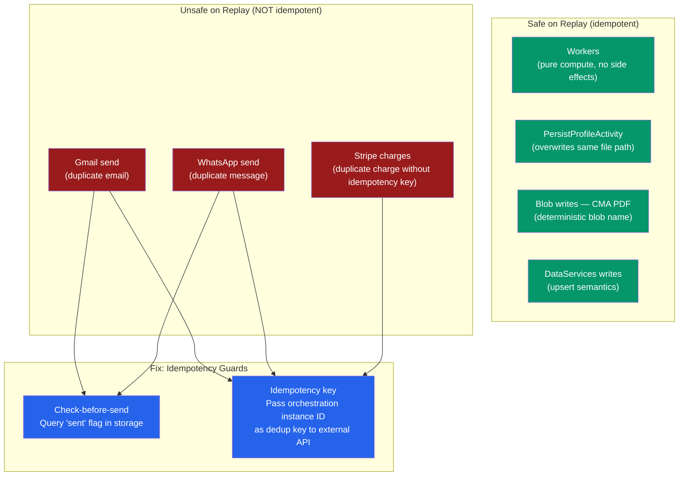

### Mitigation Strategy

Every Service that calls an external API with non-idempotent side effects needs a guard before the migration:

1. **Gmail / Email sends** — Before sending, check a `notification_sent` flag in lead storage (DataServices). The orchestrator's deterministic instance ID (`{accountId}-{leadId}`) serves as the dedup key. If the flag exists, skip the send.

2. **WhatsApp sends** — Same pattern: check `whatsapp_sent` flag before dispatching. WhatsApp Business API also supports idempotency via `messaging_product` + `to` + dedup window.

3. **Stripe calls** — Already supports idempotency keys natively. Pass the Durable Functions instance ID as the `Idempotency-Key` header.

4. **File/Blob writes** — Already idempotent (deterministic paths, overwrite semantics). No change needed.

5. **Workers** — Pure compute, no side effects. No change needed.

This is good practice regardless of Azure Functions — the current in-process model is only "safe" because crashes are rare, not because the code is idempotent.

## Resiliency Gap Analysis

Every resiliency pattern currently in the codebase must be preserved or improved. This section audits each pattern against the Durable Functions migration.

### Pattern-by-Pattern Assessment

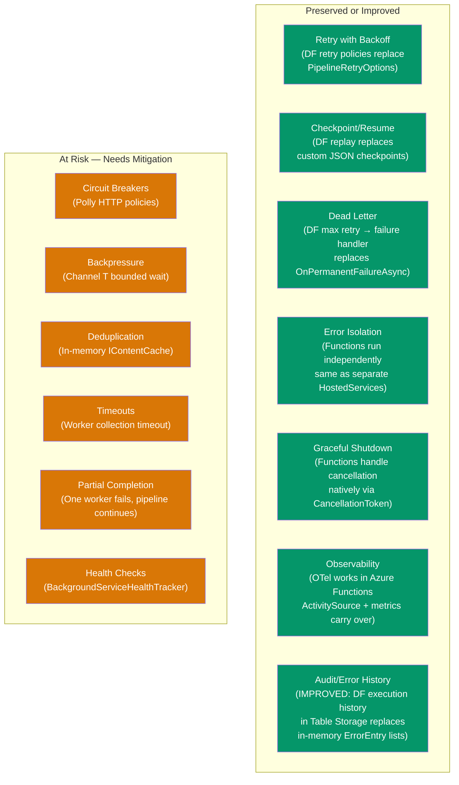

### Detailed Risk Assessment

| Pattern | Current Implementation | DF Equivalent | Risk | Mitigation |
|---------|----------------------|---------------|:----:|------------|
| **Retry (pipeline)** | `PipelineWorker` exponential backoff: 3x, 30s base, 600s max, 2x multiplier | DF `RetryPolicy` — same params, declarative | None | Map existing `PipelineRetryOptions` to DF retry config |
| **Retry (HTTP)** | Polly policies per client: Claude 3x/2s, Scraper 2x/1s, GWS 3x/1s, RentCast 1x/5s | Same — Polly runs inside Functions | None | HttpClientFactory + Polly works identically in Functions |
| **Circuit Breakers** | Polly HTTP CBs: 5 per external service, FailureRatio=1.0, break durations 30s-120s | Same — Polly runs inside Functions | **Low** | CB state is per-process. With scale-to-zero, CB state resets on cold start. Same behavior as Container App restart. |
| **Checkpoint/Resume** | Custom JSON files in file storage + `LeadRetryState` content hashing | DF automatic replay from Table Storage | **Improved** | Delete custom checkpoint code. DF replay is more reliable. |
| **Dead Letter** | `OnPermanentFailureAsync` after max retries; WhatsApp poison after 5 dequeues | DF `MaxNumberOfAttempts` → calls failure handler | None | Map `OnPermanentFailureAsync` to DF's `OnFailure` callback |
| **Backpressure** | `Channel<T>` bounded (50-100 capacity), `BoundedChannelFullMode.Wait` | **No direct equivalent** | **Medium** | See mitigation below |
| **Deduplication** | `IContentCache` in-memory (CMA 24h TTL, HS 1h TTL) + `LeadRetryState` per-lead hashing | **No direct equivalent** | **Medium** | See mitigation below |
| **Graceful Shutdown** | `OperationCanceledException` rethrow pattern, `ReadAllAsync` cancellation | DF passes `CancellationToken` to all function invocations | None | Same pattern, different trigger |
| **Timeouts** | Worker collection: 5min default, PDF: inherited async, Queue visibility: 30s | DF orchestrator timeout via `Task.WhenAll().WaitAsync()` or `CreateTimer` | **Low** | Reimplement timeout in orchestrator using `ctx.CreateTimer()` + `Task.WhenAny()` |
| **Partial Completion** | LeadOrchestrator continues if one worker times out, records partial result | DF `Task.WhenAll` throws on any failure by default | **Medium** | See mitigation below |
| **Error Isolation** | Separate `BackgroundService` per worker, per-lead try/catch, `RunSafeAsync` | Separate function invocations per worker | **Improved** | Functions are process-isolated by default |
| **Health Checks** | `BackgroundServiceHealthTracker` + 5min staleness threshold, queue depth reporting | **No direct equivalent in Functions** | **Medium** | See mitigation below |
| **Observability** | `ActivitySource` spans, OTel metrics, correlation IDs, structured log codes, `ErrorEntry` lists | OTel works in Functions. `ErrorEntry` replaced by DF execution history. | **Improved** | DF execution history is persistent (Table Storage), unlike in-memory `ErrorEntry` |

### Mitigations for At-Risk Patterns

#### Backpressure (Medium Risk)

**Current:** Bounded `Channel<T>` with `Wait` policy — writers block when 50 items queued, preventing the orchestrator from overwhelming downstream workers.

**Problem:** Durable Functions dispatches work via Azure Storage queues, not in-memory channels. No built-in backpressure.

**Mitigation:**
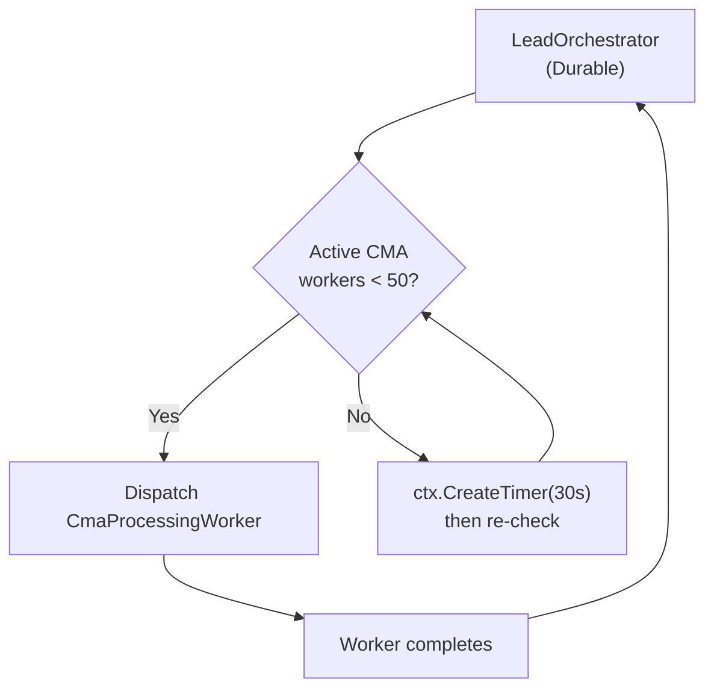

Use a **Durable Entity** as a semaphore counter. Before dispatching, the orchestrator checks the entity's count. If at capacity, it waits with `ctx.CreateTimer()`. This preserves the bounded-queue semantics without Channel\<T\>.

Alternatively: **accept the change**. Azure Queue Storage has its own backpressure (Functions scale based on queue depth). The 50-item Channel limit was chosen for in-process memory, not for correctness. With Functions, each invocation is isolated — no shared memory pressure.

#### Deduplication (Medium Risk)

**Current:** `IContentCache` (in-memory `MemoryCache`) deduplicates cross-lead CMA/HomeSearch work. Same property address within 24h → cached result, no re-computation.

**Problem:** In-memory cache doesn't survive across function invocations. Each function instance starts fresh.

**Mitigation:** Replace `MemoryContentCache` with a distributed cache:
- **Option A:** Azure Cache for Redis — fast, adds ~$15/mo cost
- **Option B:** Azure Table Storage — free (included with Functions storage account), slightly slower
- **Option C:** Durable Entity as cache — built-in, no extra cost, but limited to 64KB per entity

**Recommendation:** Option B (Table Storage). The cache is checked once per lead, not in a hot loop. Table Storage latency (~10ms) is acceptable. Zero additional cost.

`LeadRetryState` per-lead hashing is unaffected — it's passed as input to the orchestrator and stored in DF execution history.

#### Partial Completion (Medium Risk)

**Current:** LeadOrchestrator dispatches CMA + HomeSearch in parallel. If one times out, the other's result is still used. Pipeline continues with whatever completed.

**Problem:** DF `Task.WhenAll` throws `TaskFailedException` if any sub-task fails. Default behavior is all-or-nothing.

**Mitigation:** Use `Task.WhenAny` + individual try/catch instead of `Task.WhenAll`:

```csharp
// In Durable Orchestrator
var cmaTask = ctx.CallActivityAsync<CmaResult?>("CmaProcessingWorker", input);
var hsTask = ctx.CallActivityAsync<HomeSearchResult?>("HomeSearchWorker", input);

CmaResult? cmaResult = null;
HomeSearchResult? hsResult = null;

try { cmaResult = await cmaTask; } catch { /* log, continue */ }
try { hsResult = await hsTask; } catch { /* log, continue */ }

// Continue with whatever completed — same as current behavior
```

This preserves the exact same partial-completion semantics.

#### Health Checks (Medium Risk)

**Current:** `BackgroundServiceHealthTracker` monitors 4 workers via last-activity timestamps. If a worker hasn't processed in 5 minutes but has items queued, readiness probe reports Unhealthy.

**Problem:** Functions don't have a centralized health check endpoint with per-worker staleness tracking.

**Mitigation:**
- **Azure Functions built-in monitoring:** Functions runtime reports execution counts, failures, and duration to Azure Monitor automatically.
- **Durable Functions status API:** Query orchestration instances by status (Running, Failed, Suspended) via the built-in HTTP management API.
- **Custom health endpoint on the Container App:** The API (which stays on Container App) can query the DF status API to build the same health picture. Add a `/health/workers` endpoint that checks recent DF instance statuses.
- **Alert rules:** Azure Monitor alert on function failure rate > threshold, replacing the staleness check.

This is actually **more observable** than the current approach — DF tracks per-instance status, not just last-activity timestamps.

## Open Questions

1. **Shared DI:** Workers/Activities/Services need `IAnthropicClient`, `IGDriveClient`, etc. How to register DI in the Functions host while reusing existing service registrations from the API project?
2. **Local development:** Azurite for local queue/table emulation? Or keep in-memory fallback?
3. **Monitoring:** Keep existing OpenTelemetry setup or switch to Azure Monitor / Application Insights?
4. **Deployment:** Separate GitHub Actions workflow for Functions, or combined with API?
5. **Feature flags:** Roll out per-pipeline (WhatsApp first, then Activation, then Lead) or big bang?
