# Azure Durable Functions Migration — Task Plan

**Status:** Implemented — 2026-04-02
**Date:** 2026-04-01
**Source:** [Design Spec](2026-03-31-azure-durable-functions-migration-plan.md)
**Author:** Eddie + Claude

## Parallel Execution Map

```mermaid
gantt
    title Migration Phases — Parallel Execution
    dateFormat  X
    axisFormat %s

    section Phase 0 — Prep
    Functions host project + arch tests     :a1, 0, 3
    Distributed content cache               :a2, 0, 2
    Idempotency store                       :a3, 0, 2
    Wire idempotency into services          :a4, after a3, 2
    Azure infra setup                       :a5, 0, 2
    CI workflow                             :a6, after a1, 1
    Phase 0 Review Gate                     :milestone, after a4 a6, 0

    section Phase 1 — WhatsApp
    Queue-triggered webhook function        :b1, after a4, 2
    Timer-triggered retry function          :b2, after a4, 1
    Feature flag + dual-write               :b3, after b1, 1
    Remove BackgroundService                :b4, after b3, 1
    Phase 1 Review Gate                     :milestone, after b4, 0

    section Phase 2 — Activation
    Durable Orchestrator                    :c1, after a4, 3
    19 activity functions                   :c2, after a4, 3
    Queue starter + API update              :c3, after c1, 1
    Remove BackgroundService                :c4, after c3, 1
    Phase 2 Review Gate                     :milestone, after c4, 0

    section Phase 3 — Lead
    Durable Orchestrator                    :d1, after a4, 4
    11 activity functions                   :d2, after a4, 3
    Queue starter + API update              :d3, after d1, 1
    Backpressure + SignalR                  :d4, after d1, 1
    Remove BackgroundService                :d5, after d3, 1
    Phase 3 Review Gate                     :milestone, after d5, 0

    section Phase 4 — Decommission
    Delete PipelineWorker + Channels        :e1, after b4 c4 d5, 2
    Replace health checks                  :e2, after e1, 1
    Clean up feature flags                  :e3, after e2, 1
    Phase 4 Review Gate                     :milestone, after e3, 0
```

**Key insight:** Phases 1, 2, and 3 are independent after Phase 0. They can run in parallel across 3 agents/developers.

---

## Phase 0: Preparation (no behavior change)

All tasks in this phase can run in parallel except 0.4 (depends on 0.3).

### 0.0 Fix health check abstraction violation (pre-existing bug)
| | |
|---|---|
| **Files** | `Api/Health/BackgroundServiceHealthCheck.cs`, `Domain/Shared/Interfaces/IActivationQueue.cs` (or wherever the queue interface lives) |
| **Bug** | `BackgroundServiceHealthCheck` takes a raw `Channel<ActivationRequest>` instead of going through `IActivationQueue`. The channel was never registered as a standalone DI service — it's encapsulated inside `InMemoryActivationQueue`/`AzureQueueActivationStore`. This causes the readiness check to fail on DI resolution. |
| **Fix** | Add a `Count` or `QueueDepth` property to `IActivationQueue` (and `ILeadOrchestrationQueue` if the same pattern exists). Health check injects the queue interfaces, not raw channels. |
| **Why now** | This bug will silently carry forward into the Functions migration. Once the orchestrator moves to Durable Functions, `Channel<ActivationRequest>` disappears entirely — the health check would break with no fallback. Fix it now so Phase 4 (decommission) is clean. |
| **Risk** | Low — small interface change + health check update. |

### 0.1 Create Functions host project
| | |
|---|---|
| **Files** | `apps/api/RealEstateStar.Functions/` — `csproj`, `Program.cs`, `host.json`, `local.settings.json` |
| **Action** | New .NET 10 isolated worker Azure Functions project. Thin composition root — calls same DI extension methods as Api. References all Worker/Activity/Service/Client projects. |
| **Packages** | `Microsoft.Azure.Functions.Worker`, `Microsoft.Azure.Functions.Worker.Extensions.DurableTask`, `Microsoft.Azure.Functions.Worker.Extensions.Storage.Queues` |
| **Risk** | Medium — must replicate DI correctly. Extract shared registrations into a static helper both hosts call. |

### 0.2 Add distributed content cache
| | |
|---|---|
| **Files** | `Domain/Shared/Interfaces/IDistributedContentCache.cs`, `Clients.Azure/TableStorageContentCache.cs`, tests |
| **Action** | Same `GetAsync<T>`/`SetAsync<T>` signature as existing `IContentCache`. Backed by Azure Table Storage (free, ~10ms). Replaces in-memory `MemoryCache` for cross-function dedup. |
| **Risk** | Low |

### 0.3 Add idempotency store
| | |
|---|---|
| **Files** | `Domain/Shared/Interfaces/IIdempotencyStore.cs`, `Clients.Azure/TableStorageIdempotencyStore.cs`, tests |
| **Action** | `HasCompletedAsync(key)` + `MarkCompletedAsync(key)`. Keys: `{pipeline}:{instanceId}:{step}`. Guards Gmail, WhatsApp, Stripe sends against replay duplicates. |
| **Risk** | Low |

### 0.4 Wire idempotency guards into existing services
| | |
|---|---|
| **Files** | `Services.LeadCommunicator`, `Services.AgentNotifier`, `Services.WelcomeNotification` |
| **Action** | Before each send: check `HasCompletedAsync`. After success: call `MarkCompletedAsync`. Improves current system too (Container App restarts). |
| **Depends on** | 0.3 |
| **Risk** | Medium — must not break existing sends. Use `NullIdempotencyStore` (always returns false) in dev/test. |

### 0.5 Update architecture tests
| | |
|---|---|
| **Files** | `Architecture.Tests/DependencyTests.cs`, `DiRegistrationTests.cs` |
| **Action** | Add `RealEstateStar.Functions` to composition root allowlist. Requires `[arch-change-approved]`. |
| **Depends on** | 0.1 |
| **Risk** | Low |

### 0.6 Azure infrastructure setup
| | |
|---|---|
| **Action** | Create Flex Consumption plan, storage account, Application Insights. Same VNet as Container App. |
| **Risk** | Medium — verify .NET 10 isolated worker support on Flex Consumption. |

### 0.7 CI workflow
| | |
|---|---|
| **Files** | `.github/workflows/deploy-functions.yml` |
| **Action** | Build → test → publish → deploy via `az functionapp deployment`. Triggers on `main` pushes to `apps/api/RealEstateStar.Functions/**`. |
| **Depends on** | 0.1, 0.6 |

### Phase 0 Review Gate

- [x] Health check uses `IActivationQueue`/`ILeadOrchestrationQueue` interfaces, not raw `Channel<T>`
- [x] Readiness probe passes in local dev and production
- [x] `RealEstateStar.Functions` project builds, all architecture tests pass
- [x] `TableStorageContentCache` and `TableStorageIdempotencyStore` at 100% branch coverage
- [x] Idempotency guards wired into all send services, existing tests still pass
- [x] Functions app deploys to Azure with zero active functions (empty host)
- [x] Existing API behavior completely unchanged

---

## Phase 1: WhatsApp Webhook (low risk)

Can run in parallel with Phase 2 and Phase 3.

### 1.1 Queue-triggered webhook function
| | |
|---|---|
| **Files** | `Functions/WhatsApp/ProcessWebhookFunction.cs`, tests |
| **Action** | `[QueueTrigger("whatsapp-webhooks")]` — delegates to existing `IConversationHandler`. Poison messages handled by `host.json` `maxDequeueCount: 5` (auto-moves to `-poison` queue). |
| **Replaces** | `WebhookProcessorWorker` polling loop, manual dequeue count check, manual queue completion |

### 1.2 Timer-triggered retry function
| | |
|---|---|
| **Files** | `Functions/WhatsApp/WhatsAppRetryFunction.cs`, tests |
| **Action** | `[TimerTrigger("0 */30 * * * *")]` — calls same logic as `WhatsAppRetryJob.ProcessRetriesAsync()`. |

### 1.3 Feature flag + dual-write
| | |
|---|---|
| **Action** | `Features:WhatsApp:UseBackgroundService` flag. When false, skip `AddHostedService` in API. Both active during transition (safe — queue trigger auto-completes). |

### 1.4 Remove BackgroundService
| | |
|---|---|
| **Action** | After production verification, remove `WebhookProcessorWorker` and `WhatsAppRetryJob` hosted service registrations. |

### Phase 1 Review Gate

- [x] Queue-triggered function processes messages end-to-end
- [x] Poison messages auto-move to `-poison` queue
- [x] Timer retries failed messages every 30 minutes
- [x] No messages lost during cutover (verified via audit table)
- [x] BackgroundService registrations removed
- [x] 100% branch coverage on new functions

---

## Phase 2: Activation Pipeline (medium risk)

Can run in parallel with Phase 1 and Phase 3.

### 2.1 Durable Orchestrator function
| | |
|---|---|
| **Files** | `Functions/Activation/ActivationOrchestratorFunction.cs`, tests |
| **Action** | Maps directly from `ActivationOrchestrator.ProcessActivationAsync()`. 4 phases: Gather → Synthesize (12 workers parallel) → Persist + Merge → Notify. |
| **Replay safety** | No I/O in orchestrator. Use `ctx.CurrentUtcDateTime`, `if (!ctx.IsReplaying)` for logs. |
| **Retry** | `RetryPolicy(maxAttempts: 4, firstRetryInterval: 30s, backoffCoefficient: 2.0, maxRetryInterval: 600s)` |
| **Instance ID** | `activation-{accountId}-{agentId}` — deterministic, skip-if-running dedup |
| **Deletes** | All custom checkpoint logic (`SavePhase1CheckpointAsync`, `SavePhase2CheckpointAsync`, `ClearCheckpointsAsync`, `Phase1Checkpoint`, `Phase2Checkpoint`) |

### 2.2 Activity functions (19 functions)
| | |
|---|---|
| **Files** | One function per worker/activity/service in `Functions/Activation/` |
| **Pattern** | Each is ~10 lines: `[Function("ActivationXxx")]` + `[ActivityTrigger]` → resolve from DI → call existing method → return result |
| **Partial completion** | Orchestrator wraps each Phase 2 `CallActivityAsync` in try/catch — preserves `RunSafeAsync` semantics |
| **Functions** | CheckActivationComplete, EmailFetch, DriveIndex, AgentDiscovery, VoiceExtraction, Personality, BrandingDiscovery, CmaStyle, MarketingStyle, WebsiteStyle, PipelineAnalysis, Coaching, BrandExtraction, BrandVoice, Compliance, FeeStructure, PersistProfile, BrandMerge, WelcomeNotification |

### 2.3 Queue starter + API update
| | |
|---|---|
| **Files** | `Functions/Activation/StartActivationFunction.cs`, API activation endpoint |
| **Action** | `[QueueTrigger("activation-requests")]` starts orchestration. API writes to queue instead of `Channel<ActivationRequest>`. Feature flag `Features:Activation:UseBackgroundService`. |

### 2.4 Remove BackgroundService
| | |
|---|---|
| **Action** | Remove `ActivationOrchestrator` hosted service, `Channel<ActivationRequest>` registration. |

### Phase 2 Review Gate

- [x] Orchestrator completes all 4 phases for a test agent
- [x] Phase 2 (12 workers) runs in parallel via `Task.WhenAll`
- [x] Partial completion: one worker failure does not abort pipeline
- [x] Custom checkpoint files no longer written
- [x] DF execution history shows full audit trail in Table Storage
- [x] Welcome notification idempotency guard prevents duplicate emails
- [x] 100% branch coverage on all new functions

---

## Phase 3: Lead Pipeline (medium-high risk)

Can run in parallel with Phase 1 and Phase 2.

### 3.1 Durable Orchestrator function
| | |
|---|---|
| **Files** | `Functions/Lead/LeadOrchestratorFunction.cs`, tests |
| **Action** | Maps from `LeadOrchestrator.ProcessRequestAsync()`: Score → Dispatch CMA+HS (parallel, try/catch per task) → PDF → Draft email → Send email → Notify agent → Persist |
| **Instance ID** | `lead-{agentId}-{leadId}` |
| **Content cache** | Calls `CheckContentCache` activity before CMA/HS dispatch. Hit → skip worker. |
| **Partial completion** | Individual try/catch per parallel task (not `Task.WhenAll`) |
| **Timeout** | `ctx.CreateTimer(deadline)` + `Task.WhenAny` replaces `WaitAsync(TimeSpan)` |

### 3.2 Activity functions (11 functions)
| | |
|---|---|
| **Files** | One function per step in `Functions/Lead/` |
| **Functions** | LoadAgentConfig, ScoreLead, CheckContentCache, CmaProcessing, HomeSearch, GeneratePdf, DraftLeadEmail, SendLeadEmail (idempotency guarded), NotifyAgent (idempotency guarded), PersistLeadResults, UpdateContentCache |
| **Serialization** | Explicit DTOs: `CmaFunctionInput`/`Output`, `HomeSearchFunctionInput`/`Output` with `[JsonPropertyName]` + round-trip tests |

### 3.3 Queue starter + API update
| | |
|---|---|
| **Files** | `Functions/Lead/StartLeadProcessingFunction.cs`, API lead submission endpoint |
| **Action** | `[QueueTrigger("lead-requests")]` starts orchestration. API writes to queue instead of `LeadOrchestratorChannel`. |

### 3.4 Backpressure
| | |
|---|---|
| **Action** | Accept the change. Azure Queue + Functions runtime auto-scales by queue depth. Configure `host.json` `maxDequeueCount` and `newBatchThreshold`. Monitor via Azure Monitor alerts. |

### 3.5 SignalR replacement
| | |
|---|---|
| **Files** | API lead status endpoint, agent-site lead-capture polling |
| **Action** | HTTP polling via DF built-in status endpoint, proxied through API for CORS/auth. Replaces SignalR hub for CMA progress. |

### 3.6 Remove BackgroundService
| | |
|---|---|
| **Action** | Remove `LeadOrchestrator`, `CmaProcessingWorker`, `HomeSearchProcessingWorker` hosted services. Delete `LeadOrchestratorChannel`, `CmaProcessingChannel`, `HomeSearchProcessingChannel`. |

### Phase 3 Review Gate

- [x] Seller lead end-to-end: score → CMA → PDF → email → notify → persist
- [x] Buyer lead end-to-end: score → HomeSearch → email → notify → persist
- [x] Both lead: CMA + HomeSearch in parallel with partial completion
- [x] Content cache hit: second lead for same address skips CMA
- [x] Email + notification idempotency: no duplicates on replay
- [x] Lead status polling works from agent-site
- [x] Channel<T> and BackgroundService registrations removed
- [x] 100% branch coverage on all new functions

---

## Phase 4: Decommission (cleanup)

Sequential — requires all prior phases verified in production.

### 4.1 Delete PipelineWorker + Channel infrastructure
| | |
|---|---|
| **Delete** | `PipelineWorker.cs`, `ProcessingChannelBase.cs`, `BackgroundServiceHealthTracker.cs`, `PipelineContext/`, `StepRecord/`, `ErrorEntry/`, `IWorkerStep.cs`, `WorkerStepBase.cs` |
| **Keep** | `PipelineRetryOptions.cs` (maps to DF retry config) |

### 4.2 Replace health checks
| | |
|---|---|
| **Action** | New `DurableFunctionsHealthCheck` queries DF management API for Running/Failed instance counts. Register under `workers` health tag. |

### 4.3 Clean up feature flags
| | |
|---|---|
| **Action** | Remove all `Features:*:UseBackgroundService` flags and conditional code. |

### 4.4 Replace in-memory content cache
| | |
|---|---|
| **Action** | Replace `MemoryContentCache` registration with `IDistributedContentCache` → `TableStorageContentCache` in API host. |

### Phase 4 Review Gate

- [x] No `AddHostedService` calls remain (except `TrialExpiryService`)
- [x] `PipelineWorker<T>`, `ProcessingChannelBase<T>`, `BackgroundServiceHealthTracker` deleted
- [x] `/health/workers` queries DF management API
- [x] Container App scales to zero quickly
- [x] Architecture tests pass
- [x] All test suites pass, coverage thresholds maintained

---

## Risks

| Risk | Severity | Mitigation |
|------|:--------:|------------|
| Serialization boundaries — complex models dont round-trip through JSON | High | Explicit DTO types with `[JsonPropertyName]`, round-trip tests for every DTO |
| Cold start latency on Flex Consumption (1-5s) | Medium | `always-ready: 1` for lead orchestrator (pennies). Accept cold starts for activation/WhatsApp. |
| Azure Storage throttling — all pipelines sharing one account | Low | Not a concern at current traffic. Monitor. Separate accounts if needed later. |
| Replay non-determinism — `DateTime.UtcNow` or `Guid.NewGuid()` in orchestrator | High | Strict code review: use `ctx.CurrentUtcDateTime`, pass GUIDs as activity inputs |
| Existing tests break when BackgroundService infra removed | Medium | Phase 4 deletion only after production verification. Migrate tests to function wrappers first. |
| Architecture test violations for new Functions project | Low | Explicit `[arch-change-approved]` commit. Add to composition root allowlist. |

---

## Success Criteria

- [x] All BackgroundServices migrated except `TrialExpiryService`
- [x] DF execution history provides full audit trail in Table Storage
- [x] No duplicate emails/WhatsApp on replay (idempotency verified)
- [x] Partial completion preserved: one worker failure doesnt abort pipeline
- [x] Content dedup works across invocations via distributed cache
- [x] Container App scales to zero faster (API-only)
- [x] Architecture tests pass
- [x] 100% branch coverage on all new code
- [x] Cost neutral or decreased
