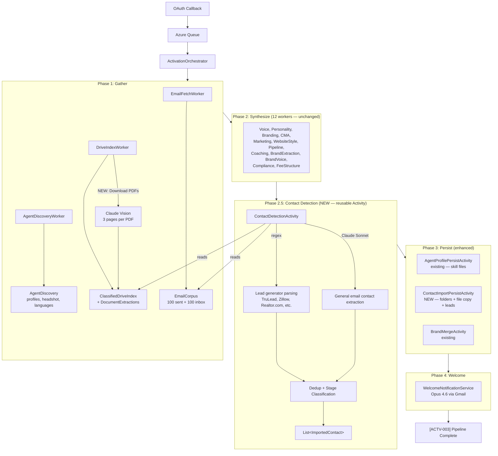
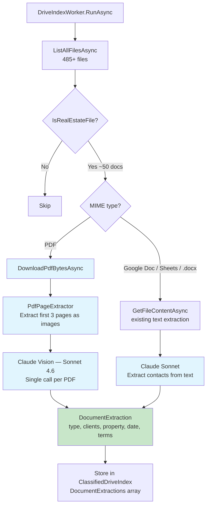
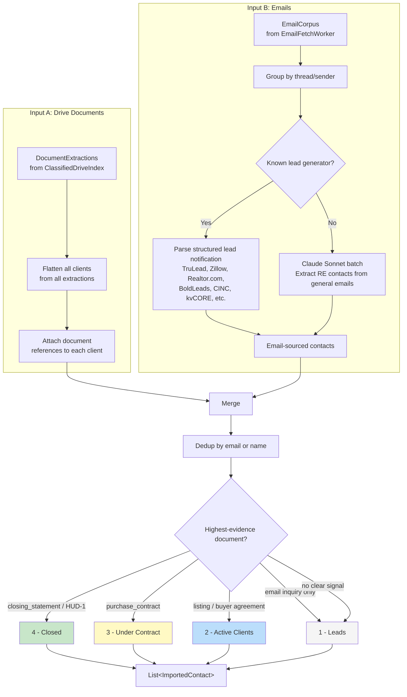
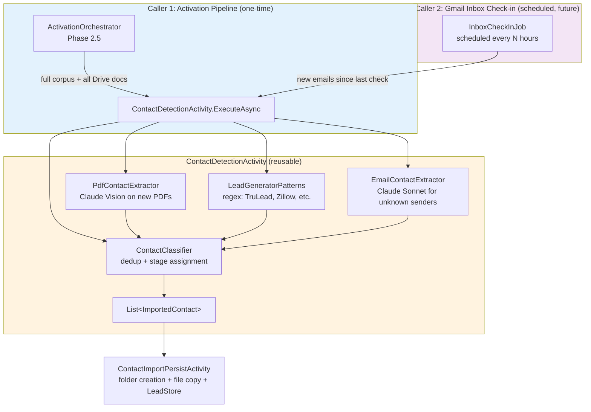
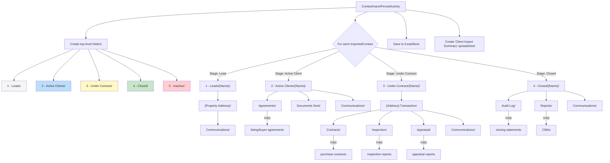
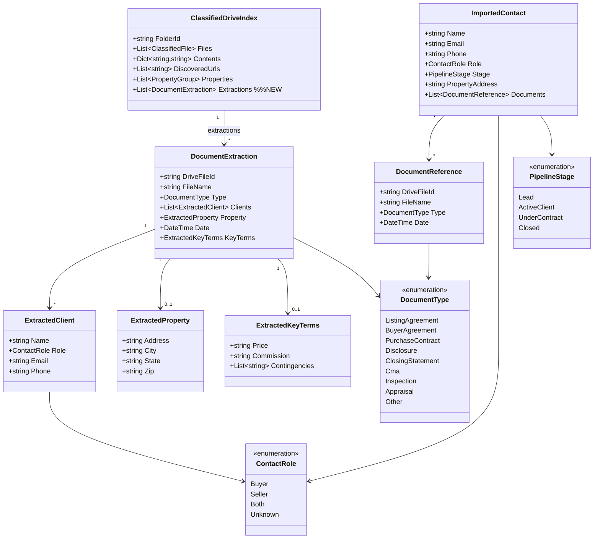
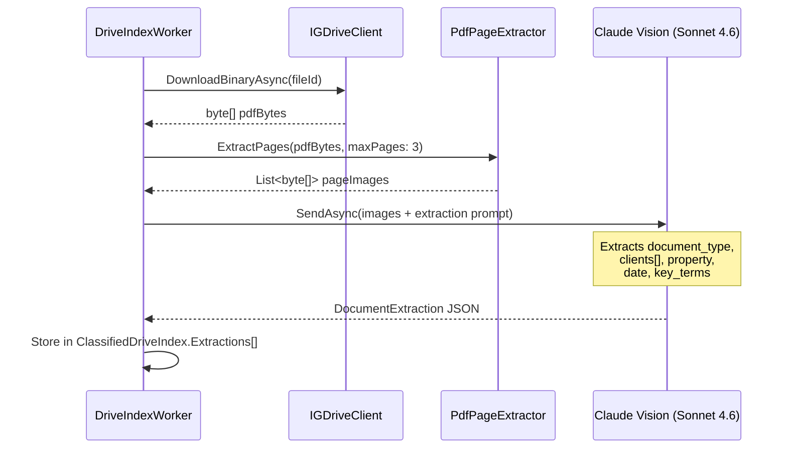

# Contact Import During Activation

**Date:** 2026-04-01
**Status:** Implementing
**Scope:** Enhanced Phase 1 DriveIndex + new Phase 2.5 classifier + new Phase 3 persist activity

---

## Problem

When an agent connects their Google account, the activation pipeline reads their emails and Drive files for voice/personality analysis but discards all the structured client/property/transaction data. The agent's existing business — leads, active clients, properties under contract, closed deals — is invisible to the platform.

## Goals

- Extract contacts, properties, and transaction stages from Drive PDFs and emails
- Classify each contact into the correct pipeline stage (Lead, Active Client, Under Contract, Closed)
- Create the standard folder structure in Google Drive per the CMA pipeline spec
- Copy relevant documents into the correct client folders
- Save contacts to ILeadStore with appropriate status
- Create a summary spreadsheet in Drive

## Non-Goals

- OCR of handwritten documents (Claude Vision handles printed text only)
- Ongoing email monitoring (this is a one-time import during activation)
- Merging duplicate contacts across sources (simple dedup by email/name)

---

## End-to-End Pipeline Flow



---

## PDF Extraction Flow (DriveIndexWorker Enhancement)



**Batching:** Up to 5 PDFs processed in parallel.

**Claude Vision prompt:**
```
You are extracting structured data from a real estate document.
Return JSON with:
{
  "document_type": "listing_agreement|buyer_agreement|purchase_contract|
                    disclosure|closing_statement|cma|inspection|appraisal|other",
  "clients": [{"name": "...", "role": "buyer|seller|both", "email": "...", "phone": "..."}],
  "property": {"address": "...", "city": "...", "state": "...", "zip": "..."},
  "date": "YYYY-MM-DD",
  "key_terms": {"price": "...", "commission": "...", "contingencies": [...]}
}
Only extract what is clearly visible. Use null for missing fields.
```

**Cost:** ~$0.01-0.05 per page x 3 pages x ~30-50 relevant PDFs = $0.90-7.50

---

## Contact Classification Flow (Phase 2.5)



---

## Activity Reuse: Two Callers, One Activity



**Activation (Caller 1):** Processes the full email corpus (200 emails) + all Drive PDFs. One-time bulk import.

**Inbox Check-in (Caller 2, future):** Processes only emails received since the last check. Lightweight — mostly lead generator regex parsing, minimal Claude usage. Runs on a schedule (e.g., every 2 hours) or triggered by Gmail push notification.

---

## Lead Generator Detection

The agent's inbox likely contains automated lead notifications from third-party platforms. These have structured formats that are easier to parse than general emails.

**Known lead generators to detect (by sender domain or subject pattern):**

| Platform | Sender / Pattern | Data Available |
|----------|-----------------|----------------|
| TruLead | `@trulead.com` | Name, email, phone, property, intent |
| Zillow Premier Agent | `@zillow.com`, "New lead from Zillow" | Name, email, phone, property URL, budget |
| Realtor.com | `@realtor.com`, "New connection" | Name, email, phone, property, timeline |
| BoldLeads | `@boldleads.com` | Name, email, phone, property address |
| CINC | `@cincpro.com` | Name, email, phone, search criteria |
| kvCORE | `@kvcore.com`, `@insiderealestate.com` | Name, email, phone, property views |
| Ylopo | `@ylopo.com` | Name, email, phone, saved searches |
| Real Geeks | `@realgeeks.com` | Name, email, phone, viewed properties |
| BoomTown | `@boomtownroi.com` | Name, email, phone, lead score |
| Follow Up Boss | `@followupboss.com` | Forwarded lead with source attribution |
| Sierra Interactive | `@sierraint.com` | Name, email, phone, property alerts |

**Detection approach:**
1. First pass: regex match on sender email domain against known platforms
2. For matched emails: parse the structured notification format (each platform has a consistent template)
3. For unmatched emails: send to Claude Sonnet for general contact extraction

This avoids sending 200 emails to Claude when 80% are parseable with simple regex. Saves tokens and is faster.

---

## Folder Creation + File Organization (Phase 3)



---

## Data Model



---

## Sequence: Single PDF Extraction



---

## C# Domain Models

```csharp
public sealed record DocumentExtraction(
    string DriveFileId,
    string FileName,
    DocumentType Type,
    IReadOnlyList<ExtractedClient> Clients,
    ExtractedProperty? Property,
    DateTime? Date,
    ExtractedKeyTerms? KeyTerms);

public sealed record ExtractedClient(
    string Name,
    ContactRole Role,
    string? Email,
    string? Phone);

public sealed record ExtractedProperty(
    string Address,
    string? City,
    string? State,
    string? Zip);

public sealed record ExtractedKeyTerms(
    string? Price,
    string? Commission,
    IReadOnlyList<string> Contingencies);

[JsonStringEnumConverter]
public enum DocumentType
{
    ListingAgreement, BuyerAgreement, PurchaseContract,
    Disclosure, ClosingStatement, Cma, Inspection,
    Appraisal, Other
}

public sealed record ImportedContact(
    string Name,
    string? Email,
    string? Phone,
    ContactRole Role,
    PipelineStage Stage,
    string? PropertyAddress,
    IReadOnlyList<DocumentReference> Documents);

[JsonStringEnumConverter]
public enum ContactRole { Buyer, Seller, Both, Unknown }

[JsonStringEnumConverter]
public enum PipelineStage { Lead, ActiveClient, UnderContract, Closed }

public sealed record DocumentReference(
    string DriveFileId,
    string FileName,
    DocumentType Type,
    DateTime? Date);
```

---

## Project Structure

```
Workers/Activation/
  RealEstateStar.Workers.Activation.DriveIndex/  (MODIFIED)
    DriveIndexWorker.cs        -- add PDF download + Claude Vision extraction
    PdfPageExtractor.cs        -- convert PDF pages to images (NEW)

Activities/Leads/
  RealEstateStar.Activities.Lead.ContactDetection/  (NEW -- reusable Activity)
    ContactDetectionActivity.cs    -- orchestrates extraction + classification
    PdfContactExtractor.cs         -- Claude Vision extraction from PDF pages
    EmailContactExtractor.cs       -- lead generator regex + Claude Sonnet batch
    ContactClassifier.cs           -- dedup + stage classification
    LeadGeneratorPatterns.cs       -- known sender domains + parsing templates

Activities/Activation/
  RealEstateStar.Activities.Activation.ContactImportPersist/  (NEW)
    ContactImportPersistActivity.cs

Domain/Activation/Models/
  DocumentExtraction.cs  (NEW) -- extracted contact/property/terms per document
  ImportedContact.cs     (NEW) -- classified contact with stage + documents
```

**Why an Activity, not a Worker:** The contact detection logic needs to be called from two places:
1. Activation pipeline (Phase 2.5) -- one-time import of all existing contacts
2. Future Gmail inbox check-in (scheduled) -- periodic scan for new lead notifications

An Activity is callable by any orchestrator. A Worker is tied to a specific pipeline.

**Dependencies:**
- DriveIndexWorker: Domain + Workers.Shared (already has IAnthropicClient access via orchestrator)
- ContactDetectionActivity: Domain + IAnthropicClient + IGDriveClient (calls Claude + reads PDFs)
- ContactImportPersistActivity: Domain + IFileStorageProviderFactory + ILeadStore

---

## Observability

```
ActivitySource: "RealEstateStar.ContactImport"

Spans:
  contact-import.pdf-extract      -- per PDF, tags: file_id, document_type
  contact-import.email-extract    -- per batch
  contact-import.classify         -- full classification pass
  contact-import.persist          -- folder creation + file copy + lead store

Counters:
  contacts.imported               -- by stage dimension
  pdfs.processed                  -- total PDFs sent to Claude Vision
  pdfs.pages_read                 -- total pages (max 3 per doc)
  contacts.duplicates_merged      -- dedup count

Error codes:
  CONTACT-001  PDF extraction succeeded
  CONTACT-002  Email extraction succeeded
  CONTACT-003  Classification complete
  CONTACT-010  PDF extraction failed (per file, non-fatal)
  CONTACT-011  Email extraction failed
  CONTACT-012  Classification failed
  CONTACT-020  Persist failed
```

---

## Cost Summary

| Component | Estimated Cost |
|-----------|---------------|
| PDF extraction (50 docs x 3 pages x Claude Vision) | $1.50-7.50 |
| Email contact extraction (batch Sonnet) | $0.30-0.50 |
| Classification + dedup | negligible |
| **Total per activation** | **$1.80-8.00** |
| **With filename pre-filter (30 relevant PDFs)** | **$0.90-4.50** |

**Full activation cost per agent (including existing pipeline):**

| Component | Cost |
|-----------|------|
| Existing activation (12 workers + welcome) | $0.80-1.20 |
| Contact import (new) | $0.90-4.50 |
| Container compute (~5 min) | $0.02 |
| **Total** | **$1.72-5.72** |
