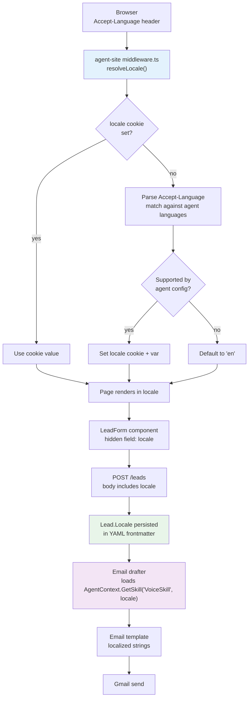
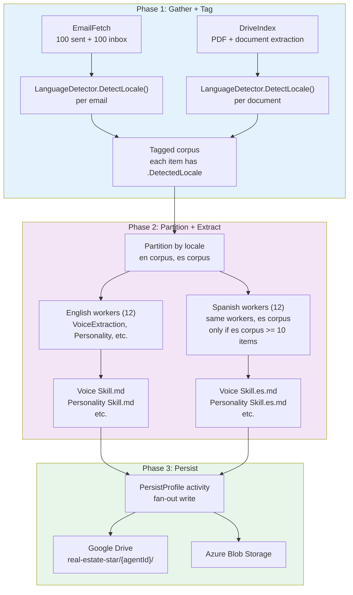

# Language as a First-Class Dimension — Design Spec

**Date:** 2026-04-02
**Status:** Draft
**Author:** Eddie Rosado

---

## Problem Statement

Agent sites now support multiple languages (PR #123), but the backend pipelines (activation, lead processing) are English-only. Bilingual agents like Jenise Buckalew — who communicates with clients in both English and Spanish — need per-language voice and personality extraction during activation. Spanish-speaking leads should receive Spanish emails and CMA reports that match the agent's authentic Spanish communication style.

Today, all activation workers produce a single English skill file (e.g., `Voice Skill.md`), and the lead pipeline drafts English-only emails regardless of the contact's language preference. This creates a jarring experience for Spanish-speaking leads interacting with a bilingual agent's Spanish-language website.

## Two-Axis Model

Language flows through the system on two independent axes:

| Axis | Source | Stored As | Used By |
|------|--------|-----------|---------|
| **Agent language capability** | Activation pipeline (Phase 2 workers) | Per-language skill files (`Voice Skill.es.md`) | Email drafter, CMA generator, future follow-up system |
| **Contact language preference** | Lead form submission (`Lead.Locale`) | `locale` field in Lead frontmatter | Email template selection, CMA PDF locale, notification language |

These axes combine at runtime: the email drafter loads the agent's skill for the contact's locale, producing a message that matches both the agent's authentic voice in that language and the contact's preference.

## Supported Languages

- **English** (`en`) — default, always available
- **Spanish** (`es`) — opt-in via `identity.languages` in agent config

The infrastructure is extensible to additional BCP 47 locale codes, but only English and Spanish are supported at launch.

## Locale Detection Flow

### Language Detection Algorithm

`LanguageDetector.DetectLocale(text)` in `Domain/Shared/Services/` uses a two-pass heuristic:

1. **Character-set check:** If the text contains characters from extended Latin sets common in Spanish (accented vowels, inverted punctuation), increment the Spanish signal score.
2. **Stop-word scoring:** Count occurrences of high-frequency Spanish stop words (`de`, `la`, `el`, `en`, `que`, `los`, `las`, `por`, `con`, `para`) vs. English stop words (`the`, `and`, `for`, `with`, `that`, `this`, `from`, `have`, `are`). The language with the higher normalized score wins.
3. **Threshold:** If neither language exceeds a 60% confidence threshold, default to `en`.

This heuristic is used during activation (Phase 1) to tag emails and documents by language before partitioning for Phase 2 extraction.

## Per-Language Skill Extraction

### Minimum Corpus Threshold

Spanish skill extraction only runs if the tagged Spanish corpus contains at least 10 items (emails + documents combined). Below this threshold, there is insufficient data for Claude to extract a meaningful voice or personality profile. The agent still supports Spanish on the website, but email drafts fall back to English skills with a Spanish translation prompt.

### Per-Language File Naming

| English (default) | Spanish |
|-------------------|---------|
| `Voice Skill.md` | `Voice Skill.es.md` |
| `Personality Skill.md` | `Personality Skill.es.md` |
| `Marketing Style.md` | `Marketing Style.es.md` |
| `Brand Voice.md` | `Brand Voice.es.md` |

Convention: `{Skill Name}.{locale}.md` where locale is omitted for English (the default).

## Locale Flow in Lead Pipeline

When a lead submits through the agent site:

1. **Form submission:** The `LeadForm` component includes a hidden `locale` field set to the page's resolved locale.
2. **API endpoint:** `Lead.Locale` is persisted in the lead's YAML frontmatter (`locale: es`).
3. **Email drafter:** Loads `AgentContext.GetSkill("VoiceSkill", lead.Locale)`. If the locale-specific skill exists (`Voice Skill.es.md`), it uses the agent's authentic Spanish voice. If not, falls back to the English skill with a system prompt instructing Claude to draft in Spanish.
4. **CMA PDF:** `CmaPdfGenerator` renders localized section headers, labels, and disclaimer text based on `lead.Locale`.
5. **Agent notification:** The notification to the agent (email/WhatsApp) is always in English — the agent manages their pipeline in English regardless of the contact's language.
6. **TCPA consent:** Consent text stays in English regardless of locale (legal requirement — TCPA consent must be in the language the regulation was written in).

## Observability

### ActivitySource

`RealEstateStar.Language` ActivitySource with spans:

| Span | Tags | Description |
|------|------|-------------|
| `language.detect` | `input_length`, `detected_locale`, `confidence` | Per-text language detection |
| `language.skill_load` | `skill_name`, `requested_locale`, `resolved_locale`, `fallback` | Skill file resolution with fallback tracking |
| `language.corpus_partition` | `en_count`, `es_count`, `total_count` | Phase 1 corpus partitioning |

### Meter

`RealEstateStar.Language` Meter:

| Metric | Type | Dimensions |
|--------|------|------------|
| `language.detection.count` | Counter | `detected_locale` |
| `language.skill_fallback.count` | Counter | `skill_name`, `requested_locale` |
| `language.corpus.size` | Histogram | `locale` |

### Existing Metric Enrichment

Add `locale` tag to existing metrics:
- `lead.submitted` — tag with `Lead.Locale`
- `email.drafted` — tag with locale used
- `cma.generated` — tag with locale used

## Follow-Up Wiring

`Lead.Locale` is persisted in the lead's YAML frontmatter from day one. When the follow-up system is built, it reads `Lead.Locale` to:
- Select the correct per-language voice skill for follow-up drafts
- Render follow-up email templates in the contact's language
- Schedule follow-ups at culturally appropriate intervals

No additional migration is needed — the locale field is already in place.

## Security Considerations

- Language detection input is the agent's own emails/documents (trusted data), not user input
- Lead locale comes from a hidden form field validated against the agent's supported languages array — arbitrary locale values are rejected
- Per-language skill files follow the same storage and access patterns as English skills (no new attack surface)
- TCPA consent text is never translated (legal requirement)

## Non-Goals

- Machine translation of skill files (skills are extracted from the agent's actual communications, not translated)
- More than two languages at launch
- Locale-specific pricing or billing
- Right-to-left language support
