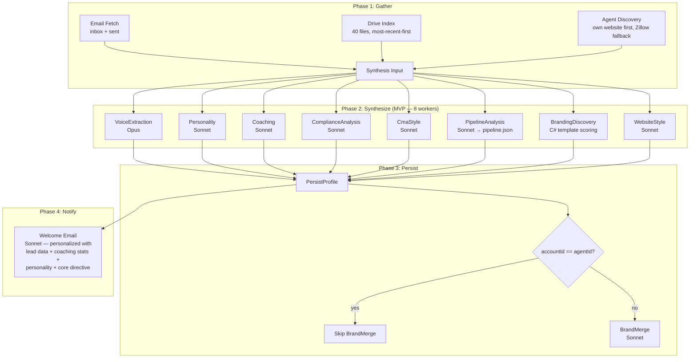
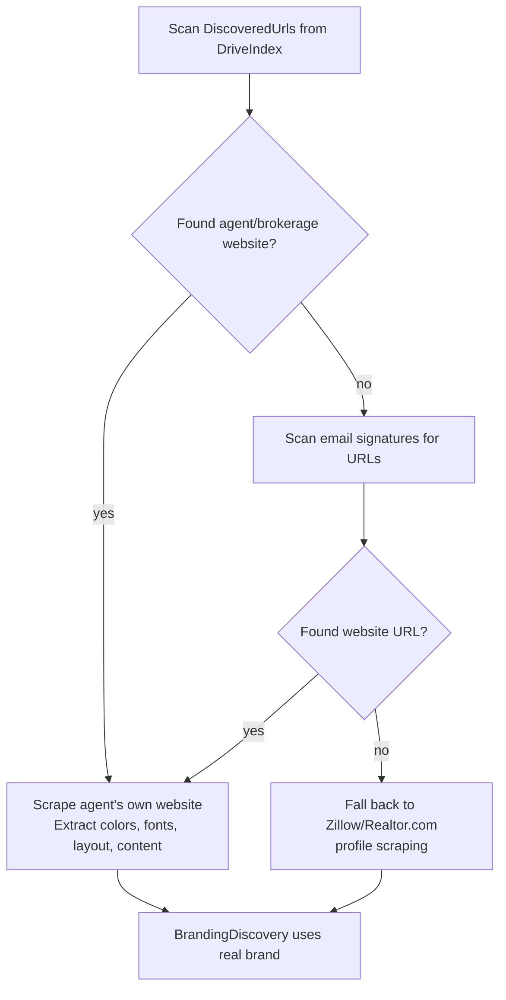

# Activation Pipeline MVP Redesign

**Date:** 2026-04-05
**Author:** Eddie Rosado + Claude
**Status:** Draft
**Branch:** `feat/durable-functions`

---

## Problem Statement

The activation pipeline runs 12 Phase 2 synthesis workers (~$5.43/activation), produces redundant files, double-writes to Google Drive for single-agent accounts, and doesn't align with what the MVP actually needs. Several workers produce empty or redundant output. The welcome email is generic. Claude API is used where C# would suffice. The pipeline analysis produces a markdown narrative instead of structured data the platform can query.

## MVP Features

The activation pipeline exists to power these four features:

| # | Feature | Description |
|---|---------|-------------|
| 1 | **Agent Website** | Personal or brokerage site with agent profile, branding, lead capture |
| 2 | **CMA Per Page** | Per-agent CMA with intelligent lead routing for brokerages |
| 3 | **Gmail Lead Monitoring** | Watch inbox for inbound leads, auto-detect and track |
| 4 | **Lead Follow-ups** | Drip sequences, coaching-informed nurture, lifecycle emails |

Everything in the activation pipeline must trace back to one of these features.

---

## Architecture Overview



---

## Phase 1: Gather (Redesigned)

### Drive Index

**Change:** Cap at 40 files (down from 100), sorted by `ModifiedTime` descending.

| Setting | Current | New |
|---------|---------|-----|
| `MaxStagedFiles` | 100 | **40** |
| Sort order | Most recent first | Most recent first (unchanged) |
| File types | Real estate keywords | Unchanged |

**Rationale:** Synthesizers use at most 10-20 files. 40 gives headroom without waste. Most recent files are most relevant — an agent's current deals, not archives from 3 years ago.

### Email Fetch

**Mostly unchanged.** Inbox + sent already fetched. Feeds Voice/Personality extraction AND pipeline analysis.

**New:** Export two additional data sets for cross-referencing:
1. **`knownEmailNames`** — set of all sender/recipient display names seen across inbox + sent. Used by Drive text extraction to detect leads/customers in documents.
2. **`emailAttachmentFileIds`** — list of Google Drive file IDs that appeared as email attachments, paired with email date and subject. Used by DriveIndex to prioritize PDF extraction (email-attached PDFs processed first).

### Agent Discovery — Priority Rewrite

**Current flow:** Scrape Zillow/Realtor.com profiles, extract branding.

**New flow:**



**Rationale:** The agent's own website has their real brand — colors, fonts, layout, messaging. Zillow gives you Zillow's template with the agent's name in it. Real branding produces a dramatically better agent site.

**Implementation:**
- `AgentDiscoveryWorker` already collects `DiscoveredUrls` from Drive and email corpus
- Add URL classification: `IsAgentWebsite(url)` — exclude Zillow, Realtor.com, social media, Google, etc.
- If agent website found → scrape it first, mark `BrandSource = "OwnWebsite"`
- If not found → fall back to current Zillow/Realtor.com flow, mark `BrandSource = "ThirdParty"`
- `BrandSource` passed to BrandingDiscovery worker for context

---

## Phase 2: Synthesize (MVP Tier)

### Workers: Keep (8)

| Worker | Model | Cost/call | MVP Feature | Notes |
|--------|-------|-----------|-------------|-------|
| VoiceExtraction | **Opus** | $1.43 | Lead follow-ups | Most valuable file. Opus quality justified. Multi-language coming. |
| Personality | Sonnet | $0.29 | Lead follow-ups | HOW to say it — essential for authentic tone |
| Coaching | Sonnet | $0.29 | Lead follow-ups | Response time analysis, drip strategy, concrete stats |
| ComplianceAnalysis | Sonnet | $0.29 | Lead follow-ups | Required disclosures in auto-drafted emails (legal risk) |
| CmaStyle | Sonnet | $0.29 | CMA | Styling for CMA analysis tone |
| PipelineAnalysis | Sonnet | $0.29 | Gmail monitoring | **Output format changes to JSON** (see Pipeline section) |
| BrandingDiscovery | Sonnet | $0.29 | Website | Colors, fonts, logos. **Template recommendation → C#** |
| WebsiteStyle | Sonnet | $0.29 | Website | Layout, content structure, lead capture patterns |

### Workers: Remove (4) — FUTURE Tier

| Worker | Cost/call | Why removed |
|--------|-----------|-------------|
| BrandExtraction | $0.29 | Redundant with BrandingDiscovery + Voice Skill |
| BrandVoice | $0.29 | Redundant with Voice Skill — same phrases/tone data |
| MarketingStyle | $0.29 | Produces "not determinable" for most agents — zero value |
| FeeStructure | $0.29 | Produces "not determinable" for most agents — zero value |

### Cost Impact

| | Current | MVP Tier |
|---|---------|----------|
| Phase 2 workers | 12 | 8 |
| Claude calls/activation | ~15 | ~10 |
| Cost/activation | $5.43 | **$3.26** |
| Savings | — | **40%** |

---

## Phase 2: C# Optimizations

### 1. Template Recommendation (BrandingDiscovery) — Eliminate Claude Call

**Current:** Claude picks one of 4 template names from brand signals.
**Replace with:** Scoring function in C#.

```csharp
internal static string ScoreTemplate(
    IReadOnlyList<ColorEntry> colors,
    IReadOnlyList<FontEntry> fonts,
    IReadOnlyList<ThirdPartyProfile> profiles,
    string? specialties)
{
    var score = new Dictionary<string, int>
    {
        ["luxury"] = 0, ["modern"] = 0, ["warm"] = 0, ["professional"] = 0
    };

    // Dark/deep palette → luxury
    // Bright/saturated → modern
    // Warm tones (earth, cream) → warm
    // Neutral/muted → professional

    // Serif headline fonts → luxury
    // Sans-serif geometric → modern
    // Rounded sans-serif → warm
    // Traditional serif body → professional

    // Keywords in specialties/bio
    // "luxury", "investment", "estate" → luxury
    // "first-time", "family", "community" → warm
    // etc.

    return score.MaxBy(kv => kv.Value).Key;
}
```

**Savings:** $0.29/activation, ~100ms faster

### 2. Text Document Extraction (DriveIndex) — Replace Claude with Regex + Lead Detection

**Current:** Each text document sent to Claude for structured field extraction.
**Replace with:** C# regex extraction for text documents. Keep Claude Vision for PDFs only.

```csharp
internal static DocumentExtraction? ExtractWithRegex(string fileId, string fileName, string content)
{
    // Email: [\w.-]+@[\w.-]+\.\w+
    // Phone: \(?\d{3}\)?[-.\s]?\d{3}[-.\s]?\d{4}
    // NJ Address: \d+\s[\w\s]+(St|Ave|Rd|Dr|Ln|Ct|Blvd|Way)[\s,]+\w[\w\s]+,?\s*NJ\s*\d{5}
    // Price: \$[\d,]+(?:\.\d{2})?
    // Date: DateTime.TryParse on common patterns
    // Doc type: keyword matching on filename + content
}
```

**Scope:** Text docs only (Google Docs, Sheets exported to text, .docx, .txt). PDFs still use Claude Vision — can't regex binary.

#### Lead/Customer Detection in Documents

The text extraction pass should specifically look for **potential leads and customers** — names, emails, phone numbers, property addresses. These are cross-referenced with the email corpus to build a richer picture:

```csharp
internal static List<DetectedContact> DetectContacts(
    string content,
    IReadOnlySet<string> knownEmailNames)
{
    // 1. Extract all names that appear near contact patterns
    //    (name + email, name + phone, name + address on adjacent lines)
    
    // 2. Cross-reference against names seen in email corpus
    //    If "Christy Lynch" appears in both a Drive doc AND email threads,
    //    high confidence this is an active lead/client
    
    // 3. Flag names that appear in multiple documents
    //    (same person across listing agreement + email = active deal)
}
```

The `knownEmailNames` set is built from the email corpus during Phase 1 — sender names, recipient names, names in signature blocks. When the same name appears in a Drive document (listing agreement, purchase contract, rental application), it's almost certainly an active lead or client. This feeds directly into `pipeline.json`.

#### Email-Attached PDFs Get Priority

PDFs that were **attached to emails** are more likely to contain active deal data (contracts, applications, disclosures) than PDFs sitting in Drive folders (which may be templates or old archives). The DriveIndex worker should prioritize these:

```csharp
// Email corpus provides attachment metadata: fileId + email date + email subject
// DriveIndex sorts PDF extraction queue:
//   1. PDFs found as email attachments (sorted by email date, most recent first)
//   2. PDFs in Drive only (sorted by ModifiedTime, most recent first)
// This ensures the MaxPdfExtractions cap (10) hits the most relevant PDFs first.
```

**Implementation:** The email fetch phase already sees attachment metadata (file IDs, names). Pass these IDs to DriveIndex as `emailAttachmentFileIds`. When building the PDF extraction queue, partition into email-attached vs. Drive-only, process email-attached first.

**Savings:** ~$1-2/activation depending on file count

### 3. Compliance Pre-Pass — Reduce Claude Token Input

**Current:** Full email/doc corpus sent to Claude for compliance analysis.
**Add:** C# pre-scan flags obvious gaps, only sends flagged docs to Claude.

```csharp
// Quick checks before Claude
var hasEHO = content.Contains("Equal Housing", StringComparison.OrdinalIgnoreCase);
var hasLicense = Regex.IsMatch(content, @"#\d{5,7}");
var hasBrokerage = content.Contains(brokerageName, StringComparison.OrdinalIgnoreCase);
```

**Savings:** ~50% token reduction on compliance call (~$0.15)

---

## Pipeline Architecture — `pipeline.json`

### Motivation

The Sales Pipeline is not a coaching artifact — it's the **live source of truth** for the agent's lead pipeline. It must be:

1. Queryable by C# (WhatsApp fast path — no Claude for simple lookups)
2. Continuously updatable (Gmail monitoring appends/moves entries)
3. Structured enough to build a UI view later
4. Compact enough to fit in a Claude prompt for complex questions

### File Location

```
real-estate-star/{agentId}/pipeline.json
```

- Agent-level ONLY — never at account level
- Replaces `Sales Pipeline.md` (markdown narrative → structured JSON)

### Schema

```json
{
  "agentId": "jenise-buckalew",
  "updatedAt": "2026-04-05T17:01:41Z",
  "leads": [
    {
      "id": "L-001",
      "name": "Christy Lynch & Dontrell Finley",
      "stage": "applied",
      "type": "rental",
      "property": "12B N Main St, Englishtown, NJ",
      "source": "direct",
      "firstSeen": "2026-03-30",
      "lastActivity": "2026-03-30",
      "next": "awaiting landlord response",
      "notes": "credit issues but strong rental history"
    }
  ]
}
```

**Stage values:** `new` | `contacted` | `showing` | `applied` | `under-contract` | `closing` | `closed` | `lost`

### Domain Model

```csharp
// RealEstateStar.Domain/Activation/Models/AgentPipeline.cs
public sealed record AgentPipeline(
    string AgentId,
    DateTime UpdatedAt,
    IReadOnlyList<PipelineLead> Leads);

public sealed record PipelineLead(
    string Id,
    string Name,
    string Stage,
    string Type,        // "sale" | "rental" | "buyer" | "seller"
    string? Property,
    string? Source,
    DateTime FirstSeen,
    DateTime LastActivity,
    string? Next,
    string? Notes);
```

### PipelineQueryService (Domain — pure C#, zero deps)

Handles ~95% of agent WhatsApp questions without a Claude call:

```csharp
// RealEstateStar.Domain/Activation/Services/PipelineQueryService.cs
public sealed class PipelineQueryService
{
    public string? TryAnswer(AgentPipeline pipeline, string question)
    {
        var q = question.ToLowerInvariant().Trim();

        // Property lookup: "spruce st", "12b n main"
        var propertyMatch = pipeline.Leads
            .Where(l => l.Property is not null && ContainsAddressTokens(q, l.Property))
            .ToList();
        if (propertyMatch.Count > 0)
            return FormatLeadList(propertyMatch);

        // Name lookup: "christy", "natasha"
        var nameMatch = pipeline.Leads
            .Where(l => ContainsNameTokens(q, l.Name))
            .ToList();
        if (nameMatch.Count > 0)
            return FormatLeadList(nameMatch);

        // Stage queries: "closing", "new leads", "active"
        if (ContainsAny(q, "closing", "close this week"))
            return FormatStageList(pipeline, "closing");
        if (ContainsAny(q, "new lead", "new contact", "recent"))
            return FormatRecent(pipeline, days: 7);
        if (ContainsAny(q, "pipeline", "how", "overview", "summary"))
            return FormatSummary(pipeline);

        // No match → return null, caller uses Claude fallback
        return null;
    }
}
```

**WhatsApp flow:**
```
Agent: "what's happening with Spruce St?"
→ Deserialize pipeline.json (~1ms)
→ PipelineQueryService.TryAnswer() (~0.1ms)
→ Match found → respond directly (0 Claude cost, <100ms total)
→ No match → Claude with pipeline JSON as context ($0.01-0.05)
```

### PipelineAnalysis Worker Changes

The `PipelineAnalysisWorker` output format changes from free-form markdown to the `pipeline.json` schema above. Same Claude call, different output prompt — Claude extracts structured lead data from emails into JSON instead of writing a narrative report.

**New input:** The worker receives the cross-referenced contact data from Phase 1:
- `knownEmailNames` — names seen in emails
- `DetectedContacts` from Drive text extraction — names seen in documents that match email names
- Email-attached PDF extractions — structured data from contracts/applications

This gives Claude a pre-built roster of likely leads/clients. Claude's job shifts from "find leads in this email dump" to "here are the people we already identified — determine their pipeline stage and next action from the email threads." More structured input = better output + fewer tokens wasted on discovery.

---

## Phase 3: Persist + BrandMerge

### BrandMerge Short-Circuit

```csharp
// In orchestrator, before BrandMerge call:
var isSingleAgent = request.AccountId == request.AgentId;
if (!isSingleAgent)
{
    await ctx.CallActivityAsync(ActivityNames.BrandMerge, ...);
}
// else: skip entirely — no Claude call, no Drive writes
```

**Savings:** $0.14/activation for single-agent accounts + eliminates redundant Google Drive API calls.

### pipeline.json Persistence

`PersistProfile` writes `pipeline.json` to `real-estate-star/{agentId}/` in blob storage. This is the initial snapshot. Gmail monitoring updates it continuously after activation.

---

## Phase 4: Welcome Email Redesign

### Current State

- Model: Opus ($0.45/call)
- Content: Generic "welcome aboard" with agent site URL
- Data: Only uses Voice Skill + Personality + coaching tip (high-level)

### New Design

- Model: **Sonnet** ($0.09/call)
- Content: **"We already know your business"** — specific lead data, concrete coaching stats, real personality

### What Gets Passed Through

The orchestrator already has all Phase 2 results at Phase 4. Add to `WelcomeNotificationInput`:

```csharp
public sealed record WelcomeNotificationInput
{
    // ... existing fields ...

    // NEW: synthesis context for personalized welcome
    [JsonPropertyName("voiceSkill")] public string? VoiceSkill { get; init; }
    [JsonPropertyName("personalitySkill")] public string? PersonalitySkill { get; init; }
    [JsonPropertyName("coachingReport")] public string? CoachingReport { get; init; }
    [JsonPropertyName("pipelineJson")] public string? PipelineJson { get; init; }
    [JsonPropertyName("contactCount")] public int ContactCount { get; init; }
}
```

### Email Content Structure

The welcome email becomes a 4-section message:

**Section 1: Personalized Greeting (personality-driven)**
> Uses agent's core directive traits + personality warmth/confidence levels to set the tone. References their catchphrase or sign-off naturally.

**Section 2: "We Found Your Leads" (pipeline data)**
> Mentions the most recent 1-2 leads by name and property. Shows Real Estate Star already understands their business.
>
> *"We noticed you're working with Natasha on a rental at 2538 Spruce St — looks like she submitted an application on April 2nd. We'll keep an eye on that and make sure no follow-up slips through."*

**Section 3: Concrete Coaching Insight (real numbers)**
> Pulls a specific stat from the Coaching Report — response time, follow-up gap, close rate opportunity. Makes it actionable and shows the value proposition with real data from their business.
>
> *"Looking at your recent activity, your follow-up with the 12B N Main St applicants took about 9 days after the initial advocacy email. Industry data shows responding within 2 hours increases close rates by 40%. Going forward, Real Estate Star will auto-draft follow-ups within 90 minutes so you never miss that window."*

**Section 4: Platform Value Prop (concrete, not generic)**
> Specific to what Real Estate Star will do for THIS agent based on their data. Not "we automate workflows" — instead "we'll monitor your Gmail for new leads, auto-draft responses in your voice, and track every deal in your pipeline."

### Claude Prompt Changes

```
System prompt additions:
- Agent personality traits (warmth: X/10, confidence: Y/10, energy level, humor usage)
- Core directive from Voice Skill ("prioritize client satisfaction, build trust...")
- INSTRUCTION: Match this agent's personality. If warmth=8, be warm. If humor=0, no jokes.
- INSTRUCTION: Include a specific lead from the pipeline data.
- INSTRUCTION: Include a concrete coaching stat with real numbers.
- INSTRUCTION: Show how Real Estate Star closes the loop on their specific leads.
```

---

## Tier Configuration

### Account-Level Setting

Add to `config/accounts/{handle}/account.json`:

```json
{
  "activation": {
    "tier": "mvp"
  }
}
```

| Tier | Workers | Cost/activation | Features |
|------|---------|----------------|----------|
| `mvp` | 8 | ~$3.26 | Website, CMA, Gmail monitoring, lead follow-ups |
| `future` | 12 | ~$5.43 | Everything in MVP + BrandExtraction, BrandVoice, MarketingStyle, FeeStructure |

Default: `mvp` (if field absent)

### Orchestrator Implementation

The orchestrator reads the tier from `ActivationRequest` (loaded from account config at enqueue time) and conditionally dispatches workers:

```csharp
// FUTURE-tier-only workers
if (tier == "future")
{
    var brandExtractionTask = WrapAsync<StringOutput>(...);
    var brandVoiceTask = WrapAsync<StringOutput>(...);
    var marketingTask = WrapAsync<MarketingStyleOutput>(...);
    var feeTask = WrapAsync<StringOutput>(...);
    await Task.WhenAll(brandExtractionTask, brandVoiceTask, marketingTask, feeTask);
}
```

---

## Files to Modify

### Phase 1 Changes
| File | Change |
|------|--------|
| `DriveIndexWorker.cs` | `MaxStagedFiles` 100 → 40 |
| `AgentDiscoveryWorker.cs` | Add own-website-first priority logic |
| `BrandingDiscoveryWorker.cs` | Replace Claude template recommendation with C# `ScoreTemplate()` |

### Phase 2 Changes
| File | Change |
|------|--------|
| `ActivationOrchestratorFunction.cs` | Tier-conditional worker dispatch; pass synthesis data to WelcomeNotificationInput; skip BrandMerge for single-agent |
| `PipelineAnalysisWorker.cs` | Output `pipeline.json` schema instead of markdown |
| `DriveIndexWorker.cs` | Replace text-doc Claude extraction with regex |
| `ComplianceAnalysisWorker.cs` | Add C# pre-pass for boilerplate detection |

### Phase 3 Changes
| File | Change |
|------|--------|
| `ActivationOrchestratorFunction.cs` | Skip BrandMerge when `accountId == agentId` |
| `AgentProfilePersistActivity.cs` | Write `pipeline.json` alongside markdown files |

### Phase 4 Changes
| File | Change |
|------|--------|
| `ActivationDtos.cs` | Add fields to `WelcomeNotificationInput` |
| `WelcomeNotificationService.cs` | Model Opus → Sonnet; rewrite prompt with 4-section structure |
| `ActivationOrchestratorFunction.cs` | Pass synthesis data to welcome notification |

### New Files
| File | Description |
|------|-------------|
| `RealEstateStar.Domain/Activation/Models/AgentPipeline.cs` | Pipeline domain model |
| `RealEstateStar.Domain/Activation/Services/PipelineQueryService.cs` | C# query service for WhatsApp fast path |

### Config Changes
| File | Change |
|------|--------|
| `config/accounts/*/account.json` | Add `activation.tier` field |
| `ActivationRequest` | Add `Tier` property |

---

## Cost Summary

| Item | Current | After |
|------|---------|-------|
| Phase 2 workers | 12 Claude calls | 8 Claude calls + 1 C# |
| Template recommendation | 1 Sonnet call ($0.29) | C# scoring ($0.00) |
| Text doc extraction | ~30 Sonnet calls | C# regex ($0.00) |
| BrandMerge (single-agent) | 1 Sonnet call ($0.14) | Skipped ($0.00) |
| Welcome email | 1 Opus call ($0.45) | 1 Sonnet call ($0.09) |
| **Total/activation** | **~$5.43** | **~$2.83** |
| **Savings** | — | **48%** |

---

## Verification Plan

1. Deploy to Azure Functions
2. Purge safari-homes + jenise-buckalew test data
3. Queue activation for both agents with `tier: "mvp"`
4. Verify: Drive Index stages 40 files (not 100)
5. Verify: Agent Discovery finds jenise's website before Zillow
6. Verify: Only 8 Phase 2 workers run (not 12)
7. Verify: BrandMerge skipped for jenise (single-agent)
8. Verify: `pipeline.json` written with structured lead data
9. Verify: Welcome email includes lead data + coaching stats + personality
10. Verify: Welcome email uses Sonnet (check CLAUDE-020 logs)
11. Verify: PipelineQueryService answers "what's happening with Spruce St?" without Claude
12. Compare Azure Monitor execution count + GB-seconds vs. previous runs
13. Check Anthropic API usage for cost reduction

---

## Future Work (Not In This Spec)

- **Gmail monitoring integration** — continuously updates `pipeline.json` as new emails arrive
- **WhatsApp pipeline queries** — `PipelineQueryService` wired into WhatsApp message handler
- **Multi-language activation** — VoiceExtraction produces per-locale skills (Voice Skill.es.md)
- **FUTURE tier workers** — BrandExtraction, BrandVoice, MarketingStyle, FeeStructure
- **Pipeline → database migration** — when `pipeline.json` gets too large, move to Azure Table Storage
