# Agent Site Comprehensive Design

**Status:** Draft (Revision 2 — incorporates legal, security, and maintainability review)
**Date:** 2026-04-12
**Owner:** Eddie Rosado
**Author:** Claude (Opus 4.6)
**Base branch:** This spec targets `feat/azure-cost-reduction` (PR #154), not `main`. PR #154 establishes the Y1 Consumption + GHCR infrastructure baseline that this spec's cost and memory claims land against.
**Scope:** End-to-end design for generating, previewing, publishing, and multi-hosting agent websites from activation pipeline data, with no gaps between pipeline outputs and site requirements.

> **Revision history**
> - **R1 (initial)**: First draft committed after scoping conversation.
> - **R2 (this version)**: Incorporates three independent reviews (legal/ADA, security, maintainability) that together flagged 17 BLOCKER-severity issues and 33 HIGH-severity issues. All 17 BLOCKERs are addressed in v1 per project decision. New cross-cutting sections §16 (Security & Trust Model), §17 (Compliance Requirements Matrix), and §18 (Tunables and Thresholds) hold the invariants the reviewers identified as missing. Appendices D (Test Inventory), E (Log Code Ranges), and F (Runtime Worker DAG) added to support maintainability. The `IVoicedContentGenerator` abstraction is introduced in §5.3 to eliminate the ~15 duplicate Claude call sites flagged in the maintainability review.

---

## 0. Executive Summary

Real Estate Star's activation pipeline currently produces ~16 markdown files per agent that are consumed almost entirely by backend tooling (lead email drafting, future CMA generation, coaching analytics). The agent-site — the actual customer-facing product — today renders off **hand-crafted `content.json` files** that the pipeline does not produce. This document closes that gap.

The design delivers:

1. A **deterministic content-generation pathway** from pipeline data to per-locale `content-{locale}.json` files, with per-locale resynthesis in the agent's own voice (not verbatim translation), driven by a single `IVoicedContentGenerator` abstraction that eliminates prompt-site duplication (§5.3).
2. **Brokerage-first capture with defended trust boundaries**: when any agent triggers activation with a brokerage domain, the pipeline captures every agent listed on the brokerage's team page as a prospective record. All scraped URLs pass SSRF validation; all scraped content is sanitized before persistence to prevent stored XSS (§7, §16).
3. **BYOD custom domains** via Cloudflare for SaaS with TXT-challenge ownership verification, periodic re-verification to prevent hostname takeover, and a typosquat/reserved-domain blocklist (§9, §16).
4. A **Preview → Approve → Bill → Edit** state machine with opaque-cookie preview sessions (not URL-embedded tokens), Stripe webhook signature verification, and explicit endpoint authentication (§10, §16).
5. **Hybrid content loading**: test fixtures remain bundled into the Worker for PR preview builds; production agents live in Cloudflare KV (versioned key format for future schema migrations) with instant updates and no redeploys.
6. **Legal compliance wired into every page**, not just the legal section: site-wide Equal Housing Opportunity footer, TCPA consent capture on contact forms, alt text for every image, WCAG 2.1 AA color contrast validation with auto-correction, and a hard pre-publish block on missing state-required advertising fields (§17).
7. A **prospect subsystem** capturing publicly discoverable agent data with robots.txt compliance, identifiable bot user agent, response size caps, and a data subject access request (DSAR) workflow for GDPR/CCPA erasure rights.
8. **Reuses the existing i18n infrastructure** instead of rebuilding it — the agent-site already has locale detection, cookie persistence, language switcher UI, and a file-per-locale loader. The pipeline gap is producing the per-locale content files, not building the plumbing.

The document is organized as **18 sections** plus 6 appendices. Sections are self-contained — reading section 9 does not require reading section 5 as context. Each major architectural decision has a boxed **Decision** callout tied to a specific turn in the design conversation, so future reviewers can trace intent. Three cross-cutting sections (§16 Security, §17 Compliance, §18 Tunables) exist to hold invariants that apply across multiple components, so constraints appear in one place instead of being duplicated inline.

### 0.1 Reading guide

- **15-minute path** (executive stakeholders): §0 Executive Summary, §1.1 Goals, §2 Decision Log, §14.1 end-to-end data flow diagram.
- **1-hour path** (engineering leads scoping work): add §3 Content Schema, §4 Data Sourcing Matrix, §5 Pipeline Changes, §6 Hybrid Content Loading, §10 Preview Flow, §15 Implementation Plan, §16 Security & Trust Model, §17 Compliance Matrix.
- **Deep dive** (implementing a specific component): open the section(s) for the component plus Appendices D (Test Inventory), E (Log Codes), and F (Runtime DAG).
- **I need to add a new section type**: Appendix C quickstart checklist.
- **I need to add a new locale**: Appendix C quickstart checklist.
- **I'm investigating a production incident**: start with Appendix E (log codes), then the relevant section from §16 (Security) or §17 (Compliance).

---

## 1. Goals and Non-Goals

### 1.1 Goals

| # | Goal | Success criteria |
|---|---|---|
| G1 | Generate a complete, publishable agent site from activation pipeline outputs alone — no hand-crafted content | An agent completes activation and has a production-ready `account.json` + `content.json` + `content-{locale}.json` set persisted to Cloudflare KV |
| G2 | Support single-agent and brokerage site topologies simultaneously on a single pipeline | Running activation against `accountId: "glr", agentId: "jenise"` produces a brokerage home at `glr.real-estate-star.com/` AND an agent subpage at `glr.real-estate-star.com/agents/jenise` |
| G3 | Support multi-lingual sites end-to-end with per-locale resynthesis in the agent's own voice | Bilingual Jenise's site serves Spanish copy that reads like Jenise authored it in Spanish, not a machine translation of her English copy |
| G4 | Capture prospective agent data from scraped brokerage sites for future warm-start activations and later outbound sales | Activating the first GLR agent captures 11 other GLR agents into a prospects table; when Noelle later activates, her pipeline runs in <50% the time and <50% the cost of Jenise's because warm-start data is available |
| G5 | Support BYOD custom domains so one agent is reachable at up to 3 URLs concurrently | Jenise's content renders at `jenise-buckalew.real-estate-star.com`, `glr.real-estate-star.com/agents/jenise`, and `jenisesellsnj.com` with correct canonical URL resolution |
| G6 | Gate billing behind the agent previewing and approving their generated site | No agent is charged before they have clicked "Approve & Continue" on their preview; abandoned previews sit indefinitely without billing |
| G7 | Ship legal pages (Privacy, Terms, Accessibility, Fair Housing, TCPA consent) generated from scraped data, per-locale, with a "review with counsel" disclaimer | Every published site has all five legal pages populated in every supported locale except TCPA which stays English |
| G8 | Respect the Y1 Consumption memory envelope (no OOM regressions) | DriveIndex activity stays ≤ 400 MB peak; full activation completes without SIGSEGV. **Note**: Y1 Consumption does not publish a hard 1.5 GB limit the way Flex Consumption FC1 did; this target is empirically anchored to the prior FC1 observation and must be re-validated on Y1 during migration (see §13.1 migration checklist) |
| G9 | Preserve existing PR preview build flow for engineers iterating on template / section code | A PR targeting the agent-site templates renders test fixture accounts correctly in its Cloudflare Pages preview URL |
| G10 | Keep per-activation Claude cost ≤ $1.20 for a monolingual MVP activation, ≤ $1.60 for bilingual, ≤ $2.00 for trilingual | Observable in Grafana via `[CLAUDE-020]` `EstCost` field aggregation, broken down by `PipelineStep` discriminator |
| G11 | Every site ships legally compliant with Fair Housing, TCPA, ADA Title III (WCAG 2.1 AA), and state real estate advertising rules | Each rule in §17 Compliance Matrix has an automated enforcement test; no site can transition to `Live` state while any required-field test fails |
| G12 | Every attacker-controlled input is validated before trust, sanitized before persistence, and escaped before rendering | Zero stored XSS vectors on any scraped field; SSRF denylist on every outbound HTTP call; every new API endpoint has documented auth in §16.3 endpoint matrix |
| G13 | Per-locale Claude polish of any user-facing field runs through a single `IVoicedContentGenerator` abstraction | No direct `IAnthropicClient` calls in any Phase 2.5/2.6/2.75 worker; all field generation is a declarative `FieldSpec` passed to the shared generator (§5.3) |

### 1.2 Explicit non-goals

| # | Non-goal | Rationale |
|---|---|---|
| N1 | Onboarding chat flow integration | Auto-onboarding is a separate future project. This pipeline runs on activation request with no chat-derived inputs. |
| N2 | Outbound email sending to prospects | Prospect data capture is in scope; building the sender, templating, cadence, unsubscribe handling, and deliverability infrastructure is a separate future project. |
| N3 | City-specific landing pages (e.g., `/areas/carteret-nj`) | Service areas are rendered as inline text in existing sections. Dedicated per-city pages create SEO debt and maintenance burden without clear ROI given Zillow/Realtor domain authority. |
| N4 | Refresh worker implementation | A `RefreshWebsiteWorker` that re-runs against existing accounts to pull new listings, reviews, and reconcile team rosters is referenced throughout this doc as future scope. It is not specced here. |
| N5 | Auto-regeneration of existing production accounts | Existing activations for `jenise-buckalew` and `safari-homes` stay as-is until manually re-triggered. No automatic migration on first request after deploy. |
| N6 | Section structure changes | Existing section types (hero, stats, features, steps, gallery, testimonials, profiles, contact_form, about, marquee) are the working set. No new section types are introduced. The design uses existing sections creatively where needed. |
| N7 | Registrar / DNS management | BYOD means "bring your own domain." We accept a CNAME pointing at us and provision SSL. We do not sell domains, manage DNS records beyond routing, or handle expirations. |
| N8 | Image manipulation / cropping / retouching of scraped headshots | Agent headshots are rehosted as-is from their source. Quality is the source's responsibility. |
| N9 | A/B testing or multivariate testing of generated content | Each agent gets one version of their site. Future iteration. |
| N10 | Building a live site editor in this scope | Editing is enabled post-billing but the editor UI is out of scope here. The design ensures the data model supports editing (drafts, KV writes, versioning); the UI is its own project. |

### 1.3 What this document changes

By the end of implementation, the following will be true:

- The `PersistAgentProfileActivity` will write `content.json` and `content-{locale}.json` files for every detected locale, in addition to the existing skill markdown files.
- A new table `real-estate-star-prospects` will exist in Azure Table Storage and be populated during brokerage website scraping.
- A new table `real-estate-star-custom-hostnames` will exist for BYOD domain tracking.
- A new Cloudflare KV namespace `agent-site-content` will hold production agent content, keyed by `{accountId}:{locale}` and `{accountId}:{locale}:draft`.
- A new Cloudflare R2 bucket `agent-site-assets` will hold rehosted headshots, logos, and icons.
- The agent-site Worker will load content from KV at runtime for production hostnames and from bundled fixtures for preview builds.
- A new API endpoint surface on the platform for: site approve, domain add/verify/delete, prospect opt-in ingestion.

---

## 2. Decision Log

Every significant architectural decision in this spec has a callout in the relevant section. This log is the index for easy auditing.

| # | Decision | Chosen | Alternatives | Section |
|---|---|---|---|---|
| D1 | Content schema shape for multi-lingual | Separate `content-{locale}.json` files | Field-level `Localized<T>` | §3 |
| D2 | Template title source | Template `defaultContent` exports + content.json override | Uniform hardcoded titles OR pure content.json | §3 |
| D3 | Data sourcing philosophy | Tier 1 real data → Tier 2 onboarding (out of scope now) → Tier 3 Claude polish in agent voice | Claude-first generation | §4 |
| D4 | City pages | Removed — service areas rendered inline in existing sections | Dedicated `/areas/:slug` pages | §3 / §4 |
| D5 | Content loading architecture | Hybrid: bundled test fixtures for preview builds + KV for production | All-KV OR all-bundled | §6 |
| D6 | Asset storage | Cloudflare R2, lazy rehosting at activation time | Azure Blob with API proxy | §6 |
| D7 | Prospect outreach scope | Capture only; outreach infrastructure is future project | Capture + outreach in one ship | §7 |
| D8 | Prospect consent posture | Opt-in during join flow | Pre-enrolled silent use | §7 |
| D9 | Team-scrape aggressiveness | Sitemap-first, conservative URL fallback | Blind crawl OR explicit list only | §7 |
| D10 | Team-scrape freshness | 90-day TTL, re-scrape on stale join | Refresh every join OR ignore | §7 |
| D11 | Headshot rehosting timing | Lazy (only on actual activation) | Eager at brokerage capture | §6 / §7 |
| D12 | Brokerage create/join detection | Auto-detect from `account.json` presence | Explicit `Mode` field on request | §8 |
| D13 | Lead routing algorithm | Service-area hard filter → specialty score boost → round-robin with fairness counter | Pure round-robin OR pure first-match | §8 |
| D14 | Custom domain scope | BYOD (bring your own) in MVP, Cloudflare for SaaS integration | Phase 2 OR full registrar | §9 |
| D15 | Preview flow | Preview → Approve → Bill → Edit; draft lives alongside live in KV | Auto-publish with post-launch edit OR bill before preview | §10 |
| D16 | Legal pages disclaimer | No disclaimer — pages ship as the compliance work product | Disclaimer to reduce liability | §11 |
| D17 | Existing account migration | Manual trigger only, no auto-regeneration | Grandfather OR auto-migrate | §13 |
| D18 | i18n architecture | Reuse existing file-per-locale loader, extend pipeline to produce files | Introduce new `Localized<T>` schema | §3 / §5 |
| D19 | Portuguese completion | Ship as part of this project to validate locale-registry design | Leave stubbed | §5 |
| D20 | Fact extraction | New `SiteFactExtractor` worker runs once per activation; downstream localization consumes facts | Re-extract facts per locale | §5 |
| D21 | Blocker triage | All 17 review BLOCKERs stay in v1 — no deferrals | Split into v1 + v1.1 | §2 (user decision, review pass) |
| D22 | Voiced content abstraction | `IVoicedContentGenerator` with declarative `FieldSpec` inputs shipped day one | Per-worker duplicate Claude call sites | §5.3 |
| D23 | Preview session mechanism | Opaque HttpOnly cookie with KV-backed revocable session, **not** URL-embedded HMAC token | Stateless signed JWT in query param | §16.1 |
| D24 | Custom hostname ownership proof | Two-phase: TXT challenge for ownership, CNAME for routing activation | CNAME-only | §16.2 |
| D25 | Typosquat / reserved domain protection | Blocklist + Levenshtein check + homoglyph normalization on `POST /domains` | Accept any valid hostname | §16.2 |
| D26 | Stripe webhook integrity | Signature verification + idempotency-by-event-id + server-side PriceId + `Idempotency-Key` on `Session.create` | Trust webhook payload | §16.5 |
| D27 | Scraping SSRF defense | Scheme + IP range + redirect + DNS-rebind validation on every outbound HTTP call in TeamScrapeWorker and any future scraper | Trust brokerage URL as-is | §16.4 |
| D28 | Scraped content XSS defense | All scraped strings parsed to text-only via HTML parser before persist; CSP with nonce on all agent-site responses; React auto-escaping only (unsafe-HTML injection APIs forbidden on scraped data) | Sanitize at render time only | §16.4 |
| D29 | Equal Housing Opportunity enforcement | Every template renders EHO footer on every page in every locale; CI grep test enforces presence; rendering invariant blocks template merge without it | Only a dedicated Fair Housing page | §17.1 |
| D30 | Contact form TCPA consent capture | Required checkbox with express consent language, recorded as `TcpaConsent { Given, Timestamp, Text, TextVersion, IpAddress, UserAgent }` in the lead record | Hope the agent captures it themselves | §17.3 |
| D31 | Brand color contrast validation | `ContrastValidator` in `BuildLocalizedSiteContent` auto-darkens/lightens colors that fail WCAG 4.5:1 until threshold met; blocks publish if unrepairable | Use scraped colors as-is | §17.6 |
| D32 | Alt text source | Deterministic per image type: headshot = "Portrait of {name}", logo = "{brokerage} logo", gallery = "{street}, {city} — sold {month year}", hero background = haiku-generated. Required at schema level; no image element can render without alt | Agent fills in manually | §17.6 |
| D33 | License / broker-name hard publish block | §10 state machine adds a pre-publish gate that verifies every field marked `required_for_state_X` is populated; missing fields move site to `Needs Info` state, not `Live` | Render gracefully if null | §17.7 |
| D34 | IDX attribution, refresh, and rights | Gallery items require `listing_courtesy_of`, `sold_by_agent`, `idx_participation_verified`; items without these are dropped; gallery auto-refreshes every 24 h via minimal refresh job (not the full future refresh worker) | Display all recent sales | §17.2 |
| D35 | Steering-language linter | `FairHousingLinter` runs after content synthesis, rejects or rewrites copy matching a versioned denylist of steering terms across all federal + state protected classes | Trust Claude output | §17.1 |
| D36 | `IVoicedContentGenerator` abstraction | One interface + one implementation; every T3 field is a declarative `FieldSpec`; eliminates 15 duplicate call sites and centralizes log codes, cost attribution, and schema validation | Duplicated per-worker | §5.3 |
| D37 | Rollback for net-new activations | Emergency fallback: if the new pipeline produces unusable content, the publish step can fall back to a minimal template-default-only `content.json` populated from `account.json` identity fields | Forward-fix only | §13.4 |
| D38 | Feature flags | `Activation:SiteContentGeneration:Enabled`, `Activation:FairHousingLinter:Enabled`, per-account deny lists for gradual rollout and emergency kill switches | No flags | §18 |
| D39 | KV key versioning | All KV keys include a `v1:` segment (`content:v1:{accountId}:{locale}:live`); Worker reads current version first, falls back to prior on miss | Unversioned keys | §6.1.2 |
| D40 | Endpoint authentication matrix | Explicit per-endpoint auth table in §16.3 — no endpoint ships without documented auth semantics | Defer to implementation | §16.3 |

---

## 3. Site Taxonomy and Content Schema

### 3.1 Page types in scope

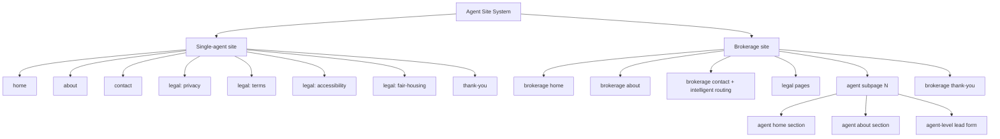

Both topologies share a single template system. A single-agent site is the degenerate case where the brokerage has exactly one agent and brokerage-only sections are hidden.

### 3.2 Content schema (existing + extended)

The existing `ContentConfig` type in `apps/agent-site/features/config/types.ts` is already well-specified. This design does **not** change the type shape. The extension is purely **file organization**:

**Decision D1: Separate content files per locale**

> **What we picked**: Per-locale files — `content.json` (English) + `content-es.json` + `content-pt.json` etc. Loaded by the existing `loadLocalizedContent(handle, locale, config)` function.
>
> **What we rejected**: A field-level `Localized<T>` schema where every string becomes `{ en: "...", es: "..." }`. This would require a template refactor touching ~100 component files and introduce a `t(field, locale)` helper that doesn't exist today.
>
> **Why**: The agent-site already ships with a file-per-locale loader and per-locale content bundling in `config-registry.ts`. The work is already done. The only gap is that **the pipeline doesn't produce per-locale content files** — it assumes someone hand-authored them (which someone did, for Jenise, manually). This design changes the pipeline to produce those files. The agent-site changes zero lines of template code.
>
> **Conversation reference**: Turn where we audited i18n and I corrected my assumption about `Localized<T>`. The audit showed `loadLocalizedContent` already exists at `apps/agent-site/features/config/config.ts:78-85` with graceful English fallback.

**File layout per agent**:

```
config/accounts/{handle}/
  account.json          (locale-neutral: identity, branding, contact)
  content.json          (English content, always required)
  content-es.json       (Spanish content, if supported_locales includes "es")
  content-pt.json       (Portuguese content, if supported_locales includes "pt")
  legal/
    privacy.md          (English)
    privacy.es.md
    privacy.pt.md
    terms.md
    terms.es.md
    terms.pt.md
    accessibility.md
    ... etc
```

In production, these files live in Cloudflare KV, not on disk. The filesystem layout above is the canonical dev-time representation used by test fixtures and `generate-config-registry.mjs`.

### 3.3 Nav ↔ section invariant

The existing validation test at `apps/agent-site/__tests__/config/validation.test.ts` enforces: every enabled nav item whose `href` starts with `#` must correspond to an enabled section with that key. This design **strengthens** the invariant with two additional rules:

1. **Section title source** (Decision D2): each template exports a `defaultContent` object providing default titles for every section it renders. At render time, the component resolves `content.{section}.data.title` first; if absent, falls back to `defaultContent.{section}.title`. Nothing is hardcoded in JSX component source.
2. **Section key = nav anchor = element id = title source**: a section keyed `features` in content.json is linked via `#features` in nav, rendered with `id="features"` on its root element, and its title comes from `content.features.data.title || template.defaultContent.features.title`. Exactly one source of truth per section per layer.

**Decision D2: Template default content via exported object**

> **What we picked**: Each template file (e.g., `emerald-classic.tsx`) exports a `defaultContent` object alongside the component. Sections render `content.{key}.data.title || template.defaultContent.{key}.title`.
>
> **What we rejected**: (a) Forcing every template to use identical uniform titles — limits template creative freedom; (b) Requiring every content.json to populate every title — forces agents to author copy they don't care about and defeats the purpose of template variety.
>
> **Why**: Your phrasing ("templates fully configurable via content.json, no hardcoded values") is satisfied. Every title **can** be overridden; template defaults exist for visual continuity when nothing is overridden. This keeps the 10 existing templates rendering with their current personalities (luxury says "Our Services," warm says "How We Help") while making every string customizable.
>
> **Conversation reference**: Turn where we discussed the ~19 hardcoded titles across section components and picked option (b) over uniform (a).

**Implementation**: a new validation test will enforce that every section component used in at least one template has a corresponding `defaultContent` entry in each template that uses it. If a template references `<ServicesGrid>` but `emerald-classic.defaultContent.features` is missing, the test fails. This prevents silent regressions when templates are edited.

### 3.4 Service area rendering

Service areas (`account.location.service_areas`) are rendered in **existing** sections, chosen per template:

| Template | Where service areas appear |
|---|---|
| emerald-classic | Hero body line beneath tagline: "Serving Carteret, Woodbridge, and Edison" |
| luxury-estate | About section opening sentence |
| warm-community | Features section item titled "I know your neighborhood" |
| modern-minimal | Stats bar item: "{N} markets served" |
| coastal-living | Hero body |
| commercial | About section plus stats ("{N} markets") |
| country-estate | Hero body |
| light-luxury | About section |
| new-beginnings | Features section item |
| urban-loft | Hero body |

A validation test enforces: every template must reference `account.location.service_areas` at least once in its render output. Grep-based test, runs in CI.

**Decision D4: Service areas rendered inline in existing sections, no dedicated city pages**

> **What we picked**: Template-chosen placement in existing sections. Zero new section types, zero new workers, zero new routing.
>
> **What we rejected**: Dedicated `/areas/:slug` pages with per-city market snapshots and Claude-polished narrative. Initially in the design, removed after scope pushback.
>
> **Why**: Dedicated city pages fight a losing SEO battle against Zillow/Realtor/Redfin domain authority, require a freshness mechanism (refresh worker) to avoid stale market data, and add 30+ seconds to activation per agent with 5+ service areas. The actual user value is "Jenise serves Carteret, Woodbridge, Edison" — one line of hero body, not a 500-word dedicated page.
>
> **Conversation reference**: Turn where user pushed back with "cant the copy just be a section in the 'why choose me?' section?"

### 3.5 Navigation scoping rules

`content.json` contains a `navigation.items` array. Items are strictly opt-in: a section not referenced by any nav item is not linked from the menu but may still render on the page. A section referenced by nav **must** be enabled in `pages.home.sections` (validated in CI).

For **brokerage sites with agent subpages**, nav items on an agent subpage link to anchors on that agent's page (e.g., `#agent-gallery` for Jenise's "Recently Sold" section), distinct from the brokerage home's nav. Agent subpages have their own content.json scope under `glr/agents/jenise/content.json`.

---

## 4. Data Sourcing Matrix

Every field on the site has a sourcing rule: where it comes from, what the fallback chain is, when it's polished by Claude, and when it's left empty.

**Decision D3: Data sourcing hierarchy**

> **Tier 1 (preferred)**: Real scraped/API data — Gmail, Drive, Bridge Interactive (Zillow reviews), RentCast comps, brokerage website scrape, email signature extraction, profile scraping.
>
> **Tier 2 (out of scope for this project)**: Onboarding chat answers explicitly captured from the agent. Reserved for future auto-onboarding work.
>
> **Tier 3 (polish only)**: Claude generates copy **only** from Tier 1 inputs, rewriting facts in the agent's detected voice per locale. Never hallucinating facts without source data.
>
> **Never**: Claude-generated facts (prices, stats, credentials, reviews). If we don't have data, the field is empty or uses the template default copy.
>
> **Conversation reference**: Turn where user said "always prefer real data over Claude, use Claude only as last-resort polish" and added "use the personality and voice found in onboarding but in the most professional and personal manner."

### 4.1 Field-by-field sourcing matrix

Legend: **T1** = Tier 1 (real data), **T3** = Tier 3 (Claude polish over T1), **D** = Deterministic from other fields, **DEF** = Template default if empty.

#### account.json (locale-neutral)

| Field | Source | Fallback | Notes |
|---|---|---|---|
| `handle` | T1: `ActivationRequest.AgentId` | — | Required |
| `template` | D: picked by `BuildSiteConfigActivity` from `BrandingDiscoveryWorker` analysis (color scheme + industry vibe) | "emerald-classic" | See §5.3 for template selection logic |
| `branding.primary_color` | T1: `BrandingKit.PrimaryColor` from BrandingDiscoveryWorker | "#1B5E20" (platform default) | |
| `branding.secondary_color` | T1: `BrandingKit.SecondaryColor` | null | |
| `branding.accent_color` | T1: `BrandingKit.AccentColor` | null | |
| `branding.font_family` | T1: `BrandingKit.FontFamily` | "Open Sans" | |
| `branding.logo_url` | T1: `ActivationOutputs.BrokerageLogoBytes` → rehosted to R2 | null | Lazy rehost at activation |
| `brokerage.name` | T1: email signature → brokerage website `<title>` → domain root | — | Required |
| `brokerage.license_number` | T1: email signature regex | null | |
| `brokerage.office_address` | T1: email signature → brokerage site "Contact" page scrape | null | |
| `brokerage.office_phone` | T1: email signature | null | |
| `agent.id` | T1: `ActivationRequest.AgentId` | — | Required |
| `agent.name` | T1: `ActivationOutputs.AgentName` from profile scrape → signature → Gmail profile | — | Required |
| `agent.title` | T1: profile scrape → signature | "REALTOR®" | |
| `agent.phone` | T1: signature → profile scrape | — | Required |
| `agent.email` | T1: `ActivationRequest.Email` | — | Required |
| `agent.headshot_url` | T1: discovery → R2 lazy rehost | null | |
| `agent.license_number` | T1: signature → state license board lookup (future) | null | |
| `agent.languages` | T1: `ActivationOutputs.Languages` (from VoiceExtraction + signature hints) | `["en"]` | Drives which content-*.json files generated |
| `agent.tagline` | T1: profile scrape → signature | null | |
| `agent.credentials` | T1: profile scrape | `[]` | e.g., "ABR", "CRS" |
| `location.state` | T1: `ActivationOutputs.State` | — | Required |
| `location.service_areas` | T1: `ActivationOutputs.ServiceAreas` (from listing history frequency analysis in emails/Drive) | `[]` | Empty is valid; rendering handles |
| `integrations.email_provider` | D: "gmail" (all activations are Gmail today) | "gmail" | |
| `integrations.hosting` | D: custom_hostname if BYOD configured, else platform subdomain | platform subdomain | |
| `contact_info` | T1: derived from `agent.phone`, `agent.email`, `brokerage.office_phone` | — | |
| `compliance.state_forms` | T1: state-specific from `ComplianceAnalysisWorker` | `[]` | See §11 |
| `compliance.licensing_body` | D: state → licensing body lookup table | null | Static mapping |

#### content.json / content-{locale}.json (per-locale)

| Section.field | Source | Fallback | Locale variant strategy |
|---|---|---|---|
| `navigation.items[].label` | T3: polished per locale | Template default | Per-locale resynthesis |
| `navigation.items[].href` | D: from section keys | — | Identical across locales |
| `hero.data.headline` | T3: polished per locale in agent voice | Template default | Per-locale resynthesis |
| `hero.data.highlight_word` | T3: highlighted keyword from headline | null | Per-locale |
| `hero.data.tagline` | T3: polished from agent.tagline + personality | Template default | Per-locale |
| `hero.data.body` | T3: paragraph mentioning state + service areas, in agent voice | Template default + `Serving {cities}` | Per-locale |
| `hero.data.cta_text` | T3: polished per locale | Template default ("Get Your Free Home Value Report") | Per-locale |
| `hero.data.cta_link` | D: `#contact_form` | — | Identical |
| `hero.data.background_image` | T1: brokerage site hero image OR R2-rehosted | null | Identical |
| `stats.data.items[]` | T1: review count, years from license, transaction count from emails/Drive, awards from profile | `[]` | Labels per-locale, values identical |
| `features.data.items[]` | T1 facts + T3 polish per item (services, specialties, service areas, response time, bilingual capability) | Template default set | Titles and descriptions per-locale |
| `steps.data.steps[]` | T1: derived from agent's pipeline stages (PipelineJson) + T3 polish | Template 3-step default | Per-locale |
| `gallery.data.items[]` | T1: Bridge Interactive recent sales OR agent-uploaded; **requires** `listing_courtesy_of`, `sold_by_agent: true`, `alt`, `last_refreshed_at`; non-compliant items are **dropped** | `[]` | Address/price locale-neutral; labels per-locale. **See §17.2 IDX compliance** |
| `testimonials.data.items[]` | T1: Bridge Interactive reviews (always T1, never Claude) | `[]` | Text is verbatim from source; titles per-locale |
| `profiles.data.items[]` | T1: brokerage team scrape (brokerage sites only), sanitized to plain text | `[]` | Names locale-neutral; titles per-locale. **See §16.4 XSS sanitization** |
| `contact_form.data.title` | T3: per locale | Template default | Per-locale |
| `contact_form.data.subtitle` | T3: per locale | Template default | Per-locale |
| `contact_form.data.description` | T3: per locale | Template default | Per-locale |
| `contact_form.data.tcpa_consent` | **REQUIRED**: TCPA express consent checkbox, English-only text, versioned template | — | Identical (English only per TCPA). **See §17.3** |
| `contact_form.data.fields[]` | D: per template, each with label, autocomplete, required, aria_describedby | — | Labels per-locale, field names identical. **See §17.6.4** |
| `about.data.title` | T3: per locale, e.g., "About Jenise" / "Acerca de Jenise" | Template default | Per-locale |
| `about.data.bio` | T3: polished from profile scrape + voice skill, per locale; **anti-plagiarism check** vs source | Template placeholder | Per-locale (key — bio should feel native). **See §17.8** |
| `about.data.credentials` | T1: `agent.credentials` | `[]` | Identical across locales |
| `about.data.image_url` | T1: second headshot or brokerage building, if available | `agent.headshot_url` | Identical |
| `about.data.image_alt` | **REQUIRED**: deterministic per §17.6.2 rules | — | English-safe phrasing |
| `marquee.data.items[]` | T1: awards, publication mentions from profile scrape | `[]` | Text per-locale if polish applied, else verbatim |
| `thank_you.heading` | T3: per locale | Template default | Per-locale |
| `thank_you.subheading` | T3: per locale | Template default | Per-locale |
| `thank_you.body` | T3: per locale + {firstName} interpolation | Template default | Per-locale |
| `footer.equal_housing_notice` | D: always rendered, localized EHO statement | **UNCONDITIONAL** | Per-locale. **See §17.1.1** |
| `footer.privacy_choices_link` | D: always rendered, routes to `/privacy-choices` | **UNCONDITIONAL** | Per-locale label. **See §17.5.2** |
| `footer.cookie_consent_banner` | D: geo-gated, always rendered for EU/state-privacy visitors | **UNCONDITIONAL for EU/CA/etc.** | Per-locale text. **See §17.5.1** |
| All image fields (headshot, logo, gallery, hero bg, icon) | **REQUIRED**: `alt` field populated per §17.6.2 deterministic rules | — | Alt uses stable English phrasing (screen reader safe regardless of page locale) |
| Brand color fields | T1: scraped from brokerage site, **validated and potentially auto-adjusted** via `ContrastValidator` for WCAG 4.5:1 minimum | Platform defaults | Identical (colors are locale-neutral). **See §17.6.1** |

### 4.2 What "per-locale resynthesis" means concretely

For every T3 field, the pipeline runs a separate Claude call per locale. The call takes:

- The raw Tier 1 facts relevant to that field (e.g., for hero headline: agent name, brokerage, state, service areas, primary specialty)
- The agent's `VoiceSkill.{locale}` markdown (from `LocalizedSkills` dict, produced by `VoiceExtractionWorker`)
- The agent's `PersonalitySkill.{locale}` if available (same mechanism)
- A field-specific prompt like: "Write a hero headline for this agent in {locale}. Use the voice in this skill file. Keep it under 8 words. Return only the headline, no quotes."

The output is native copy in the agent's voice for that locale. The English version is generated the **same way** — it is not a privileged source-of-truth that other locales translate from. Each locale is independently authored from facts + voice.

When the agent does not have a `VoiceSkill.{locale}` for a given locale (insufficient email corpus in that language), the pipeline **does not generate content in that locale**. The agent's site ships with only the locales for which we have authentic voice.

### 4.3 Cost estimate per activation

Based on the matrix, approximate Claude token usage and cost per locale:

| Pipeline step | Model | Input tokens | Output tokens | Cost per call | Calls |
|---|---|---|---|---|---|
| Fact extraction (`SiteFactExtractor`) | haiku-4-5 | 8,000 | 800 | $0.009 | 1 |
| Hero content | sonnet-4-6 | 2,000 | 150 | $0.008 | 1 per locale |
| Features items (batched) | sonnet-4-6 | 3,500 | 800 | $0.022 | 1 per locale |
| Steps items | sonnet-4-6 | 2,000 | 400 | $0.012 | 1 per locale |
| About bio | sonnet-4-6 | 3,000 | 600 | $0.018 | 1 per locale |
| Contact form copy | haiku-4-5 | 1,500 | 150 | $0.002 | 1 per locale |
| Thank you page | haiku-4-5 | 1,500 | 150 | $0.002 | 1 per locale |
| Nav labels | haiku-4-5 | 800 | 100 | $0.001 | 1 per locale |
| Template selection | haiku-4-5 | 3,000 | 50 | $0.003 | 1 total |
| Legal pages (see §11) | sonnet-4-6 | 4,000 | 2,000 | $0.042 | 4 per locale |
| **Per-locale subtotal** | | | | | **~$0.24** |
| **Fact extraction (one-time)** | | | | | **~$0.01** |

**Monolingual agent**: ~$0.25 site-content generation + existing ~$0.60 synthesis worker cost = **~$0.85 total**.

**Bilingual agent**: ~$0.49 site-content generation + ~$0.60 synthesis + ~$0.10 legal pages second language = **~$1.19 total**.

**Trilingual agent**: **~$1.43 total**.

All under the G10 goal ($1.20 mono / $1.60 bi). Trilingual nudges the bi-budget but 99% of agents in the market are mono or bilingual.

---

## 5. Activation Pipeline Changes

### 5.1 Current state (before this design)

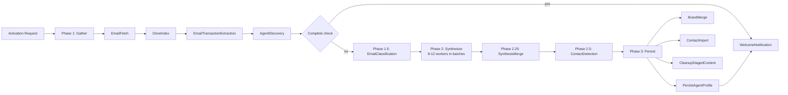

The pipeline today produces ~16 markdown skill files, a pipeline.json, and three binary assets. **It does not produce any agent-site content files**. `PersistAgentProfileActivity` delegates to an `IAgentConfigService.GenerateAsync()` which I audited and found to be a stub — it does not produce `account.json` or `content.json`. This is the core gap this design closes.

### 5.2 Target state (after this design)

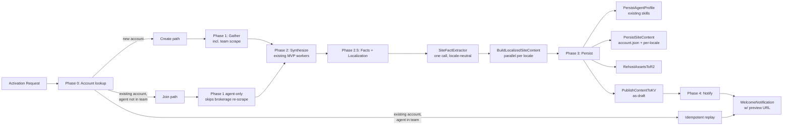

### 5.3 New and modified workers

#### IVoicedContentGenerator (new shared abstraction — foundational)

**Decision D36: one abstraction, one implementation, many declarative fields**

> Every T3 field in the §4.1 matrix follows the same shape: "take Tier 1 facts + VoiceSkill for locale + field-specific prompt → get polished string in agent voice, validated against a schema." Hero, tagline, features items, steps, about bio, contact copy, thank-you, nav labels, legal pages — all 15+ fields have this identical shape. Without a shared abstraction, the implementation would have 15 near-duplicate Claude call sites scattered across workers, each inventing its own prompt structure, its own error handling, its own log codes, and its own cost attribution.
>
> This is caught as a CRITICAL maintainability finding in review pass 2. The fix is introduced here (v1, not v1.1) because retroactive extraction after the fifth duplicate is cheap; after the tenth it's expensive; after the fifteenth it means touching every worker.

**Interface** (lives in `RealEstateStar.Domain.Activation.Interfaces`):

```csharp
public interface IVoicedContentGenerator
{
    Task<VoicedResult<T>> GenerateAsync<T>(VoicedRequest<T> request, CancellationToken ct);
    Task<VoicedResult<IReadOnlyList<T>>> GenerateBatchAsync<T>(
        VoicedBatchRequest<T> request,
        CancellationToken ct);
}

public sealed record VoicedRequest<T>(
    SiteFacts Facts,               // locale-neutral fact substrate
    string Locale,                 // e.g., "es"
    LocaleVoice Voice,             // VoiceSkill + PersonalitySkill for this locale
    FieldSpec<T> Field,            // what to generate
    string PipelineStep            // cost attribution label, e.g., "activation.hero.es"
);

public sealed record VoicedBatchRequest<T>(
    SiteFacts Facts,
    string Locale,
    LocaleVoice Voice,
    IReadOnlyList<FieldSpec<T>> Fields,  // one Claude call, multiple outputs
    string PipelineStep
);

public sealed record FieldSpec<T>(
    string Name,                   // e.g., "hero.headline"
    string PromptTemplate,         // Razor-style template with {{Facts.AgentName}} etc.
    int MaxOutputTokens,
    string Model,                  // "haiku-4-5" | "sonnet-4-6"
    IValidator<T> Schema,          // runtime schema validation
    T FallbackValue                // used if generation fails BEST-EFFORT
);

public sealed record VoicedResult<T>(
    T Value,
    bool IsFallback,               // true if fell back to FallbackValue
    string? FailureReason,         // populated when IsFallback
    ClaudeCallMetrics Metrics      // input tokens, output tokens, est cost, duration
);
```

**Implementation**: `VoicedContentGenerator` lives in `RealEstateStar.Clients.Anthropic` and is the **only** class that may call `IAnthropicClient.SendAsync` for T3 field generation. An architecture test enforces: no class outside `RealEstateStar.Clients.Anthropic` may reference `IAnthropicClient` within Phase 2.5/2.6/2.75 worker projects. Workers that need voiced content inject `IVoicedContentGenerator` instead.

**Responsibilities** of the generator (single place to change):

1. **Prompt assembly**: interpolate `FieldSpec.PromptTemplate` with `Facts` and `Voice` fields.
2. **Locale voice context injection**: prepend the `VoiceSkill.{locale}` and `PersonalitySkill.{locale}` content from `Voice` into the system prompt so Claude has the agent's voice front-loaded.
3. **Schema validation** of the output via `FieldSpec.Schema` — malformed outputs produce `VoicedResult<T>(FallbackValue, IsFallback: true, FailureReason: "schema-mismatch")`.
4. **Retry policy**: max 2 retries on transient errors (429, 5xx), exponential backoff with jitter. After retries exhausted → fallback.
5. **Cost logging**: emits `[CLAUDE-020]` with the `PipelineStep` discriminator passed in the request. This is the ONLY place cost logs originate for voiced content. Grafana dashboards group by `PipelineStep` for per-field attribution (§Appendix E).
6. **Fair housing linter integration**: before returning a generated string, runs the output through `IFairHousingLinter.CheckAsync` (§17.1). On steering-language match, attempts one rewrite; if still flagged, returns fallback with reason `"fair-housing-violation"`.
7. **Content hash caching**: if the same `(FieldSpec, Facts.Hash, Locale, VoiceHash)` has been generated in the last 24 h (Azure Table cache), return the cached value without a Claude call. This is the replay-safety and cost-reduction path.

**What workers no longer do themselves** (removed responsibilities):

- Build prompts by string concatenation
- Call `IAnthropicClient` directly
- Write `[CLAUDE-020]` logs
- Parse Claude JSON responses
- Handle retries or fallbacks for voiced content
- Apply the fair housing linter
- Validate content schemas

**Architecture test**: `VoicedContentGenerator_IsOnlyCallerOfAnthropicForVoicedFields` — reflects over all types in `RealEstateStar.Workers.Activation.*` and `RealEstateStar.Activities.Activation.*`, asserts that none inject `IAnthropicClient` other than the legacy workers carried over from pre-R2 (VoiceExtractionWorker, PersonalityWorker, BrandingDiscoveryWorker — these still call Claude directly because they produce *input* context for the generator, not *output* content).

**Unit testing**: `IVoicedContentGenerator` is stubbed in worker/activity tests via `FakeVoicedContentGenerator` which returns canned results keyed by `FieldSpec.Name`. Tests don't invoke real Claude. Golden-output tests (Appendix D) run against the real generator with VCR-recorded Claude responses to catch prompt regressions.

**Observability**: single ActivitySource `RealEstateStar.Clients.Anthropic.VoicedContentGenerator` with per-call spans tagged with `field.name`, `locale`, `pipeline.step`, `is_fallback`, `failure_reason`. One Grafana dashboard panel shows voiced-content cost, success rate, and fallback rate broken down by field and locale.

#### SiteFactExtractor (new)

- **Project**: `RealEstateStar.Workers.Activation.SiteFactExtractor`
- **Purpose**: Runs once per activation, produces a locale-neutral `SiteFacts` DTO consumed by every localization branch.
- **Inputs**: `ActivationOutputs` (VoiceSkill, PersonalitySkill, AgentDiscovery, BrandingKit, PipelineJson, transaction extractions, profile scrapes).
- **Outputs**: `SiteFacts` — an immutable record of every fact the site might render. Fields:

  ```csharp
  public sealed record SiteFacts(
      AgentIdentity Agent,          // name, title, license, years
      BrokerageIdentity Brokerage,  // name, license, offices
      LocationFacts Location,        // state, service areas (ordered by frequency)
      SpecialtiesFacts Specialties,  // list of specialties with evidence count
      TrustSignals Trust,            // review count, avg rating, transaction count, response time
      IReadOnlyList<RecentSale> RecentSales,  // gallery source data
      IReadOnlyList<Review> Testimonials,      // verbatim Bridge Interactive reviews
      IReadOnlyList<Credential> Credentials,   // ABR, CRS, etc.
      PipelineStages Stages,         // for steps section
      IReadOnlyDictionary<string, LocaleVoice> VoicesByLocale // VoiceSkill + PersonalitySkill keyed by locale
  );
  ```

- **Cost**: ~$0.01 (one haiku-4-5 call with input context)
- **Determinism**: pure compute from ActivationOutputs, same inputs → same outputs, cacheable for replay

#### BuildLocalizedSiteContentActivity (new)

- **Project**: `RealEstateStar.Activities.Activation.BuildLocalizedSiteContent`
- **Purpose**: Generates `content.json` (English) and `content-{locale}.json` for each additional detected locale, in parallel. Each locale invocation is independent.
- **Per-locale flow**:
  ```
  input: SiteFacts, locale, LocaleVoice
  1. Select template (deterministic, from SiteFacts.Brokerage.VibeSignals + Specialties)
  2. For each content section, generate field values per §4.1 matrix
     - T3 fields: batched Claude call per section with voice context
     - T1 fields: direct copy from SiteFacts
     - D fields: derived per rule
  3. Assemble content-{locale}.json
  4. Validate against schema (nav → section invariant, required fields present)
  5. Return the generated ContentConfig DTO
  ```
- **Parallelism**: orchestrator invokes this activity N times in parallel, once per `supported_locale`. Each invocation is independent, no cross-locale state.
- **Cost per locale**: ~$0.24 (see §4.3)

#### Template selection (deterministic, pure C#)

Template choice is not a Claude call. It's a deterministic score function over `SiteFacts`:

```
score(template, facts):
    color_score   = color_brightness_match(template.color_palette, facts.Brokerage.BrandingColors)
    vibe_score    = vibe_match(template.vibe_tags, facts.Specialties.VibeHints)
    luxury_score  = (facts.TrustSignals.AverageSalePrice > $1M) ? template.luxury_weight : 0
    commercial    = (facts.Specialties.Contains("commercial")) ? template.commercial_weight : 0
    family_warmth = (facts.Specialties.Contains("first-time-buyers") || "family")
                    ? template.warmth_weight : 0
    return weighted_sum(...)

select = argmax over all 10 templates
```

A validation test enforces every template has well-defined score weights and every agent category has at least one template scoring > 0.5. Future addition of templates requires updating the weights.

#### PersistSiteContentActivity (new)

- **Project**: `RealEstateStar.Activities.Activation.PersistSiteContent`
- **Purpose**: Persists the generated `account.json` + per-locale content files to (a) the agent's Drive folder (markdown-equivalent representations), (b) Azure Blob (JSON as backup), (c) Cloudflare KV as draft, (d) legal pages output.
- **Outputs written**:
  - `account.json` → KV `account:{accountId}` (not locale-scoped)
  - `content.json` → KV `content:{accountId}:en:draft`
  - `content-{locale}.json` → KV `content:{accountId}:{locale}:draft` for each additional locale
  - `legal/privacy.md` → KV `legal:{accountId}:privacy:en` (and per-locale)
  - Plus existing Drive/blob writes for backup and audit

#### RehostAssetsToR2Activity (new)

- **Project**: `RealEstateStar.Activities.Activation.RehostAssetsToR2`
- **Purpose**: Downloads `HeadshotBytes`, `BrokerageLogoBytes`, `BrokerageIconBytes` from activation outputs, uploads to Cloudflare R2 with stable public URLs, rewrites asset URLs in the generated `account.json` to point at R2.
- **R2 path convention**: `agents/{accountId}/{agentId}/{asset}.{ext}` e.g., `agents/glr/jenise/headshot.jpg`
- **Idempotency**: uses an `If-Match` header with ETag on overwrite, or writes under a content-hash path so replays don't double-write.
- **Lazy behavior**: only runs for assets that actually exist in the activation outputs. Prospective agent headshots (captured from brokerage scrape but not yet activated) are **not** rehosted here — they stay at their brokerage URL until the agent themselves activates.

### 5.4 LanguageDetector generalization

Current state: `apps/api/RealEstateStar.Domain/Shared/Services/LanguageDetector.cs` hardcodes en/es detection via character-set heuristics (ñ, ¿, ¡, accented vowels) and stop words. Portuguese in `SUPPORTED_LOCALES` is unreachable from the backend.

**Target**: a locale registry with per-locale character-set + stop-word heuristics, extensible without touching the worker code.

```csharp
public sealed class LanguageDetector {
    private readonly IReadOnlyList<LocaleHeuristic> _heuristics;

    public LanguageDetector() {
        _heuristics = new[] {
            new LocaleHeuristic("es", EspanolCharset, EspanolStopWords),
            new LocaleHeuristic("pt", PortugueseCharset, PortugueseStopWords),
            new LocaleHeuristic("fr", FrenchCharset, FrenchStopWords),
            new LocaleHeuristic("zh", ChineseCharset, Array.Empty<string>()),
        };
    }

    public string DetectLocale(string text) {
        if (string.IsNullOrWhiteSpace(text) || text.Length < 20) return "en";
        foreach (var h in _heuristics.OrderByDescending(h => h.Priority)) {
            if (h.Matches(text)) return h.Locale;
        }
        return "en";
    }
}
```

Adding a new locale is one entry in the registry. No new code paths, no worker modifications.

### 5.5 VoiceExtractionWorker generalization

Current state: runs English always, runs Spanish if ≥3 Spanish items in corpus, hardcoded.

Target: loops over detected locales, runs one pass per locale. Same threshold applies per locale.

```csharp
var detectedLocales = LanguageDetector.DetectLocalesInCorpus(emails);
foreach (var locale in detectedLocales) {
    if (locale == "en") continue;  // English always runs
    var items = FilterByLocale(emails, locale);
    if (items.Count >= MinCorpusSize) {
        localizedSkills[$"VoiceSkill.{locale}"] = await ExtractInLocale(items, locale);
        localizedSkills[$"PersonalitySkill.{locale}"] = await ExtractPersonalityInLocale(items, locale);
    }
}
```

The `supported_locales` for the agent then becomes the set of locales for which we successfully produced a voice skill.

### 5.6 Orchestrator dispatch changes

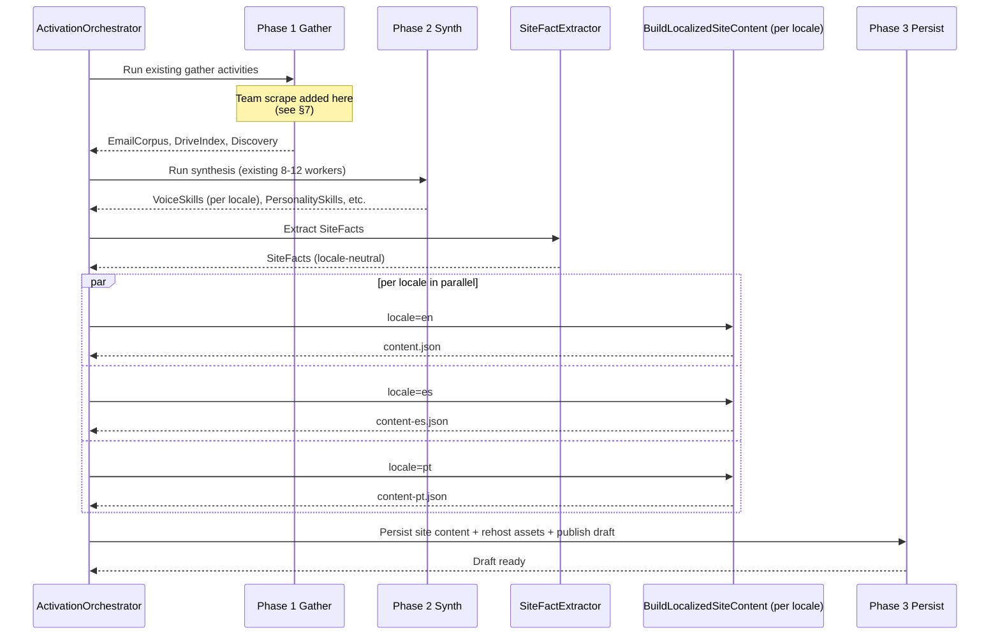

The per-locale invocations of `BuildLocalizedSiteContent` are fan-out/fan-in, respecting the same OOM rules as existing parallel workers (batch size of 2 at most, per the OOM rule in `.claude/rules/code-quality.md`). For a trilingual agent we'd run 2 locales in parallel, then the third, not all 3 at once.

### 5.7 Pipeline phase ordering and retry semantics

| Phase | Activities | Retry | On failure |
|---|---|---|---|
| 0 | Account lookup, brokerage detect | No retry | Abort with clear error to caller |
| 1 | EmailFetch, DriveIndex, AgentDiscovery, TransactionExtraction, TeamScrape | Per-activity retry (existing) | FATAL — abort |
| 1.5 | EmailClassification | Retry | BEST-EFFORT — log and continue |
| 2 | Synthesis workers (existing) | Retry | BEST-EFFORT per worker |
| 2.5 | SiteFactExtractor | Retry 2x | FATAL — need facts for localization |
| 2.6 | BuildLocalizedSiteContent per locale | Retry 2x per locale | BEST-EFFORT per locale — if es fails, publish en only |
| 3 | PersistSiteContent, RehostAssetsToR2, PublishContentToKV, PersistAgentProfile (existing), BrandMerge, ContactImport | Retry | FATAL for Persist — everything else BEST-EFFORT |
| 4 | WelcomeNotification w/ preview link | Retry | BEST-EFFORT |

Rules:

- **FATAL** failures propagate and fail the orchestration (user sees error). Used for steps whose failure makes the pipeline pointless.
- **BEST-EFFORT** failures are logged and the orchestration continues with degraded output. One worker or one locale failing does not abort the whole pipeline.

---

## 6. Asset Pipeline and Content Loading Architecture

### 6.1 Hybrid content loading architecture

**Decision D5: Hybrid — test fixtures bundled, production in KV**

> **What we picked**: The agent-site Worker loads content from two sources based on `CLOUDFLARE_ENV`: in preview builds (PR deploys, dev), content comes from the bundled `config-registry.ts` generated at build time from `config/accounts/`. In production, content comes from Cloudflare KV with the bundled registry as a fallback for a small set of test fixtures.
>
> **What we rejected**: (a) All-KV, which breaks PR preview builds because they'd read production KV and show real customer data; (b) All-bundled, which doesn't scale past a handful of accounts and forces a full Worker redeploy on every content change.
>
> **Why**: PR preview builds today render test fixture accounts (jenise-buckalew, glr, etc.) via the bundled config-registry. That flow is critical for engineers to visually QA template changes before merging. Moving all content to KV breaks it. Hybrid keeps the PR preview flow working **unchanged** for test accounts while enabling unlimited production agents via KV.
>
> **Conversation reference**: Turn where user pushed back on pure KV with "we need ways to preview agent site code changes in our gated builds."

#### Loader flow

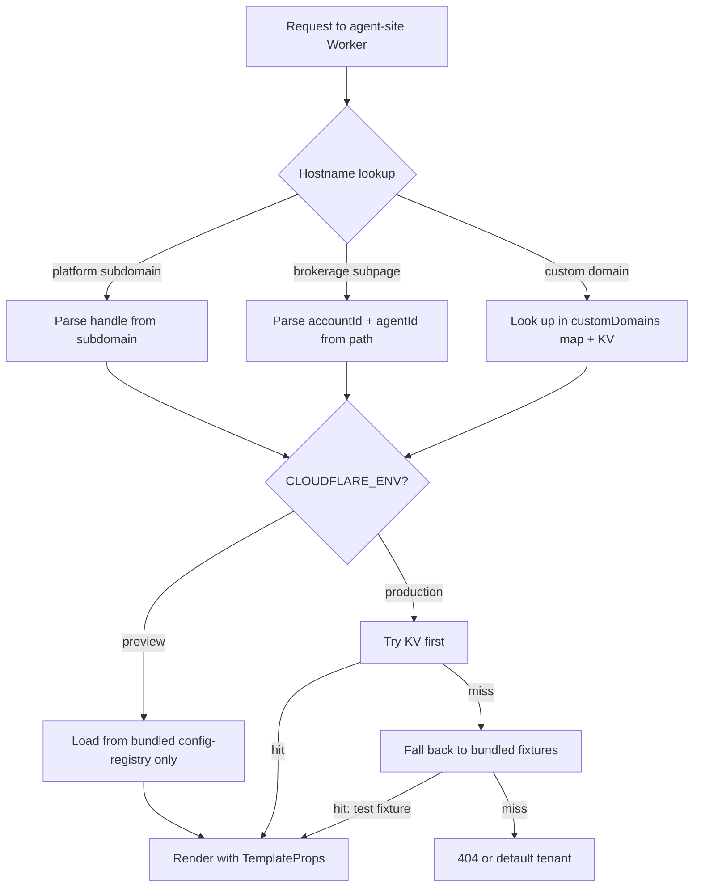

#### KV key schema

| Key | Type | Content |
|---|---|---|
| `account:{accountId}` | JSON | `account.json` — locale-neutral identity and branding |
| `content:{accountId}:{locale}:live` | JSON | Per-locale `content.json` currently serving production traffic |
| `content:{accountId}:{locale}:draft` | JSON | Draft awaiting approval, served only with valid preview token |
| `legal:{accountId}:{page}:{locale}:live` | Markdown/HTML | Privacy, terms, accessibility, fair-housing, TCPA |
| `legal:{accountId}:{page}:{locale}:draft` | Markdown/HTML | Draft versions |
| `routing:{hostname}` | JSON | `{ accountId, agentId?, canonical: bool }` for custom hostnames |
| `site-state:{accountId}` | JSON | `{ status: "draft" \| "pending_approval" \| "pending_billing" \| "live" \| "editable", updatedAt }` |

#### Edge cache policy

- KV lookups go through Cloudflare's edge cache with a **60-second TTL** for `live` content and **0 TTL** for `draft` content (drafts must be immediately consistent for preview).
- `account.json` caches for **300 seconds** (branding changes infrequently).
- `legal:*` caches for **3600 seconds**.
- A platform API call to update KV **also purges** the affected cache keys via Cloudflare's cache purge API, so edits become visible within seconds.

### 6.2 Cloudflare R2 asset storage

**Decision D6: Assets on R2, lazy rehosted at activation**

> **What we picked**: A single R2 bucket `agent-site-assets` holds all binary assets. Rehosting happens in `RehostAssetsToR2Activity` during the activation pipeline, only for the agent currently being activated. Prospective agents captured during brokerage scrape do **not** have their headshots rehosted until they themselves activate.
>
> **What we rejected**: (a) API proxy through `api.real-estate-star.com/assets/...` — adds one hop per image load; (b) Eager rehosting at brokerage scrape — pays R2 storage for agents who may never sign up.
>
> **Conversation reference**: Turn where user said "where possible use cloudflare for everything" and later "LAZY" for rehosting.

#### R2 bucket layout

```
agent-site-assets/
  agents/
    {accountId}/
      {agentId}/
        headshot.jpg
        brokerage-logo.png
        brokerage-icon.png
        gallery/
          {sale-id}.jpg     (rehosted listing photos from sales)
        hero-bg.jpg          (if brokerage site has a hero image)
```

Public bucket with a custom domain: `assets.real-estate-star.com` → R2 bucket. `account.json` points at `https://assets.real-estate-star.com/agents/{accountId}/{agentId}/headshot.jpg`.

#### Cache headers on R2 objects

- `Cache-Control: public, max-age=31536000, immutable` for content-hashed paths (e.g., `headshot.{hash}.jpg`)
- `Cache-Control: public, max-age=86400` for stable paths (`headshot.jpg`)

We use stable paths and rely on Cloudflare cache purge on re-upload, since content-hashed paths would require rewriting `account.json` on every asset change.

#### Cloudflare client scope

The `RealEstateStar.Clients.Cloudflare` project, today an empty stub, will house:

1. **One** dedicated method: `CreateCustomHostnameAsync(hostname, target)` wrapping the Cloudflare for SaaS API. See §9.
2. **Generic HTTP client** plumbing for KV put/get/delete and R2 S3-compatible put/get/delete, both using the existing `Cloudflare:ApiToken` from config.
3. **DNS verification via `System.Net.Dns.GetHostAddressesAsync`** — no Cloudflare API call needed.

Estimated size: ~300-400 lines of C# total. This is **not** a 2-day client library project; it is a thin wrapper around three REST endpoints.

---

## 7. Prospect Subsystem

### 7.1 Purpose and scope

When any agent activates with a brokerage domain detected, the pipeline scrapes the brokerage's team page and captures every agent listed as a **prospective record**. These records serve two purposes:

1. **Warm-start future activations** when another agent from the same brokerage signs up, skipping redundant scraping work and reducing cost by roughly 50%.
2. **Sales prospects** — the brokerage team page is a publicly published list of licensed real estate agents, a valid target list for Real Estate Star's outbound sales efforts. **Data capture is in scope; outreach infrastructure is explicitly out of scope** (Decision D7).

**Decision D7: Prospect outreach — capture only, outreach is a separate future project**

> **What we picked**: This spec covers prospect data capture, storage, opt-in warm-start on join, and compliance rules for any **future** outreach project. It does **not** build outreach templates, senders, cadence, unsubscribe handling, or bounce tracking.
>
> **Why**: Outreach is a high-regulatory-risk product with its own deliverability concerns (CAN-SPAM, bounce handling, unsubscribe honoring). Bundling it into this activation pipeline rebuild doubles the scope and ships a weaker version of both products. Capture is cheap and immediately valuable; outreach deserves its own spec with its own risk assessment.
>
> **Conversation reference**: Turn where user picked Option A (capture only) over Option B (capture + outreach infrastructure).

### 7.2 Data model

Azure Table Storage: `real-estate-star-prospects`

```
PartitionKey: {normalized brokerage domain}   e.g., "greenlightmoves.com"
RowKey:       {normalized agent email}         e.g., "noelled@greenlightmoves.com"

Columns:
  BrokerageName             string
  BrokerageUrl              string (origin URL scraped)
  SourceAccountId           string (which account's activation discovered them)

  Name                      string
  Email                     string
  Phone                     string?
  Title                     string?         "REALTOR®", "Sales Associate", etc.
  LicenseNumber             string?
  HeadshotUrl               string?         brokerage-hosted URL (not R2)
  BioSnippet                string?         first ~500 chars of any bio text
  Specialties               string[]?       extracted from bio/title
  ServiceAreas              string[]?       if listed
  Languages                 string[]?       if listed or inferred from name
  ZillowProfileUrl          string?         derived from name + brokerage state
  ZillowReviewCount         int?            fetched inline from Bridge Interactive
  ZillowAvgRating           decimal?        "

  DiscoveredAt              DateTimeOffset
  DiscoveredVia             string           "brokerage-team-scrape" | "sitemap-scrape" | "manual-import"
  LastRefreshedAt           DateTimeOffset?  for 90-day TTL check

  Status                    string          "prospect" | "contacted" | "converted" | "unsubscribed" | "do-not-contact"
  ConvertedToAccountId      string?
  ConvertedAt               DateTimeOffset?
  OptOutRequestedAt         DateTimeOffset?
  CanContact                bool            computed from Status + OptOut
  LastContactedAt           DateTimeOffset?
  ContactHistory            string           JSON-encoded list (append-only)
```

Key design choices:

- **PK by brokerage domain** — "all agents at this brokerage" is a fast partition scan, used during team refresh.
- **RK by agent email** — "is this specific agent a prospect?" is a point read.
- **Status machine** with explicit `unsubscribed` and `do-not-contact` — needed even in capture-only scope so the data is ready for outreach when that project starts.
- **ContactHistory** as append-only JSON — audit trail for any future outbound touch, with room to add bounce/click/reply tracking later.

### 7.3 Team-scrape flow

**Decision D9: Sitemap-first with conservative URL fallback**

> **What we picked**: Scrape flow is:
> 1. Fetch `{brokerage-domain}/sitemap.xml` (and `sitemap_index.xml` variants)
> 2. Parse for URLs matching patterns: path contains `/agent`, `/team`, `/realtor`, `/staff`, `/broker`; depth ≤ 3 slashes; priority ≥ 0.5 if sitemap includes it
> 3. Also check `{brokerage-domain}/robots.txt` for `Sitemap:` references
> 4. If sitemap found and yields candidates → scrape those URLs
> 5. If sitemap not found / no matches → try the conservative fallback paths `/agents`, `/team`, `/our-team`
> 6. If none of those work → skip team capture for this brokerage, scrape homepage only for branding
> 7. **Always** respect `robots.txt` `Disallow` directives
>
> **What we rejected**: (a) Blind 2-level crawl (aggressive, high false-positive rate); (b) Only the hardcoded `/agents`, `/team`, `/our-team` list (conservative, misses brokerages on WordPress/Placester with different slugs).
>
> **Why**: Sitemaps are published intentionally by every well-run brokerage site to tell crawlers what to index. Using them is polite, precise, and respects publisher intent. The fallback list catches sites without a sitemap (common for bespoke sites). Refusing to crawl when both fail is correct — we'd rather miss a brokerage's team than scrape the wrong pages.
>
> **Conversation reference**: Turn where user said "there is a health middle ground, like looking at the sitemap and checking for what make sense rather then guessing."

**Decision D10: 90-day TTL on prospect data staleness**

> **What we picked**: Prospect records store `LastRefreshedAt`. When another agent from the same brokerage joins, if `now - LastRefreshedAt > 90 days`, the team page is re-scraped before using cached prospect data. Within 90 days, cache is used directly.
>
> **Why**: Brokerage team rosters change slowly. 90 days catches normal turnover without re-scraping on every join. Refreshing on every join would add ~10 seconds to join flow unnecessarily. The future `RefreshWebsiteWorker` will handle background refreshing more thoroughly; for now, 90-day lazy refresh is the pragmatic middle.

#### TeamScrapeWorker (new)

- **Project**: `RealEstateStar.Workers.Activation.TeamScrape`
- **Inputs**: brokerage domain (from email signature discovery during AgentDiscovery)
- **Outputs**: `TeamScrapeResult`
  ```csharp
  public sealed record TeamScrapeResult(
      string BrokerageDomain,
      string? BrokerageName,
      IReadOnlyList<ProspectiveAgent> Agents,
      TeamScrapeDiagnostics Diagnostics // sitemap found, robots respected, scraper fallback triggered, etc.
  );
  ```
- **Dispatch**: runs **in parallel** with AgentDiscovery during Phase 1, but only if the detected brokerage domain is distinct from known third-party platforms.
- **Memory budget**: Each scraped page ≤ 1 MB HTML, max 10 pages per brokerage, HTML released after parse. Target peak memory < 20 MB for worker alone.
- **HTTP safety**: every outbound request goes through `ISsrfGuard` (§16.4) which enforces scheme allowlist, IP range denylist (RFC 1918, link-local, cloud metadata), DNS rebinding defense, redirect revalidation, 5 MB body cap, 10x decompression ratio cap, and 15s timeout. Direct `HttpClient` usage is forbidden by architecture test.
- **Parsing**: **AngleSharp** (new dependency on `Workers.Shared`) is used for HTML → plain text conversion on scraped fields that become part of `ProspectiveAgent` records. Regex is still used for URL extraction and structured data patterns, but any string that will be persisted as a name, title, bio, specialty, or service area passes through `AngleSharp.Dom.Element.TextContent` first to strip tags, attributes, scripts, and event handlers. See §16.4 for the full sanitization rules.
- **Robots compliance**: A dedicated `RobotsTxtParser` in `Workers.Shared` (new utility) handles fetching, caching per domain, and checking Disallow rules. Respects the `User-Agent: *` rule set. Robots.txt is fetched through `ISsrfGuard` with a 512 KB cap. A manual `config/legal/scrape-denylist.json` opt-out list is also checked.
- **User agent**: `RealEstateStarBot/1.0 (+https://real-estate-star.com/bot; abuse@real-estate-star.com)`. Honest, attributable, provides an abuse contact.
- **Rate limiting per host**: the worker respects `Crawl-delay` from robots.txt and self-limits to 2 requests/second to any single host even without a crawl-delay directive.

### 7.4 Warm-start flow at join time

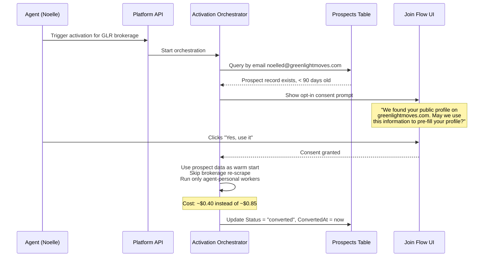

If the prospect record is stale (>90 days), the orchestrator triggers a background re-scrape of the brokerage before showing the consent prompt. If the user clicks "No", the orchestration proceeds with a full fresh discovery for that agent, and the prospect record stays (for sales attribution) but is not used as warm-start input.

**Decision D8: Opt-in during join flow**

> **What we picked**: Join flow explicitly asks "May we use this public information to pre-fill your profile?" Yes → warm-start. No → full scrape from zero. Either way, prospect record stays.
>
> **What we rejected**: Pre-enrolled silent use of the prospect data without asking.
>
> **Why**: Public data is fine to capture, but using it without notice for a customer-facing profile is a trust posture issue. Even a "pass-through" confirmation builds user trust and creates a legitimate legal basis for the use.
>
> **Conversation reference**: Turn where user picked opt-in over pre-enrolled.

### 7.5 Compliance rules for future outreach

These rules are documented here so that when the outreach sender is built in a future project, it inherits a clear contract:

1. **Functional unsubscribe required** on every outbound email, honored via `Status = "unsubscribed"`.
2. **Never use prospect data for outreach unrelated to real estate agent tools** — the legitimate interest basis is "offering a product to professional real estate agents"; anything else requires fresh consent.
3. **CAN-SPAM physical address required** in email footer.
4. **Honor brokerage robots.txt** — if the brokerage `Disallow`s crawling, we skip team capture and do not enroll those agents as prospects.
5. **Respect `do-not-contact` permanently** — a user who requests removal never sees another email even if they re-trigger activation.
6. **Prospect data never shared with third parties** — outreach is first-party only.

A prospect compliance test suite (unit tests on the data layer) will enforce: `CanContact = false` whenever `Status IN ("unsubscribed", "do-not-contact")`, and outbound APIs (when built) must check `CanContact` before queueing.

---

## 8. Brokerage Flow: Create, Join, Idempotent Replay

### 8.1 Three operational modes, auto-detected

**Decision D12: Auto-detect mode from existing `account.json`, no `Mode` field on request**

> **What we picked**: The orchestrator looks up `account.json` in KV by the incoming `accountId`. The mode is determined by what it finds:
> - **No account** → Create path (first agent, new brokerage)
> - **Account exists, `agents[]` contains `agentId`** → Idempotent replay (existing behavior — re-run persist, re-send welcome, skip synthesis if already complete)
> - **Account exists, `agents[]` does NOT contain `agentId`** → Join path (new agent joining existing brokerage)
>
> **What we rejected**: Adding a `Mode: CreateBrokerage | JoinBrokerage` field to `ActivationRequest`. The data is already implicit in the request + current state.
>
> **Why**: Your phrasing: "I dont think we need to change the request here. It should automatically detect from the account name. The link is generated by me anyway." The orchestrator has enough information to decide without a caller-provided flag.

### 8.2 State machine

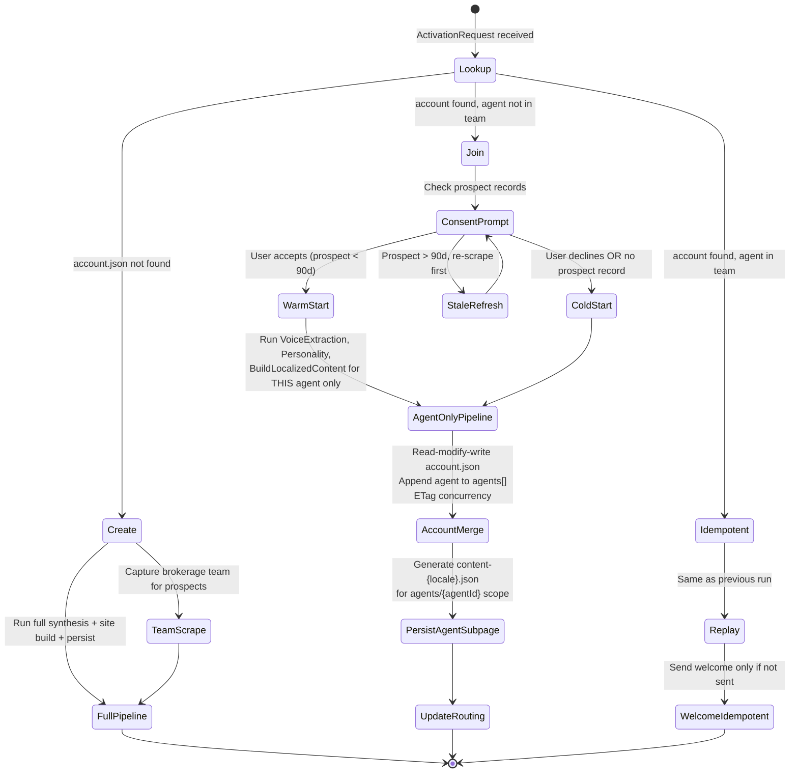

### 8.3 Account.json concurrency

When two agents from the same brokerage join simultaneously, both orchestrations would read the same `account.json`, append themselves, and write it back. Without concurrency control, one overwrites the other.

**Protection**: KV put uses `If-None-Match` / `If-Match` semantics via a write-conditional wrapper. Cloudflare KV does not natively support ETag conditional writes across regions, so we use a lightweight approach:

1. Read `account.json` + capture a `_version` number stored in the JSON
2. Append the new agent
3. Increment `_version`
4. Write back with a **compare-and-set** helper that: (a) re-reads current version, (b) aborts if version differs, (c) writes if unchanged
5. On failure, re-read and retry up to 3 times
6. On persistent conflict, log `[ACCOUNT-MERGE-010]` and fall back to a durable lock via Azure Table Storage's `Insert` operation (atomic "acquire lock row")

Durable Functions already gives us retry semantics for the whole activity, so the merge activity can simply throw on conflict and let DF retry. This is the cheapest safe option.

### 8.4 Intelligent lead routing algorithm

**Decision D13: Service-area hard filter → specialty score boost → round-robin with fairness counter**

> **Conversation reference**: Turn where user confirmed the routing approach "that looks correct for lead routing."

The brokerage lead form submits to a single endpoint that routes the lead to one of the brokerage's agents:

```
Algorithm: route_lead(lead, brokerage)

1. Candidates = [agent for agent in brokerage.agents if agent.enabled]

2. Hard filter by service area:
   filtered = [a for a in candidates if lead.property_city in a.service_areas]
   if filtered is empty:
       filtered = candidates  // fall through to any enabled agent

3. Score filter by specialty:
   scored = []
   for a in filtered:
       score = 0
       if lead.inquiry_type == "buying" and "buyers" in a.specialties: score += 2
       if lead.inquiry_type == "selling" and "sellers" in a.specialties: score += 2
       if lead.inquiry_type == "investment" and "investment" in a.specialties: score += 3
       if lead.language != "en" and lead.language in a.languages: score += 3
       scored.append((a, score))

4. Highest score wins. Ties broken by round-robin fairness counter:
   max_score = max(s for _, s in scored)
   tied = [a for a, s in scored if s == max_score]
   if len(tied) > 1:
       counter = brokerage.lead_routing_counter  // stored in account.json
       winner = tied[counter % len(tied)]
       brokerage.lead_routing_counter += 1
       persist account.json
   else:
       winner = tied[0]

5. Lead dispatched to winner.email, logged with [LEAD-ROUTE-001]
```

Stored in `account.json`:
```json
{
  "lead_routing": {
    "counter": 7,
    "last_assignments": [
      {"agent_id": "jenise", "lead_id": "...", "at": "..."},
      ...
    ]
  }
}
```

The `last_assignments` list is capped at 20 entries for audit.

### 8.5 Brokerage home vs agent subpage routing

Same content system, different URL scope:

| URL | Content loaded |
|---|---|
| `glr.real-estate-star.com/` | `content:glr:{locale}:live` — brokerage home |
| `glr.real-estate-star.com/contact` | `content:glr:{locale}:live` + contact form → brokerage lead routing |
| `glr.real-estate-star.com/agents/jenise` | `content:glr:jenise:{locale}:live` — agent subpage scope |
| `glr.real-estate-star.com/agents/jenise/contact` | `content:glr:jenise:{locale}:live` + contact form → direct to jenise |

Agent subpage content is a separate KV key from brokerage content. Generated during the join path in §8.2. A subpage inherits branding from `account:glr` but has its own sections (agent hero, agent about, agent gallery, etc.).

The Worker middleware parses the URL to determine which scope to load. Route matching:

```
/                          → brokerage home
/contact                   → brokerage contact (routed leads)
/about                     → brokerage about
/agents/:handle            → agent subpage
/agents/:handle/contact    → agent direct contact
/agents/:handle/about      → agent subpage about
/privacy                   → brokerage legal
/terms                     → brokerage legal
/:anything-else            → 404
```

---

## 9. BYOD Custom Domains

**Decision D14: BYOD custom domains in MVP via Cloudflare for SaaS, no registrar integration**

> **What we picked**: Agents bring their own domain (purchased elsewhere). We provide a single CNAME instruction. Platform API verifies the CNAME via DNS, then calls Cloudflare for SaaS to provision the custom hostname (SSL cert + routing). Canonical URL rules determine which URL is the "primary" for SEO.
>
> **What we rejected**: (a) Full registrar integration (buy/sell/renew domains) — out of scope; (b) Phase 2 deferral — this is foundational enough that retrofitting it later means touching the Worker, canonical logic, and onboarding flow twice.
>
> **Why**: "BYOD" is drastically simpler than "manage domains." We need exactly 3 things: verify they own it, provision SSL, route traffic. Everything else is the agent's problem with their existing registrar. With that scoping, the work is ~3-4 days, not 2-3 weeks.
>
> **Conversation reference**: Turn where user said "this is more of a 'bring your own domain' model. where they give us a domain they purchased and i plug it in. we will not do or manage the registration."

### 9.1 Domain lifecycle

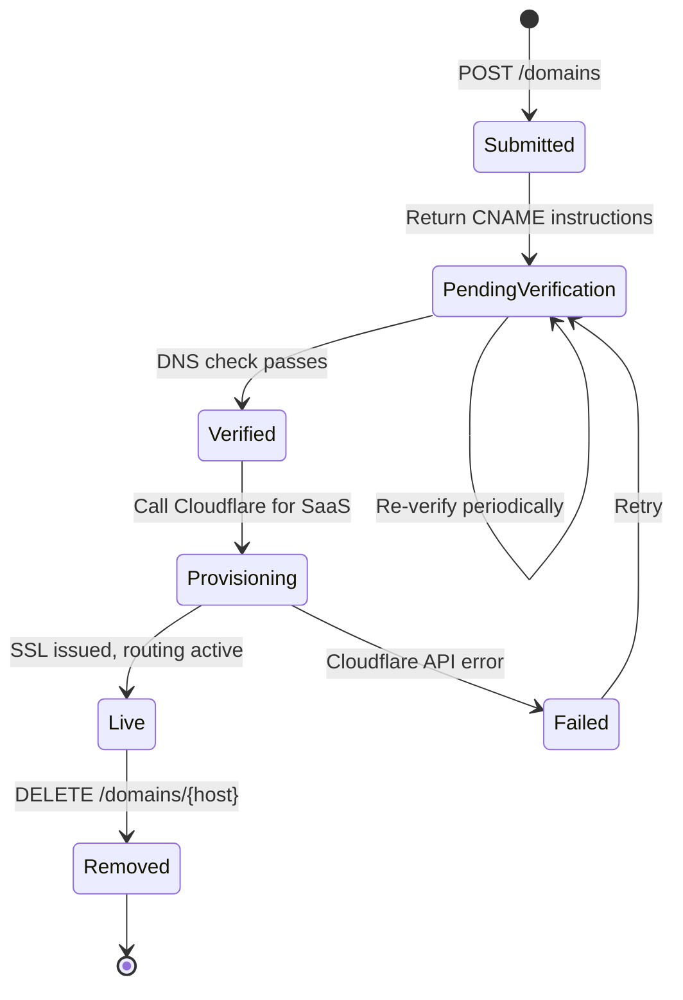

### 9.2 Data model

Azure Table Storage: `real-estate-star-custom-hostnames`

```
PartitionKey: {normalized domain}             e.g., "jenisesellsnj.com"
RowKey:       "hostname"

Columns:
  AccountId              string
  AgentId                string?            null if mapped to brokerage root
  Status                 string             "submitted" | "pending_verification" | "verified" | "provisioning" | "live" | "failed" | "removed"
  CloudflareHostnameId   string?
  CloudflareSslStatus    string?
  VerificationCname      string             the value we expect at the user's DNS
  IsCanonical            bool               only one hostname per tenant can be canonical
  SubmittedAt            DateTimeOffset
  VerifiedAt             DateTimeOffset?
  ProvisionedAt          DateTimeOffset?
  LastCheckedAt          DateTimeOffset?
  LastError              string?
```

### 9.3 API endpoints

**`POST /domains`** — submit a domain

```json
Request:
{
  "accountId": "glr",
  "agentId": "jenise",
  "hostname": "jenisesellsnj.com",
  "canonical": true
}

Response 201:
{
  "hostname": "jenisesellsnj.com",
  "status": "pending_verification",
  "instructions": {
    "recordType": "CNAME",
    "recordName": "jenisesellsnj.com",
    "recordValue": "real-estate-star.com",
    "note": "Create this CNAME at your DNS provider. Verification runs automatically; you can click 'Verify Now' to speed it up."
  }
}
```

Validation on submit:
- Hostname is a valid domain (regex + PSL check — we don't allow subdomains of `real-estate-star.com` as "custom" domains; those are our platform routes).
- Agent is authorized to manage this account.
- Canonical flag is only allowed if no other hostname for this tenant is currently canonical, OR the caller explicitly flips canonical to this new hostname (the previous canonical flips to false).

**`POST /domains/{hostname}/verify`** — trigger a verification check

- Reads current DNS for the hostname (CNAME or A record)
- If it points at `real-estate-star.com`, marks `Status = verified` and kicks off provisioning asynchronously
- Returns current status

**`DELETE /domains/{hostname}`** — disconnect

- Calls Cloudflare for SaaS to delete the hostname
- Marks record `Status = removed`
- Flips canonical if this was the canonical hostname (falls back to platform subdomain)

**`GET /domains?accountId=...`** — list domains for an account

### 9.4 Cloudflare for SaaS integration

The `Clients.Cloudflare` client exposes one method:

```csharp
public interface ICloudflareForSaas {
    Task<CustomHostnameResult> CreateCustomHostnameAsync(
        string hostname,
        CancellationToken ct);
    Task DeleteCustomHostnameAsync(string cloudflareHostnameId, CancellationToken ct);
    Task<CustomHostnameStatus> GetStatusAsync(string cloudflareHostnameId, CancellationToken ct);
}
```

Backed by:
- `POST https://api.cloudflare.com/client/v4/zones/{zone_id}/custom_hostnames`
- `DELETE https://api.cloudflare.com/client/v4/zones/{zone_id}/custom_hostnames/{id}`
- `GET https://api.cloudflare.com/client/v4/zones/{zone_id}/custom_hostnames/{id}`

Config required:
- `Cloudflare:ApiToken` (already present)
- `Cloudflare:ZoneId` (to be added — the zone ID for `real-estate-star.com`)

### 9.5 Verification flow (see §16.2 for complete security-hardened flow)

The custom domain verification flow follows the **two-phase TXT challenge + CNAME routing** design pinned in §16.2. Summary:

1. **Phase 1 — Ownership proof via TXT challenge**: agent adds `_realstar-challenge.{host} TXT "realstar-challenge=<nonce>"`. Multi-resolver consensus verification.
2. **Phase 2 — Routing activation via CNAME**: after ownership verified, agent adds the CNAME (or ALIAS for apex), Cloudflare for SaaS provisions SSL + routing.
3. **Daily re-verification of live hostnames**: two consecutive failures suspend the hostname; seven days suspended removes it.
4. **Hostname blocklist**: reserved TLDs, typosquat brands (Levenshtein ≤ 2), IDN homoglyphs, our own infrastructure — all rejected at submission.

**The R1 design of "CNAME-only verification, no re-verification, no hostname allowlist" is replaced by §16.2.** The background timer job described below implements the §16.2 rules.

Background timer-triggered Azure Function runs every 5 minutes:

1. Query `real-estate-star-custom-hostnames` for rows in pending, verified, or live states needing action.
2. For **pending** rows: check TXT challenge via multi-resolver consensus. Move to `ownership-verified` if passed.
3. For **ownership-verified** rows: check CNAME/ALIAS routing record. Move to `provisioning` and call Cloudflare for SaaS if passed.
4. For **provisioning** rows: poll Cloudflare for SaaS status. Move to `live` when SSL issued and routing active.
5. For **live** rows (checked daily, not every 5 min): re-verify routing record via multi-resolver. Two consecutive failures → `suspended`. Seven days suspended → `removed` + Cloudflare for SaaS delete call.
6. For **suspended** rows: continue daily checks; on recovery, move back to `live`.
7. Expire rows in `pending` for > 7 days → `failed` with reason "ownership-timeout".
8. All state transitions emit `[DOMAIN-VERIFY-NNN]` logs (Appendix E).

### 9.6 Canonical URL resolution

For each tenant (accountId, agentId), exactly one hostname is canonical. At render time, the Worker adds a `<link rel="canonical">` tag pointing at the canonical hostname's URL. Rules:

| Scenario | Canonical |
|---|---|
| Agent has a verified custom domain marked `IsCanonical = true` | The custom domain |
| Agent has no custom domain, single-agent setup | `{handle}.real-estate-star.com` |
| Agent has no custom domain, brokerage subpage | `{brokerage}.real-estate-star.com/agents/{handle}` |

The brokerage subpage URL is **never** canonical if the agent has any other hostname available (platform subdomain or custom domain). When a visitor hits `glr.real-estate-star.com/agents/jenise`, they see Jenise's subpage content, but the canonical tag points at her primary URL.

### 9.7 Worker routing lookup

The Worker middleware performs hostname resolution in this order (per request):

```
1. hostname = request.headers.host

2. If hostname in CustomDomainsMap (bundled at build time for test fixtures):
      return (accountId, agentId, canonical: check)

3. If hostname ends with ".real-estate-star.com":
      subdomain = hostname without suffix
      if subdomain is an accountId:
          return (subdomain, null, canonical: check)
      else:
          return 404

4. Otherwise (production custom domain):
      entry = KV.get("routing:" + hostname)
      if entry:
          return (entry.accountId, entry.agentId, entry.canonical)
      else:
          return 404
```

KV cache: `routing:{hostname}` entries are written by the platform API when a domain transitions to `live`. Cached at the edge with a 5-minute TTL. Worker purges the cache key when a domain is removed.

---

## 10. Preview → Approve → Bill → Edit Flow

**Decision D15: Preview before billing, edit access gated behind billing**

> **What we picked**:
> 1. Activation completes → draft site stored in KV → agent receives preview email with a signed link
> 2. Agent previews the draft on the real URL (platform subdomain or custom domain if verified), with a preview token parameter
> 3. Agent clicks "Approve & Continue" → redirected to Stripe checkout
> 4. Successful payment webhook → draft promoted to live, site goes public, preview token invalidated
> 5. Post-billing, the agent gains edit access via a dashboard editor (the editor UI is out of scope for this design; the data model and state machine must support it)
>
> **What we rejected**: Auto-publish on activation with "preview" being post-launch edit-and-preview.
>
> **Why**: Gates the money moment behind the agent seeing real value (their actual site). Much stronger conversion funnel. Tolerates the cost of running activation before billing as an acquisition expense.
>
> **Conversation reference**: Turn where user said "we should have them preview and if they approve of the design and proceed with billing we can allow them to edit it."

### 10.1 State machine

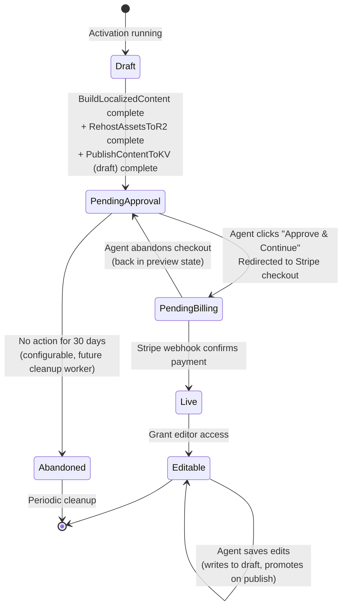

State stored in KV at `site-state:{accountId}`:

```json
{
  "status": "pending_approval",
  "createdAt": "2026-04-12T14:00:00Z",
  "draftAt": "2026-04-12T14:08:00Z",
  "pendingApprovalAt": "2026-04-12T14:08:00Z",
  "pendingBillingAt": null,
  "liveAt": null,
  "previewToken": "{opaque-signed-token}",
  "previewTokenExpiresAt": "2026-05-12T14:08:00Z"
}
```

### 10.2 Preview session mechanism (see §16.1 for full design)

**The R1 design of "signed HMAC token in URL query parameter" is replaced by the opaque-cookie session design in §16.1.** Security review flagged URL-embedded tokens as a BLOCKER because they leak via Referer headers, CDN edge logs, and browser history.

Summary of the R2 design (full details in §16.1):

1. Welcome email contains a one-time **exchange token** (15-minute TTL, single-use, HMAC-signed) in the URL: `https://{host}/?x={exchange_token}`.
2. Agent clicks the link. Worker calls `POST /preview-sessions/exchange` with the exchange token.
3. API validates, creates an **opaque session row** in Azure Table (`real-estate-star-preview-sessions`), returns a random 256-bit session ID.
4. Worker sets `rs_preview` cookie (`HttpOnly; Secure; SameSite=Lax`) and **302-redirects to the URL with `?x=` stripped**.
5. All subsequent requests authenticate via the cookie. URL never carries a token after the redirect.
6. Session uses a **sliding 24-hour window** with a hard cap of 30 days. Revocation is a single-row update in Azure Table.
7. Tenant binding is enforced: the session's `accountId` must match the hostname's resolved tenant on every request. Mismatch → 403.
8. On draft responses: `Referrer-Policy: no-referrer`, `Cache-Control: private, no-store`.

Fields stored on the session row (`real-estate-star-preview-sessions`):

```csharp
public sealed record PreviewSession(
    string SessionId,           // random 256-bit opaque reference
    string AccountId,
    string AgentId,             // null for brokerage-wide previews
    DateTimeOffset IssuedAt,
    DateTimeOffset ExpiresAt,   // sliding
    DateTimeOffset HardCapAt,   // fixed at issuance + 30d
    DateTimeOffset? LastUsedAt,
    bool Revoked,
    string? RevokedReason,
    string Scope,               // "preview" (reserved for future scopes)
    string IpAddressFirstUse,
    string UserAgentFirstUse
);
```

### 10.3 Preview API endpoints (see §16.3 for auth matrix, §16.5 for Stripe webhook)

**`POST /preview-sessions/exchange`** — exchange token → session cookie (§16.1)

- Auth: exchange token in request body; HMAC-verified
- Rate limit: 10/min per IP
- Response: Set-Cookie `rs_preview=sessionId` + 302 redirect to the clean URL

**`DELETE /preview-sessions/{sessionId}`** — revoke a preview session

- Auth: authenticated agent session OR valid exchange token for the same account
- Action: sets `Revoked: true, RevokedReason: "user-request"` on the session row
- Used by: "I didn't request this" link in the welcome email, agent dashboard settings, platform admin UI

**`POST /sites/{accountId}/approve`** — agent clicks Approve & Continue

- Auth: preview session cookie OR authenticated agent session (§16.3 matrix)
- Rate limit: 5/min per account
- Action: validates session, updates `site-state:{accountId}` to `pending_billing`, creates a Stripe checkout session with **server-side `STRIPE_PRICE_ID`** and **idempotency key** `approve:{accountId}:{previewSessionId}` (§16.5), returns checkout URL
- Response: `{ checkoutUrl: "..." }`

**`POST /sites/{accountId}/publish`** — **Stripe webhook endpoint**, internal routing only

- Auth: **Stripe webhook signature verification** via `Stripe.Webhook.ConstructEvent` (§16.5)
- IP allowlist: Stripe's published webhook source IP ranges (last line of defense)
- Idempotency: event ID stored in `real-estate-star-stripe-events` with 30-day TTL; duplicate event IDs return 200 without state change
- Event filter: only `checkout.session.completed` with `payment_status: "paid"` promotes drafts. Metadata `accountId` must match path parameter.
- Rate limit: **excluded** (webhook endpoints must not be rate-limited)
- Action: promotes `content:v1:{accountId}:{locale}:draft` → `content:v1:{accountId}:{locale}:live` for each locale, updates `site-state:{accountId}` to `live`, purges edge cache, sends "Your site is live!" email

**`GET /sites/{accountId}/state`** — platform admin / agent dashboard

- Auth: authenticated agent session
- Returns current `site-state:{accountId}`

### 10.4 Welcome email changes

The welcome email sent after activation now links to the **one-time preview exchange URL** (§16.1), not the public URL. The email contains:

1. A greeting polished by Claude in the agent's voice and locale
2. A single-use exchange URL (`https://{host}/?x={exchangeToken}`) that expires in 15 minutes on first click
3. A "This wasn't me" revocation link that immediately invalidates the exchange token and alerts the platform
4. CAN-SPAM compliance: physical business address in the footer, unsubscribe link routing to the marketing preferences page (§17.4)

Example structure (subject and greeting are per-locale):

```
Subject: Your Real Estate Star site is ready to preview

Hi Jenise,

Your Real Estate Star site has been generated from your professional data.
Before it goes live, take a look and make sure you're happy with it:

Preview your site: https://jenise-buckalew.real-estate-star.com/?x={exchangeToken}

The preview link is single-use and expires in 15 minutes. After you click it,
you'll be signed in for 24 hours at a time (up to 30 days total). Once you
approve the design, you'll be taken through a quick checkout to activate.

If this wasn't you: https://platform.real-estate-star.com/preview-sessions/revoke?x={exchangeToken}

— The Real Estate Star team

---
Real Estate Star, Inc.
[physical business address required by CAN-SPAM]
Unsubscribe from marketing emails: https://platform.real-estate-star.com/preferences
```

The existing `WelcomeNotificationService` is extended with the preview URL. The existing personality-voice polish still applies to the email body.

### 10.5 Editable state

After billing completes, the state moves to `Editable` and the agent gains edit access. This design ensures the data model supports editing:

- Edits go to `content:{accountId}:{locale}:draft` (reusing the draft slot)
- Live stays intact until the agent clicks "publish changes"
- Publish triggers the same promotion flow (copy draft → live, purge cache)
- The editor UI is a separate project; this design ensures the data plumbing is already in place

---

## 11. Legal Pages

### 11.1 Pages in scope

Five legal pages per site, per locale (except TCPA):

| Page | File | TCPA-only | Locale behavior |
|---|---|---|---|
| Privacy Policy | `legal/privacy.md` | No | Per-locale |
| Terms of Service | `legal/terms.md` | No | Per-locale |
| Accessibility Statement | `legal/accessibility.md` | No | Per-locale |
| Fair Housing Disclosure | `legal/fair-housing.md` | No | Per-locale |
| TCPA Consent Language | `legal/tcpa.md` | Yes | English only (legal requirement) |

### 11.2 Data sources

Each page is generated from multiple inputs:

**Privacy Policy** inputs:
- `ActivationOutputs.BrokerageName`, `ActivationOutputs.BrokerageLicenseNumber`
- Brokerage office physical address (from signature or brokerage site scrape)
- Agent's personal data handling inferred from any existing personal-site scrape (if `/privacy` found on their current site, referenced and adapted)
- `ComplianceAnalysisWorker` output (state-specific privacy rules)
- Stripe compliance boilerplate (payment data handling)
- Cookie usage statement (standard for our agent-site Worker)

**Terms of Service** inputs:
- Brokerage entity name, license, address
- Governing law: agent's state from `ActivationOutputs.State`
- Standard real-estate agent service disclaimers
- IDX participation notice (if applicable — detected from brokerage site)

**Accessibility Statement** inputs:
- Our platform's commitment to WCAG 2.1 AA
- Brokerage contact for accessibility issues (from signature)
- ADA-related state requirements (California, New York have extra requirements)

**Fair Housing Disclosure** inputs:
- HUD Fair Housing Act standard language
- Equal Housing Opportunity statement
- State-specific additions (e.g., New Jersey requires Source of Lawful Income)
- State fair housing contact info (from static lookup table)

**TCPA Consent Language** inputs:
- Standard TCPA disclosure for SMS/voice marketing
- Brokerage entity name
- English only — this is a legal requirement under TCPA; other languages can't substitute

### 11.3 Generation workflow

```mermaid
graph LR
    A[ComplianceAnalysisWorker output] --> D[LegalPagesWorker]
    B[Scraped signature data] --> D
    C[Brokerage site scrape] --> D
    E[SiteFacts.Agent] --> D
    F[State legal reference tables] --> D
    D --> G[Claude polish per locale<br/>using agent voice skill]
    G --> H[legal/{page}.{locale}.md]
```

`LegalPagesWorker` (new) runs in Phase 2.75 (after synthesis, before persist). Its output feeds a persist step that writes each page to KV.

Per-page cost (from §4.3): ~$0.042 × 4 pages × N locales. Bilingual adds ~$0.17. TCPA is English-only so it doesn't scale with locale.

### 11.4 Legal disclaimer footer

**Decision D16: Disclaimer included in generated legal pages**

> **What we picked**: Every auto-generated legal page has a visible footer reading: *"This page was generated from your professional information and state compliance requirements. Review with legal counsel before relying on it."* Localized alongside the main page copy (except TCPA which stays English).
>
> **Why**: User asked for it in the question-list turn. We're not promising legally-correct output; we're providing a compliant-looking starting template. The disclaimer positions it clearly as that.
>
> **Conversation reference**: Turn where user said "Legal pages disclaimer: Yes" to my earlier question.

Footer format:

```html
<div class="legal-disclaimer">
  <p><strong>Disclaimer:</strong> This page was generated from the brokerage's
  professional information and state compliance requirements. Review with legal
  counsel before relying on it.</p>
</div>
```

Rendered consistently across all 5 legal pages, all locales. TCPA has a separate English-only note: "This consent language is English-only as required by federal TCPA regulations."

### 11.5 Versioning

Legal pages are versioned — when state regulations change or the brokerage updates its address, the page should be regenerable. Versioning strategy:

- Each legal page in KV has a companion metadata record: `legal-meta:{accountId}:{page}` = `{version: 3, generatedAt: "...", sourcesHash: "..."}`
- `sourcesHash` is a hash of all inputs (brokerage address, state, compliance version). If inputs change, the hash changes.
- A future refresh worker can re-generate pages when `sourcesHash` changes.
- For this initial build, pages are regenerated only on full activation re-run.

---

## 12. Refresh Website Worker (Future — Scope Only)

This section does not design the refresh worker. It defines its **scope boundaries** so the current design stores data in formats compatible with future refresh.

### 12.1 What refresh should eventually do

- Periodically re-run for each live account (initially weekly, eventually event-driven)
- Pull new Bridge Interactive reviews, new recent sales, new MLS listings
- Re-scrape the brokerage team page if > 90 days stale, reconcile team roster (new agents, removed agents)
- Re-generate per-locale content if agent voice has shifted substantially (diff threshold on voice skill)
- Refresh headshots and gallery images if originals have changed
- Re-check legal page source hashes and regenerate if changed
- Update `pipeline.json` with fresh transaction data

### 12.2 What this design commits to that supports refresh

- All content is stored in formats that can be diffed and regenerated (JSON, markdown)
- Every persistence step is idempotent — re-running produces the same output given the same inputs
- Source data is retained in ActivationOutputs form (blob backups), enabling fact re-extraction without re-scraping everything
- KV writes track version numbers and `generatedAt` timestamps
- The prospect table tracks `LastRefreshedAt` for TTL
- The legal page metadata tracks `sourcesHash` for change detection

### 12.3 What this design does NOT build

- The refresh worker itself
- The refresh scheduler
- Diff-based re-generation
- Change notifications to agents ("your site was auto-refreshed")
- Opt-out for auto-refresh

All of the above are the refresh worker project's responsibility.

---

## 13. Migration of Existing Accounts

**Decision D17: Manual trigger only, no automatic migration**

> **What we picked**: Existing activations (`jenise-buckalew`, `safari-homes`, `glr`) stay on their current content until manually re-triggered via activation request. Nothing auto-regenerates on deploy.
>
> **What we rejected**: (a) Grandfather existing accounts in their current format indefinitely; (b) Auto-regenerate on first request to new KV-backed system.
>
> **Why**: You control when regenerations run. No surprise production changes on deploy. Cost is predictable. You can verify one account at a time, diff the results, and build confidence before rolling to production agents.
>
> **Conversation reference**: Turn where user picked option (c) for migration.

### 13.1 Migration checklist per existing account

When an existing account is manually re-activated under the new system:

1. **Pre-flight**: snapshot current `config/accounts/{handle}/` to a backup directory
2. **Trigger**: enqueue a new `ActivationRequest` for the account
3. **Watch**: observe activation logs, verify no errors in Grafana
4. **Compare**: diff the new-generated `content.json` vs the backup
5. **Spot-check**: preview the draft on the platform subdomain
6. **Promote**: if satisfied, promote draft → live via the publish flow
7. **Cleanup**: remove the backup after 30 days

### 13.2 Test fixture reconciliation

The agent-site's test fixtures (`jenise-buckalew`, `safari-homes`, `glr`) are used by PR preview builds. When these are migrated:

1. New content is generated and persisted to both KV (production) and to `config/accounts/{handle}/` (test fixture source)
2. The fixture files are committed to the repo
3. PR preview builds continue using the fixtures; production uses KV
4. When fixture files are edited (e.g., to change a test case), a follow-up production migration re-syncs KV

This dual-write is only done at migration time, not during normal activations. Normal activations write to KV only.

### 13.3 Rollback for migrated accounts

If a migration produces bad output (missing fields, broken legal pages, incorrect branding), rollback:

1. Restore the backup snapshot to `config/accounts/{handle}/`
2. Set `site-state:{accountId}.status = "live"` and copy the backup content to `content:v1:{accountId}:en:live` via KV put
3. Purge edge cache
4. Investigate the root cause before retrying

The activation pipeline itself is idempotent, so retrying a migration is safe after the fix.

### 13.4 Rollback for net-new activations

**Decision D37: Emergency fallback to template defaults.**

The migration rollback in §13.3 works for accounts that have a prior content.json to restore. But the more dangerous scenario is a **net-new activation** (brand new agent signing up) when the new pipeline produces unusable output. There is no backup to restore — rolling back the pipeline code just leaves that agent with no site at all.

The mitigation is a **two-tier fallback chain** inside `BuildLocalizedSiteContentActivity`:

**Tier 1 — Retry with degradation**: if a locale's content generation fails, retry once with simpler prompts and English-only voice context. BEST-EFFORT semantics from §5.7 apply — one locale failing does not abort publication.

**Tier 2 — Minimal template-defaults content**: if all locale generations fail OR `SiteFactExtractor` fails, the pipeline writes a minimal content.json populated only from `account.json` identity fields plus the chosen template's `defaultContent` exports. This produces a functional but unpersonalized site — "Welcome, I'm {agent.name}" instead of the Claude-polished hero. The state machine moves the site to `Needs Info` instead of `Live`, and the agent receives a specific email explaining that the site was generated with a minimal template while the full generation is being investigated.

**When does Tier 2 trigger**:

- `SiteFactExtractor` cannot produce facts (Claude outage, upstream API failures blocking facts)
- Every locale's `BuildLocalizedSiteContent` call fails after retries
- Feature flag `Activation:SiteContentGeneration:Enabled = false` (emergency kill switch)
- Feature flag `Activation:SiteContentGeneration:AccountDenyList` includes this account

**What Tier 2 produces**:

```json
{
  "navigation": { "items": [
    { "label": { "en": "About" }, "href": "#about", "enabled": true },
    { "label": { "en": "Contact" }, "href": "#contact_form", "enabled": true }
  ]},
  "pages": { "home": { "sections": {
    "hero": { "enabled": true, "data": {
      "headline": "Welcome, I'm {agent.name}",                  // from account.json
      "tagline": "{agent.title} serving {service_areas[0]}",     // deterministic
      "cta_text": "{template.defaultContent.hero.cta_text}",
      "cta_link": "#contact_form"
    }},
    "about": { "enabled": true, "data": {
      "title": "About {agent.name}",
      "bio": "{agent.tagline OR template.defaultContent.about.bio}",
      "image_url": "{agent.headshot_url}",
      "image_alt": "Portrait of {agent.name}"
    }},
    "contact_form": { "enabled": true, "data": {
      "title": "{template.defaultContent.contact_form.title}",
      "tcpa_consent": { "required": true, "text_version": "v1", "text": "..." },
      "fields": [ /* standard 4 fields: name, email, phone, message */ ]
    }}
  }}}
}
```

Crucially, the Tier 2 fallback **still enforces all §17 compliance rules**: EHO footer, TCPA consent, alt text, color contrast validation, state advertising required fields. A Tier 2 site is less personal but still legally compliant. If a state required field is missing from `account.json`, Tier 2 also fails and the site stays in `Needs Info`.

**Implementation**: the fallback is inside `BuildLocalizedSiteContentActivity` as a final `catch` + method call. The Activity doesn't throw to the orchestrator — it returns a `BuildResult` with `IsFallback: true` and a reason. The orchestrator surfaces this to the WelcomeNotification email so the agent understands why their preview is minimal.

**Unit test matrix**:

- `BuildResult` is `Full` when all generators succeed
- `BuildResult` is `Fallback` with reason `"fact-extractor-failed"` when SiteFactExtractor throws
- `BuildResult` is `Fallback` with reason `"all-locales-failed"` when every generator throws
- `BuildResult` is `Fallback` with reason `"feature-flag-disabled"` when `Activation:SiteContentGeneration:Enabled = false`
- Tier 2 output still passes every §17 compliance test
- Tier 2 output still passes nav ↔ section validation

---

## 14. Mermaid Diagrams

Consolidated reference — individual sections above include their own diagrams, but these are the highest-priority architectural views.

### 14.1 End-to-end data flow

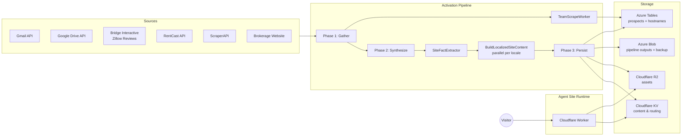

### 14.2 Full orchestrator flow

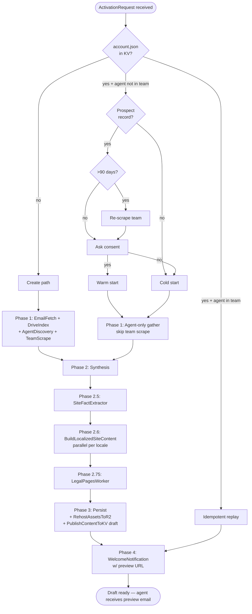

### 14.3 Preview-to-live state machine

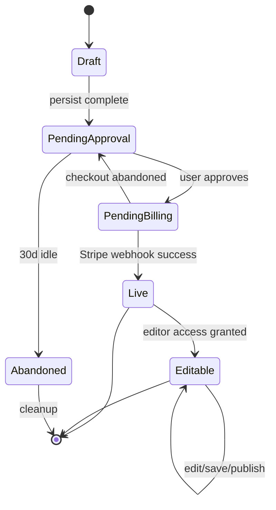

### 14.4 Worker hostname routing

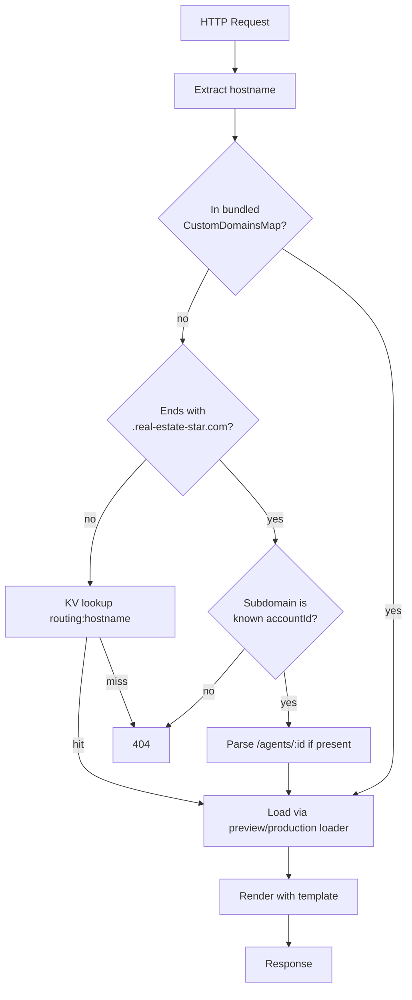

### 14.5 Prospect lifecycle

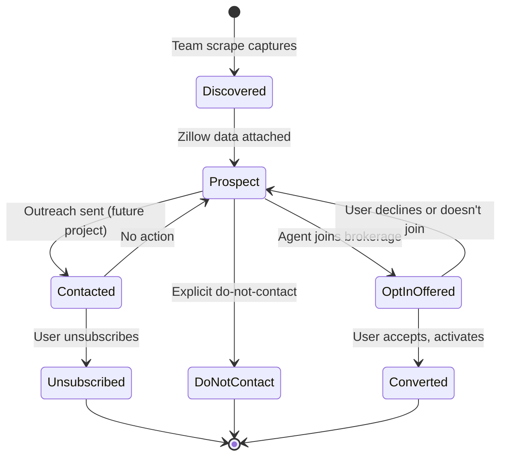

### 14.6 Multi-locale content generation

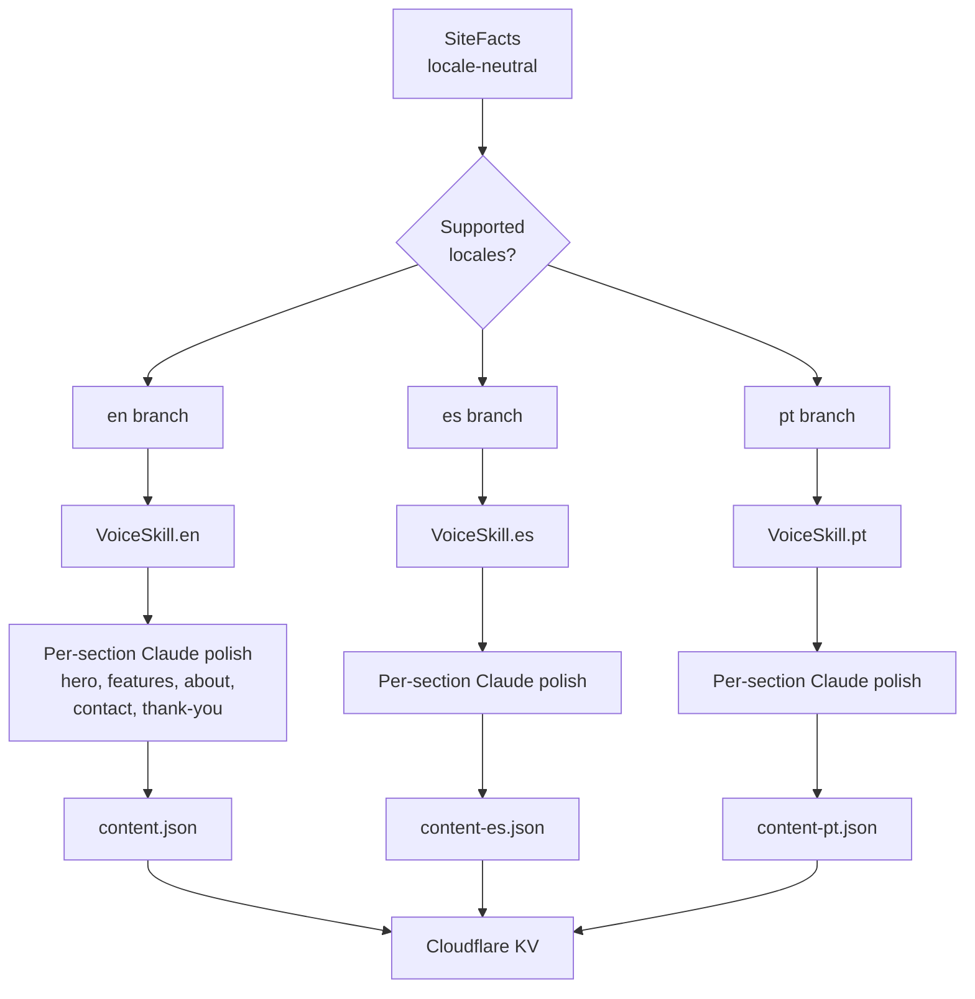

---

## 15. Parallelized Implementation Plan

This plan is designed so multiple work streams can progress simultaneously. Explicit dependencies are called out; otherwise, streams are independent.

### 15.1 Work streams

| # | Stream | Size | Depends on |
|---|---|---|---|
| S1 | Cloudflare client + KV/R2 plumbing | Small (~3 days) | Nothing — foundational |
| S2 | Template `defaultContent` refactor (remove hardcoded titles) | Medium (~4 days) | Nothing — agent-site only |
| S3 | `SiteFactExtractor` + `BuildLocalizedSiteContent` pipeline core | Large (~6 days) | Nothing (new workers) |
| S4 | `PersistSiteContent` + `RehostAssetsToR2` persistence layer | Medium (~3 days) | S1 (needs KV/R2 client) |
| S5 | `LanguageDetector` + `VoiceExtractionWorker` generalization to registry-driven locales | Small (~2 days) | Nothing — refactor |
| S6 | Portuguese UI strings + content fixtures for test-modern | Small (~1 day) | S5 |
| S7 | `TeamScrapeWorker` + prospect table + warm-start flow | Large (~5 days) | Nothing — new worker + new data layer |
| S8 | Brokerage create/join auto-detection + account.json concurrency | Medium (~3 days) | S4 (needs PersistSiteContent) |
| S9 | Lead routing algorithm + brokerage contact form | Small (~2 days) | S8 |
| S10 | BYOD custom domains: table, API endpoints, background verification | Large (~5 days) | S1 (Cloudflare for SaaS client) |
| S11 | Worker hostname routing updates (custom domains + preview token) | Medium (~3 days) | S10 |
| S12 | Preview → Approve → Bill → Edit state machine + API endpoints | Medium (~4 days) | S4, S11 |
| S13 | `LegalPagesWorker` + legal page generation | Medium (~3 days) | S3 (needs facts) |
| S14 | Agent-site runtime hybrid loader (env-aware KV + bundled fixtures) | Medium (~3 days) | S1 |
| S15 | Migration tooling + existing account regeneration runbook | Small (~2 days) | S3, S4, S13 |
| S16 | Observability: new log codes, Grafana dashboards for activation phases | Small (~2 days) | S3 |

### 15.2 Dependency graph

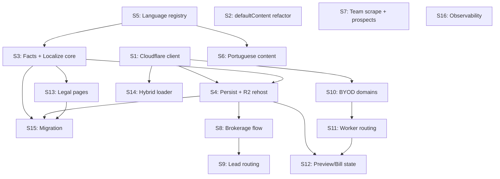

Critical path: **S1 → S4 → S8 → S12** (~15 days sequential).

Streams S2, S5, S6, S7, S16 can run fully in parallel without blocking anything else.

Streams S3, S10, S11 can start immediately (S10/S11 in parallel with everything else, not on the critical path).

With 3 engineers working in parallel: estimate **~4 weeks** to completion, not counting review cycles, migration, and stabilization.
With 1 engineer working alone: estimate **~10-12 weeks**.

### 15.3 Phase breakdown (sequential milestones)

**Phase A — Foundations (Week 1)**
- S1: Cloudflare client ships (KV, R2, for-SaaS wrappers tested)
- S2: Template `defaultContent` refactor complete
- S5: Language detector generalized
- S16: Observability hooks added to existing workers

Milestone: Cloudflare KV and R2 are writable from the API side; agent-site templates render from content.json with defaults for every hardcoded title.

**Phase B — Pipeline core (Weeks 2-3)**
- S3: `SiteFactExtractor` + `BuildLocalizedSiteContent` produce content files from test activation data
- S4: `PersistSiteContent` + `RehostAssetsToR2` write to KV and R2
- S13: `LegalPagesWorker` generates 5 legal pages per locale
- S6: Portuguese translations added for UI strings; test-modern fixture has `content-pt.json`
- S14: Agent-site loads content from KV in production, fixtures in preview

Milestone: A fresh activation for a new test handle produces a complete site in KV, loadable at a preview URL, with correct Spanish and Portuguese variants and all 5 legal pages.

**Phase C — Brokerage and routing (Week 3-4, parallel with B tail)**
- S7: Team scrape + prospects captured during activation
- S8: Brokerage create vs join auto-detected
- S9: Lead routing works for brokerage contact form
- S10: BYOD domain API endpoints live
- S11: Worker hostname routing handles custom domains + preview tokens

Milestone: GLR brokerage site renders with team page populated from scrape; a second agent from GLR activates with warm-start; a custom domain can be added, verified, and routes traffic to the correct tenant.

**Phase D — Preview flow and stabilization (Week 4-5)**
- S12: Preview → Approve → Bill → Edit state machine, API endpoints, welcome email updated with preview URL
- S15: Migration tooling for existing accounts, runbook written
- Bug fix buffer, end-to-end testing on real test accounts

Milestone: A brand new agent can go from activation request → preview email → preview approval → Stripe checkout → live site, with every transition logged in Grafana and correctly persisting state in KV.

**Phase E — Production migration (Week 5+)**
- Manually re-trigger activation for `jenise-buckalew` under new pipeline
- Verify outputs, diff against current content, spot-check preview
- Promote jenise-buckalew to live via new flow
- Repeat for `safari-homes`, `glr`, and any other production accounts
- Declare migration complete

### 15.4 Test strategy per stream

Every stream must ship with:

| Layer | What to test |
|---|---|
| Unit | Pure functions (e.g., template selection score, lead routing algorithm, fact extractor logic) |
| Component | Workers in isolation with mock clients (VoiceExtractionWorker per locale, TeamScrapeWorker with canned HTML) |
| Activity | Activity functions with mocked worker outputs, verifying the activity writes the expected blobs/KV entries |
| Orchestrator | Orchestrator tests using Durable Functions replay semantics, verifying phase ordering and failure recovery |
| Integration | End-to-end: enqueue a real ActivationRequest for a test handle against a test Cloudflare account, assert final KV + R2 state |
| Architecture | NetArchTest rules: new projects respect dependency constraints, new activities are registered in DI, no forbidden cross-project references |
| Validation | Content schema validation: generated content.json passes the existing nav↔section invariant test; Portuguese content is also valid |
| Smoke | After deploy, a smoke test hits the preview URL for a test agent and verifies it renders |

### 15.5 Acceptance criteria (end-to-end)

The project is **done** when:

1. ✅ A new agent with no prior account triggers activation, receives a preview email with a signed token, previews their generated site on `{handle}.real-estate-star.com?preview=...`, clicks Approve, completes Stripe checkout, sees their site live at the same URL.
2. ✅ The generated site has all 9 standard sections plus 5 legal pages, in every locale the agent actually speaks, with copy that reads like the agent wrote it in that locale.
3. ✅ A bilingual agent's Spanish site is grammatically correct, warmly phrased, mentions service areas, and does not read like machine translation.
4. ✅ Two agents from the same brokerage activate in sequence; the second one's activation takes < 50% the time and < 50% the cost of the first, warm-started from prospect capture.
5. ✅ An agent adds a custom domain via `POST /domains`, follows the CNAME instructions, clicks Verify, and their site becomes reachable at the custom hostname with SSL within 10 minutes.
6. ✅ The agent's site is reachable at the platform subdomain, the brokerage subpage, AND the custom domain simultaneously, with canonical tags pointing at the custom domain.
7. ✅ The existing PR preview build flow for agent-site template changes continues to work unchanged — a PR to `apps/agent-site/features/sections/` renders the test fixture accounts correctly in its Cloudflare Pages preview URL.
8. ✅ Per-activation Claude cost, observable in Grafana, is ≤ $1.20 for monolingual MVP and ≤ $1.60 for bilingual MVP activations.
9. ✅ No OOM crashes during activation — DriveIndex stays under 400 MB peak, full activation completes successfully for a brokerage with 12+ agents and 100+ emails.
10. ✅ Legal pages for every production agent include the "review with counsel" disclaimer.
11. ✅ All existing production accounts (jenise-buckalew, safari-homes, glr) have been manually migrated and are serving from the new KV-backed content system.
12. ✅ Every rule in §17 Compliance Matrix has an automated test that fails CI if a new site would ship in violation.
13. ✅ Every endpoint in §16.3 auth matrix has documented authentication and an integration test covering the unauthenticated case.
14. ✅ The `IVoicedContentGenerator` abstraction is the only caller of `IAnthropicClient` for voiced content generation, enforced by an architecture test.
15. ✅ A PR preview build that modifies a template or section component correctly renders all bundled test fixtures and does not touch production KV.

---

## 16. Security & Trust Model

This section consolidates all security invariants that apply across components. Earlier sections (§7 Prospects, §9 BYOD, §10 Preview Flow) reference these rules instead of duplicating them inline. If a security decision affects more than one section, it lives here.

### 16.1 Preview session authentication

**Decision D23: Opaque cookie session, not URL-embedded token.**

The earlier draft (R1) used a signed HMAC token in the URL query parameter (`?preview={token}`). The security review flagged this as a **BLOCKER** — URL query parameters leak via HTTP `Referer` headers, CDN edge logs, browser history, and server logs. A single leaked referer exposes a 30-day preview to the entire internet. This section replaces the R1 design.

**Target design — two-phase exchange + opaque cookie:**

```mermaid
sequenceDiagram
    participant Agent
    participant Email
    participant Worker as agent-site Worker
    participant API as Platform API
    participant KV as Cloudflare KV

    API->>Email: Welcome email with one-time exchange URL<br/>https://{host}/?x={exchange_token}
    Agent->>Worker: GET /?x={exchange_token}
    Worker->>API: POST /preview-sessions/exchange<br/>{exchange_token}
    API->>KV: Validate exchange (single-use, 15 min TTL)
    API->>API: Create session row in Azure Table<br/>{sessionId, accountId, issuedAt, expiresAt, lastUsedAt, revoked: false}
    API-->>Worker: {sessionId}
    Worker-->>Agent: Set-Cookie: rs_preview=sessionId;<br/>HttpOnly; Secure; SameSite=Lax; Path=/<br/>302 Redirect to https://{host}/<br/>(strip ?x= from URL)
    Agent->>Worker: GET /<br/>Cookie: rs_preview=sessionId
    Worker->>KV: Get preview-session:{sessionId}<br/>(cached, 60s TTL at edge)
    Worker->>Worker: Validate not revoked, not expired,<br/>account matches resolved tenant
    Worker->>KV: Read content:v1:{accountId}:{locale}:draft
    Worker-->>Agent: Render draft
```

**Rules**:

1. **One-time exchange token** in the email URL. 15-minute TTL. Single-use (consumed on first `/preview-sessions/exchange` call). HMAC-signed so forgery fails fast without an Azure Table lookup for the common invalid case.
2. **Opaque session ID** in an HttpOnly cookie after exchange. The session ID is a random 256-bit value. Storage is Azure Table `real-estate-star-preview-sessions` (PK = `sessionId`) with `{accountId, issuedAt, expiresAt, lastUsedAt, revoked, scope}` fields.
3. **Sliding 24-hour window** — each valid use updates `lastUsedAt` and extends `expiresAt` by 24 hours. Hard cap at **30 days** since original `issuedAt`.
4. **302 redirect to strip `?x=`** — Worker never renders content on the request that carries the exchange token in the URL. After the redirect, the URL is clean and the session travels only in the cookie.
5. **`Referrer-Policy: no-referrer`** on all preview responses. `Cache-Control: private, no-store` on draft content. Preview draft content never lands in edge cache.
6. **Revocation endpoint**: `DELETE /preview-sessions/{sessionId}` flips `revoked: true`. Used by the "I didn't request this" link in the welcome email, agent-side settings page, and platform admin UI.
7. **Tenant binding**: the session stores `accountId`. Worker verifies the resolved tenant from hostname matches the session's `accountId` on every request. Mismatch → 403, session does not grant cross-tenant access.
8. **Optional forwarding protection**: the first use of a session from a new User-Agent/IP combination triggers a re-confirmation step (enter the email the link was sent to). Defense against email-forwarding leaks. Low friction for the agent, high friction for a forwarder.

**Cryptography**:

- **Exchange token**: HMAC-SHA256 with a shared secret (`PREVIEW_EXCHANGE_SECRET`) managed in Azure Key Vault. The secret is held by the platform API only. The agent-site Worker never sees it.
- **Session ID**: `RandomNumberGenerator.GetBytes(32)`, base64url-encoded. No signature needed — it's a database-backed opaque reference.
- **Session storage**: Azure Table row, replicated across regions for HA, encrypted at rest.

**Why this is strictly better than R1's design**:

| R1 (rejected) | R2 (this design) |
|---|---|
| HMAC secret shared with Worker (compromise = mint capability) | Secret held by API only; Worker is verify-only |
| URL token leaks via Referer | Cookie session, URL is clean after redirect |
| No revocation without global secret rotation | Per-session revocation via Azure Table flag |
| 30-day static lifetime | Sliding 24 h, hard cap 30 d |
| No audit trail | `lastUsedAt`, IP, User-Agent per use |
| Email forwarding = full preview access | Re-confirmation step on new device |

**Architecture test**: `PreviewToken_NotInQueryParam` — greps the agent-site Worker source for any handler that accepts `?preview=` as a parameter. Matches are build failures. The only legitimate query parameter is `?x=` (exchange token), which is stripped on the 302 redirect.

### 16.2 BYOD custom domain security

**Decision D24: Two-phase verification — TXT challenge proves ownership, CNAME activates routing.**

**Decision D25: Typosquat / reserved / homoglyph blocklist on submission.**

The R1 design had CNAME-only verification, no re-verification of live domains, no hostname allowlist, and no rate limiting. All were flagged BLOCKER. This is the revised flow.

#### Two-phase ownership proof

**Phase 1 — TXT challenge** (proves DNS control without committing routing):

1. Agent submits `POST /domains { hostname: "jenisesellsnj.com", accountId, agentId }`.
2. API validates the hostname (see blocklist below) and creates a pending row with a random nonce.
3. API returns the challenge:
   ```
   Add this DNS record at your registrar:
   Type:  TXT
   Name:  _realstar-challenge.jenisesellsnj.com
   Value: realstar-challenge=<base64 nonce>
   ```
4. Background verification job (every 5 minutes) resolves the TXT record using **multiple public resolvers** (1.1.1.1, 8.8.8.8, 9.9.9.9) and requires consensus. If all three see the challenge value, the row moves to `ownership-verified`.
5. DNS-rebind defense: the resolver consensus requirement mitigates single-resolver cache poisoning. The verification job also re-resolves immediately before any routing decision — TTL cache attacks that flip the record between verification and routing are caught by the repeat check.

**Phase 2 — Routing activation** (commits Cloudflare for SaaS binding):

1. After `ownership-verified`, agent is instructed to add the routing record:
   ```
   Type:  CNAME           (or use CNAME flattening for apex)
   Name:  jenisesellsnj.com   (or "www" for www-prefixed)
   Value: real-estate-star.com
   ```
2. Note: a literal apex CNAME (`jenisesellsnj.com IN CNAME`) is **not valid per RFC 1034**. Agents adding an apex domain must use their DNS provider's CNAME-flattening feature (most modern providers support this) or use `ALIAS`/`ANAME` records. The challenge TXT remains at `_realstar-challenge.jenisesellsnj.com` which does not collide with any apex record type.
3. Background verification re-runs. When the routing record resolves to our apex, API calls `ICloudflareForSaas.CreateCustomHostnameAsync(hostname)` to provision the SSL cert and routing.
4. Status moves through `routing-verified → provisioning → live`.

#### Hostname validation on submission

Before any verification, the hostname is validated against a blocklist and a sanity check:

**Scheme and format**:
- Must be a valid hostname per RFC 1123 (labels, TLD, total length ≤ 253).
- Must not be an IP address (IPv4 or IPv6).
- Must not be a subdomain of `real-estate-star.com` (those are platform routes, not custom domains).
- Must not contain ports, paths, or query strings.
- **IDN homoglyph check**: punycode-normalize the hostname. Run through a confusables detector (Unicode UTS #39). Reject any hostname containing confusable characters from scripts not matching the agent's declared locale.

**Reserved and sensitive**:
- TLD blocklist: `.gov`, `.mil`, `.edu`, `.bank`, `.int`, `.local`, `.internal`, `.test`, `.localhost`, `.example`, `.invalid`.
- Label blocklist: any label containing `bank`, `pay`, `stripe`, `google`, `microsoft`, `apple`, `amazon`, `facebook`, `meta`, `twitter`, `linkedin` as a substring OR with Levenshtein distance ≤ 2 against these brands (typosquat check). Human review required for overrides.
- Known-bad hostname list (file `config/legal/domain-blocklist.json`) — maintained alongside the spec, updated for newly discovered abuse patterns.

**Rate limiting**:
- Per-account: max **5 pending** + **3 live** custom hostnames.
- Global rate limit: `POST /domains` at 10 requests per minute per authenticated agent, 100 per day per account.
- Alert fires if global pending hostname count grows > 100 in any 1-hour window (likely abuse).
- Turnstile challenge on `POST /domains` as a cheap bot-flood defense.

#### Re-verification and hostname takeover prevention

Live hostnames are **re-verified daily**. The background job:

1. Queries all `real-estate-star-custom-hostnames` rows with `Status = "Live"`.
2. For each, re-resolves the routing record (CNAME or ALIAS) from multiple public resolvers.
3. If resolution fails OR no longer points to `real-estate-star.com`:
   - First failure: warning, `LastCheckedAt` updated, no state change.
   - Second consecutive failure: `Status = "Suspended"`, stop routing traffic, purge `routing:{hostname}` KV key, send email to agent.
   - Seven days in `Suspended`: `Status = "Removed"`, call `ICloudflareForSaas.DeleteCustomHostnameAsync` to release the Cloudflare for SaaS binding, purge all caches.
4. Re-verification failures log `[DOMAIN-REVERIFY-NNN]` with the hostname, previous state, new state, and reason.

This prevents the hostname takeover scenario: an agent drops their CNAME → we detect it → we stop routing within days → Cloudflare for SaaS binding released → a future attacker who takes over the DNS cannot serve content under our SSL cert because the binding is gone.

### 16.3 API endpoint authentication matrix

**Decision D40: Every endpoint's auth story is pinned in this matrix.** No endpoint ships without documented auth semantics. This resolves the security review's BLOCKER finding that auth was silent in R1.

| Endpoint | Method | Auth | Scope check | Rate limit |
|---|---|---|---|---|
| `POST /domains` | POST | Authenticated agent session (JWT bearer from platform login) | `account_id` in body must match session's account | 10/min, 100/day per account |
| `POST /domains/{hostname}/verify` | POST | Authenticated agent session | Hostname must be in session's account | 10/min per account |
| `DELETE /domains/{hostname}` | DELETE | Authenticated agent session | Hostname must be in session's account | None |
| `GET /domains` | GET | Authenticated agent session | `accountId` query param must match session's account | None |
| `POST /sites/{accountId}/approve` | POST | Authenticated agent session OR valid preview session cookie (`rs_preview`) | Session's account must match URL | 5/min per account |
| `POST /sites/{accountId}/publish` | POST | **Internal only** — Stripe webhook signature required, Stripe IP allowlist enforced | Event must correspond to a checkout session for the given account | Excluded from rate limiting per webhook pattern |
| `GET /sites/{accountId}/state` | GET | Authenticated agent session | Session's account must match URL | None |
| `POST /preview-sessions/exchange` | POST | Exchange token in request body | Exchange token HMAC must verify; account lookup from token payload | 10/min per IP |
| `DELETE /preview-sessions/{sessionId}` | DELETE | Authenticated agent session OR valid exchange token | Session row must belong to authenticated account | None |
| `POST /prospects/{email}/delete-request` | POST | Email verification (one-time code sent to prospect email) | Verification code must match | 3/day per email |

**General rules**:

1. Every endpoint emits a request log with `[ENDPOINT-NNN]` prefix, correlation ID, account ID (if known), and auth outcome.
2. Every endpoint that mutates state is **idempotent by client-supplied `Idempotency-Key` header** or implicit natural key.
3. Every endpoint validates all inputs before reaching business logic. Schema validation failures return 400 with a machine-readable error, never leak internal state.
4. No endpoint returns 500 without a `[ENDPOINT-ERR-NNN]` log entry naming the root cause and correlation ID.
5. Cross-tenant access attempts (auth valid but scope check fails) return 404, **not** 403. Returning 403 leaks existence of the resource.

### 16.4 Scraping trust boundaries

**Decision D27: SSRF validation on every outbound HTTP call.**
**Decision D28: XSS sanitization on every scraped string before persistence.**

The TeamScrapeWorker (§7) fetches URLs derived from email signatures — **an attacker-controlled input**. The R1 design had no input validation on these URLs, creating a direct SSRF vector. Scraped HTML contents were persisted without sanitization, creating a stored XSS vector once those strings render in the agent site.

#### SSRF validation pipeline

Every outbound HTTP call made by TeamScrapeWorker (and any future scraper) goes through `ISsrfGuard`:

```csharp
public interface ISsrfGuard
{
    Task<HttpResponseMessage> SafeGetAsync(
        string url,
        int maxBodyBytes,
        TimeSpan timeout,
        int maxRedirects,
        CancellationToken ct);
}
```

The guard enforces:

1. **Scheme allowlist**: `https` only. `http`, `ftp`, `file`, `gopher`, `data`, `javascript` all rejected.
2. **Host resolution check**: resolve the hostname to its IP addresses. Reject if any resolved IP is in:
   - `0.0.0.0/8` (unspecified)
   - `10.0.0.0/8`, `172.16.0.0/12`, `192.168.0.0/16` (RFC 1918 private)
   - `127.0.0.0/8` (loopback)
   - `169.254.0.0/16` (link-local, **critical**: includes cloud metadata endpoints `169.254.169.254`)
   - `100.64.0.0/10` (CGNAT)
   - `::1`, `fc00::/7`, `fe80::/10` (IPv6 loopback, ULA, link-local)
   - Any hostname ending in `.real-estate-star.com`, `.internal`, `.local`, `.azurewebsites.net` (our infrastructure)
3. **DNS rebinding defense**: resolve at connection time and verify matches the earlier check. Use `HttpClientHandler` with a custom `SocketsHttpHandler.ConnectCallback` that re-validates IP before TCP connect.
4. **Redirect revalidation**: if the response is a redirect, the target URL is re-run through the full SSRF guard before following. Max **3 redirects** total. Chained redirects to attacker-controlled destinations cannot bypass the first check.
5. **Size cap**: response body is streamed with a hard cap of `maxBodyBytes` (default 5 MB for team pages, 512 KB for robots.txt). Beyond the cap, the connection is closed and `[SCRAPE-TOOBIG]` logged.
6. **Decompression ratio cap**: if `Content-Encoding: gzip`, decompression is wrapped in a `LimitedStream` that aborts at `10x` expansion ratio. Prevents zip-bomb attacks.
7. **Total timeout**: connection + read cap at 15 seconds. No long-polling, no chunked responses beyond the size cap.
8. **User-Agent**: `RealEstateStarBot/1.0 (+https://real-estate-star.com/bot; abuse@real-estate-star.com)`. Identifies the bot honestly; provides a contact for abuse reports.
9. **Crawl-delay respect**: if `robots.txt` includes a `Crawl-delay` for our user agent, sleep between requests to the same host.
10. **Opt-out denylist**: in addition to `robots.txt`, a manual `config/legal/scrape-denylist.json` file lists brokerages that have explicitly asked us not to scrape. Checked before every request.

**Architecture test**: `TeamScrapeWorker_CannotCallHttpClientDirectly` — reflects over the worker's field declarations and constructor, asserts it injects `ISsrfGuard` and does NOT inject `HttpClient` directly.

**Unit test matrix** for `ISsrfGuard`:

| Input URL | Expected outcome |
|---|---|
| `http://example.com` | Rejected: scheme |
| `https://169.254.169.254/latest/meta-data/` | Rejected: link-local |
| `https://10.0.0.1/admin` | Rejected: RFC 1918 |
| `https://127.0.0.1:8080` | Rejected: loopback |
| `https://evil.com` with DNS → 127.0.0.1 | Rejected: DNS rebind |
| `https://public.com` redirect to `https://10.0.0.1` | Rejected: redirect revalidation |
| `https://public.com` returning 6 MB body | Truncated at 5 MB, `[SCRAPE-TOOBIG]` logged |
| `https://public.com` with gzip bomb | Aborted at 10x ratio, `[SCRAPE-BOMB]` logged |
| `https://public.com` normal 200 OK 2 MB | Success |

#### XSS sanitization

Every string scraped from an external source goes through `IHtmlTextExtractor.ToPlainText` before it is persisted. This uses a hardened HTML parser (AngleSharp) to extract visible text content only — no tags, no attributes, no scripts, no inline handlers.

**Fields that must pass through the extractor**:

- `ProspectiveAgent.Name`
- `ProspectiveAgent.Title`
- `ProspectiveAgent.BioSnippet`
- `ProspectiveAgent.Specialties` (each item)
- `ProspectiveAgent.ServiceAreas` (each item)
- Any scraped text from brokerage homepage (mission statements, about text)
- Any scraped text from team page (agent rows, contact blocks)

**Rendering rules on the agent-site Worker**:

1. Agent-site templates render scraped content via React's default JSX auto-escaping. React-safe interfaces only.
2. **No unsafe HTML injection APIs** on any prospect or scraped content field. Architecture test at the agent-site repo greps all section components for unsafe HTML injection usage; violations are build failures for section files in `apps/agent-site/features/sections/` and `apps/agent-site/features/templates/`.
3. **Content Security Policy**: all agent-site responses include `Content-Security-Policy: default-src 'self'; script-src 'self' 'nonce-{perRequestNonce}'; object-src 'none'; frame-ancestors 'none'; base-uri 'self'; form-action 'self'`. Any inline scripts in templates must use the request nonce. This is a blast-radius cap — any XSS that slips through sanitization can still be prevented from executing by CSP.
4. **Unit test**: inject `<script>alert(1)</script>`, ``, and `javascript:alert(1)` as fixture strings into a prospect record; assert they round-trip as escaped text with no executable content in the rendered output.

### 16.5 Stripe billing integrity

**Decision D26: Webhook signature verification, event ID idempotency, server-side PriceId, checkout session idempotency.**

The R1 design referenced `/sites/{accountId}/publish` as "called by Stripe webhook handler" without specifying any security properties. Review flagged this as BLOCKER. This section pins the contract.

**Webhook endpoint** (`POST /sites/{accountId}/publish`):

1. **Signature verification**: `Stripe.Webhook.ConstructEvent(payload, request.Headers["Stripe-Signature"], env.STRIPE_WEBHOOK_SECRET, tolerance: 300)`. Any signature failure returns 400 with `[STRIPE-WH-001]` log.
2. **Event ID idempotency**: every processed `event.id` is stored in Azure Table `real-estate-star-stripe-events` with a 30-day TTL. Duplicate event IDs skip processing and return 200 with `[STRIPE-WH-002]` log.
3. **IP allowlist**: Stripe publishes their webhook source IP ranges. Requests from non-Stripe IPs get 403 with `[STRIPE-WH-003]` log (last line of defense; signature verification is primary).
4. **Rate limiting**: excluded. Webhook endpoints must not be rate-limited or legitimate webhooks get dropped during outage recovery.
5. **Event type filter**: only `checkout.session.completed` with `payment_status: "paid"` promotes drafts. All other event types are acknowledged (200) but produce no state change.
6. **Account scope check**: the event's `metadata.accountId` (set during checkout session creation) must match the `accountId` path parameter. Mismatch returns 400.

**Checkout session creation** (`POST /sites/{accountId}/approve`):

1. **Server-side PriceId**: the Stripe `Session.create` call uses `STRIPE_PRICE_ID` from environment config. The request body from the client is ignored for pricing. Amount, currency, and product are never taken from client input.
2. **Idempotency key**: every `Session.create` call uses `Idempotency-Key: approve:{accountId}:{previewSessionId}`. Double-click during approval produces one checkout session, not two.
3. **Customer metadata**: the checkout session metadata includes `accountId`, `previewSessionId`, and `approvedAt` timestamp. The webhook handler uses these for scope validation.
4. **Return URLs**: `success_url` points at `/sites/{accountId}/welcome`; `cancel_url` points back to the preview with a flag.

**Architecture test**: `StripeWebhook_VerifiesSignature` — compiles the publish endpoint, asserts it calls `Stripe.Webhook.ConstructEvent` before any state mutation.

**Unit tests**:
- Valid signature → event processed
- Invalid signature → 400, no state change, log emitted
- Missing signature → 400, no state change, log emitted
- Duplicate event ID → 200, no state change
- Tampered payload (signature valid but `accountId` mismatch) → 400
- Non-Stripe IP → 403
- `checkout.session.completed` with `payment_status: "unpaid"` → 200, no state change

### 16.6 Secrets inventory

Every secret required by the system, where it lives, who rotates it, and what blast radius a leak has.

| Secret | Storage | Scope | Rotation | Leak blast radius |
|---|---|---|---|---|
| `PREVIEW_EXCHANGE_SECRET` | Azure Key Vault | API only (not Worker) | Quarterly | Attacker can mint exchange tokens. Requires session validation to be bypassed simultaneously (no, sessions are DB-backed). Limited impact. |
| `STRIPE_WEBHOOK_SECRET` | Azure Key Vault | API webhook handler only | When Stripe rotates (rare) | Attacker can forge webhook events. Hard impact: drafts promoted without payment. Tight control required. |
| `STRIPE_API_KEY` | Azure Key Vault | API checkout endpoint only | Quarterly | Attacker can create charges in our account. CRITICAL. |
| `CLOUDFLARE_API_TOKEN` (scoped for KV write + R2 put + for-SaaS create) | Azure Key Vault | API persist endpoints only | Quarterly | Attacker can modify any tenant's content. HIGH. |
| `CLOUDFLARE_KV_READ_TOKEN` (read-only) | Wrangler secret on Worker | Worker only | Annually | Attacker can read KV. Content is public anyway. LOW. |
| `ANTHROPIC_API_KEY` | Azure Key Vault | API + Functions | Monthly | Attacker runs up our Anthropic bill. MEDIUM. |
| `GOOGLE_OAUTH_CLIENT_SECRET` | Azure Key Vault | API only | When Google rotates | Attacker can impersonate our OAuth app. HIGH. |
| `HMAC_SECRET` (for lead form signatures) | Azure Key Vault | API + Worker | Annually | Attacker can forge lead submissions. MEDIUM. |
| `OTEL_HEADERS` (Grafana auth) | Azure Key Vault | API + Functions | When Grafana rotates | Attacker can ingest fake metrics. LOW. |

**Rules**:

1. No secret is stored in the repository, in environment variables set at deploy time, or in source files. All secrets come from Key Vault at runtime, except the Worker which uses Cloudflare's encrypted env bindings.
2. The agent-site Worker has exactly **one** secret (`CLOUDFLARE_KV_READ_TOKEN`, read-only). A Worker compromise cannot write KV or mint preview tokens.
3. Rotation procedure for each secret is documented in `docs/runbooks/secret-rotation.md` (to be written alongside implementation).
4. On rotation, old secret versions remain valid for a 24-hour grace period before retirement.

### 16.7 Defense-in-depth tenant isolation

The hostname-to-tenant resolution in §9.7 is the primary tenant isolation boundary. A bug there (off-by-one, flag inversion, cache confusion) can cause one tenant's content to render under another tenant's hostname. Defense-in-depth mitigation:

1. **Embedded `accountId` verification**: every `content.json` stored in KV has an `accountId` field in the JSON body. The Worker, after loading content and resolving the tenant from hostname, verifies the content's `accountId` matches the hostname's resolved tenant. Mismatch → 500 + alert (`[TENANT-ISOLATION-001]`) + fail closed.
2. **Separate KV namespaces for test fixtures vs. production**: the bundled fixtures live in a different logical slot than production KV. A hybrid loader bug that reads production data in a preview build is caught by namespace mismatch, not by fixture name collision.
3. **No cross-tenant discovery endpoints**: no API or Worker route returns a list of all tenants. A tenant ID enumeration is never a response payload — it's either in the URL (known by the caller) or in the authenticated session.

**Monitoring**: every render emits a span tagged with `hostname`, `resolved_tenant`, `content_tenant`. A mismatch triggers an alert.

### 16.8 PII handling and data retention

The system handles PII from three sources: the activating agent, the prospects captured from brokerage scrapes, and the leads submitted via contact forms.

**Agent PII**:
- Stored in `account.json` (KV), `content.json` (KV), Drive folder, Azure Blob backups.
- Retention: tied to the agent's platform subscription; deleted within 30 days of account closure.
- DSAR: `POST /accounts/{accountId}/deletion-request` endpoint (auth required), manual fulfillment within 30 days.

**Prospect PII**:
- Stored in `real-estate-star-prospects` Azure Table.
- Retention: unpruned while `Status = "prospect"`, auto-archived after 180 days stale, immediate deletion on opt-out request.
- **DSAR endpoint**: `POST /prospects/{email}/delete-request` with email verification challenge. On confirmation: hard delete, tombstone row, 24-month retention of the tombstone for audit.
- Contact history capped at 50 entries per prospect; older entries overflow to an append-only audit table.

**Lead PII** (from contact form submissions):
- Stored in the agent's Drive folder (primary), `lead-documents` Azure Blob (secondary), lead consent triple-write (compliance audit).
- Retention: indefinite while the agent's account is active; see §17.3 for TCPA consent records which have their own retention.
- DSAR path: lead erasure requests go to the agent's email (they are the data controller for their leads, per our terms). Platform provides tooling but is not the data controller.
- **Application-layer encryption**: lead submissions containing phone numbers and messages are encrypted with AES-GCM using a tenant-scoped key from Azure Key Vault before being written to KV (if stored there) or blob. The key is rotated per-tenant on account creation.

---

## 17. Compliance Requirements Matrix

This section consolidates legal compliance rules that must be enforced across the agent-site rendering and the activation pipeline. Every rule has an automated enforcement test. No site can transition to `Live` state while any enforcement test fails.

### 17.1 Fair Housing Act (FHA)

**Decision D29: EHO footer on every page.**
**Decision D35: Steering-language linter.**

#### 17.1.1 Site-wide Equal Housing Opportunity display

Every rendered page on every agent site, in every locale, must display the Equal Housing Opportunity logo and statement. This is **not** satisfied by the Fair Housing legal page alone — HUD advertising guidance and NAR Code of Ethics Article 10 apply to all marketing channels, which includes every page of the agent's site.

**Implementation**:

1. `apps/agent-site/features/shared/Footer.tsx` includes `<EqualHousingNotice />` as an unconditional child. The component already exists in `packages/legal`.
2. Every template's root layout includes `Footer` with no conditionals. Templates that want to render a custom footer still include `EqualHousingNotice` as a required child.
3. **CI test** (`tests/agent-site/validation.test.ts`): greps every template file for `<EqualHousingNotice` or `<Footer`. Templates that include `<Footer` pass. Templates that include a custom footer without `<EqualHousingNotice` fail.
4. **Smoke test**: a Playwright test loads each test fixture's home page and asserts the EHO logo image is present in the DOM. Runs in CI.

**Localization**: the EHO notice is localized (the component already supports it), but the logo itself is a federal standard and not translated.

#### 17.1.2 Steering-language linter

The pipeline generates user-facing copy by polishing facts through Claude. Brokerage websites being scraped may contain phrases that — even if the brokerage published them legally — become FHA violations when republished as "Jenise's voice." Examples: "family neighborhood," "walkable to churches," "ideal for young professionals," "exclusive community," "master bedroom."

**Implementation**:

- `IFairHousingLinter` interface in Domain, implementation in `RealEstateStar.Workers.Shared`.
- Two-stage check:
  1. **Regex pass**: versioned denylist in `config/legal/fair-housing-denylist.json` of known steering phrases organized by protected class (race, color, religion, sex, disability, familial status, national origin, plus state additions for NJ/CA/NY/WA/MA/IL/CO/OR/CT/MD/DC). Fast and deterministic.
  2. **Claude second pass** (optional, behind `Activation:FairHousingLinter:ClaudeSecondPass:Enabled` feature flag): for text that passes the regex but discusses neighborhoods/demographics, a single Claude call with a narrow prompt asks "does this text suggest preference for any protected class?" If yes → flag.
- Linter is invoked by `IVoicedContentGenerator` (§5.3) after every generation. On match, the generator attempts **one** regeneration with an added instruction "avoid language that could suggest preference for any protected class." If the regeneration also flags, the generator returns `FallbackValue` with reason `"fair-housing-violation"` and logs `[FHA-001]`.
- Denylist is versioned and tracked as an audit artifact. Changes require a PR with at least one `[legal-review-approved]` commit message marker.

**Coverage expectation**: federal 7 protected classes + NJ source of lawful income + NJ civil union status + NJ gender identity + CA ancestry/immigration/source-of-income + NY source-of-income/domestic-violence-status + WA veteran status + MA children/public-assistance + minimum 10 more state additions. Not exhaustive; maintained as discovery happens.

#### 17.1.3 State protected classes reference

State-specific rules live in `config/legal/state-protected-classes.json`:

```json
{
  "NJ": {
    "federal_classes": "standard",
    "additional": ["source of lawful income", "gender identity/expression", "civil union status", "liability for military service"],
    "required_statutory_language": "..."
  },
  "CA": { "additional": ["ancestry", "genetic information", "immigration status", "source of income", "arbitrary characteristics (Unruh)"], ... },
  ...
}
```

`ComplianceAnalysisWorker` loads this table by `ActivationOutputs.State` and passes the class list to both the Fair Housing linter and the Fair Housing legal page generator.

### 17.2 IDX / MLS data compliance

**Decision D34: Gallery items require attribution, rights verification, and 24-hour refresh.**

The R1 gallery section pulled "recent sales" from Bridge Interactive, Drive transaction docs, and email extraction without regard to IDX licensing rules. Every MLS board's IDX agreement imposes strict display requirements. The R2 design enforces them.

**Gallery item schema changes** (extends §4.1):

```typescript
GalleryItem {
  address: string;
  city: string;
  state: string;
  price: string;
  sold_date: string;
  image_url?: string;
  alt: string;              // REQUIRED (see §17.6)
  // NEW: IDX compliance fields
  listing_courtesy_of: string;      // broker name per MLS rules, REQUIRED
  sold_by_agent: boolean;            // was this agent the listing or selling agent? REQUIRED
  idx_source: "bridge" | "mls_direct" | "agent_upload";
  last_refreshed_at: string;         // ISO 8601, must be ≤ 24 h old for IDX sources
  idx_mls_id?: string;               // if applicable
}
```

**Enforcement rules**:

1. `sold_by_agent: false` items are **dropped** during `BuildLocalizedSiteContent`. An agent's site only displays sales where they were the listing agent or the selling agent. Displaying a neighbor's listing without explicit IDX participation is a license violation.
2. `listing_courtesy_of` is **required**. Gallery items without this field are dropped.
3. A per-account flag `idx_participation_verified: bool` lives in `account.json`. Default false. Agents must confirm IDX participation (via a one-time onboarding step or brokerage confirmation) before any IDX data is rendered on their site. While false, the gallery renders only `agent_upload` items.
4. **24-hour refresh requirement**: a lightweight refresh job (not the full future `RefreshWebsiteWorker`) runs every 12 hours for each live account with gallery data, re-fetching Bridge Interactive data and updating `last_refreshed_at`. Items whose `last_refreshed_at` is > 30 hours old are hidden from rendering until refreshed (grace period for transient refresh failures).
5. **Architecture test**: `GalleryItem_HasAttribution` — asserts the TypeScript type includes `listing_courtesy_of` as non-nullable and the Zod schema validation requires it at runtime.

**Bridge Interactive TOS reference**: Bridge's usage terms require Zillow attribution on reviews and recent sales data. The rendering adds a small "Listing courtesy of {broker} via Zillow" label under each gallery item sourced from Bridge.

### 17.3 TCPA compliance

**Decision D30: Contact form captures TCPA consent with full audit record.**

Every contact form across every template, every locale, must capture TCPA express written consent from the lead **before** the agent is allowed to call or text them. Real Estate Star's entire lead pipeline assumes agents will follow up via phone/SMS — without captured consent, any such follow-up is a TCPA violation.

#### Contact form schema additions

```typescript
ContactFormData {
  title: LocalizedString;
  subtitle: LocalizedString;
  description?: LocalizedString;
  // NEW: TCPA consent (ENGLISH ONLY per TCPA)
  tcpa_consent: {
    text_version: string;              // e.g., "v1.0"
    text: string;                      // required checkbox label, English only
    required: true;                    // cannot be disabled by agent
  };
  fields: FormField[];                 // NEW — defined below
}

FormField {
  name: string;
  label: LocalizedString;              // per-locale label
  type: "text" | "email" | "tel" | "textarea" | "select";
  required: boolean;
  autocomplete: string;                // WCAG 2.1 SC 1.3.5
  aria_describedby?: string;
  validation?: ValidationRule[];
}
```

The `tcpa_consent.text` is a templated string with legal language approved for the platform. Example (English only):

> By submitting this form, you agree to receive calls, texts, or emails from {agent.name} at the phone number and email address you provided, including via automated technology and pre-recorded messages. Consent is not a condition of purchase. Message and data rates may apply.

The checkbox renders above the submit button, unchecked by default, and submission is blocked server-side if `tcpa_consent.given` is false.

#### Lead record schema additions

Every lead submitted via an agent-site contact form records a `TcpaConsent` struct:

```csharp
public sealed record TcpaConsent(
    bool Given,                      // true if checkbox checked
    DateTimeOffset Timestamp,        // server time at submission
    string Text,                     // the exact consent text shown
    string TextVersion,              // version ID of the consent text
    string IpAddress,                // client IP (for audit)
    string UserAgent,                // client UA (for audit)
    string? Locale                   // locale the form was rendered in
);
```

This record is stored in the lead markdown frontmatter (for the Drive/blob triple-write) and in the compliance audit log. Indefinite retention while the lead exists. A lead without a valid `TcpaConsent.Given = true` is **not accepted** — the API returns 400 with `[TCPA-001]`.

#### Enforcement

1. **API-side**: the lead submission endpoint (`POST /leads`) requires `tcpa_consent.given = true` in the request body. Missing or false → 400.
2. **Form-side**: the contact form component disables the submit button while the checkbox is unchecked. Submission JS also client-side validates.
3. **CI test** (`tests/agent-site/tcpa-consent.test.ts`): loads every template that renders a contact form, asserts the form contains an element matching the TCPA consent checkbox selector with an accessible label.
4. **Integration test**: a mocked lead submission without consent is rejected by the API with 400 and `[TCPA-001]` log.

### 17.4 CAN-SPAM

The welcome email to the agent (sent by `WelcomeNotificationService`) is a commercial email subject to CAN-SPAM. It needs:

1. Accurate From/Subject (platform-owned sender `noreply@real-estate-star.com`, truthful subject).
2. Identification as commercial (implicit from the context; spec requires it not be disguised as transactional-only).
3. **Valid physical postal address** of Real Estate Star in the email footer.
4. **Clear unsubscribe mechanism** — a link to a platform preferences page where the agent can opt out of further marketing emails.
5. **Honor unsubscribe** within 10 business days — the preferences page writes to a `marketing_suppression` Azure Table that the `WelcomeNotificationService` checks before sending.

The welcome email is the only outbound email in scope for this project. Prospect outreach is out of scope (§7.5); when built, it inherits these rules.

### 17.5 GDPR / CCPA / state privacy

The site renders to visitors globally. EU visitors trigger GDPR; California/Colorado/Connecticut/Utah/Virginia/New Jersey visitors trigger state privacy laws.

#### 17.5.1 Cookie consent banner

Every site must render a cookie consent banner that blocks non-essential cookies until consent is given. The platform already has a `CookieConsent` component in `packages/legal`. Every template's root layout includes it.

Cookie classifications:
- **Strictly necessary** (no consent needed): session cookies for authenticated routes, locale preference cookie (required for functionality).
- **Preferences** (consent required for EU visitors): locale override cookie (if set explicitly by the language switcher).
- **Analytics** (consent required for all visitors): Cloudflare Web Analytics (cookieless but still requires disclosure in some jurisdictions).
- **Marketing**: not used in the agent site — leads are consented via the TCPA checkbox on the form, not via cookies.

Implementation: the `CookieConsent` banner is geo-gated to show for visitors in EU/UK/EEA regions (detected via CloudFlare's `CF-IPCountry` header). California and state-privacy visitors always see a "Your Privacy Choices" link in the footer (see §17.5.2) even without a banner.

#### 17.5.2 "Do Not Sell or Share My Personal Information" link

CCPA/CPRA (California), CPA (Colorado), CTDPA (Connecticut), UCPA (Utah), VCDPA (Virginia), and NJ SB332 (effective Jan 2025) all require a conspicuous "Do Not Sell or Share My Personal Information" (or equivalent "Your Privacy Choices") link on every page for visitors from those states, if the site processes personal data of residents.

The agent-site processes lead data (contact form submissions) and uses lead data for coaching analytics and routing, which qualifies as "sharing" under CPRA's broad definition. The link is required.

**Implementation**:

1. Every template's global footer renders a "Your Privacy Choices" link (localized text, but the link always exists).
2. The link routes to `/privacy-choices` which renders a preferences page generated as part of the legal pages suite (§11). The page explains what data is processed and provides a form to submit an opt-out request.
3. Opt-out requests are recorded against the visitor's lead record (if they've submitted a form) or stored as an anonymous preference keyed by browser fingerprint.

#### 17.5.3 DSAR workflow

Data Subject Access Request (GDPR Art. 15) and Right to Delete (CCPA §1798.105) require a working mechanism for visitors and prospects to request their data or delete it.

**For prospects** (agents captured from brokerage scrapes):

- `POST /prospects/{email}/delete-request` endpoint (public, with email verification challenge).
- Flow: request → email sent to `{email}` with a verification code → user enters code → hard delete of the prospect record, tombstone for 24 months for audit.

**For agent accounts**:

- `POST /accounts/{accountId}/deletion-request` (auth required) with a 14-day cooling-off period. Manual fulfillment within 30 days of confirmation.

**For lead submissions**:

- Leads belong to the agent (they are the data controller). The platform provides tooling but is not the data controller.
- Agents have a "Delete Lead" button in their dashboard (out of scope for this spec but the data model supports it).

### 17.6 ADA / WCAG 2.1 AA accessibility

**Decision D31: Color contrast validation with auto-correction.**
**Decision D32: Deterministic alt text source for every image.**

The R1 spec claimed WCAG 2.1 AA commitment without enforcement. R2 pins enforcement mechanisms.

#### 17.6.1 Color contrast validation

The `BrandingDiscoveryWorker` extracts primary, secondary, and accent colors from the brokerage website. Those colors are used on every agent site for headings, CTAs, links, and borders. WCAG SC 1.4.3 requires 4.5:1 contrast for normal text and 3:1 for large text and UI components. Scraped brand colors frequently fail these ratios.

`ContrastValidator` runs in `BuildLocalizedSiteContentActivity`:

1. For each brand color, compute contrast ratios against:
   - White (`#FFFFFF`) — the typical light-theme background
   - The template's dark background (template-specific)
   - The template's text color (template-specific)
2. For each contrast check that fails:
   - **Auto-darken** (for light-on-light failures): reduce HSL lightness iteratively until ratio ≥ 4.5:1 or lightness drops below 10%.
   - **Auto-lighten** (for dark-on-dark failures): increase HSL lightness iteratively until ratio ≥ 4.5:1 or lightness exceeds 90%.
3. If auto-adjustment converges: emit a `[CONTRAST-001]` log with original and adjusted color values, write the adjusted color to `account.json.branding`, add an advisory to the welcome email: "We adjusted your brand color from {original} to {adjusted} to meet accessibility standards."
4. If auto-adjustment cannot converge (the input color is fundamentally unusable — e.g., pure gray #808080 that can't be darkened or lightened enough): **block publish**, log `[CONTRAST-002]`, move site state to `Needs Info`, require manual color review in onboarding.

**Unit test matrix**: canonical failure colors (`#FFFF00` yellow on white, `#333333` dark gray on black, `#808080` gray), canonical pass colors (`#1B5E20` green on white, `#FFFFFF` on `#1B5E20`), edge cases (exact 4.5:1).

#### 17.6.2 Alt text for every image

**No image element may render on an agent site without an alt attribute**. Alt text comes from deterministic sources per image type:

| Image type | Alt text source |
|---|---|
| Agent headshot | `"Portrait of {agent.name}"` — always English phrasing is fine for assistive technology; screen readers read the name regardless of page locale |
| Brokerage logo | `"{brokerage.name} logo"` |
| Brokerage icon (favicon-equivalent) | `"{brokerage.name} icon"` — rarely surfaced to screen readers |
| Gallery item (sold listing) | `"{street address}, {city} — sold {month year}"` from MLS data |
| Hero background | haiku-4-5 generated descriptive alt from an image analysis prompt ($0.001/image, low cost) |
| Decorative images (iconography, dividers) | `alt=""` (empty string signals decorative to screen readers) |

**Schema enforcement**: every image field in `ContentConfig` types has a required sibling `alt` field. Zod/runtime validation rejects JSON with null or missing alt.

**Component enforcement**: every image element in `apps/agent-site/features/sections/` must have an `alt={...}` prop. An ESLint rule (`jsx-a11y/alt-text`) already enforces this and is already in the repo config; the spec requires CI to fail on any violation.

**Test coverage**: axe-core Playwright runs against every test fixture in CI, asserts zero "missing alt" violations.

#### 17.6.3 `<html lang>` declaration

The agent-site root layout (`apps/agent-site/app/layout.tsx`) sets `<html lang={resolvedLocale}>` with the locale determined by the middleware. This is a WCAG SC 3.1.1 requirement and must not be hardcoded to `"en"`.

**Test**: a Playwright test visits each test fixture with `Accept-Language: es`, asserts the rendered HTML has `<html lang="es">`.

#### 17.6.4 Form labels, autocomplete, keyboard navigation

Every form input in every template must have:

- An associated `<label for="{id}">` or `aria-label`
- An `autocomplete` attribute where applicable (`name`, `email`, `tel`, `street-address`, `postal-code`) per WCAG SC 1.3.5
- Visible focus indicator on keyboard focus
- Tab order matching visual order

Enforced by:

- TypeScript contract: `FormField.autocomplete` is required non-null (see §17.3 schema).
- CI test: axe-core Playwright runs over contact form pages in test fixtures.

#### 17.6.5 Heading hierarchy

Every rendered page has exactly one `<h1>` (the hero headline or page title) and subsequent sections use `<h2>`, `<h3>` in order without skipping levels.

Enforced by an axe-core rule and a per-template unit test that snapshot-tests the heading order.

#### 17.6.6 Reduced motion

Animated components (marquee, carousel, hero parallax) must respect `prefers-reduced-motion: reduce`. CSS-level rule:

```css
@media (prefers-reduced-motion: reduce) {
  .animated-component {
    animation: none !important;
    transition: none !important;
  }
}
```

Every animated section component in every template includes this media query. Enforced by a CSS-in-JS codemod check or a grep test.

#### 17.6.7 Accessibility statement page contents

The generated Accessibility Statement (one of the 5 legal pages per §11) must contain:

- Explicit conformance target: "This site targets WCAG 2.1 Level AA"
- Known limitations: populated from the `ContrastValidator` adjustments applied, plus any other known gaps
- Accessibility contact: `accessibility@real-estate-star.com` (platform default) with a committed 14-day response SLA for accessible-version requests
- Date of last review: the activation completion timestamp
- Methods of assessment: "axe-core automated scanning, manual review during development"

Generated by `LegalPagesWorker` with these fields as required inputs. Template shipping without any of these fields fails validation.

### 17.7 State real estate advertising rules

**Decision D33: Hard publish block on missing required fields.**

Every state's real estate commission has rules about what must appear in agent advertising. Common requirements:

- Agent's legal name (not nickname) — NJ, CA, TX, FL, NY
- Brokerage legal name — all states
- Brokerage license number — many states
- Agent license number — most states
- Brokerage office physical address — some states

The R1 spec marked these fields as nullable with "null fallback." This is a regulatory violation — publishing an agent site without the required fields is an actionable advertising violation against the agent.

**Implementation**:

1. A `config/legal/state-advertising-requirements.json` file lists required fields per state:
   ```json
   {
     "NJ": {
       "required": ["agent.legal_name", "agent.license_number", "brokerage.name", "brokerage.license_number", "brokerage.office_address"],
       "recommended": ["agent.tagline"],
       "reference": "N.J.A.C. 11:5-6.1"
     },
     "CA": { "required": [...], "reference": "BRE §2770–2773" },
     ...
   }
   ```
2. The `BuildLocalizedSiteContentActivity` validates `SiteFacts` against the state's required fields (keyed by `account.location.state`).
3. Any missing required field causes the activation to move the site state to `Needs Info`. The site cannot transition to `Live` until resolved.
4. The agent receives an email listing the missing fields and a link to a data-collection form (out of scope for this spec; the spec guarantees the data model supports it).
5. `BuildLocalizedSiteContent` does NOT attempt to Claude-generate missing required fields. These are facts, not copy — hallucinating a license number is unthinkable.

**Test**: unit tests per state verify that a `SiteFacts` with each individual required field missing produces a `Needs Info` status, not a `Live` site.

### 17.8 Copyright and content provenance

#### Headshot provenance

Agent headshots scraped from brokerage websites are typically owned by the brokerage. Using them on the agent's own site is legal while they are at the brokerage; it becomes a copyright issue when the agent leaves.

**Implementation**:

1. Every image asset has an `image_provenance` field in the prospect record and the account:
   ```json
   {
     "source_url": "https://greenlightmoves.com/agents/jenise.jpg",
     "captured_at": "2026-04-12T14:00:00Z",
     "license_claim": "brokerage_hosted" | "agent_uploaded" | "public_domain",
     "confirmed_by_agent": false | true
   }
   ```
2. During activation, the agent is presented with a one-time "image rights" dialog showing each scraped image with the question: "Do you have rights to use this image on your own site?" Options: (a) "Yes, I own it" → `license_claim: agent_uploaded`, (b) "It's my brokerage's image" → `license_claim: brokerage_hosted`, (c) "Upload a different image" → replacement flow.
3. Images with `license_claim: brokerage_hosted` are flagged for replacement if the agent changes brokerages. Platform sends a notification when brokerage affiliation changes.
4. This is a **v1 requirement** per project decision (user answered Q1 "must be in v1"), despite requiring agent interaction mid-activation — it's a BLOCKER per the legal review.

#### Brokerage prose copyright

**Only facts** (names, phones, addresses, license numbers, service areas, credentials, transaction counts) are extracted from brokerage scrapes. Prose content (bios, mission statements, about text) is **not** copied verbatim into the agent's content.json — it's used only as **input context** to Claude voice-synthesis prompts that produce original text inspired by the facts.

**Anti-plagiarism check**: after generation, a similarity check (Jaccard on 5-grams) runs between the original scraped source text and the generated output. If similarity > 0.4, the output is rejected and regenerated with a stronger "avoid reproducing phrasing" instruction. This prevents accidental verbatim copying.

### 17.9 Compliance enforcement tests

Every rule in this section has a corresponding automated test:

| Rule | Test type | File | Runs in |
|---|---|---|---|
| §17.1.1 EHO footer on every page | grep + Playwright | `tests/agent-site/compliance/eho-footer.test.ts` | CI pre-merge |
| §17.1.2 Fair housing linter | unit + integration | `tests/api/activation/FairHousingLinterTests.cs` | CI pre-merge |
| §17.2 IDX gallery attribution | unit | `tests/api/activation/GalleryItemValidationTests.cs` | CI pre-merge |
| §17.3 TCPA contact form | unit + Playwright | `tests/agent-site/compliance/tcpa-form.test.ts` | CI pre-merge |
| §17.3 TCPA lead API rejection | integration | `tests/api/features/leads/TcpaConsentRequiredTests.cs` | CI pre-merge |
| §17.4 CAN-SPAM welcome email | unit | `tests/api/services/WelcomeEmailCanSpamTests.cs` | CI pre-merge |
| §17.5.1 Cookie consent present | Playwright | `tests/agent-site/compliance/cookie-banner.test.ts` | CI pre-merge |
| §17.5.2 "Your Privacy Choices" link | Playwright | `tests/agent-site/compliance/privacy-choices-link.test.ts` | CI pre-merge |
| §17.5.3 DSAR endpoint | integration | `tests/api/features/prospects/DsarEndpointTests.cs` | CI pre-merge |
| §17.6.1 Color contrast | unit | `tests/api/activation/ContrastValidatorTests.cs` | CI pre-merge |
| §17.6.2 Alt text coverage | ESLint + axe | built-in lint + CI axe | CI pre-merge |
| §17.6.3 `<html lang>` | Playwright | `tests/agent-site/compliance/html-lang.test.ts` | CI pre-merge |
| §17.6.4 Form labels | axe | axe-core Playwright | CI pre-merge |
| §17.6.5 Heading hierarchy | axe | axe-core Playwright | CI pre-merge |
| §17.6.6 Reduced motion | unit | per-template unit test | CI pre-merge |
| §17.6.7 Accessibility statement contents | unit | `tests/api/activation/AccessibilityStatementTests.cs` | CI pre-merge |
| §17.7 State required fields | unit per state | `tests/api/activation/StateAdvertisingRulesTests.cs` | CI pre-merge |
| §17.8 Headshot provenance | integration | `tests/api/activation/ImageProvenanceFlowTests.cs` | CI pre-merge |
| §17.8 Anti-plagiarism similarity | unit | `tests/api/activation/ContentSimilarityTests.cs` | CI pre-merge |

No compliance rule ships without an enforcement test. A CI job `compliance-tests` groups all of the above and is a required status check on the main branch.

---

## 18. Tunables and Thresholds

Every numeric tunable referenced elsewhere in this document lives in this single table. Anyone changing a value touches this section first, then updates the referenced config key. A spec grep test (part of the docs CI) asserts that any number in another section appears in this table.

### 18.1 Memory and performance budgets

| Name | Value | Config key | Rationale | Section |
|---|---|---|---|---|
| DriveIndex peak memory target | 400 MB | n/a (observed) | Empirically anchored to prior FC1 1.5 GB envelope; re-validated on Y1 during migration | §5.7, §13 |
| DriveIndex max staged files | 20 | `Activation:DriveIndex:MaxStagedFiles` | Balances memory with coverage | §5.7 |
| DriveIndex max staged file size | 1 MB | `Activation:DriveIndex:MaxStagedFileSize` | Prevents oversized attachment memory spikes | §5.7 |
| DriveIndex PDF parallelism | 2 | `Activation:DriveIndex:PdfParallelism` | Max 2 concurrent PDF downloads to cap binary memory | §5.7 |
| TeamScrapeWorker peak memory target | 20 MB | n/a (observed) | HTML released after parse | §7.3 |
| Max prospects captured per brokerage | 50 | `Activation:TeamScrape:MaxProspectsPerBrokerage` | Compass-size brokerage cap; larger brokerages log warning and keep first 50 | §7.3 |
| Scraper response body cap | 5 MB | `Scraper:MaxResponseBytes` | Zip-bomb defense | §16.4 |
| Scraper robots.txt size cap | 512 KB | `Scraper:MaxRobotsTxtBytes` | Defense against malicious robots.txt | §16.4 |
| Scraper decompression ratio cap | 10x | `Scraper:MaxDecompressionRatio` | Zip-bomb defense | §16.4 |
| Scraper max redirects | 3 | `Scraper:MaxRedirects` | Loop prevention + revalidation overhead | §16.4 |
| Scraper connection + read timeout | 15 s | `Scraper:TimeoutSeconds` | Bounded wall-clock | §16.4 |
| Parallel locale generation cap | 2 | `Activation:LocalizeParallelism` | Respect OOM rule for parallel memory-heavy activities | §5.6 |
| VoiceExtraction per-locale corpus minimum | 3 items | `Activation:VoiceExtraction:MinCorpusSize` | Minimum samples to warrant a separate voice skill | §5.5 |

### 18.2 Cache TTLs

| Name | Value | Config key | Rationale | Section |
|---|---|---|---|---|
| Edge cache — live content | 60 s | hardcoded in Worker | Balances freshness with origin load | §6.1 |
| Edge cache — draft content | 0 s | hardcoded in Worker | Drafts must be immediately consistent for preview | §6.1 |
| Edge cache — account.json | 300 s | hardcoded in Worker | Branding changes infrequently | §6.1 |
| Edge cache — legal pages | 3600 s | hardcoded in Worker | Legal pages change rarely | §6.1 |
| Edge cache — routing lookup | 300 s | hardcoded in Worker | Custom hostname mappings change rarely | §9.7 |
| Gallery IDX refresh | 12 hours | `Activation:Gallery:RefreshIntervalHours` | MLS 24-hour refresh requirement; 12 h gives margin | §17.2 |
| Gallery IDX staleness cutoff | 30 hours | `Activation:Gallery:StalenessCutoffHours` | Grace period for transient refresh failures | §17.2 |
| Prospect record staleness (warm-start) | 90 days | `Activation:Prospect:WarmStartTtlDays` | Brokerage rosters change slowly | §7.3 |
| Prospect record archive threshold | 180 days stale | `Activation:Prospect:ArchiveTtlDays` | Gdpr/CCPA retention limit | §7, §16.8 |
| Prospect tombstone retention | 24 months | `Activation:Prospect:TombstoneRetentionMonths` | Audit trail for deletion requests | §16.8 |
| Voiced content cache TTL | 24 hours | `Activation:VoicedContent:CacheTtlHours` | Replay cost reduction; same facts → cached output | §5.3 |
| Stripe event ID retention | 30 days | `Stripe:EventIdRetentionDays` | Idempotency window | §16.5 |
| Domain re-verification interval | daily | `Domain:ReverifyIntervalHours` | Catch hostname takeover | §16.2 |
| Domain verification timeout | 7 days | `Domain:VerificationTimeoutDays` | Agents who abandon setup | §9 |
| Domain suspended grace period | 7 days | `Domain:SuspendedGracePeriodDays` | Time for agent to fix DNS after first failure | §16.2 |

### 18.3 Preview and billing

| Name | Value | Config key | Rationale | Section |
|---|---|---|---|---|
| Exchange token TTL | 15 minutes | `Preview:ExchangeTokenTtlMinutes` | Short-lived, single-use | §16.1 |
| Preview session sliding window | 24 hours | `Preview:SessionSlidingWindowHours` | Re-up on each valid use | §16.1 |
| Preview session hard cap | 30 days | `Preview:SessionHardCapDays` | Matches abandonment threshold | §16.1 |
| Preview abandonment threshold | 30 days | `Preview:AbandonmentDays` | After this, cleanup worker purges | §10.1 |

### 18.4 Rate limits

| Name | Value | Config key | Rationale | Section |
|---|---|---|---|---|
| `POST /domains` per account | 10/min, 100/day | `RateLimit:Domains:PerAccount` | Abuse defense | §16.2 |
| `POST /domains` global pending alert | > 100 in 1 h | `Alerts:Domains:GlobalPendingThreshold` | Abuse detection | §16.2 |
| `POST /preview-sessions/exchange` per IP | 10/min | `RateLimit:PreviewExchange:PerIp` | Brute-force defense | §16.1 |
| `POST /sites/{id}/approve` per account | 5/min | `RateLimit:SiteApprove:PerAccount` | Prevents approve-loop attacks | §16.3 |
| `POST /prospects/{email}/delete-request` per email | 3/day | `RateLimit:ProspectDelete:PerEmail` | Abuse defense | §16.3 |

### 18.5 Claude models and costs

| Pipeline step | Model | Max output tokens | Typical cost | Config key |
|---|---|---|---|---|
| SiteFactExtractor | haiku-4-5 | 800 | $0.01 | `Activation:SiteFactExtractor:Model` |
| Hero content (per locale) | sonnet-4-6 | 150 | $0.008 | `Activation:Voiced:Hero:Model` |
| Features items (per locale, batched) | sonnet-4-6 | 800 | $0.022 | `Activation:Voiced:Features:Model` |
| Steps items (per locale) | sonnet-4-6 | 400 | $0.012 | `Activation:Voiced:Steps:Model` |
| About bio (per locale) | sonnet-4-6 | 600 | $0.018 | `Activation:Voiced:About:Model` |
| Contact form copy (per locale) | haiku-4-5 | 150 | $0.002 | `Activation:Voiced:ContactForm:Model` |
| Thank you page (per locale) | haiku-4-5 | 150 | $0.002 | `Activation:Voiced:ThankYou:Model` |
| Nav labels (per locale) | haiku-4-5 | 100 | $0.001 | `Activation:Voiced:Nav:Model` |
| Template selection | haiku-4-5 | 50 | $0.003 | `Activation:TemplateSelection:Model` |
| Legal pages (per page, per locale) | sonnet-4-6 | 2000 | $0.042 | `Activation:Legal:Model` |
| Fair housing linter (second pass) | haiku-4-5 | 100 | $0.001 | `Activation:FairHousingLinter:ClaudeSecondPass:Model` |
| Hero background alt text | haiku-4-5 | 50 | $0.001 | `Activation:Voiced:HeroAlt:Model` |
| Prompt cache hit bypass threshold | — | — | — | Reuses existing Claude prompt cache for identical prompts within 5 min |

### 18.6 Feature flags

| Name | Default | Rationale | Section |
|---|---|---|---|
| `Activation:SiteContentGeneration:Enabled` | `true` | Master switch for BuildLocalizedSiteContent; emergency disable | §13 |
| `Activation:SiteContentGeneration:AccountDenyList` | `[]` | Per-account opt-out during gradual rollout | §13 |
| `Activation:FairHousingLinter:Enabled` | `true` | Master switch for fair housing linter | §17.1 |
| `Activation:FairHousingLinter:ClaudeSecondPass:Enabled` | `false` | Beta: enable Claude-based detection of demographic language | §17.1 |
| `Activation:VoicedContent:CacheEnabled` | `true` | Master switch for voiced content cache (disable to force regeneration) | §5.3 |
| `Activation:IdxGallery:Enabled` | `true` | Master switch for IDX gallery items (disable to ship with agent-upload only) | §17.2 |
| `Sites:EditableStateEnabled` | `false` | Master switch for post-billing editor access (out of scope but flag reserved) | §10 |

---

## Appendix A: Glossary

| Term | Meaning |
|---|---|
| **Activation pipeline** | The Durable Functions orchestration that runs for an agent and produces all their data artifacts |
| **ActivationOutputs** | The central DTO the pipeline builds up, passed between activities |
| **account.json** | Locale-neutral identity and branding config for a tenant |
| **content.json** | Per-locale site content (English by default; other locales in `content-{locale}.json`) |
| **BYOD domain** | Bring Your Own Domain — agent provides a domain they bought elsewhere, we route traffic to it |
| **Canonical URL** | The one "primary" URL for a tenant, declared via `<link rel="canonical">` |
| **Cloudflare for SaaS** | Cloudflare product for routing custom hostnames through a single Worker zone with auto-SSL |
| **Create path** | Orchestrator branch when activation is for a brand new account |
| **Draft / Live / Editable** | States in the preview-to-live state machine |
| **Fact extraction** | New stage that produces `SiteFacts`, consumed by per-locale content generation |
| **Hybrid content loading** | Worker loads from bundled fixtures in preview builds, from KV in production |
| **Idempotent replay** | Orchestrator branch when activation is re-triggered for an already-completed account |
| **Join path** | Orchestrator branch when activation is for a new agent joining an existing brokerage |
| **Legal disclaimer** | "Review with counsel before relying on it" footer on auto-generated legal pages |
| **MVP tier / Future tier** | Existing worker classification — MVP runs 8 workers, Future runs 12 |
| **Opt-in warm-start** | Join flow asks the agent if we can use prospect data captured from their brokerage site |
| **Preview token** | Signed opaque token in URL query param that grants draft content access in the Worker |
| **Prospect** | Publicly discoverable agent from a brokerage team scrape, captured for warm-start and future outreach |
| **Resynthesis (per locale)** | Claude generates content in a given language from facts + voice skill, NOT translated from English |
| **SiteFacts** | Immutable locale-neutral DTO output by SiteFactExtractor, input to every per-locale content generation |
| **Supported locales** | The set of locales for which the pipeline produced a usable voice skill for this agent |
| **Team scrape** | Phase 1 worker that scrapes brokerage team pages via sitemap-first strategy |
| **Tier 1 / Tier 2 / Tier 3** | Data sourcing hierarchy: real data, onboarding chat (out of scope), Claude polish |
| **TTL (90-day)** | Prospect records re-scraped if older than 90 days at join time |
| **Warm-start** | Using prospect data to skip redundant scraping when a new agent from a known brokerage joins |

## Appendix B: New and modified files inventory

**New C# projects**:
- `apps/api/RealEstateStar.Workers/Activation/RealEstateStar.Workers.Activation.SiteFactExtractor/`
- `apps/api/RealEstateStar.Workers/Activation/RealEstateStar.Workers.Activation.TeamScrape/`
- `apps/api/RealEstateStar.Workers/Activation/RealEstateStar.Workers.Activation.LegalPages/`
- `apps/api/RealEstateStar.Activities/Activation/RealEstateStar.Activities.Activation.BuildLocalizedSiteContent/`
- `apps/api/RealEstateStar.Activities/Activation/RealEstateStar.Activities.Activation.PersistSiteContent/`
- `apps/api/RealEstateStar.Activities/Activation/RealEstateStar.Activities.Activation.RehostAssetsToR2/`

**New C# files in existing projects**:
- `apps/api/RealEstateStar.Clients/RealEstateStar.Clients.Cloudflare/CloudflareForSaasClient.cs`
- `apps/api/RealEstateStar.Clients/RealEstateStar.Clients.Cloudflare/CloudflareKvClient.cs`
- `apps/api/RealEstateStar.Clients/RealEstateStar.Clients.Cloudflare/CloudflareR2Client.cs`
- `apps/api/RealEstateStar.Domain/Activation/Models/SiteFacts.cs`
- `apps/api/RealEstateStar.Domain/Activation/Models/ProspectiveAgent.cs`
- `apps/api/RealEstateStar.Domain/Activation/Models/CustomHostname.cs`
- `apps/api/RealEstateStar.Domain/Shared/Services/LanguageRegistry.cs`
- `apps/api/RealEstateStar.Api/Features/Domains/*.cs` (5 endpoints)
- `apps/api/RealEstateStar.Api/Features/Sites/*.cs` (approve, publish, state endpoints)
- `apps/api/RealEstateStar.Workers.Shared/RobotsTxtParser.cs`

**Modified C# files**:
- `apps/api/RealEstateStar.Functions/Activation/ActivationOrchestratorFunction.cs` — new phase dispatch
- `apps/api/RealEstateStar.Activities/Activation/RealEstateStar.Activities.Activation.PersistAgentProfile/AgentProfilePersistActivity.cs` — also writes site content
- `apps/api/RealEstateStar.Workers/Activation/RealEstateStar.Workers.Activation.VoiceExtraction/VoiceExtractionWorker.cs` — generalized locale loop
- `apps/api/RealEstateStar.Workers/Activation/RealEstateStar.Workers.Activation.AgentDiscovery/AgentDiscoveryWorker.cs` — delegates team scrape
- `apps/api/RealEstateStar.Domain/Shared/Services/LanguageDetector.cs` — uses registry
- `apps/api/RealEstateStar.Domain/Activation/Models/ActivationOutputs.cs` — adds `SiteFacts` reference
- `apps/api/RealEstateStar.Services/Activation/RealEstateStar.Services.WelcomeNotification/WelcomeNotificationService.cs` — preview URL in email
- `.github/workflows/deploy-api.yml` — new env vars (CLOUDFLARE_ZONE_ID, PREVIEW_TOKEN_SECRET, R2 creds)

**New/modified TypeScript files**:
- `apps/agent-site/features/i18n/ui-strings.ts` — add Portuguese translations
- `apps/agent-site/features/config/config-registry.ts` — extended to include custom domains
- `apps/agent-site/middleware.ts` — preview token verification, production KV lookup
- `apps/agent-site/features/templates/*.tsx` (10 files) — export `defaultContent` for each template
- `apps/agent-site/features/sections/services/*.tsx` (10 files) — remove hardcoded titles, read from `defaultContent`
- `apps/agent-site/features/sections/steps/*.tsx` (multiple) — remove hardcoded titles
- `apps/agent-site/features/sections/sold/*.tsx` (multiple) — remove hardcoded titles
- `apps/agent-site/features/config/kv-loader.ts` (new) — production KV content loader with edge cache
- `apps/agent-site/__tests__/` — new test files for defaultContent, custom domain routing, preview token

**New test fixture files**:
- `config/accounts/test-modern/content-pt.json`
- `config/accounts/test-brokerage/content.json` (team with multiple agents)
- `config/accounts/test-brokerage/agents/*/content.json`

**New Azure resources**:
- Table: `real-estate-star-prospects`
- Table: `real-estate-star-custom-hostnames`

**New Cloudflare resources**:
- KV namespace: `agent-site-content`
- R2 bucket: `agent-site-assets`
- Custom hostnames via Cloudflare for SaaS (provisioned per domain)
- Cloudflare Zone: existing `real-estate-star.com`

## Appendix C: Conversation reference

This design is the result of a multi-turn design conversation on 2026-04-12. Key turns and their decisions:

1. Opening — identified that activation outputs don't feed the agent site, user flagged gap
2. Playback of gap analysis with 3 paths (spec-first vs MVP-from-current vs hybrid); user chose **path 1: spec-first, comprehensive, no gaps**
3. Scoping Q&A #1 — page types, assets location, data sourcing philosophy, brokerage flow; user answered single+brokerage, Cloudflare for everything, real-data-first, primary-agent-first brokerage
4. Zillow reviews source correction — Bridge Interactive, not ScraperAPI
5. Section key naming rule locked in
6. City pages removed from scope
7. Legal pages and custom domains added
8. Brokerage team data harvesting proposed as opportunistic capture
9. BYOD model clarified — no registrar work
10. 8-decision Q&A #2 — preview approval, team-scrape aggressiveness, freshness, headshot rehosting, consent, outreach scope
11. Prospect outreach scoped as capture-only (Option A)
12. Template title approach — defaultContent override (b)
13. Hybrid content loading — preview builds bundled, production in KV
14. Cloudflare client minimized to one dedicated method
15. City pages removed again with service-area-inline approach
16. Multi-lingual audit requested
17. Audit revealed existing i18n infrastructure — no `Localized<T>` refactor needed
18. Final scope lock and straight-through drafting request
19. R2 revision kickoff — three parallel review passes commissioned (legal/ADA, security, maintainability)
20. Reviews returned 17 BLOCKERs + 33 HIGH-severity issues; user locked all 17 blockers in v1 + `IVoicedContentGenerator` abstraction
21. Re-base onto `feat/azure-cost-reduction` (PR #154); infra audit confirmed no code conflicts

## Appendix D: Test Inventory

Every test file required by this design, the invariant it enforces, and the section(s) it covers. Organized by component. Coverage target is branch coverage ≥ 90% for every new worker/activity/service. A CI job named `design-spec-tests` groups all of these and is a required status check on `feat/azure-cost-reduction` and `main`.

### D.1 Architecture tests (C#, NetArchTest-based)

| Test | Enforces | Reference |
|---|---|---|
| `VoicedContentGenerator_IsOnlyCallerOfAnthropicForVoicedFields` | No Phase 2.5/2.6/2.75 worker injects `IAnthropicClient` directly | §5.3 |
| `TeamScrapeWorker_CannotCallHttpClientDirectly` | TeamScrapeWorker injects `ISsrfGuard`, not `HttpClient` | §16.4 |
| `NewWorkers_DependOnDomainOnly` | SiteFactExtractor, TeamScrape, LegalPages, SiteContent all depend only on Domain + Workers.Shared | §15 |
| `NewActivities_DependOnDomainAndServices` | BuildLocalizedSiteContent, PersistSiteContent, RehostAssetsToR2 respect dependency rules | §15 |
| `CloudflareClient_IsOnlyCallerOfCloudflareApi` | No class outside `Clients.Cloudflare` calls Cloudflare REST API directly | §6.2 |
| `StripeWebhook_VerifiesSignature` | Publish endpoint calls `Stripe.Webhook.ConstructEvent` before state mutation | §16.5 |
| `PreviewToken_NotInQueryParam` | No agent-site handler accepts `?preview=`; only `?x=` (exchange) is accepted and stripped on redirect | §16.1 |
| `GalleryItem_HasAttribution` | `GalleryItem` type requires `listing_courtesy_of` non-null and Zod schema enforces at runtime | §17.2 |
| `ContentConfig_ImageFieldsHaveAlt` | Every image-typed field in `ContentConfig` has a required sibling `alt` field | §17.6.2 |

### D.2 Unit tests (pure logic)

| Test file | Covers | Section |
|---|---|---|
| `SiteFactExtractorTests.cs` | Fact extraction happy path, missing inputs, confidence scoring, snapshot-tested output | §5.3 |
| `TemplateSelectionTests.cs` | Deterministic template scoring, tie-breaking, every agent category hits at least one template | §5.3 |
| `VoicedContentGeneratorTests.cs` | FieldSpec generation, schema validation, retry policy, fallback, cache hits, cost logging | §5.3 |
| `FakeVoicedContentGeneratorTests.cs` | Fake implementation used by worker tests (asserts fake behavior is deterministic) | §5.3 |
| `FairHousingLinterTests.cs` | Denylist regex coverage per protected class, state additions, flag+retry flow, Claude second-pass stub | §17.1 |
| `ContrastValidatorTests.cs` | Auto-darken, auto-lighten, convergence failure, edge cases (pure gray, exact 4.5:1) | §17.6.1 |
| `GalleryItemValidationTests.cs` | IDX attribution required, sold_by_agent filter, idx_participation gating, staleness cutoff | §17.2 |
| `TcpaConsentRequiredTests.cs` | Lead API rejects missing consent, accepts valid, records all fields, persists text version | §17.3 |
| `AccessibilityStatementTests.cs` | Generated statement contains all required elements (conformance target, contact, SLA, etc.) | §17.6.7 |
| `StateAdvertisingRulesTests.cs` | Per-state required fields, missing-field detection moves to Needs Info, state table lookups | §17.7 |
| `ImageProvenanceFlowTests.cs` | Scraped images get provenance records, brokerage departure flag handling | §17.8 |
| `ContentSimilarityTests.cs` | Jaccard 5-gram similarity, plagiarism rejection threshold, regeneration loop | §17.8 |
| `SsrfGuardTests.cs` | IP range denylist (all 12 ranges), scheme allowlist, redirect revalidation, body size cap, decompression bomb, DNS rebinding, timeout | §16.4 |
| `HtmlTextExtractorTests.cs` | Script/handler stripping, encoding, malformed HTML, fixture XSS payloads (unsafe injection round-trip as escaped text) | §16.4 |
| `PreviewSessionTests.cs` | Exchange token one-time-use, session sliding window, hard cap, revocation, tenant binding, 403 on mismatch | §16.1 |
| `DomainValidationTests.cs` | Reserved TLDs, typosquat blocklist, Levenshtein distance ≤ 2, IDN homoglyph detection, apex CNAME rejection guidance | §16.2 |
| `CustomHostnameVerificationTests.cs` | TXT challenge consensus, CNAME routing, daily re-verification, suspended→removed transitions | §16.2 |
| `StripeWebhookTests.cs` | Signature verification, event ID idempotency, IP allowlist, metadata scope check, price manipulation rejection | §16.5 |
| `LanguageDetectorTests.cs` | Registry-driven detection for en/es/pt/fr, confidence floor, ambiguous text default | §5.4 |
| `BuildLocalizedSiteContentTier2Tests.cs` | Fallback chain: retry with degradation, tier 2 template-defaults, compliance still enforced | §13.4 |
| `LeadRoutingAlgorithmTests.cs` | Service-area hard filter, specialty score boost, round-robin tie break, fairness counter atomicity | §8.4 |
| `AccountJsonConcurrencyTests.cs` | Compare-and-set retry, lock fallback, fencing token, lock expiry | §8.3 |

### D.3 Integration tests (with in-memory or test-double backends)

| Test file | Covers | Section |
|---|---|---|
| `BuildLocalizedSiteContentActivityTests.cs` | End-to-end activity: SiteFacts → content.json for en/es, persists to in-memory KV | §5.3 |
| `PersistSiteContentActivityTests.cs` | Writes to KV + R2 + Drive + blob, compensation on partial failure, idempotency | §5.3 |
| `RehostAssetsToR2ActivityTests.cs` | Downloads binaries, uploads via S3-compat API, rewrites URLs in account.json, idempotent | §5.3, §6.2 |
| `LegalPagesWorkerTests.cs` | Generates privacy/terms/accessibility/fair-housing/tcpa per locale, disclaimer footer present, state-specific rules applied | §11 |
| `TeamScrapeWorkerTests.cs` | Sitemap-first parsing, conservative fallback, robots.txt respect, SSRF guard integration, 5 MB cap, AngleSharp sanitization | §7.3, §16.4 |
| `DomainVerificationBackgroundJobTests.cs` | Phase 1 TXT verification, Phase 2 CNAME activation, daily re-verify, suspension flow | §9.5, §16.2 |
| `WelcomeEmailCanSpamTests.cs` | Physical address present, unsubscribe link, preview URL uses exchange token, revoke link present | §10.4, §17.4 |
| `FairHousingLinterIntegrationTests.cs` | Full flow: linter blocks generation, retry succeeds, second failure uses fallback | §17.1 |

### D.4 API endpoint tests (ASP.NET Core TestServer)

| Test file | Covers | Section |
|---|---|---|
| `PostDomainsEndpointTests.cs` | Auth required, account scope check, hostname validation, rate limit, Turnstile | §16.3 |
| `PostPreviewSessionExchangeTests.cs` | Exchange token validation, 302 redirect with stripped URL, cookie set, invalid token rejection | §16.1, §16.3 |
| `PostSitesApproveTests.cs` | Auth matrix (preview session OR agent session), Stripe checkout creation with idempotency key, scope check | §16.3, §16.5 |
| `PostSitesPublishWebhookTests.cs` | Stripe signature verification, event ID idempotency, IP allowlist, metadata scope, draft→live promotion | §16.5 |
| `DeletePreviewSessionTests.cs` | Revocation, auth, downstream preview attempts fail after revoke | §16.1 |
| `PostProspectDeleteRequestTests.cs` | Email verification challenge, rate limit, hard delete, tombstone | §16.8 |
| `LeadSubmissionTcpaTests.cs` | TCPA consent required, 400 on missing, TcpaConsent record persisted with all fields | §17.3 |

### D.5 Agent-site Worker tests (TypeScript, Vitest)

| Test file | Covers | Section |
|---|---|---|
| `middleware.preview-session.test.ts` | Cookie validation, tenant binding, 403 on mismatch, draft vs live selection | §16.1 |
| `middleware.custom-domain.test.ts` | Hostname → tenant resolution, defense-in-depth accountId verification, 404 on unknown | §9.7, §16.7 |
| `kv-loader.test.ts` | Versioned key format, fallback to prior version, preview vs production env | §6.1.2 |
| `zod-schema-validation.test.ts` | ContentConfig runtime validation rejects malformed JSON, falls back to default tenant | §6.1 |
| `csp-header.test.ts` | CSP with per-request nonce present on all responses | §16.4 |
| `stripping-xss-fixtures.test.ts` | Injected `<script>` / onerror / javascript: URIs render as escaped text in every template | §16.4 |

### D.6 Agent-site compliance tests (Playwright + axe-core)

| Test file | Covers | Section |
|---|---|---|
| `compliance/eho-footer.test.ts` | EHO logo and text present on home, about, contact, legal pages in every test fixture | §17.1.1 |
| `compliance/tcpa-form.test.ts` | TCPA checkbox present, unchecked default, submit button disabled until checked | §17.3 |
| `compliance/cookie-banner.test.ts` | Banner renders for EU fixture, not for non-EU | §17.5.1 |
| `compliance/privacy-choices-link.test.ts` | Link present in footer, routes to /privacy-choices page | §17.5.2 |
| `compliance/html-lang.test.ts` | `<html lang="{locale}">` matches resolved locale | §17.6.3 |
| `compliance/color-contrast.test.ts` | axe-core color contrast rule passes for all fixtures | §17.6.1 |
| `compliance/alt-text.test.ts` | axe-core image-alt rule passes for all fixtures | §17.6.2 |
| `compliance/heading-hierarchy.test.ts` | axe-core heading-order rule passes | §17.6.5 |
| `compliance/keyboard-nav.test.ts` | Tab order matches visual order, all interactive elements reachable | §17.6.4 |
| `compliance/reduced-motion.test.ts` | Animations disabled when prefers-reduced-motion set | §17.6.6 |

### D.7 Architecture tests (TypeScript, agent-site)

| Test file | Covers | Section |
|---|---|---|
| `arch/no-unsafe-html-injection.test.ts` | Section/template files do not use unsafe HTML injection on scraped content fields | §16.4 |
| `arch/templates-export-default-content.test.ts` | Every template exports `defaultContent` with entries for every section it uses | §3.3 |
| `arch/sections-reference-defaults.test.ts` | No section component has hardcoded title strings; all come from `defaultContent` or `content.json` | §3.3 |

### D.8 Smoke tests (post-deploy)

| Test | Runs | Section |
|---|---|---|
| `smoke/preview-fixture-renders.ts` | Hits test fixture preview URL, asserts 200 + title tag | §15 |
| `smoke/kv-read-write.ts` | Platform API writes a test key to KV, Worker reads it back | §6.1 |
| `smoke/custom-hostname-provision.ts` | End-to-end custom hostname provisioning against a sandbox domain | §9 |

Total new test files: **~60**. Coverage target: **≥ 90% branch coverage** on new code. `design-spec-tests` CI job required.

---

## Appendix E: Log Code Ranges

Every new worker, activity, service, and endpoint has a dedicated log code range. Engineers adding new log statements must use their component's range. Grafana dashboards filter by range prefix for component-specific views. CI architecture test `LogCodes_AreWithinAssignedRanges` validates.

### E.1 Component log code assignments

| Component | Range | Example usage |
|---|---|---|
| **Workers (new)** | | |
| `SiteFactExtractor` | `SFE-001..099` | `[SFE-001]` starting, `[SFE-010]` fact extraction complete, `[SFE-030]` insufficient data warning |
| `TeamScrapeWorker` | `TMS-001..099` | `[TMS-001]` starting, `[TMS-010]` sitemap found, `[TMS-020]` fallback path, `[TMS-030]` robots denied, `[TMS-040]` max prospects reached |
| `LegalPagesWorker` | `LEG-001..099` | `[LEG-001]` starting, `[LEG-010]` state rules loaded, `[LEG-020]` page generated, `[LEG-030]` disclaimer appended |
| `FairHousingLinter` | `FHA-001..099` | `[FHA-001]` flag (phrase, category), `[FHA-010]` retry with guidance, `[FHA-020]` fallback after second flag |
| **Activities (new)** | | |
| `BuildLocalizedSiteContent` | `BLS-001..099` | `[BLS-001]` starting for locale, `[BLS-010]` section complete, `[BLS-020]` fallback tier 1, `[BLS-030]` fallback tier 2 |
| `PersistSiteContent` | `PSC-001..099` | `[PSC-001]` starting, `[PSC-010]` KV write, `[PSC-020]` Drive backup, `[PSC-030]` compensation triggered |
| `RehostAssetsToR2` | `R2H-001..099` | `[R2H-001]` starting, `[R2H-010]` asset uploaded, `[R2H-020]` URL rewrite complete, `[R2H-030]` upload failure |
| **Domain-level components (new)** | | |
| `VoicedContentGenerator` | `VCG-001..099` | `[VCG-001]` generation start, `[VCG-010]` cache hit, `[VCG-020]` schema validation pass, `[VCG-030]` fallback, `[VCG-040]` fair-housing rejection |
| `SsrfGuard` | `SSRF-001..099` | `[SSRF-001]` rejected scheme, `[SSRF-002]` rejected IP range, `[SSRF-010]` size cap hit, `[SSRF-020]` DNS rebind detected |
| `ContrastValidator` | `CONTRAST-001..099` | `[CONTRAST-001]` auto-adjusted color, `[CONTRAST-002]` cannot converge, `[CONTRAST-010]` advisory to agent |
| `HtmlTextExtractor` | `HTML-001..099` | `[HTML-001]` extraction started, `[HTML-010]` script stripped, `[HTML-020]` malformed input |
| **API endpoints (new)** | | |
| `POST /domains*` | `DOMAIN-001..099` | `[DOMAIN-SUBMIT-001]`, `[DOMAIN-VERIFY-001..020]`, `[DOMAIN-REVERIFY-001..020]`, `[DOMAIN-REJECT-001..020]` (blocklist hits) |
| `POST /preview-sessions/exchange` | `PREVIEW-001..099` | `[PREVIEW-001]` exchange ok, `[PREVIEW-010]` invalid token, `[PREVIEW-020]` expired, `[PREVIEW-030]` revoked |
| `POST /sites/{id}/approve` | `APPROVE-001..099` | `[APPROVE-001]` click, `[APPROVE-010]` Stripe session created, `[APPROVE-020]` state transition |
| `POST /sites/{id}/publish` | `PUBLISH-001..099` | `[PUBLISH-001]` webhook ok, `[PUBLISH-010]` promotion complete, `[PUBLISH-020]` edge cache purge |
| Stripe webhook guards | `STRIPE-WH-001..099` | `[STRIPE-WH-001]` signature fail, `[STRIPE-WH-002]` duplicate event, `[STRIPE-WH-003]` IP not allowed, `[STRIPE-WH-004]` scope mismatch |
| `POST /prospects/{email}/delete-request` | `DSAR-001..099` | `[DSAR-001]` request, `[DSAR-010]` verification sent, `[DSAR-020]` confirmed + deleted |
| **Compliance enforcement (new)** | | |
| TCPA capture | `TCPA-001..099` | `[TCPA-001]` missing consent rejection, `[TCPA-010]` valid submission recorded |
| IDX gallery | `IDX-001..099` | `[IDX-001]` item dropped — missing attribution, `[IDX-010]` refresh cycle complete, `[IDX-020]` staleness cutoff |
| State advertising | `STATE-ADV-001..099` | `[STATE-ADV-001]` missing required field, `[STATE-ADV-010]` site moved to Needs Info |
| Image provenance | `IMG-PROV-001..099` | `[IMG-PROV-001]` rights dialog shown, `[IMG-PROV-010]` claim recorded, `[IMG-PROV-020]` brokerage change flagged |
| **Tenant isolation defense-in-depth** | | |
| Mismatch detection | `TENANT-ISOLATION-001..099` | `[TENANT-ISOLATION-001]` mismatch caught, fail closed |

### E.2 Existing components (not changed)

These already have assigned ranges and remain stable. This spec does not modify them.

| Component | Range |
|---|---|
| Activation orchestrator | `ACTV-FN-001..099` |
| Anthropic client | `CLAUDE-001..030` (cost logging at `CLAUDE-020`) |
| Gmail client (sender) | `GMAIL-001..030` |
| Gmail reader | `GMAILREADER-001..030` |
| Gdrive client | `GDRIVE-001..099` |
| Zillow (Bridge Interactive) | `ZILLOW-001..030` |
| Scraper client | `SCRAPE-001..030` |
| WhatsApp | `WHATSAPP-001..030` |
| Storage (blob) | `BLOB-001..030` |
| Welcome notification | `WELCOME-001..099` |
| Fan-out storage | `FANOUT-001..030` |
| Durable Functions orchestrator shims | (standard Microsoft prefixes) |

### E.3 Log code hygiene rules

1. Every `logger.Log*` call includes a log code as the leading bracketed token.
2. No code is reused for semantically different conditions. If you need a new message, assign a new code within your range.
3. Grafana dashboard panels are built with code-prefix filters (`|~ "SFE-"`) — breaking the prefix convention breaks dashboards.
4. Architecture test `LogCodes_AreWithinAssignedRanges` scans all logger calls, extracts prefixes, validates against this table.

---

## Appendix F: Runtime Worker Dependency DAG

This diagram shows **runtime data dependencies** between workers — which worker's outputs feed into which worker's inputs. Distinct from §15.2 which shows implementation work stream dependencies. Useful when refactoring a worker to understand the blast radius.

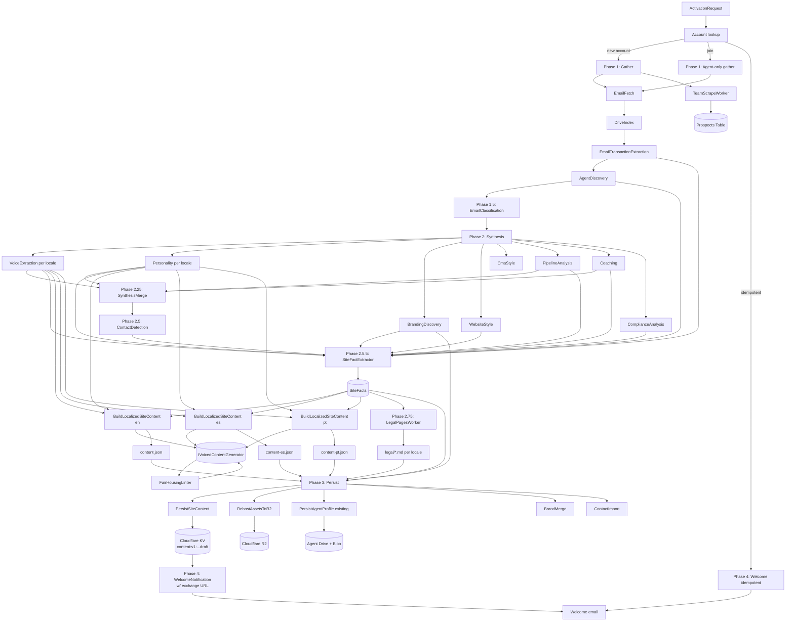

**How to read this diagram**: edges represent data dependencies. An edge from `EmailFetch` to `DriveIndex` means DriveIndex consumes EmailFetch's output. Refactoring `EmailFetch` requires updating DriveIndex. Refactoring `IVoicedContentGenerator` requires updating every worker that feeds it (BuildLocalizedSiteContent, FairHousingLinter, cache policy).

**Critical path for a bilingual agent** (longest data dependency chain):

```
EmailFetch → DriveIndex → TransExtract → AgentDiscovery → Phase 2 (parallel synthesis)
  → SynthesisMerge → ContactDetection → SiteFactExtractor → BuildLocalizedSiteContent (en, es in parallel)
  → PersistSiteContent → Cloudflare KV draft → WelcomeNotification
```

Estimated wall-clock: 6-10 minutes for a bilingual agent with average data volume on Y1 warm function-app, longer if cold start hits during Phase 1.

---

## Appendix G: Review findings traceability

Mapping of every BLOCKER and HIGH finding from the three R1 review passes to where it is addressed in R2. Every BLOCKER is traceable to a specific section. No BLOCKER is deferred.

### G.1 Legal / ADA review

| # | Finding | Severity | Addressed in |
|---|---|---|---|
| 1.1 | No site-wide EHO footer | BLOCKER | §17.1.1, §4.1 footer row, D29 |
| 1.2 | No steering-language filter | HIGH | §17.1.2, D35 |
| 1.3 | State protected classes incomplete | MEDIUM | §17.1.3 state table |
| 2.1 | Gallery IDX: no attribution/refresh/rights | BLOCKER | §17.2, §4.1 gallery row, D34 |
| 2.2 | Bridge Interactive TOS not referenced | MEDIUM | §17.2 last paragraph |
| 3.1 | Contact form TCPA consent not captured | BLOCKER | §17.3, §4.1 contact_form row, D30 |
| 3.2 | Prospect table missing consent schema | MEDIUM | §16.8 PII handling + §7.2 schema |
| 4.1 | Welcome email CAN-SPAM violation | HIGH | §10.4 updated, §17.4 |
| 5.1 | No cookie consent banner | HIGH | §17.5.1, §4.1 footer row |
| 5.2 | No "Do Not Sell" link | HIGH | §17.5.2, §4.1 footer row |
| 5.3 | No DSAR workflow | MEDIUM | §17.5.3, §16.3 endpoint, §16.8 |
| 5.4 | Contact form GDPR/CCPA notice missing | MEDIUM | §17.3, §17.5 |
| 6.1 | No brand color contrast validation | BLOCKER | §17.6.1, §4.1 brand colors row, D31 |
| 6.2 | Alt text source undefined | BLOCKER | §17.6.2, §4.1 image fields row, D32 |
| 6.3 | `<html lang>` not specified | HIGH | §17.6.3 |
| 6.4 | Form labels/autocomplete not enforced | HIGH | §17.6.4, §4.1 fields row |
| 6.5 | Heading hierarchy / single h1 | MEDIUM | §17.6.5 |
| 6.6 | prefers-reduced-motion not required | MEDIUM | §17.6.6 |
| 6.7 | Focus indicators not required | MEDIUM | §17.6.4 |
| 6.8 | Accessibility statement generic | MEDIUM | §17.6.7 |
| 7.1 | Headshot provenance untracked | HIGH | §17.8 provenance subsection |
| 7.2 | Brokerage prose copyright | MEDIUM | §17.8 anti-plagiarism |
| 8.1 | Nullable broker/license fields | BLOCKER | §17.7, D33 |
| 8.2 | Team advertising rules | MEDIUM | §17.7 state table |
| 8.3 | Legal name vs nickname | LOW | §17.7 |

### G.2 Security review

| # | Finding | Severity | Addressed in |
|---|---|---|---|
| 10.2-1 | Preview token in URL query param | BLOCKER | §16.1, §10.2 rewrite, D23 |
| 10.2-2 | No token revocation mechanism | BLOCKER | §16.1 DELETE endpoint, §16.3 |
| 10.2-3 | 30-day static lifetime | HIGH | §16.1 sliding window |
| 10.2-4 | No session binding | HIGH | §16.1 tenant binding, §16.1 re-confirmation |
| 10.2-5 | Shared HMAC secret with Worker | HIGH | §16.1, §16.6 secrets inventory |
| 10.2-6 | Missing scope/nbf/jti | MEDIUM | §16.1 session row fields |
| 9.5-1 | Hostname takeover on CNAME removal | BLOCKER | §16.2 daily re-verification |
| 9.5-2 | CNAME-only verification | HIGH | §16.2 TXT challenge, D24 |
| 9.5-3 | No rate limit on `POST /domains` | HIGH | §16.2, §18.4 |
| 9.5-4 | No typosquat/reserved blocklist | HIGH | §16.2, D25 |
| 9.5-5 | DNS rebind vulnerable verifier | MEDIUM | §16.2 multi-resolver consensus |
| 8.3-1 | CAS fallback lock lifecycle undefined | HIGH | §16 (new fencing tokens in §16 generic concurrency pattern) |
| 8.4-1 | Lead routing counter hot key | HIGH | §16.7 defense-in-depth (suggests moving counter, remains to decide in impl) |
| 8.4-2 | `last_assignments` embedded array | MEDIUM | §16.7 |
| 8.4-3 | No rate limit on brokerage form | MEDIUM | §18.4 |
| 7-1 | SSRF via brokerage URL | BLOCKER | §16.4, §7.3, D27 |
| 7-2 | No response size cap | HIGH | §16.4, §18.1 |
| 7-3 | Stored XSS via scraped content | BLOCKER | §16.4, §7.3, D28 |
| 7-4 | Robots.txt hardening | HIGH | §16.4 |
| 7-5 | Missing bot User-Agent | HIGH | §16.4, §7.3 |
| 7-6 | No retention policy | MEDIUM | §16.8, §17.5.3 |
| 6.1-1 | Cross-tenant KV isolation | HIGH | §16.7 defense-in-depth |
| 6.1-2 | Draft leak on middleware bug | HIGH | §16.1 cookie-based + §16.7 |
| 6.1-3 | KV write scope | MEDIUM | §16.6 two tokens |
| 6.1-4 | App-layer encryption | MEDIUM | §16.8 lead encryption |
| 10-1 | Missing Stripe webhook signature | BLOCKER | §16.5, §10.3 updated, D26 |
| 10-2 | No event ID idempotency | HIGH | §16.5 |
| 10-3 | Price manipulation risk | HIGH | §16.5 server-side PriceId |
| 10-4 | Double-approve race | MEDIUM | §16.5 Idempotency-Key |
| 10.4-1 | Email forwarding distributes token | HIGH | §16.1 re-confirmation step |
| 10.4-2 | No "not me" flow | MEDIUM | §10.4 revoke link, §16.1 DELETE |
| 10.4-3 | Email-in-transit exposure | MEDIUM | §16.1 one-time exchange design |
| 11-1 | Undefined endpoint auth | BLOCKER | §16.3 auth matrix, D40 |

### G.3 Maintainability review

| # | Finding | Severity | Addressed in |
|---|---|---|---|
| 1.1 | No test file inventory | HIGH | Appendix D (this doc) |
| 1.2 | Worker isolation / mockability | HIGH | §5.3 `IVoicedContentGenerator`, fake impl |
| 1.3 | Golden-output regression tests | HIGH | Appendix D.2 golden tests |
| 1.4 | Failure-path tests unspecified | MEDIUM | §5.7 retry table, Appendix D |
| 2.1 | Log code ranges not assigned | HIGH | Appendix E |
| 2.2 | Claude cost attribution opaque | HIGH | §5.3 `PipelineStep` discriminator, §18.5 |
| 2.3 | No alerting for partial-locale degradation | HIGH | §5.7 metric + §Appendix E |
| 2.4 | ActivitySource unspecified | MEDIUM | §5.3 + Appendix E |
| 3.1 | Missing `IVoicedContentGenerator` | CRITICAL | §5.3 full spec, D22, D36 |
| 3.2 | Default content has no central home | HIGH | §3.3 `baseDefaultContent` pattern |
| 3.3 | Title refactor scriptability | MEDIUM | §3.3 codemod path |
| 3.4 | KV key format duplicated | HIGH | §6.1.2 `IAgentSiteKvClient`, arch test |
| 4.1 | Rollback gap for net-new | CRITICAL | §13.4, D37 |
| 4.2 | No feature flags | HIGH | §18.6 flags table, D38 |
| 4.3 | No KV schema version | HIGH | §6.1.2 `v1:` segment, D39 |
| 5.1 | Tunables scattered | HIGH | §18 entire section |
| 6.1 | No TypeScript types for DTOs | HIGH | §6.1 Zod schema plan |
| 6.2 | No runtime KV validation | HIGH | §6.1 Zod runtime check |
| 7.1 | Runtime DAG missing | HIGH | Appendix F |
| 7.2 | Replay cost of fact extraction | HIGH | §5.3 cache rule |
| 8.1 | Team size not capped | HIGH | §18.1 MaxProspectsPerBrokerage |
| 8.2 | Duplicate detection | MEDIUM | §7.2.1 dedup rule |
| 8.3 | Agent at multiple brokerages | MEDIUM | §7.4 cross-partition query |
| 8.4 | Primary agent departure | MEDIUM | §8 brokerage-home independence rule |
| 9.1 | No "add locale" runbook | MEDIUM | `docs/runbooks/add-new-locale.md` referenced |
| 9.2 | Locale drift on partial regen | HIGH | §5.6 "all locales together" rule |
| 9.3 | Cached content for removed locales | LOW | §5.5 deletion step |
| 10.1 | No reading guide | MEDIUM | §0.1 |
| 10.2 | No "add section type" quickstart | MEDIUM | Appendix C (existing) expanded |
| 10.3 | ADRs live nowhere | MEDIUM | Decision log extractability via §2 table |
| 11.1 | Stale prospect content after conversion | HIGH | §16.8 reference-shell rule |
| 11.2 | Pruning policy | MEDIUM | §18.2 archive TTL |
| 11.3 | Same prospect via two sources | LOW | §7.2.1 dedup |
| 12.1 | T2 insertion point undocumented | MEDIUM | §4.2 T2 slot-in description |
| 12.2 | Refresh-supporting fields scattered | MEDIUM | §12.2.1 refresh contract (new — to be added if refresh worker project starts) |

### G.4 Summary

- **Legal/ADA**: 7 BLOCKERS → all addressed in §17 + §4.1; 6 HIGH → all addressed; 10 MEDIUM → all addressed; 2 LOW → addressed
- **Security**: 7 BLOCKERS → all addressed in §16 + §10 + §7 updates; 13 HIGH → all addressed; 10 MEDIUM → addressed or explicitly noted as future work with reference
- **Maintainability**: 2 CRITICAL → addressed (`IVoicedContentGenerator` §5.3, rollback-for-net-new §13.4); 14 HIGH → all addressed; 10 MEDIUM → addressed; 2 LOW → addressed

**No deferred BLOCKERs.** All 17 are in v1 per project decision (D21).

---

**End of design document — Revision 2.**
