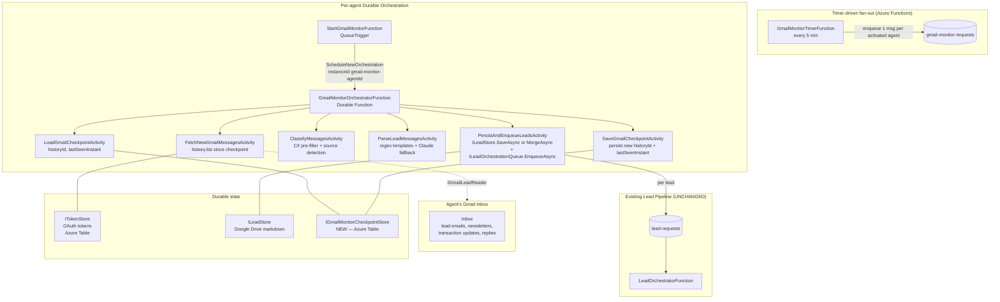
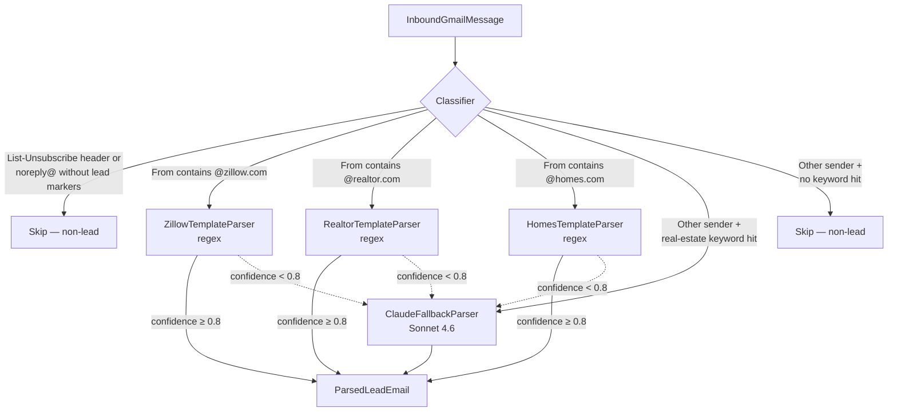

# Gmail Lead Monitoring — Design Spec

**Date:** 2026-04-17
**Status:** Draft — pending open-questions resolution
**Author:** Eddie Rosado + Claude
**Branch:** TBD (proposed: `feat/gmail-lead-monitoring`)
**MVP Feature:** #3 of 4 — see [2026-04-05-activation-mvp-redesign.md](./2026-04-05-activation-mvp-redesign.md)

---

## Summary

Watch each activated agent's Gmail inbox for inbound real-estate leads (Zillow, Realtor.com, Homes.com, direct referrals), parse the email into a `Lead` record, and enqueue it into the existing lead pipeline (`lead-requests` queue → `LeadOrchestratorFunction`). This spec picks **timer-based polling with Gmail `historyId` checkpoints** as the MVP detection mechanism, a **layered parser** (source-template regex first, Claude Sonnet fallback), and **thread-based dedup** that updates an existing `Lead` when a new email arrives in the same Gmail thread.

---

## Goals

1. Detect inbound leads in each activated agent's Gmail inbox with no manual intervention.
2. Reuse the existing lead pipeline end-to-end (`ILeadStore` → `ILeadOrchestrationQueue` → `LeadOrchestratorFunction`) — **no parallel pipeline**.
3. Cap Claude spend to ~$0.05/lead worst-case by keeping a cheap pre-filter + regex templates for the top 3 lead sources.
4. Survive downtime — if the monitor is offline for N hours, it catches up on resume without duplicates or missed leads.
5. Multi-tenant fan-out: one timer orchestrator dispatches per-agent sub-orchestrations so slow agents don't block the batch.
6. Preserve locale as first-class — detect `en`/`es` on the inbound email body and persist to `Lead.Locale`.

## Non-Goals

- Gmail push notifications (Pub/Sub `watch`) — Phase 2.
- Outbound replies (agent reply drafting) — that is MVP feature #4 (lead follow-ups), separate spec.
- CRM sync, Microsoft 365 / Outlook monitoring, IMAP fallback.
- Parsing non-English lead sources beyond Spanish (Portuguese, etc.) — detect only.
- Agent-in-the-loop "is this a lead?" confirmation UI — fully automated for MVP.
- Retroactive ingestion of pre-activation emails (one-time Drive import already covers this via `ContactImport`).

## Success Criteria

- [ ] A Zillow lead email delivered to an activated agent's inbox becomes a `Lead` in `ILeadStore` within 10 min p95, 5 min p50.
- [ ] Realtor.com, Homes.com, Zillow lead emails are parsed via regex without a Claude call.
- [ ] A direct referral email ("Hi Jenise, my friend Maria is selling her house...") is parsed via Claude and correctly classified with seller intent.
- [ ] Newsletter, transaction update, and non-lead email parse cost is $0 (pre-filter rejects before Claude).
- [ ] Second email on the same thread updates the existing `Lead` (merge phone/notes), does not create a duplicate.
- [ ] Monitor offline for 6 hours → on resume, catches up all messages since last `historyId` with zero duplicates and zero misses.
- [ ] 100% branch coverage across new production code.
- [ ] All 41 architecture tests still pass.

---

## High-Level Architecture



---

## Phased Rollout

### Phase 1 — MVP (this spec)

- Timer-triggered polling every 5 min, per-agent sub-orchestrations.
- `historyId`-based checkpoint + resume.
- Source-template regex parser for Zillow, Realtor.com, Homes.com.
- Claude Sonnet fallback parser for unknown senders.
- Thread-based dedup: `Lead` keyed on `agentId + gmailThreadId`; new messages on same thread update existing lead (notes append + field merge).
- Per-agent OAuth failure → mark "OAuth re-consent required", stop polling that agent, continue others.

### Phase 2 — Push notifications

- Gmail `users.watch` + Cloud Pub/Sub topic.
- HTTP webhook endpoint on the API → enqueues the same `gmail-monitor-requests` message for the agent — so the push path and poll path converge into the same orchestrator.
- `watch` expires every 7 days; a daily timer renews watches for all activated agents.
- Polling stays as 15-min fallback safety net.

### Phase 3 — Quality + ops (post-MVP)

- Multi-language template expansion (ES, PT).
- Per-agent parser learning — persist parse accuracy metrics per sender domain; promote domains to "trusted sender" fast path.
- Manual re-queue tool in the portal ("mark as lead" button for missed emails).

---

## Detailed Component Design

### New Domain Interfaces (RealEstateStar.Domain — ZERO deps)

All interfaces live in `RealEstateStar.Domain` per the architecture rules. Implementations land in `Clients.Gmail`, `Clients.Azure`, `Workers.Leads`, or `Api` per boundary rules.

```csharp
// RealEstateStar.Domain/Leads/Interfaces/IGmailLeadReader.cs
// Extends the Gmail client surface with history-based incremental read.
// Implementation: RealEstateStar.Clients.Gmail.GmailLeadReader (new file).
public interface IGmailLeadReader
{
    /// <summary>Fetches messages in the inbox since <paramref name="sinceHistoryId"/>.</summary>
    /// <remarks>When sinceHistoryId is null (cold start), fetches the most recent N.</remarks>
    Task<GmailHistorySlice> GetHistoryAsync(
        string accountId, string agentId,
        string? sinceHistoryId, int maxResults, CancellationToken ct);
}

public sealed record GmailHistorySlice(
    string NewHistoryId,
    IReadOnlyList<InboundGmailMessage> Messages,
    bool HistoryExpired);   // true when Gmail returns 404 historyNotFound → rebaseline

public sealed record InboundGmailMessage(
    string MessageId,        // Gmail message id
    string ThreadId,         // Gmail thread id
    string From,             // raw From header
    string[] To,
    string Subject,
    string Body,             // plain text, HTML stripped (reuse GmailReaderClient.ExtractBody)
    DateTime ReceivedAt,
    string? InReplyTo,       // message-id of parent, if any
    IReadOnlyList<string> Labels);
```

```csharp
// RealEstateStar.Domain/Leads/Interfaces/IGmailMonitorCheckpointStore.cs
public interface IGmailMonitorCheckpointStore
{
    Task<GmailMonitorCheckpoint?> GetAsync(string accountId, string agentId, CancellationToken ct);
    Task SaveAsync(GmailMonitorCheckpoint checkpoint, CancellationToken ct);
}

public sealed record GmailMonitorCheckpoint(
    string AccountId,
    string AgentId,
    string? LastHistoryId,
    DateTime LastProcessedAt,
    int ConsecutiveOAuthFailures,
    DateTime? DisabledUntil,
    string ETag);
```

```csharp
// RealEstateStar.Domain/Leads/Interfaces/ILeadEmailParser.cs
public interface ILeadEmailParser
{
    Task<ParsedLeadEmail?> TryParseAsync(
        InboundGmailMessage message,
        string agentId,
        CancellationToken ct);
}

public sealed record ParsedLeadEmail(
    LeadSource Source,
    LeadType LeadType,
    string FirstName,
    string LastName,
    string Email,
    string Phone,
    string Timeline,
    SellerDetails? SellerDetails,
    BuyerDetails? BuyerDetails,
    string? Notes,
    string Locale,
    decimal ParseConfidence,
    string ParserUsed);

public enum LeadSource { Zillow, RealtorDotCom, HomesDotCom, Direct, Unknown }
```

```csharp
// RealEstateStar.Domain/Leads/Interfaces/ILeadEmailClassifier.cs
public interface ILeadEmailClassifier
{
    LeadEmailClassification Classify(InboundGmailMessage message);
}

public sealed record LeadEmailClassification(
    bool IsCandidate,
    LeadSource LikelySource,
    string Reason);
```

```csharp
// RealEstateStar.Domain/Leads/Interfaces/ILeadThreadIndex.cs
public interface ILeadThreadIndex
{
    Task<Lead?> GetByThreadIdAsync(string agentId, string gmailThreadId, CancellationToken ct);
    Task LinkThreadAsync(string agentId, Guid leadId, string gmailThreadId, string messageId, CancellationToken ct);
    Task<bool> HasProcessedMessageAsync(string agentId, string gmailMessageId, CancellationToken ct);
    Task MarkMessageProcessedAsync(string agentId, string gmailMessageId, Guid leadId, CancellationToken ct);
}
```

### Lead model extension

`RealEstateStar.Domain/Leads/Models/Lead.cs` gains three init-only fields (non-breaking — nullable):

```csharp
public string? GmailThreadId { get; init; }
public string? GmailMessageId { get; init; }
public LeadSource? Source { get; init; }
```

`LeadMarkdownRenderer` adds these to YAML frontmatter. Roundtrip tests required per `code-quality.md`.

### Activity function signatures

All activities live under `RealEstateStar.Functions/Leads/GmailMonitor/`.

| Activity | Input | Output | FATAL/BEST-EFFORT | Retry Policy |
|---|---|---|---|---|
| `LoadGmailCheckpointActivity` | `{accountId, agentId, correlationId}` | `GmailMonitorCheckpoint?` | FATAL | `Standard` |
| `FetchNewGmailMessagesActivity` | `{accountId, agentId, sinceHistoryId, maxResults, correlationId}` | `GmailHistorySlice` | FATAL | `GmailRead` |
| `ClassifyAndParseMessagesActivity` | `{messages, agentId, correlationId}` | `{parsed, skipped}` | BEST-EFFORT per-message | `Parse` |
| `PersistAndEnqueueLeadsActivity` | `{parsed, agentId, accountId, messages, correlationId}` | `{created, merged, enqueued}` | FATAL (idempotent) | `Persist` |
| `SaveGmailCheckpointActivity` | `{checkpoint}` | void | FATAL | `Standard` |

### Orchestrator skeleton

```csharp
[Function("GmailMonitorOrchestrator")]
public static async Task RunOrchestrator([OrchestrationTrigger] TaskOrchestrationContext ctx)
{
    var input = ctx.GetInput<GmailMonitorOrchestratorInput>()
        ?? throw new InvalidOperationException("[GMLM-ORCH-000] null input");
    var logger = ctx.CreateReplaySafeLogger<GmailMonitorOrchestratorFunction>();

    var checkpoint = await ctx.CallActivityAsync<GmailMonitorCheckpoint?>(
        "LoadGmailCheckpoint", input, GmailMonitorRetryPolicies.Standard);

    if (checkpoint?.DisabledUntil is { } until && ctx.CurrentUtcDateTime < until)
    {
        if (!ctx.IsReplaying)
            logger.LogInformation("[GMLM-ORCH-002] Agent {AgentId} is in OAuth backoff until {Until}",
                input.AgentId, until);
        return;
    }

    var slice = await ctx.CallActivityAsync<GmailHistorySlice>(
        "FetchNewGmailMessages",
        new FetchNewGmailMessagesInput {
            AccountId = input.AccountId, AgentId = input.AgentId,
            SinceHistoryId = checkpoint?.LastHistoryId,
            MaxResults = 100,
            CorrelationId = input.CorrelationId
        },
        GmailMonitorRetryPolicies.GmailRead);

    if (slice.Messages.Count == 0 || slice.HistoryExpired)
    {
        await ctx.CallActivityAsync("SaveGmailCheckpoint",
            BuildCheckpoint(checkpoint, slice.NewHistoryId, consecutiveOAuthFailures: 0),
            GmailMonitorRetryPolicies.Standard);
        return;
    }

    var parseResult = await ctx.CallActivityAsync<ClassifyAndParseOutput>(
        "ClassifyAndParseMessages",
        new ClassifyAndParseInput { Messages = slice.Messages, AgentId = input.AgentId,
                                    CorrelationId = input.CorrelationId },
        GmailMonitorRetryPolicies.Parse);

    if (parseResult.Parsed.Count > 0)
    {
        await ctx.CallActivityAsync("PersistAndEnqueueLeads",
            new PersistAndEnqueueInput {
                AccountId = input.AccountId, AgentId = input.AgentId,
                Parsed = parseResult.Parsed, Messages = slice.Messages,
                CorrelationId = input.CorrelationId
            },
            GmailMonitorRetryPolicies.Persist);
    }

    await ctx.CallActivityAsync("SaveGmailCheckpoint",
        BuildCheckpoint(checkpoint, slice.NewHistoryId, consecutiveOAuthFailures: 0),
        GmailMonitorRetryPolicies.Standard);
}
```

Total activity calls: **5** (inside the 5–6 cap).

### Timer + fan-out function

```csharp
public sealed class GmailMonitorTimerFunction(
    IActivatedAgentLister activatedAgents,
    IGmailMonitorQueue queue,
    ILogger<GmailMonitorTimerFunction> logger)
{
    [Function("GmailMonitorTimer")]
    public async Task RunAsync(
        [TimerTrigger("0 */5 * * * *")] TimerInfo timer,
        CancellationToken ct)
    {
        try
        {
            var agents = await activatedAgents.ListActivatedAgentsAsync(ct);
            foreach (var a in agents)
            {
                await queue.EnqueueAsync(
                    new GmailMonitorMessage(a.AccountId, a.AgentId, Guid.NewGuid().ToString("N")),
                    ct);
            }
            logger.LogInformation("[GMLM-TMR-001] Fanout complete. Agents={Count}", agents.Count);
        }
        catch (Exception ex)
        {
            logger.LogError(ex, "[GMLM-TMR-020] Timer fan-out failed");
            throw;
        }
    }
}
```

`StartGmailMonitorFunction` (queue trigger) schedules one orchestration per message with instance id `gmail-monitor-{accountId}-{agentId}-{floorMinute}` — deterministic to prevent duplicate in-flight orchestrations if the timer double-fires.

### Retry policies

```csharp
internal static class GmailMonitorRetryPolicies
{
    public static readonly TaskOptions Standard = TaskOptions.FromRetryPolicy(new RetryPolicy(
        maxNumberOfAttempts: 3, firstRetryInterval: TimeSpan.FromSeconds(15), backoffCoefficient: 2.0));

    public static readonly TaskOptions GmailRead = TaskOptions.FromRetryPolicy(new RetryPolicy(
        maxNumberOfAttempts: 4, firstRetryInterval: TimeSpan.FromSeconds(30), backoffCoefficient: 2.0));

    public static readonly TaskOptions Parse = TaskOptions.FromRetryPolicy(new RetryPolicy(
        maxNumberOfAttempts: 2, firstRetryInterval: TimeSpan.FromSeconds(10), backoffCoefficient: 2.0));

    public static readonly TaskOptions Persist = TaskOptions.FromRetryPolicy(new RetryPolicy(
        maxNumberOfAttempts: 4, firstRetryInterval: TimeSpan.FromSeconds(15), backoffCoefficient: 2.0));
}
```

### Log code prefix table

| Prefix | Scope |
|---|---|
| `[GMLM-TMR-NNN]` | Timer fan-out function |
| `[GMLM-SQ-NNN]` | StartGmailMonitorFunction (queue trigger) |
| `[GMLM-ORCH-NNN]` | Orchestrator |
| `[GMLM-ACTV-FETCH-NNN]` | FetchNewGmailMessagesActivity |
| `[GMLM-ACTV-PARSE-NNN]` | ClassifyAndParseMessagesActivity |
| `[GMLM-ACTV-PERSIST-NNN]` | PersistAndEnqueueLeadsActivity |
| `[GMLM-ACTV-CKP-NNN]` | Load/SaveGmailCheckpoint |
| `[GMLM-PARSE-NNN]` | Parser implementations |
| `[GMLM-CLS-NNN]` | Classifier |
| `[GMLM-RDR-NNN]` | GmailLeadReader client |
| `[GMLM-IDX-NNN]` | ILeadThreadIndex implementation |

---

## Layered Parser Design



**Classifier (C# only, ~$0):**

- Reject if headers contain `List-Unsubscribe` AND body lacks lead-intent keywords.
- Reject if `From` is `noreply@` / `do-not-reply@` AND sender domain is not on the known-lead-source allowlist.
- Reject if subject starts with `Re:` AND `In-Reply-To` points to an agent-sent message.
- Accept if: known lead-source domain OR body contains ≥2 of [name + phone pattern + address pattern + intent keyword].

**Template parsers (regex, C#, ~$0):** Parse confidence scoring: 1.0 = all anchors matched; 0.8 = core fields present; < 0.8 → fall through to Claude.

**Claude fallback (Sonnet 4.6, ~$0.01–0.03/parse):**
- System prompt extracts structured JSON (firstName, lastName, email, phone, leadType, timeline, locale, confidence).
- Input: subject + up to 4KB of body.
- Prompt-injection mitigation: wrap body in `<email_body>` delimiters.
- Strip markdown code fences before `JsonDocument.Parse` (per MEMORY lesson).

---

## Dedup + Replay Safety Strategy

### Message-level idempotency

`ILeadThreadIndex.HasProcessedMessageAsync(agentId, gmailMessageId)` returns true if this Gmail messageId already produced a Lead action. `PersistAndEnqueueLeadsActivity` calls this **before** writing any lead. Impl: Azure Table `ProcessedGmailMessages` keyed by `(agentId, messageId)`.

### Thread-level merge

| Scenario | Action |
|---|---|
| Thread unknown | Create new `Lead` via `ILeadStore.SaveAsync`, link thread. |
| Thread known + new msg adds phone/notes | `UpdateAsync` lead, merge fields. Do NOT re-enqueue. |
| Thread known + new msg changes LeadType | `MergeType(Both)`, append note, re-enqueue (instance id dedups). |
| Thread known + pure acknowledgment | Append note only, no re-enqueue. |

### Durable Functions replay safety

- Orchestrator calls only activities. No `DateTime.UtcNow`, no `Guid.NewGuid()`, no un-guarded logs.
- Instance ID: `gmail-monitor-{accountId}-{agentId}-{yyyyMMddHHmm-floor5}`.
- `SaveGmailCheckpoint` uses ETag optimistic concurrency.

### Catch-up after outage

- Gmail `history.list` returns up to 500 records per page — sufficient for < 2–3 hour outages.
- On `404 historyNotFound` (stale historyId > ~1 week), **rebaseline**: `users.messages.list?q=newer_than:1d&labelIds=INBOX`, process those, store new historyId.
- `Checkpoint.LastProcessedAt` marker logs how far back we skipped.

---

## Multi-Tenant Fan-Out + Memory Budget

- Single timer every 5 min enumerates activated agents via `IActivatedAgentLister` (scans `config/accounts/*/account.json`, caches with mtime refresh).
- Enqueues one `GmailMonitorMessage` per agent to `gmail-monitor-requests`.
- `StartGmailMonitorFunction` (queue trigger, default batchSize 16) schedules one orchestration per message.
- Each orchestration processes **one agent's Gmail sequentially** — no parallel activities.

### Memory math (Azure Consumption = 1.5 GB per instance)

- `GmailHistorySlice` with 100 messages × avg 16 KB body = ~1.6 MB.
- Worst case: `16 parallel orchestrations × 2 MB ≈ 32 MB`. Well under 1.5 GB.
- `MaxResults = 100` per `history.list` page; stop after one page per tick.
- Claude parsing serial, not `Task.WhenAll`.

### Activated-agent opt-in

New field on `account.json`:
```json
{
  "monitoring": {
    "gmail": { "enabled": true, "startedAt": "2026-04-18T00:00:00Z" }
  }
}
```
Default `enabled: false` on existing accounts. Feature flag `Features:GmailMonitor:Enabled` gates the timer entirely.

---

## Observability Plan

### ActivitySource + Meter

```csharp
public static readonly ActivitySource ActivitySource = new("RealEstateStar.GmailMonitor");
public static readonly Meter Meter = new("RealEstateStar.GmailMonitor");

// Counters
MessagesFetched, MessagesSkipped, LeadsCreated, LeadsMerged,
ClaudeFallbacks, HistoryExpired, OAuthFailures

// Histograms
ParseDurationMs, FetchDurationMs, EndToEndLatencyMs
```

Spans: `gmail_monitor.fetch`, `gmail_monitor.parse`, `gmail_monitor.persist` with hashed `agent.id` tags (no PII).

### Structured logging

- Every service emits logs with `agentId` + `correlationId`.
- No PII in tags: hash/omit emails, subjects, phones.
- Prompt-injection safety: log first 200 chars of Claude response on parse failure, never the email body.

### Grafana dashboard tiles

- Messages fetched/skipped/parsed/Claude-fallback per hour, per agent.
- Leads created vs merged.
- End-to-end latency p50/p95.
- OAuth failure rate — alert > 5/hr.
- `history_expired` counter — should be near-zero.

---

## Test Strategy

### Unit tests

- `LeadEmailClassifierTests` — 30+ table-driven scenarios (zillow, realtor, newsletter, noreply+keywords, Re: reply, etc.).
- `{Zillow|Realtor|Homes}TemplateParserTests` — golden-file fixtures with 5+ sanitized samples per source.
- `ClaudeFallbackParserTests` — mock `IAnthropicClient`, verify delimiters + JSON parse with code-fence strip.
- `LanguageDetectorTests` — extend existing with Gmail body fixtures.
- `GmailLeadReaderTests` — mock Gmail SDK; historyId roundtrip, `historyNotFound` → `HistoryExpired=true`.
- `LeadThreadIndexTests` — idempotency, thread get, concurrent access.

### Integration tests

- `GmailMonitorOrchestrator_HappyPath` — fake reader yields 3 messages → 2 leads, 1 skipped.
- `GmailMonitorOrchestrator_ThreadMerge` — follow-up message on same thread → single lead with merged notes.
- `GmailMonitorOrchestrator_HistoryExpired` — rebaseline path.
- `GmailMonitorOrchestrator_Replay` — kill activity mid-run, resume produces same leads.
- `GmailMonitorOrchestrator_OAuthFailure` — `ConsecutiveOAuthFailures` increments, `DisabledUntil` set.

### Architecture tests

- `DependencyTests` — new project reference allowlists (user approval required).
- `DiRegistrationTests` — every new interface is registered.
- `LocaleTests` — `ParsedLeadEmail.Locale` present.

### Quality gates (per code-quality.md)

- Every `catch` in new code has a test that triggers it.
- Every YAML frontmatter addition has render→parse roundtrip + injection test.
- Serialization roundtrip for `GmailMonitorCheckpoint`, `GmailMonitorMessage`.

---

## Security Considerations

### OAuth scope

`IGmailLeadReader` needs `gmail.readonly`. We already request `gmail.send` (superset). **Action:** verify activation consent screen lists readonly scope; no new prompt.

### PII handling

- `InboundGmailMessage.Body`/`Subject` held in memory only during one tick; never logged, never persisted outside `ILeadStore`.
- Telemetry tags use hashed `agent.id`.
- Loggers never receive `.Body`.

### Prompt injection (Claude parser)

- Email body wrapped in `<email_body>` delimiters.
- System prompt treats content as data, not instructions.
- Output validated against JSON schema.
- Confidence < threshold → reject; do not create lead from adversarial input.

### Sender spoofing (DKIM)

A spoofed "zillow-looking" email could inject a fake lead.
**Mitigation:** verify `From` against `Authentication-Results` (SPF/DKIM/DMARC). DKIM fail → downgrade to Claude fallback, never trusted-source fast path.

### Rate limiting vs abuse

- Per-agent `history.list` ≤ 1 call per 5 min. Gmail quota 15k units/sec — we use < 1.
- Claude calls: circuit breaker if `ClaudeFallbacks` > 50/hr/agent; flag for manual review.

### Tenant isolation

Every activity receives `{accountId, agentId}`. `IOAuthRefresher` keyed on `(accountId, agentId)`. No shared caches across agents.

---

## Alternatives Considered + Tradeoffs

### Detection mechanism

| Option | Latency | Complexity | Cost | Verdict |
|---|---|---|---|---|
| **Timer polling (5 min)** — chosen | 5 min avg, 10 min p95 | Low | Gmail quota ≈ free | MVP pick. |
| Gmail Pub/Sub push | Seconds | High — Pub/Sub topic, webhook sig, watch renewal | Infra + code | Phase 2. Not worth overhead for one customer. |
| IMAP IDLE | Seconds | Medium — long-lived connections | Free | Not DF-friendly; breaks scale-to-zero. |

### Parser strategy

| Option | Coverage | Cost | Verdict |
|---|---|---|---|
| **Regex + Claude fallback** — chosen | 80% regex, 100% Claude | ~$0 template, ~$0.02 fallback | MVP pick. |
| Pure Claude | 100% | ~$0.02/email | Rejected — cost scales poorly. |
| Pure regex | ~60% | ~$0 | Rejected — misses direct referrals. |

### Dedup strategy

| Option | Pros | Cons | Verdict |
|---|---|---|---|
| **Per-thread merge** — chosen | One customer = one lead | Needs `ILeadThreadIndex` | MVP pick. |
| Per-message lead | Simplest | 4 emails = 4 leads | Rejected. |
| Per-email-address | Simpler than thread | Cross-customer merges via shared aliases | Rejected. |

### Orchestration shape

Per-agent, not per-message. Per-message would churn hundreds of DF histories/day with no replay benefit.

---

## Open Questions (Need User Decision Before Implementation)

1. **Polling cadence — 5 min vs 1 min vs 15 min.** Drives p95 lead latency and Azure Function invocation cost. Spec assumes 5 min.

2. **Activated-agent source of truth.**
   (a) Scan `config/accounts/*/account.json` at warm-up, cache + refresh via mtime — simple.
   (b) `IActivationStore` + Azure Table — cleaner but new durable store.
   Spec assumes (a).

3. **Trusted-sender fast path & DKIM enforcement.** On DKIM fail: strict (drop to Claude, default) vs relaxed (still trust template). Strict = fewer false positives, breaks auto-forwarded brokerage leads. Relaxed = higher spoof risk.

4. **Gmail monitoring scope.** Raw `in:inbox` or `category:primary OR category:updates`? Raw surfaces everything (higher classifier burden). Spec: raw.

5. **Opt-in vs opt-out default for existing accounts.** Default `enabled: true` at deploy, or require explicit enablement per agent? Ops risk of accidentally reading mail.

6. **Rebaseline window after > 7 day outage.** Process `newer_than:1d`, `newer_than:3d`, or skip entirely? Spec: 1 day.

7. **Claude confidence threshold for auto-create vs drop.** No review UI in MVP — 0.5 (noisier) vs 0.85 (misses ambiguous referrals). Spec: 0.7.

---

## Out-of-Scope / Future Work

- Gmail push (Pub/Sub `watch`) — Phase 2 spec.
- Outlook / Microsoft Graph monitoring — separate channel spec.
- Agent-facing review UI for low-confidence parses.
- Learning loop: track parse correctness, tune thresholds per agent.
- Auto-reply drafting — MVP feature #4.
- Brokerage shared mailbox fan-out — needs routing policy.
- Migration of existing lead-submission pipeline to use `ILeadThreadIndex` — form submissions have no threadId.

---

## Files to Add / Modify

### New files (Domain)
- `Leads/Interfaces/IGmailLeadReader.cs`, `IGmailMonitorCheckpointStore.cs`, `ILeadEmailParser.cs`, `ILeadEmailClassifier.cs`, `ILeadThreadIndex.cs`, `IActivatedAgentLister.cs`, `IGmailMonitorQueue.cs`
- `Leads/Models/GmailMonitorCheckpoint.cs`, `InboundGmailMessage.cs`, `GmailHistorySlice.cs`, `ParsedLeadEmail.cs`, `LeadSource.cs`, `LeadEmailClassification.cs`, `GmailMonitorMessage.cs`

### New files (Clients)
- `Clients.Gmail/GmailLeadReader.cs`
- `Clients.Azure/AzureGmailMonitorCheckpointStore.cs`, `AzureLeadThreadIndex.cs`, `AzureGmailMonitorQueue.cs`

### New files (Workers.Leads)
- `GmailMonitor/LeadEmailClassifier.cs`
- `GmailMonitor/Parsers/{Zillow,Realtor,Homes}TemplateParser.cs`, `ClaudeFallbackParser.cs`
- `GmailMonitor/CompositeLeadEmailParser.cs`, `GmailMonitorDiagnostics.cs`

### New files (DataServices)
- `Leads/ConfigActivatedAgentLister.cs`, `LeadThreadMerger.cs`

### New files (Functions)
- `Leads/GmailMonitor/GmailMonitorTimerFunction.cs`, `StartGmailMonitorFunction.cs`, `GmailMonitorOrchestratorFunction.cs`
- `Leads/GmailMonitor/Activities/LoadGmailCheckpointActivity.cs`, `FetchNewGmailMessagesActivity.cs`, `ClassifyAndParseMessagesActivity.cs`, `PersistAndEnqueueLeadsActivity.cs`, `SaveGmailCheckpointActivity.cs`
- `Leads/GmailMonitor/Models/GmailMonitorDtos.cs`, `GmailMonitorRetryPolicies.cs`

### Modified files
- `Domain/Leads/Models/Lead.cs` — add nullable `GmailThreadId`, `GmailMessageId`, `Source`.
- `DataServices/Leads/LeadMarkdownRenderer.cs` — render new frontmatter fields.
- `Api/Program.cs` — register new DI interfaces.
- `Architecture.Tests/{DependencyTests,DiRegistrationTests}.cs` — add new project allowlists (requires `[arch-change-approved]`).
- `config/accounts/*/account.json` — add `monitoring.gmail.enabled`.
- `appsettings.json` / `host.json` — `Features:GmailMonitor:Enabled` flag, timer cron override.
