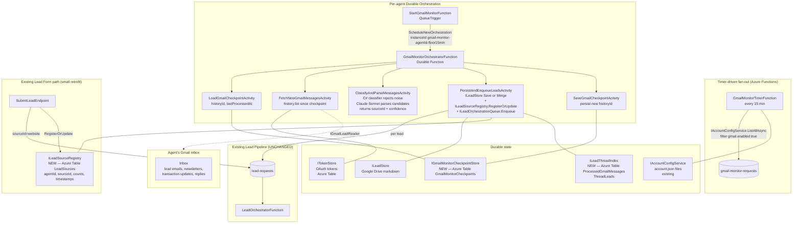

# Gmail Lead Monitoring — Design Spec

**Date:** 2026-04-17
**Status:** Draft — Q1-Q3 resolved, Q4-Q7 open
**Author:** Eddie Rosado + Claude
**Branch:** TBD (proposed: `feat/gmail-lead-monitoring`)
**MVP Feature:** #3 of 4 — see [2026-04-05-activation-mvp-redesign.md](./2026-04-05-activation-mvp-redesign.md)

---

## Summary

Watch each activated agent's Gmail inbox for inbound real-estate leads (Zillow, Realtor.com, Homes.com, direct referrals, brokerage forwards, and any other source), parse the email into a `Lead` record, and enqueue it into the existing lead pipeline (`lead-requests` queue → `LeadOrchestratorFunction`). This spec picks **timer-based polling every 15 min with Gmail `historyId` checkpoints** as the MVP detection mechanism, a **single-path Claude Sonnet parser** (no per-source regex templates — source is a Claude-classified dimension, not a fast-path switch), a **lead-source registry** that inventories every source seen per agent for future attribution + source-aware drip campaigns (MVP feature #4), and **thread-based dedup** that updates an existing `Lead` when a new email arrives in the same Gmail thread.

---

## Goals

1. Detect inbound leads in each activated agent's Gmail inbox with no manual intervention, regardless of source.
2. Reuse the existing lead pipeline end-to-end (`ILeadStore` → `ILeadOrchestrationQueue` → `LeadOrchestratorFunction`) — **no parallel pipeline**.
3. Parse every candidate email through the same path (classifier → Claude parser → persist). No per-source templated fast-path in Phase 1; coverage > cost optimization at this stage (~$3/month Claude spend per agent at 150 leads/month is noise compared to the value of not missing leads when a source tweaks its email format).
4. Build a **lead-source registry** as Gmail monitoring lands — every source ever seen per agent is inventoried with counts and timestamps. Foundation for source-aware drip campaigns (MVP feature #4) and per-source ROI reporting.
5. Survive downtime — if the monitor is offline for N hours, it catches up on resume without duplicates or missed leads.
6. Multi-tenant fan-out: one timer orchestrator dispatches per-agent sub-orchestrations so slow agents don't block the batch.
7. Preserve locale as first-class — detect `en`/`es` on the inbound email body and persist to `Lead.Locale`.
8. All lead entry paths (Gmail, lead-form, future channels) contribute to the same source registry. Lead-form submissions set `sourceId="website"`; Gmail-detected leads set whatever source Claude identifies.

## Non-Goals

- Gmail push notifications (Pub/Sub `watch`) — Phase 2.
- Outbound replies / drip campaign execution — that is MVP feature #4 (lead follow-ups), separate spec. This spec lays the registry foundation that feature will read from.
- Per-source templated fast-path parsers — deferred indefinitely. Will revisit only if Claude spend at scale ($300+/month) justifies the maintenance cost.
- Source-aware drip campaign configuration UI — feature #4.
- CRM sync, Microsoft 365 / Outlook monitoring, IMAP fallback.
- Parsing non-English lead sources beyond Spanish (Portuguese, etc.) — detect only.
- Agent-in-the-loop "is this a lead?" confirmation UI — fully automated for MVP.
- Retroactive ingestion of pre-activation emails (one-time Drive import already covers this via `ContactImport`).

## Success Criteria

- [ ] A lead email from ANY source (Zillow, Realtor.com, Homes.com, Trulia, Redfin, brokerage referral, direct referral, lead-form forward, etc.) delivered to an activated agent's inbox becomes a `Lead` in `ILeadStore` within 20 min p95, 15 min p50.
- [ ] Every email-sourced lead has a non-null `SourceId` (examples: `"zillow"`, `"realtor.com"`, `"homes.com"`, `"direct"`, `"brokerage"`, `"facebook"`, etc. — open-ended). Source registry records `(agentId, sourceId)` with first-seen, last-seen, total-leads counters.
- [ ] Lead-form submissions at the agent website also populate `SourceId="website"` (retrofit of the existing submit endpoint).
- [ ] Newsletter, transaction update, and non-lead email parse cost is $0 (classifier rejects before Claude).
- [ ] Second email on the same thread updates the existing `Lead` (merge phone/notes), does not create a duplicate.
- [ ] Monitor offline for 6 hours → on resume, catches up all messages since last `historyId` with zero duplicates and zero misses.
- [ ] 100% branch coverage across new production code.
- [ ] All 41 architecture tests still pass.

---

## High-Level Architecture



---

## Phased Rollout

### Phase 1 — MVP (this spec)

- Timer-triggered polling every 5 min, per-agent sub-orchestrations.
- `historyId`-based checkpoint + resume.
- Source-template regex parser for Zillow, Realtor.com, Homes.com.
- Claude Sonnet fallback parser for unknown senders.
- Thread-based dedup: `Lead` keyed on `agentId + gmailThreadId`; new messages on same thread update existing lead (notes append + field merge).
- Per-agent OAuth failure → mark "OAuth re-consent required", stop polling that agent, continue others.

### Phase 2 — Push notifications

- Gmail `users.watch` + Cloud Pub/Sub topic.
- HTTP webhook endpoint on the API → enqueues the same `gmail-monitor-requests` message for the agent — so the push path and poll path converge into the same orchestrator.
- `watch` expires every 7 days; a daily timer renews watches for all activated agents.
- Polling stays as 15-min fallback safety net.

### Phase 3 — Quality + ops (post-MVP)

- Multi-language template expansion (ES, PT).
- Per-agent parser learning — persist parse accuracy metrics per sender domain; promote domains to "trusted sender" fast path.
- Manual re-queue tool in the portal ("mark as lead" button for missed emails).

---

## Detailed Component Design

### New Domain Interfaces (RealEstateStar.Domain — ZERO deps)

All interfaces live in `RealEstateStar.Domain` per the architecture rules. Implementations land in `Clients.Gmail`, `Clients.Azure`, `Workers.Leads`, or `Api` per boundary rules.

```csharp
// RealEstateStar.Domain/Leads/Interfaces/IGmailLeadReader.cs
// Extends the Gmail client surface with history-based incremental read.
// Implementation: RealEstateStar.Clients.Gmail.GmailLeadReader (new file).
public interface IGmailLeadReader
{
    /// <summary>Fetches messages in the inbox since <paramref name="sinceHistoryId"/>.</summary>
    /// <remarks>When sinceHistoryId is null (cold start), fetches the most recent N.</remarks>
    Task<GmailHistorySlice> GetHistoryAsync(
        string accountId, string agentId,
        string? sinceHistoryId, int maxResults, CancellationToken ct);
}

public sealed record GmailHistorySlice(
    string NewHistoryId,
    IReadOnlyList<InboundGmailMessage> Messages,
    bool HistoryExpired);   // true when Gmail returns 404 historyNotFound → rebaseline

public sealed record InboundGmailMessage(
    string MessageId,        // Gmail message id
    string ThreadId,         // Gmail thread id
    string From,             // raw From header
    string[] To,
    string Subject,
    string Body,             // plain text, HTML stripped (reuse GmailReaderClient.ExtractBody)
    DateTime ReceivedAt,
    string? InReplyTo,       // message-id of parent, if any
    IReadOnlyList<string> Labels);
```

```csharp
// RealEstateStar.Domain/Leads/Interfaces/IGmailMonitorCheckpointStore.cs
public interface IGmailMonitorCheckpointStore
{
    Task<GmailMonitorCheckpoint?> GetAsync(string accountId, string agentId, CancellationToken ct);
    Task SaveAsync(GmailMonitorCheckpoint checkpoint, CancellationToken ct);
}

public sealed record GmailMonitorCheckpoint(
    string AccountId,
    string AgentId,
    string? LastHistoryId,
    DateTime LastProcessedAt,
    int ConsecutiveOAuthFailures,
    DateTime? DisabledUntil,
    string ETag);
```

```csharp
// RealEstateStar.Domain/Leads/Interfaces/ILeadEmailParser.cs
// Single-path parser. Implementation: RealEstateStar.Workers.Leads.ClaudeLeadEmailParser.
// Q3 resolved: no per-source regex fast-path. Coverage > cost optimization for MVP.
public interface ILeadEmailParser
{
    Task<ParsedLeadEmail?> TryParseAsync(
        InboundGmailMessage message,
        string agentId,
        CancellationToken ct);
}

public sealed record ParsedLeadEmail(
    string SourceId,              // Claude-classified, open-ended; examples below
    decimal SourceConfidence,     // 0..1 — how sure Claude is about the sourceId
    LeadType LeadType,            // existing enum Buyer/Seller/Both/Unknown
    string FirstName,
    string LastName,
    string Email,
    string Phone,
    string Timeline,
    SellerDetails? SellerDetails,
    BuyerDetails? BuyerDetails,
    string? Notes,
    string Locale,                // en | es
    decimal ParseConfidence,      // 0..1 — overall parse quality
    string ParserUsed);           // "claude-sonnet-4-6" — tracked for observability

// SourceId is a string, not an enum, to support the open-ended registry.
// Canonical values Claude is prompted to emit when it recognizes a source:
//   "zillow" | "realtor.com" | "homes.com" | "trulia" | "redfin"
//   "facebook" | "instagram" | "google-ads"
//   "brokerage" (for forwarded brokerage leads without a specific platform)
//   "direct" (human-written referral from friend/family/network)
//   "website" (lead-form submission — NOT set by Gmail; set by SubmitLeadEndpoint)
// Unknown senders get Claude's best guess. Registry tracks whatever it sees.
```

```csharp
// RealEstateStar.Domain/Leads/Interfaces/ILeadEmailClassifier.cs
public interface ILeadEmailClassifier
{
    LeadEmailClassification Classify(InboundGmailMessage message);
}

public sealed record LeadEmailClassification(
    bool IsCandidate,
    LeadSource LikelySource,
    string Reason);
```

```csharp
// RealEstateStar.Domain/Leads/Interfaces/ILeadThreadIndex.cs
public interface ILeadThreadIndex
{
    Task<Lead?> GetByThreadIdAsync(string agentId, string gmailThreadId, CancellationToken ct);
    Task LinkThreadAsync(string agentId, Guid leadId, string gmailThreadId, string messageId, CancellationToken ct);
    Task<bool> HasProcessedMessageAsync(string agentId, string gmailMessageId, CancellationToken ct);
    Task MarkMessageProcessedAsync(string agentId, string gmailMessageId, Guid leadId, CancellationToken ct);
}
```

```csharp
// RealEstateStar.Domain/Leads/Interfaces/ILeadSourceRegistry.cs
// Per-agent inventory of every lead source ever observed.
// Foundation for source-aware drip campaigns (feature #4) and ROI reporting.
// Called by: Gmail monitor (every Gmail-detected lead), SubmitLeadEndpoint (every form submission),
// future channels (WhatsApp, SMS, etc.).
public interface ILeadSourceRegistry
{
    /// <summary>
    /// Idempotent upsert. Creates the source entry if new, otherwise increments counters.
    /// Safe to call from activity function retries — all updates are atomic increments.
    /// </summary>
    Task RegisterOrUpdateAsync(
        string agentId,
        string sourceId,
        LeadSourceObservation observation,
        CancellationToken ct);

    Task<LeadSourceEntry?> GetAsync(string agentId, string sourceId, CancellationToken ct);

    Task<IReadOnlyList<LeadSourceEntry>> GetAllForAgentAsync(string agentId, CancellationToken ct);
}

public sealed record LeadSourceObservation(
    Guid LeadId,
    DateTime ObservedAt,
    decimal SourceConfidence,
    string? OriginChannel);       // "gmail" | "website" | "whatsapp" (future) — how the system found this lead

public sealed record LeadSourceEntry(
    string AgentId,
    string SourceId,              // "zillow", "direct", "website", etc.
    string DisplayName,           // "Zillow", "Direct Referral", "Website Form" — human-friendly
    DateTime FirstSeenAt,
    DateTime LastSeenAt,
    int TotalLeads,
    int ConvertedLeads,           // updated elsewhere when lead closes — nullable/zero until set
    string ETag);
```

### Lead model extension

`RealEstateStar.Domain/Leads/Models/Lead.cs` gains four init-only fields (non-breaking — nullable):

```csharp
public string? GmailThreadId { get; init; }     // Gmail thread dedup key (null for non-Gmail leads)
public string? GmailMessageId { get; init; }    // first Gmail message that created this lead
public string? SourceId { get; init; }          // registry key — "zillow", "website", "direct", etc.
public decimal? SourceConfidence { get; init; } // Claude's confidence in the sourceId (null for deterministic entries like "website")
```

`LeadMarkdownRenderer` adds all four to YAML frontmatter. Roundtrip tests required per `code-quality.md`. YAML injection tests required per same.

### Existing `SubmitLeadEndpoint` retrofit

`apps/api/RealEstateStar.Api/Features/Leads/Submit/SubmitLeadEndpoint.cs`: populate `SourceId = "website"` on the `Lead` written through `ILeadStore.SaveAsync`, and call `ILeadSourceRegistry.RegisterOrUpdateAsync(agentId, "website", ...)` alongside. This is the only change needed to make lead-form submissions contribute to the source registry.

### Activity function signatures

All activities live under `RealEstateStar.Functions/Leads/GmailMonitor/`.

| Activity | Input | Output | FATAL/BEST-EFFORT | Retry Policy |
|---|---|---|---|---|
| `LoadGmailCheckpointActivity` | `{accountId, agentId, correlationId}` | `GmailMonitorCheckpoint?` | FATAL | `Standard` |
| `FetchNewGmailMessagesActivity` | `{accountId, agentId, sinceHistoryId, maxResults, correlationId}` | `GmailHistorySlice` | FATAL | `GmailRead` |
| `ClassifyAndParseMessagesActivity` | `{messages, agentId, correlationId}` | `{parsed, skipped}` | BEST-EFFORT per-message (one bad email cannot fail the batch) | `Parse` |
| `PersistAndEnqueueLeadsActivity` | `{parsed, agentId, accountId, messages, correlationId}` | `{created, merged, enqueued, sourcesRegistered}` | FATAL (idempotent via `ILeadThreadIndex.HasProcessedMessageAsync` + `ILeadSourceRegistry` atomic increment) | `Persist` |
| `SaveGmailCheckpointActivity` | `{checkpoint}` | void | FATAL | `Standard` |

**`PersistAndEnqueueLeadsActivity` write sequence** (idempotent — every step safe to retry):

1. For each `ParsedLeadEmail`:
   - Skip if `ILeadThreadIndex.HasProcessedMessageAsync(agentId, gmailMessageId)` returns true.
   - Look up existing lead via `ILeadThreadIndex.GetByThreadIdAsync(agentId, gmailThreadId)`.
   - If found: merge notes/phone via `ILeadStore.UpdateStatusAsync` (or similar); **do not re-enqueue**.
   - If not found: `ILeadStore.SaveAsync` with `SourceId` + `GmailThreadId` + `GmailMessageId` populated; link thread via `LinkThreadAsync`; enqueue to `lead-requests`.
2. Mark every processed messageId via `ILeadThreadIndex.MarkMessageProcessedAsync`.
3. Call `ILeadSourceRegistry.RegisterOrUpdateAsync(agentId, sourceId, observation)` for each lead. Atomic increment of counters — duplicate calls (retry) are a no-op on counter increment because we pass the `leadId`; the registry tracks unique leadIds per source.

### Orchestrator skeleton

```csharp
[Function("GmailMonitorOrchestrator")]
public static async Task RunOrchestrator([OrchestrationTrigger] TaskOrchestrationContext ctx)
{
    var input = ctx.GetInput<GmailMonitorOrchestratorInput>()
        ?? throw new InvalidOperationException("[GMLM-ORCH-000] null input");
    var logger = ctx.CreateReplaySafeLogger<GmailMonitorOrchestratorFunction>();

    var checkpoint = await ctx.CallActivityAsync<GmailMonitorCheckpoint?>(
        "LoadGmailCheckpoint", input, GmailMonitorRetryPolicies.Standard);

    if (checkpoint?.DisabledUntil is { } until && ctx.CurrentUtcDateTime < until)
    {
        if (!ctx.IsReplaying)
            logger.LogInformation("[GMLM-ORCH-002] Agent {AgentId} is in OAuth backoff until {Until}",
                input.AgentId, until);
        return;
    }

    var slice = await ctx.CallActivityAsync<GmailHistorySlice>(
        "FetchNewGmailMessages",
        new FetchNewGmailMessagesInput {
            AccountId = input.AccountId, AgentId = input.AgentId,
            SinceHistoryId = checkpoint?.LastHistoryId,
            MaxResults = 100,
            CorrelationId = input.CorrelationId
        },
        GmailMonitorRetryPolicies.GmailRead);

    if (slice.Messages.Count == 0 || slice.HistoryExpired)
    {
        await ctx.CallActivityAsync("SaveGmailCheckpoint",
            BuildCheckpoint(checkpoint, slice.NewHistoryId, consecutiveOAuthFailures: 0),
            GmailMonitorRetryPolicies.Standard);
        return;
    }

    var parseResult = await ctx.CallActivityAsync<ClassifyAndParseOutput>(
        "ClassifyAndParseMessages",
        new ClassifyAndParseInput { Messages = slice.Messages, AgentId = input.AgentId,
                                    CorrelationId = input.CorrelationId },
        GmailMonitorRetryPolicies.Parse);

    if (parseResult.Parsed.Count > 0)
    {
        await ctx.CallActivityAsync("PersistAndEnqueueLeads",
            new PersistAndEnqueueInput {
                AccountId = input.AccountId, AgentId = input.AgentId,
                Parsed = parseResult.Parsed, Messages = slice.Messages,
                CorrelationId = input.CorrelationId
            },
            GmailMonitorRetryPolicies.Persist);
    }

    await ctx.CallActivityAsync("SaveGmailCheckpoint",
        BuildCheckpoint(checkpoint, slice.NewHistoryId, consecutiveOAuthFailures: 0),
        GmailMonitorRetryPolicies.Standard);
}
```

Total activity calls: **5** (inside the 5–6 cap).

### Timer + fan-out function

```csharp
public sealed class GmailMonitorTimerFunction(
    IActivatedAgentLister activatedAgents,
    IGmailMonitorQueue queue,
    ILogger<GmailMonitorTimerFunction> logger)
{
    [Function("GmailMonitorTimer")]
    public async Task RunAsync(
        [TimerTrigger("0 */5 * * * *")] TimerInfo timer,
        CancellationToken ct)
    {
        try
        {
            var agents = await activatedAgents.ListActivatedAgentsAsync(ct);
            foreach (var a in agents)
            {
                await queue.EnqueueAsync(
                    new GmailMonitorMessage(a.AccountId, a.AgentId, Guid.NewGuid().ToString("N")),
                    ct);
            }
            logger.LogInformation("[GMLM-TMR-001] Fanout complete. Agents={Count}", agents.Count);
        }
        catch (Exception ex)
        {
            logger.LogError(ex, "[GMLM-TMR-020] Timer fan-out failed");
            throw;
        }
    }
}
```

`StartGmailMonitorFunction` (queue trigger) schedules one orchestration per message with instance id `gmail-monitor-{accountId}-{agentId}-{floorMinute}` — deterministic to prevent duplicate in-flight orchestrations if the timer double-fires.

### Retry policies

```csharp
internal static class GmailMonitorRetryPolicies
{
    public static readonly TaskOptions Standard = TaskOptions.FromRetryPolicy(new RetryPolicy(
        maxNumberOfAttempts: 3, firstRetryInterval: TimeSpan.FromSeconds(15), backoffCoefficient: 2.0));

    public static readonly TaskOptions GmailRead = TaskOptions.FromRetryPolicy(new RetryPolicy(
        maxNumberOfAttempts: 4, firstRetryInterval: TimeSpan.FromSeconds(30), backoffCoefficient: 2.0));

    public static readonly TaskOptions Parse = TaskOptions.FromRetryPolicy(new RetryPolicy(
        maxNumberOfAttempts: 2, firstRetryInterval: TimeSpan.FromSeconds(10), backoffCoefficient: 2.0));

    public static readonly TaskOptions Persist = TaskOptions.FromRetryPolicy(new RetryPolicy(
        maxNumberOfAttempts: 4, firstRetryInterval: TimeSpan.FromSeconds(15), backoffCoefficient: 2.0));
}
```

### Log code prefix table

| Prefix | Scope |
|---|---|
| `[GMLM-TMR-NNN]` | Timer fan-out function |
| `[GMLM-SQ-NNN]` | StartGmailMonitorFunction (queue trigger) |
| `[GMLM-ORCH-NNN]` | Orchestrator |
| `[GMLM-ACTV-FETCH-NNN]` | FetchNewGmailMessagesActivity |
| `[GMLM-ACTV-PARSE-NNN]` | ClassifyAndParseMessagesActivity |
| `[GMLM-ACTV-PERSIST-NNN]` | PersistAndEnqueueLeadsActivity |
| `[GMLM-ACTV-CKP-NNN]` | Load/SaveGmailCheckpoint |
| `[GMLM-PARSE-NNN]` | Parser implementations |
| `[GMLM-CLS-NNN]` | Classifier |
| `[GMLM-RDR-NNN]` | GmailLeadReader client |
| `[GMLM-IDX-NNN]` | ILeadThreadIndex implementation |

---

## Parser Design (single path)

```mermaid
flowchart TD
    M[InboundGmailMessage] --> C{Classifier<br/>C# — free}
    C -->|List-Unsubscribe header<br/>AND no lead markers| R1[Skip — non-lead]
    C -->|noreply@ sender<br/>AND not a known lead-source domain<br/>AND no lead markers| R2[Skip — non-lead]
    C -->|Subject starts with Re:<br/>AND In-Reply-To is agent-sent| R3[Skip — agent-initiated reply chain]
    C -->|From is our own domain<br/>e.g. forwarded from our form| R4[Skip — we created this]
    C -->|Otherwise| CL[ClaudeLeadEmailParser<br/>claude-sonnet-4-6<br/>~$0.01-0.03]
    CL -->|parseConfidence ≥ threshold| PE[ParsedLeadEmail<br/>with sourceId + confidence]
    CL -->|below threshold| LG[Log at INFO, drop<br/>counter: ClaudeLowConfidenceDrop]
```

**Classifier (C# only, ~$0):** See reject rules in the diagram. Implementation: `RealEstateStar.Workers.Leads.LeadEmailClassifier`.

**Claude parser (Sonnet 4.6, ~$0.01–0.03 per candidate email):**
- System prompt instructs Claude to extract structured JSON: `firstName, lastName, email, phone, leadType, timeline, sellerDetails/buyerDetails, notes, locale, sourceId, sourceConfidence, parseConfidence`.
- Prompt includes the canonical `sourceId` list above with permission to emit new values when the email comes from an unrecognized source.
- Input: subject + up to 4KB of body (truncate aggressively for direct referrals).
- **Prompt-injection mitigation:** wrap body in `<email_body>` delimiters; system prompt explicitly instructs Claude to treat content as data, not instructions.
- Strip markdown code fences before `JsonDocument.Parse` (per MEMORY lesson).
- On JSON parse failure: log first 200 chars of Claude response (not the email body) and skip — counts toward `ClaudeParseFailures` counter.

**Cost math (Jenise scale, 150 leads/month):**
- Classifier rejects ~95% of inbox traffic (newsletters, transaction updates, replies) for $0.
- Remaining ~5% × 30 days × ~200 emails/day ≈ 300 candidate emails/month through Claude.
- 300 × ~$0.015 ≈ **$4.50/month/agent** (within noise budget).
- At 100 agents: ~$450/month. This is the number that would trigger a template-parser optimization pass, not MVP.

---

## Google Drive per-lead Folder Structure

The existing `LeadPaths` already implements Option 4 (one folder per lead). Gmail monitoring extends the existing structure with source-context and thread-log files — no directory schema changes, just additional files inside the existing lead folder.

### Existing structure (unchanged)

```
Real Estate Star/
  1 - Leads/
    {Lead Full Name}/
      Lead Profile.md              ← YAML frontmatter + body (existing)
      Research & Insights.md       ← CMA + HomeSearch output (existing)
      Notification Draft.md        ← email draft for agent (existing)
      Home Search/
        YYYY-MM-DD-Home Search Results.md
      {Property Address}/          ← CMA folder per property (existing)
        ...
```

### New files added by Gmail monitoring

```
Real Estate Star/
  1 - Leads/
    {Lead Full Name}/
      Lead Profile.md              ← existing; gains sourceId/gmailThreadId frontmatter
      Email Thread Log.md          ← NEW: running log of every Gmail message on this thread
      Source Context.md            ← NEW: verbatim first email that created the lead
```

- **`Email Thread Log.md`** — append-only. Each entry stamps `receivedAt`, `from`, `subject`, and the plain-text body. Agents can see the full conversation history without leaving Drive. Updated every time `ILeadThreadIndex.GetByThreadIdAsync` returns a match and we merge.
- **`Source Context.md`** — immutable. Written once on lead creation. Preserves the original email (headers stripped to `From`/`Subject`/`Date`/`Authentication-Results` only) so the agent can audit where a lead came from even if the `sourceId` classification needs correction later.

### New `LeadPaths` helpers

```csharp
// RealEstateStar.Domain/Leads/LeadPaths.cs additions
public static string EmailThreadLogFile(string name)
    => $"{LeadFolder(name)}/Email Thread Log.md";

public static string SourceContextFile(string name)
    => $"{LeadFolder(name)}/Source Context.md";
```

### New `ILeadStore` methods

```csharp
// RealEstateStar.Domain/Leads/Interfaces/ILeadStore.cs — additions
Task AppendEmailThreadLogAsync(string agentId, Guid leadId, EmailThreadLogEntry entry, CancellationToken ct);
Task WriteSourceContextAsync(string agentId, Guid leadId, SourceContextSnapshot snapshot, CancellationToken ct);
```

Implementation in `LeadFileStore` routes through `IDocumentStorageProvider` (Google Drive or local) just like existing methods — no new storage abstraction required.

### Future file slots (reserved — spec feature #4 will use)

```
{Lead Full Name}/
  Drip State.json              ← drip campaign progress (per-lead state machine)
  Drip History.md              ← log of sent follow-up messages
```

These are called out only so spec #4 (drip campaigns) knows where to land its state. Not built in this spec.

---

## Dedup + Replay Safety Strategy

### Message-level idempotency

`ILeadThreadIndex.HasProcessedMessageAsync(agentId, gmailMessageId)` returns true if this Gmail messageId already produced a Lead action. `PersistAndEnqueueLeadsActivity` calls this **before** writing any lead. Impl: Azure Table `ProcessedGmailMessages` keyed by `(agentId, messageId)`.

### Thread-level merge

| Scenario | Action |
|---|---|
| Thread unknown | Create new `Lead` via `ILeadStore.SaveAsync`, link thread. |
| Thread known + new msg adds phone/notes | `UpdateAsync` lead, merge fields. Do NOT re-enqueue. |
| Thread known + new msg changes LeadType | `MergeType(Both)`, append note, re-enqueue (instance id dedups). |
| Thread known + pure acknowledgment | Append note only, no re-enqueue. |

### Durable Functions replay safety

- Orchestrator calls only activities. No `DateTime.UtcNow`, no `Guid.NewGuid()`, no un-guarded logs.
- Instance ID: `gmail-monitor-{accountId}-{agentId}-{yyyyMMddHHmm-floor5}`.
- `SaveGmailCheckpoint` uses ETag optimistic concurrency.

### Catch-up after outage

- Gmail `history.list` returns up to 500 records per page — sufficient for < 2–3 hour outages.
- On `404 historyNotFound` (stale historyId > ~1 week), **rebaseline**: `users.messages.list?q=newer_than:1d&labelIds=INBOX`, process those, store new historyId.
- `Checkpoint.LastProcessedAt` marker logs how far back we skipped.

---

## Multi-Tenant Fan-Out + Memory Budget

- Single timer every 5 min enumerates activated agents via `IActivatedAgentLister` (scans `config/accounts/*/account.json`, caches with mtime refresh).
- Enqueues one `GmailMonitorMessage` per agent to `gmail-monitor-requests`.
- `StartGmailMonitorFunction` (queue trigger, default batchSize 16) schedules one orchestration per message.
- Each orchestration processes **one agent's Gmail sequentially** — no parallel activities.

### Memory math (Azure Consumption = 1.5 GB per instance)

- `GmailHistorySlice` with 100 messages × avg 16 KB body = ~1.6 MB.
- Worst case: `16 parallel orchestrations × 2 MB ≈ 32 MB`. Well under 1.5 GB.
- `MaxResults = 100` per `history.list` page; stop after one page per tick.
- Claude parsing serial, not `Task.WhenAll`.

### Activated-agent opt-in

New field on `account.json`:
```json
{
  "monitoring": {
    "gmail": { "enabled": true, "startedAt": "2026-04-18T00:00:00Z" }
  }
}
```
Default `enabled: false` on existing accounts. Feature flag `Features:GmailMonitor:Enabled` gates the timer entirely.

---

## Observability Plan

### ActivitySource + Meter

```csharp
public static readonly ActivitySource ActivitySource = new("RealEstateStar.GmailMonitor");
public static readonly Meter Meter = new("RealEstateStar.GmailMonitor");

// Counters
MessagesFetched, MessagesSkipped, LeadsCreated, LeadsMerged,
ClaudeFallbacks, HistoryExpired, OAuthFailures

// Histograms
ParseDurationMs, FetchDurationMs, EndToEndLatencyMs
```

Spans: `gmail_monitor.fetch`, `gmail_monitor.parse`, `gmail_monitor.persist` with hashed `agent.id` tags (no PII).

### Structured logging

- Every service emits logs with `agentId` + `correlationId`.
- No PII in tags: hash/omit emails, subjects, phones.
- Prompt-injection safety: log first 200 chars of Claude response on parse failure, never the email body.

### Grafana dashboard tiles

- Messages fetched/skipped/parsed/Claude-fallback per hour, per agent.
- Leads created vs merged.
- End-to-end latency p50/p95.
- OAuth failure rate — alert > 5/hr.
- `history_expired` counter — should be near-zero.

---

## Test Strategy

### Unit tests

- `LeadEmailClassifierTests` — 30+ table-driven scenarios (zillow, realtor, newsletter, noreply+keywords, Re: reply, etc.).
- `{Zillow|Realtor|Homes}TemplateParserTests` — golden-file fixtures with 5+ sanitized samples per source.
- `ClaudeFallbackParserTests` — mock `IAnthropicClient`, verify delimiters + JSON parse with code-fence strip.
- `LanguageDetectorTests` — extend existing with Gmail body fixtures.
- `GmailLeadReaderTests` — mock Gmail SDK; historyId roundtrip, `historyNotFound` → `HistoryExpired=true`.
- `LeadThreadIndexTests` — idempotency, thread get, concurrent access.

### Integration tests

- `GmailMonitorOrchestrator_HappyPath` — fake reader yields 3 messages → 2 leads, 1 skipped.
- `GmailMonitorOrchestrator_ThreadMerge` — follow-up message on same thread → single lead with merged notes.
- `GmailMonitorOrchestrator_HistoryExpired` — rebaseline path.
- `GmailMonitorOrchestrator_Replay` — kill activity mid-run, resume produces same leads.
- `GmailMonitorOrchestrator_OAuthFailure` — `ConsecutiveOAuthFailures` increments, `DisabledUntil` set.

### Architecture tests

- `DependencyTests` — new project reference allowlists (user approval required).
- `DiRegistrationTests` — every new interface is registered.
- `LocaleTests` — `ParsedLeadEmail.Locale` present.

### Quality gates (per code-quality.md)

- Every `catch` in new code has a test that triggers it.
- Every YAML frontmatter addition has render→parse roundtrip + injection test.
- Serialization roundtrip for `GmailMonitorCheckpoint`, `GmailMonitorMessage`.

---

## Security Considerations

### OAuth scope

`IGmailLeadReader` needs `gmail.readonly`. We already request `gmail.send` (superset). **Action:** verify activation consent screen lists readonly scope; no new prompt.

### PII handling

- `InboundGmailMessage.Body`/`Subject` held in memory only during one tick; never logged, never persisted outside `ILeadStore`.
- Telemetry tags use hashed `agent.id`.
- Loggers never receive `.Body`.

### Prompt injection (Claude parser)

- Email body wrapped in `<email_body>` delimiters.
- System prompt treats content as data, not instructions.
- Output validated against JSON schema.
- Confidence < threshold → reject; do not create lead from adversarial input.

### Sender spoofing (DKIM)

A spoofed "zillow-looking" email could inject a fake lead.
**Mitigation:** verify `From` against `Authentication-Results` (SPF/DKIM/DMARC). DKIM fail → downgrade to Claude fallback, never trusted-source fast path.

### Rate limiting vs abuse

- Per-agent `history.list` ≤ 1 call per 5 min. Gmail quota 15k units/sec — we use < 1.
- Claude calls: circuit breaker if `ClaudeFallbacks` > 50/hr/agent; flag for manual review.

### Tenant isolation

Every activity receives `{accountId, agentId}`. `IOAuthRefresher` keyed on `(accountId, agentId)`. No shared caches across agents.

---

## Alternatives Considered + Tradeoffs

### Detection mechanism

| Option | Latency | Complexity | Cost | Verdict |
|---|---|---|---|---|
| **Timer polling (5 min)** — chosen | 5 min avg, 10 min p95 | Low | Gmail quota ≈ free | MVP pick. |
| Gmail Pub/Sub push | Seconds | High — Pub/Sub topic, webhook sig, watch renewal | Infra + code | Phase 2. Not worth overhead for one customer. |
| IMAP IDLE | Seconds | Medium — long-lived connections | Free | Not DF-friendly; breaks scale-to-zero. |

### Parser strategy

| Option | Coverage | Cost | Verdict |
|---|---|---|---|
| **Regex + Claude fallback** — chosen | 80% regex, 100% Claude | ~$0 template, ~$0.02 fallback | MVP pick. |
| Pure Claude | 100% | ~$0.02/email | Rejected — cost scales poorly. |
| Pure regex | ~60% | ~$0 | Rejected — misses direct referrals. |

### Dedup strategy

| Option | Pros | Cons | Verdict |
|---|---|---|---|
| **Per-thread merge** — chosen | One customer = one lead | Needs `ILeadThreadIndex` | MVP pick. |
| Per-message lead | Simplest | 4 emails = 4 leads | Rejected. |
| Per-email-address | Simpler than thread | Cross-customer merges via shared aliases | Rejected. |

### Orchestration shape

Per-agent, not per-message. Per-message would churn hundreds of DF histories/day with no replay benefit.

---

## Open Questions

### Resolved

1. ✅ **Polling cadence: 15 min.** Real estate lead-response window is 1–4 hours, not 5 minutes. 15 min detection + 30 sec pipeline + agent's natural WhatsApp-check rhythm fits inside the window that matters for real estate. Configurable via `Features:GmailMonitor:PollingIntervalMinutes` env var.

2. ✅ **Activated-agent source: reuse existing `IAccountConfigService.ListAllAsync()`.** No new abstraction — PR #157 already added ETag/CAS to `IAccountConfigService` which will be the natural migration point if accounts ever move to Azure Table. Timer filters on `account.monitoring?.gmail?.enabled == true`.

3. ✅ **No per-source templated parsers. No DKIM enforcement question.** Every candidate email goes through Claude — coverage and maintenance cost trump the ~$4.50/agent/month Claude spend. `SourceId` is a Claude-classified string, open-ended, tracked in the source registry.

### Still open

4. **Gmail monitoring scope.** Raw `in:inbox` vs. `category:primary OR category:updates`. Raw surfaces everything Gmail delivers (including Promotions tab) at the cost of more classifier work. Narrower scope may miss Zillow/Realtor notifications that Gmail auto-tags as Promotions. Default in spec: raw.

5. **Opt-in vs opt-out default for existing accounts.** Default `monitoring.gmail.enabled: true` at deploy time, or require explicit enablement per agent? "We're reading your email" is a sensitive default — ops risk of accidentally reading mail without deliberate consent. Default in spec: opt-in (explicit flip required, Jenise flipped on first as staging).

6. **Rebaseline window after > 7 day outage.** When the Gmail `historyId` TTL expires (~1 week), what resume window do we scan? `newer_than:1d` (spec default — safest), `newer_than:3d` (broader catch-up), or skip entirely (accept gap)? The message-id idempotency table prevents duplicates on any choice.

7. **Claude parse confidence threshold.** Threshold for auto-creating a lead vs dropping. No review UI in MVP. Low threshold = noisier pipeline + false positives. High threshold = missed ambiguous direct referrals. Default in spec: **auto-create at ≥ 0.7**, **log-without-creating for 0.4–0.7** (so we have data to tune after two weeks), **drop silently < 0.4**.

---

## Out-of-Scope / Future Work

- Gmail push (Pub/Sub `watch`) — Phase 2 spec.
- Outlook / Microsoft Graph monitoring — separate channel spec.
- Agent-facing review UI for low-confidence parses.
- Learning loop: track parse correctness, tune thresholds per agent.
- Auto-reply drafting — MVP feature #4.
- Brokerage shared mailbox fan-out — needs routing policy.
- Migration of existing lead-submission pipeline to use `ILeadThreadIndex` — form submissions have no threadId.

---

## Files to Add / Modify

### New files (Domain)
- `Leads/Interfaces/IGmailLeadReader.cs`, `IGmailMonitorCheckpointStore.cs`, `ILeadEmailParser.cs`, `ILeadEmailClassifier.cs`, `ILeadThreadIndex.cs`, `ILeadSourceRegistry.cs`, `IGmailMonitorQueue.cs`
- `Leads/Models/GmailMonitorCheckpoint.cs`, `InboundGmailMessage.cs`, `GmailHistorySlice.cs`, `ParsedLeadEmail.cs`, `LeadEmailClassification.cs`, `GmailMonitorMessage.cs`, `LeadSourceEntry.cs`, `LeadSourceObservation.cs`, `EmailThreadLogEntry.cs`, `SourceContextSnapshot.cs`

### New files (Clients)
- `Clients.Gmail/GmailLeadReader.cs`
- `Clients.Azure/AzureGmailMonitorCheckpointStore.cs`, `AzureLeadThreadIndex.cs`, `AzureLeadSourceRegistry.cs`, `AzureGmailMonitorQueue.cs`

### New files (Workers.Leads)
- `GmailMonitor/LeadEmailClassifier.cs` — C# classifier (free)
- `GmailMonitor/ClaudeLeadEmailParser.cs` — single-path Claude parser
- `GmailMonitor/GmailMonitorDiagnostics.cs` — ActivitySource + Meter

### New files (DataServices)
- `Leads/LeadThreadMerger.cs` — handles merge of new Gmail message into existing Lead

### New files (Functions)
- `Leads/GmailMonitor/GmailMonitorTimerFunction.cs`, `StartGmailMonitorFunction.cs`, `GmailMonitorOrchestratorFunction.cs`
- `Leads/GmailMonitor/Activities/LoadGmailCheckpointActivity.cs`, `FetchNewGmailMessagesActivity.cs`, `ClassifyAndParseMessagesActivity.cs`, `PersistAndEnqueueLeadsActivity.cs`, `SaveGmailCheckpointActivity.cs`
- `Leads/GmailMonitor/Models/GmailMonitorDtos.cs`, `GmailMonitorRetryPolicies.cs`

### Modified files
- `Domain/Leads/Models/Lead.cs` — add nullable `GmailThreadId`, `GmailMessageId`, `SourceId`, `SourceConfidence`.
- `Domain/Leads/LeadPaths.cs` — add `EmailThreadLogFile`, `SourceContextFile` helpers.
- `Domain/Leads/Interfaces/ILeadStore.cs` — add `AppendEmailThreadLogAsync`, `WriteSourceContextAsync`.
- `DataServices/Leads/LeadFileStore.cs` — implement the two new `ILeadStore` methods (route through `IDocumentStorageProvider`).
- `DataServices/Leads/LeadMarkdownRenderer.cs` — render new frontmatter fields (`sourceId`, `sourceConfidence`, `gmailThreadId`, `gmailMessageId`).
- `Api/Features/Leads/Submit/SubmitLeadEndpoint.cs` — populate `SourceId = "website"`, call `ILeadSourceRegistry.RegisterOrUpdateAsync`.
- `Api/Program.cs` — register new DI interfaces (`IGmailLeadReader`, `ILeadThreadIndex`, `ILeadSourceRegistry`, `IGmailMonitorCheckpointStore`, `IGmailMonitorQueue`, `ILeadEmailParser`, `ILeadEmailClassifier`).
- `Architecture.Tests/{DependencyTests,DiRegistrationTests}.cs` — add new project allowlists (requires `[arch-change-approved]`).
- `config/accounts/*/account.json` — add `monitoring.gmail.enabled` (default false).
- `appsettings.json` / `host.json` — `Features:GmailMonitor:Enabled` flag, `Features:GmailMonitor:PollingIntervalMinutes` (default 15), `Features:GmailMonitor:ClaudeConfidenceThreshold` (default 0.7).
