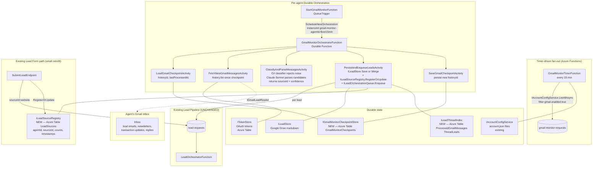
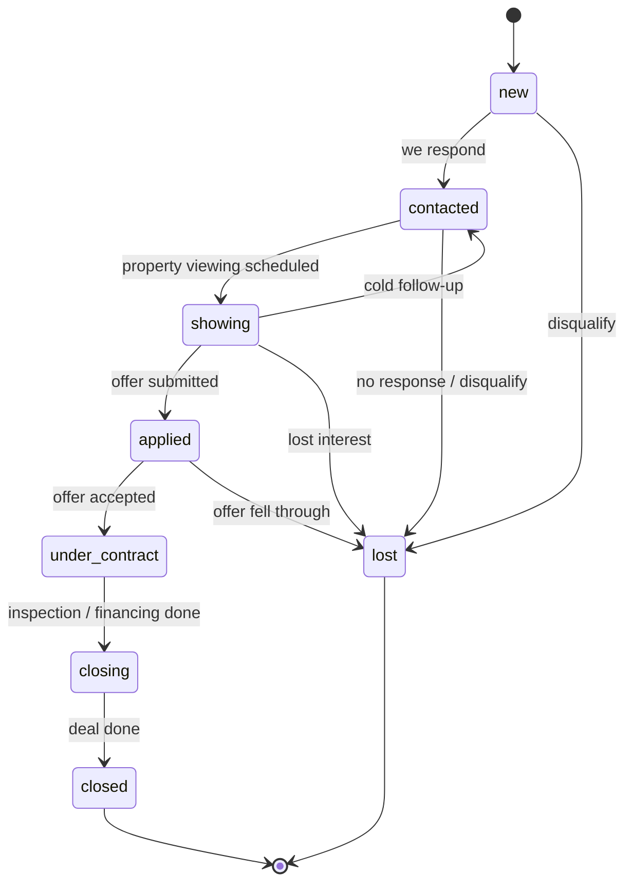
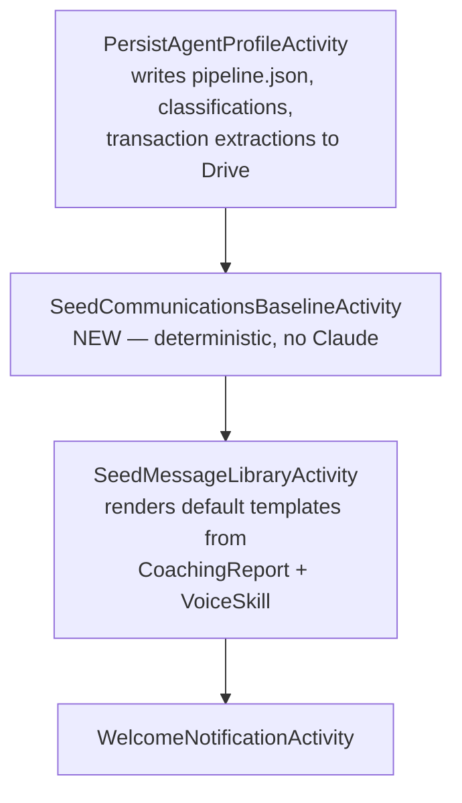

# Lead Communications Loop — Design Spec

**Date:** 2026-04-17
**Status:** Draft — expanded scope (MVP features #3 + #4 merged into one feature)
**Author:** Eddie Rosado + Claude
**Branch:** TBD (proposed: `feat/lead-communications-loop`)
**MVP Feature:** #3 + #4 of 4 combined — see [2026-04-05-activation-mvp-redesign.md](./2026-04-05-activation-mvp-redesign.md)
**Supersedes:** prior "Gmail Lead Monitoring" framing (renamed in this commit — git tracks the rename)

---

## Summary

A single scheduled loop runs every 15 min per activated agent that does **both halves of the conversation**:

- **Inbound**: reads the agent's Gmail, detects new leads from any source, detects replies on existing lead threads, merges new data into the right `Lead` record.
- **Journey inference**: after a reply, asks Claude whether the lead's position in the sales funnel advanced and which *conversational purposes* (trust-intro, commission-explanation, timeline-established, etc.) the lead has now "served" — so future sends don't repeat points the lead has already moved past.
- **Outbound**: picks the next-most-useful message for each lead based on current stage + served-purposes + available-templates, renders it through the agent's VoiceSkill + PersonalitySkill (so it sounds like Jenise, not ChatGPT), sends via Gmail, advances state.

The loop rides on infrastructure that already exists in this codebase:
- `PipelineStage` enum (`Lead → ActiveClient → UnderContract → Closed`, extended by this spec with `Dead`) — the coarse journey, already modelled in `Domain/Activation/Models/ContactEnums.cs`.
- `LeadStatus` enum — process state within our pipeline.
- `CoachingReport` + `PipelineAnalysis` + `VoiceSkill` + `PersonalitySkill` activation artifacts — the per-agent "how this agent sells" playbook, already extracted from their emails and Drive at activation time. These drive message tone and sequencing rules.
- Existing lead pipeline (`LeadOrchestratorFunction`, `ILeadStore`, `LeadPaths`) — unchanged downstream.

**What this feature replaces:** the current one-shot "form submission → CMA email → hope the lead replies" flow. After this, every lead — regardless of source — is carried through a stage-aware conversation until they convert, disqualify, or stall.

**What this feature is NOT:** a linear drip campaign. Linear drips send message N+1 regardless of whether the lead has already moved past it. This system asks "what does this lead still need to hear from us?" every cycle.

---

## Goals

1. Detect inbound leads in each activated agent's Gmail inbox with no manual intervention, regardless of source.
2. Detect replies from existing leads, infer journey-stage changes + purposes-served updates, merge new data into the existing `Lead`.
3. Maintain a per-lead `LeadJourneyState` that tracks where the lead sits in the conversation (`Unengaged → Informed → Engaged → Qualified → Converting → Client`) and a `PurposesServed` set that tracks which conversational beats the lead has moved past.
4. Select and send the next-most-useful outbound message per lead, per cycle, based on stage + purposes-served + time-since-last-contact + available templates. Render through the agent's `VoiceSkill` and `PersonalitySkill` so the message sounds like the agent.
5. Reuse the existing lead pipeline end-to-end (`ILeadStore` → `ILeadOrchestrationQueue` → `LeadOrchestratorFunction`) for new-lead onboarding (scoring, CMA, initial email). **No parallel pipeline.** This loop owns mid-conversation messaging only.
6. Maintain a **lead-source registry** — every source ever seen per agent, inventoried with counts and timestamps. Foundation for per-source journey variants, ROI reporting, and source-aware message template libraries.
7. Survive downtime — if the loop is offline for N hours, it catches up on resume without duplicates, missed leads, or duplicate outbound sends.
8. Multi-tenant fan-out: per-agent sub-orchestrations; slow/broken agents don't block the batch.
9. Preserve locale as first-class — detect `en`/`es` on the inbound email body and persist to `Lead.Locale`; render outbound messages in the lead's locale.
10. Every lead entry path (Gmail, lead-form, future channels) contributes to the same source registry and journey state machine. Lead-form submissions set `sourceId="website"` and start in `Unengaged`; Gmail-detected leads set whatever source Claude identifies.
11. Halt messaging automatically on clear disqualification or conversion signals (Claude-inferred) — never robo-spam a lead who said "not interested" or a lead who already signed.
12. Keep the outbound cadence under human agent control — the system sends on a schedule the agent implicitly controls by writing the campaign templates (activation pipeline seeds defaults derived from the agent's own `CoachingReport`). No hidden behavior.

## Non-Goals

- Gmail push notifications (Pub/Sub `watch`) — Phase 2 inside this spec's phasing.
- WhatsApp / SMS outbound in the loop — separate channel spec. This spec assumes email-only for outbound but the journey state machine is channel-agnostic; adding a channel later doesn't restructure the state machine.
- Per-source templated fast-path parsers — deferred indefinitely. Will revisit only if Claude spend at scale ($1,500+/month) justifies the maintenance cost.
- Agent-facing UI to customize journey stages, campaign templates, or thresholds — this spec assumes templates live in the agent's Drive as markdown files (generated from their activation playbook); direct edit is how customization happens for MVP.
- Real-time conversation (chat / live-chat style turnaround within minutes) — the loop runs every 15 min and is explicitly not a conversational AI replacement for the agent.
- CRM sync, Microsoft 365 / Outlook monitoring, IMAP fallback.
- Parsing non-English lead sources beyond Spanish (Portuguese, etc.) — detect only.
- Agent-in-the-loop "is this a lead?" confirmation UI — fully automated for MVP.
- Retroactive ingestion of pre-activation emails (one-time Drive import at activation already covers this).
- Tracking read-receipts or email-open signals — adds complexity + tracking-pixel ethics problems; positive-engagement signal comes from replies only.
- Automatic contract-signing state change (`Converted`) — that comes from other signals (contract-drafting feature, manual agent flip) outside the loop.

## Success Criteria

### Inbound

- [ ] A lead email from ANY source (Zillow, Realtor.com, Homes.com, Trulia, Redfin, brokerage referral, direct referral, lead-form forward, etc.) delivered to an activated agent's inbox becomes a `Lead` in `ILeadStore` within 20 min p95, 15 min p50.
- [ ] Every email-sourced lead has a non-null `SourceId` (examples: `"zillow"`, `"realtor.com"`, `"direct"`, `"brokerage"`, `"facebook"`, etc.). Source registry records `(agentId, sourceId)` with first-seen, last-seen, total-leads, conversion counters.
- [ ] Lead-form submissions at the agent website populate `SourceId="website"` and start in `LeadJourneyState.Unengaged`.
- [ ] Newsletter, transaction update, and non-lead email parse cost is $0 (classifier rejects before Claude).
- [ ] Second email on the same thread triggers ThreadEnrichment: merges new data into the existing `Lead`, appends to `Email Thread Log.md`, does NOT duplicate, does NOT re-enqueue the lead pipeline.
- [ ] A CMA-form-initiated lead whose recipient replies by email gets the reply correctly merged — the lead-form submission links the outbound CMA-delivery Gmail thread; inbound reply enriches the same Lead.
- [ ] Loop offline for 6 hours → on resume, catches up all messages since last `historyId` with zero duplicates, zero misses, zero duplicate outbound sends.

### Journey inference

- [ ] When a lead replies, Claude infers whether the journey stage advanced and which purposes-served flags flipped. Decision is logged to `Journey History.md` with reasoning.
- [ ] A lead who asks "what's your commission?" has the `commission-explanation` purpose marked as *needed* (upcoming). A lead who replies affirmatively after receiving the commission explanation has it marked *served*.
- [ ] A lead who says "not interested" / "stop emailing me" / "wrong number" → `JourneyState = Disqualified`, `haltReason = "lead-disqualified"`. No further outbound sends, ever, without manual agent override.
- [ ] A lead who says "let's meet Saturday" / "call me at 555-1234" / "I want to list my house" → `JourneyState = Converting`, outbound loop halts for that lead, agent receives WhatsApp escalation notification.
- [ ] Journey-state changes are auditable — every transition has a reasoning log entry and an OTel span.

### Outbound

- [ ] Every cycle, every active lead (not in `Converted`, `Disqualified`, or manually paused) is evaluated by the `NextMessageSelector`. When a message is due and appropriate, it sends.
- [ ] Selector never sends a message whose `requiredPriorPurposes` are not all in the lead's `PurposesServed` set. Example: never sends "introducing my process" to a lead who already received the CMA and replied to it.
- [ ] Selector never sends a message whose `validStages` does not include the lead's current `JourneyState`.
- [ ] Message rendering uses the agent's `VoiceSkill` + `PersonalitySkill` for tone; output passes a basic sanity check (length within template budget, no unrendered template variables, no references to template metadata leaking through).
- [ ] Outbound send is idempotent — `Drip State.json`'s ETag + `lastOutboundMessageAt` guarantee a message never double-sends on retry.
- [ ] An outbound send updates `PurposesServed` with the purposes that message served, updates `LastOutboundMessageAt`, and schedules `NextMessageAt` based on the message's `cooldownAfterSend` + the journey's per-stage cadence rule.
- [ ] When `NextMessageSelector` returns `null` (lead has no useful next message for their current stage), the lead's `NextMessageAt` is pushed out by the stage's idle cadence (e.g., 7 days for `Informed`, 14 days for `Engaged`) — no "dead" messages.

### Cross-cutting

- [ ] 100% branch coverage across new production code.
- [ ] All 41 architecture tests still pass.
- [ ] Every Claude call (parse, stage-inference, voice render) uses `IAnthropicClient`, not inline `HttpClient` — per the architecture rules.
- [ ] All user-facing content (outbound messages, notes, journey-log entries) carry locale.
- [ ] No PII in telemetry (hashed agentId, redacted subjects/bodies).

---

## High-Level Architecture



---

## Phased Rollout

The spec scopes the full loop (features #3 + #4 combined). Implementation is sliced into phases so the first shippable version is visible in Jenise's hands in ~2 weeks rather than 6.

### Phase 1 — Inbound + Journey Foundation + Activation Baseline (~2 weeks)

Gets the inbound half working end-to-end + the state machine + historical baseline seeded from activation. Messages are received, leads are created/merged, journey state advances based on replies — and every historical lead from the activation email corpus is pre-seeded with the correct journey stage and purposes, so day-one behavior is correct on every existing conversation. No outbound sends yet.

Deliverables:
- Timer-triggered polling every 15 min + `historyId` checkpoint (Parts A + B of prior scope).
- `ILeadThreadIndex` + `ILeadSourceRegistry` + per-lead Drive folder extensions (`Email Thread Log.md`, `Source Context.md`, `Journey History.md`, `Drip State.json`).
- Lead model extensions: `GmailThreadId`, `GmailMessageId`, `SourceId`, `SourceConfidence`, `JourneyStage`, `PurposesServed`, `Disposition`, `PausedUntil`, `HaltReason`, `HistoricalPipelineId`.
- `IDripStateStore` + `DripStateIndex` Azure Table.
- Classifier + Claude parser (single-path, two-mode: NewLead / ThreadEnrichment).
- `IStageInferrer` (Part E) — second Claude call on replies, updates DripState.
- `PipelineAnalysisWorker` extension: emits `emailMessageIds` per lead (Part I).
- `SeedCommunicationsBaselineActivity` (Part I) — zero new Claude calls, deterministically maps the existing activation synthesis (`AgentPipeline` + `EmailClassificationResult` + `ExtractedClient`) into `ILeadStore` / `ILeadThreadIndex` / `IDripStateStore` / `ILeadSourceRegistry`. Wired into the activation orchestrator between `PersistAgentProfileActivity` and `WelcomeNotificationActivity`.
- `PurposeFromClassificationMapper` — pure C# deterministic mapping (Part I).
- `IAgentPipelineWriter` + `AgentPipelineWriter` — runtime mirror so `pipeline.json` stays in sync with `LeadDripState` stage changes (the "updated continuously" contract from `AgentPipeline`'s existing doc comment).
- `SubmitLeadEndpoint` retrofit: `SourceId="website"`, seeds DripState in `New`.
- `SendLeadEmailActivity` retrofit: capture `threadId` and call `ILeadThreadIndex.LinkThreadAsync`.
- Three-layer rollout controls (Layer 1 per-account, Layer 2 env flag, Layer 3 allowlist).

**After Phase 1**: every lead (historical + newly detected) has accurate journey state, replies advance/halt correctly, agent sees full `Journey History.md` for every lead. Historical clients (`under-contract` / `closing` / `closed` / `lost`) are seeded correctly — no fake-new-lead creation when they email back. Outbound still happens via the pre-existing pipeline only.

### Phase 2 — Outbound Engine + Message Library (~2 weeks)

Adds the second half of the loop: templated outbound messaging selected by stage + purposes + signals.

Deliverables:
- `MessageTemplate` domain model + YAML frontmatter + `library.yaml` (Part C).
- `SeedMessageLibraryActivity` — activation pipeline writes the 13-template default library per agent, rendered from their CoachingReport + VoiceSkill.
- `IMessageTemplateRenderer` + `ClaudeVoicedMessageRenderer` — voice-anchor substitution via Claude with VoiceSkill/PersonalitySkill.
- `NextMessageSelector` (Part D) — deterministic, pure; extensive unit + property-based tests.
- `LeadOutboundSchedulerTimerFunction` + `OutboundLeadOrchestrator` (Part F).
- `SendAndAdvanceDripStateActivity` with pre-send idempotency check + ETag CAS.
- Observability: template-id-tagged counters + message-effectiveness event table (Part H).

**After Phase 2**: full loop operational. Jenise's leads now receive nurture messages automatically, stage-aware, agent-voiced.

### Phase 3 — Gmail push + cost optimizations (~1 week, post-MVP)

- Gmail `users.watch` + Cloud Pub/Sub topic. Same orchestrator is reused — push just enqueues the same `gmail-monitor-requests` message.
- `watch` expires every 7 days; a daily timer renews watches.
- Polling stays as 15-min fallback safety net.
- Per-template effectiveness dashboard goes live (30d data minimum).

### Phase 4 — Post-MVP quality

- Multi-language template expansion (PT, additional ES dialects).
- Per-agent learning loop: adjust template priorities based on effectiveness data.
- Portal UI for editing templates (eliminates direct-Drive-edit friction).
- Portal UI for manually re-queuing missed emails as leads.
- `referral-ask` purpose activates (closing/closed leads).
- Template A/B testing framework.

---

## Part B — Journey State Machine

The Communications Loop's central abstraction. Every `Lead` has a position in a stage-aware journey; every outbound message is selected to match where the lead sits and what they've already moved past.

### Stages — reuse `PipelineAnalysisWorker.ValidStages`

The stages are NOT new vocabulary. They are exactly the stages the activation pipeline already uses (`apps/api/RealEstateStar.Workers/Activation/RealEstateStar.Workers.Activation.PipelineAnalysis/PipelineAnalysisWorker.cs`) to classify a lead's position in each agent's actual email history:



**Active stages** (Communications Loop CAN message): `new`, `contacted`, `showing`, `applied`
**Silent stages** (Loop does NOT message — agent owns the conversation directly): `under-contract`, `closing`, `closed`
**Terminal** (never message again without manual agent override): `lost`

The split is deliberate. Once a lead is `under-contract` or beyond, every message has real financial/legal implications and must come from the agent personally. Automating at that stage is dangerous.

Note the mapping between this enum and the existing coarse `PipelineStage` enum (`Domain/Activation/Models/ContactEnums.cs`):

| `LeadJourneyStage` (this spec) | Coarse `PipelineStage` (existing) |
|---|---|
| `new`, `contacted` | `Lead` |
| `showing`, `applied` | `ActiveClient` |
| `under-contract`, `closing` | `UnderContract` |
| `closed` | `Closed` |
| `lost` | `Dead` (new enum value — see below) |

**`PipelineStage` enum extension (decision locked):** Add a `Dead` value to `PipelineStage` rather than overloading `Lead` with a substate flag. Reasons:
- Reporting / dashboard tiles need to exclude disqualified leads from funnel counts — a distinct coarse value is cleaner than every caller having to check a sub-flag.
- `PipelineQueryService` (WhatsApp fast-path) already filters on `PipelineStage`; adding a tombstone value is a one-line switch case.
- `ImportedContact` records already have `PipelineStage` as a required field — the enum addition is additive; existing serialized data with the 4 current values still deserializes correctly.

Migration for existing `ImportedContact` records: none required — `Dead` is a new value only emitted going forward. Existing "Lost" leads (currently `Lead` with soft classification) stay as `Lead` until re-seeded by the Communications Loop baseline.

The fine stage goes on `Lead.JourneyStage` (new field). The coarse `PipelineStage` remains for reporting + existing `ImportedContact` records; a domain service (`StageMapper.CoarseFromFine`) derives coarse from fine on persist.

### StageMapper — fine ↔ coarse ↔ string translation

The spec uses three representations of the same concept:

1. **String** — the lowercase-hyphenated values emitted by `PipelineAnalysisWorker.ValidStages` (`string[]` of `"new"`, `"contacted"`, `"showing"`, `"applied"`, `"under-contract"`, `"closing"`, `"closed"`, `"lost"`). Persisted in `AgentPipeline.json`.
2. **Fine enum** — `LeadJourneyStage` (PascalCase). Persisted in `Lead.JourneyStage` + `LeadDripState.JourneyStage`.
3. **Coarse enum** — `PipelineStage` (existing). Persisted in `ImportedContact`, read by reporting.

`RealEstateStar.Domain/Leads/Models/StageMapper.cs` — pure static class:

```csharp
public static class StageMapper
{
    private static readonly IReadOnlyDictionary<string, LeadJourneyStage> StringToFine =
        new Dictionary<string, LeadJourneyStage>(StringComparer.OrdinalIgnoreCase)
        {
            ["new"]            = LeadJourneyStage.New,
            ["contacted"]      = LeadJourneyStage.Contacted,
            ["showing"]        = LeadJourneyStage.Showing,
            ["applied"]        = LeadJourneyStage.Applied,
            ["under-contract"] = LeadJourneyStage.UnderContract,
            ["closing"]        = LeadJourneyStage.Closing,
            ["closed"]         = LeadJourneyStage.Closed,
            ["lost"]           = LeadJourneyStage.Lost,
        };

    public static LeadJourneyStage FromPipelineString(string value) =>
        StringToFine.TryGetValue(value, out var stage)
            ? stage
            : throw new ArgumentException($"[StageMapper] Unknown stage: {value}", nameof(value));

    public static string ToPipelineString(LeadJourneyStage stage) => stage switch
    {
        LeadJourneyStage.New           => "new",
        LeadJourneyStage.Contacted     => "contacted",
        LeadJourneyStage.Showing       => "showing",
        LeadJourneyStage.Applied       => "applied",
        LeadJourneyStage.UnderContract => "under-contract",
        LeadJourneyStage.Closing       => "closing",
        LeadJourneyStage.Closed        => "closed",
        LeadJourneyStage.Lost          => "lost",
        _ => throw new ArgumentOutOfRangeException(nameof(stage)),
    };

    public static PipelineStage CoarseFromFine(LeadJourneyStage stage) => stage switch
    {
        LeadJourneyStage.New or LeadJourneyStage.Contacted              => PipelineStage.Lead,
        LeadJourneyStage.Showing or LeadJourneyStage.Applied            => PipelineStage.ActiveClient,
        LeadJourneyStage.UnderContract or LeadJourneyStage.Closing      => PipelineStage.UnderContract,
        LeadJourneyStage.Closed                                          => PipelineStage.Closed,
        LeadJourneyStage.Lost                                            => PipelineStage.Dead,
        _ => throw new ArgumentOutOfRangeException(nameof(stage)),
    };
}
```

Unit-tested with round-trip + exhaustive enum-value test (fails at compile-time if `LeadJourneyStage` gains a value without a corresponding mapping). Used by `SeedCommunicationsBaselineActivity` (read path), `IAgentPipelineWriter` (write path), and `ImportedContact` persistence.

### `Lead.cs` extensions for the journey

```csharp
// RealEstateStar.Domain/Leads/Models/Lead.cs — additional fields
public LeadJourneyStage JourneyStage { get; init; } = LeadJourneyStage.New;
public IReadOnlySet<string> PurposesServed { get; init; } = new HashSet<string>();
public DateTime? LastInboundMessageAt { get; init; }
public DateTime? LastOutboundMessageAt { get; init; }
public int InboundMessageCount { get; init; }
public int OutboundMessageCount { get; init; }
public LeadJourneyDisposition Disposition { get; init; } = LeadJourneyDisposition.Active;
public DateTime? PausedUntil { get; init; }
public string? HaltReason { get; init; }  // "lead-disqualified" | "converted" | "manual-override" | null
```

```csharp
// RealEstateStar.Domain/Leads/Models/LeadJourneyStage.cs
[JsonConverter(typeof(JsonStringEnumConverter))]
public enum LeadJourneyStage
{
    New,           // Received but not yet contacted by agent
    Contacted,     // Initial response sent; awaiting lead engagement
    Showing,       // Property viewings active
    Applied,       // Offer submitted
    UnderContract, // Offer accepted — silent
    Closing,       // Inspection/financing in progress — silent
    Closed,        // Deal done — silent
    Lost,          // Disqualified — terminal, never message
}

// RealEstateStar.Domain/Leads/Models/LeadJourneyDisposition.cs
[JsonConverter(typeof(JsonStringEnumConverter))]
public enum LeadJourneyDisposition
{
    Active,      // Normal — loop can evaluate
    Paused,      // Recent reply — halt outbound until PausedUntil
    Escalated,   // Agent takeover required (e.g., "let's meet Saturday")
    Halted,      // Terminal halt — see HaltReason
}
```

The `Disposition` axis is orthogonal to `JourneyStage`. A lead can be `Contacted` + `Active` (loop evaluates normally) or `Contacted` + `Paused` (they replied yesterday, we wait) or `Contacted` + `Escalated` (they said "call me today" — agent owns it) or `Contacted` + `Halted` (they said "not interested").

### `Drip State.json` — per-lead authoritative state file

Lives in the per-lead Drive folder (see Google Drive section earlier in spec). Schema:

```jsonc
{
  "schemaVersion": 1,
  "leadId": "...",
  "agentId": "...",
  "journeyStage": "contacted",
  "disposition": "active",
  "purposesServed": [
    { "id": "initial-response", "servedAt": "2026-04-17T12:00:00Z", "via": "outbound-email", "messageId": "..." },
    { "id": "intro-value-prop", "servedAt": "2026-04-17T12:00:00Z", "via": "outbound-email", "messageId": "..." },
    { "id": "cma-delivered", "servedAt": "2026-04-17T12:05:00Z", "via": "pipeline-cma", "messageId": "..." }
  ],
  "purposesNeeded": [
    { "id": "objection-price", "reason": "lead asked about commission", "priority": 1, "detectedAt": "2026-04-18T09:14:00Z" }
  ],
  "nextEvaluationAt": "2026-04-21T14:00:00Z",
  "lastOutboundMessageAt": "2026-04-17T12:05:00Z",
  "lastInboundMessageAt": "2026-04-18T09:14:00Z",
  "pausedUntil": "2026-04-20T09:14:00Z",
  "haltReason": null,
  "escalationReason": null,
  "messageHistory": [
    { "direction": "outbound", "sentAt": "2026-04-17T12:00:00Z", "templateId": "initial-response-buyer", "purposesServed": ["initial-response","intro-value-prop"], "gmailMessageId": "...", "gmailThreadId": "..." },
    { "direction": "outbound", "sentAt": "2026-04-17T12:05:00Z", "templateId": "cma-delivery", "purposesServed": ["cma-delivered"], "gmailMessageId": "...", "gmailThreadId": "..." },
    { "direction": "inbound", "receivedAt": "2026-04-18T09:14:00Z", "gmailMessageId": "...", "gmailThreadId": "...", "triggeredPurposesNeeded": ["objection-price"], "stageAdvance": null }
  ],
  "lastModifiedBy": "outbound-orchestrator",  // | "inbound-orchestrator" | "agent-override"
  "lastModifiedAt": "2026-04-18T09:14:00Z",
  "etag": "W/\"abc123\""
}
```

**ETag-protected compare-and-swap on every write.** `IDripStateStore.SaveIfUnchangedAsync(state, etag, ct)` returns `false` if another actor (inbound orchestrator mid-flight, agent UI, etc.) wrote first; caller re-reads + re-applies. Same pattern as `IAccountConfigService` (established in PR #157).

### `IDripStateStore` — Domain interface

```csharp
// RealEstateStar.Domain/Leads/Interfaces/IDripStateStore.cs
public interface IDripStateStore
{
    Task<LeadDripState?> GetAsync(string agentId, Guid leadId, CancellationToken ct);
    Task<IReadOnlyList<LeadDripState>> ListDueForEvaluationAsync(
        string agentId, DateTime asOf, CancellationToken ct);
    Task SaveNewAsync(LeadDripState state, CancellationToken ct);
    Task<bool> SaveIfUnchangedAsync(LeadDripState state, string etag, CancellationToken ct);
}
```

Implementation `AzureBlobDripStateStore` writes to the agent's Drive (via `IDocumentStorageProvider`) with a blob-level ETag for CAS. `ListDueForEvaluationAsync` uses a secondary Azure Table index (`DripStateIndex` keyed by `(agentId, nextEvaluationAt)`) for efficient "who's due?" queries without scanning all Drive files.

### Journey History file

Appended every time Claude infers a stage advance or purpose change. Human-readable audit log. Path: `Real Estate Star/1 - Leads/{Name}/Journey History.md`.

```markdown
# Journey History — {Lead Full Name}

## 2026-04-17 12:00 UTC — Lead created
Source: zillow
Initial stage: new
Initial purposes served: (none)

## 2026-04-17 12:05 UTC — Outbound: initial-response + intro-value-prop
Template: initial-response-buyer
Purposes served: initial-response, intro-value-prop
Stage advance: new → contacted

## 2026-04-17 12:05 UTC — Outbound: cma-delivered
Template: cma-delivery
Purposes served: cma-delivered

## 2026-04-18 09:14 UTC — Inbound reply detected
Gmail thread: 19abc...
Claude stage inference: no advance (still contacted)
Claude purpose inference:
  - Lead asked about commission → purpose `objection-price` needed (priority 1)
Disposition: active → paused (48h cooldown after reply)
```

This file is written by **both** the inbound orchestrator (on reply) and the outbound orchestrator (on send). `LastModifiedBy` on `DripState` disambiguates.

---

## Part C — Message Library

Each outbound message is a **template** (structured markdown) tagged with metadata that the selector uses to decide fit. Templates live in the agent's own Drive — seeded at activation from the agent's playbook, editable by the agent (optional for MVP — direct markdown edit is the customization path).

### Template file layout

```
Real Estate Star/
  {agentId}/
    Campaigns/
      library.yaml              ← index: list of templates + default ordering per stage
      initial-response-buyer.md
      initial-response-seller.md
      intro-value-prop.md
      cma-delivery.md
      timeline-check-in.md
      motivation-probe.md
      objection-timing.md
      objection-competition.md
      showing-scheduled.md
      post-showing-followup.md
      application-prep.md
      re-engagement-7d.md
      re-engagement-21d.md
      referral-ask.md
```

Each `.md` file has YAML frontmatter with the template metadata + the body rendered through the agent's voice:

```markdown
---
templateId: initial-response-buyer
version: 1
purposesServed:
  - initial-response
  - intro-value-prop
requiredPriorPurposes: []
validStages:
  - new
locales:
  - en
  - es
cooldownAfterSend: P2D         # ISO-8601 duration — "after sending, do not evaluate next message for 2 days"
priority: 100                   # higher fires first in selector tie-breaks
variables:
  - leadFirstName
  - propertyCity
  - agentFirstName
leadTypeFilter: Buyer           # Buyer | Seller | Both | (omit = any)
---

Hi {{leadFirstName}},

{{agentFirstName}} here — thanks for reaching out about homes in {{propertyCity}}.
{{voiceAnchor:warm_welcome_buyer}}

A couple of quick questions so I can actually help:
- What's your timeline for moving?
- Have you been pre-approved with a lender yet?

{{voiceAnchor:cta_reply_soon}}

— {{agentFirstName}}
```

### Template metadata (domain model)

```csharp
// RealEstateStar.Domain/Leads/Models/MessageTemplate.cs
public sealed record MessageTemplate(
    string TemplateId,                         // "initial-response-buyer"
    int Version,
    IReadOnlySet<string> PurposesServed,       // purposes this message delivers
    IReadOnlySet<string> RequiredPriorPurposes,// prereqs that must be served before this fires
    IReadOnlySet<LeadJourneyStage> ValidStages,// stages this message is appropriate for
    IReadOnlySet<string> Locales,              // en, es
    TimeSpan CooldownAfterSend,                // how long before next evaluation
    int Priority,                              // higher fires first on tie-breaks
    IReadOnlyList<string> Variables,           // required render variables
    LeadTypeFilter LeadTypeFilter,             // Buyer | Seller | Both | Any
    string BodyMarkdown,                       // raw body with {{placeholders}}
    string SourcePath,                         // blob/Drive path for audit
    string ETag);

public enum LeadTypeFilter { Any, Buyer, Seller, Both }
```

### Purpose taxonomy (v1 — grounded in `CoachingWorker` and `PipelineAnalysisWorker`)

Derived from what the activation pipeline already extracts about each agent's playbook. Will evolve as we see real lead traffic. **Versioned** in this spec so rev 2 is a normal spec update, not a rewrite.

| Purpose ID | Maps to Coaching gap | Valid stages | Required prior | Triggers (signal) |
|---|---|---|---|---|
| `initial-response` | Response time | new | — | time-based (fires on Lead creation) |
| `intro-value-prop` | Lifecycle coverage | new, contacted | `initial-response` | time-based |
| `cma-delivered` | Lifecycle coverage | contacted, showing | `initial-response` | seller signal detected OR form-initiated |
| `timeline-check-in` | Follow-up cadence | contacted, showing | `intro-value-prop` | time-based (7d after last outbound) |
| `motivation-probe` | Personalization | contacted, showing | `intro-value-prop` | time-based (parallel to timeline-check-in) |
| `objection-price` | **Escalation (no template)** | — | — | signal-triggered: lead mentions commission/price → `Disposition = Escalated`, notify agent; loop does NOT auto-respond |
| `fee-discussed-historically` | **Read-only marker** | — | — | set by baseline seeding when agent's historical outbound had `FeeRelated` classification. Informs future escalations — if a lead asks about fees again and the agent already handled it in history, the escalation notification can highlight that |
| `objection-timing` | Objection handling | contacted, showing | — | signal-triggered: lead mentions "not ready yet" |
| `objection-competition` | Objection handling | contacted, showing | — | signal-triggered: lead mentions another agent |
| `showing-scheduled` | Lifecycle coverage | showing | `cma-delivered` OR `motivation-probe` | signal-triggered: viewing confirmed |
| `post-showing-followup` | Follow-up cadence | showing | `showing-scheduled` | time-based (24h after viewing) |
| `application-prep` | Lifecycle coverage | applied | `motivation-probe` | signal-triggered: stage advanced to applied |
| `re-engagement` | Nurturing gaps | any active | `intro-value-prop` | time-based (idle >7d in new/contacted, >14d in showing/applied) |
| `referral-ask` | — | closing, closed | — | reserved — post-MVP |

**Purposes are strings, not an enum**, for the same reason `SourceId` is a string — Claude can infer new purposes from emails (e.g., `"financing-concern"`, `"school-district-question"`) and they get added to the taxonomy file without a code change. The list above is the seed set the activation pipeline generates by default.

### Voice rendering — `IMessageTemplateRenderer`

The template body contains two kinds of placeholders:

1. **Variables** (`{{leadFirstName}}`) — substituted from `Lead` + `AccountConfig` data.
2. **Voice anchors** (`{{voiceAnchor:warm_welcome_buyer}}`) — substituted by re-prompting Claude with the agent's `VoiceSkill.md` + `PersonalitySkill.md` + `Marketing Style.md` at the specified voice-anchor ID.

   **Explicitly excluded from renderer inputs**: `Fee Structure.md` and `CMA Style Guide.md`. Fee content is off-limits for automated outbound (per product decision — fee/commission conversations escalate to the agent); CMA content is used by the CMA PDF generator, not by outbound messages.

```csharp
// RealEstateStar.Domain/Leads/Interfaces/IMessageTemplateRenderer.cs
public interface IMessageTemplateRenderer
{
    Task<RenderedMessage> RenderAsync(
        MessageTemplate template,
        Lead lead,
        AccountConfig account,
        AgentContext agentContext,  // provides VoiceSkill, PersonalitySkill per locale
        CancellationToken ct);
}

public sealed record RenderedMessage(
    string Subject,
    string BodyText,          // plain text for Gmail
    string BodyHtml,          // rendered HTML variant
    IReadOnlySet<string> PurposesServed,  // echoed from template for DripState update
    decimal VoiceFidelityScore,  // optional Claude self-assessment 0..1
    string RenderAuditHash);   // sha256 of (templateId + lead inputs) for idempotency
```

Implementation `ClaudeVoicedMessageRenderer` in `RealEstateStar.Workers.Leads`:

1. Substitute deterministic variables first (`{{leadFirstName}}`).
2. For each `{{voiceAnchor:X}}` placeholder, make a bounded Claude call:
   - System prompt: `VoiceSkill.md` + `PersonalitySkill.md` + `Marketing Style.md` contents for the locale, plus the voice-anchor catalog mapping (`warm_welcome_buyer` → "greet the lead warmly, match energy to their apparent buying/selling context, use agent catchphrases where natural"). Renderer MUST NOT receive `Fee Structure.md` (feature-flagged guard: renderer rejects if Fee Structure content is detected in prompt assembly).
   - User prompt: what the anchor needs to produce (1–3 sentences typically) + the surrounding context.
   - Validate: output length within the anchor's character budget; no unrendered placeholders; no URLs/links the template didn't include.
3. Assemble final subject + body; compute audit hash.
4. `VoiceFidelityScore` is an optional second Claude call ("Does this sound like the agent, given their VoiceSkill?") — feature-flagged; off by default to save cost.

**Cost guardrails:**
- Template body with N voice anchors → N+0 or N+1 Claude calls per send (plus 1 for fidelity score if enabled).
- Budget: templates limited to ≤3 voice anchors (static validation at load time). Typical send = 2–3 Claude calls = ~$0.03–0.05 per outbound.
- Activation defaults ship with ≤2 voice anchors per template to keep cost closer to $0.02.

### Template seeding at activation

When the activation pipeline runs for a new agent, `AgentProfilePersistActivity` seeds the default template library by rendering the agent's `CoachingReport.md` + `PipelineAnalysis.md` + `VoiceSkill.md` into a starter set of templates.

New activity `SeedMessageLibraryActivity`:
- Input: `{accountId, agentId, coachingReportMarkdown, pipelineAnalysisMarkdown, voiceSkillMarkdown, personalitySkillMarkdown, locale}`.
- Output: writes `Campaigns/*.md` + `Campaigns/library.yaml` to the agent's Drive via `IDocumentStorageProvider`.
- Uses `IAnthropicClient` for a one-shot render: Claude is prompted with the coaching/voice skill content + the 13-purpose catalog above and produces agent-voiced templates.
- Idempotent via file existence check — only runs on activation (not on re-activation that already has templates).

This activity is added to the activation orchestrator between `PersistProfileActivity` and `WelcomeNotificationActivity`.

**Note on activity-count rules:** The "orchestrators call at most 5–6 activities" rule from CLAUDE.md applies to the *lead* and *site-content* orchestrators — small, focused ones. The activation orchestrator (`ActivationOrchestratorFunction.cs`) already dispatches 26+ activities and is architected differently (it's the coordination hub for the entire activation pipeline, which has dozens of synthesis steps). Adding `SeedMessageLibraryActivity` and `SeedCommunicationsBaselineActivity` here does NOT violate any rule — the activation orchestrator has always been allowed to be large.

### `library.yaml` — template registry

Generated by `SeedMessageLibraryActivity`. Machine-readable index of what's available + stage-default sequencing (used by `NextMessageSelector` — Part D).

```yaml
schemaVersion: 1
agentId: jenise
locales: [en, es]
stageDefaults:
  new:
    - initial-response-buyer
    - initial-response-seller
  contacted:
    - intro-value-prop
    - cma-delivery
    - motivation-probe
    - timeline-check-in
    - re-engagement-7d
  showing:
    - post-showing-followup
    - showing-scheduled
    - re-engagement-14d
  applied:
    - application-prep
templates:
  - id: initial-response-buyer
    file: initial-response-buyer.md
    priority: 100
  - id: cma-delivery
    file: cma-delivery.md
    priority: 90
  # ...
```

**Agents customize** by editing the markdown files directly in Drive — the system re-reads on every cycle (cached with mtime for efficiency). No platform UI in MVP.

---

## Detailed Component Design

### New Domain Interfaces (RealEstateStar.Domain — ZERO deps)

All interfaces live in `RealEstateStar.Domain` per the architecture rules. Implementations land in `Clients.Gmail`, `Clients.Azure`, `Workers.Leads`, or `Api` per boundary rules.

```csharp
// RealEstateStar.Domain/Leads/Interfaces/IGmailLeadReader.cs
// Extends the Gmail client surface with history-based incremental read.
// Implementation: RealEstateStar.Clients.Gmail.GmailLeadReader (new file).
public interface IGmailLeadReader
{
    /// <summary>Fetches messages in the inbox since <paramref name="sinceHistoryId"/>.</summary>
    /// <remarks>When sinceHistoryId is null (cold start), fetches the most recent N.</remarks>
    Task<GmailHistorySlice> GetHistoryAsync(
        string accountId, string agentId,
        string? sinceHistoryId, int maxResults, CancellationToken ct);
}

public sealed record GmailHistorySlice(
    string NewHistoryId,
    IReadOnlyList<InboundGmailMessage> Messages,
    bool HistoryExpired);   // true when Gmail returns 404 historyNotFound → rebaseline

public sealed record InboundGmailMessage(
    string MessageId,        // Gmail message id
    string ThreadId,         // Gmail thread id
    string From,             // raw From header
    string[] To,
    string Subject,
    string Body,             // plain text, HTML stripped (reuse GmailReaderClient.ExtractBody)
    DateTime ReceivedAt,
    string? InReplyTo,       // message-id of parent, if any
    IReadOnlyList<string> Labels);
```

```csharp
// RealEstateStar.Domain/Leads/Interfaces/IGmailMonitorCheckpointStore.cs
public interface IGmailMonitorCheckpointStore
{
    Task<GmailMonitorCheckpoint?> GetAsync(string accountId, string agentId, CancellationToken ct);
    Task SaveAsync(GmailMonitorCheckpoint checkpoint, CancellationToken ct);
}

public sealed record GmailMonitorCheckpoint(
    string AccountId,
    string AgentId,
    string? LastHistoryId,
    DateTime LastProcessedAt,
    int ConsecutiveOAuthFailures,
    DateTime? DisabledUntil,
    string ETag);
```

```csharp
// RealEstateStar.Domain/Leads/Interfaces/ILeadEmailParser.cs
// Single-path parser. Implementation: RealEstateStar.Workers.Leads.ClaudeLeadEmailParser.
// Q3 resolved: no per-source regex fast-path. Coverage > cost optimization for MVP.
public interface ILeadEmailParser
{
    Task<ParsedLeadEmail?> TryParseAsync(
        InboundGmailMessage message,
        string agentId,
        CancellationToken ct);
}

public sealed record ParsedLeadEmail(
    ParseMode Mode,               // NewLead | ThreadEnrichment — dispatched by orchestrator on thread lookup
    string SourceId,              // Claude-classified, open-ended; examples below
    decimal SourceConfidence,     // 0..1 — how sure Claude is about the sourceId
    LeadType LeadType,            // existing enum Buyer/Seller/Both/Unknown
    // Fields below are nullable in ThreadEnrichment mode — only populated when the
    // reply actually carries new data. NewLead mode requires at minimum firstName +
    // (email OR phone) to pass parseConfidence ≥ 0.7.
    string? FirstName,
    string? LastName,
    string? Email,
    string? Phone,
    string? Timeline,
    SellerDetails? SellerDetails,
    BuyerDetails? BuyerDetails,
    string? Notes,                // for ThreadEnrichment: "reply note" to append, not overwrite
    string Locale,                // en | es
    decimal ParseConfidence,      // 0..1 — overall parse quality
    string ParserUsed);           // "claude-sonnet-4-6" — tracked for observability

public enum ParseMode
{
    NewLead,           // No existing Lead on this Gmail thread — classifier must accept
    ThreadEnrichment,  // Existing Lead on this thread — bypass classifier, merge deltas
}

// SourceId is a string, not an enum, to support the open-ended registry.
// Canonical values Claude is prompted to emit when it recognizes a source:
//   "zillow" | "realtor.com" | "homes.com" | "trulia" | "redfin"
//   "facebook" | "instagram" | "google-ads"
//   "brokerage" (for forwarded brokerage leads without a specific platform)
//   "direct" (human-written referral from friend/family/network)
//   "website" (lead-form submission — NOT set by Gmail; set by SubmitLeadEndpoint)
// Unknown senders get Claude's best guess. Registry tracks whatever it sees.
```

```csharp
// RealEstateStar.Domain/Leads/Interfaces/ILeadEmailClassifier.cs
public interface ILeadEmailClassifier
{
    LeadEmailClassification Classify(InboundGmailMessage message);
}

public sealed record LeadEmailClassification(
    bool IsCandidate,
    LeadSource LikelySource,
    string Reason);
```

```csharp
// RealEstateStar.Domain/Leads/Interfaces/ILeadThreadIndex.cs
public interface ILeadThreadIndex
{
    Task<Lead?> GetByThreadIdAsync(string agentId, string gmailThreadId, CancellationToken ct);
    Task LinkThreadAsync(string agentId, Guid leadId, string gmailThreadId, string messageId, CancellationToken ct);
    Task<bool> HasProcessedMessageAsync(string agentId, string gmailMessageId, CancellationToken ct);
    Task MarkMessageProcessedAsync(string agentId, string gmailMessageId, Guid leadId, CancellationToken ct);
}
```

```csharp
// RealEstateStar.Domain/Leads/Interfaces/ILeadSourceRegistry.cs
// Per-agent inventory of every lead source ever observed.
// Foundation for source-aware drip campaigns (feature #4) and ROI reporting.
// Called by: Gmail monitor (every Gmail-detected lead), SubmitLeadEndpoint (every form submission),
// future channels (WhatsApp, SMS, etc.).
public interface ILeadSourceRegistry
{
    /// <summary>
    /// Idempotent upsert. Creates the source entry if new, otherwise increments counters.
    /// Safe to call from activity function retries — all updates are atomic increments.
    /// </summary>
    Task RegisterOrUpdateAsync(
        string agentId,
        string sourceId,
        LeadSourceObservation observation,
        CancellationToken ct);

    Task<LeadSourceEntry?> GetAsync(string agentId, string sourceId, CancellationToken ct);

    Task<IReadOnlyList<LeadSourceEntry>> GetAllForAgentAsync(string agentId, CancellationToken ct);
}

public sealed record LeadSourceObservation(
    Guid LeadId,
    DateTime ObservedAt,
    decimal SourceConfidence,
    string? OriginChannel);       // "gmail" | "website" | "whatsapp" (future) — how the system found this lead

public sealed record LeadSourceEntry(
    string AgentId,
    string SourceId,              // "zillow", "direct", "website", etc.
    string DisplayName,           // "Zillow", "Direct Referral", "Website Form" — human-friendly
    DateTime FirstSeenAt,
    DateTime LastSeenAt,
    int TotalLeads,
    int ConvertedLeads,           // updated elsewhere when lead closes — nullable/zero until set
    string ETag);
```

### Lead model extension

`RealEstateStar.Domain/Leads/Models/Lead.cs` gains four init-only fields (non-breaking — nullable):

```csharp
public string? GmailThreadId { get; init; }     // Gmail thread dedup key (null for non-Gmail leads)
public string? GmailMessageId { get; init; }    // first Gmail message that created this lead
public string? SourceId { get; init; }          // registry key — "zillow", "website", "direct", etc.
public decimal? SourceConfidence { get; init; } // Claude's confidence in the sourceId (null for deterministic entries like "website")
```

`LeadMarkdownRenderer` adds all four to YAML frontmatter. Roundtrip tests required per `code-quality.md`. YAML injection tests required per same.

### Existing `SubmitLeadEndpoint` retrofit

`apps/api/RealEstateStar.Api/Features/Leads/Submit/SubmitLeadEndpoint.cs`: populate `SourceId = "website"` on the `Lead` written through `ILeadStore.SaveAsync`, and call `ILeadSourceRegistry.RegisterOrUpdateAsync(agentId, "website", ...)` alongside. This is the only change needed to make lead-form submissions contribute to the source registry.

### Existing CMA-email-delivery retrofit — critical for thread enrichment

The lead pipeline already sends CMA PDFs to the lead via the agent's Gmail (`GmailSender` in `Clients.Gmail`). When we send that outbound email, we **must capture the resulting Gmail `threadId` and link it into `ILeadThreadIndex`** so that when the lead replies, our Gmail monitor can find the Lead on that thread and route to ThreadEnrichment mode.

Change required in `SendLeadEmailActivity` (or wherever the CMA delivery call is wired):

1. After `GmailSender.SendAsync(...)` returns, capture the `threadId` from the response (Gmail's send API returns the created message with its `threadId`).
2. Call `ILeadThreadIndex.LinkThreadAsync(agentId, leadId, threadId, sentMessageId)`.

Without this step, a lead's reply to our CMA email would be treated as a NewLead by the classifier and potentially create a duplicate Lead record. This is the plumbing that makes the "CMA-form reply lands correctly" success criterion work.

`GmailSender` likely doesn't currently return the `threadId` — check its interface and, if needed, extend `IGmailSender.SendAsync` to return `SentMessageRef { MessageId, ThreadId }` so callers can persist the linkage.

### Activity function signatures

All activities live under `RealEstateStar.Functions/Leads/GmailMonitor/`.

| Activity | Input | Output | FATAL/BEST-EFFORT | Retry Policy |
|---|---|---|---|---|
| `LoadGmailCheckpointActivity` | `{accountId, agentId, correlationId}` | `GmailMonitorCheckpoint?` | FATAL | `Standard` |
| `FetchNewGmailMessagesActivity` | `{accountId, agentId, sinceHistoryId, maxResults, correlationId}` | `GmailHistorySlice` | FATAL | `GmailRead` |
| `ClassifyAndParseMessagesActivity` | `{messages, agentId, correlationId}` | `{parsed, skipped}` | BEST-EFFORT per-message (one bad email cannot fail the batch) | `Parse` |
| `PersistAndEnqueueLeadsActivity` | `{parsed, agentId, accountId, messages, correlationId}` | `{created, merged, enqueued, sourcesRegistered}` | FATAL (idempotent via `ILeadThreadIndex.HasProcessedMessageAsync` + `ILeadSourceRegistry` atomic increment) | `Persist` |
| `SaveGmailCheckpointActivity` | `{checkpoint}` | void | FATAL | `Standard` |

**`PersistAndEnqueueLeadsActivity` write sequence** (idempotent — every step safe to retry):

1. For each `ParsedLeadEmail`:
   - **Message-level idempotency**: skip if `ILeadThreadIndex.HasProcessedMessageAsync(agentId, gmailMessageId)` returns true.
   - Branch on `Mode`:
     - **`NewLead` mode**:
       - Apply NewLead threshold: skip entirely if `parseConfidence < 0.4`; log to `gmail_monitor.uncertain_parses` if `0.4 ≤ parseConfidence < 0.7`; proceed if `≥ 0.7`.
       - `ILeadStore.SaveAsync` with `SourceId`, `SourceConfidence`, `GmailThreadId`, `GmailMessageId` populated.
       - `ILeadStore.WriteSourceContextAsync(agentId, leadId, snapshot)` — writes the verbatim first email to `Source Context.md`.
       - `ILeadStore.AppendEmailThreadLogAsync(agentId, leadId, entry)` — first entry in `Email Thread Log.md`.
       - `ILeadThreadIndex.LinkThreadAsync(agentId, leadId, gmailThreadId, gmailMessageId)`.
       - `ILeadSourceRegistry.RegisterOrUpdateAsync(agentId, sourceId, observation)` — idempotent upsert.
       - Enqueue `lead-requests` via `ILeadOrchestrationQueue` (runs CMA + email draft + notifications).
     - **`ThreadEnrichment` mode**:
       - Apply ThreadEnrichment threshold: if `parseConfidence < 0.5`, only append to thread log and return.
       - Merge non-null fields into the existing Lead via `ILeadStore.MergeFromEnrichmentAsync(agentId, leadId, enrichment)` — new method added below.
       - `ILeadStore.AppendEmailThreadLogAsync(agentId, leadId, entry)`.
       - **Do NOT re-enqueue** `lead-requests`. The lead is mid-conversation; re-running CMA + re-sending email would be wrong.
2. Mark every processed messageId via `ILeadThreadIndex.MarkMessageProcessedAsync`.
3. `ILeadSourceRegistry` counter increments are atomic — duplicate retry calls pass the same `leadId`, and the registry deduplicates by `(agentId, sourceId, leadId)` tuple.

**New `ILeadStore` method for enrichment merge:**

```csharp
// RealEstateStar.Domain/Leads/Interfaces/ILeadStore.cs — additional method
Task MergeFromEnrichmentAsync(
    string agentId,
    Guid leadId,
    LeadEnrichmentDelta delta,
    CancellationToken ct);

public sealed record LeadEnrichmentDelta(
    string? Phone,                // overwrite if existing is empty, else append to notes
    string? Email,                // same rule as phone
    string? Timeline,             // always overwrites (timeline is a current-state field)
    LeadType? LeadTypeUpdate,     // e.g. Buyer → Both when reply reveals dual intent
    BuyerDetails? BuyerDetailsPatch,
    SellerDetails? SellerDetailsPatch,
    string? ReplyNote,            // appended to lead's notes section with timestamp
    DateTime EnrichedAt);
```

Implementation in `LeadFileStore` does field-level merge on the `Lead Profile.md` YAML frontmatter, preserving prior data. A deterministic merge policy (empty → fill; non-empty → append to notes) avoids losing existing information.

### Orchestrator skeleton

```csharp
[Function("GmailMonitorOrchestrator")]
public static async Task RunOrchestrator([OrchestrationTrigger] TaskOrchestrationContext ctx)
{
    var input = ctx.GetInput<GmailMonitorOrchestratorInput>()
        ?? throw new InvalidOperationException("[GMLM-ORCH-000] null input");
    var logger = ctx.CreateReplaySafeLogger<GmailMonitorOrchestratorFunction>();

    var checkpoint = await ctx.CallActivityAsync<GmailMonitorCheckpoint?>(
        "LoadGmailCheckpoint", input, GmailMonitorRetryPolicies.Standard);

    if (checkpoint?.DisabledUntil is { } until && ctx.CurrentUtcDateTime < until)
    {
        if (!ctx.IsReplaying)
            logger.LogInformation("[GMLM-ORCH-002] Agent {AgentId} is in OAuth backoff until {Until}",
                input.AgentId, until);
        return;
    }

    var slice = await ctx.CallActivityAsync<GmailHistorySlice>(
        "FetchNewGmailMessages",
        new FetchNewGmailMessagesInput {
            AccountId = input.AccountId, AgentId = input.AgentId,
            SinceHistoryId = checkpoint?.LastHistoryId,
            MaxResults = 100,
            CorrelationId = input.CorrelationId
        },
        GmailMonitorRetryPolicies.GmailRead);

    if (slice.Messages.Count == 0 || slice.HistoryExpired)
    {
        await ctx.CallActivityAsync("SaveGmailCheckpoint",
            BuildCheckpoint(checkpoint, slice.NewHistoryId, consecutiveOAuthFailures: 0),
            GmailMonitorRetryPolicies.Standard);
        return;
    }

    var parseResult = await ctx.CallActivityAsync<ClassifyAndParseOutput>(
        "ClassifyAndParseMessages",
        new ClassifyAndParseInput { Messages = slice.Messages, AgentId = input.AgentId,
                                    CorrelationId = input.CorrelationId },
        GmailMonitorRetryPolicies.Parse);

    if (parseResult.Parsed.Count > 0)
    {
        await ctx.CallActivityAsync("PersistAndEnqueueLeads",
            new PersistAndEnqueueInput {
                AccountId = input.AccountId, AgentId = input.AgentId,
                Parsed = parseResult.Parsed, Messages = slice.Messages,
                CorrelationId = input.CorrelationId
            },
            GmailMonitorRetryPolicies.Persist);
    }

    await ctx.CallActivityAsync("SaveGmailCheckpoint",
        BuildCheckpoint(checkpoint, slice.NewHistoryId, consecutiveOAuthFailures: 0),
        GmailMonitorRetryPolicies.Standard);
}
```

Total activity calls: **5** (inside the 5–6 cap).

### Timer + fan-out function

```csharp
public sealed class GmailMonitorTimerFunction(
    IActivatedAgentLister activatedAgents,
    IGmailMonitorQueue queue,
    ILogger<GmailMonitorTimerFunction> logger)
{
    [Function("GmailMonitorTimer")]
    public async Task RunAsync(
        [TimerTrigger("0 */5 * * * *")] TimerInfo timer,
        CancellationToken ct)
    {
        try
        {
            var agents = await activatedAgents.ListActivatedAgentsAsync(ct);
            foreach (var a in agents)
            {
                await queue.EnqueueAsync(
                    new GmailMonitorMessage(a.AccountId, a.AgentId, Guid.NewGuid().ToString("N")),
                    ct);
            }
            logger.LogInformation("[GMLM-TMR-001] Fanout complete. Agents={Count}", agents.Count);
        }
        catch (Exception ex)
        {
            logger.LogError(ex, "[GMLM-TMR-020] Timer fan-out failed");
            throw;
        }
    }
}
```

`StartGmailMonitorFunction` (queue trigger) schedules one orchestration per message with instance id `gmail-monitor-{accountId}-{agentId}-{floorMinute}` — deterministic to prevent duplicate in-flight orchestrations if the timer double-fires.

### Retry policies

```csharp
internal static class GmailMonitorRetryPolicies
{
    public static readonly TaskOptions Standard = TaskOptions.FromRetryPolicy(new RetryPolicy(
        maxNumberOfAttempts: 3, firstRetryInterval: TimeSpan.FromSeconds(15), backoffCoefficient: 2.0));

    public static readonly TaskOptions GmailRead = TaskOptions.FromRetryPolicy(new RetryPolicy(
        maxNumberOfAttempts: 4, firstRetryInterval: TimeSpan.FromSeconds(30), backoffCoefficient: 2.0));

    public static readonly TaskOptions Parse = TaskOptions.FromRetryPolicy(new RetryPolicy(
        maxNumberOfAttempts: 2, firstRetryInterval: TimeSpan.FromSeconds(10), backoffCoefficient: 2.0));

    public static readonly TaskOptions Persist = TaskOptions.FromRetryPolicy(new RetryPolicy(
        maxNumberOfAttempts: 4, firstRetryInterval: TimeSpan.FromSeconds(15), backoffCoefficient: 2.0));
}
```

### Log code prefix table

| Prefix | Scope |
|---|---|
| `[GMLM-TMR-NNN]` | Timer fan-out function |
| `[GMLM-SQ-NNN]` | StartGmailMonitorFunction (queue trigger) |
| `[GMLM-ORCH-NNN]` | Orchestrator |
| `[GMLM-ACTV-FETCH-NNN]` | FetchNewGmailMessagesActivity |
| `[GMLM-ACTV-PARSE-NNN]` | ClassifyAndParseMessagesActivity |
| `[GMLM-ACTV-PERSIST-NNN]` | PersistAndEnqueueLeadsActivity |
| `[GMLM-ACTV-CKP-NNN]` | Load/SaveGmailCheckpoint |
| `[GMLM-PARSE-NNN]` | Parser implementations |
| `[GMLM-CLS-NNN]` | Classifier |
| `[GMLM-RDR-NNN]` | GmailLeadReader client |
| `[GMLM-IDX-NNN]` | ILeadThreadIndex implementation |

---

## Parser Design (two-mode: NewLead + ThreadEnrichment)

Every message with a Gmail `threadId` that already has a tracked `Lead` bypasses the "is this a lead?" classifier entirely and goes to Claude as a **thread enrichment** (extract only the *new* information and merge into the existing Lead). This is critical because most lead value concentrates in reply chains — the CMA-form → reply, the Zillow intro → follow-up with phone, the direct-referral → "here's her number."

```mermaid
flowchart TD
    M[InboundGmailMessage] --> TLK{ILeadThreadIndex<br/>GetByThreadIdAsync}
    TLK -->|match — Lead exists on this thread| TE[Mode = ThreadEnrichment<br/>always parse, no classifier filter]
    TLK -->|no match — new thread| CLF{Classifier<br/>C# — free}

    CLF -->|List-Unsubscribe header<br/>AND no lead markers| R1[Skip — newsletter]
    CLF -->|noreply@ sender<br/>AND not a lead-source domain<br/>AND no lead markers| R2[Skip — system notification]
    CLF -->|From is our own<br/>real-estate-star.com domain| R3[Skip — we generated this]
    CLF -->|Otherwise| NL[Mode = NewLead<br/>parse via Claude]

    TE --> CL[ClaudeLeadEmailParser<br/>claude-sonnet-4-6<br/>~\$0.015 per call]
    NL --> CL
    CL --> MODE{ParsedLeadEmail.Mode}

    MODE -->|NewLead<br/>parseConfidence ≥ 0.7| CREATE[Create Lead<br/>enqueue lead-requests<br/>register Source]
    MODE -->|NewLead<br/>0.4 ≤ parseConfidence < 0.7| LOG1[Log to gmail_monitor.uncertain_parses<br/>no Lead created<br/>counter ClaudeLowConfidenceDrop]
    MODE -->|NewLead<br/>parseConfidence < 0.4| DROP1[Drop silently<br/>counter only]
    MODE -->|ThreadEnrichment<br/>parseConfidence ≥ 0.5| MERGE[Merge into existing Lead<br/>append Email Thread Log<br/>no re-enqueue]
    MODE -->|ThreadEnrichment<br/>parseConfidence < 0.5| APPEND[Append to Email Thread Log<br/>no field merge<br/>counter EnrichmentDropped]
```

**Classifier (C# only, ~$0):** only applies to messages on threads without a tracked Lead. Rules:

1. `List-Unsubscribe` header present AND body lacks lead-intent keywords → SKIP (newsletter).
2. `From` matches `noreply@` / `do-not-reply@` pattern AND sender domain is not on the known lead-source allowlist AND body lacks lead-intent keywords → SKIP (system notification).
3. `From` is our own `*.real-estate-star.com` domain → SKIP (we generated this).
4. Otherwise → parse via Claude (NewLead mode).

**Explicitly dropped from the classifier** (per Q7 refinement): the old "skip Re: chains where In-Reply-To is agent-sent" rule is GONE. Reply chains carry the most lead value (CMA-form replies, Zillow intro follow-ups, direct-referral details) and the thread-index check above handles them correctly.

Implementation: `RealEstateStar.Workers.Leads.LeadEmailClassifier`.

**Claude parser (Sonnet 4.6) — two modes:**

Shared across both modes:
- System prompt instructs Claude to extract structured JSON including `mode`, `firstName, lastName, email, phone, leadType, timeline, sellerDetails/buyerDetails, notes, locale, sourceId, sourceConfidence, parseConfidence`.
- Prompt includes the canonical `sourceId` list with permission to emit new values for unrecognized senders.
- Input: subject + up to 4KB of body (truncate aggressively).
- **Prompt-injection mitigation:** wrap body in `<email_body>` delimiters; system prompt explicitly instructs Claude to treat content as data, not instructions.
- Strip markdown code fences before `JsonDocument.Parse` (per MEMORY lesson).
- On JSON parse failure: log first 200 chars of Claude response (not the email body) and skip — counts toward `ClaudeParseFailures` counter.

**NewLead mode** — used when the thread is new:
- Prompt: "Extract full lead data from this email. If this is not a lead at all, return `null`."
- Output: full `ParsedLeadEmail` with `Mode = NewLead`.
- Downstream: `PersistAndEnqueueLeadsActivity` creates a Lead, links the thread via `ILeadThreadIndex.LinkThreadAsync`, enqueues `lead-requests`.

**ThreadEnrichment mode** — used when `ILeadThreadIndex` found an existing Lead on this thread:
- Prompt: "This is a new message on an existing lead thread. Current lead snapshot is: `<existing_lead_json/>`. Extract any NEW information from the reply: new phone numbers, timeline updates, property interest changes, sentiment shifts, scheduled appointments. Return `null` if the reply contains no new data (e.g., just 'thanks')."
- Output: `ParsedLeadEmail` with `Mode = ThreadEnrichment` and only populated fields for new data (unchanged fields are `null`).
- Downstream: `PersistAndEnqueueLeadsActivity` merges non-null fields into the existing Lead via `ILeadStore.UpdateAsync` + appends a new entry to `Email Thread Log.md`. Does NOT re-enqueue `lead-requests` (that would re-run CMA + re-send email, which is wrong for a mid-conversation reply).

### Confidence thresholds by mode

| Mode | Action | Threshold |
|---|---|---|
| NewLead | Create Lead + enqueue pipeline | `parseConfidence ≥ 0.7` |
| NewLead | Log to uncertain-parses table (no Lead) | `0.4 ≤ parseConfidence < 0.7` |
| NewLead | Drop silently | `parseConfidence < 0.4` |
| ThreadEnrichment | Merge new fields into existing Lead + append thread log | `parseConfidence ≥ 0.5` |
| ThreadEnrichment | Append to thread log only (no field merge) | `parseConfidence < 0.5` |

ThreadEnrichment uses a lower threshold because we're already confident the thread belongs to a real lead — even partial data ("just a phone number") is high-value.

**Cost math (Jenise scale):**

- Classifier rejects ~95% of *new-thread* inbox traffic (newsletters, transaction updates) for $0.
- Every message on a *tracked thread* bypasses classifier — if 150 leads/month each generate ~4 reply messages, that's ~600 extra Claude calls.
- Total: ~300 new-thread Claude calls + ~600 thread-enrichment calls = ~900/month.
- 900 × ~$0.015 ≈ **~$13.50/month/agent**.
- At 100 agents: ~$1,350/month. This is the trigger point to revisit templating, not MVP.

---

## Google Drive per-lead Folder Structure

The existing `LeadPaths` already implements Option 4 (one folder per lead). Gmail monitoring extends the existing structure with source-context and thread-log files — no directory schema changes, just additional files inside the existing lead folder.

### Existing structure (unchanged)

```
Real Estate Star/
  1 - Leads/
    {Lead Full Name}/
      Lead Profile.md              ← YAML frontmatter + body (existing)
      Research & Insights.md       ← CMA + HomeSearch output (existing)
      Notification Draft.md        ← email draft for agent (existing)
      Home Search/
        YYYY-MM-DD-Home Search Results.md
      {Property Address}/          ← CMA folder per property (existing)
        ...
```

### New files added by Gmail monitoring

```
Real Estate Star/
  1 - Leads/
    {Lead Full Name}/
      Lead Profile.md              ← existing; gains sourceId/gmailThreadId frontmatter
      Email Thread Log.md          ← NEW: running log of every Gmail message on this thread
      Source Context.md            ← NEW: verbatim first email that created the lead
```

- **`Email Thread Log.md`** — append-only. Each entry stamps `receivedAt`, `from`, `subject`, and the plain-text body. Agents can see the full conversation history without leaving Drive. Updated every time `ILeadThreadIndex.GetByThreadIdAsync` returns a match and we merge.
- **`Source Context.md`** — immutable. Written once on lead creation. Preserves the original email (headers stripped to `From`/`Subject`/`Date`/`Authentication-Results` only) so the agent can audit where a lead came from even if the `sourceId` classification needs correction later.

### New `LeadPaths` helpers

```csharp
// RealEstateStar.Domain/Leads/LeadPaths.cs additions
public static string EmailThreadLogFile(string name)
    => $"{LeadFolder(name)}/Email Thread Log.md";

public static string SourceContextFile(string name)
    => $"{LeadFolder(name)}/Source Context.md";
```

### New `ILeadStore` methods

```csharp
// RealEstateStar.Domain/Leads/Interfaces/ILeadStore.cs — additions
Task AppendEmailThreadLogAsync(string agentId, Guid leadId, EmailThreadLogEntry entry, CancellationToken ct);
Task WriteSourceContextAsync(string agentId, Guid leadId, SourceContextSnapshot snapshot, CancellationToken ct);
```

Implementation in `LeadFileStore` routes through `IDocumentStorageProvider` (Google Drive or local) just like existing methods — no new storage abstraction required.

### Future file slots (reserved — spec feature #4 will use)

```
{Lead Full Name}/
  Drip State.json              ← authoritative state: stage, purposes served, next evaluation
  Journey History.md           ← human-readable log of every transition + message
```

These are now **part of this spec** (feature #3 + #4 merged). Schema defined in Part B. Writers: inbound orchestrator (reply received → pause, update purposes needed), outbound orchestrator (send → advance state, update purposes served).

---

## Part D — Next-Message Selector

A deterministic function that, given a lead's current state, returns the single next message to send (or `null` if nothing appropriate).

### Algorithm

```
function SelectNextMessage(dripState, library, now) -> MessageTemplate?:
  # 1. Disposition gates
  if dripState.disposition in [Halted, Escalated]:
    return null
  if dripState.disposition == Paused and dripState.pausedUntil > now:
    return null
  if dripState.journeyStage in [UnderContract, Closing, Closed, Lost]:
    return null   # silent stages

  # 2. Candidate pool: templates valid for current stage + locale + lead type
  candidates = library.templates where
    stage in template.validStages
    and lead.locale in template.locales
    and (template.leadTypeFilter == Any or template.leadTypeFilter matches lead.leadType)
    and (template.requiredPriorPurposes ⊆ dripState.purposesServedIds)
    and (template.purposesServed ∩ dripState.purposesServedIds == ∅)
        # at least one purpose on the template is NOT yet served

  # 3. Priority ordering
  #    a. Signal-triggered purposes first (purposesNeeded takes precedence)
  if dripState.purposesNeeded is non-empty:
    for need in dripState.purposesNeeded sorted by priority asc:
      m = candidates.first where need.id in template.purposesServed
      if m exists: return m

  #    b. library.yaml stageDefaults order for this stage
  stageOrder = library.stageDefaults[dripState.journeyStage]  // list of templateIds
  for templateId in stageOrder:
    m = candidates.first where template.id == templateId
    if m exists: return m

  #    c. Fallback: highest-priority candidate with the most new purposes
  return candidates.ordered_by(
    (priority desc, new_purpose_count desc)
  ).firstOrDefault()
```

Returned template becomes the argument to `IMessageTemplateRenderer.RenderAsync` in the outbound orchestrator (Part F).

### Null-return semantics (no next message)

When the selector returns `null` for an active lead, the orchestrator **pushes `nextEvaluationAt` forward by the stage's idle cadence**:

| Journey stage | Idle cadence (next evaluation if no template fires) |
|---|---|
| `new` | 4 hours (initial response gap should not be wide) |
| `contacted` | 7 days |
| `showing` | 14 days |
| `applied` | 7 days |

This prevents the loop from re-evaluating a fully-served lead every 15 min forever. If new purposes appear (signal from a reply), `nextEvaluationAt` is pushed to `now` immediately — the loop picks it up next cycle.

### Signal-triggered needs promote to front of queue

When the inbound orchestrator infers a needed purpose — e.g., "lead asked about timing → need `objection-timing`" — it sets `dripState.nextEvaluationAt = now + postReplyCooldown` (default 48h) and adds to `purposesNeeded`.

On the next evaluation after cooldown, the selector sees `purposesNeeded` is non-empty and prioritizes the signal-triggered purpose over the `stageDefaults` order — even if the stage would normally send `timeline-check-in` next.

**Note on fee/commission questions**: these do NOT become `purposesNeeded` entries. Any mention of commission, fee, or rate triggers `Disposition = Escalated` directly (see Part G). The agent handles that conversation personally — Fee Structure content is deliberately excluded from automated outbound communications to avoid the system misquoting or undercutting the agent's rate.

### Cooldown between sends

After a send, `nextEvaluationAt = now + template.cooldownAfterSend`. Typical cooldowns:
- `initial-response` / `intro-value-prop`: immediate next evaluation (often chain-sent with `cma-delivery`)
- `cma-delivery`: 3 days
- `timeline-check-in`: 7 days
- `re-engagement-7d`: 14 days (after a re-engagement, go dark longer)

Per-stage **maximum send cap** in `library.yaml` caps total outbound messages per stage (e.g., max 5 in `contacted`). Prevents pathological loops where all purposes are served but a template's `requiredPriorPurposes` is poorly authored and the selector picks the same template repeatedly. If hit, the selector returns `null` and the lead is marked `Disposition = Paused` with `pausedUntil = now + 30d` + a metric `SelectorCapHit`.

### Deterministic + testable

The selector is pure — no I/O, no Claude, no time-of-day logic. Inputs: `dripState`, `library`, `now`. Output: `MessageTemplate?`.

Unit tests enumerate every combination:
- Each stage × each disposition × varied purposesServed × varied purposesNeeded.
- Tests include golden expected picks for hand-authored scenarios.
- Property-based test: `SelectNextMessage` is **monotonic** — adding a purpose to `purposesServed` never causes it to return a template requiring that purpose as prereq.

---

## Part E — Stage Inference on Reply

When the inbound orchestrator detects a message on a tracked thread (ThreadEnrichment mode), it makes a **second Claude call** before the existing field-level parser — to ask: does this reply change the lead's journey state?

### The stage-inference prompt

```
System: You are analyzing a reply in a real estate agent's ongoing conversation with a lead.
Your task: infer journey-state changes based on the reply's content.

Current state:
  journey_stage: "contacted"
  disposition: "active"
  purposes_served: ["initial-response", "intro-value-prop", "cma-delivered"]
  last_outbound_template: "cma-delivery"

Agent context (for tone reference + funnel shape, not rules):
  <VoiceSkill markdown>
  <PersonalitySkill markdown>
  <Sales Pipeline markdown>   # — describes how this agent's funnel actually operates
                               # so "next stage" inference matches the agent's real process
Agent context DELIBERATELY excludes: Fee Structure.md, CMA Style Guide.md.

Lead reply:
  <email_body>...</email_body>

Return JSON:
{
  "stageAdvance": "showing" | null,   // null = no change
  "dispositionChange": "paused" | "escalated" | "halted" | null,
  "haltReason": "lead-disqualified" | "converted" | null,
  "escalationReason": null or a one-sentence string,
  "purposesServed": [                  // NEW purposes this reply proves are now served
    { "id": "<purpose-id>", "reasoning": "..." }
  ],
  "purposesNeeded": [                  // NEW purposes the reply indicates we should address
    { "id": "<purpose-id>", "reasoning": "...", "priority": 1 }
  ],
  "confidence": 0.0-1.0,
  "reasoning": "brief summary of the decision"
}

Valid stages: new, contacted, showing, applied, under-contract, closing, closed, lost
Valid purposes: <library purpose list>
Valid disposition changes: paused, escalated, halted (or null)

Rules:
- If the lead says "not interested" / "stop emailing" / "wrong number" → disposition=halted, haltReason=lead-disqualified
- If the lead says "let's meet" / "call me" / "I want to sign" → disposition=escalated (agent takeover)
- If the lead asks about something addressable (commission, timing, another agent) → add to purposesNeeded
- If the lead confirms something we told them (acknowledges CMA, agrees to timeline) → add to purposesServed
- Only advance stage on clear evidence (viewing scheduled → showing, offer submitted → applied)
- Default: stageAdvance=null, dispositionChange=paused, confidence reflects certainty
```

### Output application

```csharp
// In PersistAndEnqueueLeadsActivity, ThreadEnrichment branch
var stageInference = await stageInferrer.InferAsync(
    currentState: dripState,
    reply: inboundMessage,
    agentContext: agentContext,
    ct: ct);

if (stageInference.Confidence < 0.5m) {
    // Low confidence: log, pause 48h, don't change stage
    dripState = dripState with { Disposition = Paused, PausedUntil = now.AddHours(48) };
}
else {
    dripState = dripState with {
        JourneyStage = stageInference.StageAdvance ?? dripState.JourneyStage,
        Disposition = stageInference.DispositionChange ?? Paused,
        PausedUntil = now.AddHours(postReplyCooldownHours),
        HaltReason = stageInference.HaltReason,
        EscalationReason = stageInference.EscalationReason,
        PurposesServed = dripState.PurposesServed.Union(stageInference.PurposesServed),
        PurposesNeeded = dripState.PurposesNeeded.Union(stageInference.PurposesNeeded),
        LastModifiedBy = "inbound-orchestrator",
        LastModifiedAt = now,
    };
}

await dripStateStore.SaveIfUnchangedAsync(dripState, originalEtag, ct);
await journeyHistoryAppender.AppendAsync(..., stageInference.Reasoning, ct);
```

**After** stage inference, the existing field-level parser runs (extracting phone/email/notes). Stage inference is a lightweight first pass; the full parser is richer but focused on data, not state.

### Why two Claude calls instead of one

- **Different prompts, different constraints**: stage inference needs JSON with enums + purposes catalog; field extraction needs JSON with lead-specific structured data. Combining doubles the prompt size and confuses the model.
- **Different confidence gates**: we want to apply state changes on high-confidence inference but always run the field parser (even on low confidence) to capture contact data.
- **Testability**: mocking two focused Claude responses is easier than mocking one giant one.

Cost delta: +~$0.01 per reply (one extra Sonnet call). At ~600 replies/month/agent this is +$6/month. Already accounted for in the updated cost math (total ~$20/month/agent).

### `IStageInferrer` — Domain interface

```csharp
// RealEstateStar.Domain/Leads/Interfaces/IStageInferrer.cs
public interface IStageInferrer
{
    Task<StageInferenceResult> InferAsync(
        LeadDripState currentState,
        InboundGmailMessage reply,
        AgentContext agentContext,
        CancellationToken ct);
}

public sealed record StageInferenceResult(
    LeadJourneyStage? StageAdvance,
    LeadJourneyDisposition? DispositionChange,
    string? HaltReason,
    string? EscalationReason,
    IReadOnlyList<InferredPurpose> PurposesServed,
    IReadOnlyList<InferredPurpose> PurposesNeeded,
    decimal Confidence,
    string Reasoning);

public sealed record InferredPurpose(string Id, string Reasoning, int Priority);
```

Implementation: `ClaudeStageInferrer` in `RealEstateStar.Workers.Leads`.

---

## Part F — Outbound Execution

A second timer + orchestrator, running in the same 15-min loop as inbound. Same pattern as the inbound side (timer → queue → per-lead durable orchestration).

### Functions

```
GmailMonitorTimerFunction            [TimerTrigger 0 */15 * * * *]
  fans out per agent → gmail-monitor-requests
GmailMonitorOrchestrator             [Durable]
  inbound detection + thread enrichment (Parts B–E covered)
  → on reply: updates DripState, may flip purposesNeeded + stage

LeadOutboundSchedulerTimerFunction   [TimerTrigger 5 */15 * * * *]  ← offset 5min from inbound
  for each activated agent, calls IDripStateStore.ListDueForEvaluationAsync
  fans out per (agentId, leadId) → outbound-lead-requests
StartOutboundLeadFunction            [QueueTrigger]
  schedules OutboundLeadOrchestrator with deterministic instance id
OutboundLeadOrchestrator             [Durable]
  per-lead evaluation: selector → renderer → sender → DripState advance
```

**Why offset the timer by 5 min?** Inbound runs at `:00, :15, :30, :45`, outbound at `:05, :20, :35, :50`. If a lead reply arrived at `:03`, inbound processes it at `:15` (update DripState to paused), outbound at `:20` sees `pausedUntil` is in the future and skips. Without the offset, both orchestrators could race on the same DripState record. ETag CAS would reconcile, but the offset avoids the conflict entirely.

### `OutboundLeadOrchestrator` skeleton

```csharp
[Function("OutboundLeadOrchestrator")]
public static async Task RunAsync([OrchestrationTrigger] TaskOrchestrationContext ctx)
{
    var input = ctx.GetInput<OutboundLeadInput>()
        ?? throw new InvalidOperationException("[LCL-OUT-000] null input");
    var logger = ctx.CreateReplaySafeLogger<OutboundLeadOrchestrator>();

    // 1. Load drip state
    var stateResult = await ctx.CallActivityAsync<LoadDripStateOutput>(
        "LoadDripState", input, LeadCommRetryPolicies.Standard);

    if (stateResult.State is null)
    {
        logger.LogWarning("[LCL-OUT-001] DripState missing for lead {LeadId}", input.LeadId);
        return;
    }

    // 2. Select next message (deterministic, no I/O — runs inside activity for retry bound)
    var selection = await ctx.CallActivityAsync<SelectMessageOutput>(
        "SelectNextMessage",
        new SelectMessageInput { State = stateResult.State, Now = ctx.CurrentUtcDateTime },
        LeadCommRetryPolicies.Standard);

    if (selection.Template is null)
    {
        // Nothing to send — push nextEvaluationAt forward by stage idle cadence
        await ctx.CallActivityAsync("AdvanceNextEvaluation",
            new AdvanceEvaluationInput { DripState = stateResult.State, Etag = stateResult.Etag,
                                          Now = ctx.CurrentUtcDateTime, Reason = "no-template-fits" },
            LeadCommRetryPolicies.Persist);
        return;
    }

    // 3. Render message via voice-aware renderer (Claude calls inside activity)
    var rendered = await ctx.CallActivityAsync<RenderMessageOutput>(
        "RenderMessage",
        new RenderMessageInput { Template = selection.Template, LeadId = input.LeadId,
                                  AgentId = input.AgentId, AccountId = input.AccountId,
                                  Locale = stateResult.State.Locale },
        LeadCommRetryPolicies.ClaudeRender);

    // 4. Send via Gmail + update DripState (single atomic activity — both or neither)
    await ctx.CallActivityAsync("SendAndAdvanceDripState",
        new SendAndAdvanceInput {
            DripState = stateResult.State,
            Etag = stateResult.Etag,
            Rendered = rendered,
            Template = selection.Template,
            Now = ctx.CurrentUtcDateTime,
        },
        LeadCommRetryPolicies.Persist);

    // Up to 5 activity calls per invocation (4 on the happy path — AdvanceNextEvaluation
    // fires ONLY when the selector returned null for a template). Inside the 5–6 cap.
}
```

### Send + advance as one atomic activity

`SendAndAdvanceDripStateActivity` is the critical idempotency boundary:

```
1. Re-read DripState, verify etag still matches (CAS check).
   If not: fail → retry the orchestration (fresh state, reselect template).

2. Gmail send via IGmailSender.SendAsync → captures SentMessageRef { MessageId, ThreadId }.

3. Link thread: ILeadThreadIndex.LinkThreadAsync(agentId, leadId, threadId, messageId).

4. Update DripState:
   - PurposesServed += template.PurposesServed
   - MessageHistory += new outbound entry (templateId, sentAt, messageId, threadId)
   - LastOutboundMessageAt = now
   - OutboundMessageCount += 1
   - NextEvaluationAt = now + template.CooldownAfterSend
   - LastModifiedBy = "outbound-orchestrator"
   - Etag changes on write.
   SaveIfUnchangedAsync(state, originalEtag) — MUST succeed since we CAS-verified in step 1.

5. Append Journey History.md entry.

6. Emit OTel span + counters: LeadOutboundMessageSent, per-template counter, per-purpose counter.
```

**Idempotency on retry**: if the activity partially completed (Gmail sent but DripState save failed), retry would resend. Prevented by a **pre-send idempotency check**:

```
before step 2:
  if DripState.MessageHistory has any outbound entry where:
    templateId == selection.Template.Id
    AND sentAt > now - 10min
  then: LOG duplicate send attempt, update DripState only (no new Gmail send)
```

This handles the "Gmail send succeeded, activity crashed before DripState save, DF retries" failure mode. 10-minute window is generous — template cooldowns are always longer, so no legitimate re-send of the same template happens inside 10 min.

### Retry policies

```csharp
internal static class LeadCommRetryPolicies
{
    public static readonly TaskOptions Standard = ...3 attempts, 15s base, 2x...
    public static readonly TaskOptions ClaudeRender = ...2 attempts, 30s base, 2x...
    public static readonly TaskOptions GmailSend = ...4 attempts, 30s base, 2x...
    public static readonly TaskOptions Persist = ...4 attempts, 15s base, 2x...
}
```

### Fan-out + memory budget

`LeadOutboundSchedulerTimerFunction` scans `IDripStateStore.ListDueForEvaluationAsync` per agent — the Azure Table index on `(agentId, nextEvaluationAt)` keeps this O(k) where k is leads due. At steady state, ~1-3 leads/tick/agent. Memory footprint per orchestration ~2 MB (DripState JSON + one rendered message). 16 concurrent orchestrations → ~32 MB. Well within 1.5 GB Consumption limit.

---

## Part G — Signal → Transition Table

Explicit signals Claude detects in a lead reply (via stage-inference prompt) and the state transitions they trigger. Used as training examples in the prompt and as the test matrix for `ClaudeStageInferrer` integration tests.

| Lead says / does | Stage effect | Disposition effect | Purpose effect |
|---|---|---|---|
| "Thanks for the info" (acknowledgment, no new info) | none | Paused (48h) | none |
| "What's your commission?" / any fee question | none | **Escalated** | escalation reason: "lead asked about commission/fees — agent to respond personally" (Fee Structure not used for automated outbound per product decision) |
| "I'm talking to another agent" | none | Paused (48h) | `objection-competition` → needed (priority 1) |
| "I'm not ready yet, maybe in 6 months" | none | Paused (7d) | `objection-timing` → needed (priority 2) |
| "Not interested, please stop emailing" | none | Halted | halt reason: `lead-disqualified` |
| "Wrong number" / "Not me" | → lost | Halted | halt reason: `lead-disqualified` |
| "Can we schedule a tour?" | → showing | Paused (short — agent likely to respond) | `showing-scheduled` → needed (priority 1) |
| "Let's meet Saturday" / "Call me at 555..." | none | Escalated | escalation reason: "direct contact requested" |
| "I want to list my house" / "Draft up the contract" | → applied (seller) | Escalated | escalation reason: "offer / listing intent" |
| Receives CMA, replies with "This is helpful, have you seen [address]?" | none | Paused (48h) | `cma-delivered` → served (confirms receipt) |
| Replies days after showing with "We loved the house" | none | Paused (48h) | `post-showing-followup` → served |
| Asks about schools / neighborhood / commute | none | Paused (48h) | `motivation-probe` → served (reveals priorities) |
| Gives timeline detail ("closing by summer") | none | Paused (48h) | `timeline-check-in` → served |
| No reply for >7 days after last outbound (time signal, not reply) | none | Active | `re-engagement` → needed (priority 3) |
| Signs contract via transaction system (external signal — manual or contract-drafting feature) | → under-contract | Halted | halt reason: `converted` |

This table is versioned alongside the spec. `ClaudeStageInferrer`'s test suite has one test per row — the prompt should produce the expected output for canonical example replies.

---

## Dedup + Replay Safety Strategy

### Message-level idempotency

`ILeadThreadIndex.HasProcessedMessageAsync(agentId, gmailMessageId)` returns true if this Gmail messageId already produced a Lead action. `PersistAndEnqueueLeadsActivity` calls this **before** writing any lead. Impl: Azure Table `ProcessedGmailMessages` keyed by `(agentId, messageId)`.

### Thread-level merge

| Scenario | Action |
|---|---|
| Thread unknown | Create new `Lead` via `ILeadStore.SaveAsync`, link thread. |
| Thread known + new msg adds phone/notes | `UpdateAsync` lead, merge fields. Do NOT re-enqueue. |
| Thread known + new msg changes LeadType | `MergeType(Both)`, append note, re-enqueue (instance id dedups). |
| Thread known + pure acknowledgment | Append note only, no re-enqueue. |

### Durable Functions replay safety

- Orchestrator calls only activities. No `DateTime.UtcNow`, no `Guid.NewGuid()`, no un-guarded logs.
- Instance ID: `gmail-monitor-{accountId}-{agentId}-{yyyyMMddHHmm-floor5}`.
- `SaveGmailCheckpoint` uses ETag optimistic concurrency.

### Catch-up after outage

- Gmail `history.list` returns up to 500 records per page — sufficient for < 2–3 hour outages.
- On `404 historyNotFound` (stale historyId > ~1 week), **rebaseline**: `users.messages.list?q=newer_than:1d&labelIds=INBOX`, process those, store new historyId.
- `Checkpoint.LastProcessedAt` marker logs how far back we skipped.

---

## Multi-Tenant Fan-Out + Memory Budget

- Single timer every 5 min enumerates activated agents via `IActivatedAgentLister` (scans `config/accounts/*/account.json`, caches with mtime refresh).
- Enqueues one `GmailMonitorMessage` per agent to `gmail-monitor-requests`.
- `StartGmailMonitorFunction` (queue trigger, default batchSize 16) schedules one orchestration per message.
- Each orchestration processes **one agent's Gmail sequentially** — no parallel activities.

### Memory math (Azure Consumption = 1.5 GB per instance)

- `GmailHistorySlice` with 100 messages × avg 16 KB body = ~1.6 MB.
- Worst case: `16 parallel orchestrations × 2 MB ≈ 32 MB`. Well under 1.5 GB.
- `MaxResults = 100` per `history.list` page; stop after one page per tick.
- Claude parsing serial, not `Task.WhenAll`.

### Activated-agent opt-in

New field on `account.json`:
```json
{
  "monitoring": {
    "gmail": { "enabled": true, "startedAt": "2026-04-18T00:00:00Z" }
  }
}
```
Default `enabled: true` on new and existing accounts (per Q5 resolution). Feature flag `Features:LeadCommunications:Enabled` gates the timer entirely (Layer 2 kill switch — see Q5 table below).

---

## Part H — Observability Plan

### ActivitySource + Meter

Two related but distinct sources reflect the two halves of the loop:

```csharp
// RealEstateStar.Workers.Leads/Diagnostics/LeadCommunicationsDiagnostics.cs
public static readonly ActivitySource InboundActivitySource  = new("RealEstateStar.LeadComm.Inbound");
public static readonly ActivitySource OutboundActivitySource = new("RealEstateStar.LeadComm.Outbound");
public static readonly ActivitySource JourneyActivitySource  = new("RealEstateStar.LeadComm.Journey");
public static readonly Meter Meter = new("RealEstateStar.LeadComm");

// ── Inbound counters ──────────────────────────────────────
MessagesFetched, MessagesSkipped, MessagesClassifiedCandidate,
LeadsCreated, LeadsMerged,            // New vs ThreadEnrichment creates
ClaudeParseFailures, ClaudeLowConfidenceDrop, ClaudeUncertainLogged,
HistoryExpired, OAuthFailures,
StageInferenceRuns, StageInferenceLowConfidence,

// ── Journey counters ──────────────────────────────────────
JourneyStageAdvance{fromStage, toStage},  // tagged — one counter, two dimensions
PurposeServed{purposeId},                 // tagged — one per purpose id
PurposeNeededDetected{purposeId},
DispositionChange{from, to},
HaltReason{reason},                        // tagged: lead-disqualified, converted, manual
Escalations,

// ── Outbound counters ─────────────────────────────────────
LeadOutboundMessageSent{templateId},       // tagged per template id
LeadOutboundRendered{templateId},
SelectorReturnedNull{stage},               // no template fit — pushed next evaluation
SelectorCapHit{stage},                     // safety cap — investigate
VoiceRenderFailures,
GmailSendFailures,
IdempotencyCollisionsDetected,             // retry hit the 10-min pre-send check

// ── Histograms ────────────────────────────────────────────
InboundEndToEndLatencyMs,                  // email received → lead persisted
OutboundEndToEndLatencyMs,                 // nextEvaluationAt fires → message sent
ParseDurationMs, StageInferenceDurationMs, RenderDurationMs, SendDurationMs
```

### Spans

Inbound:
- `leadcomm.inbound.fetch` — one per `FetchNewGmailMessagesActivity`. Tags: `agent.id` (hashed), `history.id`, `messages.count`.
- `leadcomm.inbound.parse` — one per message. Tags: `parser.used`, `parseConfidence`, `mode` (NewLead / ThreadEnrichment).
- `leadcomm.inbound.stage_inference` — one per ThreadEnrichment. Tags: `confidence`, `stageAdvance?`, `dispositionChange?`, `purposes_served_count`, `purposes_needed_count`.
- `leadcomm.inbound.persist` — per activity. Tags: `leads.created`, `leads.merged`.

Outbound:
- `leadcomm.outbound.select` — one per lead evaluated. Tags: `stage`, `templateId?` (null = no fit).
- `leadcomm.outbound.render` — one per render. Tags: `templateId`, `voiceAnchors.count`, `claudeCalls.count`.
- `leadcomm.outbound.send` — one per send. Tags: `templateId`, `gmailMessageId` (OK — not PII).

Journey:
- `leadcomm.journey.advance` — one per stage change. Tags: `from`, `to`, `triggered_by` (inbound/outbound/agent), `confidence?`.

### Message-effectiveness tracking

This loop is a product feature that should get more effective over time. The data that makes that possible is emitted as part of observability, with light aggregation:

For each `LeadOutboundMessageSent{templateId}` event at time `T`, we also record:
- The lead's current `JourneyStage` at time of send.
- What happens within the next 14 days:
  - Did the lead reply? (`replied_within_14d: bool`)
  - Did their journey stage advance? (`stage_advanced_within_14d: bool`)
  - Did they get marked `Halted` / `Escalated`? (`halted_within_14d: bool`, `escalated_within_14d: bool`)

Implementation: `LeadOutboundMessageSent` rows land in an Azure Table `MessageEffectivenessEvents` with the 14d followup columns populated by a daily timer (`MessageEffectivenessTimerFunction`) that re-reads each lead's state. After a month of data per agent, this powers a per-template effectiveness dashboard tile.

**Why in the spec, not deferred**: the baseline data capture costs nothing extra at send time. Waiting until "we want the dashboard" means the first month of traffic has no baseline. Capture now, aggregate later.

### Structured logging

- Every activity + service emits logs with `agentId` (hashed for telemetry, cleartext for logs — logs are internal) + `leadId` + `correlationId`.
- **No PII in telemetry tags**: hash/omit emails, subjects, phones. Never log message bodies.
- **Prompt-injection safety**: on Claude parse/inference/render failures, log first 200 chars of Claude *response*, never the email body or rendered output.
- Journey History.md entries are agent-visible (in their Drive) — those are allowed to contain PII because the agent owns that data.

### Grafana dashboard tiles (post-launch)

Per-agent rollup:
- Leads by journey stage (stacked bar: new / contacted / showing / applied / silent / lost).
- Active disposition breakdown (active / paused / escalated / halted).
- Inbound: messages fetched / skipped / parsed / Claude-uncertain-logged per hour.
- Outbound: messages sent per hour, by template.
- End-to-end latency p50/p95 — inbound + outbound.
- Escalations per day — agent needs to see every one.
- Halt rate by reason (disqualified vs converted).

Fleet-wide:
- OAuth failure rate — alert > 5/hr.
- `HistoryExpired` counter — should be near-zero.
- `SelectorCapHit` — should be near-zero; spike = library config bug.
- `IdempotencyCollisionsDetected` — should be near-zero; spike = retry-storm or clock skew.
- Claude spend per agent per day — track against budget.

Message-effectiveness dashboard (post 30-day data collection):
- Reply rate per `templateId`.
- Stage-advance rate per `templateId`.
- Halt rate per `templateId` — a template that triggers halts disproportionately is likely off-tone and needs revision.
- Cohort heat map: template × stage-at-send → outcome within 14d.

---

## Part I — Activation-time Baseline Seeding

The Communications Loop cannot start cold. On day one after activation, the agent's inbox already contains:

- Ongoing lead threads in various stages (`contacted`, `showing`, `applied`)
- Clients mid-transaction (`under-contract`, `closing`)
- Leads that have already been lost or disqualified
- Past closed clients

Without a baseline, inbound replies on any of these threads would be misclassified as brand-new leads. This section defines how we seed `ILeadStore`, `ILeadThreadIndex`, `IDripStateStore`, and `ILeadSourceRegistry` from the activation pipeline's **existing synthesis** — with **zero new Claude calls**.

### Design principle: reuse synthesis, don't re-analyze

The activation pipeline already makes ~14 Claude calls to understand the agent. Baseline seeding **consumes** those outputs rather than duplicating analysis. This is the same single-source-of-truth principle that governs `AgentPipeline` in the existing codebase (doc comment: *"the live source of truth for their lead pipeline"*).

### Input corpus

**Same 100 sent + 100 inbox emails already fetched by `AgentEmailFetchWorker`**, cached in `EmailCorpus`. No additional Gmail API calls. Baseline seeding works from the exact synthesis the rest of activation used.

### Synthesis artifacts consumed (reuse map)

| Artifact (already produced) | Consumed for |
|---|---|
| `AgentPipeline.Leads[]` — from `PipelineAnalysisWorker` Claude call | Authoritative per-lead **stage** (`new`/`contacted`/`showing`/`applied`/`under-contract`/`closing`/`closed`/`lost`), type, source hint, firstSeen, lastActivity, next, notes |
| `EmailCorpus.SentEmails[]` + `EmailCorpus.InboxEmails[]` | Full email bodies + `messageId` + `threadId` for per-lead Drive artifacts (`Email Thread Log.md`, `Source Context.md`) |
| `EmailClassificationResult.Classifications[]` — from `EmailClassificationWorker` Claude call | Per-email `EmailCategory` tags (Transaction/Marketing/FeeRelated/Compliance/LeadNurture/Negotiation/Personal/Administrative) — **deterministically mapped** to `PurposesServed` |
| `DocumentExtraction`/`ExtractedClient` — from `EmailTransactionExtractor` Claude call | Per-lead contact info: real name, email, phone (de-anonymizes the `"Client A"` label from `PipelineAnalysisWorker`) |
| `EmailSignature` — from `AgentEmailFetchWorker` | Agent's own email signature — used to identify outbound messages in the corpus (sender = agent) |

### One small upstream modification: `PipelineAnalysisWorker` emits message linkage

`PipelineAnalysisWorker` already makes the Claude call that identifies leads and classifies their stage. It does NOT currently emit which specific `EmailMessage.Id`s belong to each lead — but Claude saw them during the analysis.

**Modification**: extend the `PipelineAnalysisWorker` JSON schema to include `emailMessageIds: [...]` per lead. Cost delta: ~$0.001/activation (slightly longer Claude response). Benefit: deterministic downstream linkage + every future consumer of `AgentPipeline` (audit UI, lead-drill-down) gets it for free.

```csharp
// RealEstateStar.Domain/Activation/Models/AgentPipeline.cs — extend
public sealed record PipelineLead(
    string Id,
    string Name,
    string Stage,
    string Type,
    string? Property,
    string? Source,
    DateTime FirstSeen,
    DateTime LastActivity,
    string? Next,
    string? Notes,
    IReadOnlyList<string> EmailMessageIds);  // NEW
```

```
# PipelineAnalysisWorker.SystemPrompt — add to field definitions:
- emailMessageIds: Array of email messageIds (from the provided <user-data> entries)
  that belong to this lead's conversation. Include all emails where this lead is
  sender OR recipient OR subject-matter. These will be used to link the lead to
  its source conversations.
```

Validation: every emitted `messageId` must exist in the input `EmailCorpus` (rejected at `ValidatePipelineJson` time — Claude hallucination guard).

**This is a backwards-compatible extension.** Existing consumers (`PipelineQueryService`, `AgentPipeline` dashboard) ignore the new field. The WhatsApp fast-path is unaffected.

### `PurposeFromClassificationMapper` — deterministic C#, no Claude

Pure function, unit-testable, zero I/O. Maps `(emailCategory, direction)` → set of purposes the email served. Direction is derived by comparing the email's `From` header against the agent's `EmailSignature` or `AccountConfig.Agent.Email`.

```csharp
// RealEstateStar.Workers.Leads/LeadCommunications/PurposeFromClassificationMapper.cs
public static class PurposeFromClassificationMapper
{
    public static IReadOnlySet<string> ForLead(
        PipelineLead lead,
        IReadOnlyList<EmailMessage> emails,
        IReadOnlyDictionary<string, ClassifiedEmail> classifications,  // keyed by messageId
        string agentEmail)
    {
        var served = new HashSet<string>(StringComparer.OrdinalIgnoreCase);

        // Order emails chronologically per lead
        var orderedEmails = emails
            .Where(e => lead.EmailMessageIds.Contains(e.Id))
            .OrderBy(e => e.Date)
            .ToList();

        foreach (var (idx, email) in orderedEmails.Select((e, i) => (i, e)))
        {
            var isOutbound = string.Equals(email.From, agentEmail, StringComparison.OrdinalIgnoreCase);
            if (!classifications.TryGetValue(email.Id, out var classified)) continue;

            foreach (var category in classified.Categories)
            {
                var purpose = MapCategoryToPurpose(category, isOutbound, isFirstOutbound: idx == 0 && isOutbound);
                if (purpose is not null) served.Add(purpose);
            }
        }

        return served;
    }

    // Deterministic mapping table — exercised by comprehensive unit tests
    private static string? MapCategoryToPurpose(EmailCategory cat, bool isOutbound, bool isFirstOutbound) =>
        (cat, isOutbound, isFirstOutbound) switch
        {
            (EmailCategory.Transaction, true,  true)  => "initial-response",
            (EmailCategory.LeadNurture, true,  _)     => "intro-value-prop",
            (EmailCategory.Transaction, true,  false) => "cma-delivered",          // outbound transaction email likely CMA
            (EmailCategory.Transaction, false, _)     => "motivation-probe",       // inbound transaction = lead shared context
            (EmailCategory.FeeRelated,  true,  _)     => "fee-discussed-historically", // agent personally discussed fee in this thread — loop won't auto-send fee content
            (EmailCategory.FeeRelated,  false, _)     => null,                     // inbound fee q triggers Escalation at runtime (Part G) — not a purpose the loop serves
            (EmailCategory.Negotiation, _,     _)     => "application-prep",
            (EmailCategory.Compliance,  _,     _)     => null,                     // not a purpose
            (EmailCategory.Marketing,   _,     _)     => null,                     // excluded
            (EmailCategory.Personal,    _,     _)     => null,                     // not a lead thread
            (EmailCategory.Administrative, _,  _)     => null,
            _ => null,
        };
}
```

Reasoning for the mapping:
- **`initial-response`** only fires on the agent's *first* outbound in the thread (position 0 among outbound). Matches the Communications Loop's runtime semantics.
- **`cma-delivered`** is conservative: any subsequent outbound classified as `Transaction` is assumed CMA-adjacent. At runtime the template explicitly advertises it.
- **`motivation-probe`** served when the lead sends inbound transaction-category email (they volunteered what they want).
- **Inbound `FeeRelated`** maps to no purpose served — that's a signal-triggered need at runtime, not a "we answered them" mark.
- **`Marketing` / `Personal` / `Administrative`** never contribute to purpose set.

The mapping table is deliberately **incomplete** (8 rows returning non-null, many returning null) because erring toward under-asserting is safer — the runtime loop can always detect an unmet purpose from a future reply; it cannot un-serve a purpose that shouldn't have been marked served.

### Disposition inference (deterministic)

```csharp
LeadJourneyDisposition InferDispositionAtSeeding(
    PipelineLead lead,
    DateTime now,
    TimeSpan postReplyCooldown)
{
    if (lead.Stage == "lost")   return Halted;
    if (lead.Stage == "closed") return Halted;      // historical client — never auto-message
    // under-contract / closing are silent stages (handled at selector level)

    var age = now - lead.LastActivity;
    if (age < postReplyCooldown) return Paused;     // recent activity — respect agent's in-flight conversation
    return Active;
}
```

For halted leads, `HaltReason = "historical"` so it's distinguishable from runtime halts (`lead-disqualified` / `converted`).

For `Paused`, `PausedUntil = lead.LastActivity + postReplyCooldown` (default 48h). If the agent's last outbound to this lead was within the cooldown window, the loop waits — respects the agent's personal conversation.

### New activity: `SeedCommunicationsBaselineActivity`

Runs at activation. Orchestrator position: **after** `PersistAgentProfileActivity` (which writes `pipeline.json`, `Coaching Report.md`, `Email Classification.json`, etc. to the agent's Drive + blob), **before** `SeedMessageLibraryActivity` (Phase 2 add; reads `CoachingReport`/`VoiceSkill` to seed templates), **before** `WelcomeNotificationActivity`.



Pseudocode:

```csharp
public async Task ExecuteAsync(
    string accountId, string agentId,
    ActivationOutputs outputs,   // already contains AgentPipeline, EmailCorpus,
                                 //  EmailClassificationResult, ExtractedClients
    CancellationToken ct)
{
    var pipeline = outputs.Pipeline;
    if (pipeline is null || pipeline.Leads.Count == 0)
    {
        logger.LogInformation("[SCB-001] No pipeline leads to seed for agentId={AgentId}", agentId);
        return;
    }

    var classifications = outputs.EmailClassification.Classifications
        .ToDictionary(c => c.EmailId);
    var emailsById = outputs.EmailCorpus.AllEmails().ToDictionary(e => e.Id);
    var extractedClientsByName = outputs.ExtractedClients
        .ToDictionary(c => c.Name, StringComparer.OrdinalIgnoreCase);
    var agentEmail = outputs.AccountConfig.Agent?.Email ?? "";
    var now = DateTime.UtcNow;

    var results = new List<Task>();
    foreach (var pl in pipeline.Leads)
    {
        results.Add(SeedOneLeadAsync(accountId, agentId, pl,
            emailsById, classifications, extractedClientsByName, agentEmail, now, ct));
    }
    await Task.WhenAll(results);

    logger.LogInformation(
        "[SCB-090] Seeded {Count} leads from baseline for agentId={AgentId}",
        pipeline.Leads.Count, agentId);
}

private async Task SeedOneLeadAsync(
    string accountId, string agentId, PipelineLead pl,
    IReadOnlyDictionary<string, EmailMessage> emailsById,
    IReadOnlyDictionary<string, ClassifiedEmail> classifications,
    IReadOnlyDictionary<string, ExtractedClient> extractedClientsByName,
    string agentEmail, DateTime now, CancellationToken ct)
{
    // 1. Resolve real name + contact info (de-anonymize the "Client A" label)
    //    The PipelineAnalysisWorker uses "Client A/B/C" in its public output for PII;
    //    we match by emailMessageIds linkage to the raw email headers.
    var leadEmails = pl.EmailMessageIds
        .Select(id => emailsById.TryGetValue(id, out var e) ? e : null)
        .Where(e => e is not null)
        .Select(e => e!)
        .ToList();

    if (leadEmails.Count == 0)
    {
        logger.LogWarning("[SCB-002] Lead {PipelineId} has no matched emails — skipping", pl.Id);
        return;
    }

    var (realName, email, phone) = ResolveRealContact(leadEmails, extractedClientsByName, agentEmail);
    if (string.IsNullOrEmpty(realName))
    {
        logger.LogWarning("[SCB-003] Could not resolve real name for {PipelineId} — skipping", pl.Id);
        return;
    }

    var leadId = Guid.NewGuid();
    var journeyStage = MapStageString(pl.Stage);  // "showing" -> LeadJourneyStage.Showing
    var purposesServed = PurposeFromClassificationMapper.ForLead(pl, leadEmails, classifications, agentEmail);
    var disposition = InferDispositionAtSeeding(pl, now, postReplyCooldown: TimeSpan.FromHours(48));
    var haltReason = (journeyStage is LeadJourneyStage.Lost or LeadJourneyStage.Closed)
        ? "historical" : null;
    var threads = leadEmails.Select(e => e.ThreadId).Distinct().ToList();

    // 2. Create Lead record
    var lead = new Lead {
        Id = leadId,
        AgentId = agentId,
        FirstName = SplitFirstName(realName),
        LastName = SplitLastName(realName),
        Email = email,
        Phone = phone,
        JourneyStage = journeyStage,
        PurposesServed = purposesServed,
        Disposition = disposition,
        HaltReason = haltReason,
        PausedUntil = disposition == LeadJourneyDisposition.Paused
            ? pl.LastActivity + TimeSpan.FromHours(48) : null,
        LastInboundMessageAt = leadEmails.Where(e => !IsOutbound(e, agentEmail)).Max(e => (DateTime?)e.Date),
        LastOutboundMessageAt = leadEmails.Where(e => IsOutbound(e, agentEmail)).Max(e => (DateTime?)e.Date),
        InboundMessageCount = leadEmails.Count(e => !IsOutbound(e, agentEmail)),
        OutboundMessageCount = leadEmails.Count(e => IsOutbound(e, agentEmail)),
        SourceId = pl.Source ?? "unknown",
        SourceConfidence = null,  // deterministic-from-activation — no Claude confidence
        GmailThreadId = threads.FirstOrDefault(),
        GmailMessageId = leadEmails.OrderBy(e => e.Date).First().Id,
        HistoricalPipelineId = pl.Id,  // preserve the L-001/L-002 link for audit
    };

    await leadStore.SaveAsync(lead, ct);

    // 3. Link all threads via ILeadThreadIndex
    foreach (var threadId in threads)
    {
        var firstMsgId = leadEmails.Where(e => e.ThreadId == threadId).OrderBy(e => e.Date).First().Id;
        await threadIndex.LinkThreadAsync(agentId, leadId, threadId, firstMsgId, ct);
    }
    foreach (var em in leadEmails)
    {
        await threadIndex.MarkMessageProcessedAsync(agentId, em.Id, leadId, ct);
    }

    // 4. Register the source
    if (!string.IsNullOrEmpty(pl.Source))
    {
        await sourceRegistry.RegisterOrUpdateAsync(agentId, pl.Source,
            new LeadSourceObservation(leadId, pl.FirstSeen, SourceConfidence: 1.0m, OriginChannel: "gmail-baseline"),
            ct);
    }

    // 5. Write per-lead Drive artifacts
    var firstInbound = leadEmails.Where(e => !IsOutbound(e, agentEmail)).OrderBy(e => e.Date).FirstOrDefault();
    if (firstInbound is not null)
    {
        await leadStore.WriteSourceContextAsync(agentId, leadId, new SourceContextSnapshot(...), ct);
    }
    foreach (var em in leadEmails.OrderBy(e => e.Date))
    {
        await leadStore.AppendEmailThreadLogAsync(agentId, leadId, new EmailThreadLogEntry(...), ct);
    }

    // 6. Seed DripState
    var dripState = new LeadDripState {
        SchemaVersion = 1,
        LeadId = leadId,
        AgentId = agentId,
        JourneyStage = journeyStage,
        Disposition = disposition,
        PurposesServed = purposesServed.Select(p => new PurposeServed(p, leadEmails.Max(e => e.Date), "baseline-seed", MessageId: null)).ToList(),
        PurposesNeeded = [],
        NextEvaluationAt = disposition == LeadJourneyDisposition.Active
            ? now + TimeSpan.FromMinutes(30)   // let them enter the loop soon but not instantly
            : (pl.LastActivity + TimeSpan.FromHours(48)),
        LastInboundMessageAt = lead.LastInboundMessageAt,
        LastOutboundMessageAt = lead.LastOutboundMessageAt,
        PausedUntil = lead.PausedUntil,
        HaltReason = haltReason,
        EscalationReason = null,
        MessageHistory = leadEmails.OrderBy(e => e.Date).Select(e => ...).ToList(),
        LastModifiedBy = "baseline-seed",
        LastModifiedAt = now,
    };
    await dripStateStore.SaveNewAsync(dripState, ct);

    // 7. Append Journey History baseline entry
    await journeyHistoryAppender.AppendAsync(agentId, leadId,
        $"{now:yyyy-MM-dd HH:mm} UTC — Seeded from activation baseline\n" +
        $"Historical pipeline id: {pl.Id}\n" +
        $"Initial stage: {journeyStage}\n" +
        $"Initial disposition: {disposition}\n" +
        $"Purposes served (derived from email classification): {string.Join(", ", purposesServed)}\n" +
        $"Messages linked: {leadEmails.Count} ({threads.Count} threads)",
        ct);
}
```

### Idempotency + replay safety

The activity is idempotent by design:
- `ILeadStore.SaveAsync` — upsert semantics per existing contract; re-activation no-ops if lead already exists (match via `HistoricalPipelineId`).
- `ILeadThreadIndex.LinkThreadAsync` + `MarkMessageProcessedAsync` — `(agentId, threadId)` / `(agentId, messageId)` are natural keys; duplicate writes no-op.
- `ILeadSourceRegistry.RegisterOrUpdateAsync` — already defined as idempotent upsert in Part C domain interfaces.
- `IDripStateStore.SaveNewAsync` — check existence first; if present, skip.
- `Email Thread Log.md` + `Journey History.md` — baseline entries are marked with `"via: baseline-seed"` so re-activation can detect and skip re-append.

Re-activation after partial failure: the activity can be re-run safely; only leads not yet seeded get seeded.

### Runtime loop integration: mirror updates to `AgentPipeline`

Per the existing doc comment on `AgentPipeline` (*"Updated continuously by Gmail monitoring after initial activation population"*), the Communications Loop **mirrors stage changes back into `pipeline.json`**:

- `GmailMonitorOrchestrator` (inbound) — when stage-inference advances stage, it updates `LeadDripState` AND appends a new `PipelineLead` or updates an existing one in `AgentPipeline`.
- `OutboundLeadOrchestrator` — after a successful send that advances stage, same mirror.

Implementation: `IAgentPipelineWriter` interface (Domain) + `AgentPipelineWriter` service (DataServices) with ETag CAS on `pipeline.json`. Updates are scoped to:
- `Stage` (from `LeadJourneyStage`, inverse of the seed-time mapping)
- `LastActivity`
- `Next` (from Part C's purposesNeeded highest priority, optional)

Maintains the "live source of truth" contract — `PipelineQueryService` (WhatsApp fast-path) stays accurate without needing to learn about `LeadDripState`.

### What happens if activation has no `AgentPipeline`

Small inboxes (< `MinInboxEmailsRequired`) skip `PipelineAnalysisWorker`. In that case:
- `SeedCommunicationsBaselineActivity` logs `[SCB-001] No pipeline to seed` and exits cleanly.
- No Lead records seeded.
- Runtime Communications Loop handles all leads as fresh (`NewLead` mode) on their first email.

This is acceptable — agents without significant email history have no historical baseline to preserve. The loop works from cold.

### Cost summary at activation

| Action | Claude calls added | Dollar cost delta |
|---|---|---|
| `PipelineAnalysisWorker` output schema extension (`emailMessageIds`) | 0 (same call, slightly longer output) | ~$0.001 |
| `SeedCommunicationsBaselineActivity` | 0 | $0 |
| **Total activation delta** | **0 new calls** | **~$0.001 / activation** |

### Part I success criteria

- [ ] After activation, every `PipelineLead` has a corresponding `Lead` record in `ILeadStore` with `HistoricalPipelineId` set.
- [ ] Every `EmailMessage.ThreadId` in the 200-email corpus is either (a) linked to a seeded lead via `ILeadThreadIndex` or (b) deliberately unlinked (not part of any identified lead).
- [ ] Lost / closed historical leads have `Disposition = Halted`, `HaltReason = "historical"`. Inbound replies on their threads route to ThreadEnrichment + append to thread log, but never send outbound.
- [ ] Under-contract / closing historical leads are seeded but not messaged (silent-stage rule applies).
- [ ] Active historical leads seeded with `PurposesServed` derived deterministically from email classifications. Unit tests assert the mapping for every `(EmailCategory, direction)` combination.
- [ ] Re-activation is idempotent: running the activity twice produces the same state; no duplicate leads, no duplicate thread logs.
- [ ] `AgentPipeline.json` is updated by the runtime loop when stages change; `PipelineQueryService` sees accurate state continuously.
- [ ] Zero new Claude calls at activation time. Existing `PipelineAnalysisWorker` call adds ~$0.001 via the `emailMessageIds` field.

---

## Test Strategy

### Unit tests (inbound side — Phase 1)

- `LeadEmailClassifierTests` — 30+ table-driven scenarios. Includes the removed Re:-chain rule (now-reversed): replies on tracked threads must bypass classifier.
- `ClaudeLeadEmailParserTests` — mock `IAnthropicClient`, verify `<email_body>` delimiters, `sourceId` extraction, code-fence stripping, confidence thresholds for NewLead and ThreadEnrichment modes.
- `ClaudeStageInferrerTests` — mock `IAnthropicClient`, one test per row of the Part G signal-to-transition table. Asserts stage advance / disposition / halt reason / purposes served / purposes needed match expectations.
- `LanguageDetectorTests` — extend with Gmail body fixtures.
- `GmailLeadReaderTests` — mock Gmail SDK; historyId roundtrip, `historyNotFound` → `HistoryExpired=true`.
- `LeadThreadIndexTests` — idempotency, thread get, concurrent access.
- `LeadSourceRegistryTests` — upsert semantics, atomic counter increments, duplicate leadId no-op.

### Unit tests (journey + selector — Phase 1/2)

- `DripStateSerializationTests` — JSON roundtrip for all field permutations.
- `NextMessageSelectorTests` — state × disposition × purposes matrix:
  - Golden tests for hand-authored scenarios (e.g., "contacted lead, intro+cma served, asked about commission → selects objection-price").
  - Property-based monotonicity test: adding to `purposesServed` never causes a prereq-violating pick.
  - Property-based test: halted/escalated disposition always returns `null`.
  - Signal-triggered purposesNeeded always wins over stageDefaults.
- `JourneyHistoryAppenderTests` — append-only semantics, serialization roundtrip.

### Unit tests (outbound + render — Phase 2)

- `ClaudeVoicedMessageRendererTests` — mock Claude, verify deterministic-variable substitution happens first, voice-anchor calls fail-closed on missing VoiceSkill, character-budget enforcement, no-rogue-URL enforcement.
- `MessageLibraryLoaderTests` — invalid YAML frontmatter rejection, template missing variables, mtime cache invalidation.
- `SendAndAdvanceDripStateActivityTests` — CAS failure → retry; pre-send idempotency check catches duplicate sends; partial failure (send ok, save fail) on retry no-ops the send.

### Integration tests (inbound orchestrator)

- `GmailMonitorOrchestrator_NewLead_HappyPath` — fake reader yields 3 messages → 2 leads, 1 skipped.
- `GmailMonitorOrchestrator_ThreadEnrichment_Merges` — follow-up message on tracked thread → single lead with merged notes, DripState updated with new purposesServed.
- `GmailMonitorOrchestrator_ThreadEnrichment_HaltsOnDisqualification` — reply "not interested" → lead DripState.haltReason = lead-disqualified, outbound never fires again for that lead.
- `GmailMonitorOrchestrator_ThreadEnrichment_EscalatesOnCallRequest` — reply "call me Saturday" → Disposition=Escalated, WhatsApp notification emitted.
- `GmailMonitorOrchestrator_StageInference_LowConfidence_PausesWithoutAdvance` — Claude returns confidence 0.3 → pausedUntil set, stage unchanged.
- `GmailMonitorOrchestrator_HistoryExpired` — rebaseline path, 1d lookback.
- `GmailMonitorOrchestrator_Replay` — kill activity mid-run, resume produces same leads, DripState ETags handle.
- `GmailMonitorOrchestrator_OAuthFailure` — `ConsecutiveOAuthFailures` increments, `DisabledUntil` set.

### Integration tests (outbound orchestrator)

- `OutboundLeadOrchestrator_NewLead_SendsInitialResponse` — fresh DripState in `new` → selects + renders + sends `initial-response-buyer`, DripState advances to `contacted`, purposesServed includes `initial-response` + `intro-value-prop`.
- `OutboundLeadOrchestrator_SignalTriggered_SendsObjectionPrice` — DripState has `objection-price` in purposesNeeded → selector picks objection-price template over default stageDefaults order.
- `OutboundLeadOrchestrator_NoTemplateFits_PushesNextEvaluation` — all purposes served for current stage → returns null, nextEvaluationAt += stage idle cadence.
- `OutboundLeadOrchestrator_PausedUntilFuture_Skips` — DripState.pausedUntil > now → activity no-ops, no send.
- `OutboundLeadOrchestrator_Disposition_Halted_Skips` — haltReason set → activity no-ops, no send.
- `OutboundLeadOrchestrator_Idempotency_PreventsRetrySend` — send succeeds, DripState save crashes, retry → pre-send check sees recent outbound entry for same templateId, skips send, completes DripState save.
- `OutboundLeadOrchestrator_CASConflict_Retries` — concurrent inbound orchestrator writes DripState first → outbound's save fails with ETag mismatch → retry with fresh state.

### Integration tests (activation baseline — Part I)

- `SeedCommunicationsBaseline_SeedsAllStages` — fake `AgentPipeline` with one lead per stage → assert `Lead` + `LeadDripState` created for each with correct `JourneyStage` + `Disposition`.
- `SeedCommunicationsBaseline_ClosedLead_IsHalted` — `PipelineLead.Stage = "closed"` → `Disposition = Halted`, `HaltReason = "historical"`, later inbound on that thread enriches but does not send.
- `SeedCommunicationsBaseline_LostLead_IsHalted` — same as closed; `HaltReason = "historical"`.
- `SeedCommunicationsBaseline_PurposeMapping_Deterministic` — table-driven: for each `(EmailCategory, direction)` combo, assert the mapped purpose. 30+ scenarios.
- `SeedCommunicationsBaseline_InboundFeeQuestion_NotServed` — historical inbound `FeeRelated` email does NOT add any purpose (to honor the "fees are escalations" rule even in historical mapping).
- `SeedCommunicationsBaseline_OutboundFeeDiscussion_MarksHistorical` — historical outbound `FeeRelated` email adds `fee-discussed-historically` marker so future fee escalations see prior agent engagement.
- `SeedCommunicationsBaseline_Idempotent` — run twice → same state; no duplicate Lead, no duplicate thread links, no duplicate journey-history entries.
- `SeedCommunicationsBaseline_NoAgentPipeline_Skips` — `AgentPipeline` null (small inbox) → activity logs `[SCB-001]` and exits cleanly.
- `SeedCommunicationsBaseline_UnresolvedRealName_Skips` — `PipelineLead.Name = "Client A"` with no matching `ExtractedClient` → lead skipped with warning, no crash.
- `PipelineAnalysisWorker_EmitsEmailMessageIds` — Claude output containing `emailMessageIds: [msg1, msg2]` for each lead; hallucination guard rejects IDs not present in input corpus.
- `AgentPipelineWriter_RuntimeMirror` — `GmailMonitorOrchestrator` advances a lead's stage → `pipeline.json` updates via `IAgentPipelineWriter.WriteAsync` with ETag CAS.

### Integration tests (full loop)

- `FullLoop_LeadFormToConversion` — form submit creates lead → outbound sends CMA → lead replies asking timeline → stage inference advances `new → contacted`, purpose `timeline-check-in` served → outbound selects next template accordingly.
- `FullLoop_DisqualificationChain` — lead replies "stop emailing" → halted → next outbound cycle skips → lead remains halted through subsequent cycles.
- `FullLoop_FeeQuestionEscalates` — lead replies "what's your commission?" → stage-inference marks `Disposition = Escalated` with "commission/fee" reason → WhatsApp notification fires → outbound cycle never sends any fee content.
- `FullLoop_HistoricalClientReplies_DoesNotCreateNewLead` — seeded historical `closed` lead replies months later → ThreadEnrichment mode finds existing Lead, appends to thread log, no new Lead created, no outbound triggered.
- `FullLoop_MessageEffectivenessRecorded` — send emits event, daily aggregator populates 14d-outcome columns.

### Architecture tests

- `DependencyTests` — new project reference allowlists (user approval required, `[arch-change-approved]`).
- `DiRegistrationTests` — every new interface is registered in `Api/Program.cs`.
- `LocaleTests` — `ParsedLeadEmail.Locale`, `MessageTemplate.Locales`, `RenderedMessage` locale propagation all asserted.
- New rule: `DripStateSchemaVersionTest` — asserts `LeadDripState.SchemaVersion == 1` and will fail on bump, forcing a migration path decision.

### Quality gates (per code-quality.md)

- Every `catch` in new code has a test that triggers it.
- Every YAML frontmatter addition has render→parse roundtrip + injection test (sourceId, gmailThreadId, gmailMessageId, journeyStage, purposesServed).
- Every Drive file write has a path-traversal test (lead name with `../` is rejected, not persisted).
- Serialization roundtrip for every new record: `LeadDripState`, `MessageTemplate`, `ParsedLeadEmail`, `StageInferenceResult`, etc.
- `Journey History.md` append-only behavior tested (no entry is ever overwritten).

---

## Security Considerations

### OAuth scope

`IGmailLeadReader` needs `gmail.readonly`. We already request `gmail.send` (superset). **Action:** verify activation consent screen lists readonly scope; no new prompt.

### PII handling

- `InboundGmailMessage.Body`/`Subject` held in memory only during one tick; never logged, never persisted outside `ILeadStore`.
- Telemetry tags use hashed `agent.id`.
- Loggers never receive `.Body`.

### Prompt injection (Claude parser)

- Email body wrapped in `<email_body>` delimiters.
- System prompt treats content as data, not instructions.
- Output validated against JSON schema.
- Confidence < threshold → reject; do not create lead from adversarial input.

### Sender spoofing (DKIM)

A spoofed "zillow-looking" email could inject a fake lead.
**Mitigation:** verify `From` against `Authentication-Results` (SPF/DKIM/DMARC). DKIM fail → downgrade to Claude fallback, never trusted-source fast path.

### Rate limiting vs abuse

- Per-agent `history.list` ≤ 1 call per 5 min. Gmail quota 15k units/sec — we use < 1.
- Claude calls: circuit breaker if `ClaudeFallbacks` > 50/hr/agent; flag for manual review.

### Tenant isolation

Every activity receives `{accountId, agentId}`. `IOAuthRefresher` keyed on `(accountId, agentId)`. No shared caches across agents.

---

## Alternatives Considered + Tradeoffs

### Detection mechanism

| Option | Latency | Complexity | Cost | Verdict |
|---|---|---|---|---|
| **Timer polling (5 min)** — chosen | 5 min avg, 10 min p95 | Low | Gmail quota ≈ free | MVP pick. |
| Gmail Pub/Sub push | Seconds | High — Pub/Sub topic, webhook sig, watch renewal | Infra + code | Phase 2. Not worth overhead for one customer. |
| IMAP IDLE | Seconds | Medium — long-lived connections | Free | Not DF-friendly; breaks scale-to-zero. |

### Parser strategy

| Option | Coverage | Cost | Verdict |
|---|---|---|---|
| **Regex + Claude fallback** — chosen | 80% regex, 100% Claude | ~$0 template, ~$0.02 fallback | MVP pick. |
| Pure Claude | 100% | ~$0.02/email | Rejected — cost scales poorly. |
| Pure regex | ~60% | ~$0 | Rejected — misses direct referrals. |

### Dedup strategy

| Option | Pros | Cons | Verdict |
|---|---|---|---|
| **Per-thread merge** — chosen | One customer = one lead | Needs `ILeadThreadIndex` | MVP pick. |
| Per-message lead | Simplest | 4 emails = 4 leads | Rejected. |
| Per-email-address | Simpler than thread | Cross-customer merges via shared aliases | Rejected. |

### Orchestration shape

Per-agent, not per-message. Per-message would churn hundreds of DF histories/day with no replay benefit.

---

## Open Questions

### Resolved

1. ✅ **Polling cadence: 15 min.** Real estate lead-response window is 1–4 hours, not 5 minutes. 15 min detection + 30 sec pipeline + agent's natural WhatsApp-check rhythm fits inside the window that matters for real estate. Configurable via `Features:LeadCommunications:PollingIntervalMinutes` env var.

2. ✅ **Activated-agent source: reuse existing `IAccountConfigService.ListAllAsync()`.** No new abstraction — PR #157 already added ETag/CAS to `IAccountConfigService` which will be the natural migration point if accounts ever move to Azure Table. Timer filters on `account.monitoring?.gmail?.enabled == true`.

3. ✅ **No per-source templated parsers. No DKIM enforcement question.** Every candidate email goes through Claude — coverage and maintenance cost trump the ~$4.50/agent/month Claude spend. `SourceId` is a Claude-classified string, open-ended, tracked in the source registry.

### Resolved (continued)

4. ✅ **Gmail monitoring scope: raw `in:inbox`.** Watch everything Gmail delivers to the inbox regardless of category tab. Gmail frequently mis-tags Zillow/Realtor/Homes notifications as Promotions on real agent inboxes; narrower scope would systematically miss those leads. Classifier is cheap enough to handle the noise.

5. ✅ **Three-layer control, default-on with progressive-rollout off-switch.** `monitoring.gmail.enabled` defaults to `true` on both existing and new accounts, but three layers gate actual polling:

   | Layer | Where | Default | Purpose |
   |---|---|---|---|
   | 1. Per-account | `account.json` → `monitoring.gmail.enabled` | `true` | Agent-level opt-out |
   | 2. Per-environment | `Features:LeadCommunications:Enabled` env var | `true` prod / `false` dev | Ops kill switch, keeps local dev quiet |
   | 3. Per-agent allowlist | `Features:LeadCommunications:AllowedAccountHandles` env var | empty | Progressive rollout; when non-empty, ONLY listed handles are monitored |

   **Evaluation rule** (applied in `GmailMonitorTimerFunction` and `LeadOutboundSchedulerTimerFunction` before enqueuing):
   ```
   should_run(agent) =
       Features:LeadCommunications:Enabled == true
     AND (Features:LeadCommunications:AllowedAccountHandles is empty
          OR agent.handle in AllowedAccountHandles)
     AND agent.monitoring.gmail.enabled == true
   ```

   **Staged rollout plan**:
   - Launch: Layer 2 `true` in prod, Layer 3 = `jenise-buckalew`. Only Jenise monitored regardless of Layer 1 across other accounts.
   - Week 2 (if metrics clean): clear Layer 3 → all activated accounts with `enabled: true` join.
   - Emergency: set Layer 2 `false` → instant halt, no redeploy.

### Resolved (continued)

6. ✅ **Rebaseline window: `newer_than:1d`.** When the Gmail `historyId` TTL expires (>7 day outage), rebaseline scans the last 24 hours only. Any outage short enough to matter won't have hit the TTL (normal historyId resume covers <7d gaps). If rebaseline fires, we've already failed the customer — reaching back multiple days of Claude calls isn't the right remediation. `HistoryExpired` counter triggers a Grafana alert.

7. ✅ **Two-mode parser with dual thresholds.** The classifier reject rule for "Re: chains" is removed — reply threads carry the most lead value (CMA-form replies, Zillow follow-ups, direct-referral details). Instead, thread-index lookup dispatches to one of two modes:

   - **NewLead**: no existing Lead on this thread. Classifier runs; on accept, Claude parses as full lead. Threshold: `≥ 0.7` creates + enqueues pipeline; `0.4–0.7` logs to `gmail_monitor.uncertain_parses` (data for tuning after 2 weeks); `< 0.4` drops silently.
   - **ThreadEnrichment**: existing Lead on this thread. Classifier bypassed. Claude extracts only NEW information from the reply, merges into the existing Lead, appends to `Email Thread Log.md`. Does NOT re-enqueue pipeline. Threshold: `≥ 0.5` merges + logs; `< 0.5` appends to thread log only.

   Lower ThreadEnrichment threshold because we already know the thread is a real lead — even partial data enriches.

   All cost/observability numbers updated in spec: ~900 Claude calls/month/agent total (~300 NewLead + ~600 ThreadEnrichment), ~$13.50/month/agent. Adding outbound messages (Phase 2) adds ~150 renders/month/agent at ~$0.03 each = +$4.50. Stage inference on replies adds ~$0.01 × ~600 replies = +$6. **Total after Phase 2: ~$24/month/agent.**

### New open questions (expanded scope)

8. **Phase 1/Phase 2 ship together or separately?** Phased rollout has them as back-to-back phases. Option A ships Phase 1 (inbound + state machine, no outbound) to Jenise first for 1–2 weeks of validation, then Phase 2. Option B waits and ships both together as "v1" to avoid the awkward state where the system reads her mail but doesn't send. Default in spec: ship separately (Option A) — validates journey inference accuracy before outbound compounds any errors.

9. **Post-reply cooldown duration.** When a lead replies, default pauses outbound for 48 hours. Rationale: give the agent a human window to reply personally. Alternatives: 24h (faster re-engagement, risks stepping on agent), 72h (safer, risks lead going cold). Tuneable per-agent later. Default 48h.

10. **Stage inference low-confidence threshold.** When Claude's stage-inference confidence < 0.5, spec logs + pauses without changing stage. Higher threshold (0.7) = fewer false advances but more "stuck" leads needing agent intervention. Lower threshold (0.3) = more aggressive advances, more noise. Default 0.5 is conservative — errs toward stuck-over-mis-advanced. Tuneable after first month.

11. **Template editing UI (Phase 4 or post-MVP).** Phase 2 ships with direct-Drive-edit as the customization path. Agents will ask for a UI. The question is whether to build it in Phase 4 (~1 week) or defer further. Default: Phase 4, prioritized based on customer feedback.

12. **Escalation notification channel.** When a lead escalates ("let's meet Saturday"), the loop halts outbound and notifies the agent. Via what channel? Options: WhatsApp (already integrated per codebase), email (simplest), both. Default in spec: WhatsApp (aligns with existing lead-pipeline notification pattern).

13. **Stage regression.** Spec describes stage advance (new → contacted, contacted → showing, etc.). Should stage ever *regress* (e.g., lead goes cold → back to contacted from showing)? Current spec says **no** — only explicit `Lost` halt or manual agent override. Regression would add ambiguity to the state machine for little value. Confirm.

14. **Concurrent outbound from multiple sources.** If the agent personally emails a lead mid-cycle (outside our loop), we detect it as an inbound on our thread and enrich DripState. But we might already be in flight for an outbound send. Race resolved by ETag CAS on DripState — whichever write lands second retries with fresh state. Spec assumes this resolves naturally; call out for review.

---

## Out-of-Scope / Future Work

- Gmail push (Pub/Sub `watch`) — Phase 2 spec.
- Outlook / Microsoft Graph monitoring — separate channel spec.
- Agent-facing review UI for low-confidence parses.
- Learning loop: track parse correctness, tune thresholds per agent.
- Auto-reply drafting — MVP feature #4.
- Brokerage shared mailbox fan-out — needs routing policy.
- Migration of existing lead-submission pipeline to use `ILeadThreadIndex` — form submissions have no threadId.

---

## Files to Add / Modify

### New files (Domain — Phase 1)
- `Leads/Interfaces/IGmailLeadReader.cs`, `IGmailMonitorCheckpointStore.cs`, `ILeadEmailParser.cs`, `ILeadEmailClassifier.cs`, `ILeadThreadIndex.cs`, `ILeadSourceRegistry.cs`, `IGmailMonitorQueue.cs`, `IStageInferrer.cs`, `IDripStateStore.cs`, `IDripStateIndex.cs`, `IJourneyHistoryAppender.cs`
- `Leads/Models/GmailMonitorCheckpoint.cs`, `InboundGmailMessage.cs`, `GmailHistorySlice.cs`, `ParsedLeadEmail.cs` (with `ParseMode` enum), `LeadEmailClassification.cs`, `GmailMonitorMessage.cs`, `LeadSourceEntry.cs`, `LeadSourceObservation.cs`, `EmailThreadLogEntry.cs`, `SourceContextSnapshot.cs`, `LeadEnrichmentDelta.cs`, `LeadJourneyStage.cs` (enum), `LeadJourneyDisposition.cs` (enum), `LeadDripState.cs`, `DripMessageHistoryEntry.cs`, `PurposeServed.cs`, `PurposeNeeded.cs`, `StageInferenceResult.cs`, `InferredPurpose.cs`

### New files (Domain — Phase 2)
- `Leads/Interfaces/IMessageTemplateRenderer.cs`, `IMessageTemplateLibrary.cs`, `INextMessageSelector.cs`, `IOutboundLeadQueue.cs`, `IAgentPipelineWriter.cs` (Part I runtime mirror)
- `Leads/Models/MessageTemplate.cs` (with `LeadTypeFilter` enum), `RenderedMessage.cs`, `LibraryManifest.cs`, `OutboundLeadInput.cs`, `SentMessageRef.cs`

### New files (Clients — Phase 1)
- `Clients.Gmail/GmailLeadReader.cs`
- `Clients.Azure/AzureGmailMonitorCheckpointStore.cs`, `AzureLeadThreadIndex.cs`, `AzureLeadSourceRegistry.cs`, `AzureGmailMonitorQueue.cs`, `AzureBlobDripStateStore.cs`, `AzureDripStateIndex.cs`, `AzureOutboundLeadQueue.cs`

### New files (Workers.Leads — Phase 1)
- `GmailMonitor/LeadEmailClassifier.cs` — C# classifier (free)
- `GmailMonitor/ClaudeLeadEmailParser.cs` — single-path Claude parser
- `GmailMonitor/ClaudeStageInferrer.cs` — Part E stage inference
- `LeadCommunications/JourneyHistoryAppender.cs` — writes `Journey History.md`
- `LeadCommunications/PurposeFromClassificationMapper.cs` — Part I; pure C# mapping (EmailCategory, direction) → purposes set
- `Diagnostics/LeadCommunicationsDiagnostics.cs` — ActivitySource + Meter (one shared diagnostics class for Inbound/Outbound/Journey)

### New files (Workers.Leads — Phase 2)
- `LeadCommunications/NextMessageSelector.cs` — deterministic selector (Part D)
- `LeadCommunications/ClaudeVoicedMessageRenderer.cs` — voice-anchor substitution (Part C)
- `LeadCommunications/MessageLibraryLoader.cs` — reads `library.yaml` + template files from Drive, caches with mtime

### New files (DataServices — Phase 1)
- `Leads/LeadThreadMerger.cs` — merges enrichment deltas into existing Lead
- `Leads/AgentPipelineWriter.cs` — ETag-CAS writer for `pipeline.json`; called by runtime loop on stage changes (see Part I)
- `Activation/SeedCommunicationsBaselineActivity.cs` — Part I; zero new Claude calls, consumes AgentPipeline + EmailClassification + ExtractedClients

### New files (DataServices — Phase 2)
- `Activation/SeedMessageLibraryActivity.cs` — Phase 2 only; consumes `CoachingReport` + `VoiceSkill` + `PersonalitySkill` + `Marketing Style` to render the 13-template default library into the agent's Drive at `Campaigns/`. One Claude call per template (~$0.02–0.03 × 13 = ~$0.30 one-time per activation). Idempotent via file existence check.

### New files (Functions — Phase 1 inbound)
- `Leads/GmailMonitor/GmailMonitorTimerFunction.cs`, `StartGmailMonitorFunction.cs`, `GmailMonitorOrchestratorFunction.cs`
- `Leads/GmailMonitor/Activities/LoadGmailCheckpointActivity.cs`, `FetchNewGmailMessagesActivity.cs`, `ClassifyAndParseMessagesActivity.cs`, `PersistAndEnqueueLeadsActivity.cs`, `SaveGmailCheckpointActivity.cs`
- `Leads/GmailMonitor/Models/GmailMonitorDtos.cs`, `GmailMonitorRetryPolicies.cs`

### New files (Functions — Phase 2 outbound)
- `Leads/LeadCommunications/LeadOutboundSchedulerTimerFunction.cs`, `StartOutboundLeadFunction.cs`, `OutboundLeadOrchestrator.cs`
- `Leads/LeadCommunications/Activities/LoadDripStateActivity.cs`, `SelectNextMessageActivity.cs`, `RenderMessageActivity.cs`, `SendAndAdvanceDripStateActivity.cs`, `AdvanceNextEvaluationActivity.cs`
- `Leads/LeadCommunications/Models/LeadCommunicationsDtos.cs`, `LeadCommRetryPolicies.cs`

### New files (Functions — Phase 2 observability)
- `Leads/LeadCommunications/MessageEffectivenessTimerFunction.cs` — daily aggregation of 14d outcomes into `MessageEffectivenessEvents` Azure Table

### Modified files (Phase 1)
- `Domain/Leads/Models/Lead.cs` — add nullable `GmailThreadId`, `GmailMessageId`, `SourceId`, `SourceConfidence`, `JourneyStage`, `PurposesServed`, `Disposition`, `PausedUntil`, `HaltReason`, `LastInbound/OutboundMessageAt`, inbound/outbound counters, **`HistoricalPipelineId`** (preserves `L-001` / `L-002` linkage from `AgentPipeline` for audit).
- `Domain/Activation/Models/AgentPipeline.cs` — Part I; add `IReadOnlyList<string> EmailMessageIds` to `PipelineLead` record. Non-breaking extension of existing JSON schema.
- `Domain/Activation/Models/ContactEnums.cs` — add `Dead` value to `PipelineStage` enum (additive; existing `Lead / ActiveClient / UnderContract / Closed` values unchanged). Tombstone for disqualified/lost leads.
- `Domain/Leads/Models/StageMapper.cs` — NEW; pure static class providing string ↔ `LeadJourneyStage` ↔ `PipelineStage` mappings. Unit-tested with exhaustive-enum coverage that fails at compile time if a new stage is added without a mapping.
- `Workers/Activation/RealEstateStar.Workers.Activation.PipelineAnalysis/PipelineAnalysisWorker.cs` — Part I; extend `SystemPrompt` JSON schema to include `emailMessageIds: [...]` per lead, add validation that returned IDs exist in input corpus. Cost delta: ~\$0.001/activation.
- `Workers/Activation/RealEstateStar.Workers.Activation.Orchestrator/ActivationOrchestratorWorker.cs` — insert `SeedCommunicationsBaselineActivity` call after `PersistAgentProfileActivity`, before `SeedMessageLibraryActivity` / `WelcomeNotificationActivity`.
- `Functions/Activation/ActivationOrchestratorFunction.cs` — wire `SeedCommunicationsBaseline` activity. (Activation orchestrator is not bound by the 5–6 activity cap — see Part I note; it has 26+ activities today.)
- `Domain/Leads/LeadPaths.cs` — add `EmailThreadLogFile`, `SourceContextFile`, `DripStateFile`, `JourneyHistoryFile` helpers.
- `Domain/Leads/Interfaces/ILeadStore.cs` — add `AppendEmailThreadLogAsync`, `WriteSourceContextAsync`, `MergeFromEnrichmentAsync`, `LoadDripStateAsync`, `SaveDripStateIfUnchangedAsync`, `AppendJourneyHistoryAsync`.
- `DataServices/Leads/LeadFileStore.cs` — implement the new `ILeadStore` methods.
- `DataServices/Leads/LeadMarkdownRenderer.cs` — render new frontmatter fields.
- `Api/Features/Leads/Submit/SubmitLeadEndpoint.cs` — populate `SourceId = "website"`, seed initial `LeadDripState` in `New`, call `ILeadSourceRegistry.RegisterOrUpdateAsync`.
- `Functions/Lead/Activities/SendLeadEmailActivity.cs` — capture Gmail `threadId` returned from `GmailSender.SendAsync`, call `ILeadThreadIndex.LinkThreadAsync`, append `Email Thread Log.md` entry, update `DripState.MessageHistory` with the initial outbound.
- `Domain/Shared/Interfaces/External/IGmailSender.cs` + `Clients.Gmail/GmailSender.cs` — `SendAsync` returns `SentMessageRef { MessageId, ThreadId }`. All existing callers updated.
- `Api/Program.cs` — register new DI interfaces.
- `Architecture.Tests/{DependencyTests,DiRegistrationTests}.cs` — add new project allowlists (requires `[arch-change-approved]`).

### Modified files (Phase 2)
- `Workers/Activation/Orchestrator/ActivationOrchestratorWorker.cs` — wire `SeedMessageLibrary` activity call after `SeedCommunicationsBaseline` (see Phase 2 section; activation orchestrator is not bound by the 5–6 activity cap).
- `Functions/Activation/ActivationOrchestratorFunction.cs` — wire the new activity.

### Config + feature-flag surface
- `config/accounts/*/account.json` — add `monitoring.gmail.enabled` (defaults to `true` on new activations, Layer 1 opt-out per-agent).
- `appsettings.json` / `host.json`:
  - `Features:LeadCommunications:Enabled` — master on/off (Layer 2), prod `true` / dev `false`
  - `Features:LeadCommunications:AllowedAccountHandles` — comma-separated (Layer 3 allowlist, empty = all)
  - `Features:LeadCommunications:PollingIntervalMinutes` — default 15
  - `Features:LeadCommunications:PostReplyCooldownHours` — default 48
  - `Features:LeadCommunications:NewLead:ClaudeConfidenceThreshold` — default 0.7
  - `Features:LeadCommunications:NewLead:ClaudeLogOnlyThreshold` — default 0.4
  - `Features:LeadCommunications:ThreadEnrichment:ClaudeConfidenceThreshold` — default 0.5
  - `Features:LeadCommunications:StageInference:LowConfidenceThreshold` — default 0.5
  - `Features:LeadCommunications:Outbound:Enabled` — Phase 2 kill switch, independent of inbound
  - `Features:LeadCommunications:Outbound:MessageEffectivenessEnabled` — default true after Phase 2 ships
