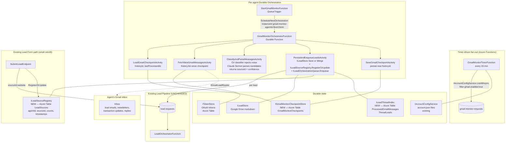

# Lead Communications Loop — Design Spec

**Date:** 2026-04-17
**Status:** Draft — expanded scope (MVP features #3 + #4 merged into one feature)
**Author:** Eddie Rosado + Claude
**Branch:** TBD (proposed: `feat/lead-communications-loop`)
**MVP Feature:** #3 + #4 of 4 combined — see [2026-04-05-activation-mvp-redesign.md](./2026-04-05-activation-mvp-redesign.md)
**Supersedes:** prior "Gmail Lead Monitoring" framing (renamed in this commit — git tracks the rename)

---

## Summary

A single scheduled loop runs every 15 min per activated agent that does **both halves of the conversation**:

- **Inbound**: reads the agent's Gmail, detects new leads from any source, detects replies on existing lead threads, merges new data into the right `Lead` record.
- **Journey inference**: after a reply, asks Claude whether the lead's position in the sales funnel advanced and which *conversational purposes* (trust-intro, commission-explanation, timeline-established, etc.) the lead has now "served" — so future sends don't repeat points the lead has already moved past.
- **Outbound**: picks the next-most-useful message for each lead based on current stage + served-purposes + available-templates, renders it through the agent's VoiceSkill + PersonalitySkill (so it sounds like Jenise, not ChatGPT), sends via Gmail, advances state.

The loop rides on infrastructure that already exists in this codebase:
- `PipelineStage` enum (`Lead → ActiveClient → UnderContract → Closed`) — the coarse journey, already modelled in `Domain/Activation/Models/ContactEnums.cs`.
- `LeadStatus` enum — process state within our pipeline.
- `CoachingReport` + `PipelineAnalysis` + `VoiceSkill` + `PersonalitySkill` activation artifacts — the per-agent "how this agent sells" playbook, already extracted from their emails and Drive at activation time. These drive message tone and sequencing rules.
- Existing lead pipeline (`LeadOrchestratorFunction`, `ILeadStore`, `LeadPaths`) — unchanged downstream.

**What this feature replaces:** the current one-shot "form submission → CMA email → hope the lead replies" flow. After this, every lead — regardless of source — is carried through a stage-aware conversation until they convert, disqualify, or stall.

**What this feature is NOT:** a linear drip campaign. Linear drips send message N+1 regardless of whether the lead has already moved past it. This system asks "what does this lead still need to hear from us?" every cycle.

---

## Goals

1. Detect inbound leads in each activated agent's Gmail inbox with no manual intervention, regardless of source.
2. Detect replies from existing leads, infer journey-stage changes + purposes-served updates, merge new data into the existing `Lead`.
3. Maintain a per-lead `LeadJourneyState` that tracks where the lead sits in the conversation (`Unengaged → Informed → Engaged → Qualified → Converting → Client`) and a `PurposesServed` set that tracks which conversational beats the lead has moved past.
4. Select and send the next-most-useful outbound message per lead, per cycle, based on stage + purposes-served + time-since-last-contact + available templates. Render through the agent's `VoiceSkill` and `PersonalitySkill` so the message sounds like the agent.
5. Reuse the existing lead pipeline end-to-end (`ILeadStore` → `ILeadOrchestrationQueue` → `LeadOrchestratorFunction`) for new-lead onboarding (scoring, CMA, initial email). **No parallel pipeline.** This loop owns mid-conversation messaging only.
6. Maintain a **lead-source registry** — every source ever seen per agent, inventoried with counts and timestamps. Foundation for per-source journey variants, ROI reporting, and source-aware message template libraries.
7. Survive downtime — if the loop is offline for N hours, it catches up on resume without duplicates, missed leads, or duplicate outbound sends.
8. Multi-tenant fan-out: per-agent sub-orchestrations; slow/broken agents don't block the batch.
9. Preserve locale as first-class — detect `en`/`es` on the inbound email body and persist to `Lead.Locale`; render outbound messages in the lead's locale.
10. Every lead entry path (Gmail, lead-form, future channels) contributes to the same source registry and journey state machine. Lead-form submissions set `sourceId="website"` and start in `Unengaged`; Gmail-detected leads set whatever source Claude identifies.
11. Halt messaging automatically on clear disqualification or conversion signals (Claude-inferred) — never robo-spam a lead who said "not interested" or a lead who already signed.
12. Keep the outbound cadence under human agent control — the system sends on a schedule the agent implicitly controls by writing the campaign templates (activation pipeline seeds defaults derived from the agent's own `CoachingReport`). No hidden behavior.

## Non-Goals

- Gmail push notifications (Pub/Sub `watch`) — Phase 2 inside this spec's phasing.
- WhatsApp / SMS outbound in the loop — separate channel spec. This spec assumes email-only for outbound but the journey state machine is channel-agnostic; adding a channel later doesn't restructure the state machine.
- Per-source templated fast-path parsers — deferred indefinitely. Will revisit only if Claude spend at scale ($1,500+/month) justifies the maintenance cost.
- Agent-facing UI to customize journey stages, campaign templates, or thresholds — this spec assumes templates live in the agent's Drive as markdown files (generated from their activation playbook); direct edit is how customization happens for MVP.
- Real-time conversation (chat / live-chat style turnaround within minutes) — the loop runs every 15 min and is explicitly not a conversational AI replacement for the agent.
- CRM sync, Microsoft 365 / Outlook monitoring, IMAP fallback.
- Parsing non-English lead sources beyond Spanish (Portuguese, etc.) — detect only.
- Agent-in-the-loop "is this a lead?" confirmation UI — fully automated for MVP.
- Retroactive ingestion of pre-activation emails (one-time Drive import at activation already covers this).
- Tracking read-receipts or email-open signals — adds complexity + tracking-pixel ethics problems; positive-engagement signal comes from replies only.
- Automatic contract-signing state change (`Converted`) — that comes from other signals (contract-drafting feature, manual agent flip) outside the loop.

## Success Criteria

### Inbound

- [ ] A lead email from ANY source (Zillow, Realtor.com, Homes.com, Trulia, Redfin, brokerage referral, direct referral, lead-form forward, etc.) delivered to an activated agent's inbox becomes a `Lead` in `ILeadStore` within 20 min p95, 15 min p50.
- [ ] Every email-sourced lead has a non-null `SourceId` (examples: `"zillow"`, `"realtor.com"`, `"direct"`, `"brokerage"`, `"facebook"`, etc.). Source registry records `(agentId, sourceId)` with first-seen, last-seen, total-leads, conversion counters.
- [ ] Lead-form submissions at the agent website populate `SourceId="website"` and start in `LeadJourneyState.Unengaged`.
- [ ] Newsletter, transaction update, and non-lead email parse cost is $0 (classifier rejects before Claude).
- [ ] Second email on the same thread triggers ThreadEnrichment: merges new data into the existing `Lead`, appends to `Email Thread Log.md`, does NOT duplicate, does NOT re-enqueue the lead pipeline.
- [ ] A CMA-form-initiated lead whose recipient replies by email gets the reply correctly merged — the lead-form submission links the outbound CMA-delivery Gmail thread; inbound reply enriches the same Lead.
- [ ] Loop offline for 6 hours → on resume, catches up all messages since last `historyId` with zero duplicates, zero misses, zero duplicate outbound sends.

### Journey inference

- [ ] When a lead replies, Claude infers whether the journey stage advanced and which purposes-served flags flipped. Decision is logged to `Journey History.md` with reasoning.
- [ ] A lead who asks "what's your commission?" has the `commission-explanation` purpose marked as *needed* (upcoming). A lead who replies affirmatively after receiving the commission explanation has it marked *served*.
- [ ] A lead who says "not interested" / "stop emailing me" / "wrong number" → `JourneyState = Disqualified`, `haltReason = "lead-disqualified"`. No further outbound sends, ever, without manual agent override.
- [ ] A lead who says "let's meet Saturday" / "call me at 555-1234" / "I want to list my house" → `JourneyState = Converting`, outbound loop halts for that lead, agent receives WhatsApp escalation notification.
- [ ] Journey-state changes are auditable — every transition has a reasoning log entry and an OTel span.

### Outbound

- [ ] Every cycle, every active lead (not in `Converted`, `Disqualified`, or manually paused) is evaluated by the `NextMessageSelector`. When a message is due and appropriate, it sends.
- [ ] Selector never sends a message whose `requiredPriorPurposes` are not all in the lead's `PurposesServed` set. Example: never sends "introducing my process" to a lead who already received the CMA and replied to it.
- [ ] Selector never sends a message whose `validStages` does not include the lead's current `JourneyState`.
- [ ] Message rendering uses the agent's `VoiceSkill` + `PersonalitySkill` for tone; output passes a basic sanity check (length within template budget, no unrendered template variables, no references to template metadata leaking through).
- [ ] Outbound send is idempotent — `Drip State.json`'s ETag + `lastOutboundMessageAt` guarantee a message never double-sends on retry.
- [ ] An outbound send updates `PurposesServed` with the purposes that message served, updates `LastOutboundMessageAt`, and schedules `NextMessageAt` based on the message's `cooldownAfterSend` + the journey's per-stage cadence rule.
- [ ] When `NextMessageSelector` returns `null` (lead has no useful next message for their current stage), the lead's `NextMessageAt` is pushed out by the stage's idle cadence (e.g., 7 days for `Informed`, 14 days for `Engaged`) — no "dead" messages.

### Cross-cutting

- [ ] 100% branch coverage across new production code.
- [ ] All 41 architecture tests still pass.
- [ ] Every Claude call (parse, stage-inference, voice render) uses `IAnthropicClient`, not inline `HttpClient` — per the architecture rules.
- [ ] All user-facing content (outbound messages, notes, journey-log entries) carry locale.
- [ ] No PII in telemetry (hashed agentId, redacted subjects/bodies).

---

## High-Level Architecture



---

## Phased Rollout

### Phase 1 — MVP (this spec)

- Timer-triggered polling every 5 min, per-agent sub-orchestrations.
- `historyId`-based checkpoint + resume.
- Source-template regex parser for Zillow, Realtor.com, Homes.com.
- Claude Sonnet fallback parser for unknown senders.
- Thread-based dedup: `Lead` keyed on `agentId + gmailThreadId`; new messages on same thread update existing lead (notes append + field merge).
- Per-agent OAuth failure → mark "OAuth re-consent required", stop polling that agent, continue others.

### Phase 2 — Push notifications

- Gmail `users.watch` + Cloud Pub/Sub topic.
- HTTP webhook endpoint on the API → enqueues the same `gmail-monitor-requests` message for the agent — so the push path and poll path converge into the same orchestrator.
- `watch` expires every 7 days; a daily timer renews watches for all activated agents.
- Polling stays as 15-min fallback safety net.

### Phase 3 — Quality + ops (post-MVP)

- Multi-language template expansion (ES, PT).
- Per-agent parser learning — persist parse accuracy metrics per sender domain; promote domains to "trusted sender" fast path.
- Manual re-queue tool in the portal ("mark as lead" button for missed emails).

---

## Detailed Component Design

### New Domain Interfaces (RealEstateStar.Domain — ZERO deps)

All interfaces live in `RealEstateStar.Domain` per the architecture rules. Implementations land in `Clients.Gmail`, `Clients.Azure`, `Workers.Leads`, or `Api` per boundary rules.

```csharp
// RealEstateStar.Domain/Leads/Interfaces/IGmailLeadReader.cs
// Extends the Gmail client surface with history-based incremental read.
// Implementation: RealEstateStar.Clients.Gmail.GmailLeadReader (new file).
public interface IGmailLeadReader
{
    /// <summary>Fetches messages in the inbox since <paramref name="sinceHistoryId"/>.</summary>
    /// <remarks>When sinceHistoryId is null (cold start), fetches the most recent N.</remarks>
    Task<GmailHistorySlice> GetHistoryAsync(
        string accountId, string agentId,
        string? sinceHistoryId, int maxResults, CancellationToken ct);
}

public sealed record GmailHistorySlice(
    string NewHistoryId,
    IReadOnlyList<InboundGmailMessage> Messages,
    bool HistoryExpired);   // true when Gmail returns 404 historyNotFound → rebaseline

public sealed record InboundGmailMessage(
    string MessageId,        // Gmail message id
    string ThreadId,         // Gmail thread id
    string From,             // raw From header
    string[] To,
    string Subject,
    string Body,             // plain text, HTML stripped (reuse GmailReaderClient.ExtractBody)
    DateTime ReceivedAt,
    string? InReplyTo,       // message-id of parent, if any
    IReadOnlyList<string> Labels);
```

```csharp
// RealEstateStar.Domain/Leads/Interfaces/IGmailMonitorCheckpointStore.cs
public interface IGmailMonitorCheckpointStore
{
    Task<GmailMonitorCheckpoint?> GetAsync(string accountId, string agentId, CancellationToken ct);
    Task SaveAsync(GmailMonitorCheckpoint checkpoint, CancellationToken ct);
}

public sealed record GmailMonitorCheckpoint(
    string AccountId,
    string AgentId,
    string? LastHistoryId,
    DateTime LastProcessedAt,
    int ConsecutiveOAuthFailures,
    DateTime? DisabledUntil,
    string ETag);
```

```csharp
// RealEstateStar.Domain/Leads/Interfaces/ILeadEmailParser.cs
// Single-path parser. Implementation: RealEstateStar.Workers.Leads.ClaudeLeadEmailParser.
// Q3 resolved: no per-source regex fast-path. Coverage > cost optimization for MVP.
public interface ILeadEmailParser
{
    Task<ParsedLeadEmail?> TryParseAsync(
        InboundGmailMessage message,
        string agentId,
        CancellationToken ct);
}

public sealed record ParsedLeadEmail(
    ParseMode Mode,               // NewLead | ThreadEnrichment — dispatched by orchestrator on thread lookup
    string SourceId,              // Claude-classified, open-ended; examples below
    decimal SourceConfidence,     // 0..1 — how sure Claude is about the sourceId
    LeadType LeadType,            // existing enum Buyer/Seller/Both/Unknown
    // Fields below are nullable in ThreadEnrichment mode — only populated when the
    // reply actually carries new data. NewLead mode requires at minimum firstName +
    // (email OR phone) to pass parseConfidence ≥ 0.7.
    string? FirstName,
    string? LastName,
    string? Email,
    string? Phone,
    string? Timeline,
    SellerDetails? SellerDetails,
    BuyerDetails? BuyerDetails,
    string? Notes,                // for ThreadEnrichment: "reply note" to append, not overwrite
    string Locale,                // en | es
    decimal ParseConfidence,      // 0..1 — overall parse quality
    string ParserUsed);           // "claude-sonnet-4-6" — tracked for observability

public enum ParseMode
{
    NewLead,           // No existing Lead on this Gmail thread — classifier must accept
    ThreadEnrichment,  // Existing Lead on this thread — bypass classifier, merge deltas
}

// SourceId is a string, not an enum, to support the open-ended registry.
// Canonical values Claude is prompted to emit when it recognizes a source:
//   "zillow" | "realtor.com" | "homes.com" | "trulia" | "redfin"
//   "facebook" | "instagram" | "google-ads"
//   "brokerage" (for forwarded brokerage leads without a specific platform)
//   "direct" (human-written referral from friend/family/network)
//   "website" (lead-form submission — NOT set by Gmail; set by SubmitLeadEndpoint)
// Unknown senders get Claude's best guess. Registry tracks whatever it sees.
```

```csharp
// RealEstateStar.Domain/Leads/Interfaces/ILeadEmailClassifier.cs
public interface ILeadEmailClassifier
{
    LeadEmailClassification Classify(InboundGmailMessage message);
}

public sealed record LeadEmailClassification(
    bool IsCandidate,
    LeadSource LikelySource,
    string Reason);
```

```csharp
// RealEstateStar.Domain/Leads/Interfaces/ILeadThreadIndex.cs
public interface ILeadThreadIndex
{
    Task<Lead?> GetByThreadIdAsync(string agentId, string gmailThreadId, CancellationToken ct);
    Task LinkThreadAsync(string agentId, Guid leadId, string gmailThreadId, string messageId, CancellationToken ct);
    Task<bool> HasProcessedMessageAsync(string agentId, string gmailMessageId, CancellationToken ct);
    Task MarkMessageProcessedAsync(string agentId, string gmailMessageId, Guid leadId, CancellationToken ct);
}
```

```csharp
// RealEstateStar.Domain/Leads/Interfaces/ILeadSourceRegistry.cs
// Per-agent inventory of every lead source ever observed.
// Foundation for source-aware drip campaigns (feature #4) and ROI reporting.
// Called by: Gmail monitor (every Gmail-detected lead), SubmitLeadEndpoint (every form submission),
// future channels (WhatsApp, SMS, etc.).
public interface ILeadSourceRegistry
{
    /// <summary>
    /// Idempotent upsert. Creates the source entry if new, otherwise increments counters.
    /// Safe to call from activity function retries — all updates are atomic increments.
    /// </summary>
    Task RegisterOrUpdateAsync(
        string agentId,
        string sourceId,
        LeadSourceObservation observation,
        CancellationToken ct);

    Task<LeadSourceEntry?> GetAsync(string agentId, string sourceId, CancellationToken ct);

    Task<IReadOnlyList<LeadSourceEntry>> GetAllForAgentAsync(string agentId, CancellationToken ct);
}

public sealed record LeadSourceObservation(
    Guid LeadId,
    DateTime ObservedAt,
    decimal SourceConfidence,
    string? OriginChannel);       // "gmail" | "website" | "whatsapp" (future) — how the system found this lead

public sealed record LeadSourceEntry(
    string AgentId,
    string SourceId,              // "zillow", "direct", "website", etc.
    string DisplayName,           // "Zillow", "Direct Referral", "Website Form" — human-friendly
    DateTime FirstSeenAt,
    DateTime LastSeenAt,
    int TotalLeads,
    int ConvertedLeads,           // updated elsewhere when lead closes — nullable/zero until set
    string ETag);
```

### Lead model extension

`RealEstateStar.Domain/Leads/Models/Lead.cs` gains four init-only fields (non-breaking — nullable):

```csharp
public string? GmailThreadId { get; init; }     // Gmail thread dedup key (null for non-Gmail leads)
public string? GmailMessageId { get; init; }    // first Gmail message that created this lead
public string? SourceId { get; init; }          // registry key — "zillow", "website", "direct", etc.
public decimal? SourceConfidence { get; init; } // Claude's confidence in the sourceId (null for deterministic entries like "website")
```

`LeadMarkdownRenderer` adds all four to YAML frontmatter. Roundtrip tests required per `code-quality.md`. YAML injection tests required per same.

### Existing `SubmitLeadEndpoint` retrofit

`apps/api/RealEstateStar.Api/Features/Leads/Submit/SubmitLeadEndpoint.cs`: populate `SourceId = "website"` on the `Lead` written through `ILeadStore.SaveAsync`, and call `ILeadSourceRegistry.RegisterOrUpdateAsync(agentId, "website", ...)` alongside. This is the only change needed to make lead-form submissions contribute to the source registry.

### Existing CMA-email-delivery retrofit — critical for thread enrichment

The lead pipeline already sends CMA PDFs to the lead via the agent's Gmail (`GmailSender` in `Clients.Gmail`). When we send that outbound email, we **must capture the resulting Gmail `threadId` and link it into `ILeadThreadIndex`** so that when the lead replies, our Gmail monitor can find the Lead on that thread and route to ThreadEnrichment mode.

Change required in `SendLeadEmailActivity` (or wherever the CMA delivery call is wired):

1. After `GmailSender.SendAsync(...)` returns, capture the `threadId` from the response (Gmail's send API returns the created message with its `threadId`).
2. Call `ILeadThreadIndex.LinkThreadAsync(agentId, leadId, threadId, sentMessageId)`.

Without this step, a lead's reply to our CMA email would be treated as a NewLead by the classifier and potentially create a duplicate Lead record. This is the plumbing that makes the "CMA-form reply lands correctly" success criterion work.

`GmailSender` likely doesn't currently return the `threadId` — check its interface and, if needed, extend `IGmailSender.SendAsync` to return `SentMessageRef { MessageId, ThreadId }` so callers can persist the linkage.

### Activity function signatures

All activities live under `RealEstateStar.Functions/Leads/GmailMonitor/`.

| Activity | Input | Output | FATAL/BEST-EFFORT | Retry Policy |
|---|---|---|---|---|
| `LoadGmailCheckpointActivity` | `{accountId, agentId, correlationId}` | `GmailMonitorCheckpoint?` | FATAL | `Standard` |
| `FetchNewGmailMessagesActivity` | `{accountId, agentId, sinceHistoryId, maxResults, correlationId}` | `GmailHistorySlice` | FATAL | `GmailRead` |
| `ClassifyAndParseMessagesActivity` | `{messages, agentId, correlationId}` | `{parsed, skipped}` | BEST-EFFORT per-message (one bad email cannot fail the batch) | `Parse` |
| `PersistAndEnqueueLeadsActivity` | `{parsed, agentId, accountId, messages, correlationId}` | `{created, merged, enqueued, sourcesRegistered}` | FATAL (idempotent via `ILeadThreadIndex.HasProcessedMessageAsync` + `ILeadSourceRegistry` atomic increment) | `Persist` |
| `SaveGmailCheckpointActivity` | `{checkpoint}` | void | FATAL | `Standard` |

**`PersistAndEnqueueLeadsActivity` write sequence** (idempotent — every step safe to retry):

1. For each `ParsedLeadEmail`:
   - **Message-level idempotency**: skip if `ILeadThreadIndex.HasProcessedMessageAsync(agentId, gmailMessageId)` returns true.
   - Branch on `Mode`:
     - **`NewLead` mode**:
       - Apply NewLead threshold: skip entirely if `parseConfidence < 0.4`; log to `gmail_monitor.uncertain_parses` if `0.4 ≤ parseConfidence < 0.7`; proceed if `≥ 0.7`.
       - `ILeadStore.SaveAsync` with `SourceId`, `SourceConfidence`, `GmailThreadId`, `GmailMessageId` populated.
       - `ILeadStore.WriteSourceContextAsync(agentId, leadId, snapshot)` — writes the verbatim first email to `Source Context.md`.
       - `ILeadStore.AppendEmailThreadLogAsync(agentId, leadId, entry)` — first entry in `Email Thread Log.md`.
       - `ILeadThreadIndex.LinkThreadAsync(agentId, leadId, gmailThreadId, gmailMessageId)`.
       - `ILeadSourceRegistry.RegisterOrUpdateAsync(agentId, sourceId, observation)` — idempotent upsert.
       - Enqueue `lead-requests` via `ILeadOrchestrationQueue` (runs CMA + email draft + notifications).
     - **`ThreadEnrichment` mode**:
       - Apply ThreadEnrichment threshold: if `parseConfidence < 0.5`, only append to thread log and return.
       - Merge non-null fields into the existing Lead via `ILeadStore.MergeFromEnrichmentAsync(agentId, leadId, enrichment)` — new method added below.
       - `ILeadStore.AppendEmailThreadLogAsync(agentId, leadId, entry)`.
       - **Do NOT re-enqueue** `lead-requests`. The lead is mid-conversation; re-running CMA + re-sending email would be wrong.
2. Mark every processed messageId via `ILeadThreadIndex.MarkMessageProcessedAsync`.
3. `ILeadSourceRegistry` counter increments are atomic — duplicate retry calls pass the same `leadId`, and the registry deduplicates by `(agentId, sourceId, leadId)` tuple.

**New `ILeadStore` method for enrichment merge:**

```csharp
// RealEstateStar.Domain/Leads/Interfaces/ILeadStore.cs — additional method
Task MergeFromEnrichmentAsync(
    string agentId,
    Guid leadId,
    LeadEnrichmentDelta delta,
    CancellationToken ct);

public sealed record LeadEnrichmentDelta(
    string? Phone,                // overwrite if existing is empty, else append to notes
    string? Email,                // same rule as phone
    string? Timeline,             // always overwrites (timeline is a current-state field)
    LeadType? LeadTypeUpdate,     // e.g. Buyer → Both when reply reveals dual intent
    BuyerDetails? BuyerDetailsPatch,
    SellerDetails? SellerDetailsPatch,
    string? ReplyNote,            // appended to lead's notes section with timestamp
    DateTime EnrichedAt);
```

Implementation in `LeadFileStore` does field-level merge on the `Lead Profile.md` YAML frontmatter, preserving prior data. A deterministic merge policy (empty → fill; non-empty → append to notes) avoids losing existing information.

### Orchestrator skeleton

```csharp
[Function("GmailMonitorOrchestrator")]
public static async Task RunOrchestrator([OrchestrationTrigger] TaskOrchestrationContext ctx)
{
    var input = ctx.GetInput<GmailMonitorOrchestratorInput>()
        ?? throw new InvalidOperationException("[GMLM-ORCH-000] null input");
    var logger = ctx.CreateReplaySafeLogger<GmailMonitorOrchestratorFunction>();

    var checkpoint = await ctx.CallActivityAsync<GmailMonitorCheckpoint?>(
        "LoadGmailCheckpoint", input, GmailMonitorRetryPolicies.Standard);

    if (checkpoint?.DisabledUntil is { } until && ctx.CurrentUtcDateTime < until)
    {
        if (!ctx.IsReplaying)
            logger.LogInformation("[GMLM-ORCH-002] Agent {AgentId} is in OAuth backoff until {Until}",
                input.AgentId, until);
        return;
    }

    var slice = await ctx.CallActivityAsync<GmailHistorySlice>(
        "FetchNewGmailMessages",
        new FetchNewGmailMessagesInput {
            AccountId = input.AccountId, AgentId = input.AgentId,
            SinceHistoryId = checkpoint?.LastHistoryId,
            MaxResults = 100,
            CorrelationId = input.CorrelationId
        },
        GmailMonitorRetryPolicies.GmailRead);

    if (slice.Messages.Count == 0 || slice.HistoryExpired)
    {
        await ctx.CallActivityAsync("SaveGmailCheckpoint",
            BuildCheckpoint(checkpoint, slice.NewHistoryId, consecutiveOAuthFailures: 0),
            GmailMonitorRetryPolicies.Standard);
        return;
    }

    var parseResult = await ctx.CallActivityAsync<ClassifyAndParseOutput>(
        "ClassifyAndParseMessages",
        new ClassifyAndParseInput { Messages = slice.Messages, AgentId = input.AgentId,
                                    CorrelationId = input.CorrelationId },
        GmailMonitorRetryPolicies.Parse);

    if (parseResult.Parsed.Count > 0)
    {
        await ctx.CallActivityAsync("PersistAndEnqueueLeads",
            new PersistAndEnqueueInput {
                AccountId = input.AccountId, AgentId = input.AgentId,
                Parsed = parseResult.Parsed, Messages = slice.Messages,
                CorrelationId = input.CorrelationId
            },
            GmailMonitorRetryPolicies.Persist);
    }

    await ctx.CallActivityAsync("SaveGmailCheckpoint",
        BuildCheckpoint(checkpoint, slice.NewHistoryId, consecutiveOAuthFailures: 0),
        GmailMonitorRetryPolicies.Standard);
}
```

Total activity calls: **5** (inside the 5–6 cap).

### Timer + fan-out function

```csharp
public sealed class GmailMonitorTimerFunction(
    IActivatedAgentLister activatedAgents,
    IGmailMonitorQueue queue,
    ILogger<GmailMonitorTimerFunction> logger)
{
    [Function("GmailMonitorTimer")]
    public async Task RunAsync(
        [TimerTrigger("0 */5 * * * *")] TimerInfo timer,
        CancellationToken ct)
    {
        try
        {
            var agents = await activatedAgents.ListActivatedAgentsAsync(ct);
            foreach (var a in agents)
            {
                await queue.EnqueueAsync(
                    new GmailMonitorMessage(a.AccountId, a.AgentId, Guid.NewGuid().ToString("N")),
                    ct);
            }
            logger.LogInformation("[GMLM-TMR-001] Fanout complete. Agents={Count}", agents.Count);
        }
        catch (Exception ex)
        {
            logger.LogError(ex, "[GMLM-TMR-020] Timer fan-out failed");
            throw;
        }
    }
}
```

`StartGmailMonitorFunction` (queue trigger) schedules one orchestration per message with instance id `gmail-monitor-{accountId}-{agentId}-{floorMinute}` — deterministic to prevent duplicate in-flight orchestrations if the timer double-fires.

### Retry policies

```csharp
internal static class GmailMonitorRetryPolicies
{
    public static readonly TaskOptions Standard = TaskOptions.FromRetryPolicy(new RetryPolicy(
        maxNumberOfAttempts: 3, firstRetryInterval: TimeSpan.FromSeconds(15), backoffCoefficient: 2.0));

    public static readonly TaskOptions GmailRead = TaskOptions.FromRetryPolicy(new RetryPolicy(
        maxNumberOfAttempts: 4, firstRetryInterval: TimeSpan.FromSeconds(30), backoffCoefficient: 2.0));

    public static readonly TaskOptions Parse = TaskOptions.FromRetryPolicy(new RetryPolicy(
        maxNumberOfAttempts: 2, firstRetryInterval: TimeSpan.FromSeconds(10), backoffCoefficient: 2.0));

    public static readonly TaskOptions Persist = TaskOptions.FromRetryPolicy(new RetryPolicy(
        maxNumberOfAttempts: 4, firstRetryInterval: TimeSpan.FromSeconds(15), backoffCoefficient: 2.0));
}
```

### Log code prefix table

| Prefix | Scope |
|---|---|
| `[GMLM-TMR-NNN]` | Timer fan-out function |
| `[GMLM-SQ-NNN]` | StartGmailMonitorFunction (queue trigger) |
| `[GMLM-ORCH-NNN]` | Orchestrator |
| `[GMLM-ACTV-FETCH-NNN]` | FetchNewGmailMessagesActivity |
| `[GMLM-ACTV-PARSE-NNN]` | ClassifyAndParseMessagesActivity |
| `[GMLM-ACTV-PERSIST-NNN]` | PersistAndEnqueueLeadsActivity |
| `[GMLM-ACTV-CKP-NNN]` | Load/SaveGmailCheckpoint |
| `[GMLM-PARSE-NNN]` | Parser implementations |
| `[GMLM-CLS-NNN]` | Classifier |
| `[GMLM-RDR-NNN]` | GmailLeadReader client |
| `[GMLM-IDX-NNN]` | ILeadThreadIndex implementation |

---

## Parser Design (two-mode: NewLead + ThreadEnrichment)

Every message with a Gmail `threadId` that already has a tracked `Lead` bypasses the "is this a lead?" classifier entirely and goes to Claude as a **thread enrichment** (extract only the *new* information and merge into the existing Lead). This is critical because most lead value concentrates in reply chains — the CMA-form → reply, the Zillow intro → follow-up with phone, the direct-referral → "here's her number."

```mermaid
flowchart TD
    M[InboundGmailMessage] --> TLK{ILeadThreadIndex<br/>GetByThreadIdAsync}
    TLK -->|match — Lead exists on this thread| TE[Mode = ThreadEnrichment<br/>always parse, no classifier filter]
    TLK -->|no match — new thread| CLF{Classifier<br/>C# — free}

    CLF -->|List-Unsubscribe header<br/>AND no lead markers| R1[Skip — newsletter]
    CLF -->|noreply@ sender<br/>AND not a lead-source domain<br/>AND no lead markers| R2[Skip — system notification]
    CLF -->|From is our own<br/>real-estate-star.com domain| R3[Skip — we generated this]
    CLF -->|Otherwise| NL[Mode = NewLead<br/>parse via Claude]

    TE --> CL[ClaudeLeadEmailParser<br/>claude-sonnet-4-6<br/>~\$0.015 per call]
    NL --> CL
    CL --> MODE{ParsedLeadEmail.Mode}

    MODE -->|NewLead<br/>parseConfidence ≥ 0.7| CREATE[Create Lead<br/>enqueue lead-requests<br/>register Source]
    MODE -->|NewLead<br/>0.4 ≤ parseConfidence < 0.7| LOG1[Log to gmail_monitor.uncertain_parses<br/>no Lead created<br/>counter ClaudeLowConfidenceDrop]
    MODE -->|NewLead<br/>parseConfidence < 0.4| DROP1[Drop silently<br/>counter only]
    MODE -->|ThreadEnrichment<br/>parseConfidence ≥ 0.5| MERGE[Merge into existing Lead<br/>append Email Thread Log<br/>no re-enqueue]
    MODE -->|ThreadEnrichment<br/>parseConfidence < 0.5| APPEND[Append to Email Thread Log<br/>no field merge<br/>counter EnrichmentDropped]
```

**Classifier (C# only, ~$0):** only applies to messages on threads without a tracked Lead. Rules:

1. `List-Unsubscribe` header present AND body lacks lead-intent keywords → SKIP (newsletter).
2. `From` matches `noreply@` / `do-not-reply@` pattern AND sender domain is not on the known lead-source allowlist AND body lacks lead-intent keywords → SKIP (system notification).
3. `From` is our own `*.real-estate-star.com` domain → SKIP (we generated this).
4. Otherwise → parse via Claude (NewLead mode).

**Explicitly dropped from the classifier** (per Q7 refinement): the old "skip Re: chains where In-Reply-To is agent-sent" rule is GONE. Reply chains carry the most lead value (CMA-form replies, Zillow intro follow-ups, direct-referral details) and the thread-index check above handles them correctly.

Implementation: `RealEstateStar.Workers.Leads.LeadEmailClassifier`.

**Claude parser (Sonnet 4.6) — two modes:**

Shared across both modes:
- System prompt instructs Claude to extract structured JSON including `mode`, `firstName, lastName, email, phone, leadType, timeline, sellerDetails/buyerDetails, notes, locale, sourceId, sourceConfidence, parseConfidence`.
- Prompt includes the canonical `sourceId` list with permission to emit new values for unrecognized senders.
- Input: subject + up to 4KB of body (truncate aggressively).
- **Prompt-injection mitigation:** wrap body in `<email_body>` delimiters; system prompt explicitly instructs Claude to treat content as data, not instructions.
- Strip markdown code fences before `JsonDocument.Parse` (per MEMORY lesson).
- On JSON parse failure: log first 200 chars of Claude response (not the email body) and skip — counts toward `ClaudeParseFailures` counter.

**NewLead mode** — used when the thread is new:
- Prompt: "Extract full lead data from this email. If this is not a lead at all, return `null`."
- Output: full `ParsedLeadEmail` with `Mode = NewLead`.
- Downstream: `PersistAndEnqueueLeadsActivity` creates a Lead, links the thread via `ILeadThreadIndex.LinkThreadAsync`, enqueues `lead-requests`.

**ThreadEnrichment mode** — used when `ILeadThreadIndex` found an existing Lead on this thread:
- Prompt: "This is a new message on an existing lead thread. Current lead snapshot is: `<existing_lead_json/>`. Extract any NEW information from the reply: new phone numbers, timeline updates, property interest changes, sentiment shifts, scheduled appointments. Return `null` if the reply contains no new data (e.g., just 'thanks')."
- Output: `ParsedLeadEmail` with `Mode = ThreadEnrichment` and only populated fields for new data (unchanged fields are `null`).
- Downstream: `PersistAndEnqueueLeadsActivity` merges non-null fields into the existing Lead via `ILeadStore.UpdateAsync` + appends a new entry to `Email Thread Log.md`. Does NOT re-enqueue `lead-requests` (that would re-run CMA + re-send email, which is wrong for a mid-conversation reply).

### Confidence thresholds by mode

| Mode | Action | Threshold |
|---|---|---|
| NewLead | Create Lead + enqueue pipeline | `parseConfidence ≥ 0.7` |
| NewLead | Log to uncertain-parses table (no Lead) | `0.4 ≤ parseConfidence < 0.7` |
| NewLead | Drop silently | `parseConfidence < 0.4` |
| ThreadEnrichment | Merge new fields into existing Lead + append thread log | `parseConfidence ≥ 0.5` |
| ThreadEnrichment | Append to thread log only (no field merge) | `parseConfidence < 0.5` |

ThreadEnrichment uses a lower threshold because we're already confident the thread belongs to a real lead — even partial data ("just a phone number") is high-value.

**Cost math (Jenise scale):**

- Classifier rejects ~95% of *new-thread* inbox traffic (newsletters, transaction updates) for $0.
- Every message on a *tracked thread* bypasses classifier — if 150 leads/month each generate ~4 reply messages, that's ~600 extra Claude calls.
- Total: ~300 new-thread Claude calls + ~600 thread-enrichment calls = ~900/month.
- 900 × ~$0.015 ≈ **~$13.50/month/agent**.
- At 100 agents: ~$1,350/month. This is the trigger point to revisit templating, not MVP.

---

## Google Drive per-lead Folder Structure

The existing `LeadPaths` already implements Option 4 (one folder per lead). Gmail monitoring extends the existing structure with source-context and thread-log files — no directory schema changes, just additional files inside the existing lead folder.

### Existing structure (unchanged)

```
Real Estate Star/
  1 - Leads/
    {Lead Full Name}/
      Lead Profile.md              ← YAML frontmatter + body (existing)
      Research & Insights.md       ← CMA + HomeSearch output (existing)
      Notification Draft.md        ← email draft for agent (existing)
      Home Search/
        YYYY-MM-DD-Home Search Results.md
      {Property Address}/          ← CMA folder per property (existing)
        ...
```

### New files added by Gmail monitoring

```
Real Estate Star/
  1 - Leads/
    {Lead Full Name}/
      Lead Profile.md              ← existing; gains sourceId/gmailThreadId frontmatter
      Email Thread Log.md          ← NEW: running log of every Gmail message on this thread
      Source Context.md            ← NEW: verbatim first email that created the lead
```

- **`Email Thread Log.md`** — append-only. Each entry stamps `receivedAt`, `from`, `subject`, and the plain-text body. Agents can see the full conversation history without leaving Drive. Updated every time `ILeadThreadIndex.GetByThreadIdAsync` returns a match and we merge.
- **`Source Context.md`** — immutable. Written once on lead creation. Preserves the original email (headers stripped to `From`/`Subject`/`Date`/`Authentication-Results` only) so the agent can audit where a lead came from even if the `sourceId` classification needs correction later.

### New `LeadPaths` helpers

```csharp
// RealEstateStar.Domain/Leads/LeadPaths.cs additions
public static string EmailThreadLogFile(string name)
    => $"{LeadFolder(name)}/Email Thread Log.md";

public static string SourceContextFile(string name)
    => $"{LeadFolder(name)}/Source Context.md";
```

### New `ILeadStore` methods

```csharp
// RealEstateStar.Domain/Leads/Interfaces/ILeadStore.cs — additions
Task AppendEmailThreadLogAsync(string agentId, Guid leadId, EmailThreadLogEntry entry, CancellationToken ct);
Task WriteSourceContextAsync(string agentId, Guid leadId, SourceContextSnapshot snapshot, CancellationToken ct);
```

Implementation in `LeadFileStore` routes through `IDocumentStorageProvider` (Google Drive or local) just like existing methods — no new storage abstraction required.

### Future file slots (reserved — spec feature #4 will use)

```
{Lead Full Name}/
  Drip State.json              ← drip campaign progress (per-lead state machine)
  Drip History.md              ← log of sent follow-up messages
```

These are called out only so spec #4 (drip campaigns) knows where to land its state. Not built in this spec.

---

## Dedup + Replay Safety Strategy

### Message-level idempotency

`ILeadThreadIndex.HasProcessedMessageAsync(agentId, gmailMessageId)` returns true if this Gmail messageId already produced a Lead action. `PersistAndEnqueueLeadsActivity` calls this **before** writing any lead. Impl: Azure Table `ProcessedGmailMessages` keyed by `(agentId, messageId)`.

### Thread-level merge

| Scenario | Action |
|---|---|
| Thread unknown | Create new `Lead` via `ILeadStore.SaveAsync`, link thread. |
| Thread known + new msg adds phone/notes | `UpdateAsync` lead, merge fields. Do NOT re-enqueue. |
| Thread known + new msg changes LeadType | `MergeType(Both)`, append note, re-enqueue (instance id dedups). |
| Thread known + pure acknowledgment | Append note only, no re-enqueue. |

### Durable Functions replay safety

- Orchestrator calls only activities. No `DateTime.UtcNow`, no `Guid.NewGuid()`, no un-guarded logs.
- Instance ID: `gmail-monitor-{accountId}-{agentId}-{yyyyMMddHHmm-floor5}`.
- `SaveGmailCheckpoint` uses ETag optimistic concurrency.

### Catch-up after outage

- Gmail `history.list` returns up to 500 records per page — sufficient for < 2–3 hour outages.
- On `404 historyNotFound` (stale historyId > ~1 week), **rebaseline**: `users.messages.list?q=newer_than:1d&labelIds=INBOX`, process those, store new historyId.
- `Checkpoint.LastProcessedAt` marker logs how far back we skipped.

---

## Multi-Tenant Fan-Out + Memory Budget

- Single timer every 5 min enumerates activated agents via `IActivatedAgentLister` (scans `config/accounts/*/account.json`, caches with mtime refresh).
- Enqueues one `GmailMonitorMessage` per agent to `gmail-monitor-requests`.
- `StartGmailMonitorFunction` (queue trigger, default batchSize 16) schedules one orchestration per message.
- Each orchestration processes **one agent's Gmail sequentially** — no parallel activities.

### Memory math (Azure Consumption = 1.5 GB per instance)

- `GmailHistorySlice` with 100 messages × avg 16 KB body = ~1.6 MB.
- Worst case: `16 parallel orchestrations × 2 MB ≈ 32 MB`. Well under 1.5 GB.
- `MaxResults = 100` per `history.list` page; stop after one page per tick.
- Claude parsing serial, not `Task.WhenAll`.

### Activated-agent opt-in

New field on `account.json`:
```json
{
  "monitoring": {
    "gmail": { "enabled": true, "startedAt": "2026-04-18T00:00:00Z" }
  }
}
```
Default `enabled: false` on existing accounts. Feature flag `Features:GmailMonitor:Enabled` gates the timer entirely.

---

## Observability Plan

### ActivitySource + Meter

```csharp
public static readonly ActivitySource ActivitySource = new("RealEstateStar.GmailMonitor");
public static readonly Meter Meter = new("RealEstateStar.GmailMonitor");

// Counters
MessagesFetched, MessagesSkipped, LeadsCreated, LeadsMerged,
ClaudeFallbacks, HistoryExpired, OAuthFailures

// Histograms
ParseDurationMs, FetchDurationMs, EndToEndLatencyMs
```

Spans: `gmail_monitor.fetch`, `gmail_monitor.parse`, `gmail_monitor.persist` with hashed `agent.id` tags (no PII).

### Structured logging

- Every service emits logs with `agentId` + `correlationId`.
- No PII in tags: hash/omit emails, subjects, phones.
- Prompt-injection safety: log first 200 chars of Claude response on parse failure, never the email body.

### Grafana dashboard tiles

- Messages fetched/skipped/parsed/Claude-fallback per hour, per agent.
- Leads created vs merged.
- End-to-end latency p50/p95.
- OAuth failure rate — alert > 5/hr.
- `history_expired` counter — should be near-zero.

---

## Test Strategy

### Unit tests

- `LeadEmailClassifierTests` — 30+ table-driven scenarios (zillow, realtor, newsletter, noreply+keywords, Re: reply, etc.).
- `{Zillow|Realtor|Homes}TemplateParserTests` — golden-file fixtures with 5+ sanitized samples per source.
- `ClaudeFallbackParserTests` — mock `IAnthropicClient`, verify delimiters + JSON parse with code-fence strip.
- `LanguageDetectorTests` — extend existing with Gmail body fixtures.
- `GmailLeadReaderTests` — mock Gmail SDK; historyId roundtrip, `historyNotFound` → `HistoryExpired=true`.
- `LeadThreadIndexTests` — idempotency, thread get, concurrent access.

### Integration tests

- `GmailMonitorOrchestrator_HappyPath` — fake reader yields 3 messages → 2 leads, 1 skipped.
- `GmailMonitorOrchestrator_ThreadMerge` — follow-up message on same thread → single lead with merged notes.
- `GmailMonitorOrchestrator_HistoryExpired` — rebaseline path.
- `GmailMonitorOrchestrator_Replay` — kill activity mid-run, resume produces same leads.
- `GmailMonitorOrchestrator_OAuthFailure` — `ConsecutiveOAuthFailures` increments, `DisabledUntil` set.

### Architecture tests

- `DependencyTests` — new project reference allowlists (user approval required).
- `DiRegistrationTests` — every new interface is registered.
- `LocaleTests` — `ParsedLeadEmail.Locale` present.

### Quality gates (per code-quality.md)

- Every `catch` in new code has a test that triggers it.
- Every YAML frontmatter addition has render→parse roundtrip + injection test.
- Serialization roundtrip for `GmailMonitorCheckpoint`, `GmailMonitorMessage`.

---

## Security Considerations

### OAuth scope

`IGmailLeadReader` needs `gmail.readonly`. We already request `gmail.send` (superset). **Action:** verify activation consent screen lists readonly scope; no new prompt.

### PII handling

- `InboundGmailMessage.Body`/`Subject` held in memory only during one tick; never logged, never persisted outside `ILeadStore`.
- Telemetry tags use hashed `agent.id`.
- Loggers never receive `.Body`.

### Prompt injection (Claude parser)

- Email body wrapped in `<email_body>` delimiters.
- System prompt treats content as data, not instructions.
- Output validated against JSON schema.
- Confidence < threshold → reject; do not create lead from adversarial input.

### Sender spoofing (DKIM)

A spoofed "zillow-looking" email could inject a fake lead.
**Mitigation:** verify `From` against `Authentication-Results` (SPF/DKIM/DMARC). DKIM fail → downgrade to Claude fallback, never trusted-source fast path.

### Rate limiting vs abuse

- Per-agent `history.list` ≤ 1 call per 5 min. Gmail quota 15k units/sec — we use < 1.
- Claude calls: circuit breaker if `ClaudeFallbacks` > 50/hr/agent; flag for manual review.

### Tenant isolation

Every activity receives `{accountId, agentId}`. `IOAuthRefresher` keyed on `(accountId, agentId)`. No shared caches across agents.

---

## Alternatives Considered + Tradeoffs

### Detection mechanism

| Option | Latency | Complexity | Cost | Verdict |
|---|---|---|---|---|
| **Timer polling (5 min)** — chosen | 5 min avg, 10 min p95 | Low | Gmail quota ≈ free | MVP pick. |
| Gmail Pub/Sub push | Seconds | High — Pub/Sub topic, webhook sig, watch renewal | Infra + code | Phase 2. Not worth overhead for one customer. |
| IMAP IDLE | Seconds | Medium — long-lived connections | Free | Not DF-friendly; breaks scale-to-zero. |

### Parser strategy

| Option | Coverage | Cost | Verdict |
|---|---|---|---|
| **Regex + Claude fallback** — chosen | 80% regex, 100% Claude | ~$0 template, ~$0.02 fallback | MVP pick. |
| Pure Claude | 100% | ~$0.02/email | Rejected — cost scales poorly. |
| Pure regex | ~60% | ~$0 | Rejected — misses direct referrals. |

### Dedup strategy

| Option | Pros | Cons | Verdict |
|---|---|---|---|
| **Per-thread merge** — chosen | One customer = one lead | Needs `ILeadThreadIndex` | MVP pick. |
| Per-message lead | Simplest | 4 emails = 4 leads | Rejected. |
| Per-email-address | Simpler than thread | Cross-customer merges via shared aliases | Rejected. |

### Orchestration shape

Per-agent, not per-message. Per-message would churn hundreds of DF histories/day with no replay benefit.

---

## Open Questions

### Resolved

1. ✅ **Polling cadence: 15 min.** Real estate lead-response window is 1–4 hours, not 5 minutes. 15 min detection + 30 sec pipeline + agent's natural WhatsApp-check rhythm fits inside the window that matters for real estate. Configurable via `Features:GmailMonitor:PollingIntervalMinutes` env var.

2. ✅ **Activated-agent source: reuse existing `IAccountConfigService.ListAllAsync()`.** No new abstraction — PR #157 already added ETag/CAS to `IAccountConfigService` which will be the natural migration point if accounts ever move to Azure Table. Timer filters on `account.monitoring?.gmail?.enabled == true`.

3. ✅ **No per-source templated parsers. No DKIM enforcement question.** Every candidate email goes through Claude — coverage and maintenance cost trump the ~$4.50/agent/month Claude spend. `SourceId` is a Claude-classified string, open-ended, tracked in the source registry.

### Resolved (continued)

4. ✅ **Gmail monitoring scope: raw `in:inbox`.** Watch everything Gmail delivers to the inbox regardless of category tab. Gmail frequently mis-tags Zillow/Realtor/Homes notifications as Promotions on real agent inboxes; narrower scope would systematically miss those leads. Classifier is cheap enough to handle the noise.

5. ✅ **Three-layer control, default-on with progressive-rollout off-switch.** `monitoring.gmail.enabled` defaults to `true` on both existing and new accounts, but three layers gate actual polling:

   | Layer | Where | Default | Purpose |
   |---|---|---|---|
   | 1. Per-account | `account.json` → `monitoring.gmail.enabled` | `true` | Agent-level opt-out |
   | 2. Per-environment | `Features:GmailMonitor:Enabled` env var | `true` prod / `false` dev | Ops kill switch, keeps local dev quiet |
   | 3. Per-agent allowlist | `Features:GmailMonitor:AllowedAccountHandles` env var | empty | Progressive rollout; when non-empty, ONLY listed handles are monitored |

   **Evaluation rule** (applied in `GmailMonitorTimerFunction` before enqueuing):
   ```
   should_monitor(agent) =
       Features:GmailMonitor:Enabled == true
     AND (AllowedAccountHandles is empty OR agent.handle in AllowedAccountHandles)
     AND agent.monitoring.gmail.enabled == true
   ```

   **Staged rollout plan**:
   - Launch: Layer 2 `true` in prod, Layer 3 = `jenise-buckalew`. Only Jenise monitored regardless of Layer 1 across other accounts.
   - Week 2 (if metrics clean): clear Layer 3 → all activated accounts with `enabled: true` join.
   - Emergency: set Layer 2 `false` → instant halt, no redeploy.

### Resolved (continued)

6. ✅ **Rebaseline window: `newer_than:1d`.** When the Gmail `historyId` TTL expires (>7 day outage), rebaseline scans the last 24 hours only. Any outage short enough to matter won't have hit the TTL (normal historyId resume covers <7d gaps). If rebaseline fires, we've already failed the customer — reaching back multiple days of Claude calls isn't the right remediation. `HistoryExpired` counter triggers a Grafana alert.

7. ✅ **Two-mode parser with dual thresholds.** The classifier reject rule for "Re: chains" is removed — reply threads carry the most lead value (CMA-form replies, Zillow follow-ups, direct-referral details). Instead, thread-index lookup dispatches to one of two modes:

   - **NewLead**: no existing Lead on this thread. Classifier runs; on accept, Claude parses as full lead. Threshold: `≥ 0.7` creates + enqueues pipeline; `0.4–0.7` logs to `gmail_monitor.uncertain_parses` (data for tuning after 2 weeks); `< 0.4` drops silently.
   - **ThreadEnrichment**: existing Lead on this thread. Classifier bypassed. Claude extracts only NEW information from the reply, merges into the existing Lead, appends to `Email Thread Log.md`. Does NOT re-enqueue pipeline. Threshold: `≥ 0.5` merges + logs; `< 0.5` appends to thread log only.

   Lower ThreadEnrichment threshold because we already know the thread is a real lead — even partial data enriches.

   All cost/observability numbers updated in spec: ~900 Claude calls/month/agent total (~300 NewLead + ~600 ThreadEnrichment), ~$13.50/month/agent.

---

## Out-of-Scope / Future Work

- Gmail push (Pub/Sub `watch`) — Phase 2 spec.
- Outlook / Microsoft Graph monitoring — separate channel spec.
- Agent-facing review UI for low-confidence parses.
- Learning loop: track parse correctness, tune thresholds per agent.
- Auto-reply drafting — MVP feature #4.
- Brokerage shared mailbox fan-out — needs routing policy.
- Migration of existing lead-submission pipeline to use `ILeadThreadIndex` — form submissions have no threadId.

---

## Files to Add / Modify

### New files (Domain)
- `Leads/Interfaces/IGmailLeadReader.cs`, `IGmailMonitorCheckpointStore.cs`, `ILeadEmailParser.cs`, `ILeadEmailClassifier.cs`, `ILeadThreadIndex.cs`, `ILeadSourceRegistry.cs`, `IGmailMonitorQueue.cs`
- `Leads/Models/GmailMonitorCheckpoint.cs`, `InboundGmailMessage.cs`, `GmailHistorySlice.cs`, `ParsedLeadEmail.cs` (with `ParseMode` enum), `LeadEmailClassification.cs`, `GmailMonitorMessage.cs`, `LeadSourceEntry.cs`, `LeadSourceObservation.cs`, `EmailThreadLogEntry.cs`, `SourceContextSnapshot.cs`, `LeadEnrichmentDelta.cs`

### New files (Clients)
- `Clients.Gmail/GmailLeadReader.cs`
- `Clients.Azure/AzureGmailMonitorCheckpointStore.cs`, `AzureLeadThreadIndex.cs`, `AzureLeadSourceRegistry.cs`, `AzureGmailMonitorQueue.cs`

### New files (Workers.Leads)
- `GmailMonitor/LeadEmailClassifier.cs` — C# classifier (free)
- `GmailMonitor/ClaudeLeadEmailParser.cs` — single-path Claude parser
- `GmailMonitor/GmailMonitorDiagnostics.cs` — ActivitySource + Meter

### New files (DataServices)
- `Leads/LeadThreadMerger.cs` — handles merge of new Gmail message into existing Lead

### New files (Functions)
- `Leads/GmailMonitor/GmailMonitorTimerFunction.cs`, `StartGmailMonitorFunction.cs`, `GmailMonitorOrchestratorFunction.cs`
- `Leads/GmailMonitor/Activities/LoadGmailCheckpointActivity.cs`, `FetchNewGmailMessagesActivity.cs`, `ClassifyAndParseMessagesActivity.cs`, `PersistAndEnqueueLeadsActivity.cs`, `SaveGmailCheckpointActivity.cs`
- `Leads/GmailMonitor/Models/GmailMonitorDtos.cs`, `GmailMonitorRetryPolicies.cs`

### Modified files
- `Domain/Leads/Models/Lead.cs` — add nullable `GmailThreadId`, `GmailMessageId`, `SourceId`, `SourceConfidence`.
- `Domain/Leads/LeadPaths.cs` — add `EmailThreadLogFile`, `SourceContextFile` helpers.
- `Domain/Leads/Interfaces/ILeadStore.cs` — add `AppendEmailThreadLogAsync`, `WriteSourceContextAsync`, `MergeFromEnrichmentAsync`.
- `DataServices/Leads/LeadFileStore.cs` — implement the two new `ILeadStore` methods (route through `IDocumentStorageProvider`).
- `DataServices/Leads/LeadMarkdownRenderer.cs` — render new frontmatter fields (`sourceId`, `sourceConfidence`, `gmailThreadId`, `gmailMessageId`).
- `Api/Features/Leads/Submit/SubmitLeadEndpoint.cs` — populate `SourceId = "website"`, call `ILeadSourceRegistry.RegisterOrUpdateAsync`.
- `Functions/Lead/Activities/SendLeadEmailActivity.cs` (or equivalent CMA-delivery activity) — capture Gmail `threadId` returned from `GmailSender.SendAsync` and call `ILeadThreadIndex.LinkThreadAsync(agentId, leadId, threadId, messageId)` so inbound replies route to ThreadEnrichment.
- `Domain/Shared/Interfaces/External/IGmailSender.cs` + `Clients.Gmail/GmailSender.cs` — change `SendAsync` return type to `SentMessageRef { MessageId, ThreadId }` (or add an overload). All existing callers of `GmailSender.SendAsync` must be updated.
- `Api/Program.cs` — register new DI interfaces (`IGmailLeadReader`, `ILeadThreadIndex`, `ILeadSourceRegistry`, `IGmailMonitorCheckpointStore`, `IGmailMonitorQueue`, `ILeadEmailParser`, `ILeadEmailClassifier`).
- `Architecture.Tests/{DependencyTests,DiRegistrationTests}.cs` — add new project allowlists (requires `[arch-change-approved]`).
- `config/accounts/*/account.json` — add `monitoring.gmail.enabled` (default false).
- `appsettings.json` / `host.json` — `Features:GmailMonitor:Enabled` flag (prod `true` / dev `false`), `Features:GmailMonitor:AllowedAccountHandles` (comma-separated, empty by default; Layer 3 allowlist), `Features:GmailMonitor:PollingIntervalMinutes` (default 15), `Features:GmailMonitor:ClaudeConfidenceThreshold` (default 0.7), `Features:GmailMonitor:ClaudeLogOnlyThreshold` (default 0.4).
- `config/accounts/*/account.json` — `monitoring.gmail.enabled` defaults to `true` (Layer 1); onboarding template writes `true` for new agents.
